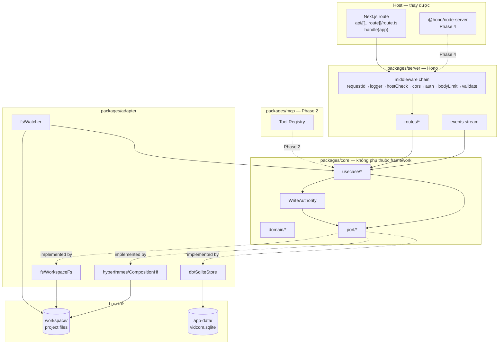
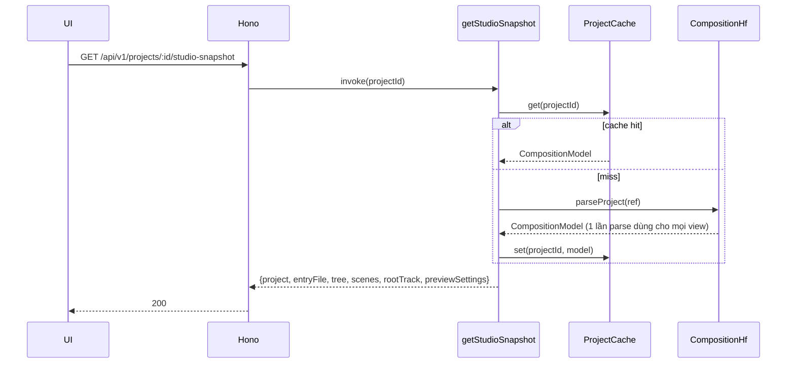
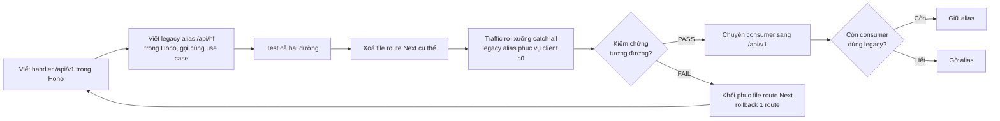
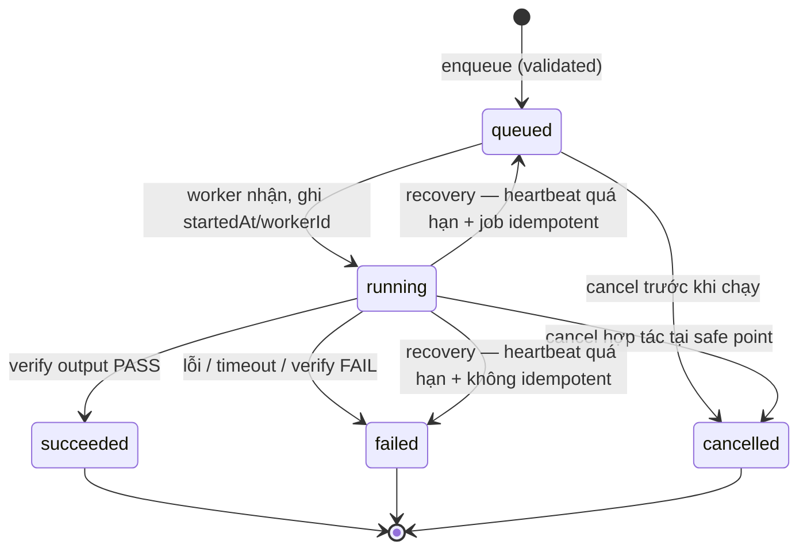
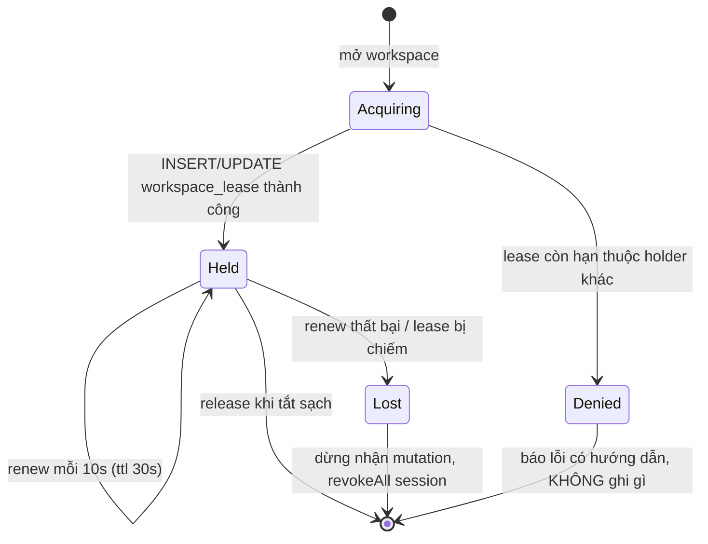
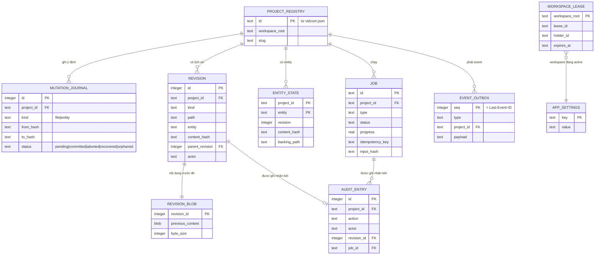
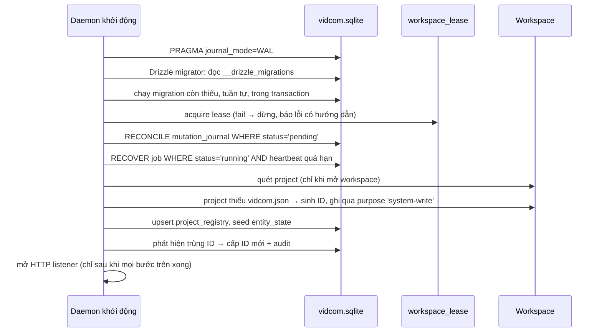

# Spec Core Backend Foundation — Detail Design

> **Reference**: [Detailed Goals](./spec-core-backend-foundation-detailed-goal.md) — duyệt 2026-08-01
> **Next**: [Implementation Checklist](./spec-core-backend-foundation-implementation-checklist.md) — đã duyệt và đang ở vòng remediation hậu review
> **Steering**: [00-index](../../../steering/00-index.md) · **Build order**: [15-build-order](../../../product-features/15-build-order.md) Phase 1

## 1. Overview

Spec này thay các dependency ngầm và đường I/O phân tán của bản mock bằng bốn hợp đồng kiểm thử được: **Application Core** với port/adapter, **một write authority duy nhất**, **perimeter bảo mật cho daemon local**, và **job/event infrastructure**. Không thêm capability sản phẩm.

Cách tiếp cận: dựng monorepo có import boundary cưỡng chế bằng lint; chuyển toàn bộ logic filesystem/HyperFrames từ `src/lib/hyperframes/*.server.ts` sang `packages/core` + `packages/adapter`; gắn Hono dưới optional catch-all của Next rồi **cắt chuyển từng route, đọc trước ghi sau**; mọi mutation đi qua một service duy nhất lo content hash, atomic write, revision, audit, invalidate và event.

Nguyên tắc chi phối: file project là source of truth (**P1**), preview settings không rewrite composition (**P2**), preview và render một code path (**P3**), đếm chứ không đoán (**P5**), optimistic concurrency mọi đường ghi (**P7**).

**Links to Requirements**:

| Requirement | Design element |
|---|---|
| R1 Package boundaries | §4.2, §5.1, Decision 1 |
| R2 Test harness | §11 |
| R3 Workspace identity | §5.3, §6.2, Decision 6 |
| R4 Ports & parse | §5.2, §5.4 |
| R5 Write authority | §5.5, §4.3.1, Decision 2, Decision 3 |
| R6 Path containment + allowlist | §5.6, Decision 9 |
| R7 Schema & error contract | §7, §8, §5.7 |
| R8 Auth perimeter | §5.8, §4.3.4, Decision 8 |
| R9 Hono cutover | §4.4, §7.11, Decision 4, Decision 16 |
| R10 Project list & snapshot | §7.2, §7.3, §4.3.2 |
| R11 Job foundation | §5.9, §4.5, §6.4 |
| R12 Event, watcher, cache | §5.10, §5.11, §4.3.3, Decision 7 |
| R13 Runtime compatibility | §4.6, §9.2 |

## 1.1 Thuật ngữ — đọc trước, tránh nhầm

Bốn cặp từ trong tài liệu này trông giống nhau nhưng là bốn thứ khác nhau. Nhầm một cặp là implement sai.

| Thuật ngữ | Nghĩa chính xác | **Đừng nhầm với** |
|---|---|---|
| **`revision`** (mutation) | `revision.id` — số tăng dần mỗi lần ghi thành công của một project | `narration.revision` trong payload TTS legacy — bộ đếm riêng của sidecar, có sẵn từ bản mock (§7.11) |
| **`revision`** (entity) | `entity_state.revision` — số tăng dần của **một entity**, tăng bởi cả mutation lẫn sửa đổi ngoài | `revision.id` ở trên. Client gửi `expectedRevision` cho entity là **cái này** |
| **`seq`** | `event_outbox.seq` — sequence **riêng** cho SSE, chính là `Last-Event-ID` | `revision.id`. Hai sequence độc lập; event không đến từ mutation vẫn có `seq` |
| **`contentHash`** | `sha256:<hex>` của **nội dung file** | `version` cũ dạng `mtimeBase36-sizeBase36` của bản mock — bị từ chối bằng `version_format_legacy` (§7.5) |
| **`file` mutation** vs **`entity` mutation** | `file` = ghi nguyên nội dung một file, precondition là `expectedContentHash`. `entity` = patch merge theo section, precondition là `expectedRevision` **và** hash file nền | Cả hai đi qua **cùng** `WriteAuthority.mutate()` và **cùng** đường atomic/journal/audit/event |
| **Xoá file route Next** | Chuyển **nơi phục vụ** từ Next sang Hono | Xoá **endpoint**. Hợp đồng giữ nguyên qua legacy alias (§4.4) |

## 2. Design Scope

### In Scope
- Cấu trúc package + ESLint boundary rules.
- Application Core: domain type, use case, port interface, `Result`/`DomainError`.
- Adapter: filesystem workspace, HyperFrames parse/SDK/preview, SQLite store.
- Write authority với content hash, atomic write, revision, audit, event.
- Canonical path resolver + allowlist phục vụ asset.
- Hono app + middleware chain + cutover cơ chế.
- `GET /api/v1/projects`, `GET /api/v1/projects/:id/studio-snapshot`, các route đọc/ghi cần cho mốc Phase 1.
- Job store SQLite, scheduler in-process, progress/cancel/recovery.
- SSE `/api/v1/events`, file watcher, cache invalidation.
- Test harness và CI gate.

### Out of Scope
- MCP tool set và protocol dual-stack — Phase 2, đã có [steering/13](../../../steering/13-mcp-protocol-compatibility.md).
- Render/TTS/snapshot **worker implementation** — Phase 3. Phase 1 chỉ dựng khung job và một job type giả lập để kiểm lifecycle.
- Bộ quy tắc sinh diagnostics — Phase 3. Phase 1 chỉ khai kiểu dữ liệu.
- Node SEA build, embed asset, sidecar extraction — Phase 4.
- Agent kit content — Phase 4.
- UI redesign; chỉ đổi nguồn dữ liệu từ RSC sang fetch.

## 3. Research Summary

### Finding 1: Bun `--compile` không load được native addon
- **Context**: D2 ban đầu chọn Bun standalone executable.
- **Key insight**: Executable Bun giải nén `.node` vào temp nhưng không đặt `libonnxruntime.1.21.1.dylib` cạnh nó nên `@rpath` fail; `sharp` cũng không load runtime `darwin-arm64`. Node SEA nhúng archive native có checksum chạy PASS cả cold extraction lẫn warm cache.
- **Source**: [spikes/phase-0/README.md](../../../../spikes/phase-0/README.md)
- **Impact**: §4.6 — mọi package production phải chạy trên Node; cấm Bun-only API. Decision 10.

### Finding 2: Route cụ thể của Next thắng optional catch-all
- **Context**: Kế hoạch cắt chuyển D4 phụ thuộc hoàn toàn vào giả định này.
- **Key insight**: Xác minh trên Next 16.2.12 — exact route trả `{"route":"exact"}`, hai URL còn lại rơi vào catch-all.
- **Source**: [spikes/phase-0/next-route-precedence](../../../../spikes/phase-0/README.md)
- **Impact**: §4.4 — cắt chuyển bằng cách **xoá file route Next**, không cần feature flag.

### Finding 3: SDK serialize lại toàn document
- **Context**: Mọi mutation qua `@hyperframes/sdk` đều rewrite file.
- **Key insight**: `serialize()` re-emit từ DOM: `<script>`/`<style>` giữ nội dung nhưng indentation bị chuẩn hoá và `data-hf-id` bị stamp vào mọi element. So `projects/warm-grain/index.html` (đã bị SDK ghi) với `projects/swiss-grid/index.html` (chưa) thấy rõ.
- **Source**: [11-parsing-logic](../../../product-features/11-parsing-logic.md) §7
- **Impact**: §11.2 — golden test `serialize()` là gate bắt buộc trước mọi thay đổi đường ghi (R2 AC2).

### Finding 4: `memoPerProject` đã tồn tại nhưng invalidate bằng stat toàn cây
- **Context**: Cần quyết định giữ hay thay cache hiện có.
- **Key insight**: Cả 5 read nặng đã được bọc; `projectFingerprint()` duyệt + `stat` toàn bộ cây mỗi lần gọi, và một byte đổi làm invalidate cả 5 cache.
- **Source**: [projects.server.ts:102-153](../../../../src/lib/hyperframes/projects.server.ts#L102)
- **Impact**: §5.11 — giữ hình dạng memo, đổi nguồn invalidate sang watcher event. Decision 7.

### Finding 5: Ba đường ghi hiện tại có mức bảo vệ khác nhau
- **Context**: R5 yêu cầu một write authority duy nhất.
- **Key insight**: `PUT /source` có `baseVersion` (mtime+size); `PATCH /scene` và `PATCH /preview-settings` **ghi đè im lặng**. `openProjectFile()` dùng `join()` không qua containment check.
- **Source**: [10-api-contract](../../../product-features/10-api-contract.md), [12-mock-vs-real](../../../product-features/12-mock-vs-real.md) #3, #11
- **Impact**: §5.5, §5.6 — write authority và path resolver là hai thành phần bắt buộc trước khi migrate bất kỳ route ghi nào.

## 4. Architecture

### 4.1 System Overview

Bốn tầng, phụ thuộc một chiều: `contracts` (lá) ← `core` ← `adapter` ← composition root. Hai adapter transport (`server`, `mcp`) ngang hàng, cùng gọi use case. Phase 1 chỉ dựng `server`; `mcp` chỉ có skeleton + boundary để Phase 2 điền vào.

Next.js không còn là một tầng — nó là host tạm thời của Hono app qua `hono/vercel`, thay được bằng `@hono/node-server` mà không sửa code trong app.

### 4.2 Component Diagram



**Ranh giới không hiển nhiên**: `WriteAuthority` nằm **trong** Core chứ không phải adapter — nó chứa quyết định nghiệp vụ (precondition nào áp cho loại mutation nào, thứ tự revision/audit/event), chỉ uỷ thác I/O thô xuống port.

### 4.3 Data Flow

#### 4.3.1 Write path — đường quan trọng nhất

```mermaid
sequenceDiagram
    participant C as Client
    participant H as Hono route
    participant U as UseCase
    participant W as WriteAuthority
    participant L as LeasePort
    participant F as WorkspacePort
    participant J as MutationJournalPort
    participant E as EventOutbox

    C->>H: PUT /api/v1/projects/:id/files<br/>{path, content, expectedContentHash}
    H->>H: validate schema (zod, contracts)
    H->>U: saveSourceFile(input)
    U->>W: mutate(req, actor)
    W->>L: assertHeld(workspace)
    alt lease không còn giữ
        W-->>U: Err(workspace_lease_lost)
    end
    W->>W: acquire in-process mutex(projectId)
    W->>F: resolve(ref, path, "write-source")
    F-->>W: ResolvedPath | PathRejection
    W->>F: readHash(resolved)
    alt hash lệch expectedContentHash
        W->>F: read(resolved)
        W-->>U: Err(write_conflict + current)
    end

    rect rgb(240,240,240)
    note over W,J: Giai đoạn 1 — ghi ý định TRƯỚC khi đụng filesystem
    W->>J: begin(intent{projectId, kind, path, fromHash, toHash, actor})<br/>INSERT mutation_journal status='pending'
    J-->>W: journalId
    end

    W->>F: writeTemp → fsync → rename(resolved)

    rect rgb(240,240,240)
    note over W,J: Giai đoạn 2 — MỘT transaction
    W->>J: commit(journalId, outcome)<br/>BEGIN; journal→'committed'; INSERT revision;<br/>INSERT audit_entry; INSERT event_outbox; COMMIT
    end

    W->>W: invalidate cache(projectId)
    W->>E: đánh thức SSE reader (event đã nằm trong outbox)
    W-->>U: Ok(FileContent + revision)
    H-->>C: 200 {file, revision, diagnostics: []}
```

**Thứ tự bất biến** (sửa sau review — trước đây rename trước khi ghi DB nên crash ở giữa để lại file đã đổi mà không có revision/audit):

1. `assertHeld` lease — không giữ lease thì không ghi.
2. Mutex in-process theo `projectId` — chống race trong cùng daemon.
3. Resolve + kiểm precondition.
4. **`mutation_journal` INSERT `pending`** — ghi ý định *trước* khi đụng filesystem.
5. Atomic write (temp → fsync → rename).
6. **Một transaction**: journal→`committed` + `revision` + `audit_entry` + `event_outbox`.
7. Invalidate cache, đánh thức SSE.

Filesystem và SQLite là hai hệ thống — **không thể** atomic tuyệt đối với nhau. Journal biến "không atomic" thành "phát hiện và hoà giải được": mọi crash boundary để lại một dòng `pending` mà §6.5 reconciliation xử lý lúc khởi động.

| Crash tại | Trạng thái để lại | Reconciliation |
|---|---|---|
| Sau bước 4, trước 5 | journal `pending`, file **chưa** đổi | hash thực = `fromHash` → đánh `aborted` |
| Giữa bước 5 | journal `pending`, file là bản cũ hoàn chỉnh (rename atomic) | như trên |
| Sau 5, trước 6 | journal `pending`, file **đã** đổi | hash thực = `toHash` → hoàn tất revision + audit, đánh `recovered`, emit event trễ |
| Giữa transaction 6 | SQLite tự rollback | như hàng trên |

#### 4.3.2 Studio snapshot — thay RSC filesystem read



`CompositionModel` là **một** kết quả parse dùng chung cho `project`, `scenes`, `rootTrack` — thay vì 5 hàm memo riêng như hiện nay.

#### 4.3.3 External edit → watcher → client

```mermaid
sequenceDiagram
    participant Ext as Editor/CLI ngoài
    participant W as Watcher
    participant Cache
    participant E as EventBus
    participant UI

    Ext->>W: file thay đổi trên đĩa
    W->>W: debounce 150ms
    W->>W: đọc hash; so với lastWrittenHash
    alt hash trùng lần ghi của chính ta
        W->>W: bỏ qua (chống event loop)
    else
        W->>Cache: invalidate(projectId)
        W->>E: nếu file này backing một entity:<br/>UPDATE entity_state SET revision=revision+1,<br/>content_hash=<mới>, actor='cli-external'
        W->>E: INSERT event_outbox file.changed {source:"external"}
        E-->>UI: SSE event
        UI->>UI: đánh dấu snapshot stale
    end
```

**Entity revision phải nhích theo sửa đổi ngoài** (sửa sau review). Trước đây watcher chỉ invalidate cache, nên một lần sửa `preview-settings.json` bằng editor ngoài để `entity_state.revision` nguyên vẹn — client giữ `expectedRevision` cũ vẫn ghi đè được thay đổi đó.

Ràng buộc: `entity_state` lưu **cả** `revision` **và** `content_hash` của file nền. Entity mutation kiểm **hai** điều kiện — `expectedRevision` khớp **và** `content_hash` lưu trong DB còn khớp file thật. Lệch một trong hai → `write_conflict`. Điều này giữ đúng ngay cả khi watcher chưa kịp chạy (race giữa sửa ngoài và patch).

File nền của entity trong Phase 1: `preview-settings.json` → entity `preview-settings`.

Để phân biệt event của atomic write nội bộ với sửa ngoài, `WriteAuthority` gọi observer `recordWrittenHash(projectId, path, hash)` ngay sau journal commit. Watcher debounce rồi consume đúng hash một lần, đồng thời nhớ hash đã quan sát để gộp nhiều notification cùng nội dung; sibling temp `.<name>.<uuid>.tmp` của atomic writer bị bỏ qua. Đây là observer wiring ở composition root, không mở thêm quyền ghi filesystem cho Core.

#### Khi entity chưa có dòng `entity_state`

Nhiều project hiện có **chưa** có `preview-settings.json`. Quy ước để dev không phải đoán:

| Tình huống | `entity_state` | Client gửi | Server làm |
|---|---|---|---|
| Project mở lần đầu, **có** `preview-settings.json` | backfill seed `revision = 1`, `content_hash` = hash file | `expectedRevision: 1` | bình thường |
| Project mở lần đầu, **không có** file | backfill seed `revision = 0`, `content_hash` = hash của bản normalize mặc định | `expectedRevision: 0` | patch đầu tiên **tạo** file, revision → 1 |
| Client gửi `expectedRevision` ≠ giá trị hiện tại | — | — | `409 write_conflict` |

`revision = 0` nghĩa là "entity tồn tại về mặt logic với giá trị mặc định, chưa có file". `GET /preview-settings` ở trạng thái này trả `DEFAULT_PREVIEW_SETTINGS` đã normalize kèm `revision: 0` — client luôn có số để gửi lại, không bao giờ phải đoán.

#### 4.3.4 Auth handshake

```mermaid
sequenceDiagram
    participant CLI as vidcom app
    participant B as Browser
    participant H as Hono

    CLI->>CLI: sinh nonce (32 byte random, TTL 60s, một lần)
    CLI->>B: mở http://127.0.0.1:PORT/?t=<nonce>
    B->>H: POST /api/v1/auth/exchange {nonce}
    H->>H: hostCheck → cors → verify nonce (còn hạn, chưa dùng)
    H->>H: đánh dấu nonce đã dùng
    H->>H: MINT token MỚI (32 byte random)<br/>lưu sha256(token) + expiresAt vào SessionStore
    H-->>B: Set-Cookie vidcom_session=<token><br/>HttpOnly; SameSite=Strict; Path=/
    B->>B: history.replaceState xoá ?t= khỏi URL
    B->>H: mọi request sau dùng cookie
    H->>H: mỗi request: sha256(cookie) → lookup → kiểm expiry → gia hạn idle
```

**Session không bao giờ tái dùng nonce** (sửa sau review). Nonce chỉ để chứng minh "người mở browser là người chạy CLI"; token phiên là giá trị mới, độc lập. Chi tiết vòng đời ở §5.8.

### 4.4 Cutover flow



**Sửa sau review**: xoá file route Next **không** đồng nghĩa xoá endpoint. Mỗi route được xoá khỏi Next phải có **legacy alias trong Hono** gọi cùng use case, giữ nguyên đường dẫn và hình dạng cũ, cho tới khi mọi consumer đã chuyển và tương đương được kiểm chứng (R9 AC4). Xoá file Next chỉ chuyển **nơi phục vụ**, không đổi **hợp đồng**.

#### Ma trận tương thích route

| # | Route hiện tại | Consumer | Endpoint `/api/v1` thay thế | Legacy alias trong Hono | Điều kiện gỡ alias |
|---|---|---|---|---|---|
| 1 | `GET /api/hf/runtime` | preview document (`<script src>`) | `GET /api/v1/runtime` | **có** — document do ta sinh vẫn trỏ đường cũ tới khi builder đổi | builder dùng URL mới |
| 2 | `GET /api/hf/:slug/files/*` | `<base href>` trong preview, `` storyboard, BGM | `GET /api/v1/projects/:id/assets/*` | **có** — `<base href>` nằm trong document đã sinh | builder đổi base + snapshot cũ hết hạn |
| 3 | `GET /api/hf/:slug/preview` | `<hyperframes-player src>` | `GET /api/v1/projects/:id/preview` | **có** | UI đổi `previewUrl` |
| 4 | `GET /api/hf/:slug/source` | editor mở file | `GET /api/v1/projects/:id/files?path=` | không cần alias trong Hono — nhưng **file Next còn sống tới Phase N** vì chứa `PUT` | — |
| 5 | `GET/PATCH/POST /api/hf/:slug/preview-settings` | preview editor, timeline eye toggle | `GET/PATCH /api/v1/.../preview-settings`, `POST /api/v1/.../assets/bgm` | không cần alias — nhưng **file Next còn sống tới Phase N** vì chứa `PATCH`+`POST` | — |
| 6 | RSC đọc filesystem | trang studio, trang home | `GET /api/v1/projects`, `.../studio-snapshot` | n/a | — |
| 7 | `PUT /api/hf/:slug/source` | editor save | `PUT /api/v1/projects/:id/files` | không cần — đổi cùng lúc với client (R5 AC3b) | — |
| 8 | `PATCH /scene {action:"timing"}` | scene timing form | `PATCH /api/v1/projects/:id/scenes/:sceneId` | không cần | — |
| 9 | `PATCH /scene {action:"script"}` | script editor autosave | `PATCH /api/v1/.../scenes/:sceneId/script` | không cần | — |
| 10 | `PATCH /scene {action:"tts"}` | nút Regenerate TTS | **không có** — TTS thật là Phase 3 | **có, bắt buộc** — hành vi mock giữ nguyên, nhưng ghi qua WriteAuthority | Phase 3 giao endpoint job TTS |
| 11 | `PATCH /scene {action:"generate"}` | AI Composer | **không có** — agent thật là Phase 6 | **có, bắt buộc** — `createScene` giữ nguyên, ghi qua WriteAuthority | Phase 2/6 giao tool tương ứng |

**Hàng 10 và 11 là lý do không được xoá endpoint.** `tts` và `generate` không có endpoint `/api/v1` tương đương trong Phase 1 vì replacement thuộc phase sau. Xoá chúng làm gãy nút *Regenerate TTS* và cả tab AI Composer. Chúng chuyển sang Hono dưới **đúng đường dẫn cũ**, giữ hành vi cũ, nhưng đường ghi bên dưới đã đi qua WriteAuthority.

#### Đơn vị cắt chuyển là FILE, không phải route

Ba route file của Next chứa **nhiều method**. Xoá file để cắt một `GET` sẽ xoá luôn handler ghi nằm cùng file.

| File route Next | Method trong file | Xoá ở |
|---|---|---|
| `runtime/route.ts` | `GET` | **Phase K** |
| `[slug]/preview/route.ts` | `GET` | **Phase K** |
| `[slug]/files/[...path]/route.ts` | `GET` | **Phase K** |
| `[slug]/source/route.ts` | `GET` + **`PUT`** | **Phase N** |
| `[slug]/preview-settings/route.ts` | `GET` + **`PATCH`** + **`POST`** | **Phase N** |
| `[slug]/scene/route.ts` | `PATCH` (4 action) | **Phase N** |

**Quy tắc**: một file chỉ được xoá khi **mọi** method trong nó đã có tương đương đã verify. Với file hỗn hợp, Phase K vẫn thêm endpoint `/api/v1` cho phần đọc và **chuyển UI sang dùng nó**, nhưng **giữ file Next** để nó tiếp tục phục vụ phần ghi cho tới Phase N.

> Trong cửa sổ K → N, cùng một dữ liệu có hai đường đọc: `/api/v1/...` (Hono, UI dùng) và `/api/hf/...` (Next, còn sống vì cùng file với write handler). Cả hai gọi **cùng use case**, nên không lệch hành vi. Đây là trạng thái tạm thời có chủ đích, không phải hai implementation.

Trong đúng cửa sổ này, GET mới cung cấp `contentHash` SHA-256 cho editor nhưng PUT legacy chưa bị xoá. Compatibility PUT legacy chấp nhận cả `mtime-size` của client cũ và SHA-256 của client đã đọc qua v1; endpoint PUT v1 ở Phase N vẫn từ chối `mtime-size` bằng `version_format_legacy`. Cầu nối này giữ studio ghi được sau K mà không nới hợp đồng v1.

**Thứ tự thực thi**: xem [Implementation Checklist](./spec-core-backend-foundation-implementation-checklist.md) Phase K (3 file GET-only) rồi Phase N (3 file còn lại). Checklist là nguồn sự thật cho thứ tự; bảng ma trận ở trên là nguồn sự thật cho **hợp đồng** của từng route.

Bước đổi `PUT /source` là chỗ client đổi `baseVersion` mtime+size → content hash; UI và server đổi trong **cùng một** bước (N.1 + N.2).

### 4.5 Job lifecycle



### 4.6 Technology Stack

| Layer | Technology | Rationale |
|---|---|---|
| HTTP | Hono | Trùng studio server chính thức của HyperFrames (`hyperframes/dist/studio/index.js` import `hono`) |
| Host dev | `hono/vercel` trong Next Route Handler | Cùng `app` object chạy được cả hai host, không port lại ở Phase 4 |
| Host prod | `@hono/node-server` trong Node SEA | Phase 0 loại Bun; Decision 10 |
| Runtime | Node 24 LTS | Native addon PASS; `hyperframes` CLI khai `engines: node >=22` |
| Datastore | SQLite (WAL) qua **`node:sqlite`** built-in | Không thêm native addon vào đường đóng gói SEA — Decision 11 |
| Query layer | **Drizzle ORM 1.0.0-rc.4** + Drizzle Kit, driver `node:sqlite` | Schema TypeScript là nguồn sự thật, query/transaction type-safe, migration SQL kiểm tra được — Decision 17 |
| Parse HTML | `linkedom` — đúng một bản | Hai bản = hai `DOMParser` implementation |
| Composition | `@hyperframes/{core,sdk,studio-server,parsers}` | Giữ nguyên, pin exact version |
| Validation | **zod** (v4), dùng chung HTTP + MCP | zod đã vào cây qua MCP SDK; chọn khác = hai thư viện schema trong bundle — Decision 12 |
| Hash | `node:crypto` sha256 | Decision 2 |
| File watch | `node:fs.watch` (recursive) + debounce | Không thêm dependency; recursive được hỗ trợ trên macOS/Windows, Linux từ Node 20 |

`CompositionRootConfig.nativeDependenciesRoot` là contract inject đường dẫn sidecar đã extract cho Phase 4. Phase 1 chưa có native worker để consume giá trị này, nhưng không package nào được suy đường dẫn từ `process.cwd()`, `import.meta.dirname` hay vị trí source checkout.

## 5. Components and Interfaces

### 5.1 `packages/contracts`
- **Purpose**: Nguồn sự thật duy nhất cho mọi shape đi qua boundary.
- **Nội dung**: HTTP DTO, MCP tool schema (Phase 2), `ErrorCode` enum, `Diagnostic` type, domain event payload, `SUPPORTED_PROTOCOL_VERSIONS`.
- **Dependencies**: không có. Lá của dependency graph.
- **Lifecycle**: pure module.

### 5.2 Port interfaces (`packages/core/port`)

```ts
/**
 * Đường dẫn đã được resolve và cho phép. Branded type — CHỈ `WorkspacePort.resolve()`
 * tạo ra được. Mọi method đọc/ghi nhận kiểu này thay vì string, nên không tồn tại
 * đường vòng qua resolver ở mức kiểu dữ liệu.
 */
export type ResolvedPath = string & { readonly __brand: "ResolvedPath" };

export type PathRejection =
  | { reason: "outside_project" } | { reason: "not_allowed_for_purpose" }
  | { reason: "symlink_escape" }  | { reason: "invalid_syntax" };

export type WritePurpose = "write-source" | "write-asset" | "system-write";
export type ReadPurpose  = "read-source"  | "read-asset";
export type PathPurpose  = ReadPurpose | WritePurpose;

/** Truy cập filesystem của workspace. Resolver sống Ở ĐÂY, không ở Core. */
export interface WorkspacePort {
  /**
   * Resolve + kiểm containment + áp allowlist. Trả capability hoặc lý do từ chối.
   *
   * Xử lý được **target chưa tồn tại** (tạo file mới): realpath tổ ancestor gần
   * nhất đang tồn tại, kiểm containment trên đó, rồi nối phần còn lại. Không
   * realpath thẳng target — làm vậy sẽ fail mọi lần tạo file.
   */
  resolve(ref: ProjectRef, path: string, purpose: PathPurpose):
    Promise<{ ok: true; value: ResolvedPath } | { ok: false; error: PathRejection }>;

  listProjects(): Promise<ProjectRef[]>;
  readProjectRef(id: ProjectId): Promise<ProjectRef | null>;
  /** `null` = file không tồn tại. Ném lỗi chỉ khi filesystem hỏng. */
  readFile(p: ResolvedPath): Promise<FileContent | null>;
  /** Đọc asset dạng bytes, không ép UTF-8; `null` = file không tồn tại. */
  readBytes(p: ResolvedPath): Promise<BinaryContent | null>;
  /** sha256 nội dung hiện tại; `null` = file không tồn tại. */
  readHash(p: ResolvedPath): Promise<ContentHash | null>;
  /** temp cùng filesystem → fsync → rename. Không kiểm precondition — WriteAuthority lo. */
  writeAtomic(p: ResolvedPath, content: string | Uint8Array): Promise<void>;
  readTree(ref: ProjectRef): Promise<FileNode[]>;
  stat(p: ResolvedPath): Promise<FileStat | null>;
}

/**
 * Phần THUẦN của chính sách đường dẫn — sống trong Core, không I/O.
 * Adapter gọi hàm này rồi mới làm phần realpath/stat.
 */
export interface PathPolicy {
  /** Kiểm cú pháp: absolute path, segment `..`, ký tự cấm. Không chạm đĩa. */
  checkSyntax(path: string): PathRejection | null;
  /** Allowlist theo purpose. Không chạm đĩa. */
  checkPurpose(path: string, purpose: PathPurpose): PathRejection | null;
}

/** Parse và biến đổi composition HyperFrames. */
export interface CompositionPort {
  /** Parse một lần, trả model dùng chung cho project/scenes/rootTrack. Đắt — gọi qua cache. */
  parseProject(ref: ProjectRef): Promise<CompositionModel>;
  /** Dựng document preview. ĐÂY LÀ ĐƯỜNG DUY NHẤT (P3) — render Phase 3 dùng lại. */
  buildDocument(ref: ProjectRef, settings: PreviewSettings,
    opts: { root: boolean; runtimeUrl?: string; fileBaseUrl?: string }): Promise<string>;
  /** Áp op qua SDK rồi trả HTML đã serialize. KHÔNG ghi đĩa — WriteAuthority ghi. */
  applyOps(ref: ProjectRef, file: RelPath, ops: CompositionOp[]): Promise<Result<string, DomainError>>;
}

/**
 * Unit of work cho một mutation. Thay cho RevisionPort + AuditPort tách rời —
 * hai port riêng KHÔNG bảo đảm được một transaction.
 */
export interface MutationJournalPort {
  /** INSERT mutation_journal status='pending'. Gọi TRƯỚC khi đụng filesystem. */
  begin(intent: MutationIntent): Promise<JournalId>;
  /**
   * MỘT transaction, ghi ĐÚNG các bảng sau, không thiếu bảng nào:
   *   mutation_journal → 'committed'
   *   revision                (luôn)
   *   revision_blob           (luôn; previous_content = NULL khi tạo file mới)
   *   entity_state            (chỉ khi kind='entity')
   *   audit_entry             (luôn)
   *   event_outbox            (luôn — đây là nơi DUY NHẤT ghi event của mutation)
   * Trả revision đã cấp.
   */
  commit(id: JournalId, result: MutationResult): Promise<number>;
  /** journal→'aborted' + audit_entry. Dùng khi precondition fail sau khi đã begin. */
  abort(id: JournalId, reason: ErrorCode): Promise<void>;
  /** Journal còn 'pending' lúc khởi động — đầu vào của reconciliation §6.5. */
  listPending(): Promise<PendingMutation[]>;
  /** Revision mutation mới nhất của project; `null` = chưa từng commit. */
  latestRevision(projectId: ProjectId): Promise<number | null>;
  /** State phục vụ precondition entity; `null` = bootstrap chưa seed. */
  readEntityState(projectId: ProjectId, entity: "preview-settings"):
    Promise<EntityState | null>;
  /** Lookup identity registry để phân biệt move và duplicate. */
  findProjectRegistration(projectId: ProjectId): Promise<ProjectRegistration | null>;
  /** Upsert registry + seed entity khi không cần ghi lại identity file. */
  registerProject(registration: ProjectRegistration, seed: EntitySeed): Promise<void>;
  /** Transaction A của bootstrap: registry trước, entity seed, rồi journal pending. */
  beginBootstrap(registration: ProjectRegistration, seed: EntitySeed,
    intent: MutationIntent, duplicateFrom: ProjectId | null): Promise<JournalId>;
}

/** Lease chéo process cho một workspace. Chi tiết §5.12. */
export interface LeasePort {
  acquire(workspaceRoot: AbsolutePath, holderId: string, ttlMs: number):
    Promise<{ ok: true; leaseId: string } | { ok: false; heldBy: LeaseInfo }>;
  renew(leaseId: string): Promise<boolean>;
  release(leaseId: string): Promise<void>;
  /**
   * `false` = lease không còn thuộc về ta. WriteAuthority gọi trước mỗi mutation
   * và tự map thành `Err(workspace_lease_lost)` — port KHÔNG throw, để nhất quán
   * với quy ước `Result` của Core (§8).
   */
  assertHeld(leaseId: string): Promise<boolean>;
}

/** Phiên đăng nhập local. In-memory, mất khi daemon restart — có chủ đích (§5.8). */
export interface SessionPort {
  /** `absoluteTtlMs` 12h, `idleTtlMs` 2h (§5.8). Token thô chỉ tồn tại ở giá trị trả về. */
  mint(o: { absoluteTtlMs: number; idleTtlMs: number }): { token: string };
  verify(token: string): { valid: boolean; renewed: boolean };
  revokeAll(): void;
}

/**
 * Event bền vững, nguồn duy nhất cho SSE và `Last-Event-ID`.
 *
 * Port này CHỈ phục vụ event sinh NGOÀI mutation (watcher external, job
 * progress). Event sinh TRONG mutation do `MutationJournalPort.commit()` ghi
 * cùng transaction — port này không có method nhận transaction, vì kiểu
* transaction của Drizzle không được rò vào Core.
 */
export interface EventOutboxPort {
  /** Append ngoài mutation. Transaction riêng. */
  append(e: DomainEvent): Promise<number>;
  /** Đọc từ seq, cho SSE resume. `gap: true` = ngoài retention, client phải resync. */
  readFrom(seq: number, limit: number): Promise<{ events: StoredEvent[]; gap: boolean }>;
  latestSeq(): Promise<number>;
}

export interface JobStorePort {
  /** Trả job cũ khi (projectId, type, idempotencyKey, inputHash) trùng. */
  enqueue(job: NewJob): Promise<{ job: Job; reused: boolean } | { conflict: "idempotency_key_reused" }>;
  get(id: JobId): Promise<Job | null>;
  /** UPDATE … WHERE id=? AND status='queued'; false nếu worker khác đã nhận. */
  claim(id: JobId, workerId: string): Promise<boolean>;
  /** Bỏ qua các cặp project/type đang active để không gây head-of-line blocking. */
  nextQueued(types: string[], excluded: readonly { projectId: ProjectId; type: string }[]): Promise<Job | null>;
  updateProgress(id: JobId, progress: number, stage: string | null): Promise<void>;
  heartbeat(id: JobId): Promise<void>;
  finish(id: JobId, outcome: JobOutcome): Promise<void>;
  requestCancel(id: JobId): Promise<void>;
  /** Đọc cờ huỷ bền vững tại cooperative safe point. */
  isCancellationRequested(id: JobId): Promise<boolean>;
  /** Requeue duy nhất job running stale được recovery xác định là idempotent. */
  requeue(id: JobId): Promise<void>;
  /** running + heartbeat quá hạn — đầu vào recovery lúc khởi động. */
  listStale(cutoff: Date): Promise<Job[]>;
}

export interface ClockPort { now(): Date; }
export interface IdPort { newId(prefix: string): string; }
```

`ClockPort` và `IdPort` **bắt buộc** — `new Date()`/random trong Core làm golden test vô dụng (R2 AC4).

Các method registry/entity bootstrap nằm trên cùng `MutationJournalPort` vì bootstrap phải ghi registry + entity seed + pending journal trong **một transaction** để thoả FK trước filesystem write. Không tách port thứ mười: làm vậy vừa phá danh sách 9 port đã duyệt, vừa làm mất transaction boundary của unit-of-work.

### 5.3 `WorkspaceResolver` (Core)
- **Purpose**: Quyết định workspace root, một lần, ở composition root.
- **Thứ tự**: `--workspace` tường minh → active trong `settings.json` → cwd **chỉ khi** có project marker hợp lệ → yêu cầu người dùng chọn.
- **Không bao giờ**: tự tạo hoặc đoán thư mục (R3 AC2).
- **Lifecycle**: giá trị bất biến, inject xuống mọi adapter.

### 5.4 `CompositionHf` adapter
- **Purpose**: Implement `CompositionPort` bằng `linkedom` + `@hyperframes/*`.
- **Chuyển từ**: `src/lib/hyperframes/{projects,scenes,scene-elements,root-track,composition-root,sdk}.server.ts` — **giữ nguyên thuật toán**, chỉ đổi chỗ ở và bỏ `process.cwd()`.
- **Sửa hai chỗ khi chuyển**:
  - Root host xác định bằng `nearestHost(node) === null` thay vì "phần tử đầu có width+height" ([11-parsing-logic](../../../product-features/11-parsing-logic.md) §10.2).
  - Element key fallback `tag:rows.size` → path trong DOM tree (§10.3).
- **DOMParser shim**: cài **một lần** ở entry của adapter này, không rải.

### 5.5 `WriteAuthority` (Core) — thành phần trung tâm của R5

```ts
export type MutationRequest =
  | { kind: "file"; ref: ProjectRef; path: RelPath;
      content: string | Uint8Array; expectedContentHash: ContentHash | null }
  | { kind: "entity"; ref: ProjectRef; entity: "preview-settings";
      patch: PreviewSettingsPatch; expectedRevision: number };

export interface WriteResult {
  path: RelPath | null;
  contentHash: ContentHash;
  revision: number;
  diagnostics: Diagnostic[];   // Phase 1: luôn []
}

/**
 * Đường ghi DUY NHẤT lên workspace. Use case MUST gọi hàm này, MUST NOT gọi
 * `WorkspacePort.writeAtomic` trực tiếp.
 *
 * Thứ tự bất biến — 7 bước, KHÔNG được đảo (chi tiết và bảng crash boundary ở §4.3.1):
 *   1. lease.assertHeld()          — không giữ lease thì không ghi
 *   2. acquire mutex(projectId)    — chống race trong cùng daemon
 *   3. resolve + kiểm precondition — hash/revision
 *   4. journal.begin()             — GHI Ý ĐỊNH TRƯỚC KHI ĐỤNG FILESYSTEM
 *   5. writeAtomic()               — temp → fsync → rename
 *   6. journal.commit()            — MỘT transaction, xem MutationJournalPort.commit
 *   7. invalidate cache, đánh thức SSE reader
 *
 * Bước 4 đứng trước bước 5 là điểm mấu chốt: filesystem và SQLite không atomic
 * với nhau được, nên journal là thứ duy nhất biến crash ở giữa thành trạng thái
 * hoà giải được lúc khởi động.
 *
 * Lỗi trước khi `writeAtomic()` hoàn tất, sau khi đã begin → gọi
 * `journal.abort()`, không bỏ dở dòng `pending`. Nếu filesystem đã ghi xong
 * nhưng `journal.commit()` lỗi thì GIỮ `pending` để startup reconciliation
 * hoàn tất; không abort một intent có target đã đổi.
 */
export async function mutate(
  deps: WriteDeps,
  req: MutationRequest,
  actor: Actor,
): Promise<Result<WriteResult, DomainError>>;
```

**`WriteResult` cho từng loại mutation:**

| Field | `kind: "file"` | `kind: "entity"` |
|---|---|---|
| `path` | đường dẫn file đã ghi | `null` |
| `contentHash` | sha256 nội dung mới của file | sha256 nội dung mới của **file nền** (`preview-settings.json`) |
| `revision` | `revision.id` vừa cấp | `entity_state.revision` sau khi tăng |

| Loại | Precondition | Nguồn revision |
|---|---|---|
| `file` | `expectedContentHash` khớp sha256 hiện tại | tăng theo project |
| `entity` | `expectedRevision` khớp `entity_state.revision` **và** `entity_state.content_hash` còn khớp file nền | tăng theo entity |

`expectedContentHash: null` chỉ hợp lệ khi tạo file mới; file đã tồn tại mà gửi `null` → `precondition_required`.

**Ba tầng chống ghi đồng thời** (sửa sau review — mutex một mình không đủ):

| Tầng | Chống | Cơ chế |
|---|---|---|
| 1. Workspace lease | Hai **daemon** cùng sở hữu workspace | `LeasePort.assertHeld()` trước mỗi mutation (§5.12) |
| 2. Mutex in-process | Hai **request** trong cùng daemon | mutex theo `projectId`, bao từ đọc hash tới rename |
| 3. Content hash / revision | Sửa đổi từ **bên ngoài** hoặc client cũ | precondition ở bảng trên |

Tầng 1 là cái review chỉ ra thiếu: không có nó, hai daemon cùng đọc một hash, cùng qua validation, cùng ghi — mutex process-local không thấy nhau.

**Journal**: mọi mutation ghi ý định vào `mutation_journal` **trước** khi đụng filesystem, và revision/audit/event chỉ được persist trong một transaction sau khi rename xong (§4.3.1). Đây là cách duy nhất phát hiện được crash giữa hai hệ thống lưu trữ.

### 5.6 Path resolution — `PathPolicy` (Core, thuần) + `WorkspacePort.resolve` (adapter)

**Sửa sau review**: bản trước đặt resolver trong Core nhưng nó gọi `realpath()` — vi phạm R1 AC2 (Core cấm chạm Node filesystem). Tách làm hai:

| Phần | Ở đâu | Làm gì |
|---|---|---|
| `PathPolicy.checkSyntax` | **Core**, thuần | từ chối absolute path, segment `..`, ký tự cấm |
| `PathPolicy.checkPurpose` | **Core**, thuần | allowlist theo purpose |
| `WorkspacePort.resolve` | **adapter/fs** | join, canonicalize, realpath, kiểm containment, trả `ResolvedPath` |

`ResolvedPath` là **branded type chỉ adapter tạo được**, và mọi method đọc/ghi nhận kiểu đó. Nghĩa là đường vòng qua resolver bị chặn **ở mức kiểu dữ liệu**, không phải bằng kỷ luật review.

`WorkspacePort.resolve` MUST chạy `PathPolicy.checkPurpose` **hai lần**: trên đường dẫn client gửi trước khi I/O, và trên đường dẫn project-relative suy từ canonical target sau `realpath`. Chỉ kiểm input là không đủ: `assets/evil.png` có thể là symlink nội-project trỏ tới `package.json`; containment vẫn đúng nhưng target thật bị allowlist cấm.

**Xử lý target chưa tồn tại** (bản trước fail khi tạo file mới, dù `expectedContentHash: null` cho phép tạo): realpath **tổ ancestor gần nhất đang tồn tại**, kiểm containment trên đó, rồi nối phần đuôi còn lại. Đồng thời kiểm mọi ancestor không phải symlink trỏ ra ngoài.

**Allowlist theo `purpose`** (R6 AC5–AC7):

| purpose | Cho phép | Ai gọi |
|---|---|---|
| `read-asset` | **Hai điều kiện AND**: (a) thư mục — `assets/**`, `compositions/**`, `snapshots/**`, `narration/**`, `preview-assets/**`, `renders/**`, hoặc đúng `index.html`; (b) đuôi nằm trong danh sách cho phép — `html htm css js mjs json svg png jpg jpeg webp avif gif mp4 webm mov mp3 wav ogg m4a woff woff2 ttf otf`. MIME suy **từ đuôi**, không từ nội dung do client kiểm soát | route asset, preview builder |
| `read-source` | đuôi `html css js mjs ts json md txt py svg` | source editor |
| `write-source` | đuôi `html css js mjs ts json md txt py svg`, **trừ** `hyperframes.json`, `vidcom.json`, `preview-settings.json`, và **trừ toàn bộ `narration/**`** (do `system-write` sở hữu) | source editor |
| `write-asset` | `assets/**`, `preview-assets/bgm/**`, `narration/**`, `snapshots/**`, `renders/**` | upload BGM, output của job |
| `system-write` | `vidcom.json`, `preview-settings.json`, `narration/*.json` | **chỉ Core use case nội bộ** — backfill ID, entity mutation. Không route nào nhận path từ client rồi dùng purpose này |

`write-asset` và `system-write` là hai purpose bản trước thiếu, gây mâu thuẫn: `write-source` cấm `vidcom.json` trong khi §6.5 backfill lại ghi chính file đó, buộc phải có đường ghi thứ hai — đúng cái R5 AC1 cấm.

Mọi purpose **luôn** chặn: dotfile, `.env*`, `package.json`, `AGENTS.md`, `CLAUDE.md`, `node_modules/**`, `.git/**`, `.hyperframes/**`.

#### Mapping `PathRejection` → `ErrorCode` → HTTP

Bảng này là **bắt buộc**, không để adapter tự chọn:

| `PathRejection.reason` | `ErrorCode` | HTTP | Message gửi client |
|---|---|---|---|
| `invalid_syntax` | `path_invalid` | 400 | "path is not a valid project-relative path" |
| `outside_project` | `path_outside_project` | 403 | "path resolves outside the project" |
| `symlink_escape` | `path_outside_project` | 403 | **cùng message với trên** — không tiết lộ có symlink |
| `not_allowed_for_purpose` | `asset_not_allowed` | 403 | "this file is not served" |

Bốn message trên **không** tiết lộ file có tồn tại hay không, và `asset_not_allowed` **phân biệt được** với `not_found` ở mã máy đọc trong khi vẫn không rò thông tin qua văn bản.

### 5.7 Error mapping middleware
- **Purpose**: Nơi **duy nhất** biết `ErrorCode` → HTTP status.
- Core không biết status code (R7 AC4).

### 5.8 Auth middleware chain

Thứ tự cố định, không đảo (R8 AC7):

```
requestId → logger → hostCheck → cors → auth → bodyLimit → validate → route → errorMapper
```

| Middleware | Hành vi |
|---|---|
| `hostCheck` | `Host` phải là `127.0.0.1:<port>` hoặc `localhost:<port>` đang chạy; sai → 403 **trước khi** đụng credential |
| `cors` | Từ chối mặc định; allowlist đúng origin UI; không wildcard, không phản chiếu `Origin` |
| `auth` | Cookie session hợp lệ; thiếu → 401 **kể cả từ localhost**. Miễn trừ: `POST /api/v1/auth/exchange` |
| `bodyLimit` | Theo route, tường minh |

#### Vòng đời session (sửa sau review — bản trước chỉ mô tả tới lúc set cookie)

| Khía cạnh | Quyết định |
|---|---|
| **Nonce** | 32 byte random từ `crypto.randomBytes`, TTL 60s, **dùng một lần**, in-memory. Đánh dấu đã dùng **trước** khi mint token, để hai request đua nhau chỉ một thắng |
| **Mint** | Token phiên là giá trị **mới** 32 byte, **không** tái dùng nonce |
| **Lưu** | Server lưu `sha256(token)` + `expiresAt` + `lastSeenAt`, **không** lưu token thô. In-memory (`SessionPort`) |
| **Vì sao in-memory** | Daemon restart = mọi phiên mất hiệu lực, người dùng phải mở lại từ CLI. Với local-first một người dùng, đó là hành vi **mong muốn**: không có phiên sống dai sau khi tiến trình chết |
| **TTL** | 12 giờ tuyệt đối; idle timeout 2 giờ, gia hạn khi có request hợp lệ |
| **Validate** | Mỗi request: `sha256(cookie)` → lookup → kiểm expiry → gia hạn `lastSeenAt` |
| **Invalidate** | `revokeAll()` khi đổi workspace hoặc mất lease |
| **Cookie** | `HttpOnly; SameSite=Strict; Path=/`. Không `Secure` vì loopback dùng `http` |
| **Chống rò nonce** | Logger redact query param `t`; response có `Referrer-Policy: no-referrer`; UI `history.replaceState` xoá `?t=` ngay sau exchange |

### 5.9 `JobScheduler` + `SqliteJobStore`
- **Phase 1 chạy in-process** (R1 AC1a). `packages/worker` tồn tại với boundary, tách process ở Phase 4.
- Concurrency limit **theo type**; job cùng `(projectId, type)` tuần tự.
- Heartbeat mỗi 5s; recovery lúc khởi động: `running` + `heartbeatAt` quá 30s → `failed`, hoặc requeue nếu type khai `idempotent: true`.
- Phase 1 đăng ký **một job type giả lập** (`noop-probe`) đủ để test lifecycle/cancel/recovery mà không cần Chromium hay TTS.

**Đặc tả `noop-probe`** — để dev không phải tự nghĩ ra:

```ts
input:  { steps: number; delayMs: number; failAtStep?: number }
output: { completedSteps: number }
```
Worker lặp `steps` lần: mỗi vòng kiểm `cancel_requested` tại **đầu vòng** (safe point) → `sleep(delayMs)` → nếu `failAtStep === i` thì ném lỗi → `updateProgress(i/steps, "step i/N")`. Khai `idempotent: true` để test được nhánh requeue của recovery. Không đọc/ghi file nào.

`Job` nội bộ mở rộng DTO công khai bằng `projectId`, `input`, `inputHash`, `idempotencyKey`, `cancelRequested`, `workerId`, `heartbeatAt`. Các trường này chỉ phục vụ scheduler/store và không được trả từ `GET /jobs/:id`.

#### Idempotency (sửa sau review)

Bản trước dùng `UNIQUE(type, idempotency_key)` — thiếu `project_id` nên key đụng nhau giữa các project, và không phân biệt được **retry** với **tái dùng key cho input khác**.

| Trường hợp | Điều kiện | Kết quả |
|---|---|---|
| Retry thật | `(project_id, type, idempotency_key)` trùng **và** `input_hash` trùng | Trả **job cũ**, `reused: true`, không tạo bản ghi mới |
| Tái dùng key sai | `(project_id, type, idempotency_key)` trùng nhưng `input_hash` **khác** | `409 idempotency_key_reused` — từ chối, không âm thầm trả job của input khác |
| Key khác project | cùng key, khác `project_id` | Hai job độc lập, hợp lệ |

`input_hash` = sha256 của input đã **canonicalize** (sort key, chuẩn hoá số) — để khác biệt thứ tự field không bị hiểu là input khác.

### 5.10 Event outbox + SSE endpoint

**Sửa sau review**: bản trước lấy event ID từ "SQLite sequence" nhưng sequence duy nhất đã định nghĩa là `revision.id` — trong khi `job.progress` và `file.changed` từ sửa đổi ngoài **không sinh revision**. Ring buffer in-memory lại biến mất khi restart, nên `Last-Event-ID` hứa resume mà không giữ được.

- **Bảng `event_outbox`** có sequence **riêng** (`seq INTEGER PK AUTOINCREMENT`), độc lập với `revision.id`. Mọi event đều có ID, kể cả event không đến từ mutation.
- Event sinh **trong** mutation: do `MutationJournalPort.commit()` ghi **bên trong** transaction của nó, nên không có event cho mutation bị rollback. `EventOutboxPort` **không** có method nhận transaction — kiểu transaction của Kysely không được rò vào Core.
- Event sinh **ngoài** mutation (watcher external, job progress): `append()` — transaction riêng.
- `Last-Event-ID` = `seq`. Đọc từ `event_outbox` chứ không từ ring buffer, nên **resume sống qua restart**.
- **Retention**: 24 giờ hoặc 5000 dòng, cái nào tới trước. Client xin `seq` cũ hơn retention → server trả `gap: true` và phát một event `resync`:
  ```jsonc
  { "type": "resync", "reason": "outside_retention", "latestSeq": 12043 }
  ```
  Client nhận `resync` phải refetch `studio-snapshot`, không cố ghép tiếp.
- Heartbeat comment `:hb` mỗi 15s.
- Throttle `job.progress`: tối đa 4 event/giây/job — throttle ở tầng ghi outbox, không chỉ ở tầng gửi.

### 5.11 `ProjectCache`
- Giữ hình dạng `memoPerProject` nhưng: memo **`CompositionModel` chung** (không phải 5 kết quả rời), invalidate **bằng watcher event** (không stat toàn cây), LRU giới hạn 20 project.
- Giữ nguyên hành vi đúng đã có: promise reject thì xoá entry.
- `ProjectReadDependencies.cache` là optional để unit test/use case thuần vẫn inject tối thiểu; production composition root luôn cung cấp một instance chung cho list và studio snapshot.

### 5.12 `WorkspaceLease` — single writer chéo process

Thành phần **mới sau review**. Steering 07 §5.4 và R2 AC5 đều yêu cầu workspace lock; bản trước bỏ sót và chỉ có mutex in-process.



| Khía cạnh | Quyết định |
|---|---|
| Nơi lưu | Bảng `workspace_lease` trong `vidcom.sqlite` (app-data), khoá theo **canonical workspace path** |
| Vì sao app-data chứ không phải lock file trong workspace | D3 nói workspace chỉ chứa artifact của người dùng; một `.vidcom-lock` sẽ lọt vào Git của họ |
| Acquire | `INSERT … ON CONFLICT DO UPDATE WHERE expires_at < now` — atomic trong SQLite, không cần lock riêng |
| TTL / heartbeat | TTL 30s, renew mỗi 10s |
| Chiếm lại | Lease quá hạn được chiếm; ghi `audit_entry` action `lease.stolen` kèm holder cũ |
| Mất lease | `WriteAuthority.assertHeld()` fail → `409 workspace_lease_lost`; daemon dừng nhận mutation, `revokeAll()` session, giữ nguyên đường đọc |
| Giới hạn đã biết | Chỉ arbitrate được các daemon **dùng chung app-data**. Hai daemon với `--app-data` khác nhau trỏ vào cùng workspace vẫn đụng nhau — ngoài phạm vi local-first một người dùng; ghi vào Deferred D7 |

## 6. Data Models

### 6.0 Data Relationship Diagram



`CompositionOp` là union SDK-neutral tường minh cho `setText`, `setTiming` và
`addElement` (parent nullable, index, HTML). Không dùng `{ kind: string; value:
unknown }`: shape mở làm lỗi operation chỉ vỡ bên trong SDK thay vì ở Core/typecheck.

> `registry_cache` không có quan hệ với bảng nào — nó là cache theo `key` của registry HyperFrames, cố ý để ngoài sơ đồ.

### 6.1 Persistence Overview

- **Database / datastore**: **SQLite** (app-data) + **project filesystem** (workspace).
- **Existing schema area**: chưa có — đây là schema đầu tiên.
- **New tables**: `project_registry`, `workspace_lease`, `mutation_journal`, `revision`, `revision_blob`, `entity_state`, `audit_entry`, `event_outbox`, `job`, `app_settings`, `registry_cache`. *(Bốn bảng bổ sung sau review: `workspace_lease`, `mutation_journal`, `entity_state`, `event_outbox`.)* Tổng **11 bảng ứng dụng**; Drizzle quản lý journal migration riêng trong `__drizzle_migrations`.
- **Modified tables**: không.
- **Read/write ownership**: `WriteAuthority` sở hữu ghi `mutation_journal`/`revision`/`revision_blob`/`entity_state`/`audit_entry`/`event_outbox`. `JobScheduler` sở hữu ghi `job`. `WorkspaceLease` sở hữu ghi `workspace_lease`. Mọi component khác chỉ đọc.
- **Transaction boundaries**: một mutation commit **cùng lúc**: `mutation_journal`→`committed` + `revision` + `revision_blob` + `entity_state` (nếu entity) + `audit_entry` + `event_outbox`. Job state transition là một transaction. Session **không** persist.
- **Migration strategy**: versioned, idempotent, chạy lúc khởi động, forward-only.
- **Retention**: job terminal giữ 30 ngày hoặc 500 bản ghi gần nhất (cấu hình được). `revision_blob` giữ 90 ngày. **Không bao giờ** xoá file trong workspace.

> **Lệch steering — cần cập nhật**: [steering/07](../../../steering/07-data-and-storage.md) §1 liệt kê `jobs.sqlite` và `audit.sqlite` là **hai file riêng**. Thiết kế này dùng **một** `vidcom.sqlite` vì revision + audit của một mutation phải commit **atomic** (R5 AC6) — hai database không cho transaction chung. Steering 07 §1 phải được sửa cùng PR đầu tiên của spec này (theo [steering/00](../../../steering/00-index.md) §"Khi steering thiếu hoặc sai").

### 6.2 `ProjectRef` (domain)
- **Properties**:
  | Field | Type | Required | Notes |
  |---|---|---|---|
  | id | `ProjectId` | yes | từ `vidcom.json`, ổn định khi thư mục di chuyển |
  | slug | string | yes | tên thư mục hiện tại, **không** dùng làm ID |
  | root | AbsolutePath | yes | dẫn xuất từ workspace root + slug |
  | entry | RelPath | yes | luôn `index.html` |
- **Validation**: có `hyperframes.json` và `index.html`; thiếu → không phải project.
- **Workspace isolation**: mọi truy vấn đều mang `project_id`; không có API nào duyệt chéo workspace.

### 6.3 `Diagnostic` (contract, Phase 1 chỉ khai kiểu)
```ts
export type Diagnostic = {
  severity: "error" | "warning" | "info";
  code: string;                    // "stranded-tween" | "element-overrun" | … | `lint:${string}`
  sceneId?: string; elementId?: string; effectId?: string;
  file?: string; line?: number;
  message: string;
  fix?: { kind: "set-attribute"; target: string; attribute: string; value: string };
};
```
Phase 1 mọi response trả `diagnostics: []`. Phase 3 điền dữ liệu, **không đổi kiểu** (R7 AC5a).

### 6.4 Database Tables

#### `__drizzle_migrations` — do Drizzle quản lý
- **Purpose**: theo dõi migration SQL đã chạy.
- **Notes**: tạo bởi migrator Drizzle (Decision 17); migration forward-only được generate/review như artifact, không chạy `push` trên dữ liệu người dùng.

#### `project_registry` — new
- **Purpose**: nhận diện project ổn định, phát hiện trùng ID khi copy thư mục (R3 AC6).
- **Owner ghi**: `WriteAuthority.bootstrapProject()` (INSERT khi phát hiện project mới, trong cùng transaction với journal — xem §6.5). `WorkspaceResolver` chỉ **đọc**; cập nhật `slug`/`last_seen_at` khi mở project là một mutation `system` nhỏ do `bootstrapProject` đảm nhiệm.
- **Columns**:
  | Column | DB Type | Nullable | Default | Constraints | Notes |
  |---|---|---|---|---|---|
  | id | TEXT | no | — | PK | từ `vidcom.json` |
  | workspace_root | TEXT | no | — | — | absolute |
  | slug | TEXT | no | — | — | tên thư mục lần cuối thấy |
  | first_seen_at | TEXT | no | — | — | ISO |
  | last_seen_at | TEXT | no | — | indexed | ISO |
- **Unique**: `(workspace_root, slug)` — hai thư mục cùng slug trong một workspace là không thể.
- **Query patterns**: lookup theo `id`; lookup theo `(workspace_root, slug)` khi mở project.
- **Concurrency**: single writer.

#### `workspace_lease` — new *(bổ sung sau review)*
- **Purpose**: single writer chéo process cho một workspace (§5.12).
- **Owner**: `WorkspaceLease`.
- **Columns**:
  | Column | DB Type | Nullable | Constraints | Notes |
  |---|---|---|---|---|
  | workspace_root | TEXT | no | PK | canonical absolute path |
  | lease_id | TEXT | no | — | ULID, đổi mỗi lần acquire |
  | holder_id | TEXT | no | — | `<hostname>:<pid>:<bootId>` |
  | acquired_at | TEXT | no | — | ISO |
  | expires_at | TEXT | no | indexed | ISO |
- **Write patterns**: `INSERT … ON CONFLICT(workspace_root) DO UPDATE … WHERE expires_at < :now` — acquire atomic, không cần lock ngoài. Renew là `UPDATE … WHERE lease_id = :id`.
- **Concurrency**: chính bảng này **là** cơ chế concurrency.

#### `mutation_journal` — new *(bổ sung sau review)*
- **Purpose**: biến ranh giới không-atomic giữa filesystem và SQLite thành trạng thái phát hiện và hoà giải được (§4.3.1).
- **Owner**: `WriteAuthority`.
- **Columns**:
  | Column | DB Type | Nullable | Default | Constraints | Notes |
  |---|---|---|---|---|---|
  | id | INTEGER | no | — | PK AUTOINCREMENT | |
  | project_id | TEXT | no | — | FK, indexed | |
  | kind | TEXT | no | — | CHECK IN ('file','entity') | |
  | path | TEXT | yes | NULL | — | NULL với entity |
  | entity | TEXT | yes | NULL | — | |
  | from_hash | TEXT | yes | NULL | — | hash trước mutation; NULL = tạo mới |
  | previous_content | BLOB | yes | NULL | — | nội dung trước mutation để recovery vẫn tạo được `revision_blob`; NULL khi tạo mới |
  | previous_byte_size | INTEGER | no | 0 | CHECK >= 0 | kích thước byte của previous content |
  | staged_tmp_path | TEXT | yes | NULL | — | app-data temp của composite BGM; migration `0002_staged_asset` |
  | staged_target_path | TEXT | yes | NULL | — | project-relative asset target để startup cleanup/recover |
  | to_hash | TEXT | no | — | — | hash dự kiến sau mutation |
  | status | TEXT | no | 'pending' | CHECK IN ('pending','committed','aborted','recovered','orphaned'), indexed | |
  | actor | TEXT | no | — | — | |
  | created_at | TEXT | no | — | indexed | |
  | settled_at | TEXT | yes | NULL | — | |
- **Indexes**: `idx_journal_pending (status, created_at)` — reconciliation chỉ quét `pending`.
- **Retention**: dòng đã settle giữ 30 ngày.

#### `entity_state` — new *(bổ sung sau review)*
- **Purpose**: revision của entity mutation, và hash file nền để phát hiện sửa đổi ngoài (§4.3.3).
- **Owner**: `WriteAuthority` (mutation) và `Watcher` (external).
- **Columns**:
  | Column | DB Type | Nullable | Constraints | Notes |
  |---|---|---|---|---|
  | project_id | TEXT | no | PK phần 1, FK | |
  | entity | TEXT | no | PK phần 2 | `preview-settings` |
  | revision | INTEGER | no | — | tăng bởi **cả** mutation lẫn external edit |
  | content_hash | TEXT | no | — | hash file nền lúc ghi nhận |
  | backing_path | TEXT | no | — | `preview-settings.json` |
  | last_actor | TEXT | no | — | `user`/`agent`/`cli-external`/`system` |
  | updated_at | TEXT | no | — | |
- **Primary key**: `(project_id, entity)`.
- **Query patterns**: lookup theo PK khi kiểm precondition; watcher lookup theo `(project_id, backing_path)` → cần index `idx_entity_backing (project_id, backing_path)`.

#### `event_outbox` — new *(bổ sung sau review)*
- **Purpose**: nguồn duy nhất cho SSE, có sequence riêng, sống qua restart (§5.10).
- **Owner**: `WriteAuthority` (in-tx) và `Watcher`/`JobScheduler` (ngoài tx).
- **Columns**:
  | Column | DB Type | Nullable | Constraints | Notes |
  |---|---|---|---|---|
  | seq | INTEGER | no | PK AUTOINCREMENT | **chính là** `Last-Event-ID` |
  | type | TEXT | no | indexed | `file.changed`/`project.changed`/`job.progress`/`job.done` |
  | project_id | TEXT | yes | indexed | |
  | payload | TEXT | no | — | JSON đã redact |
  | created_at | TEXT | no | indexed | |
- **Retention**: 24 giờ hoặc 5000 dòng. Client xin `seq` cũ hơn dòng nhỏ nhất còn lại → `gap: true` → gửi `resync`.
- **Write patterns**: append-only, tần suất cao nhất trong các bảng; throttle job progress ở tầng ghi.

#### `revision` — new
- **Purpose**: lịch sử mutation, cho undo (Phase 5) và rollback.
- **Owner**: `WriteAuthority`.
- **Columns**:
  | Column | DB Type | Nullable | Default | Constraints | Notes |
  |---|---|---|---|---|---|
  | id | INTEGER | no | — | PK AUTOINCREMENT | **chỉ** là revision id. Sequence cho SSE là `event_outbox.seq`, độc lập |
  | project_id | TEXT | no | — | FK → `project_registry.id`, indexed | |
  | kind | TEXT | no | — | CHECK IN ('file','entity') | |
  | path | TEXT | yes | NULL | — | NULL với entity mutation |
  | entity | TEXT | yes | NULL | — | vd `preview-settings` |
  | content_hash | TEXT | no | — | — | sha256 sau mutation |
  | parent_revision | INTEGER | yes | NULL | FK → `revision.id` | |
  | actor | TEXT | no | — | CHECK IN ('user','agent','cli-external','system') | |
  | summary | TEXT | yes | NULL | — | mô tả ngắn |
  | created_at | TEXT | no | — | indexed | ISO |
- **Indexes**: `idx_revision_project_created (project_id, created_at DESC)` — truy vấn "lịch sử project này".
- **Write patterns**: một insert mỗi mutation thành công; tần suất thấp (tương tác người dùng).
- **Concurrency**: optimistic lock nằm ở tầng content hash, không ở row lock.

#### `revision_blob` — new
- **Purpose**: nội dung trước mutation, đủ để hoàn tác.
- **Columns**: `revision_id` INTEGER PK FK → `revision.id` ON DELETE CASCADE · `previous_content` BLOB yes (NULL khi tạo file mới) · `byte_size` INTEGER no.
- **Notes**: tách khỏi `revision` để truy vấn lịch sử không kéo theo blob. Retention 90 ngày xoá blob nhưng **giữ** dòng `revision`.

#### `audit_entry` — new
- **Purpose**: dấu vết mọi hành vi có quyền (R5 AC6, và Phase 2 dùng cho tool call).
- **Columns**:
  | Column | DB Type | Nullable | Constraints | Notes |
  |---|---|---|---|---|
  | id | INTEGER | no | PK AUTOINCREMENT | |
  | project_id | TEXT | yes | indexed | NULL với hành vi cấp workspace |
  | action | TEXT | no | indexed | `file.write`, `entity.patch`, `job.start`, `auth.exchange`… |
  | actor | TEXT | no | — | như `revision.actor` |
  | revision_id | INTEGER | yes | FK → `revision.id` | |
  | job_id | TEXT | yes | FK → `job.id` | |
  | protocol_version | TEXT | yes | — | để trống ở Phase 1, Phase 2 điền |
  | outcome | TEXT | no | CHECK IN ('ok','error') | |
  | error_code | TEXT | yes | — | |
  | detail | TEXT | yes | — | JSON **đã redact** |
  | created_at | TEXT | no | indexed | |
- **Redaction bắt buộc**: không token, không nội dung file, không absolute path chứa tên người dùng.

#### `job` — new
- **Owner**: `JobScheduler`.
- **Columns**:
  | Column | DB Type | Nullable | Default | Constraints | Notes |
  |---|---|---|---|---|---|
  | id | TEXT | no | — | PK | `j_<ulid>` |
  | project_id | TEXT | yes | — | FK, indexed | |
  | type | TEXT | no | — | indexed | `render`/`tts`/`snapshot`/`noop-probe` |
  | status | TEXT | no | 'queued' | CHECK IN ('queued','running','succeeded','failed','cancelled'), indexed | |
  | input | TEXT | no | — | — | JSON đã validate |
  | progress | REAL | no | 0 | CHECK (progress BETWEEN 0 AND 1) | |
  | stage | TEXT | yes | NULL | — | |
  | result | TEXT | yes | NULL | — | JSON |
  | error_code | TEXT | yes | NULL | — | |
  | error_message | TEXT | yes | NULL | — | |
  | attempt | INTEGER | no | 0 | — | |
  | idempotency_key | TEXT | yes | NULL | — | |
  | input_hash | TEXT | no | — | — | sha256 của input đã canonicalize |
  | cancel_requested | INTEGER | no | 0 | CHECK IN (0,1) | worker đọc ở safe point |
  | worker_id | TEXT | yes | NULL | — | |
  | heartbeat_at | TEXT | yes | NULL | indexed | recovery quét cột này |
  | created_at / started_at / finished_at | TEXT | no/yes/yes | — | `created_at` indexed | |
- **Unique**: `uq_job_idempotency (project_id, type, idempotency_key)` WHERE `idempotency_key IS NOT NULL` — partial index. **Sửa sau review**: bản trước bỏ `project_id` nên key đụng nhau giữa các project. Phân biệt retry với tái dùng sai bằng `input_hash` (§5.9).
- **Indexes**: `idx_job_claim (status, type, created_at)` cho scheduler nhận job; `idx_job_recovery (status, heartbeat_at)`.
- **Query patterns**: nhận job theo `(status='queued', type, created_at ASC)`; đọc theo `id`; recovery theo `(status='running', heartbeat_at < cutoff)`.
- **Concurrency**: claim bằng `UPDATE … WHERE id=? AND status='queued'` rồi kiểm `changes()=1` — không cần row lock.

#### `app_settings` — new
- **Columns**: `key` TEXT PK · `value` TEXT no · `updated_at` TEXT no.
- **Dùng cho**: `activeWorkspace`, retention config, port cuối cùng dùng.

#### `registry_cache` — new
- **Purpose**: thay `blockCache` in-memory không TTL hiện tại.
- **Columns**: `key` TEXT PK (`<registryBaseUrl>#<name>`) · `payload` TEXT yes (NULL = negative) · `fetched_at` TEXT no · `expires_at` TEXT no indexed.
- **Notes**: negative cache TTL **ngắn hơn** positive (5 phút vs 24 giờ) — sửa lỗi cache negative vô hạn hiện tại.

### 6.5 Migrations and Backfill



#### Reconciliation — bắt buộc, chạy trước khi nhận request

Với mỗi dòng `mutation_journal` còn `pending` (§4.3.1):

| Hash thực của file | Kết luận | Hành động |
|---|---|---|
| `= from_hash` | Mutation chưa kịp chạm đĩa | `status='aborted'`, ghi audit |
| `= to_hash` | File đã ghi xong nhưng transaction chưa commit | Dùng `previous_content` đã journal trước write để hoàn tất `revision_blob` + `revision` + `audit_entry` + `event_outbox`, `status='recovered'` |
| Khác cả hai | Có ai đó sửa file trong lúc daemon chết | `status='orphaned'`, ghi audit `mutation.orphaned` với cả ba hash, **không** đoán và **không** ghi đè |
| File không tồn tại, `from_hash` NULL | Tạo file mới chưa kịp chạy | `status='aborted'` |

`orphaned` là trạng thái người vận hành cần biết — surface qua `vidcom doctor` (Phase 4), không im lặng.

- **Migration files**: SQL do Drizzle Kit quản lý trong `packages/adapter/drizzle/`, được Drizzle migrator chạy tuần tự. Migration là forward-only; không dùng `drizzle-kit push` trên database người dùng (Decision 17).
- **DDL**: migration nền tạo đủ **11 bảng ứng dụng** ở §6.4; migration tiếp theo bổ sung metadata recovery staged asset.
- **Backfill**: **có** — project HyperFrames hiện có thiếu `vidcom.json`. Backfill sinh ID và dùng cùng journal-first write authority với purpose `system-write` (§5.6) — không phải đường ghi thứ hai. Không sửa composition content (R3 AC5). Idempotent: chạy lại thấy file đã có thì bỏ qua. Đồng thời seed `entity_state` cho `preview-settings` nếu project có file đó.

Bootstrap không giữ một SQLite transaction mở xuyên filesystem I/O. Trình tự khả thi và thống nhất với §4.3.1 là: **transaction A** insert/upsert `project_registry` trước, seed `entity_state`, rồi insert `mutation_journal pending`; atomic-write `vidcom.json`; sau đó **transaction B** commit revision/blob/audit/event. Transaction A thoả vòng FK, còn pending journal bảo đảm mọi crash boundary đều reconciliation được.

Mỗi pending journal lưu cả `previous_content` + `previous_byte_size` trước filesystem write. Chỉ `from_hash` không đủ để dựng `revision_blob` khi daemon chết sau rename; lưu blob trong journal là điều kiện để nhánh `recovered` giữ đúng lịch sử/undo contract.
- **Rollback**: forward-only. Nếu migration hỏng, daemon từ chối khởi động kèm lỗi rõ ràng thay vì chạy trên schema nửa vời. DB nằm ở app-data nên xoá và tạo lại không mất dữ liệu người dùng — file project không đụng tới.
- **Deployment order**: migration → mở workspace → backfill → mở HTTP listener. Không phục vụ request khi schema chưa sẵn sàng.
- **Data validation sau migration**: đếm `project_registry` khớp số thư mục có `hyperframes.json`; mọi `revision.project_id` có FK hợp lệ; `PRAGMA integrity_check`.

## 7. API / Interface Contracts

Toàn bộ dưới `/api/v1`. Auth: session cookie bắt buộc trừ `POST /auth/exchange`.

### 7.1 `POST /api/v1/auth/exchange`
- **Purpose**: đổi one-time nonce lấy session cookie.
- **Auth**: không (đây là điểm vào).
- **Request**: `{ nonce: string }`
- **Success**: `204` + `Set-Cookie: vidcom_session=…; HttpOnly; SameSite=Strict; Path=/`
- **Errors**: `401 auth_nonce_invalid` (sai/hết hạn/đã dùng).
- **Idempotency**: không — nonce dùng một lần theo thiết kế.

### 7.2 `GET /api/v1/projects`
- **Success**: `200` — `{ projects: ProjectSummary[] }`, sort deterministic theo slug.
- **ProjectSummary**: `{ id, slug, title, description?, width, height, duration, updatedAt, sceneCount, revision }`
- **Errors**: `500 internal`.

### 7.3 `GET /api/v1/projects/:id/studio-snapshot`
- **Purpose**: một request đủ để mở studio, thay toàn bộ RSC filesystem read (R10).
- **Success**: `200`
  ```ts
  {
    project: ProjectSummary;
    entryFile: { path, content, contentHash };
    tree: FileNode[];
    scenes: Scene[];
    rootTrack: RootTrack | null;
    previewSettings: PreviewSettings;
    previewSettingsRevision: number; // precondition riêng của entity preview-settings
    revision: number;          // để lần ghi sau dùng làm expectedRevision
    diagnostics: Diagnostic[]; // Phase 1: []
  }
  ```
- **Errors**: `404 project_not_found` — **không** rò absolute path (R10 AC4).

### 7.4 `GET /api/v1/projects/:id/files?path=`
- **Success**: `200` — `{ file: { path, content, contentHash } }`
- **Errors**: `400 path_required` · `404 not_found` · `403 asset_not_allowed` · `413 too_large`.

### 7.5 `PUT /api/v1/projects/:id/files`
- **Request**: `{ path, content, expectedContentHash: string | null }`
- **Success**: `200` — `{ file, revision, diagnostics: [] }`
- **Errors**: `400 precondition_required` · `409 write_conflict` (kèm `current: { content, contentHash, revision }`) · `400 version_format_legacy` · `403 asset_not_allowed` · `413 too_large`.
- **Phát hiện format cũ** (R5 AC3b): `expectedContentHash` hợp lệ **phải** khớp `/^sha256:[0-9a-f]{64}$/`. Chuỗi khớp `/^[0-9a-z]+-[0-9a-z]+$/` (dạng `mtimeBase36-sizeBase36` của bản mock) → trả `version_format_legacy` với message chỉ rõ client cần nâng cấp. Chuỗi không khớp mẫu nào → `schema_invalid`. **Không** bao giờ coi format lạ là "bỏ qua kiểm tra".
- **Idempotency**: có — cùng content + cùng hash = no-op trả revision hiện tại.

### 7.6 `PATCH /api/v1/projects/:id/preview-settings`
- **Request**: `{ patch: PreviewSettingsPatch, expectedRevision: number }`
- **Success**: `200` — `{ previewSettings, revision, diagnostics: [] }`
- **Errors**: `400 precondition_required` · `409 write_conflict`.
- **Notes**: entity mutation — merge theo section, **không** dùng content hash (R5 AC2).

### 7.7 `GET /api/v1/jobs/:jobId` · `POST /api/v1/jobs/:jobId/cancel`
- `GET` `200` — `{ id, type, status, progress, stage, result, error, attempt, createdAt, startedAt, finishedAt }`
- `POST cancel` `202`; job terminal → `200` no-op (R11 AC6).

### 7.8 `GET /api/v1/events`
- **Protocol**: SSE. Header `Last-Event-ID` để resume.
- **Event**: `file.changed` · `project.changed` · `job.progress` · `job.done`.
- **Heartbeat**: comment `:hb` mỗi 15s.
- **Errors**: `401` nếu không có session.

### 7.9 Asset passthrough `GET /api/v1/projects/:id/assets/*`
- Thay `GET /api/hf/:slug/files/*`. Áp allowlist `read-asset`.
- Range request: **Phase 3** (ngoài phạm vi spec này).

### 7.10 `POST /api/v1/projects/:id/assets/bgm` — composite mutation

**Sửa sau review**: bản trước gọi đây là entity mutation nhưng thiếu `expectedRevision`, và bỏ qua việc nó ghi **hai** tài nguyên — file asset **và** `preview-settings.json`. Crash giữa hai bước để lại asset mồ côi, hoặc settings trỏ tới file chưa tồn tại.

- **Purpose**: upload nhạc nền rồi trỏ preview settings vào nó.
- **Request**: multipart, field `file` (≤ 20 MB) + `expectedRevision` của entity `preview-settings`.
- **Success**: `200` — `{ previewSettings, revision, diagnostics: [] }`
- **Errors**: `400 no_file` · `400 precondition_required` (thiếu `expectedRevision`) · `413 too_large` · `415 unsupported_media` (magic bytes sai) · `409 write_conflict`.

**Trình tự stage → commit** (một `mutation_journal` bao cả hai tài nguyên):

```
- `previewSettingsRevision` tách khỏi mutation `revision` toàn project. Nếu dùng global revision làm entity precondition, một lần sửa source không liên quan sẽ làm preview-settings conflict giả.
1. Ghi bytes vào temp NGOÀI project (app-data/tmp), kiểm magic bytes + size
2. journal.begin(intent{ kind:'entity', entity:'preview-settings',
                         stagedAsset:{ tmpPath, targetRelPath } })
3. cài temp → preview-assets/bgm/<safeName> với no-overwrite (`link`, fallback `COPYFILE_EXCL` khi khác volume)
4. atomic-write `preview-settings.json`, rồi commit entity revision + audit + event trong một SQLite transaction
```

**Reconciliation** (§6.5) xử lý crash ở từng mốc:

| Crash tại | Trạng thái | Hành động |
|---|---|---|
| Sau 2, trước 3 | journal `pending`, asset còn ở temp | xoá temp, `aborted` |
| Sau 3, trước 4 | journal `pending`, asset **đã** vào project nhưng settings chưa trỏ | asset là **mồ côi** — xoá nó, `aborted`; không để rác trong workspace người dùng |
| Giữa 4 | SQLite rollback | như hàng trên |

`mutation_journal.staged_tmp_path/staged_target_path` giữ recovery metadata. Startup xử lý composite trước reconciliation chung: temp-only → xoá + abort; target đã cài nhưng settings còn hash cũ → xoá asset + abort; settings mang `to_hash` và target tồn tại → giữ asset rồi để reconciliation chung commit `recovered`; settings đã đổi nhưng target mất → phục hồi `previous_content` và abort. Vì vậy không có trạng thái cuối cùng settings trỏ asset thiếu hoặc asset mồ côi.

Trùng tên file: **không** ghi đè im lặng — thêm hậu tố hoặc từ chối, và nói cho người dùng biết.

### 7.11 Legacy alias routes

Giữ nguyên đường dẫn `/api/hf/*` và hình dạng response cũ, nhưng phục vụ bởi Hono và ghi qua WriteAuthority. Xem ma trận §4.4.

#### Hình dạng response phải giữ nguyên byte-for-byte

Không để dev đoán "hình dạng cũ" là gì. Đây là hợp đồng client hiện tại đang dựa vào:

```jsonc
// PATCH /api/hf/:slug/scene { action: "tts", sceneId, text }
{ "ok": true, "narration": { "sceneId", "text", "voice", "status",
                             "audioPath", "command", "revision", "updatedAt" } }

// PATCH /api/hf/:slug/scene { action: "generate", prompt }
{ "ok": true, "sceneId": "scene-2",
  "transcript": [ { "kind": "command"|"output"|"muted"|"accent", "text": "…" } ] }
```

Hai điều **không** đổi ở Phase 1: `narration.status` vẫn luôn `"mock"` (TTS thật là Phase 3), và `transcript` vẫn là chuỗi dựng sẵn (agent thật là Phase 6). Alias **chỉ** đổi đường ghi bên dưới sang WriteAuthority.

`narration.revision` trong payload này là **revision của sidecar TTS** (đếm riêng, đã có sẵn trong bản mock), **không** phải `revision` của mutation. Hai khái niệm trùng tên — không được nhầm.

| Alias | Trạng thái | Gỡ khi |
|---|---|---|
| `GET /api/hf/runtime` | giữ | preview builder đổi URL |
| `GET /api/hf/:slug/files/*` | giữ — **có allowlist** | `<base href>` trong document đã sinh đổi sang `/api/v1` |
| `GET /api/hf/:slug/preview` | giữ | UI đổi `previewUrl` |
| `PATCH /api/hf/:slug/scene {action:"tts"}` | **giữ bắt buộc** | Phase 3 giao endpoint job TTS |
| `PATCH /api/hf/:slug/scene {action:"generate"}` | **giữ bắt buộc** | Phase 2/6 giao tool tương ứng |

Alias **không** được thêm hành vi mới. Chúng chỉ là adapter hình dạng gọi vào cùng use case. Contract test khoá cả hai hình dạng.

## 8. Error Handling

### 8.1 Error Categories

| Category | ErrorCode ví dụ | HTTP | User-visible? |
|---|---|---|---|
| Validation | `schema_invalid`, `path_required`, `version_format_legacy` | 400 | có — field-level |
| Precondition | `precondition_required` | 400 | có — actionable |
| Auth | `auth_required`, `auth_nonce_invalid` | 401 | có — generic |
| Forbidden | `host_not_allowed`, `origin_not_allowed`, `asset_not_allowed`, `path_outside_project` | 403 | có — generic |
| Not found | `project_not_found`, `not_found` | 404 | có |
| Conflict | `write_conflict`, `idempotency_key_reused`, `workspace_lease_lost` | 409 | có — kèm dữ liệu để merge |
| Domain | `timing_invalid`, `duration_overflow`, `scene_not_found`, `sdk_rejected` | 422 | có — actionable |
| Payload | `too_large`, `unsupported_media` | 413/415 | có |
| Infra | `internal`, `storage_unavailable`, `workspace_lease_denied` | 500/503 | có — retry hint |

**Ba code mới sau review**: `workspace_lease_lost` (mất lease giữa phiên — client phải dừng ghi), `workspace_lease_denied` (không acquire được lúc khởi động — kèm `heldBy` để người dùng biết daemon nào đang giữ), `idempotency_key_reused` (cùng key khác input).

`timing_invalid` dùng cho invariant thuần `duration > 0`, `start >= 0` và `trackIndex` nguyên. Không dùng `schema_invalid`: payload có thể đúng shape nhưng sai nghiệp vụ, nên lỗi này thuộc Core và map 422.

### 8.2 Response Strategy

```jsonc
{ "error": { "code": "write_conflict", "message": "…", "field": "expectedContentHash",
             "details": { "projectId": "p_…" } },
  "current": { "content": "…", "contentHash": "sha256:…", "revision": 38 } }
```

- `error.code` là enum trong `contracts`, dùng chung HTTP và MCP (Phase 2).
- Chỉ `write_conflict` kèm khối `current`.
- **Không** trả lỗi dạng chuỗi trần.
- Transient (`storage_unavailable`): client retry với backoff; validation/domain **không** retry.

### 8.3 Logging & Observability
- Structured log; MCP mode ra `stderr` (Phase 2).
- Redact: token, nội dung file, prompt, absolute path chứa tên người dùng ở mức `info`.
- Audit tách khỏi log — `audit_entry` là bản ghi có cấu trúc, truy vấn được.

## 9. Non-Functional Requirements

### 9.1 Performance
- **Targets**: `studio-snapshot` cache hit p95 < 50ms; cache miss project 5 scene < 500ms; mutation p95 < 200ms (không tính fsync ngoại lệ).
- **Strategies**: `CompositionModel` parse một lần dùng nhiều; invalidate theo watcher event thay vì stat toàn cây; LRU 20 project; throttle SSE.

### 9.2 Security
- Perimeter §5.8. Path containment + allowlist §5.6.
- Secrets: credential ở app-data quyền `0600`; **không** nhúng secret vào bundle (Node SEA không phải security boundary).
- Input validation ở boundary, schema từ `contracts`.

### 9.3 Scalability & Availability
- Local-first: một người dùng, một máy, một daemon một workspace.
- Job concurrency theo type; render giới hạn 1 (Phase 3).
- SQLite WAL, một writer, nhiều reader.

### 9.4 Observability
- **Metrics**: số mutation/phút, tỉ lệ `write_conflict`, cache hit ratio, job theo trạng thái, độ trễ SSE.
- **Tracing**: span cho mutation và job; chuẩn bị chỗ cho OpenTelemetry `_meta` của MCP Phase 2.

## 10. Design Decisions

### Decision 1: Core không import adapter, nối ở composition root
**Context**: HTTP và MCP phải dùng chung nghiệp vụ mà không sao chép.
**Options**: (1) Core gọi thẳng module filesystem — đơn giản, nhưng không test được và MCP sẽ tự viết lại. (2) Port/adapter + composition root — nhiều boilerplate hơn, test được, đổi runtime không sửa nghiệp vụ.
**Decision**: (2).
**Rationale**: R1 AC3/AC5; và Phase 4 đổi host (Next → Node SEA) mà không đụng Core.
**Implications**: bắt buộc `ClockPort`/`IdPort`; lint boundary phải là `error`, không `warn`.

### Decision 2: Content hash sha256, không phải mtime+size
**Context**: `version` hiện là `mtimeMs.toString(36)-size.toString(36)`.
**Options**: (1) Giữ mtime+size — không đổi client. (2) sha256 nội dung — chính xác, đắt hơn một lần đọc file.
**Decision**: (2).
**Rationale**: mtime không đáng tin trên một số filesystem/container, và cùng mtime+size vẫn có thể khác nội dung. Chi phí hash một file composition (<2MB) là không đáng kể so với parse.
**Implications**: client phải cutover cùng bước migrate endpoint (R5 AC3b); thêm `version_format_legacy` để lỗi rõ ràng thay vì âm thầm sai.

### Decision 3: Hai loại mutation, không ép một khuôn
**Context**: `preview-settings.json` là section-merge patch, không phải ghi nguyên file.
**Options**: (1) Ép mọi thứ thành file write với content hash — client phải tự đọc-merge-ghi, mất tính section-merge chống clobber. (2) Hai loại với precondition riêng.
**Decision**: (2).
**Rationale**: R5 AC2. Section merge là hành vi đúng đã có ([08-feature-preview-settings](../../../product-features/08-feature-preview-settings.md) F-8.6) — ép về file write là bước lùi.
**Implications**: `revision` có cột `kind` và `entity`; hai đường precondition nhưng **một** đường atomic/audit/event.

### Decision 4: Cắt chuyển bằng xoá file route, không dùng feature flag
**Context**: Cần cutover từng route mà app vẫn chạy.
**Options**: (1) Feature flag chuyển hướng runtime — rollback nhanh nhưng hai code path sống song song, dễ lệch. (2) Xoá file route Next để traffic rơi xuống catch-all — dựa vào precedence đã xác minh; rollback = khôi phục file.
**Decision**: (2).
**Rationale**: Phase 0 đã chứng minh precedence. Một code path tại một thời điểm, đúng tinh thần single writer.
**Implications**: rollback là thao tác Git, phải ghi lại từng bước cutover (R9 AC7).

### Decision 5: Một `vidcom.sqlite`, không tách `jobs.sqlite` + `audit.sqlite`
**Context**: Steering 07 §1 liệt kê hai file DB.
**Options**: (1) Hai DB như steering — tách mối quan tâm, nhưng revision và audit không commit atomic được. (2) Một DB nhiều bảng.
**Decision**: (2), và **sửa steering 07 §1**.
**Rationale**: R5 AC6 yêu cầu revision + audit của một mutation là một đơn vị. SQLite không có cross-database transaction.
**Implications**: steering phải cập nhật cùng PR đầu tiên; retention policy chạy trên cùng một DB.

### Decision 6: `vidcom.json` mang ID; path không bao giờ là ID
**Context**: Người dùng di chuyển và copy thư mục project.
**Options**: (1) ID = path — không cần file mới, hỏng khi di chuyển. (2) ID trong `vidcom.json`.
**Decision**: (2).
**Rationale**: R3 AC4/AC6.
**Implications**: cần backfill cho project hiện có; cần xử lý trùng ID khi copy.

### Decision 7: Cache invalidate bằng watcher event, không stat toàn cây
**Context**: `projectFingerprint()` duyệt + stat toàn bộ cây, gọi 5 lần mỗi render.
**Options**: (1) Giữ nguyên — đơn giản, tốn I/O tuyến tính theo số file. (2) Watcher event.
**Decision**: (2), giữ hình dạng memo và hành vi "reject thì xoá entry".
**Rationale**: R12 AC4/AC6; và fingerprint hiện tại làm một byte đổi invalidate cả 5 cache.
**Implications**: watcher phải phân biệt ghi của chính mình (so `lastWrittenHash`) để tránh event loop (R12 AC5).

### Decision 8: Nonce trên URL rồi đổi lấy cookie
**Context**: UI chạy trong browser ngoài, cần credential mà không lộ trong history.
**Options**: (1) Token cố định trong URL — nằm lại history, referrer. (2) One-time nonce → cookie `HttpOnly`.
**Decision**: (2).
**Rationale**: R8 AC4/AC5.
**Implications**: UI phải `history.replaceState` xoá `?t=`; nonce in-memory nên restart daemon = phải mở lại từ CLI.

### Decision 9: Allowlist theo `purpose`, không phải một danh sách phẳng
**Context**: Cùng một file có thể được phép đọc ở ngữ cảnh này mà không ở ngữ cảnh khác.
**Options**: (1) Một allowlist chung. (2) Allowlist theo mục đích (`read-asset`/`read-source`/`write-source`).
**Decision**: (2).
**Rationale**: `index.html` phải serve được cho preview nhưng `hyperframes.json` không được ghi qua source editor. Một danh sách phẳng buộc phải chọn cái lỏng nhất.
**Implications**: `resolveInProject` nhận thêm tham số `purpose`; test phải phủ từng purpose.

### Decision 11: Driver SQLite — `node:sqlite` built-in
**Context**: Cần driver; Phase 0 cho thấy native addon là thứ đắt nhất trong đường đóng gói SEA.
**Options**: (1) `better-sqlite3@13` — ổn định, phổ biến, nhưng phụ thuộc `node-addon-api` → **là native addon**, phải nhúng archive + checksum + giải nén cho **mỗi** OS × kiến trúc, đúng thứ đã làm Bun fail. (2) `@libsql/client` — kéo theo `libsql` native + 4 dep khác, thừa cho local-first. (3) `node:sqlite` built-in — không addon, không tăng archive, nhưng **còn `ExperimentalWarning` trên Node 24.9.0** (đã xác minh trên máy).
**Decision**: (3) `node:sqlite`.
**Rationale**: Mỗi native addon là thêm một mục phải build/ký/kiểm cho mỗi platform ở Phase 4. Bề mặt ta dùng hẹp — `exec`, `prepare`, `run/get/all`, transaction — phần API ít khả năng đổi nhất. Đổi lại là chấp nhận API experimental, và chi phí đổi lại thấp nhờ Decision 17.
**Implications**: ghim minor version Node trong CI và toolchain SEA; smoke test bề mặt API để nâng Node làm đổi hành vi thì CI đỏ. Fallback `better-sqlite3` ghi ở Deferred D8.

> **Về tốc độ** — nói thẳng để tránh kỳ vọng sai: đổi driver hay thêm query builder **không** làm SQLite nhanh hơn. `node:sqlite` và `better-sqlite3` đều là binding đồng bộ trên cùng thư viện SQLite C. Thứ thực sự quyết định hiệu năng ở đây là **WAL**, **prepared statement được tái dùng**, **gộp ghi vào transaction**, và **index đúng với query pattern** — cả bốn đều đã nằm trong §6.4. Query builder mua **an toàn kiểu và khả năng bảo trì**, không mua tốc độ.

### Decision 17: Tầng truy vấn — Drizzle ORM trên `node:sqlite`
**Context**: Review triển khai yêu cầu bỏ Kysely và thống nhất schema, query cùng migration dưới Drizzle để giảm lớp shim tự duy trì và làm schema evolution rõ hơn.
**Options**:
1. **SQL thô + `prepare()`** — ít dependency nhưng đổi schema chỉ vỡ lúc chạy.
2. **Kysely 0.29.4** — query builder tốt nhưng cần dialect shim riêng cho `node:sqlite`, còn schema và migration tách khỏi type table.
3. **Drizzle ORM 1.0.0-rc.4 + Drizzle Kit** — có driver `drizzle-orm/node-sqlite` chính thức, schema DSL type-safe, migration SQL sinh ra có thể review và query phức tạp vẫn dùng `sql` tường minh.

**Decision**: (3) Drizzle ORM, theo yêu cầu review ngày 2026-08-01.

**Rationale**: Drizzle hỗ trợ trực tiếp `DatabaseSync` của `node:sqlite`, loại bỏ adapter dialect tự viết. Một schema TypeScript sở hữu tên bảng/cột/index; query builder và migration Kit cùng đọc nguồn này. Đây là lợi ích maintainability và scale về schema/query ownership; không tuyên bố ORM làm SQLite engine nhanh hơn.

**Implications**:
- Production adapter chỉ có `drizzle-orm`; `drizzle-kit` là dev dependency để generate/check migration.
- Xoá toàn bộ import/type/query Kysely và hai bảng migration của Kysely; không giữ compatibility facade production.
- Đây là greenfield cutover: không baseline/upgrade database do ORM cũ tạo. Mọi schema evolution bắt đầu từ lịch sử Drizzle Kit; database phát triển cũ được tạo lại.
- Query builder và tagged-template `sql` đều là API Drizzle chính thức. SQL tường minh chỉ dùng cho primitive SQLite/atomic CTE mà query builder không biểu đạt gọn; không xây fluent facade hoặc type table mô phỏng ORM cũ.
- `packages/adapter/src/db/schema.ts` là nguồn schema duy nhất; migration SQL nằm ở `packages/adapter/drizzle/` và chạy qua Drizzle migrator.
- Port Core không nhận type transaction của Drizzle. Atomic journal/audit/event và job transition vẫn nằm hoàn toàn trong adapter.
- Vì bản `node:sqlite` hiện được Drizzle phân phối ở release candidate, CI pin exact version và khóa bằng smoke test + full migration/integrity test trước khi đóng spec.

### Decision 12: zod làm thư viện schema
**Context**: Cần đúng một thư viện schema cho HTTP và MCP ([steering/06](../../../steering/06-validation.md) §2).
**Options**: (1) valibot — bundle nhỏ hơn đáng kể. (2) zod — hệ sinh thái lớn, `@hono/zod-validator` chính thức.
**Decision**: (2) zod v4.
**Rationale**: Đã xác minh **zod nằm sẵn trong cây phụ thuộc qua MCP SDK** — `@modelcontextprotocol/sdk@1.30.0` cần `zod ^3.25 || ^4.0`, `@modelcontextprotocol/core@2.0.0` cần `zod ^4.2.0`. Chọn valibot nghĩa là **hai** thư viện schema trong cùng bundle, mất đúng cái lợi kích thước của valibot.
**Implications**: pin zod v4 ở root để MCP SDK và ta dùng chung một bản; schema trong `contracts` viết bằng zod; dùng `@hono/zod-validator` cho middleware validate.

### Decision 13: Journal-first, chấp nhận không atomic tuyệt đối
**Context**: Filesystem và SQLite là hai hệ thống lưu trữ; không có transaction chung.
**Options**: (1) Ghi file trước rồi ghi DB — bản trước; crash ở giữa để lại file đã đổi mà không có revision/audit, **không phát hiện được**. (2) Ghi DB trước rồi ghi file — crash ở giữa để lại revision cho nội dung không tồn tại. (3) Journal ý định trước, settle sau, reconcile lúc khởi động.
**Decision**: (3).
**Rationale**: R5 AC5/AC6. Không thể đạt atomic thật, nhưng có thể đạt **phát hiện được và hoà giải được** — mọi crash boundary để lại dòng `pending` mà §6.5 xử lý bằng cách so hash thực với `from_hash`/`to_hash`.
**Implications**: thêm bảng `mutation_journal`; reconciliation chạy **trước** khi mở listener; trạng thái `orphaned` phải surface chứ không nuốt.

### Decision 14: `ResolvedPath` là branded type do adapter cấp
**Context**: Review chỉ ra resolver đặt trong Core lại gọi `realpath()`, vi phạm boundary.
**Options**: (1) Giữ trong Core, chấp nhận ngoại lệ boundary — làm rule mất nghĩa. (2) Chuyển hết sang adapter, Core không biết gì về policy — mất khả năng test policy thuần. (3) Tách: policy thuần ở Core, I/O ở adapter, adapter trả capability.
**Decision**: (3).
**Rationale**: R1 AC2 cấm Core chạm filesystem; R6 vẫn cần policy kiểm thử được. Branded type khiến việc bỏ qua resolver thành **lỗi biên dịch**, không phải lỗi review bỏ sót.
**Implications**: mọi method đọc/ghi của `WorkspacePort` nhận `ResolvedPath`; thêm `write-asset` và `system-write` để backfill không cần đường ghi thứ hai.

### Decision 15: Session in-memory, không persist
**Context**: Phiên có nên sống qua daemon restart không?
**Options**: (1) Persist vào SQLite — tiện, nhưng phiên sống dai sau khi tiến trình chết. (2) In-memory.
**Decision**: (2).
**Rationale**: Local-first, một người dùng. Daemon restart là ranh giới tin cậy tự nhiên — người dùng mở lại từ CLI và nhận nonce mới. Không có kịch bản nào cần phiên sống lâu hơn tiến trình cấp nó.
**Implications**: không có bảng `session`; `revokeAll()` khi mất lease hoặc đổi workspace; UI phải xử lý 401 bằng cách bảo người dùng mở lại từ CLI, không tự retry vô hạn.

### Decision 16: Legacy alias thay vì xoá endpoint
**Context**: `PATCH /scene` có action `tts` và `generate` mà Phase 1 không có endpoint thay thế.
**Options**: (1) Xoá theo kế hoạch cũ — gãy nút Regenerate TTS và cả tab AI Composer. (2) Chặn cứng hai action đó — gãy tương tự. (3) Giữ alias trong Hono cho tới khi có replacement.
**Decision**: (3).
**Rationale**: R9 AC4 yêu cầu giữ compatibility path khi chưa có endpoint tương đương đã verify. Xoá file route Next chỉ đổi **nơi phục vụ**, không được đổi **hợp đồng**.
**Implications**: ma trận §4.4 phải liệt kê điều kiện gỡ từng alias; alias không được thêm hành vi; contract test khoá cả hai hình dạng.

### Decision 10: Mọi package production chạy trên Node, Bun chỉ là dev tool
**Context**: Phase 0 loại Bun executable.
**Decision**: cấm Bun-only API trong `packages/**`; native dependency path phải inject được.
**Rationale**: R13 AC1/AC2.
**Implications**: CI chạy trên Node; nếu ai đó thêm Bun API, lint/CI phải bắt được. Đường dẫn sidecar native đi vào composition root qua `nativeDependenciesRoot`; Phase 4 nối loader vào contract này thay vì dò cạnh source checkout.

## 11. Testing Strategy

### 11.1 Testing Levels

| Level | Scope | Tools | Owner |
|---|---|---|---|
| Unit | domain, use case với port giả | vitest | Dev |
| Golden | `serialize()`, `buildDocument()`, parse → `CompositionModel` | vitest + fixture commit trong repo | Dev |
| Contract | schema HTTP request/response, `ErrorCode` mapping | vitest | Dev |
| Integration | filesystem thật + SQLite thật trong temp dir | vitest | Dev |
| Routing | precedence Next ↔ Hono, cutover tương đương | vitest + server thật | Dev |

### 11.2 Persistence Verification

Chạy trên **SQLite thật + filesystem thật trong temp dir**, không mock `node:fs`:

- Migration: chạy từ DB rỗng lên version mới nhất; chạy lại idempotent; `PRAGMA integrity_check`.
- Constraint: `CHECK` trên `job.status`/`progress`/`cancel_requested`; partial unique `(project_id, type, idempotency_key)`; FK `revision.project_id`; PK `(project_id, entity)` của `entity_state`.
- Transaction: mutation fail giữa chừng → **không** để lại `revision` mồ côi.
- Atomic write: kill process giữa write → file đích còn nguyên bản cũ hoàn chỉnh.
- Conflict: hai mutation cùng `expectedContentHash` chạy đồng thời → đúng một thắng, một nhận `write_conflict`.
- Containment: `..`, absolute path, symlink trỏ ra ngoài, file ngoài allowlist — bị chặn cho **cả năm** `purpose`.
- **Tạo file mới**: resolve target chưa tồn tại thành công; ancestor là symlink trỏ ra ngoài thì bị chặn.
- Watcher: sửa file từ ngoài → invalidate + event; ghi từ WriteAuthority → **không** sinh event loop.
- Job: start → progress → cancel; start → kill daemon → recovery lúc khởi động.
- Workspace isolation: không truy vấn nào trả dữ liệu của project khác.

**Bổ sung sau review** — mỗi finding một test:

| Finding | Test |
|---|---|
| Lease chéo process | Daemon B không acquire được khi A đang giữ; A chết → B chiếm sau TTL + ghi `lease.stolen`; A mất lease → mutation trả `workspace_lease_lost` |
| Journal/reconciliation | Kill process ở **từng** crash boundary của §4.3.1; khởi động lại phải cho đúng `aborted`/`recovered`/`orphaned` theo bảng |
| PathResolver capability | Không tồn tại đường gọi `readFile`/`writeAtomic` với string thô — kiểm bằng typecheck; `system-write` không reachable từ bất kỳ route nào |
| Entity revision external | Sửa `preview-settings.json` bằng editor ngoài → patch với `expectedRevision` cũ nhận `write_conflict`; kể cả khi watcher **chưa** kịp chạy (nhờ so `content_hash`) |
| Event outbox | `Last-Event-ID` resume **sau khi restart daemon**; xin `seq` ngoài retention → nhận `resync`; event `job.progress` không sinh revision vẫn có `seq` |
| Legacy alias | `PATCH /api/hf/:slug/scene {action:"tts"}` và `{action:"generate"}` giữ nguyên hình dạng response trước và sau cutover |
| Job idempotency | Cùng key + cùng input → job cũ; cùng key + input khác → `409`; cùng key khác project → hai job |
| Session | Nonce dùng hai lần → lần hai fail; token ≠ nonce; hết TTL → 401; restart daemon → mọi cookie cũ vô hiệu; `?t=` không xuất hiện trong log |
| `node:sqlite` | Smoke test API bề mặt đang dùng, để nâng Node làm đổi hành vi thì CI đỏ |

### 11.3 Test Coverage Goals

**Must-cover** — 9 edge case parse ([steering/10](../../../steering/10-testing.md) §4.2), mỗi cái một fixture tối giản có comment nói nó bắt lỗi gì:

`<template>` wrap · scene inline · nhiều host mang width+height · selector scope theo composition id · tween không resolve → đếm đúng, không bịa · element chỉ có tween không có timing · media ở cấp body (A-roll) → root track · legacy `data-end`/`data-layer` · hai script GSAP trong một scene → effect id không trùng.

**Không test ở spec này**: UI component thuần trình bày; render/TTS worker thật (Phase 3); MCP transport (Phase 2); Node SEA artifact (Phase 4).

## 12. Traceability Matrix

| Requirement | Design element | Test |
|---|---|---|
| R1 | §4.2, §5.1, D1 | lint boundary trong CI; unit use case với port giả |
| R2 | §11 | CI gate; golden `serialize()` §11.2 |
| R3 | §5.3, §6.2, §6.4 `project_registry`, §6.5 backfill, D6 | integration: resolve order, di chuyển thư mục, trùng ID |
| R4 | §5.2, §5.4, §4.3.2 | golden parse 9 edge case §11.3 |
| R5 | §5.5, §4.3.1, §6.4 `revision`/`revision_blob`, D2, D3 | integration: atomic, conflict, đồng thời, crash |
| R6 | §5.6, D9 | integration containment + allowlist ba purpose |
| R7 | §7, §8, §6.3 | contract test schema + ErrorCode mapping |
| R8 | §5.8, §4.3.4, §7.1, D8 | integration: hostCheck, CORS, nonce một lần, 401 từ localhost |
| R9 | §4.4, D4 | routing test precedence + tương đương trước/sau cutover |
| R10 | §7.2, §7.3, §4.3.2 | contract test snapshot; kiểm không còn RSC đọc filesystem |
| R11 | §5.9, §4.5, §6.4 `job` | integration lifecycle/cancel/recovery/idempotency |
| R12 | §5.10, §5.11, §4.3.3, D7 | integration watcher + SSE resume + no-loop |
| R13 | §4.6, §9.2, D10 | CI chạy trên Node; grep cấm Bun-only API |

## 13. Deferred Design Items

| # | Item | Why deferred | Proposed |
|---|---|---|---|
| D1 | Range request cho asset | Không chặn mốc Phase 1; cần khi có video lớn | Phase 3 |
| D2 | Bộ quy tắc sinh diagnostics | Kiểu dữ liệu đã khai ở Phase 1; nội dung cần lint engine | Phase 3 |
| D3 | Tách `packages/worker` thành process riêng | Phase 1 in-process là đủ; cô lập cần khi có render thật | Phase 4 |
| D4 | Undo/redo trên `revision_blob` | Dữ liệu đã lưu từ Phase 1; UI và use case ở sau | Phase 5 |
| D5 | Xoay vòng/hết hạn session dài | Local-first một người dùng, rủi ro thấp ở Phase 1 | Phase 4 |
| D6 | Schema `subscriptions/listen` cho MCP modern | Phụ thuộc transport Phase 2 | Phase 2 |
| D7 | Hai daemon với `--app-data` khác nhau trỏ cùng workspace | Lease arbitrate qua app-data chung; kịch bản này ngoài local-first một người dùng. Cần lock file trong workspace, mâu thuẫn D3 | Phase 4 nếu có nhu cầu thật |
| D8 | Fallback `better-sqlite3` nếu `node:sqlite` đổi bất tương thích | Đã bọc sau `SqliteStore`; chỉ làm khi Node thực sự phá vỡ API | khi cần |
| D9 | Gỡ legacy alias `/api/hf/*` | Điều kiện gỡ từng alias ghi ở §4.4 và §7.11; phụ thuộc Phase 2/3 | Phase 2–3 |

## 14. Quality Checklist

**Completeness** — cập nhật sau vòng review ngày 2026-08-01:

- [x] Mọi detailed goal R1–R13 được xử lý (§12)
- [x] Thành phần chính được định nghĩa (§5) — bổ sung `MutationJournalPort`, `LeasePort`, `SessionPort`, `EventOutboxPort`, `JobStorePort` đầy đủ, `PathPolicy` + `ResolvedPath`
- [x] Data model phủ các entity cần thiết (§6) — bổ sung `workspace_lease`, `mutation_journal`, `entity_state`, `event_outbox`
- [x] Persistence Overview hoàn chỉnh (§6.1)
- [x] Mỗi bảng mới có cột, kiểu, constraint, index, owner, query pattern, write pattern (§6.4)
- [x] Migration/backfill/rollback được định nghĩa (§6.5), kèm reconciliation cho mọi crash boundary
- [x] Mọi lựa chọn kiến trúc trọng yếu có Decision Record (§10) — bổ sung D11–D17 gồm driver SQLite, query layer, journal-first, path capability, session, legacy alias
- [x] Dependency runtime mới đã được quyết tường minh: `node:sqlite` (D11), `drizzle-orm` (D17), `zod` (D12)
- [x] Testing strategy nêu rõ verification trên datastore thật (§11.2), mỗi review finding một test
- [x] Lệch steering được nêu tường minh kèm kế hoạch sửa (§6.1 note, D5)
- [x] Người dùng xác nhận Detailed Design — duyệt 2026-08-01

> Vòng trước các mục "components" và "material decisions" đã bị tick sớm trong khi `JobStorePort` còn là placeholder và driver/schema library chưa quyết. Review [P2] đúng; các mục đó chỉ được tick lại sau khi bổ sung ở trên.

## 15. Hậu review — runtime hardening

- CLI sinh bootstrap nonce bằng 32 byte ngẫu nhiên rồi mã hoá base64url; cùng contract với `InMemoryNonceStore.register()`. UUID không hợp lệ cho luồng này.
- Giới hạn nghiệp vụ dùng hai constant contract: source 2 MiB, BGM 20 MiB. Middleware cho thêm tối đa 64 KiB encoding overhead, còn schema quyết kích thước nội dung; vượt giới hạn trả `too_large`/413, thiếu BGM revision trả `precondition_required`/400.
- Watcher bắt cả lỗi tạo watcher và event `error`, đóng handle lỗi rồi mở lại sau debounce. `close()` huỷ cả debounce và lịch restart để shutdown không hồi sinh watcher.
- Job progress cho phép đổi `stage` khi progress giữ nguyên. Trước khi emit `retrying`, scheduler persist stage rồi đọc lại datastore; event không được đi trước state authoritative. Chỉ `JobRetryableError` hoặc timeout mới retry trên type idempotent; delay exponential có trần và `maxAttempts` bắt buộc hữu hạn.
- Generated scene phải tự chứa style nền tối/typography tối thiểu và narration sidecar; root duration cùng insertion index vẫn do composition op quản lý.
- Shutdown theo thứ tự listener → scheduler → watcher → lease → database. Partial startup failure chạy cùng cleanup cho mọi handle đã mở.
- CI sau production build phải chạy smoke qua tiến trình `next start` và HTTP loopback thật: nonce exchange, workspace list, watcher, SSE no-buffer và `Last-Event-ID` resume.

## Approval Gate

> Không tạo Implementation Checklist cho tới khi phần này được xác nhận rõ ràng.

- **Status**: **Approved**
- **Confirmed by**: Chủ dự án (alvin0)
- **Confirmation date**: 2026-08-01
- **Quyết định đã chốt cùng lần duyệt**: D5 một `vidcom.sqlite` (kèm sửa steering 07 §1) · D11 `node:sqlite` · D17 Drizzle (sửa đổi hậu review) · D16 giữ legacy alias · §5.12 lease qua app-data chấp nhận giới hạn D7 · §5.9 job `noop-probe`
- **Các điểm đã chốt trước khi sang checklist**:
  1. **Decision 5** — một `vidcom.sqlite` và steering 07 §1 đã đồng bộ.
  2. **Decision 11 + 17** — `node:sqlite` (experimental) + Drizzle. Đánh đổi: tránh native addon ở Phase 4, pin Drizzle RC và khóa rủi ro bằng migration/runtime smoke trong CI.
  3. **Decision 16 / §4.4 / §7.11** — giữ legacy alias `/api/hf/*`; đặc biệt `tts` và `generate` giữ tới Phase 2/3.
  4. **§5.12** — lease qua app-data, chấp nhận giới hạn D7 (hai daemon khác `--app-data`).
  5. **§5.9** — job type giả lập `noop-probe` cho Phase 1.

### Sửa đổi sau vòng review ngày 2026-08-01

| Finding | Mức | Đã xử lý ở |
|---|---|---|
| Mutex process-local không thoả single-writer | P1 | §5.12 `WorkspaceLease`, `LeasePort`, bảng `workspace_lease`, `workspace_lease_lost/denied` |
| Filesystem + SQLite không atomic như thiết kế | P1 | §4.3.1 journal-first, `mutation_journal`, `MutationJournalPort` unit-of-work, §6.5 reconciliation, D13 |
| PathResolver vi phạm boundary, không tạo file mới được, thiếu purpose | P1 | §5.6 tách `PathPolicy`/`resolve`, `ResolvedPath` branded type, xử lý target chưa tồn tại, thêm `write-asset` + `system-write`, D14 |
| Sửa đổi ngoài không nhích entity revision | P1 | §4.3.3, bảng `entity_state` (revision + `content_hash` file nền) |
| SSE event ID không phủ hết event, không sống qua restart | P1 | §5.10 `event_outbox` sequence riêng, `EventOutboxPort`, `resync` khi ngoài retention |
| Cutover xoá route trước khi có hợp đồng tương thích | P1 | §4.4 ma trận 11 route, §7.11 legacy alias, D16 |
| Job idempotency index không thoả R11 AC5 | P1 | `UNIQUE(project_id, type, idempotency_key)` + `input_hash`, §5.9 bảng ba trường hợp |
| Hợp đồng session chưa đầy đủ | P2 | §5.8 vòng đời đầy đủ, mint token mới ≠ nonce, D15 |
| Checklist tick sớm | P2 | §14 tick lại sau khi bổ sung; dependency runtime quyết ở D11/D12/D17 |
