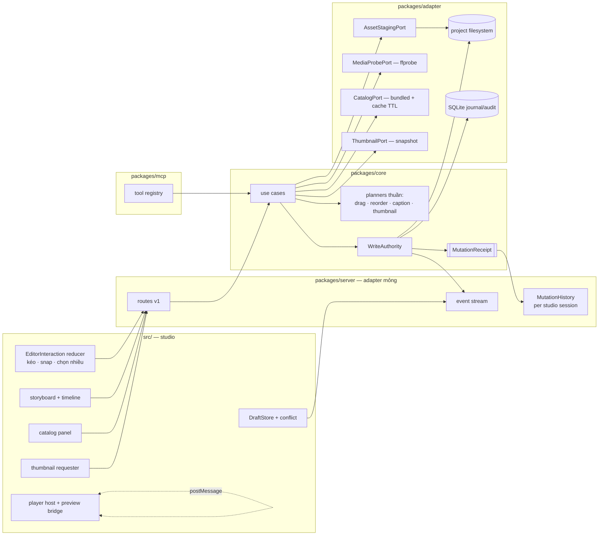
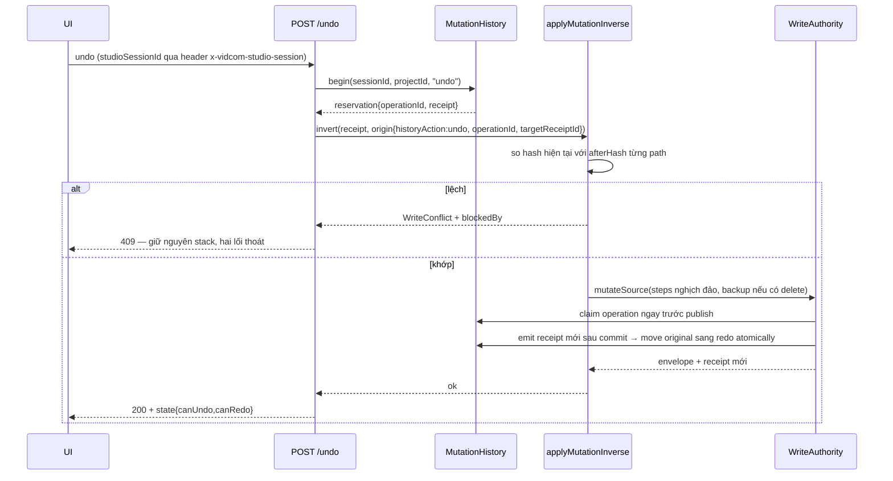
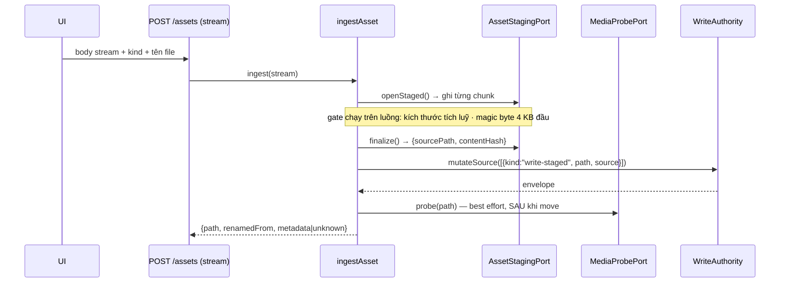
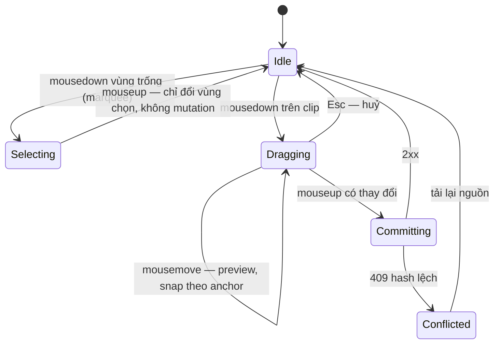
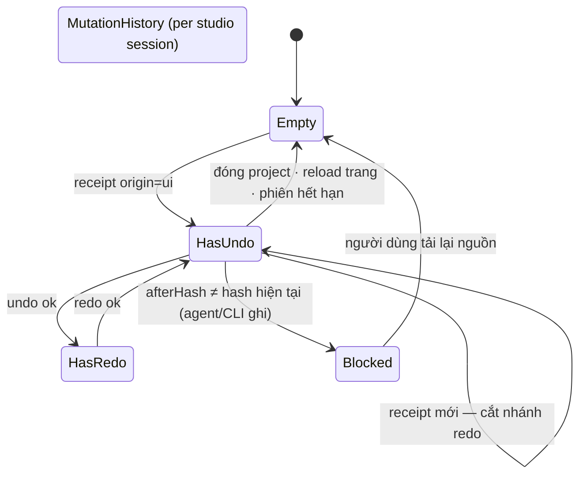
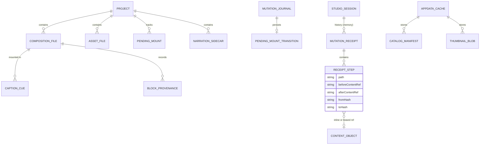

# Spec Editing Experience — Detail Design (bản 12)

> **Reference**: [Detailed Goals](./spec-editing-experience-detailed-goal.md) — **bản 7, Approved 2026-08-16** (12 requirement, ~212 SP; R4 theo mô hình `PlayerHost` + double-buffer cho mọi cập nhật)
> **Next**: [Implementation Checklist](./spec-editing-experience-implementation-checklist.md) — Pending Confirmation; chưa được thực thi
> **Tham chiếu UX**: [`reference-editor/`](./reference-editor/README.md)
>
> **Bản 12** (2026-08-16). Review implementation-readiness sửa các mâu thuẫn contract còn lại: journal hiện
> dùng `JournalId` số, trong khi bản 11 vừa yêu cầu receipt ULID mới vừa khẳng định migration chỉ thêm
> `pending_transition`; và §8.1 còn map `IntegrityMismatch` thành 409 dù đây là domain validation theo
> steering 04. Ngoài ra port thumbnail đơn-item không thể hiện thực batch snapshot đã chọn, và cache
> key không có namespace project khiến route ảnh không chứng minh ownership. Receipt giờ có id bền
> `journal:<decimal JournalId>`; integrity mismatch trả 422; thumbnail dùng `renderBatch` và cache
> namespace theo project. Review cũng bắt được `WorkspaceFs.readHash`/cleanup staged asset đang dùng
> `readFile`, làm đường upload 500 MB vẫn phình RAM sau khi stream xong; hai đường hash phải chuyển
> sang stream. Vòng implementation-readiness cuối còn đối chiếu trực tiếp HyperFrames 0.7.86 và bắt
> được upstream dùng type đầy đủ `hyperframes:*`, **không có** version/checksum theo item, và
> `hyperframes:example` là project scaffold chứ không phải scene template. §5.16/Decision 9 giờ khóa
> một lớp normalized catalog của VidCom trên commit upstream bất biến; build artifact không gọi mạng.
> Đồng thời loopback hiện chạy `@hono/node-server` trên HTTP/1.1, nên browser `fetch` với request
> `ReadableStream`/`duplex:"half"` sẽ bị Chromium từ chối; UI upload chuyển sang XHR gửi thẳng `File`
> (daemon vẫn nhận stream, không buffer 500 MB) để có progress + cancel thật trên transport hiện có.
> Vòng audit checklist tự trị sau đó khép thêm năm seam implementation: Hono body-limit phải bypass
> đúng route upload chunked thay vì buffer · watcher phân biệt own file/directory/absent và hash stream
> · catalog refresh metadata-only, payload materialize theo item có bounds · pending-mount lưu upload
> fingerprint và tra journal sau TTL · undo payload lớn dùng leased content-object ref thay vì giữ
> `Uint8Array[]` trong heap. Audit tiếp theo khóa thêm coordinator reload latest-wins để mutation/SSE
> liên tiếp không cho candidate change-seq cũ thắng change-seq mới, và làm rõ sanitizer SVG/font theo
> đúng mã lỗi 415. Lượt audit checklist cuối tiếp tục đóng race reservation undo/redo, vòng đời
> attach/detach của history, barrier cho mutation non-undoable cùng phiên, undo/reopen pending mount,
> giới hạn tổng inline receipt, exact-intent cho catalog prepare/execute, repeat-install vẫn mount,
> scene insertion planner dùng chung, category/provenance đã chuẩn hoá, scheduler thumbnail hữu hạn,
> change-seq-aware preview và escaping SVG/font/caption. Review sau khi tác giả sửa tiếp còn nối watcher
> external vào chính `MutationHistory` singleton, thêm synchronous history block khi precondition lệch,
> và giữ **state** của read guard thay vì chỉ một tập path. Barrier giờ tách ownership overlap khỏi
> invalidation có hướng của dependency: editor ngoài xoá thư mục cha vẫn chặn receipt phụ thuộc file
> con, nhưng thêm sibling dưới một parent-directory guard không block redo sai. Preview latest-wins dùng
> outbox `changeSeq` nên external edit vẫn reload dù project revision không tăng. CRUD cây dùng
> `expectedTreeDigest` + `mkdir absent|either`; draft refetch có generation/pending gate. Audit path
> cuối cũng sửa điểm đọc `applyCompositionOps`: definition thật ở `hyperframes/sdk-ops.ts`, còn
> `parse.ts` là caller; đồng thời §7/D9 làm rõ R5 local upload/file-manager không tự sinh MCP binary
> transport hay tool nhận absolute path. Đây đều là sửa kỹ thuật/boundary, không thay đổi Goals/AC.
>
> **Bản 11** (2026-08-16). Deep review bản 10 bắt được bốn blocker consistency còn lại: preview URL
> cố định chưa khóa `no-store`; checklist Decision Record nói quá thực tế; retention tombstone mâu
> thuẫn với lời hứa replay vô hạn; và checklist/evidence còn giữ nợ của đường hot-swap đã loại. §16
> đối chiếu. Bản 10 trước đó đã khép ownership/recovery của `pending_mount`, đồng bộ preview settings
> với double-buffer, và tách bằng chứng feasibility khỏi verification gate R4.1c.
>
> Cái nặng nhất là một **lỗ hổng phục hồi**: ý định mở record `pending_mount` chỉ được truyền lúc
> commit, nên kịch bản "asset đã publish → tiến trình chết → reconcile khôi phục mutation" để lại
> file mà không ai biết nó đang chờ mount. Ý định giờ **bền từ `beginComposite`** và nhánh reconcile
> phải áp lại nó.
>
> Cũng sửa hai chỗ tài liệu tự mâu thuẫn: **Decision 6** vẫn là quyết định hot-swap đã bị loại (giờ
> viết lại thành `PlayerHost` + double-buffer + collector do daemon tiêm), và **251–252 ms bị gọi nhầm là
> phép đo của R4.1c** — nó chỉ là phần `PlayerHost.reload()`; phần write-response/SSE → build → paint vẫn
> chưa đo và là task bắt buộc trong checklist.
>
> Spike: **24 probe hợp lệ PASS + 1 bị thay thế** (25 kết quả, S-P12 bị S-P14 thay) —
> [`spikes/phase-5/README.md`](../../../../spikes/phase-5/README.md).

## 1. Overview

Thiết kế này dựng **một trục ghi duy nhất** và treo mọi thứ khác lên nó.

Trục đó là `WriteAuthority`: nó đã nguyên tử, đã có precondition theo hash/revision, đã có journal
phục hồi. Bản này thêm đúng **một** khái niệm vào trục đó — **mutation receipt**: một bản ghi sinh ra
*bên trong* biên mutation, ngay trước khi capture bị huỷ, mang theo pre-image, post-hash, đường dẫn bị
ảnh hưởng và nguồn gốc. Receipt là thứ làm undo/redo và phát hiện xung đột draft đọc **cùng một** nguồn thay vì đo lại ở hai
chỗ. SSE **không** đi qua receipt: sự kiện vẫn persist trong outbox durable cùng giao dịch commit —
receipt chỉ bổ sung `paths` vào payload đó (§5.7). Vì receipt
sinh trong Core nên **MCP, CLI và HTTP có cùng hành vi** — không route nào phải tự nhớ ghi lịch sử.

Ngoài trục đó: mọi quyết định nội dung là **hàm thuần ở Core** (planner kéo, planner reorder, planner
caption cue, planner thumbnail); mọi thao tác file đi qua **use case Core** chứ không nằm ở route
(kể cả upload); preview có một **`PlayerHost`** giữ transport và nạp lại bằng **engine đệm**, với một
**collector sức khoẻ do daemon tiêm** vào tài liệu; và catalog là **một** manifest có `kind`,
`version`, `integrity`, phục vụ cả template lẫn block.

**Links to Requirements**: §17 là ma trận đầy đủ **theo từng AC**. Bản đồ nhanh:
R1 → §5.1–5.2 · R2 → §5.3–5.4 · R3 → §5.5–5.7 · R4 → §5.8–5.9 · R5 → §5.10–5.12 ·
R6 → §5.13–5.15 · R7 + R9 → §5.16–5.17 · R8 → §5.18–5.19 · R10 → §5.20 · R11 → §5.21 · R12 → §5.22.

## 2. Design Scope

### In Scope
- Mở rộng `WriteAuthority`: mutation receipt, step ghi nhị phân theo staging, sự kiện composite có đường dẫn.
- Use case Core mới: `reorderScenes`, `moveScenes`, `deleteScenes`, `ingestAsset`, `createEntry`, `renameEntry`, `deleteEntry`, `applyFont`, `generateCaptions`, `installCatalogItem`, `mountAsset`, `applyMutationInverse`.
- Dịch vụ phiên: `MutationHistory` (bộ nhớ, theo **studio session**), `CatalogService` (bundled + cache có TTL), `ThumbnailService`.
- Script do document builder tiêm: **collector sức khoẻ** chỉ ở preview (đầu `<head>`) và **runtime caption** ở cả preview/render. Không còn agent hot-swap.
- Contract tập trung ở `packages/contracts`; bề mặt expose cả HTTP **và** MCP dùng chung đúng một
  schema, còn ngoại lệ browser-only D7/D9 vẫn không định nghĩa shape riêng trong route.
- Lớp UI: reducer tương tác timeline (kéo, snap, chọn nhiều), storyboard, draft/conflict model, phím tắt, timecode theo khung.

### Out of Scope
- AI Composer trong app, render cloud, auto-update — Giai đoạn 6.
- Trim / in-out point / re-speed clip media — Goals đánh dấu ngoài phạm vi.
- Undo cho thao tác filesystem (upload, tạo/đổi tên/xoá từ cây file) — Goals R3.
- Sort "Popular" / Favorites trong catalog.
- Bảng SQLite mới cho lịch sử undo — OQ-2.

## 3. Research Summary

### Finding 1: pre-image **tồn tại** bên trong biên mutation, chỉ bị vứt sau commit
- **Key insight**: `validateCompositePreconditions` dựng `intent` cho từng bước gồm `previousContent` (chuỗi hoặc `Uint8Array`), `fromHash`, `toHash`; `executeValidatedComposite` truyền chính các intent đó vào `commitComposite`, rồi mới gọi `discardCaptures` ([write-authority.ts:429–680](../../../../packages/core/src/service/write-authority.ts#L429)).
- **Impact**: không cần đọc lại file, không cần journal mới. Chỉ cần **phát receipt tại chỗ đó** (§5.5). Đây là câu trả lời cho blocker 2 và cũng là lý do undo không phải instrument ở route.

### Finding 2: `WriteEnvelope` không mang pre-image, và sự kiện composite không mang đường dẫn
- **Key insight**: `WriteEnvelope` chỉ có `projectRevision`, `entityRevision`, `fileHashes`, `diagnostics` ([types.ts:392](../../../../packages/core/src/port/types.ts#L392)); sự kiện composite là `{ type: "project.changed", payload: { composite: true } }`.
- **Impact**: §6.3 thêm `MutationReceipt` (kênh riêng, không phình `WriteEnvelope`) và §5.7 mở rộng payload sự kiện bằng `paths`.

### Finding 3: authored write **bị cấm** dùng `StagedFileSource`
- **Key insight**: `if (step.kind === "write" && advancesSource && isStagedFileSource(step.content)) return err(...)` ([write-authority.ts:358](../../../../packages/core/src/service/write-authority.ts#L358)). Staging hiện chỉ dành cho artifact dẫn xuất.
- **Impact**: mục tiêu "upload 500 MB không giữ trọn trong RAM" **không** khả thi với contract hiện tại. §5.10 + Decision 4 mở đúng một cửa hẹp: step `write-staged` cho authored asset, verify hash sau khi staged.

### Finding 4: player không có API nạp lại từng sub-composition, nhưng preview là tài liệu **do ta dựng**
- **Key insight**: `HyperframesPlayer` công khai `play/pause/seek/currentTime/duration/ready/scenes/iframeElement`, không có `reloadComposition` ([hyperframes-player.d.ts:74](../../../../node_modules/@hyperframes/player/dist/hyperframes-player.d.ts)). Nhưng tài liệu preview do daemon dựng và **đã** tiêm script/CSS/overlay (`buildFxPauseScript`, `buildToneOverlayHtml`… trong [preview-style.ts](../../../../packages/adapter/src/hyperframes/preview-style.ts)), và iframe cùng origin với daemon.
- **Impact**: tài liệu preview là **của ta**, nên tiêm được **collector sức khoẻ** (đầu `<head>`, trước script tác giả) và **runtime caption**. Ý tưởng ban đầu — một agent đổi sub-composition tại chỗ — đã bị spike bác bỏ và thay bằng double-buffer (§5.9).

### Finding 5: word timing là **tương đối với cue**, không phải mốc timeline
- **Key insight**: `TtsWordTiming { text, startSeconds, endSeconds }` đo trên audio của **cue** ([tts-port.ts:12](../../../../packages/core/src/port/tts-port.ts#L12)); `resolveWordTimings` nói rõ nó lấy cửa sổ speech chứ không phải cả file.
- **Impact**: §5.13 định nghĩa phép rebase `cue.start + word.startSeconds` một chỗ duy nhất, và §5.14 nhúng mốc **tuyệt đối theo scene** vào DOM để runtime không phải cộng lại.

### Finding 6: steering đã chốt map mã lỗi và luật cache registry
- **Key insight**: [04-api-design §3.3](../../../steering/04-api-design.md) — invariant nghiệp vụ là **422**, quá lớn **413**, chưa hỗ trợ loại **415**, xung đột hash **409**, và bảng map nằm **một chỗ ở middleware**. [07-data-and-storage §7](../../../steering/07-data-and-storage.md) — registry cache phải persist trong `<app-data>/cache`, **có TTL**, **không** cache negative vô hạn, và offline **không được chờ mạng**.
- **Impact**: §8 và §5.16 viết theo đúng hai luật này (blocker 8 và 10).

## 4. Architecture

### 4.1 System Overview

Bốn tầng cũ, không thêm tầng. Điểm khác bản 1: **không có dịch vụ nào ở server tự ghi filesystem**.
`AssetIngest` của bản 1 bị xoá; phần staging thành một **port** (`AssetStagingPort`) do adapter hiện
thực, còn quyết định nghiệp vụ (gate, đặt tên, mount) nằm ở use case Core — đúng
[03-architecture-ddd](../../../steering/03-architecture-ddd.md).

### 4.2 Component Diagram



Điểm quan trọng: `MutationHistory` **đọc receipt**; SSE đi đường outbox durable (§5.7). Không thành phần nào gọi ngược vào route. MCP dùng cùng
use case nên receipt của nó cũng vào cùng dòng chảy — đó là điều kiện để R3.5 (chặn undo khi agent
vừa ghi) đúng.

### 4.3 Data Flow

**Ghi bất kỳ → receipt → ba người đọc**

```mermaid
sequenceDiagram
  participant CALLER as Route / MCP tool
  participant UC as Use case Core
  participant WA as WriteAuthority
  participant J as Composite journal
  participant R as MutationObserver
  participant MH as MutationHistory
  participant SSE as SSE
  CALLER->>UC: invoke(input, actor, origin{kind, sessionId})
  UC->>WA: mutateSource(steps, origin)
  WA->>J: beginComposite(intents)
  WA->>WA: capture · publish · commit
  Note over WA,J: sự kiện (đã mang `paths`) persist CÙNG giao dịch commit
  WA->>R: emit(receipt{origin, paths, before/after, revision})
  Note over WA: emit xảy ra TRƯỚC discardCaptures
  WA->>WA: discardCaptures()
  R->>MH: record ⇒ push; undo/redo ⇒ hoàn tất reservation + chuyển stack
  J->>SSE: outbox durable phát file.changed/project.changed + paths
  WA-->>UC: envelope
  UC-->>CALLER: kết quả
```

**Undo**



**Upload lớn (streaming) + mount**



### 4.4 State / Lifecycle Flow





### 4.5 Integration Points

| System | Direction | Protocol | Purpose |
|---|---|---|---|
| `@hyperframes/player` | out | thuộc tính + `iframeElement` | play/pause/seek; đổi `src` cho nạp lại root |
| Script ta tiêm vào tài liệu preview | in | biến toàn cục cùng origin | `window.__vidcomHealth` (collector lỗi, đọc bởi `PlayerHost`) và runtime caption |
| ffprobe sidecar | out | process | probe metadata (best effort) |
| Registry HyperFrames | in | HTTPS | làm mới catalog/block; bundled là đáy, cache có TTL |
| SSE `/api/v1/events` | in | text/event-stream | receipt phát ra ngoài, **kèm `paths`** |

### 4.6 Technology Stack

| Layer | Technology | Rationale |
|---|---|---|
| Planner | TS thuần ở Core / `src/lib` | test dưới `environment: "node"`; repo không có jsdom |
| Ghi | `WriteAuthority` + receipt | Decision 1, 2 |
| Lịch sử undo | bộ nhớ, theo studio session | OQ-2; Decision 3 |
| Upload | HTTP body **stream** → staging → `write-staged` | Decision 4 |
| Probe | ffprobe sidecar GĐ 4 | Decision 5 |
| Preview | double-buffer + collector tiêm vào tài liệu | Decision 6 |
| Caption | markup có `<span>` từng từ + runtime tiêm | Decision 7 |
| Catalog | manifest có `kind`/`integrity`, cache TTL | Decision 8, 9 |
| Thumbnail | snapshot theo scene + cache theo dấu vân phụ thuộc | Decision 10 |

## 5. Components and Interfaces

### 5.1 `src/lib/studio/editor-interaction.ts` — trạng thái tương tác (R1, R12)
- **Implementation erratum 2026-08-18 (không đổi AC)**: `StudioSnapshotResponse` phải mang
  `frameRate` top-level lấy từ composition model (fallback HyperFrames 30 fps). Không được dùng hằng 30
  trong timeline, vì `roundToFrame` và clamp một-frame của §5.2 phải theo fps authored. Đây là read
  metadata, không phải client tự quyết timing.
- **Purpose**: một nguồn sự thật cho *mọi* trạng thái tương tác timeline: mode con trỏ, snap bật/tắt, zoom, vùng chọn, phiên kéo. Bản 1 chỉ có drag; ảnh reference cho thấy bốn thứ này luôn đi cùng nhau.
- **Public interface**:
  ```ts
  export interface EditorInteractionState {
    mode: "select" | "split";
    snapEnabled: boolean;
    pixelsPerSecond: number;
    selection: ReadonlySet<string>;      // sceneId
    anchorSceneId: string | null;         // R12.1/1b
    drag: DragSession | null;
    marquee: { fromX: number; fromY: number; toX: number; toY: number } | null;
  }
  export function reduceInteraction(state, event: InteractionEvent): EditorInteractionState;
  export function commitDrag(state, clips: readonly SceneClip[]): TimingCommit | null;
  ```
- **Responsibilities**: `Shift`-click cùng track chọn dải, khác track đặt anchor mới (R12.1b); `Cmd/Ctrl` thêm-bớt; marquee; kéo nhóm dịch một delta chung với **anchor là clip đang kéo** (R12.4b) và **ripple tắt** (R12.4c).
- **Lifecycle**: reducer thuần; component chỉ giữ state và render.

### 5.2 `src/lib/studio/snap.ts` (R1.6–1.7, 1.13)
```ts
export function snapToleranceSeconds(pixelsPerSecond: number, fps: number): number; // 8px, kẹp [1 khung, 0.5s]
export function snapTime(t: number, candidates: readonly SnapCandidate[], tolerance: number): SnapResult;
export function roundToFrame(t: number, fps: number): number; // round(t*fps)/fps
export function hitZone(offsetX: number, clipWidthPx: number): "body" | "trim-start" | "trim-end";
```
`hitZone` chốt luật vùng chạm: mép chiếm **8 px mỗi bên** nhưng **không bao giờ quá 40 % chiều rộng
clip** — clip ngắn vẫn còn thân để chọn và kéo. (Thiếu luật này thì clip 20 px chỉ có hai tay cầm.)

### 5.3 `packages/core/src/domain/plan-scene-order.ts` (R2, R12)
```ts
/** `toIndex` là vị trí trong **nhóm của scene** (content hoặc layer) **trong cùng track** — không phải chỉ số toàn timeline. */
export function planReorder(clips, groups, req: { sceneId; toIndex; toTrackIndex? }): Result<ReorderPlan, DomainError>;
export function planCompact(clips, trackIndex: number): ReorderPlan;
export function planGroupShift(clips, sceneIds: readonly string[], deltaSeconds: number): Result<ReorderPlan, DomainError>;
/** Planner được tách từ createScene hiện có; chỉ trả root composition ops/timing, không ghi. */
export function planSceneInsertion(clips, req: {
  sceneId: string; scenePath: RelPath; duration: number; toIndex: number; trackIndex: number;
  rootDuration: number;
}): Result<SceneInsertionPlan, DomainError>;
```
- Giữ khoảng trống (R2.2). Dồn liền mạch là **use case riêng** `compactTrack` với route riêng — không phải cờ trên reorder, để một thao tác chỉ-dồn không phải bịa `sceneId`/`toIndex` (R2.3).
- Nhóm scene (content ↔ transition/overlay) phân loại ở **Core** bằng `groupOf`, không phải ở UI — hai bên phân loại độc lập là hai bên bất đồng.
- `planGroupShift` là all-or-nothing (R12.4).
- `createScene` hiện có, `installCatalogItem` (new-scene) và `mountAsset` cùng gọi
  `planSceneInsertion`; caller ghép scene/source/sidecar/provenance vào **một** CompositeRequest rồi
  mới mutate. Không caller nào gọi lồng `createScene()` (nó tự commit) hoặc copy thuật toán shift/root.

**Implementation erratum — gap slots và output planner (2026-08-18, không đổi AC):** gap được bảo toàn
theo slot thứ tự trong đúng `{track,group}`: giữ leading gap trước clip đầu và từng inter-slot gap, rồi
đặt lại duration của clip mới vào các slot đó. Reorder cùng track không đụng group khác. Chuyển track giữ
mọi clip source tại chỗ (không compact ngầm); target giữ các gap slot cũ và ranh giới tăng thêm do clip
mới dùng gap `0`. Mọi planner trả danh sách timing đổi tối thiểu, `rootDuration` và `noOp`; insertion trả
thêm `beforeSceneId` để caller dựng đúng một `addElement` trong composite. Overlap sau plan vẫn chỉ là
diagnostic; giới hạn root/runtime được use case áp sau khi nhận plan.

### 5.4 Use case timing & thứ tự (R1, R2, R12)
```ts
setSceneTiming(...)            // đã có
reorderScenes(deps, { projectId, sceneId, toIndex, toTrackIndex?, extendRoot?, expectedContentHash }, actor, origin)
compactTrack (deps, { projectId, trackIndex, extendRoot?, expectedContentHash }, actor, origin)  // R2.3 — hành động riêng, không cờ
moveScenes  (deps, { projectId, sceneIds, deltaSeconds, extendRoot?, expectedContentHash }, actor, origin)  // R12.4
prepareDeleteScenes(deps, { projectId, sceneIds, expectedRevision }) → { plan, binding }                     // R12.5
deleteScenes(deps, { projectId, sceneIds, expectedRevision, grantId }, actor, origin) → { envelope, backupId }
```
Ba use case ghi sinh **một** `CompositeRequest`. `deleteScenes` re-plan từ exact intent như
`deleteScene` hiện có, gọi grant reserve, đặt `backup: true` và xoá cả file scene + sidecar thuộc các
scene đó — nên undo khôi phục đủ. `sceneIds` non-empty/unique; duplicate bị từ chối trước plan.

### 5.5 `packages/core/src/port/mutation-observer.ts` + phát receipt trong `WriteAuthority` (R3, R8, blocker 2)
- **Purpose**: một điểm duy nhất biết "vừa có gì đổi, từ đâu, trước/sau ra sao".
- **Public interface**:
  ```ts
  export interface MutationOrigin {
    kind: "ui" | "mcp" | "cli" | "system";
    /** Phiên studio phát ra thao tác; null cho mọi nguồn không phải UI. */
    sessionId: string | null;
    /** Nhãn hiển thị trên nút undo: "Đổi timing scene 3". */
    label: string | null;
    /**
     * Lịch sử phải làm gì với receipt này. `undo`/`redo` là mutation nghịch đảo do chính
     * lịch sử phát ra — observer dùng reservation để chuyển stack ngay trong write mutex.
     * Thiếu trường này thì undo tự ghi lại chính nó và stack không bao giờ rỗng.
     */
    historyAction: "record" | "undo" | "redo" | "ignore";
    historyOperation: { id: string; targetReceiptId: string } | null;
  }
  export type UndoContentRef =
    | { kind: "inline"; bytes: Uint8Array; encoding: "utf8" | "binary"; contentHash: ContentHash }
    | { kind: "object"; contentHash: ContentHash; encoding: "utf8" | "binary" };
  /**
   * Adapter mở rộng LargePreviousContentStore hiện có. Metadata/ref-count sống trong memory;
   * object bytes content-addressed có thể dùng chung với journal nhưng không tạo row history.
   */
  export interface UndoContentPort {
    retainBytes(bytes: Uint8Array, encoding: "utf8" | "binary",
      storage: "inline" | "object"): Promise<UndoContentRef>;
    retainFile(source: StagedFileSource, encoding: "utf8" | "binary"): Promise<UndoContentRef>;
    resolve(ref: UndoContentRef): Promise<Uint8Array | StagedFileSource>;
    release(refs: readonly UndoContentRef[]): void; // giảm live ref; cleanup chạy async/startup
  }
  /** Union năm nhánh: `null` chỉ nghĩa file được tạo/bị xoá, không bao giờ nghĩa content bị lược. */
  export type MutationReceiptStep =
    | { kind: "file"; undoable: true;  path: RelPath;
        beforeContent: UndoContentRef | null; afterContent: UndoContentRef | null;
        fromHash: ContentHash | null;   toHash: ContentHash | null }
    | { kind: "file"; undoable: false; path: RelPath;      // asset lớn: KHÔNG giữ bytes
        fromHash: ContentHash | null;   toHash: ContentHash | null;
        omittedReason: "not-undoable" }
    /** Thay settings độc lập nằm ngoài undo; cleanup thuộc scene mutation kế thừa undoability
     *  của mutation để không làm cả delete/install mất undo. */
    /** `undoable` do **loại thao tác** quyết, không cố định theo step: thư mục do cài
     *  catalog tạo thì hoàn tác được; thư mục người dùng tạo từ cây file thì không (Goals R3). */
    | { kind: "directory"; undoable: boolean; op: "mkdir" | "rmdir"; path: RelPath; existedBefore: boolean }
    | { kind: "pending-mount"; undoable: true; operationId: string;
        before: { state: "uploaded_unmounted"; lastFailure: PendingMount["lastFailure"] };
        after: { state: "mounted"; sceneId: string; revision: number } }
    | { kind: "entity"; undoable: boolean; entity: "preview-settings"; backingPath: RelPath;
        beforeState: PreviewSettingsDto | null; afterState: PreviewSettingsDto;
        fromRevision: number; toRevision: number;
        fromHash: ContentHash | null; toHash: ContentHash };
  export interface MutationReceipt {
    id: string;
    projectId: ProjectId;
    origin: MutationOrigin;
    steps: MutationReceiptStep[];
    paths: RelPath[];                    // chỉ path thực sự đổi; dùng event/invalidation
    readGuards: { path: RelPath; state:
      | { kind: "file"; contentHash: ContentHash }
      | { kind: "directory" } }[];       // dependency không bị mutation ghi
    projectRevision: number;
    at: string;
    undoable: boolean;                // theo bảng phạm vi undo của Goals R3
  }
  /** Không ném: một observer hỏng không được biến mutation đã commit thành thất bại.
   *  Mọi method thuộc **port ở Core**; hiện thực nằm ở server. Core không bao giờ
   *  gọi thẳng `MutationHistory` — đó là phụ thuộc ngược. */
  export type EmitResult = { ok: true } | { ok: false; reason: string };
  export interface MutationObserverPort {
    /** Với undo/redo: claim reservation ngay trước publish; record/ignore là no-op ok. */
    claimHistoryOperation(projectId: ProjectId, origin: MutationOrigin): EmitResult;
    /** Trả reservation về trạng thái an toàn nếu publish rollback/không commit. */
    abortHistoryOperation(projectId: ProjectId, origin: MutationOrigin): void;
    /** Precondition undo/redo lệch trước publish: settle reservation và block đúng direction/top. */
    blockHistoryOperation(projectId: ProjectId, origin: MutationOrigin, paths: RelPath[]): void;
    emit(receipt: MutationReceipt): EmitResult;
    /** Chỉ watcher gọi sau khi đã loại own-write echo; đánh dấu path barrier cho mọi stack live. */
    observeExternalChange(projectId: ProjectId, paths: RelPath[]): void;
    /** Fail-safe: chặn lịch sử của project ở MỌI phiên. Non-throwing. */
    invalidateProject(projectId: ProjectId, reason: "history-desync"): void;
  }
  ```
- `LargePreviousContentStore` hiện dùng `readFile` ở `put/read`; implementation thêm đường
  `putFile/open` theo stream, no-follow + regular-file + hash verify. Inline chỉ dùng khi **mỗi payload
  ≤64 KiB và tổng inline của cả receipt ≤256 KiB**; vượt một trong hai thì `retainBytes(...,"object")`.
  Vì stack tối đa 50 mục, bytes inline tối đa 12,5 MiB thay vì phình theo số file nhỏ trong package;
  đây chỉ đổi representation, không evict/mất undo. Object lớn không quay lại heap để kiểm digest.
- **Nơi phát**: `WriteAuthority` track ngân sách inline chung cho toàn receipt, retain `beforeContent`
  từ capture/journal object và `afterContent`
  từ bytes hoặc staged source **sau capture, trước publish**; lỗi retain dừng trước khi project đổi.
  Receipt chỉ phát **sau** `commitComposite` và **trước** `discardCaptures`. Nhánh fail/rollback hoặc
  observer từ chối phải release refs chưa chuyển quyền; `MutationHistory` nhận quyền sở hữu khi emit
  thành công và release khi eviction/clear. Recovery retain lại từ journal/current committed file.
- Với `historyAction = undo|redo`, sau khi mọi precondition + retain đã qua nhưng **ngay trước publish**,
  `WriteAuthority` gọi `claimHistoryOperation`. Claim sai/hết hạn/top receipt đã đổi ⇒ dừng trước ghi
  với `WriteConflict`. Rollback/abort gọi `abortHistoryOperation`; commit thành công gọi `emit` khi
  project mutex vẫn còn giữ. Như vậy không có khe `await apply → route commit stack` để request khác
  chen vào sau khi file đã đổi nhưng trước khi undo/redo stack chuyển trạng thái.
- **Observer không được biến một mutation đã commit thành thất bại.** Hiện `commit → notify → discard`
  nằm trong **một** `try/catch` rộng ([write-authority.ts:653](../../../../packages/core/src/service/write-authority.ts#L653));
  nếu observer ném ở đó, hệ thống sẽ đi vào reconcile như thể commit hỏng, có thể phát receipt lần
  hai, và báo lỗi cho một mutation **đã thành công**. Hợp đồng:
  - `emit` **không ném** (trả `EmitResult`); `WriteAuthority` vẫn bọc lời gọi trong `try/catch` riêng
    ngoài khối commit để phòng một hiện thực sai hợp đồng.
  - Receipt có `id` ổn định `journal:<decimal JournalId>`; observer **idempotent theo `id`** —
    nhận lại cùng id là bỏ qua, nên nhánh reconcile phát lại cũng an toàn.
  - Observer ném ⇒ **không** retry filesystem, **không** đổi kết quả: mutation vẫn trả `ok`, kèm một
    `Diagnostic` mức `warning` code `history-unavailable` để UI nói "thao tác đã ghi, nhưng lần này
    không hoàn tác được".
  - **Fail-safe cho các phiên khác** (có API, không chỉ prose): `emit` trả `EmitResult`; `ok: false`
    ⇒ `WriteAuthority` gọi **`observer.invalidateProject(projectId, "history-desync")`** — vẫn là port
    ở Core, hiện thực ở server. Warning chỉ cứu phiên gọi. Nếu receipt không tới được
    `MutationHistory`, các phiên studio khác **không** biết project vừa đổi, và một phiên khác có thể
    undo đè lên thay đổi vừa commit — đúng thứ R3.5 cấm. Nên khi `emit` ném, daemon đặt
    `undoBlocked/redoBlocked` cho toàn bộ history live của project với reason `history-desync`; lối thoát
    duy nhất là tải lại nguồn (giống nhánh AC 5b). Mất một stack an toàn hơn ghi đè im lặng.
- **Cả nhánh phục hồi cũng phải phát, nhưng origin phụ thuộc vòng đời.** Đường "commit ném lỗi nhưng
  `reconcileCompositeOnce` xác nhận đã committed" trong **cùng process**
  ([write-authority.ts:681](../../../../packages/core/src/service/write-authority.ts#L681)) còn origin
  và reservation gốc trong memory, nên phát cùng receipt/id và hoàn tất stack. Startup reconcile sau
  daemon restart chạy trước listener thì lịch sử phiên cũ đã mất theo OQ-2: nó dựng receipt cùng
  id/steps/paths nhưng `origin={kind:"system",sessionId:null,label:null,historyAction:"ignore",
  historyOperation:null}` để invalidation/ref cleanup, **không** resurrect stack. Journal/outbox không
  cần persist `sessionId`, label hay history operation để phục hồi lịch sử qua restart.
- **Upload `write-staged` KHÔNG retain content**: nó sinh nhánh `undoable:false` với
  `omittedReason:"not-undoable"`. Catalog/history `write-staged` là undoable nhưng receipt giữ
  `UndoContentRef`, không đọc payload lớn vào RAM.
- Validated entity intent mang `undoable` do **Core use case** đặt: ghi entity đi qua `mutateSource` với một `CompositeStep` kind `entity` (đường công khai duy nhất; `mutateEntity` là helper **private** bên trong `WriteAuthority`, không phải API để gọi) cho thao tác settings
  độc lập luôn false; entity step nằm trong delete/install source composite kế thừa true khi cần đảo
  nguyên tử. HTTP/MCP schema không cho client tự gửi cờ này.
- **Không có trần kích thước nào loại một mutation khỏi lịch sử.** Goals R3.1 nói mọi mutation trong
  bảng phạm vi phải thành **một mục undo**; một luật "quá lớn thì mất undo" là hành vi sản phẩm mới
  mà Goals chưa duyệt. Nhánh `undoable: false` chỉ dùng cho thứ Goals **đã** loại khỏi undo — upload
  asset (`omittedReason: "not-undoable"`). Stack vẫn đúng **50 mục trong memory**, nhưng content >64
  KiB dùng object ref có live lease; không có SQLite history row và không reconstruct stack chỉ từ
  object store sau reload. Khi mục 51/clear/session close, release refs; cleanup chỉ xoá object không
  còn được journal/recovery hay live history tham chiếu. Đây là bounded-RAM implementation của OQ-2,
  không phải persistence lịch sử.
- Vì thế `omittedReason` chỉ còn một giá trị: `"not-undoable"`.
- Chỉ Core use case được thêm read guard `{path,state:file(hash)|directory}` đã resolve/validate;
  transport không gửi field này.
  `CompositeRequest.historyReadGuards?` là input nội bộ. `WriteAuthority` kiểm từng file hash/trạng thái directory dưới cùng
  project mutex **trước capture/publish** rồi mới dựng receipt; mismatch trả `WriteConflict` zero-write.
  Catalog install thêm mọi target package action `reuse`, vì một mount mới đang phụ thuộc vào file
  shared dù mutation không ghi nó. Target create/replace vốn đã nằm trong `paths`, không lặp vào
  `readGuards`. History barrier **không** được làm phẳng guard thành một tập path đối xứng:
  ownership dùng `ownedOverlap(A,B)` (equal hoặc ancestor/descendant theo segment), còn dependency dùng
  `invalidates(changedPaths, guards)` chỉ khi changed path bằng hoặc là **ancestor** của `guard.path`.
  Descendant/sibling change không làm mất state `directory` chỉ đảm bảo parent còn tồn tại.
  event/SSE/cache invalidation vẫn chỉ dùng `paths` thật. Nếu không tách hai tập này,
  tab A có thể undo lần cài đã tạo dependency trong khi tab B vừa reuse dependency đó vào scene khác,
  xoá file đang được B dùng mà không có path mutation nào giao nhau.
  `applyFont` guard hash file font và `mountAsset` guard hash asset source vì redo cần chúng; một
  `mkdir "either"` no-op tự sinh guard `directory` vì surrounding writes dựa vào parent có sẵn. External
  delete vẫn cho undo gỡ reference (undo không ghi source), nhưng đánh dấu redo bị chặn. Khi redo,
  `applyMutationInverse` truyền lại `historyReadGuards`; undo không truyền, nên dependency thiếu không
  cản việc gỡ reference nhưng redo luôn recheck hash đồng bộ, không phụ thuộc debounce của watcher.
- **Vì sao không instrument ở route**: MCP ghi cùng use case; nếu lịch sử và `paths` sinh ở route thì
  một `set_scene_timing` từ Claude Code sẽ không sinh receipt, và R3.5 (chặn undo khi nguồn đã đổi)
  mất đúng tín hiệu nó cần.

### 5.6 `packages/server/src/service/mutation-history.ts` (R3)
```ts
export class MutationHistory {
  /** Hiện thực trực tiếp MutationObserverPort; idempotent theo receipt.id và không ném. */
  emit(receipt: MutationReceipt): EmitResult;
  begin(sessionId: string, projectId: ProjectId, direction: "undo" | "redo"):
    Result<{ operationId: string; receipt: MutationReceipt }, DomainError>;
  cancel(operationId: string): void;
  claimHistoryOperation(projectId: ProjectId, origin: MutationOrigin): EmitResult;
  abortHistoryOperation(projectId: ProjectId, origin: MutationOrigin): void;
  blockHistoryOperation(projectId: ProjectId, origin: MutationOrigin, paths: RelPath[]): void;
  observeExternalChange(projectId: ProjectId, paths: RelPath[]): void;
  state(sessionId: string, projectId: ProjectId): {
    canUndo: boolean; canRedo: boolean; busy: boolean; depth: number;
    nextUndoLabel: string | null; nextRedoLabel: string | null;
    undoBlocked: boolean; redoBlocked: boolean;
    undoBlockedReason: string | null; redoBlockedReason: string | null;
  };
  clear(sessionId: string, projectId?: ProjectId): void;
  attach(browserSessionId: string, sessionId: string, projectId: ProjectId): void;
  detach(browserSessionId: string, sessionId: string, projectId: ProjectId): void;
  /** Hiện thực của `MutationObserverPort.invalidateProject`. Non-throwing. */
  invalidateProject(projectId: ProjectId, reason: "history-desync"): void;
}
```
- **Khoá theo `(studioSessionId, projectId)`** — blocker 2. `studioSessionId` sinh khi studio mở
  project, gửi kèm mọi ghi qua header `x-vidcom-studio-session`, và **mất khi reload trang**, đúng
  R3.8. Daemon phục vụ nhiều tab thì mỗi tab có lịch sử riêng.
- `studioSessionId` không tự chứng minh lifecycle. UI phải attach nó với browser auth session + project
  trước khi cho ghi, và detach khi unmount/pagehide. Attach idempotent; mutation/history route từ chối
  ID chưa attach hoặc gắn browser/project khác. SSE fetch mang cùng header và là fallback lifecycle:
  attachment giữ **số SSE lease đang mở**; chỉ disconnect của lease cuối mới đặt detach grace **30
  giây**, reconnect cùng ID huỷ timer. Hai stream overlap lúc browser reconnect không được để stream
  cũ đóng rồi clear stack của stream mới. Explicit DELETE clear ngay sau khi request đang committing
  settle và revoke attachment generation; SSE reconnect một mình không được resurrect nó. Chỉ POST
  attach mới có thể mở lại cùng ID, với stack rỗng. Live attachment không có TTL/eviction theo thời gian. Nhờ đó
  reload (ID mới) cho history rỗng và stack cũ thực sự release refs, không chỉ trở thành memory leak.
- `emit()` push khi `origin.historyAction === "record"` **và** `receipt.undoable === true`;
  `receipt.undoable` = mọi step trong receipt đều `undoable`. Một mutation trộn (ví dụ cài catalog tạo
  thư mục **và** ghi composition) vẫn undo được vì cả hai step đều thuộc thao tác undo-được; còn
  `createEntry` từ cây file đặt `undoable: false` cho step thư mục của nó, nên cả receipt nằm ngoài
  lịch sử — đúng Goals R3. Receipt của chính undo/redo mang
  `historyAction: "undo" | "redo"` phải mang reservation đã claim; `emit` atomically chuyển **receipt
  gốc** undo↔redo rồi release refs của receipt nghịch đảo vừa phát (receipt gốc đã giữ cả before/after).
- Receipt UI chỉ được push nếu `origin.sessionId` **đang attach** đúng browser auth session/project.
  Recovery lúc daemon khởi động không được dựng lại stack của session cũ chưa attach — OQ-2 yêu cầu
  reload/restart bắt đầu rỗng. Receipt đó vẫn barrier stack live theo luật có hướng bên dưới và refs vừa retain
  phải được release. Recovery trong cùng daemon khi session còn attach vẫn hoàn tất reservation/push
  bình thường.
- Receipt `record` nhưng `undoable:false` **không** biến mất về mặt ordering. Với mỗi entry cũ:
  `undoBlocked = ownedOverlap(old.paths,incoming.paths) || invalidates(old.paths,incoming.readGuards)`;
  `redoBlocked = ownedOverlap(old.paths,incoming.paths) || invalidates(incoming.paths,old.readGuards)`.
  Vế đầu bảo vệ state mutation sở hữu; vế sau bảo vệ dependency theo đúng hướng thao tác sắp áp.
  Vì vậy sửa dependency shared không chặn undo một mount chỉ-đọc, nhưng nếu entry đó chuyển sang redo
  thì redo bị chặn.
  `ignore` từ MCP/CLI/system cũng áp cùng luật barrier. Chỉ record undoable của đúng session mới push;
  session khác thấy nó như barrier. `ownedOverlap(A,B)` đúng khi có hai path bằng nhau **hoặc** một path
  là ancestor của path kia tại ranh giới segment `/`; `assets/a` không overlap `assets/ab`.
  `invalidates(changed,guards)` cũng segment-safe nhưng **có hướng**: parent/equal change làm guard sai,
  child change không làm mất file hash hay sự tồn tại của directory được guard. Chỉ dùng `RelPath`
  canonical đã validate, không so prefix chuỗi thô.
- Cách đọc R3.5: “file nguồn của mutation” là path mà hướng undo/redo sắp **ghi hoặc xoá**. Dependency
  read-only (asset/font/package reuse) không làm undo gỡ reference trở nên nguy hiểm, nên chỉ chặn
  redo bằng read guard. Đây là lý do có hai phép có hướng thay vì cờ intersect đối xứng; R11.8 vẫn
  giữ asset và R11.9 vẫn cho clip hiện missing-source trước khi người dùng quyết định undo.
- `observeExternalChange` nhận đúng path từ `WorkspaceWatcher` **sau** own-write suppression. Với mỗi
  entry, external path block undo khi `ownedOverlap(old.paths,external.paths)`; block redo khi vế đó
  đúng **hoặc** `invalidates(external.paths,old.readGuards)`. External event không giả có read guard.
  Nó không push entry, không clear stack và non-throwing. Reason ổn định là `source-changed-externally`;
  UI có thể liệt kê path đầu tiên đã redact/normalize. Không suy external từ SSE ở browser vì có cửa sổ
  trước khi daemon nhận lại event và vì watcher đã là authority phân loại own-write so với editor ngoài.
- Barrier được gắn vào **từng entry** ở undo và redo stack, không phải cờ toàn stack. Chỉ top entry
  có barrier mới làm `undoBlocked`/`redoBlocked` true và vô hiệu hoá hướng tương ứng; top sạch vẫn
  được áp, rồi entry sâu bị đánh dấu sẽ chặn khi nó lên đỉnh. Không xoá entry dưới và không nhảy cóc.
  `history-desync` là ngoại lệ project-wide: block cả hai hướng của mọi entry live.
- Receipt undo/redo đã claim là trường hợp đặc biệt trong stack sở hữu operation: nó atomically move
  target entry và **không** dùng chính inverse receipt để barrier các entry cũ còn lại — inverse vừa
  khôi phục đúng state mà thứ tự stack mong đợi. Với mọi session khác, inverse receipt vẫn là incoming
  external và áp hai luật ownership/dependency trên. Record undoable mới của cùng session cũng dựa vào LIFO/branch-cut,
  không tự barrier entry cũ trong chính stack đó.
- `begin` chỉ cho một operation đang chờ/committing trên mỗi `(session,project)`; operation thứ hai
  trả `WriteConflict` và UI disable theo `busy`. Trước claim, reservation mất hiệu lực nếu target
  không còn top, attachment/stack bị clear, hoặc barrier của **đúng hướng operation** vừa bật; một
  incoming chỉ đánh dấu `redoBlocked` không được vô cớ huỷ reservation undo còn an toàn (và ngược lại).
  Claim sai fail trước publish. `clear`/dispose có thể huỷ operation đang
  chờ, nhưng nếu đã `committing` thì đánh dấu deferred và chỉ release sau `emit`/`abort`, không giải
  phóng refs dưới một mutation đang dùng. Route gọi `cancel` trong `finally` cho mọi nhánh không commit.
- Nếu step/read-guard precondition của request undo/redo lệch **trước publish**, `WriteAuthority` gọi
  `blockHistoryOperation` với path đã canonicalize. Method atomically settle reservation và đánh
  `undoBlocked` hoặc `redoBlocked` trên đúng target/top theo direction, reason
  `source-changed-externally`; route `cancel` sau đó là idempotent. Nhờ vậy người dùng thấy hai lối
  thoát R3.5b ngay cả trong cửa sổ watcher debounce, thay vì nút còn bật và trả 409 vô hạn.
- `MutationHistory` nhận `UndoContentPort`: receipt không được push (ignore/non-undoable), receipt id
  trùng, mục bị cắt khỏi redo, mục thứ 51 bị evict, `clear` và session/project dispose đều release
  toàn bộ refs đúng một lần. `emit` idempotent không được làm live-ref count tăng theo số lần recovery.
- Nếu `emit` lỗi **sau commit**, `invalidateProject` phải settle/hủy mọi reservation của project,
  block mọi stack live và release refs đúng một lần sau operation committing; không để `busy` hoặc
  một lease treo vĩnh viễn. Mutation đã commit vẫn trả thành công kèm warning như §5.5.
- **Mọi receipt không được push vào một stack đều là "ngoài" đối với stack đó**: khác source/session,
  `historyAction:"ignore"`, hoặc non-undoable kể cả cùng session. Chúng đánh dấu entry theo hai phép
  giao có hướng ở trên
  (R3.5); hai tab hay chính thao tác non-undoable của tab đều có thể làm pre-image cũ không còn an toàn.
- Giới hạn: **50 mục** mỗi `(session, project)`, đúng con số Goals chốt. Không có trần megabyte cho
  stack và không có eviction theo thời gian — hai thứ đó là hành vi sản phẩm mới mà Goals không nói,
  và chúng làm lịch sử biến mất trước 50 mục. Thứ duy nhất không giữ bytes là mutation Goals **đã**
  loại khỏi undo (upload asset) — không có luật "quá lớn thì mất undo" nào cả.
- Vòng đời: xoá khi phiên đóng hoặc khi `clear`. Không xoá vì SSE im lặng.

### 5.7 `applyMutationInverse` + sự kiện có đường dẫn (R3, R8.1d)
```ts
export async function applyMutationInverse(
  deps: ProjectWriteDependencies,
  input: { projectId: ProjectId; receipt: MutationReceipt; direction: "undo" | "redo" },
  actor: Actor, origin: MutationOrigin,
): Promise<Result<{ envelope: WriteEnvelope; inverse: MutationReceipt }, DomainError>>;
```
- Undo resolve `beforeContent` (write/write-staged) hoặc `delete` khi `beforeContent === null`; **redo
  resolve `afterContent`**. Object ref đi bằng internal `StagedFileSource`, không đọc trọn vào RAM;
  route/client không bao giờ truyền source path hay ref.
- Receipt có step `pending-mount`: undo của `close` phát transition `reopen` trong **cùng** composite,
  khôi phục `uploaded_unmounted` + failure trước đó; redo đóng lại theo scene/revision mới. Vì vậy row
  không bao giờ còn `mounted` trỏ tới scene wrapper đã bị undo.
- Entity preview-settings có `undoable:true` khi là cleanup phụ thuộc của một mutation undoable (ví dụ
  xoá scene gỡ settings của scene đó); undo/redo ghi lại toàn `beforeState`/`afterState` với revision/hash
  precondition trong cùng composite. Thay preview settings độc lập đặt `false`, vẫn phát receipt/SSE
  nhưng không vào stack. Không để một cleanup entity làm `receipt.undoable` của delete scene thành false.
- **Nghịch đảo của step thư mục**: `mkdir` ⇄ `rmdir`, **thứ tự đảo toàn bộ**, và **precondition có
  hướng** — `expectExisting: "either"|"absent"` là precondition lượt đi, không tái dùng mù cho nghịch đảo:

  | Phép | Precondition |
  |---|---|
  | `mkdir` (lượt đi) | `"absent"` ⇒ mọi collision là conflict; `"either"` ⇒ directory có sẵn là no-op + read guard, file/symlink collision là conflict |
  | undo của `mkdir` (= `rmdir`) | thư mục **phải tồn tại và rỗng** theo snapshot + tập xoá đã lên kế hoạch; `existedBefore === true` ⇒ **no-op** |
  | redo của `mkdir` | `existedBefore:false` ⇒ thư mục phải vắng rồi tạo; `true` ⇒ thư mục phải còn là directory và no-op |
  | `rmdir` (lượt đi) | tồn tại và rỗng |
  | undo của `rmdir` (= `mkdir`) | thư mục **phải vắng** |
  | redo của `rmdir` | tồn tại và rỗng |

  Dùng `"either"` không xét `existedBefore` cho nghịch đảo sẽ **che mất xung đột**: một tác nhân ngoài tạo lại thư mục thì undo
  lặng lẽ coi là no-op thay vì báo `WriteConflict`. Ví dụ: undo `[mkdir a, mkdir a/b, write a/b/x]`
  là `[delete a/b/x, rmdir a/b, rmdir a]`.
- Precondition: từng path phải còn đúng `toHash` (undo) / `fromHash` (redo); lệch ⇒ `WriteConflict`
  kèm `details.blockedBy`, **không ghi gì**; `WriteAuthority` đồng thời gọi
  `blockHistoryOperation` như §5.6 trước khi trả lỗi.
- Kiểu `MutationReceipt` sống ở **Core port**, nên use case không phụ thuộc ngược vào server
  (blocker 2). `MutationHistory` ở server chỉ là một hiện thực của `MutationObserverPort`.
- **Sự kiện đi đường durable, không đi qua observer.** `DomainEvent` được dựng từ `validated intents`
  **trước** `commitComposite` và persist trong **cùng** giao dịch với journal, đúng như code hiện làm
  ([write-authority.ts:653](../../../../packages/core/src/service/write-authority.ts#L653)). Thay đổi
  duy nhất: payload composite thành `{ composite: true, paths, source: origin.kind }`. Không persist
  hay phát `sessionId`, label, historyAction, historyOperation qua outbox/SSE; đó là capability/nội bộ
  của history, không phải dữ liệu cho client khác.
  Observer phát receipt **sau** commit chỉ phục vụ người tiêu dùng trong bộ nhớ (lịch sử undo).
  Nếu observer tự phát SSE thì hoặc bỏ qua outbox durable, hoặc sinh hai sự kiện cho một mutation.
- **Một seam vô hiệu hoá cho ghi trong app lẫn ngoài app.** Core thêm
  `ProjectPathInvalidator.invalidate(projectId, paths)`; composition root fan-out tới `ProjectCache`
  và các derived cache được nối sau này. `WriteAuthority` gọi seam **sau commit** bằng tập path từ
  validated intents; `WorkspaceWatcher` gọi cùng seam cho event ngoài app. Adapter không import
  Server hay concrete thumbnail adapter.
- Cache invalidation và history barrier là hai concern khác nhau. `WorkspaceWatcher` còn gọi
  `MutationObserverPort.observeExternalChange(projectId, paths)` **chỉ sau** khi tracker xác nhận đây
  là thay đổi ngoài app. `MutationHistory` hiện thực method này ở Server; composition root truyền cùng
  singleton observer cho watcher và `WriteAuthority`, nên không có phụ thuộc Core→Server. `WriteAuthority`
  không gọi method external này: receipt của nó đã mang origin/guard đầy đủ và tự áp ordering, gọi cả
  hai đường sẽ khiến own mutation tự block history.
- `invalidate` là post-commit/non-throwing. Fan-out gọi từng consumer trong isolation (ProjectCache
  trước), một derived cache lỗi không ngăn consumer sau và không biến mutation đã commit thành 500;
  logger/metric nhận diagnostic redacted. Watcher cũng không chết vòng observe vì consumer lỗi.
- **Watcher phải phân biệt own-write theo trạng thái path, không chỉ hash file.** `WrittenHashTracker`
  hiện chỉ ghi hash của file còn tồn tại sau commit, nên delete/`rmdir`/`mkdir` bị watcher hiểu nhầm
  là thay đổi ngoài app; khi R3 chặn stack theo path, chính thao tác của người dùng sẽ tự chặn undo.
  Thay contract bằng `ObservedPathState = file(hash) | directory | absent`. Trước publish,
  `WriteAuthority` arm tracker theo `journalId` với before/after state của **mọi** path; watcher gặp
  path pending chờ settlement, rồi resample và chỉ suppress khi khớp trạng thái đã commit/rollback.
  Settlement không xác định hoặc state lệch phải đi đường external, không được nuốt event.
- `WorkspaceWatcher.observe` không `readFile()` để hash: mở no-follow, xác nhận regular file và hash
  theo stream; directory/absent là state không bytes. Điều này vừa xử lý notification thư mục không
  retry vô hạn, vừa tránh đọc lại asset 500 MB vào RAM sau một upload streaming.
- `filename` từ `fs.watch` chưa phải `RelPath` đáng tin: watcher phải normalize dấu phân cách rồi đi
  qua resolver/containment của `WorkspacePort`, reject absolute, `..`, NUL và symlink escape trước khi
  đọc hay phát event. Path canonical từ resolver mới được đưa vào invalidator/history; không cast thẳng
  `String(filename) as RelPath`, vì overlap ancestor chỉ an toàn trên segment đã chuẩn hoá.

### 5.8 `src/components/studio/player-host.tsx` (R4)
- `PlayerHost` mount theo **`projectId`** và **sở hữu transport**; engine `<hyperframes-player>` bên
  trong là chi tiết thay thế được (Goals bản 7). `previewUrl` không mang `?r=` — S-P8 đo được gán lại
  cùng URL vẫn nạp lại. Vì URL cố định, response của route preview **phải giữ**
  `Cache-Control: no-store`; đây cũng là hành vi hiện có của route. Nếu bỏ header này, engine đệm có
  thể nạp lại tài liệu cũ dù mutation và invalidation đều đúng.
- Giao diện, thay cho `PlayerHandle` của bản trước:
  ```ts
  interface PlayerHost {
    readonly id: string;
    seek(s: number): void; play(): void; pause(): void;
    transport(): { time: number; paused: boolean; rate: number; muted: boolean };
    /** Latest-wins: dựng engine đệm cho revision, chờ health rồi mới đổi hiển thị. */
    requestReload(input: { url: string; targetChangeSeq: number }): Promise<Result<void, PreflightHealth>>;
  }
  ```

### 5.9 `src/components/studio/preview-buffer.ts` — nạp lại bằng double-buffer (R4)

Goals bản 7 chốt: bất biến là **`PlayerHost`**, và **mọi** cập nhật preview — kể cả preview settings — đi qua một engine đệm.
Toàn bộ máy móc hot-swap DOM của bản trước **bị xoá** — spike đo được nó mang ba lỗi im lặng (URL
asset tương đối hỏng · script không chạy như đường nạp gốc · side effect không gỡ được).

```ts
export interface PreflightHealth {
  ready: boolean;          // engine.ready && engine.duration > 0
  timeline: boolean;       // đã nhận một message `timeline`
  scenesLoaded: boolean;   // MỌI layer [data-composition-src] đã có children
  collectorSeen: boolean;  // đọc được window.__vidcomHealth trong tài liệu
  revision: number;        // project revision mà daemon dùng để dựng tài liệu này
  changeSeq: number;       // seq outbox project gần nhất; tăng cả với watcher external
  scriptErrors: number; rejections: number; resourceErrors: number;
}
/** Builder preview tiêm ngay sau `<head>`, TRƯỚC mọi script của tác giả.
 *  Gắn listener từ host là quá muộn: script root
 *  chạy lúc parse, và spike đo được host thấy `scriptErrors: 0` cho một root đang ném. */
export function buildHealthCollectorScript(): string;
export function injectHealthCollectorDocument(html: string): string;
/** Builder hiện được cả preview và worker render gọi; mode làm ranh giới injection tường minh. */
export type DocumentOptions = {
  root: boolean; runtimeUrl?: string; fileBaseUrl?: string;
} & (
  | { mode: "preview"; projectRevision: number; changeSeq: number }
  | { mode: "render"; projectRevision?: never; changeSeq?: never }
);
export interface PlayerHost {
  readonly id: string;                       // ổn định suốt vòng đời project
  mount(url: string): Promise<Result<void, PreflightHealth>>;
  requestReload(input: { url: string; targetChangeSeq: number }): Promise<Result<void, PreflightHealth>>;
  transport(): { time: number; paused: boolean; rate: number; muted: boolean };
}
```

`buildCompositionDocument` hiện phục vụ cả preview và worker render, nên caller **bắt buộc** truyền
union `mode`; preview phải có revision, render không được truyền. Trình tự builder là: HyperFrames base → nếu `preview` thì
`injectHealthCollectorDocument` ngay sau `<head>` → settings/caption. Không gọi nhầm
`injectRuntimeAssetGuardDocument`: guard đó hiện thuộc preflight render/job wiring, không nằm trên
route preview. `getProjectPreview` truyền `preview`; `preflightRenderDocument` truyền `render`.
Collector vì thế chỉ có ở preview; runtime caption vẫn ở cả hai mode để giữ parity R6.14.

`getProjectPreview` đọc cả `latestRevision(projectId)` và `EventOutboxPort.latestProjectSeq(projectId)`
**trước** khi build, truyền chúng vào collector và trả ở header `X-Vidcom-Project-Revision` +
`X-Vidcom-Change-Seq`. Project revision không tăng khi editor ngoài ghi trực tiếp, nhưng watcher luôn
append event và có `seq`; vì vậy token latest-wins là **changeSeq**, không phải revision.
`latestProjectSeq(projectId)` chỉ lấy `MAX(seq)` của đúng project và trả **0** nếu project chưa có
event; initial preview vì thế có token xác định. `EventOutboxPort.append` đã trả exact inserted seq.
`requestReload` chỉ chấp nhận candidate có `health.changeSeq >= targetChangeSeq`; response cũ hơn bị
gỡ và retry bằng request `no-store` **tối đa
một lần trong cùng generation**; vẫn cũ thì fail `preview_stale`, giữ engine hiện tại, không loop.
Header phục vụ HTTP contract/debug; quyết định swap đọc changeSeq từ collector cùng-origin,
không giả định host đọc được response header của navigation iframe.

**Coordinator latest-wins** nằm trong một `PlayerHost`, không nằm rải ở handler mutation/SSE:

- giữ `desiredChangeSeq` tăng đơn điệu và một `generation`; response HTTP mang `changeSeq` exact từ
  commit, SSE cùng seq được coalesce; seq `<= max(desiredChangeSeq, visibleChangeSeq)` không dựng thêm engine;
- tại mọi thời điểm có nhiều nhất **một** candidate. Change-seq mới hơn tăng generation, dispose
  candidate cũ ngay (kể cả nó đang chờ health) và bắt đầu cùng URL cho seq mới nhất;
- mọi continuation sau `await` phải kiểm generation + project mount token trước khi seek/swap/show
  error. Candidate cũ hoàn tất hoặc lỗi muộn chỉ được cleanup, không được thay engine hay ghi đè lỗi
  của change-seq mới;
- đổi project/unmount abort health wait, dispose candidate + visible engine đúng một lần. Mutation
  mới đến trong lúc candidate lỗi không được làm mất engine đang chiếu; chỉ failure của generation
  hiện hành mới hiện ra UI.
- Khi swap, đặt `visibleChangeSeq = health.changeSeq` và advance `desiredChangeSeq` tới ít nhất giá trị
  đó. Candidate target C có thể được daemon build ở D>C; SSE D tới sau phải coalesce, không reload
  lại chính tài liệu đang hiển thị.
- `WriteEnvelope` thêm `changeSeq:number|null`: commit có durable event trả đúng seq insert trong cùng
  transaction; unchanged/no-event trả null. Browser mutation chỉ gọi reload khi có seq. Watcher dùng
  seq trả về từ `outbox.append`; SSE vốn đã mang cùng seq. Không query “latest” sau response để đoán,
  vì mutation khác có thể chen vào và làm response A nhận nhầm token B.

**Trình tự `reload`** (mỗi bước đều là thứ spike đo được, không phải suy đoán):

1. Dựng engine mới `opacity: 0`, **phía sau** engine đang chiếu, cùng `stage`.
2. Đọc collector `window.__vidcomHealth` — thứ daemon đã tiêm vào tài liệu — thay vì tự gắn listener.
3. Chờ `PreflightHealth`: `ready && timeline && scenesLoaded && collectorSeen`, rồi **cửa sổ im lặng
   150 ms** với `scriptErrors = rejections = resourceErrors = 0`. Hai điều spike bắt được:
   `ready && timeline` **một mình không đủ** (S-P18: đạt **trước khi** sub-composition kịp nạp, nên
   root có scene 404 vẫn "khoẻ"), và **collector phải do daemon tiêm** (S-P20: gắn từ host thì một
   root đang ném vẫn báo `scriptErrors: 0`).
4. **Lấy mẫu transport tại đúng thời điểm này**, không phải lúc bắt đầu: đồng hồ vẫn chạy suốt ~500 ms
   dựng đệm. Lấy trước làm trôi **11 khung** khi đang phát (đo ở S-P17); lấy tại chỗ ⇒ **0 khung**.
5. `seek(min(time, duration mới))` — kẹp khi bản mới ngắn hơn (S-P19: 9 s → 5 s) — khôi phục `rate`,
   `muted`, và `play()` nếu trước đó đang phát.
6. Đổi hiển thị, gỡ engine cũ. `PlayerHost.id` không đổi.
7. Không đạt sức khoẻ ⇒ **gỡ engine đệm**, giữ nguyên engine đang chiếu (S-P18 đo: `sameEngine: true`,
   `stillPainting: true`), báo lỗi kèm `PreflightHealth` để UI nói được hỏng ở đâu.

**Chi phí, đo sau khi chỉnh** (cửa sổ im lặng **150 ms**, hết hạn **2.5 s**):

| Đường | Đo được | Ghi chú |
|---|---|---|
| Swap khoẻ | **251–252 ms** | **chỉ là phần `PlayerHost.reload()`**: dựng engine đệm → health → đổi hiển thị. Bản trước để cửa sổ 400 ms và đo **525 ms — vượt AC** |
| Từ chối vì lỗi script/tài nguyên | **101–105 ms** | collector báo ngay, không phải chờ hết hạn |
| Từ chối vì scene không nạp được | **2.5 s** | đường hết hạn, không phải đường ngân sách; UI phải hiện trạng thái "đang kiểm bản mới" trong lúc chờ |

**251–252 ms KHÔNG phải phép đo của R4.1c.** AC đo từ *phản hồi ghi thành công* tới *khung đầu tiên phản
ánh nội dung mới*. Với ghi ngoài UI không có response trong browser, mốc tương đương là lúc browser
nhận durable SSE event. Còn thiếu: dựng/serve tài liệu preview · UI nhận invalidation · paint. Ngân
sách chia bảo thủ: **≤ 252 ms cho reload**, **~248 ms cho phần còn lại**. Browser test đo response→frame cho
ghi UI và SSE-received→frame cho ghi ngoài là **bắt buộc trong checklist**. Nếu vượt 500 ms, lối cắt
là hạ cửa sổ im lặng, **không** bỏ health.

**Không còn**: agent tiêm vào tài liệu preview cho việc swap, giao thức `hf:swap-*`, hợp đồng
`__vidcomSceneDispose`, và bước absolutize URL — cả bốn chỉ tồn tại để phục vụ swap tại chỗ. Script
tiêm cho **caption** (§5.14) vẫn còn, vì nó là một phần của tài liệu preview do daemon dựng.

### 5.10 Upload theo luồng: `AssetStagingPort` + use case `ingestAsset` (R5, blocker 3)
```ts
// packages/core/src/port/ports.ts
export class AssetStagingLimitError extends Error {
  readonly name = "AssetStagingLimitError";
  constructor(readonly limit: number, readonly actual: number) {
    super(`asset staging exceeded ${limit} bytes at ${actual}`);
  }
}
export interface AssetStagingPort {
  /** `maxBytes` do Core suy từ kind; adapter đếm lại để không có staging vô hạn. */
  open(ref: ProjectRef, hint: { filename: string; maxBytes: number }): Promise<StagedWriter>;
}
export interface StagedWriter {
  write(chunk: Uint8Array): Promise<void>;   // ném AssetStagingLimitError khi tổng vượt maxBytes
  finalize(): Promise<StagedFileSource>;      // trả sourcePath + contentHash
  discard(): Promise<void>;                   // idempotent, còn hợp lệ sau finalize tới mutation settle
}
// packages/core/src/usecase/ingest-asset.ts
export async function ingestAsset(
  deps, input: { projectId; kind: AssetKind; filename: string; stream: AsyncIterable<Uint8Array>;
                 expectedRevision: number; signal?: AbortSignal;
                 /** Chỉ có khi upload là bước 1 của thao tác thả file ngoài vào timeline. */
                 pendingMount?: { operationId: string; atSeconds: number; trackIndex: number } },
  actor, origin,
): Promise<Result<IngestOutput, DomainError>>;
```
- `pendingMount` là **một nhóm all-or-none**: route phải nhận đủ `operationId`, `atSeconds`,
  `trackIndex` hoặc không nhận field nào. `operationId` phải là ULID; `atSeconds ≥ 0`; `trackIndex`
  là số nguyên không âm. Upload thường từ Media không truyền nhóm này và không mở record chờ mount.
- `assetPath`, `createdAt`, `updatedAt` và trạng thái không nhận từ client: use case chỉ biết
  `assetPath` sau sanitize/collision resolution; journal dùng clock phía daemon khi settle.
- **Gate chạy trên luồng**: Core cộng dồn kích thước và adapter đếm lại theo `maxBytes`. Khi vượt,
  use case bắt `AssetStagingLimitError`, map duy nhất thành `TooLarge`, dừng ngay và gọi `discard()`.
  Mọi loại ghi raw body vào writer trong lúc giữ 4 KB head cho magic; `finalize()` cho
  `requestContentHash` từ body gốc. Non-SVG dùng source đó để publish. SVG truyền opaque raw source
  vào sanitizer adapter (trần 25 MB, UTF-8 strict), rồi Core mở writer thứ hai ghi **output sạch** để
  adapter đếm lại cả trường hợp sanitizer làm bytes tăng; raw writer được discard sau khi clean source
  sẵn sàng. Chỉ clean source được đưa vào `write-staged`; mọi writer còn lại discard trong `finally`.
- **Move** = một `CompositeRequest` gồm step `write-staged` (Decision 4). `expectedRevision` được
  **use case** kiểm (không phải route) — blocker 3.
- Nếu parent `assets/` chưa có (project adopt/legacy), composite đặt `mkdir "either"` trước
  `write-staged`; upload non-undoable giữ directory đó. Staged publish không tự tạo parent ngoài journal.
- `write-staged` ở **đường ingest asset này** chỉ publish target mới sau collision resolution và tái sử dụng
  `StagedAssetPort.stageFile/commit/cleanup` hiện có (O_NOFOLLOW, regular-file, hard-link no-overwrite,
  EXDEV copy-exclusive). Route/client không bao giờ truyền `sourcePath`; source là capability do
  `AssetStagingPort.finalize` trả. Hậu kiểm `WorkspaceFs.readHash` và cleanup target đều hash bằng
  stream — `readFile()` ở hai chỗ này sẽ tái tạo đúng đỉnh RAM 500 MB mà staging được thiết kế để tránh.
- **Huỷ/crash**: `discard()` trong `finally`; thư mục tạm `.vidcom/tmp/` được quét khi daemon khởi
  động, xoá mục quá 24 giờ — cùng khuôn dọn của GĐ 4.
- **Probe sau move**, best-effort (R5.4g).
- **Progress/cancel**: loopback hiện tại là HTTP/1.1 (`@hono/node-server`), trong khi Chromium từ
  chối `fetch` có request `ReadableStream` trên HTTP/1.x. UI dùng `XMLHttpRequest.send(file)` với raw
  `File` body (không multipart, không đọc file vào JS heap); `xhr.upload.onprogress.loaded / file.size`
  cho tiến độ và `xhr.abort()` huỷ socket. Daemon vẫn đọc `request.body` theo stream/backpressure;
  disconnect phải abort `c.req.raw.signal`, gọi `discard()` và dọn staging. Không mở kênh job riêng.
- **Seam body-limit hiện tại**: `createServerApp` vẫn chạy request-id → logger → Host → CORS → session
  auth cho upload, nhưng dispatcher `bodyLimit` phải `next()` **chỉ** cho `POST
  /api/v1/projects/:id/assets`. Không thay bằng một `bodyLimit({maxSize: 500 MB})`: implementation Hono
  hiện cài sẽ gom toàn bộ chunks khi thiếu `Content-Length`/có `Transfer-Encoding`, phá giới hạn RSS.
  Core và `AssetStagingPort` là hai lớp đếm byte có thẩm quyền cho route này; mọi route khác giữ đúng
  limit 1 MiB/source/BGM hiện hữu. Test bắt buộc phủ cả `Content-Length` và chunked/no-content-length.

### 5.11 CRUD file/thư mục và font trong Core (R5, blocker 3)
```ts
createEntry(deps, { projectId, path, kind: "file" | "folder", expectedRevision }, actor, origin)
renameEntry(deps,
  { projectId, from, to, expectedRevision,
    expected: { kind: "file"; contentHash: ContentHash } | { kind: "folder"; treeDigest: ContentHash } },
  actor, origin)
prepareDeleteEntry(deps, { projectId, path, recursive, expectedRevision }, actor)
executeDeleteEntry(deps, { projectId, path, recursive, expectedRevision, grantId }, actor, origin) // backup: true
applyFont  (deps, { projectId, fontPath, fontContentHash, scope: { kind: "project" } | { kind: "scene"; sceneId }, expectedContentHash }, actor, origin)
           // family/style do use case tự đọc từ file font, KHÔNG nhận từ client
```
- **Thư mục cần một step mới ở Core.** `CompositeStep` hiện chỉ có `write` / `delete` / `entity`
  ([types.ts:195](../../../../packages/core/src/port/types.ts#L195)) — không tạo được thư mục **rỗng**,
  không đổi tên/xoá được thư mục rỗng, và journal không mô tả được trạng thái trước/sau của một thư
  mục. Thiết kế thêm:
  ```ts
  | { kind: "mkdir";  path: RelPath; expectExisting: "absent" | "either" }
  | { kind: "rmdir";  path: RelPath; expectEmpty: true }   // cây con đã thành các step delete phía trước
  ```
  Hợp đồng đầy đủ cho hai kind mới, vì "journal ghi kind + path" **không** đủ để phục hồi an toàn:

  | Giai đoạn | `mkdir` | `rmdir` |
  |---|---|---|
  | Prepared intent | `path` đã canonicalize; purpose `authored-write` | như `mkdir` |
  | Precondition | `absent`: target phải vắng. `either`: directory tồn tại ⇒ no-op có ghi nhận (`existedBefore:true`) + read guard directory; file/symlink ⇒ conflict | thư mục tồn tại, **và rỗng theo *snapshot + tập delete đã lên kế hoạch*** — validate chạy trước publish nên không được hỏi trạng thái tương lai của đĩa: `rmdir p` hợp lệ khi `entries(p) ⊆ {path của các step delete/rmdir đứng trước trong cùng mutation}` |
  | Capture | ghi lại `existedBefore: boolean` (không có nội dung để chụp) | ghi lại `existedBefore: true` |
  | Publish | `mkdir` | `rmdir` |
  | Rollback | `rmdir` nếu `existedBefore === false` | `mkdir` lại |
  | Journal | `{kind, path, existedBefore}` — đủ để reconcile suy ra hành động nghịch đảo mà không cần đọc đĩa | như trên |
  | Receipt step | nhánh thứ tư `{ kind: "directory"; op; path; existedBefore; undoable }` — `undoable` lấy từ `origin` của mutation, không đặt cứng | như trên |
  | Sự kiện | `paths` gồm cả đường dẫn thư mục, để watcher và draft-conflict nhìn thấy | như trên |
  | Thứ tự | `mkdir` nông-trước; `rmdir` sâu-trước, sau mọi `delete` file trong cây | như trên |
- `createEntry(folder)` và mọi target directory của rename dùng `expectExisting:"absent"`, nên race
  tạo target không thể biến rename thành merge. Catalog/ghi package chỉ dùng `"either"` cho parent
  thật sự shared; no-op parent được giữ như directory read guard cho redo.
- **Rename/delete cây con**: liệt kê cây, dựng **một** composite gồm `write-staged`/`delete` cho mọi file
  cộng `mkdir`/`rmdir` cho mọi thư mục, theo thứ tự sâu-trước cho xoá và nông-trước cho tạo. Nguyên
  tử và rollback bằng đúng journal đã có. **Không** thêm hard cap số entry chưa có trong Goals;
  enumerate/hash/capability mở với concurrency tối đa 8 và lỗi tài nguyên phải dừng trước T1/zero-write,
  không cắt cây thành nhiều mutation hay chỉ di chuyển một phần.
- `renameEntry` là union precondition: file nhận `expectedContentHash`; folder nhận
  `expectedTreeDigest` do `GET files` trả, tính từ canonical ordered `{relativePath,kind,contentHash}`
  của **toàn** cây (không mtime). Core re-enumerate/no-follow và so digest trước khi dựng step;
  target bằng/nằm trong source, source nằm trong target, symlink hay special file đều bị từ chối.
  Race sau digest check vẫn bị từng step hash + `rmdir` snapshot dưới mutex bắt zero-write.
- Không đọc bytes cây vào heap: `WorkspacePort.openStagedSource(ref,path,expectedHash)` trả capability
  no-follow/regular-file do adapter tạo. Rename/move dựng `mkdir` target → `write-staged`
  (`undoable:false`, target vắng) cho từng file → delete source → `rmdir` source; tối đa 8 source mở
  đồng thời. Target được link/copy từ source theo stream, và source chỉ xoá sau khi mọi target đã
  publish. Client chỉ gửi path + expected hashes, không gửi `sourcePath`. Delete/backup/capture content
  lớn cũng dùng object/file stream. Test cây 200 file phải có ít nhất một asset lớn và RSS không tăng
  theo tổng bytes, ngoài ca rollback file thứ 100.
- **Destructive hai pha** cho `deleteEntry` (thư mục hoặc file) và `deleteScenes`: dùng đúng mẫu đã
  có — `prepare…` trả `plan` + `GrantBinding` (`digestPlan` canonicalize kế hoạch), người dùng xác
  nhận, `execute` gửi kèm `grant`; `WriteAuthority` đã kiểm `binding.expectedRevision` và
  `binding.targetHashes` khớp hiện trạng ([scene-deletion.ts:117](../../../../packages/core/src/usecase/scene-deletion.ts#L117),
  [write-authority.ts:414](../../../../packages/core/src/service/write-authority.ts#L414)). `backup: true`
  là thêm, không phải thay.
- Cả execute route lặp lại exact prepare intent (`path` hoặc `sceneIds` + `expectedRevision`) cùng
  `grantId`; Core re-plan và `planReserve` so binding. Không lưu plan/target capability trong RAM giữa
  hai request. Target/policy đổi hoặc revision/hash lệch ⇒ 409/approval error trước mutation.
- **Font**: `ingestAsset` chỉ lưu file. `applyFont` là mutation riêng ghi `@font-face` + `font-family`
  vào CSS/scene, dùng **đường dẫn trong project** (R5.6c) — nên preview và render dùng cùng file, và
  nó có undo (Goals R3 bảng).
  Composite của `applyFont` thêm `{path:fontPath,state:{kind:"file",contentHash:fontContentHash}}`
  vào `historyReadGuards`; không đưa
  read-guard-only path vào SSE.
- Đọc family/style: `MediaProbePort.probeFont` (adapter, dựa trên bảng `name` của font). Không đọc
  được ⇒ file vẫn giữ, **không** vào bộ chọn (R5.6d).
- Tên family/style trong font là input không tin cậy: NFC, tối đa 256 code point, từ chối NUL/control,
  rồi serialize bằng `escapeCssString` (escape `\`, quote và newline/code point điều khiển). URL font
  sinh từ `RelPath` đã resolve, percent-encode từng segment và cũng đặt trong CSS string; không nối
  raw font name/path vào `<style>`. Test font name chứa `"`, `\`, newline, `}` và `url(...)` phải tạo
  CSS parse được nhưng không thoát declaration/block hay tạo URL thứ hai.

### 5.12 Core policy + Adapter DOM sanitizer (R5)
```ts
// packages/core/src/domain/{magic-bytes,asset-names}.ts
export function detectAssetKind(head: Uint8Array): AssetKind | null;
export function matchesDeclaredKind(head: Uint8Array, kind: AssetKind): boolean;
export function sanitizeFilename(raw: string): string;
export function resolveCollision(name: string, taken: ReadonlySet<string>): string;

// packages/core/src/port/ports.ts — implemented by packages/adapter/src/hyperframes/svg-sanitizer.ts
export interface SvgSanitizerPort {
  /** Adapter đọc capability staged có bound; Core/client không thấy sourcePath. */
  sanitize(source: StagedFileSource): Promise<Result<string, DomainError>>;
}
```
- Core quyết định SVG bắt buộc sanitize trước move và chỉ nhận output `ok`; output phải được stage/
  finalize lần hai để sinh `assetContentHash`. Parser DOM là
  dependency infrastructure nên Adapter dùng `linkedom` **đã có** qua helper `hyperframes/dom.ts`.
  Core không import `linkedom`/Adapter và không thêm DOM package vào `@vidcom/core`.
- Adapter `sanitize` là DOM transform strict, không regex. Reject DOCTYPE/entity;
  loại mọi active/embedding element (`script`, `foreignObject`, `iframe`, `object`, `embed`) và mọi
  thuộc tính `on*`. `<style>`/`style` được parse bằng PostCSS + tokenizer value dùng chung
  `hyperframes/safe-css.ts`: bỏ `@import`, declaration parse lỗi và URL không phải local fragment;
  không regex CSS. URL-bearing presentation attribute cũng chỉ giữ `#id`; `javascript:`, `data:`,
  protocol-relative, HTTP(S) và `url(...)` không phải `url(#id)` bị loại. Adapter khai `postcss` direct
  dependency đúng version đã có transitively trong lock, không thêm package bytes artifact. Serialize rồi parse lại,
  chạy sanitizer lần hai phải cho đúng cùng bytes (idempotent). Nếu parser lỗi hoặc output không còn
  root `<svg>` ⇒ `UnsupportedMedia` **415**, không move file.

### 5.13 `packages/core/src/domain/plan-caption-cues.ts` (R6)
```ts
export interface CaptionWord { text: string; start: number; end: number }   // TUYỆT ĐỐI theo scene
export interface CaptionCue { start: number; end: number; words: CaptionWord[]; text: string }
export const CUE_LIMITS = { maxChars: 84, maxSeconds: 7, minSeconds: 1.2, silenceGap: 0.6 } as const;
/** `narrationCues[i].start` là mốc cue trong scene; `words[j]` tương đối với cue → rebase tại đây. */
export function planCaptionCues(narrationCues, sceneEnd: number, limits?): CaptionCue[];
```
- Rebase một chỗ duy nhất: `absolute = cue.start + word.startSeconds` (Finding 5).
- Thang ưu tiên sàn 1.2 s: gộp trong cùng câu **và** cùng narration cue → kéo dài trong chỗ trống →
  kẹp (Goals R6.2b), không chồng cue, không vượt `sceneEnd`.
- `maxChars` đếm Unicode code point, không dùng UTF-16 `.length`. `CaptionCue.text` là canonical
  spoken text `words.map(text).join(" ")` sau khi bỏ control cue theo helper `word-timings.ts` hiện có;
  punctuation vẫn gắn với token của nó.

### 5.14 Markup caption + runtime highlight (R6, blocker 5)
Mount vào file scene:
```html
<div class="captions" data-caption-timing="engine">
  <p class="caption clip" data-start="1.20" data-duration="2.30">
    <span class="w" data-start="1.20" data-end="1.55">Điện</span>
    <span class="w" data-start="1.55" data-end="1.90">tử</span>
  </p>
</div>
```
- Mốc trong DOM là **tuyệt đối theo scene**, nên runtime không cộng lại gì.
- Markup được dựng bằng serializer text-node/DOM chung: `CaptionWord.text` và cue text luôn là text,
  escape `& < >` (không nhận HTML); timing chỉ serialize từ số finite đã planner validate. Không nối
  narration/TTS raw vào tag/attribute/script. Serialize→parse phải cho đúng số span/text ban đầu;
  payload `</span><script>`, entity và bidi/control không tạo node/attribute thực thi.
- Serializer chèn text node U+0020 **giữa** các span (không dựa vào newline/format HTML), nên
  `p.textContent === cue.text`; dấu câu nằm trong token, không thêm khoảng trắng trước dấu câu riêng.
- DDD seam: Core thêm structured `CompositionOp {kind:"replaceCaptions", target, value:{cues,
  timingSource}}`; `generateCaptions` chỉ truyền model planner đã validate. Adapter
  `applyCompositionOps` trong `hyperframes/sdk-ops.ts` (được `parse.ts` gọi) thay trọn `.captions` và tạo `p/span` bằng DOM +
  `textContent`/`setAttribute` từ số finite. Core không dựng chuỗi HTML, không import `linkedom`, và
  transport không nhận raw caption markup.
- **Clock**: `buildCaptionRuntimeScript()` tiêm cùng đường với `buildFxPauseScript` và lấy thời gian
  từ **chính runtime**, không phải `requestAnimationFrame` hay đồng hồ tường: nó nghe sự kiện
  `{source:"hf-preview", type:"state", frame}` mà runtime phát trong cùng tài liệu, và đổi ra giây
  bằng `fps` từ message `timeline`. **`fps` là hữu tỉ** `{numerator, denominator}` — `Number(fps)` ra
  `NaN` (S-P7), nên script phải đọc đúng hai trường; đọc sai thì nó im lặng rơi về 30 và chỉ đúng ở
  project 30 fps. Nhờ đó highlight đúng khi seek, khi pause, khi đổi playback
  rate, và khi **render** nhảy thẳng tới frame N — ba tình huống mà một clock riêng luôn sai.
- **Hệ quy chiếu — đã đo, và bắt buộc**: mốc trong DOM là **thời gian của scene**. Script tính
  `sceneTime = frame / fps − layerStart`, với `layerStart` là `data-start` của layer
  `[data-composition-src]` gần nhất. S-P6 đo bản **không** trừ offset: ở root 6.8 s trong một scene
  bắt đầu ở 6 s, nó tô **rỗng**; bản có trừ tô đúng từ `["bốn"]`.
- CSS dùng `subtitles.activeColor` từ preview settings.
- **Parity preview ↔ render**: cả hai dựng tài liệu qua cùng hàm inject, nên cùng script và cùng CSS.
  Test parity so khung ở 3 mốc (§11).
- `data-caption-timing="estimated"` làm UI hiện nhãn "nhịp ước lượng" (R6.7).

### 5.15 `generateCaptions` (R6)
```ts
generateCaptions(deps, { projectId, sceneId, expectedContentHash }, actor, origin)
  → { cues, timingSource, envelope }
```
Thay **trọn** khối `.captions` cũ trong một mutation (R6.13). Scene không có narration ⇒
`InvariantViolated` → **422** (blocker 10), không phải `SchemaInvalid`.
Stale: `setSceneScript` đã đánh dấu narration stale; caption đọc cùng cờ đó và UI cảnh báo (R6.11–12).

### 5.16 `CatalogPort` + `CatalogService` (R7, R9, blocker 6, 8)
```ts
export type CatalogItemKind = "template" | "block" | "motion-graphic" | "start-end" | "video";
export interface CatalogIntegrity {
  algo: "sha256"; files: Record<RelPath, string>; manifest: string;
}
export interface CatalogItem {
  name: string; kind: CatalogItemKind;            // BẮT BUỘC — không suy từ tag
  title: string; description: string | null; tags: string[];
  /** "Nhóm" ở R9.1 và "category" ở R9.5 là cùng một field normalized bắt buộc. */
  category: string;
  /** Bundled item dùng semver; snapshot HyperFrames dùng `git:<40 lowercase hex>`. */
  version: string;
  /** Bundled/materialized package có digest; network listing metadata-only là null tới lúc install. */
  integrity: CatalogIntegrity | null;
  materialization: "metadata" | "verified";
  source: {
    registry: "bundled" | "hyperframes";
    url: string | null;
    revision: string | null;                       // 40-hex commit nếu là HyperFrames
    committedAt: string | null;                    // RFC 3339, chỉ dùng phân loại newer/older
  };
  dependencies: string[];                         // closure đã topo-sort, không gồm chính item
  compatibility: { aspectRatios: string[] | null; minWidth: number | null; fps: number[] | null;
                   minHyperframesVersion: string | null };
  durationSeconds: number | null;
  /** Entry composition của chính top-level item, không lấy từ dependency closure. */
  entry: RelPath;
  preview: { kind: "image"; path: RelPath } | null;  // bundled ⇒ có sẵn offline
}
export interface CatalogPort {
  list(filter): Promise<{ items: CatalogItem[]; source: "bundled" | "cache" | "network"; stale: boolean }>;
  materialize(name: string, version: string, signal: AbortSignal): Promise<Result<{
    item: CatalogItem & { integrity: CatalogIntegrity; materialization: "verified" };
    /** Opaque adapter-created sources inside verified cache; never payload arrays in Core/UI. */
    files: { path: RelPath; contentHash: ContentHash; source: StagedFileSource;
             encoding: "utf8" | "binary" }[];
  }, DomainError>>;
}
```
- **Đây là contract normalized của VidCom, không phải schema upstream.** HyperFrames 0.7.86 xuất
  `ItemType = "hyperframes:example" | "hyperframes:block" | "hyperframes:component"` và
  `registryDependencies`, nhưng manifest/item chính thức không có version hay digest. Adapter SHALL
  validate boundary riêng rồi normalize; không copy type giả `"example" | "block" | "component"`.
- Upstream manifest hiện có `tags` nhưng **không có category/group**. Adapter áp bảng rule category
  versioned của VidCom theo tag/name (thứ tự ưu tiên cố định), fallback `Other`; UI không tự suy nhóm.
  Adapter NFC, loại tag trùng rồi sort theo code point; `CatalogItem.tags`, provenance và
  `sortedTags` trong digest đều dùng **chính mảng canonical này**, nên đổi thứ tự upstream không tạo
  hai representation và digest thực sự phủ metadata được mount. Bundled template khai `category`
  tường minh. `name` và dependency name phải match
  `/^[a-z0-9]+(?:-[a-z0-9]+)*$/` và ≤128 code point, không dùng trực tiếp raw name làm URL/path.
  Bound metadata sau NFC:
  title/category/tag ≤256/64/64, description ≤2.048, tối đa 32 tag; vượt bound bỏ item + diagnostic.
- **Phân loại**: chỉ `hyperframes:block` là item R9 nhìn thấy từ network và map thành `kind = "block"`.
  `hyperframes:component` chỉ được kéo vào như dependency của một block, không hiện thành block độc lập
  trong spec này. `hyperframes:example` **không** map thành template: CLI upstream dùng nó để scaffold
  cả project (`init --example`), nên có thể mang `index.html` và nhiều composition. Template R7 là
  scene package VidCom đã curate trong bundled manifest với `kind = "template"`, đúng một entry scene,
  không được ghi đè root `index.html`. Type khác/shape sai bị bỏ với diagnostic ổn định.
- **Entry không được suy từ thứ tự file.** Top-level block phải có đúng một `files[]` với
  `type:"hyperframes:composition"`; target canonical của file đó thành `CatalogItem.entry`. Zero/hai
  entry ⇒ bỏ item + diagnostic. Composition file trong dependency closure chỉ là dependency, không
  được thay entry top-level. Bundled template khai `entry` tường minh và entry phải nằm trong exact
  file set đã verify.
- `minCliVersion` upstream normalize thành `compatibility.minHyperframesVersion`, validate semver và
  so với `HYPERFRAMES_EXPECTED_VERSION` 0.7.86 để UI cảnh báo trước mount. Adapter khai
  `compare-versions` direct đúng 6.1.1 đã có transitively; không tự viết comparator và không thêm bytes.
  - **Erratum bản 12.1 (2026-08-19, không đổi AC)**: dependency direct `compare-versions` 6.1.1 được khai
    ở `@vidcom/core` thay vì `@vidcom/adapter`, vì quyết định version/compatibility là policy của Core
    (`packages/core/src/domain/catalog.ts`) và Adapter chạm nó qua dependency `@vidcom/core` đã có. Resolution
    đã nằm trong lock nên vẫn zero byte thêm. Kèm đó, `parseCatalogVersion` kiểm **shape** semver bằng regex
    canonical semver.org chứ không dùng `validate()` lỏng của thư viện (`v1.2.0`, `1.2` bị từ chối), để một
    version chỉ có đúng một representation trong manifest digest và grant binding; mọi so sánh thứ tự vẫn do
    `compare-versions` thực hiện. Riêng `minHyperframesVersion` của upstream được so bằng validate/compare của
    thư viện, nên yêu cầu lỏng như `0.8` vẫn trả kết luận thật, còn yêu cầu không so được (ví dụ `^0.8`) trả
    `unknown` thay vì ngầm coi là tương thích.
- **Snapshot upstream bất biến**: refresh gọi API GitHub allowlisted để resolve `main` thành commit
  40-hex + `committedAt`, rồi `registry.json` và item manifest metadata đều tải từ
  `raw.githubusercontent.com/heygen-com/hyperframes/<commit>/registry/...`, không tải tiếp qua `main`.
  Version normalized là `git:<commit>`; cùng commit phải luôn ra cùng bytes. `committedAt` chỉ phân loại
  candidate khác commit là newer/older; bằng thời gian mà khác commit ⇒ `different`, không tự gọi newer.
- **Listing không tải payload block.** Index upstream chỉ cho `name/type`; refresh tải/validate item
  manifest với concurrency tối đa 8 để có title/tag/dependency/file list, nhưng `integrity:null` và
  `materialization:"metadata"`. Chỉ `materialize(name, version)` khi người dùng chuẩn bị cài mới tải
  file của item đã chọn + dependency closure tại **cùng commit**. Bundled item đã có bytes frozen nên
  luôn `verified`. Nhờ đó mở catalog không tải/hashing mọi block và một item không được chọn không thể
  chiếm cache payload.
- `materialize` trả capability file + digest, không trả `Uint8Array[]`; `installCatalogItem` dùng
  `write-staged` undoable. Mỗi call materialize giữ cache pin trong lifetime của call; riêng execute
  giữ source/pin tới mutation settle. `UndoContentPort` retain object refs cho redo trước publish,
  nên LRU catalog có thể evict package sau đó mà history vẫn đúng.
- `registryDependencies` được resolve đệ quy bằng topo-sort; thiếu, chu trình, type dependency không hỗ
  trợ, hoặc hai file trùng target nhưng khác digest ⇒ từ chối **toàn gói**. Files/digest của closure
  nằm trong cùng normalized manifest, cùng kế hoạch, cùng mutation và cùng undo với item gốc.
- **Integrity (OQ-11, blocker 8)**: lúc `materialize`, tính `sha256` trên **bytes thô từng file**, cộng một digest manifest =
  `sha256` của JSON đã canonicalize (khoá sắp xếp, không khoảng trắng, UTF-8) gồm
  `{name, kind, title, description, category, tags: sortedTags, compatibility, durationSeconds, entry, version,
  sourceRevision, dependencies, files: {path: digest}}`, để provenance hiển thị cũng nằm dưới
  integrity chứ không chỉ bytes file. Digest normalized được tạo **sau khi** tải trọn package/closure
  ở commit bất biến và trước khi atomic-publish cache; lúc install,
  bytes cache/bundled phải được hash lại so với digest đó trước khi ghi project. Không khớp ⇒ từ chối,
  **không ghi file nào** (R9.5c).
- **Cache (blocker 8, steering 07 §7)**: `<app-data>/cache/catalog/` — `manifest.json` + `meta.json`
  (`fetchedAt`, `etag`). **TTL 24 giờ**; quá hạn thì làm mới **nền**, vẫn trả bản cũ kèm `stale: true`.
  Ghi cache là ghi tạm rồi rename (atomic). **Negative không cache** quá 60 giây. Offline **không chờ
  mạng**: đọc cache/bundled ngay, phát yêu cầu làm mới không chặn. Payload package đã materialize dùng
  LRU tổng 1 GiB; metadata snapshot hiện tại + một bản stale không tính vào LRU nhưng đều bị bound.
- **Bounds trust boundary**: registry index ≤ 2 MiB và ≤ 1.024 item; mỗi item manifest ≤ 2 MiB;
  dependency closure ≤ 256 item, ≤ 1.024 file, mỗi file ≤ 25 MiB và tổng bytes thô package ≤ 250 MiB.
  Vượt bất kỳ trần nào ⇒ `TooLarge`, abort + dọn temp, không publish cache một phần. Các trần áp theo
  bytes đọc thật dù `Content-Length` thiếu/sai; redirect/timeout không reset bộ đếm.
- Bundled snapshot là file/assets đã commit trong repo, có commit/digest ghi sẵn; `build` và
  `build:artifact` chỉ verify + stage, **không** gọi GitHub. Script cập nhật snapshot là thao tác maintainer
  riêng, nhận commit 40-hex tường minh để output tái lập được.
- `RuntimePaths.catalogAssetRoot` là bắt buộc: development trỏ `packages/adapter/assets/catalog`,
  artifact trỏ thư mục `catalog/` đã stage bên trong archive HyperFrames đã verify. Thiếu catalog làm
  artifact fail boot thay vì fallback về source tree hay màn offline rỗng.
- Template là `kind = "template"`, block là `kind = "block"` — cùng catalog (OQ-5), khác `kind`.

### 5.16b Kiểm tra file lấy từ catalog trước khi ghi (R9.5)
Trước khi dựng `CompositeRequest`, use case SHALL: (a) từ chối mọi đường dẫn thoát khỏi project hoặc
chứa `..`; (b) từ chối đường dẫn trùng nhau trong cùng gói; (c) so **tập chính xác**: tập file tải về
phải trùng khớp tập trong manifest — thiếu hoặc thừa đều là từ chối; (d) tính digest **từng** file và
so với manifest, rồi so digest manifest đã canonicalize. Chỉ khi cả bốn qua mới ghi.

### 5.17 `installCatalogItem` (R7, R9)
```ts
// Hai pha, cùng mẫu grant với xoá — một `expectedContentHash` không ràng buộc nổi một
// mutation chạm nhiều file (blocker 7 của vòng review bản 3).
type CatalogInstallIntent = {
  projectId, name, version, expectedRevision,
  mount: { kind: "new-scene"; toIndex: number; trackIndex?: number } | { kind: "into-scene"; sceneId: string },
  existingPolicy?: "reuse" | "replace" | "skip";
};
prepareCatalogInstall(deps, intent: CatalogInstallIntent, actor)
  → | { status: "choice_required"; comparison: "identical" | "newer" | "older" | "different" | "unmanaged";
        existing: { version: string | null; integrity: string | null; targetHashes: Record<RelPath,string> };
        candidate: { version: string; integrity: string } }
    | { status: "skipped" }
    | { status: "ready";
        plan: { files: { path: RelPath; action: "create" | "replace" | "reuse";
                         fromHash: ContentHash | null; toDigest: string }[];
                mountTarget: RelPath; expectedRevision: number };
        binding: GrantBinding }          // planDigest phủ full plan; targetHashes phủ target đang tồn tại

executeCatalogInstall(deps, { intent: CatalogInstallIntent, grantId }, actor, origin)
  → { packageStatus: "installed" | "reused" | "replaced"; files, provenance, sceneId, envelope }
```
- **Một** composite: file của item **và** mount **và** provenance (Goals R9.9 bản 5).
- Parent directory của target package là step `mkdir "either"` tường minh, nông-trước; không dựa
  vào `publishCaptured` tự `mkdir({recursive:true})` ngoài journal. Undo rmdir chỉ directory lần cài
  đã tạo và còn rỗng; directory có trước (`existedBefore:true`) được giữ và là directory read guard.
- Nhánh `new-scene` dùng đúng `planSceneInsertion` §5.3; nhánh `into-scene` dùng
  `CompositionPort.applyOps` để lấy content mới trước mutation. Cả hai chỉ dựng steps rồi gọi
  `WriteAuthority` một lần, không gọi `createScene()` lồng và không mở mutation thứ hai.
- Package có đúng một entry composition. Shared package target đã trùng bytes thì action `reuse` và
  không tạo file step, nhưng **mount vẫn là mutation**. `new-scene` tạo wrapper/sidecar riêng với
  sceneId/path mới; wrapper mount entry package như sub-composition, nên chèn cùng template/block
  nhiều lần không trùng scene ID. `into-scene` thêm một sub-composition layer vào scene đích tại
  scene-local `0`, duration = `min(item.durationSeconds ?? scene.duration, scene.duration)`, trên
  overlay track kế tiếp. Provenance nằm trên layer/wrapper instance, không chỉ trên file shared.
  Receipt của cả create/replace/reuse có `paths` + typed `readGuards` phủ toàn bộ target package, nên một session
  khác không thể undo lần cài sở hữu file shared rồi xoá dependency đang được mount mới sử dụng.
- **Bất biến theo `kind`**: `kind = "template"` chỉ mount được `new-scene` — một template là một scene
  hoàn chỉnh, nhét nó vào scene khác là lồng composition mà Goals R7 không nói tới. `kind = "block"`
  nhận cả `new-scene` lẫn `into-scene`. Kind khác (`motion-graphic`, `start-end`, `video`) chưa có
  requirement ⇒ route từ chối với `InvariantViolated` thay vì đoán.
- Người dùng xác nhận **kế hoạch** (danh sách file `create`/`replace`), và grant khoá đúng tập hash
  đó. `binding.planDigest` canonicalize toàn intent + action + `fromHash` kể cả `null` cho target phải
  vắng; `binding.targetHashes` chỉ có thể chứa target **đang tồn tại** vì type hiện hữu là
  `Record<RelPath,ContentHash>`, gồm target mutation đang có và package `reuse` read-guard. Execute
  re-plan rồi `planReserve` so full binding; dưới mutex, step precondition kiểm target `null` vẫn vắng
  và `WriteAuthority` thêm read-guard hashes vào tập `observedHashes` khi so `targetHashes`. Vì vậy file
  xuất hiện, biến mất hoặc đổi giữa hai pha đều fail zero-write; không giả `null` thành một hash.
- Không giữ `StagedFileSource`, plan hay cache pin trong RAM giữa hai request. `prepare` materialize,
  verify và tính binding rồi release pin trong `finally`. `execute` nhận lại **cùng intent**, materialize
  đúng version lần nữa, dựng lại plan/binding và gọi `ApprovalService.planReserve(grantId, binding)`;
  đổi name/version/mount/digest/hash/revision đều làm binding lệch và bị từ chối trước mutation. Sau
  reserve, execute giữ pin/source chỉ tới khi mutation settle rồi release trong `finally`. Grant hết
  hạn/revoke, client bỏ dialog hoặc daemon restart vì thế không để pin mồ côi và không cần bảng
  pending-plan mới; nếu package không thể materialize lại thì trả lỗi tải/integrity, không ghi gì.
- Provenance ghi trong composition, cạnh mount, bằng **một** attribute
  `data-catalog-provenance="<canonical JSON đã HTML-attribute-escape>"` chứa name/title/description/
  category/tags + registry/version/integrity. Dùng serializer chung, không nội suy chuỗi raw; parser
  đọc lại đúng object normalized. Manifest digest phủ toàn bộ metadata này như §5.16.
- Cài lại: so `version` và `integrity`. Giống hệt ⇒ comparison `identical`/package status
  `already_installed`. Bundled semver so bằng semver;
  HyperFrames commit khác dùng `committedAt` như §5.16 để nói newer/older/different và hỏi thay.
  **Cùng version khác digest ⇒ từ chối** (R9.5d) với `IntegrityMismatch`.
- `already_installed` chỉ là **package status**: R9.6 vẫn yêu cầu hỏi. Prepare trả
  `choice_required/identical`; người dùng chọn `reuse` thì file action là `reuse` nhưng mount đã chọn
  vẫn được tạo và response trả scene mới, chọn `skip` thì zero write/zero mount. `replace` bị từ chối
  cho identical. Existing khác version/digest hợp lệ hoặc unmanaged cũng trả `choice_required`, nhưng
  chỉ nhận `replace|skip`; `reuse` bị từ chối. Policy nằm trong canonical plan digest; execute đổi
  policy/mount/version bị grant từ chối. Cùng version khác digest luôn 422, không đưa ra nút replace.
- Nếu target đã tồn tại nhưng không có provenance canonical hợp lệ, prepare trả
  `choice_required/comparison:"unmanaged"` với hash hiện tại và **không** bịa version/integrity.
  Skip là zero write; Replace chỉ được tiếp tục sau xác nhận và binding exact target hashes, để undo
  khôi phục đúng pre-image file người dùng. Unmanaged collision không bao giờ được coi là
  `already_installed` hay same-version mismatch.
- Tương thích (R7.5): so `compatibility` với preset project ⇒ cảnh báo **trước** khi chèn.

### 5.18 `src/lib/studio/draft-store.ts` (R8, blocker 7)
```ts
export interface DraftEntry {
  path: RelPath;
  baseHash: ContentHash;      // hash lúc mở
  baseRevision: number;
  draft: string;              // nội dung đang gõ
  acknowledgedChangeSeq: number; // seq save response của chính draft đã settle
  incomingGeneration: number; // SSE seq mới nhất đã bắt đầu refetch cho path này
  incomingStatus: "idle" | "loading" | "ready" | "failed";
  /** `content: null` ⇒ bản ngoài đã **xoá** file (hoặc đổi tên đi nơi khác). */
  incoming: { hash: ContentHash | null; content: string | null; revision: number } | null;
  resolution: "editing" | "conflicted" | "resolved-keep" | "resolved-take";
}
export function reduceDraft(state, event): DraftState;
export function conflicts(state, paths: readonly RelPath[]): RelPath[];
```
- Ba lựa chọn của R8.1d:
  - **Giữ draft** (`resolved-keep`): **rebase** `baseHash`/`baseRevision` lên bản incoming và giữ
    nguyên nội dung `draft`. Lần ghi kế tiếp là **ghi đè có chủ ý** và thành công. Giữ `baseHash` cũ
    để cố tình ăn 409 là một đường cụt — người dùng chọn "giữ" rồi không lưu được thứ mình giữ.
  - **Lấy bản mới** (`resolved-take`): thay `draft` bằng `incoming.content`, rebase base.
  - **So sánh**: có đủ `draft` và `incoming.content` để diff.
  - IF `incoming.content === null` (file bị xoá bên ngoài) THEN chỉ còn hai lối: giữ draft và **tạo
    lại** file khi ghi (`expectedContentHash: null`), hoặc bỏ draft và đóng tab.
- SSE có `paths` (§5.7) nên `conflicts()` dùng overlap equal/ancestor theo segment; rename/delete
  directory cha conflict mọi draft file con nhưng common prefix khác segment không conflict.
- Event chỉ là trigger, không mang source bytes. Mỗi draft path có `incomingGeneration` lấy từ SSE
  `seq`; ngay khi event giao path tới, reducer đặt `incomingStatus:"loading"`, mở lại
  `resolution:"conflicted"` và **disable save trước khi GET bắt đầu**. UI fetch file hiện tại bằng GET
  sẵn có, chỉ accept response nếu generation vẫn mới nhất. 404 thành `content:null` + `ready`; lỗi mạng
  thành `failed`, vẫn disable save và hiện retry/reload — không rơi về base cũ. Event mới tới khi
  conflict/`resolved-keep` chưa save phải làm lại gate này; response fetch cũ không được đè B bằng A.
  SSE retention gap buộc refetch **mọi draft đang mở** qua cùng cơ chế trước khi cho save.
- Save response của **chính draft này** dùng exact `WriteEnvelope.changeSeq`: cập nhật
  `acknowledgedChangeSeq` và chỉ settle/cancel incoming generation `<= changeSeq`; SSE cùng/già hơn
  được coalesce. Nếu event B mới hơn đã tới trước response A (`B.seq > A.changeSeq`), response A không
  được clear loading/conflict của B. Nhờ vậy SSE của chính save không tạo self-conflict, nhưng ghi ngoài
  chen sau save vẫn bắt buộc refetch/resolve. Response no-op có `changeSeq:null` chỉ cập nhật base từ
  hash/revision server trả về, không advance acknowledgement và không clear một incoming generation.

### 5.19 Timecode và phím tắt (R8)
```ts
/** `m:ss.ff` — `ff` là **chỉ số khung trong giây**: `floor((seconds % 1) * fps)`, đệm theo số chữ số của fps.
 *  fps = 30 ⇒ "0:07.13" là khung 13/30 của giây thứ 7. Không phải phần trăm giây. */
export function formatTimecode(seconds: number, fps: number): string;
export const TRANSPORT_BINDINGS: readonly { action: TransportAction; keys: KeyCombo[]; label: string }[];
export function transportActionFor(event: KeyboardEvent, target: EventTarget | null): TransportAction | null;
```
Danh sách chốt: `Space` phát/dừng · `←`/`→` lùi/tiến **một khung** · `Shift`+`←`/`→` một giây ·
`Home`/`End` về đầu/cuối · `Alt`+`←`/`→` dịch scene đang chọn (R2.10) · `Esc` bỏ chọn (R12.7) ·
`mod`+`Z` / `mod`+`Shift`+`Z` undo/redo.
`TRANSPORT_BINDINGS` là **nguồn dữ liệu duy nhất** cho cả xử lý phím lẫn bảng phím tắt (R8.6) — hai
danh sách rời nhau là hai danh sách sẽ lệch. Modifier khai theo nền tảng (`mod` → `Cmd` trên macOS,
`Ctrl` nơi khác); dịch scene dùng `Alt` + mũi tên (Goals R12/R2.10).

### 5.20 `ThumbnailPort` + `ThumbnailService` (R10)
```ts
export interface ThumbnailKey {
  sceneId: string;
  /** sha256 của: hash file scene + hash mọi phụ thuộc (CSS/font/asset scene tham chiếu) + hồ sơ render */
  fingerprint: string;
  atSeconds: number;   // thời điểm lấy mẫu, đã lượng tử hoá theo lưới của §5.20
  profile: {
    width: number; height: number; fps: number;
    runtimeDigest: string;       // digest HyperFrames runtime đang render
    rendererVersion: string;     // version schema/packaged browser renderer
  };
}
export interface ThumbnailPort {
  /** Một request route = một batch snapshot cho một scene/profile; abort phải kill tiến trình thật. */
  renderBatch(ref: ProjectRef, keys: readonly ThumbnailKey[], signal: AbortSignal): Promise<readonly {
    key: ThumbnailKey;
    result: Result<Uint8Array, DomainError>;
  }[]>;
}
/** Dựng dấu vân phụ thuộc — KHÔNG có sẵn hôm nay, xem ghi chú bên dưới. */
export interface CompositionDependency {
  path: RelPath;
  state: "present" | "missing";
  contentHash: ContentHash | null; // null iff missing
}
export interface CompositionDependencyPort {
  dependenciesOf(ref: ProjectRef, sceneId: string): Promise<Result<CompositionDependency[], DomainError>>;
}
```
- **Định danh render = fingerprint**, không phải `sourceRevision` (Goals R10.6/10.7). `profile`
  gồm dimension, fps, runtime digest và renderer schema/version; đổi runtime không được trả ảnh cũ.
  Đây là profile **server-resolved**, không phải object client được tự khai. Transport chỉ nhận enum
  `profile:"timeline-v1"`; daemon fit aspect project vào box vật lý **160×160 px**
  (`scale=min(160/projectWidth,160/projectHeight)`, mỗi chiều round và min 1), rồi thêm fps project,
  runtime digest và renderer version. Profile lạ ⇒ 400. Nhờ đó client
  không tạo vô hạn dimension/digest giả để làm phình cache/process.
  Cache đĩa namespace theo `sha256(projectId)` rồi mới tới `renderKey = sha256(canonicalJson({
  fingerprint, atSeconds, profile }))`: không nối chuỗi mơ hồ, không chia sẻ blob qua project.
  `get(projectId, renderKey)` chỉ đọc đúng namespace và
  từ chối key không phải 64 ký tự hex; route không ghép path từ input thô.
- **Đồ thị phụ thuộc là việc mới, không phải "parser đã có".** [`parse.ts`](../../../../packages/adapter/src/hyperframes/parse.ts)
  hôm nay chỉ thu `src` của sub-composition, media, element và narration. Nó **không** đọc `@import`
  và `url()` trong CSS, không theo tham chiếu font, không theo `import` của module JS, và không đi
  đệ quy qua sub-composition lồng nhau. `CompositionDependencyPort` là thành phần mới: duyệt từ file
  scene, gom bốn loại tham chiếu trên, đi đệ quy có **phát hiện chu trình** (đánh dấu đã thăm), và
  trả tập đường dẫn đã canonicalize. Path tham chiếu đang thiếu vẫn nằm trong tập với trạng thái
  `missing`, để khi watcher thấy file xuất hiện thì fingerprint đổi thay vì giữ placeholder cũ.
  HTML dùng `linkedom`; JS/module dùng AST `acorn` + `acorn-walk` cho static import/export-from,
  literal `import()` và `new URL(literal, import.meta.url)` — không regex source code. Hai package đã
  là runtime dependency transitively của `@hyperframes/parsers`; Adapter khai **direct dependency**
  cùng version trong lock để tránh phantom import, không thêm package bytes mới vào artifact. CSS dùng
  PostCSS + tokenizer value từ `safe-css.ts` cho `@import`/`url()` (bỏ comment/string đúng grammar);
  parse fail bảo thủ trả
  diagnostic + dependency graph unavailable, không cache fingerprint thiếu. Gặp dependency động
  không thể chứng minh (`import(expr)`, `new URL(expr, import.meta.url)`, URL do script gán runtime)
  hoặc CSS `var()`/custom property có thể cấp giá trị URL nhưng không resolve tĩnh chắc chắn
  cũng fail-closed như vậy và trả placeholder reason `dependency_graph_unavailable`; không được giả
  vờ graph đầy đủ hay fallback sang project-wide key làm mọi clip trượt cache trái R10.6.
- **Vô hiệu hoá**: `ProjectPathInvalidator` (§5.7) nhận `paths` ở cả commit trong app và watcher ngoài
  app; scene nào có phụ thuộc `overlap` equal/ancestor theo segment với `paths` thì xoá memo
  graph/fingerprint ⇒ external rename/delete thư mục cha cũng trượt đúng scene con (R10.6). Receipt
  vẫn mang `paths` cho history/draft nhưng không phải bus cache thứ hai.
- **Lưới lấy mẫu**: `count = max(1, ceil(clipWidthPx / 80))`, mẫu tại tâm mỗi khoảng; `atSeconds`
  là **scene-local**, `t = (i + 0.5) * sceneDuration / count`, rồi lượng tử **theo khung hình**
  `round(t * fps) / fps` và clamp vào frame hợp lệ cuối của scene. Không cộng `scene.start` ở UI;
  adapter render scene composition tại local time. Lượng tử thô hơn một khung (bản trước để 0.25 s)
  làm hai ô cách nhau 80 px rơi vào cùng một khung khi zoom > 320 px/s — dải khi đó là một ảnh lặp
  lại chứ không phải lấy mẫu đều.
- **Virtualization tới từng ô** (R10.9): UI chỉ yêu cầu ô giao với `viewport ± 1 viewport`.
- **Huỷ**: `AbortSignal` đi **suốt chuỗi** — `fetch` của UI → route (`c.req.raw.signal`) →
  `ThumbnailService` → `ThumbnailPort.renderBatch` → tiến trình snapshot (kill/huỷ job). Route ngừng chờ
  mà công việc vẫn chạy thì hàng đợi vẫn phình, đúng thứ R10.5 muốn tránh.
- **Backpressure hữu hạn**: service có scheduler dùng chung, tối đa **2 batch đang render + 8 batch
  đang chờ trên toàn daemon**; một key `(projectId, sceneId, profile)` chỉ có một batch queued, request
  mới thay request queued cũ. Mỗi batch tối đa **256 mốc unique** của đúng một scene/profile. Abort
  xoá ngay queued entry; khi queue đầy, request mới không spawn process mà trả một dòng failure cho
  từng mốc với reason ổn định `thumbnail_capacity`, để UI giữ placeholder và có thể thử lại khi ô còn
  trong vùng nhìn. Không dùng promise/semaphore không giới hạn ẩn dưới route.
- **Vô hiệu hoá từ ngoài**: file watcher hiện ở `packages/adapter/src/fs/watcher.ts`; composition root
  nối nó vào cùng `ProjectPathInvalidator` với `WriteAuthority`, nên file đổi ngoài app làm mất hiệu
  lực cả **đồ thị phụ thuộc** lẫn thumbnail của scene liên quan mà không tạo phụ thuộc Adapter → Server.
- **Giới hạn**: LRU trên đĩa `<app-data>/cache/thumbnails/`, trần 512 MB, cộng LRU bộ nhớ 128 ảnh.
  Mất cache là vô hại — sinh lại được.
- **Không dùng snapshot job bền**: adapter chỉ tái sử dụng cách dựng document/process/AbortSignal của
  `snapshot-job.ts`; nó không enqueue job, không ghi `snapshots/` vào project và không tăng source
  revision. PNG tạm nằm ở app-data, đổi WebP rồi atomic publish vào cache.
- **Chống ghi đè bằng kết quả cũ (race)**: giữa lúc tính `fingerprint` và lúc render xong, nguồn có
  thể đã đổi. Trước khi ghi ảnh vào cache, service **tính lại fingerprint** và chỉ ghi khi trùng; lệch
  ⇒ vứt kết quả và thử lại **tối đa một lần** nếu request/generation vẫn còn hiện hành; lệch lần hai
  trả `source_changing`, không tự requeue vô hạn. Không có bước này thì một ảnh của nội dung cũ nằm
  dưới khoá của nội dung mới, và cache trả sai vĩnh viễn cho tới lần đổi tiếp theo.

### 5.21 `mountAsset` (R11)
```ts
type MountAssetInput =
  | { projectId; operationId?: never; assetPath; assetContentHash; atSeconds; trackIndex;
      expectedContentHash; onOverflow: "shrink" | "extend-root" }
  | { projectId; operationId: string; assetPath?: never; assetContentHash?: never;
      atSeconds?: never; trackIndex?: never; expectedContentHash;
      onOverflow: "shrink" | "extend-root" };
mountAsset(deps, input: MountAssetInput, actor, origin)
  → { sceneId, durationSeconds, envelope }
```
- Input thực là union: nhánh asset có sẵn nhận `assetPath/assetContentHash/atSeconds/trackIndex` và
  không có `operationId`; nhánh retry pending chỉ nhận `operationId`, `expectedContentHash` và
  `onOverflow`. Ở nhánh pending, Core lấy path/hash/time/track từ record SQLite cùng project, không
  nhận lại bốn field đó từ client.
- Tạo **scene bọc asset** (Goals R11): scene HTML chứa `<video|audio|img class="clip">` trỏ
  `assetPath`, cộng mount trong root bằng `planSceneInsertion` §5.3 — cùng đường planning với
  `createScene`, một mutation; không copy thuật toán insertion/root shift trong `mountAsset`.
- **Thời lượng do Core tự probe, không tin client.** Input mang `assetContentHash` chứ không mang
  `durationSeconds`: use case đọc metadata của **chính** file tại `assetPath`, đối chiếu hash để chắc
  chắn đang đo đúng nội dung, rồi tự quyết `duration`. Không probe được ⇒ **422**, file vẫn ở Media,
  UI hiện "chưa mount được" (R11.4b). Nhận `durationSeconds` từ client là nhận một con số có thể cũ
  hoặc bịa.
- **Thả file từ ngoài (R11.2) — một tiến độ, một kết quả.** UI chạy một máy trạng thái duy nhất, và
  người dùng thấy **một** thanh tiến độ cho cả hai bước:

  ```mermaid
  stateDiagram-v2
    [*] --> uploading
    uploading --> mounting: upload xong (0–90 % của thanh tiến độ)
    uploading --> failed: hỏng/huỷ ⇒ không còn dấu vết (R11.3)
    mounting --> done: mount xong (90–100 %)
    mounting --> uploaded_unmounted: hỏng · huỷ · tiến trình dừng (R11.3b)
    uploaded_unmounted --> mounting: người dùng bấm "thử mount lại"
    uploaded_unmounted --> [*]: người dùng bỏ qua — file vẫn ở Media
  ```

  Trạng thái `uploaded_unmounted` là **hiển thị được** trong panel Media, và **sống qua việc tắt tiến
  trình** — nếu nó chỉ nằm trong bộ nhớ UI thì sau khi mở lại app người dùng chỉ thấy một file lạ,
  không biết nó thuộc thao tác thả nào, định mount ở đâu, hay vì sao chưa mount (Goals R11.3b).
  - Contract này **chưa tồn tại** và phải được thêm. Không dùng `workspace_operation`: bảng đó sở
    hữu lifecycle project/agent-kit, còn pending mount là trạng thái phụ của một source mutation.
    `MutationJournal` sở hữu transition open/close vì chỉ nó có transaction settle revision + event;
    một port gọi `open()` riêng sẽ tái tạo đúng cửa sổ crash cần loại bỏ. Phần phải thêm:
    ```ts
    // contracts
    interface PendingMount {
      operationId: string; projectId: ProjectId; assetPath: RelPath;
      assetContentHash: ContentHash; uploadFingerprint: string;
      atSeconds: number; trackIndex: number;
      state: "uploaded_unmounted" | "mounted" | "abandoned";
      lastFailure: { code: string; message: string } | null;
      mountedSceneId: string | null; mountedRevision: number | null;
      createdAt: string; updatedAt: string;
    }
    type PendingMountOpen = Pick<PendingMount,
      "operationId" | "projectId" | "assetPath" | "assetContentHash" | "uploadFingerprint" |
      "atSeconds" | "trackIndex">;
    // Query/status port; KHÔNG có open/close — hai transition đó thuộc journal transaction.
    interface PendingMountPort {
      lookup(projectId: ProjectId, operationId: string): Promise<
        | { state: "active"; record: PendingMount }
        | { state: "expired" }       // row đã dọn nhưng journal có open-transition
        | { state: "never-seen" }
      >;
      /** Chỉ actionable rows; mounted/abandoned là tombstone cho lookup, không hiện như pending. */
      listPending(projectId: ProjectId): Promise<
        Array<PendingMount & { state: "uploaded_unmounted" }>>;
      markFailed(projectId: ProjectId, operationId: string,
        failure: { code: string; message: string }): Promise<void>;
      abandon(projectId: ProjectId, operationId: string, reason: string): Promise<void>;
    }
    // journal — ý định phải BỀN từ `beginComposite`, không phải chỉ truyền lúc commit.
    // Nếu chỉ có ở commit thì: publish asset xong → tiến trình chết → reconcile khôi
    // phục mutation → không ai biết đã từng có ý định mở record ⇒ file tồn tại mà UI
    // không biết nó đang chờ mount (trái R11.3b).
    type PendingMountTransition =
      | { kind: "open"; operationId: string; record: PendingMountOpen }
      | { kind: "close"; operationId: string; sceneId: string;
          previousFailure: PendingMount["lastFailure"] }
      | { kind: "reopen"; operationId: string; expectedSceneId: string;
          restoreFailure: PendingMount["lastFailure"] };
    interface CompositeRequest {
      // ...steps/origin/backup/grant hiện có...
      historyReadGuards?: readonly { path: RelPath; state:
        | { kind: "file"; contentHash: ContentHash }
        | { kind: "directory" } }[];
      // internal Core only; không vào HTTP/MCP/outbox
      pendingMountTransition?: PendingMountTransition;
    }
    interface CompositeMutationJournalPort {
      beginComposite(intent, steps, context, authority, grant?,
        pending?: PendingMountTransition): Promise<JournalId>;
      /** Đọc `pending` đã ghi ở T1 và áp trong CÙNG transaction commit. */
      commitComposite(id, result, grant?): Promise<WriteEnvelope>;
    }
    ```
  - Use case **không gọi journal trực tiếp**: nó đặt transition vào `CompositeRequest`, rồi
    `WriteAuthority` validate project/path/step binding và truyền xuống `beginComposite`. Như vậy
    vẫn giữ đúng single-writer facade của steering 07 §4 và cả HTTP/MCP dùng cùng hành vi.
  - **Bảng mới `pending_mount`**, không mở rộng `workspace_operation`: id ở đó là integer và ngữ nghĩa
    là thao tác vòng đời project, còn `operationId` ở đây là ULID do UI sinh trước khi có bất kỳ ghi
    nào. Trạng thái `uploaded_unmounted → mounted | abandoned`.
- **Fingerprint upload**:
    `sha256(canonicalJson({kind, filenameNfc, atSeconds, trackIndex, requestContentHash}))`;
    `requestContentHash` là hash **body gốc** tính trong lúc stream, không nhận từ client.
    `assetContentHash` là hash bytes cuối đã sanitize/finalize. Record lưu asset hash + fingerprint;
    nhờ vậy hai SVG raw khác nhau dù sanitize ra cùng output vẫn không bị coi là exact replay.
    POST upload replay phải stream/hash vào staging tạm rồi so fingerprint: bằng ⇒ discard temp và
    trả kết quả upload cũ, không move/tăng revision; khác ⇒ `WriteConflict` 409. UI gặp lỗi transport
    mơ hồ phải GET pending operation trước: row còn thì bỏ qua upload và đi mount, row chưa có mới
    gửi lại bytes.
  - **Invariant + idempotency**: transition chỉ được settle khi `projectId` của record/row bằng
    project của journal. `open` lặp lại là no-op **chỉ khi toàn bộ record canonical giống nhau**;
    cùng `operationId` nhưng khác fingerprint/asset/path/track/time ⇒ `WriteConflict`. `close` chỉ đổi row
    `uploaded_unmounted` cùng project; row đã `mounted` với cùng `sceneId` ⇒ trả lại kết quả cũ,
    khác `sceneId` ⇒ `WriteConflict`; row không tồn tại ⇒ `NotFound`. Nhờ lưu `mountedSceneId` và
    `mountedRevision`, `mountAsset` có `operationId` phải gọi `lookup` **trước khi lập mutation**: row
    đã mounted ⇒ trả cùng kết quả, không sinh scene id hay mutation thứ hai. Retry sau khi response
    mount bị mất vì thế không tạo scene trùng.
  - `ingestAsset` nhận **`pendingMount`** (ULID do UI sinh khi bắt đầu thao tác thả) và ghi ý định
    `{kind:"open"}` **ngay tại `beginComposite`**; `mountAsset` ghi `{kind:"close"}` cũng ở đó. Lúc
    commit, journal đọc ý định đã bền và áp trong **cùng** transaction.
  - **Nhánh phục hồi dùng lại chính ý định đó**: `reconcileCompositeMutation` khi kết luận một journal
    là `committed` phải áp `PendingMountTransition` kèm theo — nếu không, đúng kịch bản "asset đã
    publish, tiến trình chết trước commit" sẽ để lại file mà không có record.
  - **Lý do đọc được**: mount trả lỗi/huỷ thì route gọi `markFailed` với mã domain + thông điệp an
    toàn; khi khởi động, row `uploaded_unmounted` chưa có lỗi được đánh dấu `interrupted` trước khi
    trả cho UI. Thành công `close` xoá lỗi. Vì `lastFailure` và `updatedAt` nằm trong SQLite, Media
    vẫn nói được *vì sao* sau restart như R11.3b yêu cầu.
  - `markFailed`/`abandon` là compare-and-set chỉ khi row còn `uploaded_unmounted`; `abandon` lặp lại
    cùng project là idempotent, nhưng row đã `mounted` hoặc đổi project bị từ chối. Chúng không được
    ghi đè `close/reopen` đang race. Nếu abandon thắng trước journal close, close fail precondition và
    toàn composite mount rollback; nếu close thắng, abandon không thể biến mounted thành abandoned.
  - **Retention + cửa sổ idempotency**: record `mounted` là tombstone trả lại kết quả cũ trong ít
    nhất **24 giờ**, rồi xoá; `abandoned` xoá sau **7 ngày**. Cleanup retention chỉ chạy ở startup,
    sau khi history của daemon cũ chắc chắn không còn; không có periodic cleanup xoá row dưới một
    receipt undo live của daemon hiện tại. `listPending` chỉ trả `uploaded_unmounted`, sắp theo
    `updatedAt`; terminal tombstone chỉ thấy qua exact `lookup(operationId)`.
    Việc xoá row không được làm mất dấu operation: `pending_transition` trong mutation journal giữ
    `operationId` ở top-level và migration tạo expression index tra open-transition theo id. Khi row
    không còn nhưng journal chứng minh operation từng tồn tại, GET/upload/mount trả `NotFound` **trước
    mutation**; chỉ operation chưa từng thấy mới được mở. UI không tự retry terminal operation sau
    cửa sổ này. Như vậy bảng pending có retention mà id cũ không thể tạo scene/file thứ hai.
  - Vòng đời: record quá **7 ngày** ở trạng thái `uploaded_unmounted` ⇒ `abandon` khi khởi động (file
    asset vẫn giữ); người dùng bấm bỏ qua cũng gọi `abandon`.
  - `mountAsset` nhận cùng `operationId` và **đóng** record đó trong **cùng** mutation composite —
    nên không có cửa sổ "đã mount nhưng record vẫn treo".
    `close.previousFailure` do Core lấy từ row vừa lookup, không nhận từ client; journal so lại với row
    trước publish/commit. Receipt nhờ đó dựng được state trước để undo `reopen` chính xác mà không đọc
    ngược một row đã bị đổi thành mounted.
  - Khi daemon khởi động, bước reconcile hiện có quét các record còn treo và trả chúng cho UI, đúng
    khuôn `reconcilePendingMutations` của GĐ 3. UI hiện chúng trong Media kèm nút "thử mount lại".
  - Đây **không** phải persist lịch sử undo, nên không đụng OQ-2: nó là trạng thái *thao tác đang dở*,
    cùng loại với job render đang chạy.
- **Đo tiến độ upload trên transport hiện có**: dùng `xhr.upload.onprogress.loaded` với
  `total = file.size`; mốc 0–90 % theo byte browser đã gửi, 90–100 % dành cho finalize/probe và chỉ
  kết thúc khi response 201 tới. XHR gửi trực tiếp `File` không đồng nghĩa daemon buffer file: body
  phía Hono vẫn là stream. Ca browser 500 MB + huỷ giữa chừng phải chạy qua listener HTTP/1.1 thật,
  không chỉ gọi `app.request()` trong bộ nhớ.
- Undo: receipt của `mountAsset` chứa scene wrapper + sidecar (tạo mới), root (thay thế) và, nếu là
  pending operation, step `pending-mount`. Undo xoá wrapper, khôi phục root, **giữ asset**, đồng thời
  `reopen` row thành `uploaded_unmounted` trong cùng commit; UI nói "mount đã hoàn tác, file vẫn ở
  Media" và cho retry/bỏ qua. Redo đóng row theo scene/revision mới. Asset có sẵn không có row/step.
  Cả hai nhánh thêm `{path:assetPath,state:{kind:"file",contentHash:assetContentHash}}` vào
  `historyReadGuards`, nên asset bị xoá/đổi sau
  undo sẽ block redo thay vì tạo lại wrapper trỏ file sai; kể cả watcher còn trong debounce thì
  synchronous hash precondition vẫn chặn. Undo mount hiện tại vẫn được phép gỡ reference.

### 5.22 Lớp UI còn lại (R12, R1)
`timeline.tsx` đọc `EditorInteractionState`, vẽ marquee, dải thumbnail (§5.20), vùng chạm theo
`hitZone`, và gọi đúng một trong bốn route mutation timing. Số clip đang chọn và `Esc` bỏ chọn (R12.7)
nằm ở toolbar timeline.

## 6. Data Models

### 6.0 Data Relationship Diagram



### 6.1 Persistence Overview
- **Datastore**: filesystem project (nguồn) · SQLite app-data đang có (journal, audit, job) · thư mục
  cache/object app-data (catalog, thumbnail, content-addressed bytes) · bộ nhớ tiến trình (stack undo +
  lease refs; không có row/history index bền).
- **New tables**: **`pending_mount`** (R11.3b — thao tác thả đang dở phải sống qua việc tắt tiến trình). **Modified tables**: `mutation_journal` thêm cột nullable `pending_transition`. Lịch sử undo vẫn **không** persist (OQ-2).
- **Read/write ownership**: `WriteAuthority` là chủ ghi duy nhất vào project; `AssetStagingPort` chỉ ghi `.vidcom/tmp/`; `CatalogPort`/`ThumbnailPort` chỉ ghi `<app-data>/cache/`.
- **Transaction boundaries**: một thao tác **nội dung** = một `mutateSource` (reorder, dịch/xoá nhóm, sinh caption, cài + mount item, mount asset, đổi tên/xoá thư mục). **Ngoại lệ có chủ ý**: thả một file từ ngoài vào timeline (R11.2) là **hai** mutation — upload rồi mount — vì upload nằm ngoài phạm vi undo và Goals R11.3b đã chốt nhánh "đã upload, chưa mount". Đó là một thao tác với người dùng, hai giao dịch với hệ thống, và tài liệu này nói thẳng ra thay vì để hai câu mâu thuẫn nhau.
- **Migration**: **một** migration DDL tạo bảng `pending_mount` (+ cột ý định `pending_transition` trên bảng journal composite để T1 giữ được nó); không backfill, không đổi ngữ nghĩa bảng cũ.
- **Retention**: lịch sử undo chết theo phiên · `.vidcom/tmp/` dọn khi khởi động (>24 h) · pending
  mount chỉ dọn ở startup sau khi history cũ đã mất: `mounted` sau 24 h, `abandoned` sau 7 ngày,
  `uploaded_unmounted` quá 7 ngày chuyển `abandoned` · catalog cache TTL 24 h · thumbnail cache LRU
  512 MB. Không periodic-delete pending row dưới history live.

### 6.2 `MutationReceipt` (bộ nhớ) — xem chữ ký ở §5.5
| Field | Type | Required | Notes |
|---|---|---|---|
| id | string `journal:<decimal JournalId>` | yes | bền qua recovery; dùng cho log, idempotency và tra ngược audit; không cần cột DB mới |
| origin.kind | enum | yes | chỉ `ui` mới vào lịch sử undo |
| origin.sessionId | string \| null | yes | khoá lịch sử; null với MCP/CLI |
| paths | `RelPath[]` | yes | canonical path thực sự đổi; nguồn duy nhất cho event/cache invalidation |
| readGuards | `{path,state:file(hash)\|directory}[]` | yes | dependency read-only đã kiểm dưới mutex; không phát SSE |
| barrier inputs | derived | — | `paths` dùng ownership overlap đối xứng; typed `readGuards` dùng invalidation parent/equal có hướng |
| steps[].beforeContent | `UndoContentRef` \| null | chỉ nhánh `undoable: true` | null ⇒ file được tạo; ≤64 KiB inline, lớn hơn là object ref |
| steps[].afterContent | `UndoContentRef` \| null | chỉ nhánh `undoable: true` | null ⇒ file bị xoá; object ref giữ redo không phình RAM |
| steps[] nhánh `pending-mount` | state trước/sau | khi mount pending | undo reopen row, redo close; không giữ bytes asset |
| steps[] nhánh entity | before/after state + revision/hash | yes | standalone settings `false`; cleanup trong source mutation có thể `true` |
| steps[] nhánh `undoable: false` | — | — | file chỉ `path` + hash, không giữ bytes (upload asset) |
| undoable | boolean | yes | theo bảng phạm vi Goals R3 |

### 6.3 Cache trên đĩa
| Cache | Vị trí | Key | Vòng đời |
|---|---|---|---|
| Catalog | `<app-data>/cache/catalog/` | `registry + version manifest` | TTL 24 h, SWR, negative ≤60 s; materialized payload LRU 1 GiB |
| Thumbnail | `<app-data>/cache/thumbnails/<sha256(projectId)>/` | `sha256(canonicalJson({fingerprint, atSeconds, profile}))` | LRU 512 MB toàn cache; không đọc chéo namespace project |

### 6.4 Database Tables

#### `pending_mount` — **mới**
- **Purpose**: giữ một thao tác "thả file vào timeline" đang dở (upload xong, chưa mount) để nó sống qua việc tắt tiến trình (R11.3b).
- **Owner component**: `MutationJournal` ghi open/close **trong cùng giao dịch settle** với revision;
  `PendingMountPort` chỉ đọc và cập nhật trạng thái failure/abandon ngoài source mutation.
- **Columns**:
  | Column | DB Type | Nullable | Default | Constraints | Notes |
  |---|---|---|---|---|---|
  | operation_id | TEXT | no | — | PK | ULID do UI sinh trước khi có ghi nào |
  | project_id | TEXT | no | — | indexed | |
  | asset_path | TEXT | no | — | — | đường dẫn trong project |
  | asset_content_hash | TEXT | no | — | — | hash bytes đã staging/move; mount pending dùng giá trị server-side này |
  | upload_fingerprint | TEXT | no | — | — | canonical request fingerprint để phân biệt exact replay với reuse sai payload |
  | at_seconds | REAL | no | — | — | vị trí thả dự định |
  | track_index | INTEGER | no | — | — | |
  | state | TEXT | no | `'uploaded_unmounted'` | CHECK in (`uploaded_unmounted`,`mounted`,`abandoned`) | |
  | last_error_code | TEXT | yes | `NULL` | — | mã domain hoặc `interrupted` |
  | last_error_message | TEXT | yes | `NULL` | — | thông điệp an toàn để UI hiển thị |
  | mounted_scene_id | TEXT | yes | `NULL` | — | kết quả idempotent của mount |
  | mounted_revision | INTEGER | yes | `NULL` | — | revision của kết quả mount |
  | created_at | TEXT | no | — | indexed | ISO; tuổi thao tác |
  | updated_at | TEXT | no | — | indexed | mốc retention theo trạng thái cuối |
- **State constraints**: `mounted` bắt buộc có cả `mounted_scene_id` + `mounted_revision` và không có
  lỗi; hai trạng thái còn lại bắt buộc không có kết quả mount. `uploaded_unmounted` có thể có cặp
  `last_error_*` sau một lần mount thất bại; hai cột lỗi luôn cùng null hoặc cùng có giá trị;
  `abandoned` phải có lý do. Các invariant này nằm trong `CHECK` của migration, không chỉ dựa vào
  TypeScript.
- **Expected queries**: liệt kê theo `project_id` + `state = 'uploaded_unmounted'` (route 7.14b); tra theo `operation_id` khi mount.
- **Expired-operation lookup**: `pending_transition` luôn có `operationId` top-level; migration thêm
  expression index cho open-transition trong `mutation_journal`. Nếu row pending đã bị retention xoá,
  journal lookup phân biệt “operation đã hết hạn” với “ULID chưa từng dùng” mà không cần bảng thứ hai.
- **Write patterns**: một hàng mỗi thao tác thả; exact replay trong cửa sổ tombstone idempotent theo
  `operation_id` + `upload_fingerprint`, payload khác bị từ chối; sau expiry journal lookup trả
  `NotFound` chứ không mount lại;
  `markFailed` cập nhật lý do + `updated_at`; close lưu scene/revision và xoá lỗi.
- **Concurrency**: một writer (daemon giữ lease), nên không cần khoá thêm.
- **Vì sao không mở rộng `workspace_operation`**: id ở đó là integer và ngữ nghĩa là thao tác vòng đời project ([schema.ts:289](../../../../packages/adapter/src/db/schema.ts#L289)); khoá ở đây là ULID sinh ở client trước khi có bất kỳ ghi nào.

#### `mutation_journal` — **sửa**
- Thêm `pending_transition TEXT NULL`, JSON canonical của `PendingMountTransition` đã validate.
- `operationId` nằm top-level ở cả open/close; expression index partial trên open-transition phục vụ
  `PendingMountPort.lookup(...)=expired` sau khi row pending bị dọn.
- Ghi ở T1 trong `beginComposite`; chỉ `settleCompositeCommit`/reconcile đọc và áp. Abort không tạo
  hoặc đổi row `pending_mount`; dữ liệu transition vẫn nằm trong journal terminal phục vụ audit.
- Transition `open` phải trỏ đúng path của step `write-staged` trong cùng journal; transition `close`
  phải trỏ row `uploaded_unmounted` cùng `project_id`; `reopen` chỉ đến từ history inverse và phải
  khớp row `mounted` + `expectedSceneId`. Vi phạm là lỗi invariant trước publish. Commit `reopen` xoá
  mounted scene/revision, restore failure và cập nhật `updated_at`; rollback/reconcile áp đúng hướng.

### 6.5 Migrations and Backfill

- **Migration**: một migration **có version**, tự chạy lúc khởi động và idempotent theo steering 07
  §9 — `create table pending_mount (…)`, index `(project_id, state)` + `(state, updated_at)`, và cột
  `pending_transition` (TEXT/JSON, nullable) + partial expression index open-operation trên
  `mutation_journal` để ý định mở/đóng record **bền từ T1** và id cũ vẫn nhận diện được sau retention.
- **Backfill**: không có; bảng bắt đầu rỗng, cột mới mặc định `NULL`.
- **Rollback**: drop expression index + `pending_mount` + bỏ cột. Mất chúng chỉ mất khả năng nhắc "đã upload, chưa mount"; **không** mất file asset.
- **Kiểm sau migration**: mở một thao tác thả, **kill tiến trình sau publish và trước commit**, khởi động lại, và khẳng định reconcile để lại record `uploaded_unmounted` — đây chính là kịch bản mà bản trước bỏ lọt.

## 7. API / Interface Contracts

Schema request/response của bề mặt dùng chung khai **một lần** trong `packages/contracts` và dùng lại
cho HTTP **và** MCP (blocker 10). Hai ngoại lệ browser-only được ghi tường minh: history theo studio
session (Decision 12) và R5 local file-manager/stream upload. R5 không phát MCP tool mới trong phase
này: MCP chưa có contract blob/resource để chuyển file tới 500 MB mà không nhận absolute path hoặc
buffer payload; `save_file`/`delete_file` hiện hữu vẫn phục vụ authored file đã biết path, nhưng không
được giả là parity cho upload/tree rename/apply-font. Phần MCP file-manager/blob đầy đủ là D9.
Mã lỗi map ở middleware theo [04-api-design §3.3](../../../steering/04-api-design.md).

| # | Route | Method | Precondition | Ghi chú |
|---|---|---|---|---|
| 7.1 | `/v1/projects/:id/scenes/:sceneId` | PATCH | `expectedContentHash` | đã có (R1) |
| 7.2 | `/v1/projects/:id/scenes/order` | PATCH | `expectedContentHash` | `toIndex` = vị trí **trong nhóm, trong track** (R2). **Không** có cờ `compact` |
| 7.2b | `/v1/projects/:id/tracks/:trackIndex/compact` | POST | `expectedContentHash` | dồn liền mạch một track (R2.3) — route riêng, không phải tham số giả của reorder |
| 7.3 | `/v1/projects/:id/scenes/move` | POST | `expectedContentHash` | dịch nhóm `sceneIds` một delta (R12.4) |
| 7.4a | `/v1/projects/:id/scenes/deletions` | POST | `expectedRevision` | prepare: `plan` + `grantId` cho xoá nhóm scene (R12.5) |
| 7.4b | `/v1/projects/:id/scenes/deletions/:grantId` | POST | `grantId` | body lặp `sceneIds + expectedRevision`; re-plan rồi execute một mutation, backup, một mục undo |
| 7.5 | `/v1/projects/:id/undo` · `/redo` | POST | header phiên | 200 `{applied, revision, state}`; operation cùng stack đang chạy ⇒ 409, zero write (R3) |
| 7.6 | `/v1/projects/:id/history` | GET | **header phiên bắt buộc** | `{canUndo,canRedo,busy,depth,nextUndoLabel,nextRedoLabel,undoBlocked,redoBlocked,undoBlockedReason,redoBlockedReason}` — mỗi hướng phản ánh barrier của đúng top entry; nút phải hiện *sẽ áp gì* và khi bị chặn/busy phải nói *vì sao* (R3.5b) |
| 7.6b | `/v1/projects/:id/history/session` | POST attach · DELETE detach | header phiên + browser auth | in-memory lifecycle; attach trước mọi write, detach/pagehide + SSE disconnect grace release stack/refs; không persist |
| 7.7 | `/v1/projects/:id/assets` | POST | `expectedRevision` (query) | **body là stream**, không multipart. Metadata đi qua **query**: `?kind=&filename=&expectedRevision=`; khi là bước 1 của thao tác thả thì thêm đủ nhóm all-or-none `&operationId=&atSeconds=&trackIndex=`. Thiếu một phần nhóm hoặc sai ULID/range ⇒ 400 (R5, R11.2) |
| 7.8a | `/v1/projects/:id/entries` | POST | `expectedRevision` | tạo file/thư mục — **có precondition**, vì tạo cũng là ghi vào project (R5.1) |
| 7.8b | `/v1/projects/:id/entries` | PATCH | `expectedRevision` + union `expectedContentHash` (file) / `expectedTreeDigest` (folder) | đổi tên/di chuyển file hoặc cây; `GET files` trả tree digest canonical cho mỗi folder (R5.2) |
| 7.8c | `/v1/projects/:id/entries/deletions` | POST | `expectedRevision` | pha **prepare**: trả `plan` + `grantId` |
| 7.8d | `/v1/projects/:id/entries/deletions/:grantId` | POST | `grantId` | body lặp `path + expectedRevision`; Core re-plan rồi xoá theo đúng kế hoạch đã duyệt (R5.3) |
| 7.9 | `/v1/projects/:id/assets/:path/metadata` | GET | — | `{status: "ok" \| "unknown", ...}` |
| 7.10 | `/v1/projects/:id/fonts/apply` | POST | `expectedContentHash` | áp font theo scope (R5.6c) |
| 7.11 | `/v1/projects/:id/scenes/:sceneId/captions` | POST | `expectedContentHash` | sinh caption (R6) |
| 7.12 | `/v1/catalog` | GET | — | `?kind=&tags=&q=`; trả `{items, source, stale}` (R7/R9) |
| 7.13a | `/v1/projects/:id/catalog-items/plans` | POST | `expectedRevision` | `{name,version,mount,existingPolicy?,expectedRevision}` → `choice_required` / `skipped` / `ready{plan(create/replace/reuse),grantId}` |
| 7.13b | `/v1/projects/:id/catalog-items/plans/:grantId` | POST | `grantId` | body lặp lại exact intent `{name,version,mount,existingPolicy,expectedRevision}`; server materialize + recompute binding, một mutation theo đúng kế hoạch đã duyệt (R7/R9) |
| 7.14 | `/v1/projects/:id/assets/mount` | POST | `expectedContentHash` | discriminated union: asset có sẵn truyền path/hash/at/track; pending retry chỉ truyền `operationId` + precondition/overflow, server đọc các field còn lại từ row và đóng nó trong cùng mutation (R11) |
| 7.14b | `/v1/projects/:id/pending-mounts` · `/:operationId` | GET collection · GET item · DELETE item | — | collection liệt kê `uploaded_unmounted`; item trả record active để phục hồi lỗi upload mơ hồ, absent/expired ⇒ 404; DELETE = `abandon`; mọi nhánh bắt buộc operation thuộc project trong path |
| 7.15 | `/v1/projects/:id/thumbnails` | POST | — | `{ sceneId, atSeconds[1..256 unique, scene-local], profile:"timeline-v1" }` → **NDJSON stream**, đúng một dòng/mốc theo input `{ atSeconds, status, url?, reason? }`; daemon resolve profile thật, mỗi mốc finite và nằm trong duration scene. Failure gồm `thumbnail_capacity`/`source_changing`/`dependency_graph_unavailable` (R10.8). Ảnh qua `GET /v1/projects/:id/thumbnails/:key` (WebP, `Cache-Control: immutable`). GET validate key hex và gọi cache bằng `(projectId,key)`; key project khác/không tồn tại ⇒ 404. Không base64; abort request huỷ queue/process (R10.5) |

**MCP parity**: `list_catalog_items`, `reorder_scenes`, `move_scenes`, `delete_scenes`, `generate_captions`,
`install_catalog_item`, `mount_asset` vào Tool Registry dùng **cùng** use case và cùng schema. Tool
undo/redo **không** phát hành: undo gắn với phiên studio, và một agent hoàn tác việc của người dùng là
một chế độ hỏng, không phải tính năng. R5 local upload/file-manager cũng không phát tool mới trong
Giai đoạn 5 theo ngoại lệ ở đầu §7/D9; tuyệt đối không bù parity bằng tool nhận absolute path.

**Header phiên**: mọi ghi từ studio gửi `x-vidcom-studio-session: <ulid>`. Route studio **thiếu header
⇒ 400 `PreconditionRequired`**, không phải "chạy nhưng mất undo": một thao tác UI âm thầm trở thành
không-hoàn-tác-được là đúng kiểu hỏng mà người dùng chỉ phát hiện lúc cần undo. Bề mặt MCP/CLI không
gửi header và không cần — chúng đặt `origin.sessionId = null`, `historyAction: "ignore"`,
`historyOperation = null`.

## 8. Error Handling

### 8.1 Error Categories (theo steering 04 §3.3)
| Tình huống | ErrorCode | Status |
|---|---|---|
| Payload sai schema | `SchemaInvalid` | 400 |
| Thiếu `expectedContentHash`/`expectedRevision` | `PreconditionRequired` | 400 |
| Không tìm thấy scene/asset/item | `NotFound`, `SceneNotFound` | 404 |
| Hash/revision lệch, undo bị chặn | `WriteConflict` | 409 |
| Vượt root duration, vi phạm timing, kéo qua ranh giới nhóm, scene không có narration, video thiếu duration | `TimingInvalid`, `DurationOverflow`, `InvariantViolated` | **422** |
| Vượt giới hạn kích thước upload | `TooLarge` | **413** |
| Magic byte sai, SVG không sanitize được | `UnsupportedMedia` | **415** |
| Font không đọc được family/style | — | **upload vẫn 201**; file được giữ, đánh dấu "chưa dùng được" (R5.6d). Chỉ `POST /fonts/apply` mới trả **422** |
| Checksum block lệch | `IntegrityMismatch` (mới) | **422** |
| Lease mất, journal pending, storage | `WorkspaceLeaseLost`, `RecoveryRequired`, `StorageUnavailable` | 500/503 |

Bản 1 map invariant thành 409 và "quá lớn" thành 409 ở một chỗ — cả hai sai so với steering (blocker 10).

### 8.2 Response Strategy
Shape lỗi giữ nguyên. Bổ sung: `details.blockedBy` (undo bị chặn), `details.limit` (upload),
`details.expected/actual` (integrity), `details.current` cho 409 theo [04-api-design §3.4](../../../steering/04-api-design.md).
Không retry tự động cho ghi.

### 8.3 Logging & Observability
Log ở daemon: undo bị chặn (path + hai hash), catalog rơi về bundled/stale (lý do), integrity
mismatch (name + version), staging bị bỏ (lý do). Không log nội dung file, không log đường dẫn client
gửi vào ở mức info.

## 9. Non-Functional Requirements

### 9.1 Performance
- Kéo và marquee chạy trên `requestAnimationFrame`; 60 fps với 30 scene, 200 ô thumbnail hiển thị.
- Ghi khi thả: một request, p95 < 300 ms.
- Preview áp thay đổi < 500 ms kể từ phản hồi ghi tới khung mới (R4.1c). Spike mới chỉ đo
  `PlayerHost.reload()` **251–252 ms** với cửa sổ im lặng 150 ms; chưa phải phép đo AC. Browser gate
  end-to-end ở §5.9/§11 phải pass trước khi implementation được coi là đạt. Con số reload cũ 525 ms
  đã vượt riêng ngân sách và được giữ làm regression evidence.
- Upload 500 MB: bộ nhớ thường trú của daemon tăng **< 64 MB** trong suốt quá trình (streaming).
- Thumbnail: ô đầu tiên hiện < 1 s sau khi clip vào khung nhìn; cache hit < 10 ms.

### 9.2 Security
- Mọi đường file qua `resolveInProject`; thư mục tạm cũng nằm trong project.
- Gate upload ba bước; SVG bắt buộc sanitize.
- Block: nguồn cấu hình sẵn, verify digest per-file **và** manifest trước khi ghi.
- Registry network chỉ dùng hai host cấu hình phía daemon (`api.github.com` để resolve commit,
  `raw.githubusercontent.com` để đọc đúng commit); mọi redirect revalidate như §5.16. Không dùng URL
  preview từ item như một nguồn executable/file install.
- Collector sức khoẻ chỉ **ghi** vào `window.__vidcomHealth` trong tài liệu preview; `PlayerHost` chỉ **đọc** nó qua same-origin. Không có kênh `postMessage` hai chiều nào giữa host và tài liệu, nên không có bề mặt lệnh để lạm dụng.
- Lịch sử undo giữ pre-image trong RAM daemon loopback; không rời máy.

### 9.3 Scalability & Availability
Một người dùng, một máy. Trần rõ ràng: **50 mục undo** mỗi `(phiên, project)` — đúng con số Goals, và
là trần **duy nhất** của lịch sử · thumbnail 512 MB đĩa · catalog cache TTL 24 h. Vượt trần thì loại
mục cũ nhất, **không** từ chối mutation và **không** loại một mutation khỏi lịch sử vì nó lớn.

### 9.4 Observability
Metric: số mutation theo loại và theo `origin.kind` · tỉ lệ 409/422 theo route · độ trễ preview-apply ·
tỉ lệ thumbnail cache hit · tỉ lệ catalog stale.

## 10. Design Decisions

### Decision 1: Receipt sinh trong biên mutation, không instrument ở route
**Context**: undo, SSE có path, và phát hiện xung đột draft đều cần "vừa đổi gì".
**Options**: (1) mỗi route tự đọc trước/sau; (2) journal mới riêng cho undo; (3) observer phát receipt bên trong `executeValidatedComposite`.
**Decision**: (3).
**Rationale**: pre-image chỉ tồn tại ở đó (Finding 1). (1) bỏ sót MCP/CLI và nhân bản logic ở mọi route. (2) là bản sao thứ hai của journal đã có.
**Implications**: `CompositeRequest` nhận thêm `origin`; `WriteAuthorityDependencies` nhận thêm `observer`; mọi use case ghi phải truyền `origin` xuống.

### Decision 2: Receipt là **kênh riêng**, không nhét vào `WriteEnvelope`
**Context**: `WriteEnvelope` là kết quả trả cho caller và đi qua HTTP/MCP.
**Options**: (1) nhét receipt đầy đủ vào envelope; (2) chỉ trả receipt id rồi buộc caller đọc lại;
(3) phát receipt đầy đủ qua observer nội bộ; envelope chỉ thêm token sự kiện nhỏ cần cho preview.
**Decision**: receipt đi qua observer; `WriteEnvelope` không mang pre/post-image hay receipt id, chỉ
thêm `changeSeq:number|null` của durable event đã commit.
**Rationale**: (1) có thể gửi pre-image vài MB qua dây cho mọi ghi. (2) tạo thêm round-trip và một
kho lưu chỉ để phục vụ undo trong phiên. (3) giữ dữ liệu nhạy/cồng kềnh trong process sở hữu history.
**Implications**: UI đọc nhãn/trạng thái undo qua `GET /history`; `changeSeq` chỉ coalesce preview
HTTP với SSE và không cho truy xuất receipt/content refs.

### Decision 3: Lịch sử khoá theo `(studioSessionId, projectId)`, trong bộ nhớ
**Context**: OQ-2 (phiên, 50 bước) và blocker 2 (một daemon phục vụ nhiều tab).
**Options**: (1) khoá theo project; (2) khoá theo (session, project); (3) persist SQLite.
**Decision**: (2).
**Rationale**: (1) làm hai tab dùng chung stack ⇒ tab A undo việc của tab B. (3) trái OQ-2.
**Implications**: studio sinh `sessionId` khi mở project và gửi kèm mọi ghi; reload trang ⇒ session
mới ⇒ lịch sử rỗng, đúng R3.8. Stack/ref-count không persist; payload >64 KiB có thể dùng object
content-addressed hiện hữu để giữ đủ 50 mục mà không giữ hàng GB trong heap, nhưng object một mình
không thể khôi phục thứ tự/nhãn/stack sau reload.

### Decision 4: Mở step `write-staged` cho authored write
**Context**: `StagedFileSource` hiện **bị cấm** cho authored (Finding 3), nhưng R5 yêu cầu asset 500
MB và catalog package có thể lớn; cả hai không được nằm trọn trong RAM.
**Options**: (1) coi asset là "derived" để lách; (2) đọc trọn vào bộ nhớ; (3) thêm `kind: "write-staged"` cho authored, hash verify sau khi staged.
**Decision**: (3).
**Rationale**: (1) sai ngữ nghĩa — asset là nội dung nguồn của người dùng, phải advance `sourceRevision`. (2) một upload 500 MB làm daemon phình 500 MB.
**Implications**: guard ở `validateCompositePreconditions` đổi từ "authored không được staged" thành
"authored chỉ được staged qua `write-staged`, và hash phải khớp sau khi publish"; test hồi quy cho
đường derived cũ giữ nguyên. Step có `undoable` do Core use case đặt: asset upload chỉ create target
vắng (`expectedContentHash:null`, `undoable:false`); catalog/history cho phép create **hoặc replace**
với precondition và `undoable:true`. Route không nhận kind/source/ref nội bộ. Adapter mở rộng đường
staged hiện có để publish replace nguyên tử dưới capture/rollback, EXDEV vẫn copy-exclusive tới temp
rồi atomic swap; `write-staged` yêu cầu parent contained đã tồn tại và không tự mkdir recursive —
caller tạo parent mới bằng step `mkdir` journaled. Mọi hash/retain/cleanup chạy theo stream.

### Decision 5: Probe bằng ffprobe sidecar (OQ-7)
**Context**: R5.6 cần dimension/duration/codec; artifact GĐ 4 đã mang ffprobe.
**Options**: (1) dùng ffprobe sidecar sẵn có; (2) thêm thư viện media JS/WASM; (3) không probe và
luôn trả metadata `unknown`.
**Decision**: dùng sidecar sẵn có; thiếu nó ⇒ metadata `unknown` có lý do.
**Rationale**: (1) tái sử dụng artifact đã đóng gói và stream input mà không thêm dependency runtime.
(2) tăng kích thước/phạm vi bảo trì; (3) bỏ mất duration thật mà R11 cần khi probe khả dụng.
**Implications**: `MediaProbePort` có `probeMedia` và `probeFont`; font đọc bảng `name` bằng parser thuần trong adapter (không cần sidecar).

### Decision 6: `PlayerHost` + double-buffer + collector sức khoẻ do daemon tiêm
**Context**: R4 cần cập nhật preview mà không mất mạch phát, và phải giữ được khung cuối khi tài liệu mới hỏng. Player không có API nạp lại một phần (đọc trong `hyperframe.runtime.iife.js`).
**Options**:
1. **Hot-swap DOM một sub-composition** (phương án của bản 2–6). Pros: chỉ nạp lại phần đổi, đúng PR-11. Cons: spike đo được **ba lỗi im lặng** — URL asset tương đối hỏng (S-P15), script không chạy như đường nạp gốc và nếu ép chạy thì lệch parity (S-P11 + vòng 5), side effect của scene cũ không gỡ được (S-P13).
2. **Đổi `src` tại chỗ**. Pros: đơn giản nhất. Cons: iframe cũ mất ngay ⇒ không giữ được khung cuối khi bản mới hỏng.
3. **Double-buffer**: dựng engine thứ hai phía sau, chờ `PreflightHealth`, rồi đổi hiển thị.
**Decision**: (3), kèm **collector sức khoẻ do daemon tiêm** vào tài liệu preview ngay sau `<head>`.
**Rationale**: (3) là phương án duy nhất đo được giữ khung cuối (S-P18: `sameEngine: true`, `stillPainting: true`) và giữ transport (S-P17: 0 khung, rate + muted). Collector phải do daemon tiêm vì gắn từ host **quá muộn** — script root chạy lúc parse, và host thấy `scriptErrors: 0` cho một root đang ném (S-P20).
**Implications**: Goals bản 7 giữ bất biến ở `PlayerHost`, dùng buffer cả cho preview settings và
**chuyển PR-11 sang Giai đoạn 6**; reload khoẻ đo được **251–252 ms**; không còn giao thức `hf:*`, không còn
hợp đồng dispose. `DocumentOptions.mode` là bắt buộc: health collector chỉ ở preview, caption runtime
ở cả preview lẫn render.

### Decision 7: Caption mang `<span>` từng từ với mốc **tuyệt đối theo scene** (blocker 5)
**Context**: R6.8 cần tô từng từ; `TtsWordTiming` là mốc tương đối theo cue (Finding 5).
**Options**: (1) chỉ cue, runtime tự cắt từ; (2) span từng từ, mốc tương đối, runtime cộng; (3) span từng từ, mốc tuyệt đối theo scene.
**Decision**: (3).
**Rationale**: (1) không thể tô đúng nhịp engine. (2) đẩy phép rebase vào runtime, tức hai nơi phải cùng đúng — và render sẽ là nơi thứ hai.
**Implications**: rebase làm một lần ở planner; DOM tự mô tả đủ; test parity so preview và render tại ba mốc.

### Decision 8: `CatalogItem.kind` là trường bắt buộc, không phải quy ước tag (blocker 6)
**Context**: catalog phải phục vụ template và block, và sản phẩm tham chiếu phân loại rõ theo kind.
**Options**: (1) suy loại từ tag tự do; (2) tách thành hai catalog; (3) một catalog với trường `kind`
bắt buộc.
**Decision**: `kind` bắt buộc; lọc theo `kind` trước, tag sau.
**Rationale**: (1) làm một item đổi loại chỉ vì đổi nhãn. (2) nhân đôi cache/integrity/offline path.
(3) giữ một nguồn nhưng phân loại bằng contract ổn định.
**Implications**: manifest bundled phải sinh kèm `kind` lúc build artifact; UI template lọc `kind = "template"`.

### Decision 9: Normalized catalog + TTL 24 h, SWR, negative ≤ 60 s (OQ-11, blocker 8)
**Context**: steering 07 §7 cấm cache negative vô hạn và cấm chờ mạng khi mở project. Schema
HyperFrames 0.7.86 có type/target/dependency nhưng không có version/checksum; `example` là project
scaffold. Vì vậy tin trực tiếp manifest `main` vừa không đáp ứng R9.5, vừa làm R7 có thể ghi đè
`index.html` của project đang mở.
**Options**: (1) dùng trực tiếp registry upstream và coi HTTPS là integrity; (2) chỉ ship bundled,
không refresh; (3) normalized catalog VidCom: bundled frozen + resolve upstream thành commit bất biến,
tự tạo version/digest rồi cache TTL/SWR.
**Decision**: (3). Cache ghi atomic (tmp + rename); network metadata snapshot dùng `git:<commit>` và
chỉ `hyperframes:block` là item top-level. Payload chỉ tải cho item được chọn; lúc materialize mới
sha256 từng file + manifest canonical rồi trả verified package. Template là scene package VidCom
curate; dependency upstream được thu vào closure nhưng không tự biến component/example thành item.
**Rationale**: (1) không có checksum độc lập để verify và sai ngữ nghĩa template. (2) phá R9.7b.
(3) giữ offline, có freshness, provenance tái lập và kiểm integrity được trước khi chạm project.
**Implications**: `stale: true` + source revision + trạng thái metadata/verified phải hiện ở UI; build
artifact không gọi mạng; có script maintainer nhận commit tường minh; mọi index/manifest/file/package
và cache có bound; test pin commit, không eager payload, mapping type đầy đủ, dependency closure,
example/root-index rejection, offline/TTL và digest lệch.

### Decision 10: Thumbnail cache theo **dấu vân phụ thuộc**, không theo `sourceRevision` (blocker 5 của Goals)
**Context**: `sourceRevision` là revision cấp project; dùng làm key thì mọi ghi trượt cache toàn bộ.
**Options**: (1) key theo `sourceRevision`; (2) chỉ hash HTML scene; (3) hash scene + toàn bộ phụ
thuộc render + profile.
**Decision**: `fingerprint = sha256(hash scene + hash các phụ thuộc + hồ sơ render)`; vô hiệu hoá bằng
`ProjectPathInvalidator` chung cho commit trong app và watcher ngoài app.
**Rationale**: (1) đúng nhưng phá cache quá rộng. (2) giữ nhầm thumbnail khi CSS/font/asset chung đổi.
(3) chỉ làm trượt các scene có đầu ra hình ảnh thật sự thay đổi.
**Implications**: parser phải trả danh sách phụ thuộc của scene (đã có phần lớn qua `media`/`src`); ca "đổi CSS dùng chung" phải làm trượt đúng những scene tham chiếu nó.

### Decision 11: Thêm step `mkdir`/`rmdir` vào `CompositeStep`, và dùng grant hai pha cho xoá
**Context**: `CompositeStep` không mô tả được thư mục; R5.1–5.3 cần tạo/đổi tên/xoá thư mục nguyên tử; R5.3 và R12.5 là thao tác destructive.
**Options**: (1) làm thư mục ngoài `WriteAuthority` bằng lệnh fs trực tiếp; (2) suy thư mục từ đường dẫn file (không tạo được thư mục rỗng); (3) thêm hai step `mkdir`/`rmdir` và đi qua cùng journal.
**Decision**: (3), cộng mẫu `prepare → grant → execute` đã có ở `prepareSceneDeletion`.
**Rationale**: (1) mở đường ghi thứ hai, đúng thứ Goals cấm. (2) không đáp ứng R5.1.
**Implications**: `CompositeStep`, journal intent, và reconcile phải hiểu hai kind mới — có test hồi quy cho đường cũ; route xoá đổi thành hai bước và UI phải hiện kế hoạch trước khi xác nhận.

### Decision 12: Không có tool MCP cho undo/redo
**Context**: MCP dùng cùng use case; có nên phát hành undo không.
**Options**: (1) phát tool MCP dùng chung stack phiên studio; (2) tạo stack riêng cho agent; (3) không
phát tool MCP, agent muốn đảo thay đổi phải dùng workflow backup/restore tường minh.
**Decision**: không.
**Rationale**: (1) cho agent hoàn tác việc người dùng vừa làm. (2) thêm một mô hình lịch sử không có
trong Goals. (3) giữ undo là affordance của phiên người dùng và để rollback của agent có chủ đích.
**Implications**: agent muốn quay lại thì dùng backup/restore đã có.

## 11. Testing Strategy

### 11.1 Testing Levels
| Level | Scope | Tools |
|---|---|---|
| Unit (node) | planner kéo/snap/hit-zone · `plan-scene-order`/insertion · `plan-caption-cues` + caption escaping · magic byte/SVG port · tên file · `draft-store` · transport/timecode · history reservation/barrier · khoá/scheduler thumbnail · normalize category/tag + canonical digest/provenance | vitest |
| Integration | use case + `WriteAuthority` trên filesystem tạm thật + SQLite thật: receipt/ref bound, undo/redo reservation + session lifecycle, staging/thư mục, pending-mount reopen, catalog prepare/execute + repeat mount, caption mutation, thumbnail backpressure | vitest |
| Browser | kéo/marquee/nhóm · undo/session · preview latest-wins giữ transport qua **buffer swap** và từ chối stale/hỏng · kéo-thả asset + pending undo · draft conflict · thumbnail virtualization/abort | `test:browser-session` |
| Parity | preview vs render: caption highlight tại 3 mốc | vitest + render thật |

### 11.2 Persistence Verification
- Receipt phát **trước** `discardCaptures`: test dựng observer giả, resolve `beforeContent` ra đúng
  bytes/hash; payload >64 KiB hoặc tổng receipt >256 KiB là object ref và capture có thể discard mà
  undo vẫn đọc được. Fixture 1.024 file nhỏ × 50 receipt chứng minh inline ≤12,5 MiB và đủ 50 mục.
- Undo/redo trên file thật: file tạo mới bị xoá, file thay thế khôi phục đúng bytes, file không liên quan không đổi mtime.
- History race/lifecycle: hai undo đồng thời chỉ một commit; claim/rollback/reconcile/emit-fail không
  lệch stack hay treo reservation; startup không resurrect session cũ; attach/detach/reconnect 30 s,
  cross-auth và non-undoable cùng phiên đều giữ đúng barrier/ref-count. Watcher own-write
  file/delete/mkdir/rmdir không chạm history; external file/delete/rename gọi `observeExternalChange`
  đúng một lần. Xoá thư mục cha block receipt có path/guard con; common prefix khác segment không block.
  Đổi file/directory read guard rồi redo **trước** debounce watcher vẫn fail precondition zero-write.
- Precondition: sửa file bằng tay giữa chừng ⇒ 409 và **không** ghi gì.
- Staging: đúng 500 MB được nhận, 500 MB + 1 byte và 512 MB bị 413; RSS đỉnh <64 MB; huỷ giữa
  chừng ⇒ `.vidcom/tmp` sạch; kill process giữa chừng ⇒ khởi động lại dọn được.
- Pending mount: kill sau publish/trước settle ⇒ reconcile mở đúng row + lý do `interrupted`;
  close thành công lưu scene/revision; replay cùng operation trả cùng kết quả, payload khác ⇒ 409;
  transition khác project ⇒ từ chối; retention dùng `updated_at`; replay trong 24 giờ trả kết quả cũ,
  sau khi tombstone hết hạn trả 404 và không sinh mutation/scene mới. Undo mount reopen row + giữ
  asset; redo close lại, không có row mounted trỏ scene đã mất.
- Thư mục: đổi tên cây 200 file ⇒ một revision; ép lỗi ở file thứ 100 ⇒ toàn bộ rollback.
- Containment: `../`, symlink ra ngoài, absolute path trên **mọi** route file mới.
- Catalog: validate đúng type `hyperframes:*`; category rule/fallback và canonical sorted tags;
  example không biến thành template; dependency closure/cycle/target collision; pin commit trước tải;
  TTL/offline/negative; digest/provenance injection; prepare bỏ dialog/grant hết hạn/restart không rò
  pin; execute đổi exact intent bị từ chối; identical package reuse file nhưng vẫn tạo mount mới,
  hai lần chèn undo LIFO không đụng shared file sai lần; hai session reuse package ở scene khác dùng
  `readGuards` để chặn undo xoá dependency shared mà không phát invalidation cho read-guard-only path.
- Thumbnail: graph HTML/CSS/JS/sub-composition, missing→present và watcher invalidation; 20 batch giữ
  đúng ≤2 active/≤8 queued, supersede/abort giải phóng slot, queue đầy/source đổi liên tục trả reason
  hữu hạn và không publish ảnh cũ.
- Document mode: preview chứa health collector trước script tác giả; render không chứa collector;
  cả hai chứa cùng caption runtime/markup và parity frame không đổi.
- R4.1c browser gate: response→first-new-frame < 500 ms cho ghi UI; SSE-received→first-new-frame
  < 500 ms cho ghi ngoài; chạy cả content mutation và preview-settings mutation. Một test sửa nội
  dung rồi reload **cùng** `previewUrl` phải thấy content/changeSeq mới và khẳng định response vẫn có
  `Cache-Control: no-store`.
- Preview race: A/B/C có completion/error đảo thứ tự, duplicate HTTP+SSE, stale change-seq retry đúng
  một lần, unmount/project switch giữa health wait; chỉ generation hiện hành được swap/hiện lỗi và
  mọi engine bị dispose đúng một lần.

### 11.3 Test Coverage Goals
- **Phải phủ**: mỗi AC ở §17 có ít nhất một test; hai nhánh (thành/bại) cho mọi route mới.
- **Ca biên**: project 0 scene · scene không narration · video thiếu duration · asset thiếu file · clip 20 px (hit-zone) · clip dài hơn 5 khung nhìn (virtualization) · hai tab studio cùng project (lịch sử tách) · agent MCP ghi giữa lúc undo.
- **Không test ở spec này**: hành vi registry thật qua mạng (dùng fixture + bundled), hiệu năng render MP4.

## 12. Traceability Matrix — xem §17

## 13. Deferred Design Items

| # | Item | Why deferred |
|---|---|---|
| D1 | Undo cho thao tác filesystem (upload, CRUD file) | Goals R3 loại; đường destructive đã có backup |
| D2 | Trim / in-out / re-speed clip media | Goals đánh dấu ngoài phạm vi |
| D3 | Preview block trước khi cài (RG-3) | Ưu tiên Thấp ở doc 13 |
| D4 | Sort "Popular" / Favorites | Cần số liệu dùng chung mà local-first không có |
| D5 | Sửa keyframe/tween trên timeline | Chưa có requirement |
| D6 | Safe margin / style preset cho caption | Goals đánh dấu ngoài phạm vi |
| D7 | Tool MCP cho undo/redo | Decision 12 |
| D8 | PR-11 hot-reload từng sub-composition | Goals bản 7 chuyển sang Giai đoạn 6; Giai đoạn 5 dùng double-buffer |
| D9 | MCP blob/resource transfer + parity đầy đủ cho upload/tree CRUD/apply-font R5 | Cần contract truyền binary lớn và authority local-file riêng; không nhận absolute path từ agent |

## 14. Quality Checklist

**Completeness**
- [x] 12 requirement đều có design element (§17 theo từng AC)
- [x] **R4 và R6 có bằng chứng chạy được**: spike năm vòng, **24 PASS hợp lệ + 1 superseded** (2026-08-16), script và số đo ở `spikes/phase-5/`
- [ ] **R4.1c chưa được đo đúng phạm vi**: 251–252 ms là riêng `PlayerHost.reload()`; response→frame và SSE-received→frame là verification gate bắt buộc trong checklist
- [ ] **Hai thứ khác vẫn chưa đo**, ghi rõ trong §5.14 và spike README: parity preview ↔ render thật ·
  fps thật của project (fixture không đổi được fps runtime bằng `data-fps`). Ca giữ khung cuối khi
  tài liệu mới hỏng đã PASS bằng double-buffer; không còn đường đổi `src` trên engine sống.
- [x] Persistence Overview đầy đủ: **một bảng mới `pending_mount`** + một cột ý định trên journal composite, kèm migration và rollback (§6.1, §6.4, §6.5)
- [x] Contract API liệt kê đủ, gồm cả bề mặt MCP dùng chung (§7)
- [x] Error handling map theo steering 04 §3.3 (§8.1)
- [x] Testing phủ ba tầng + parity + kiểm bộ nhớ khi upload lớn (§11)

**Clarity**
- [x] Chữ ký hàm cho mọi component mới
- [x] Mermaid cho kiến trúc, ba luồng, hai máy trạng thái, quan hệ dữ liệu

**Decision Discipline**
- [x] 12 Decision Record đủ Context / Options / Decision / Rationale / Implications
- [x] Loại B của Goals đã trả lời: OQ-3 → Decision 1+3 · OQ-7 → Decision 5 · OQ-11 → Decision 9

**Feasibility**
- [x] Không thêm dependency runtime mới vào artifact
- [x] Mọi hành vi mới test được mà không cần jsdom
- [ ] Thay đổi Core/daemon lần này **nhiều hơn bản 2** và phải được duyệt tường minh: origin + receipt
  cùng reservation/session lifecycle; `write-staged` + leased undo content; `mkdir`/`rmdir` + entity
  undoability + `PendingMountTransition`; event `paths` đã redact + invalidator; preview document mang
  revision + project-scoped changeSeq; dependency graph/scheduler thumbnail; SVG sanitizer qua port; normalized catalog và
  exact-intent prepare/execute. Mỗi seam đều có task wiring, failure injection và cleanup test.

**Traceability**
- [x] §17 map **từng AC** → component + API + test; AC nào chưa đủ ba thứ đó thì không đánh dấu phủ
- [x] Approval Gate: bản 11 duyệt 2026-08-16; bản 12 (sửa implementation-readiness) duyệt cùng ngày. Một sửa sau kiểm chứng: đường ghi entity là `mutateSource` + step `kind:"entity"` — `mutateEntity` là helper **private**, không phải API để gọi

## 15. Approval Gate

> Không tạo implementation checklist hay viết code trước khi mục này được xác nhận tường minh.

- **Status**: **Approved (bản 12)**
- **Confirmed by**: người dùng (chủ dự án) — duyệt bản 11 ngày 2026-08-16, và yêu cầu hoàn tất bản 12 trong cùng ngày
- **Confirmation date**: 2026-08-16
- **Notes**: Bản 12 sửa định danh receipt, map `IntegrityMismatch` 422, giữ streaming thật cho upload
  lớn và khóa normalization registry theo schema HyperFrames 0.7.86 + commit bất biến. Các lượt audit
  authoring-readiness sau đó khóa thêm: receipt reservation nguyên tử + attach/detach/cleanup;
  barrier theo entry + typed directional `readGuards`; synchronous precondition block; entity/pending-mount undo đối xứng; tổng inline receipt hữu hạn;
  change-seq-aware preview latest-wins; dependency graph + scheduler thumbnail hữu hạn; SVG/font/caption
  escaping qua đúng DDD seam; category/tag/provenance canonical; exact-intent catalog prepare/execute,
  repeat-install vẫn mount, và scene insertion planner dùng chung. UI upload dùng XHR raw-File vì
  listener thật là HTTP/1.1; daemon vẫn xử lý body theo stream và giữ nguyên gate RSS. Không đổi
  Goals/AC, scope hay single-writer boundary. Audit checklist sau approval sửa path source thật của
  `applyCompositionOps` và ghi D9 cho MCP blob/file-manager R5; Approval Gate của checklist phải
  ratify hai errata này cùng các steering reconciliation trước S0, không cần mở một gate Design riêng.
  **Không còn câu hỏi Goals nào treo.** Goals bản 7 chốt danh tính ổn định là
  `PlayerHost`, và double-buffer cho mọi thay đổi preview, kể cả preview settings (PR-11 chuyển sang
  Giai đoạn 6). Các contract cross-cutting cần duyệt tường minh được liệt kê ở Quality Checklist
  phía trên và đã được phân rã thành task/test trong checklist. Spike:
  **24 probe hợp lệ PASS + 1 bị thay thế**, năm vòng,
  hai vòng cuối chạy trên builder production.

## 16. Đối chiếu blocker tới bản 10

| # | Blocker | Đóng ở bản 10–11 |
|---|---|---|
| 1 | Goals R4.1a nói mọi update dùng buffer nhưng R4.5/build-order còn hot-reload settings | Goals bản 7 sửa R4.5; §5.9/Decision 6/§17 dùng một đường buffer cho content và settings; build-order đồng bộ |
| 2 | Recovery intent đúng hướng nhưng chữ ký/ownership/schema còn lệch; row không giữ lý do/updated time/kết quả idempotent | §5.10 có `pendingMount?` all-or-none; journal độc quyền open/close từ T1; port chỉ list/status/abandon; schema có failure, `updated_at`, scene/revision; migration ghi đúng bảng sửa; test kill/replay/cross-project |
| 3 | 251–252 ms vẫn bị gọi là số đo “sau ghi”; mốc test không khớp AC | §5.9 và §9.1 gọi 251–252 ms là feasibility của reload; gate đúng là response→frame và SSE-received→frame, gồm cả preview settings |
| 4 | Health collector có scope preview/render mơ hồ | `DocumentOptions.mode` bắt buộc; collector chỉ preview, caption runtime dùng chung preview/render |
| 5 | Reload cùng URL chưa có freshness contract; S-P8 chỉ chứng minh browser reload chứ không chứng minh nhận content/changeSeq mới | §5.8 khóa `Cache-Control: no-store` trên route preview; §11 thêm browser test cùng URL sau mutation |
| 6 | Quality checklist nói 12 Decision Record đủ năm mục nhưng 6 record thiếu Options, 3 record thiếu Rationale | Decision 2/5/8/9/10/12 bổ sung đủ lựa chọn và lý do; audit tự động xác nhận đủ năm nhãn |
| 7 | Replay mount được mô tả vô hạn nhưng tombstone `mounted` bị xoá sau 24 giờ | §5.21 chốt cửa sổ idempotency ≥ 24 giờ; sau expiry trả `NotFound` trước mutation, không tạo scene trùng; §11 test cả hai phía TTL |
| 8 | Goals checklist còn nói Pending/root không reload; Design/README còn liệt kê nợ hot-swap đã bị loại | Goals ghi đúng Approved + `PlayerHost`; checklist và README chỉ giữ ba gate hiện hành: R4.1c end-to-end, parity render, fps thật |

**Dọn nhất quán**: đếm probe **24 + 1 superseded** · `Modified tables` kể `mutation_journal` · ERD
có pending transition · route mount nói `operationId?` · Goals footer lên bản 7.

## 17. Traceability theo từng AC

> Quy tắc: một AC chỉ được coi là phủ khi có **component**, **contract** (khi nó đi qua biên), và **test**.

| AC | Component | Contract | Test |
|---|---|---|---|
| R1.1–1.2 | §5.1 reduce, §5.2 `hitZone` | 7.1 | unit reducer; browser kéo thân/mép |
| R1.3–1.5 | §5.1 (preview, Esc) | — | unit; browser Esc huỷ |
| R1.6–1.7, 1.13 | §5.2 | — | unit snap ở hai cận zoom |
| R1.8–1.10 | §5.4 `setSceneTiming` | 7.1 | integration ripple; 422 vượt root |
| R1.11 | §5.7 precondition | 7.1 | integration 409 |
| R1.12 | form hiện có | 7.1 | browser |
| R2.1–2.3 | §5.3 `planReorder`/`planCompact` | 7.2 | unit giữ gap, dồn tường minh |
| R2.4 | §5.4 `reorderScenes` | 7.2 | integration đếm một mutation |
| R2.5–2.7 | §5.3 | 7.2 | unit từ chối cross-group, 422 |
| R2.8 | `splitScenes` dùng chung | — | unit đánh số |
| R2.9 | UI rollback | 7.2 | browser |
| R2.10–2.12 | §5.1, §5.19 | 7.2 | unit phím; browser focus/ARIA |
| R3.1–1c | §5.5, §5.7 | 7.5 | integration receipt + xoá có backup |
| R3.2–3.4 | §5.6, §5.7 | 7.5 | integration undo/redo/cắt nhánh |
| R3.5, 5b | §5.5 typed guard + §5.6 directional/external/sync block | 7.5–7.6 | integration own-write suppression, external ancestor, dependency redo, precondition-before-debounce + hai escape paths |
| R3.6 | §5.7 qua `WriteAuthority` | — | integration audit |
| R3.7 | §5.6 `state` | 7.6 | unit + browser nút tắt |
| R3.8–3.9 | §5.6 session + trần | 7.6 | unit 50 mục; browser reload ⇒ rỗng |
| R4.1, 1a–1c | §5.8 `PlayerHost`, §5.9 buffer | — | S-P17 (transport đầy đủ, 251–252 ms cho **riêng** reload) · browser gate: response→frame cho UI và SSE-received→frame cho ghi ngoài, đều < 500 ms. S-P14 **không** là bằng chứng — nó đo hot-swap đã bị loại |
| R4.2–4.4, 2c | §5.9 bước 4–5 (lấy mẫu tại thời điểm swap) | — | **S-P17/S-P19 đã PASS**: 0 khung, rate + muted giữ, clamp khi ngắn hơn |
| R4.5 | §5.9 cùng double-buffer, `DocumentOptions.mode` | preview-settings mutation hiện có | browser response→frame < 500 ms, giữ host/transport |
| R4.6 | §5.9 `PreflightHealth` + engine đệm bị gỡ khi hỏng | — | **S-P18 đã PASS**: buffer có scene 404 bị từ chối, `sameEngine: true`, `stillPainting: true` |
| R4.7 | §5.7 SSE + §5.9 `changeSeq` | preview route/SSE seq | browser: ghi ngoài reload dù project revision không đổi |
| R5.1–5.3 | §5.11 tree digest + `mkdir absent|either` | 7.8 | integration containment, target race, symlink/special, cây 200 file nguyên tử |
| R5.4–4g | §5.10, §5.12 | 7.7 | unit magic/sanitize; integration gate + dọn tạm |
| R5.5, 5b | §5.10 abort | 7.7 | integration huỷ giữa chừng |
| R5.6–6d | §5.10 probe, §5.11 `applyFont` | 7.9, 7.10 | integration probe fail; browser font vào bộ chọn |
| R5.7–5.9 | §5.10, UI | 7.7 | integration unknown metadata |
| R6.1–6.5 | §5.13, §5.15 | 7.11 | unit planner (84/7/1.2/0.6, kẹp, đa cue) |
| R6.6–6.8 | §5.13 rebase, §5.14 runtime clock (fps hữu tỉ + trừ `layerStart`) | 7.11 | S-P4/S-P6/S-P7 **đã PASS** → unit rebase; browser highlight khi seek/đổi tốc độ và ở scene `start ≠ 0`; **còn nợ** parity render thật |
| R6.9–6.10 | §5.15 | 7.11 | integration 422 không narration |
| R6.11–6.13 | §5.15 stale + thay khối | 7.11 | integration một mutation |
| R6.14 | §5.14 dùng chung inject | — | parity preview/render |
| R7.1–7.4 | §5.16, §5.17 | 7.12, 7.13 | unit lọc `kind`; integration chèn + chọn scene |
| R7.5 | §5.17 compatibility | 7.13 | unit cảnh báo preset lệch |
| R7.6–7.7 | §5.16 bundled/cache | 7.12 | integration offline |
| R8.1–1e | §5.18 generation/status/save-ack, §5.7 `paths` | write response `changeSeq` + SSE | unit response/event đảo thứ tự; browser đóng tab/điều hướng/SSE |
| R8.2 | §5.18 | — | browser |
| R8.3 | §5.19 `formatTimecode` | — | unit hai khung liền nhau |
| R8.4–8.6 | §5.19 `TRANSPORT_BINDINGS` | — | unit; browser bảng phím tắt |
| R9.1–9.4c | §5.16, §5.17 | 7.12, 7.13 | integration cài + mount một mutation |
| R9.5–5d | §5.16 integrity, §5.17 provenance | 7.13 | integration digest lệch không ghi |
| R9.6–9.9 | §5.17, §5.7 | 7.13, 7.5 | integration replace + undo khôi phục pre-image |
| R10.1–10.3 | §5.20 lưới + mật độ | 7.15 | unit công thức; browser zoom |
| R10.4–10.5 | UI + abort | 7.15 | browser cuộn huỷ |
| R10.6–10.7 | §5.20 fingerprint | — | integration đổi CSS chung ⇒ trượt đúng scene |
| R10.8–10.9 | §5.20 LRU + virtualization | 7.15 | browser clip dài hơn 5 khung nhìn |
| R11.1–11.3b | §5.21, §5.10 | 7.14, 7.14b, 7.7 | integration mount hỏng/restart giữ reason; kill trước settle được reconcile; replay operation không tạo trùng |
| R11.4–4b | §5.21 duration | 7.14 | integration thiếu duration ⇒ 422, file vẫn còn |
| R11.5–6b | §5.21 `onOverflow` | 7.14 | unit shrink vs extend-root |
| R11.7–11.9 | §5.21, UI | 7.14 | browser chọn clip mới; integration undo giữ asset |
| R12.1–1b | §5.1 anchor | — | unit Shift cùng/khác track |
| R12.2–12.3 | §5.1 marquee | — | unit + browser |
| R12.4–4e | §5.1, §5.3 `planGroupShift`, §5.4 `moveScenes` | 7.3 | unit all-or-nothing, anchor snap, ripple off; integration 422 |
| R12.5–12.6 | §5.4 `deleteScenes`, §5.5 receipt | 7.4, 7.5 | integration một mutation + một mục undo |
| R12.7–12.8 | §5.1, §5.22 | — | unit; browser Esc bỏ chọn |
