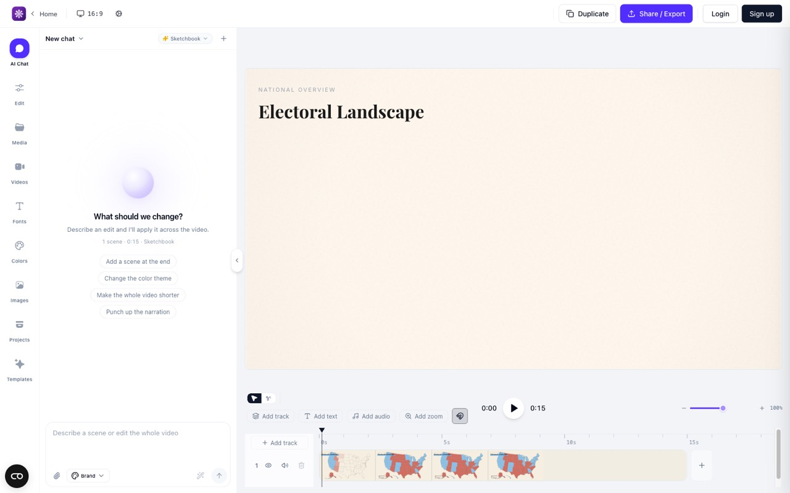
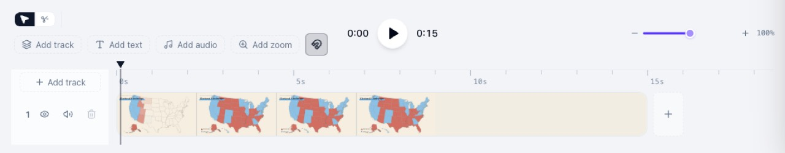
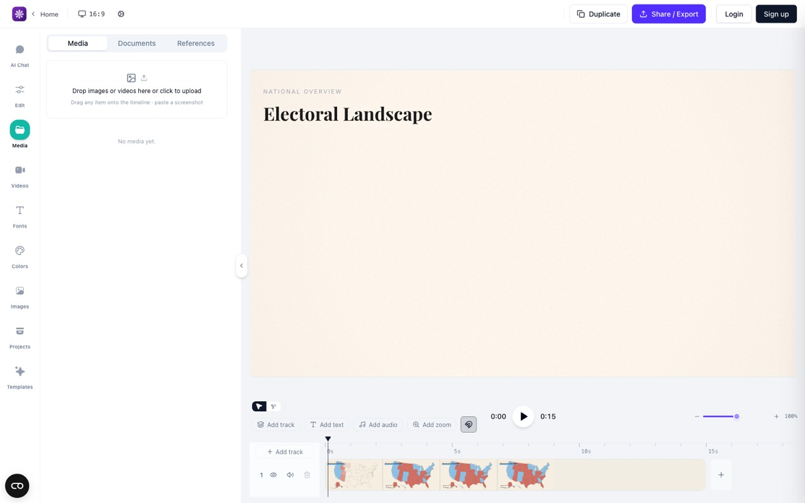
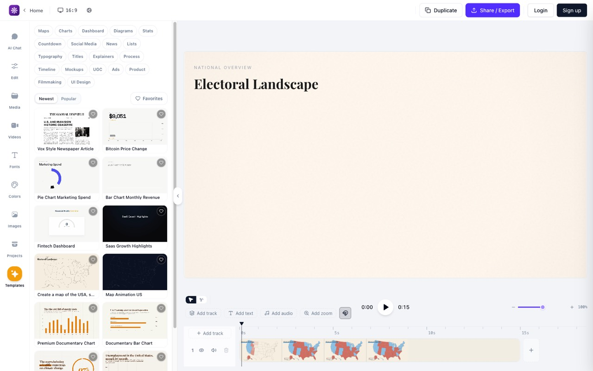

# Spec Editing Experience — Detailed Goals

> **Reference**: [Main Spec File](./spec-editing-experience-complete.md)
> **Backlog**: [15-build-order §Giai đoạn 5](../../../product-features/15-build-order.md) — 5.1–5.9
> **Trạng thái**: **Bản 8 — Approved 2026-08-20 cho remediation**. Bản 8 giữ nguyên R1–R12 bản 7 và
> bổ sung R13–R15 từ deep review hậu triển khai; yêu cầu “Fix các review” là xác nhận tường minh để
> thực thi các AC remediation, không phải quyền hạ severity hoặc bỏ finding. Bản 7 đã đồng bộ AC R4.5:
> preview settings đi qua cùng double-buffer như mọi cập nhật preview khác. Bản 6 đã đổi R4 sang
> `PlayerHost` + double-buffer; bản 5 sửa R9.9 và thêm R10–R12.

## Spec Goal

Studio hiện **đọc tốt, sửa kém**: timeline vẽ được scene/element/tween nhưng mọi thay đổi timing
phải gõ số trong [`scene-timing-form.tsx`](../../../../src/components/studio/scene-timing-form.tsx),
thứ tự scene chỉ đọc được qua [`scene-order.ts`](../../../../src/lib/studio/scene-order.ts), không có
undo, và file/asset phải sửa ngoài app. Spec này đóng khoảng cách đó: thao tác dựng phổ thông làm
được bằng chuột ngay trên timeline, sai thì undo, preview không mất mạch, và asset/template/block
lấy được trong app.

Ràng buộc xuyên suốt: **không mở đường ghi thứ hai**. Mọi mutation đi qua use case Core +
`WriteAuthority`, kèm `expectedContentHash` (file) hoặc `expectedRevision` (entity) theo đúng
[06-validation §7](../../../steering/06-validation.md) — kể cả undo/redo và cài block.

**Baseline thật (đo trên code, không phải ước đoán)** — đây là thứ quyết định ước lượng:

| Đã có | Chưa có |
|---|---|
| [`setSceneTiming`](../../../../packages/core/src/usecase/project-writes.ts#L162): ripple theo track, `extendRoot`, guard `MAX_PROJECT_DURATION_SECONDS`, `expectedContentHash` | Use case **đổi thứ tự scene** dạng composite (R2) — hôm nay chỉ có set timing từng scene |
| `GET /v1/projects/:id/files`, `GET .../assets/:path`, `PUT .../files` | **Upload asset** + probe metadata + validate magic byte (R5) |
| Word timing ở Core ([`word-timings.ts`](../../../../packages/core/src/domain/word-timings.ts)), gồm cả nhánh ước lượng | **Sinh caption cue** từ word timing và mount vào composition (R6) |
| `POST /v1/projects/:id/motion-libraries` (vendor thư viện motion) | **Duyệt catalog + cài block + mount vào composition** (R9) |
| Audit, journal, backup destructive, SSE | **Lịch sử undo/redo** — không có gì trong code hôm nay (R3) |
| Timeline vẽ scene/element/tween, storyboard, form timing | Tương tác kéo trên timeline (R1), kéo-thả thứ tự (R2), thư viện template (R7) |

Nói cách khác: R1 và R4 phần lớn là UI, còn **R2, R3, R5, R6, R9 đều cần capability backend mới**.
Ước lượng ~212 SP ở dưới do đó là **sàn**. Bản 1 ước ~128 (đo là thấp), bản 4 ~157, bản 5 cộng ba requirement mới (R10–R12) do người dùng kéo vào từ ảnh reference. Chốt lại sau Design.

## Overview

Nguồn chân lý vẫn là file HTML/CSS trong project, không phải state của trình duyệt. Mọi requirement
dưới đây viết theo giả định đó: UI đề xuất thay đổi, Core validate, `WriteAuthority` ghi, revision và
content hash quyết định ai thắng khi có tranh chấp — kể cả khi bên kia là một agent MCP đang sửa cùng
project.

**Tham chiếu UX**: ảnh chụp editor tham khảo (motionvid.ai) nằm trong chính spec này —
[`reference-editor/`](./reference-editor/README.md), 10 ảnh + ghi chú + `capture.mjs` chụp lại được.
Dùng làm đối chiếu hành vi (snap toggle, zoom % của timeline, track header eye/mute/delete, clip vẽ
bằng dải thumbnail nhiều frame, mode con trỏ vs cắt), **không** phải mục tiêu sao chép giao diện.
Ảnh liên quan trực tiếp được nhúng ngay tại requirement tương ứng: R1/R2 → `02-timeline.jpg`,
R5 → `rail-media.jpg`, R7 → `rail-templates.jpg`.

> **Đọc ảnh trên**: rail dọc bên trái là **bộ chọn ngữ cảnh** (AI Chat · Edit · Media · Fonts · Colors ·
> Templates…), panel bên cạnh đổi nội dung theo rail, canvas ở giữa, timeline chiếm hết chiều ngang
> **dưới canvas** chứ không nằm trong panel. Studio hiện tại của vidcom
> ([`studio-shell.tsx`](../../../../src/components/studio/studio-shell.tsx)) đã chia pane bằng
> `ResizablePanelGroup` — spec này **không** đổi bố cục đó; ảnh chỉ dùng để đối chiếu chỗ đặt điều
> khiển khi thêm thao tác kéo.

## Data and Persistence Scope

- **Persisted data involved**:
  - File nguồn composition (`index.html`, scene `.html`, CSS) — nơi timing, thứ tự và nội dung scene thực sự nằm.
  - File asset trong project (ảnh/video/audio/font). **Metadata probe là dữ liệu dẫn xuất**, không phải nguồn: mặc định đọc theo yêu cầu từ file thật; nếu Design chọn cache thì cache MUST bị vô hiệu khi (mtime, size, content hash) của file đổi, và một cache không đọc được phải rơi về probe lại chứ không phải báo lỗi.
  - Projection `.vidcom/` (`sourceRevision`, snapshot dẫn xuất) — dẫn xuất, không phải nguồn.
  - SQLite app-data: journal thao tác workspace, audit ghi, job store — **không thêm bảng nào cho undo**. OQ-2 đã chốt undo là **phiên làm việc, 50 bước, trong bộ nhớ**; lịch sử undo không phải dữ liệu được lưu.
  - Cache catalog registry/template trên máy người dùng — **bắt buộc có** theo OQ-4 (bundled + cache), không phải tuỳ chọn của Design.
  - **Cache thumbnail timeline (R10)** — dữ liệu dẫn xuất thuần: phải vô hiệu hoá được theo từng clip bị ảnh hưởng (R10.6), phải có **giới hạn tăng trưởng** và cơ chế loại bỏ, và mất cache phải là chuyện vô hại (sinh lại được). Nằm ở bộ nhớ hay trên đĩa app-data, và thuật toán loại bỏ, là việc của Design.
  - Narration sidecar + word timing đã sinh ở Core ([`word-timings.ts`](../../../../packages/core/src/domain/word-timings.ts)).
- **Data ownership**: project (file nguồn, asset, narration) · workspace (journal, audit) · máy người dùng (cache catalog registry/template).
- **Lifecycle**: create/update/delete file & asset trong phạm vi project; **lịch sử undo sống và chết cùng phiên studio** (tối đa 50 mục, không persist); cache catalog làm mới khi có mạng và luôn có bản bundled làm đáy; backup theo cơ chế destructive đã có ở GĐ 3.
- **Consistency requirements**: mọi ghi mang `expectedContentHash`/`expectedRevision`; ghi đè khi hash lệch là lỗi, không phải là thắng; ripple theo track giữ bất biến của [`planRipple`](../../../../packages/core/src/domain/invariants.ts#L67); kéo-thả sinh **một** mutation composite, không phải chuỗi ghi từng scene.
- **Query and reporting needs**: liệt kê cây file theo project (đã có `GET /v1/projects/:id/files`), đọc metadata asset, duyệt/lọc catalog template và registry block.
- **Volume and growth assumptions**: một người dùng, một máy; project cỡ chục scene, trăm file; kéo chuột sinh **nhiều sự kiện/giây** nhưng chỉ được commit khi thả (R1.4).
- **Migration/backfill expectations**: **không backfill nội dung project** — không sửa file HTML/CSS/asset đang có của người dùng để hợp với tính năng mới. Undo không cần migration (không persist). Nếu Design chọn cache metadata asset hoặc catalog trong SQLite app-data thì đó là **bảng mới** qua cơ chế migration đã có, không đổi ngữ nghĩa bảng cũ.
- **Audit and compliance needs**: undo/redo và upload asset đều là ghi ⇒ vào audit như mọi mutation khác; không có PII mới; xoá file đi qua đường destructive + backup đã có.

## Requirements

### Requirement 1 — Kéo timing trên timeline (5.1, SC-7)

**User Story:** Là người dựng video, tôi muốn kéo bar và kéo mép clip trên timeline để đổi start và duration, để chỉnh nhịp bằng mắt thay vì gõ số.

> **Đọc ảnh trên**: hàng công cụ có mode con trỏ / cắt, `Add track`, và **toggle magnet** — snap là
> trạng thái nhìn thấy được chứ không phải hành vi ngầm (AC 6, 7). Bên phải là **zoom timeline có
> phần trăm** (AC 13). Track header trái giữ số track + ẩn/hiện + mute + xoá. Clip vẽ bằng **dải
> thumbnail nhiều frame**, nên mép clip là vùng kéo riêng tách khỏi thân clip (AC 1, 2).
> Vidcom khác ở chỗ scene ở đây là sub-composition có `trackIndex` và ripple theo track — mượn cách
> bố trí điều khiển, không mượn mô hình dữ liệu.

#### Acceptance Criteria
1. WHEN người dùng kéo thân một clip theo trục ngang THEN hệ thống SHALL đổi `start` của scene đó và giữ nguyên `duration`.
2. WHEN người dùng kéo mép trái hoặc mép phải của clip THEN hệ thống SHALL đổi `duration` (và `start` với mép trái) mà không đổi mép còn lại.
3. WHILE đang kéo THEN hệ thống SHALL hiển thị vị trí/độ dài dự kiến trên chính clip và SHALL NOT ghi file.
4. WHEN người dùng thả chuột THEN hệ thống SHALL gửi **một** yêu cầu ghi duy nhất kèm `expectedContentHash` của file nguồn hiện tại.
5. WHEN người dùng nhấn `Esc` trong lúc kéo THEN hệ thống SHALL huỷ thao tác và trả clip về timing trước đó, không ghi gì.
6. IF snap đang bật THEN hệ thống SHALL bám giá trị kéo vào mốc gần nhất trong {biên clip cùng track, playhead, mốc giây của ruler} khi khoảng cách trên màn hình **≤ 8 px**, và SHALL hiển thị mốc đang bám.
6b. WHEN quy đổi ngưỡng 8 px sang thời gian THEN hệ thống SHALL dùng tỉ lệ zoom hiện tại và SHALL kẹp kết quả trong khoảng **[1 khung hình, 0.5 giây]** — không kẹp dưới thì ở zoom rất sâu snap thành vô nghĩa, không kẹp trên thì ở zoom rất xa mọi thứ dính vào nhau.
7. IF snap đang tắt THEN hệ thống SHALL cho phép giá trị tự do nhưng SHALL làm tròn về **khung hình gần nhất** theo fps của project (`round(t × fps) / fps`) — timeline không tạo ra được giá trị nằm giữa hai khung, vì render không có chỗ cho nó.
8. IF ripple đang bật THEN hệ thống SHALL đẩy các scene sau nó **trong cùng track** theo đúng `planRipple`, và SHALL hiển thị số scene bị dịch trước khi commit.
9. WHEN thao tác kéo làm tổng thời lượng vượt root duration THEN hệ thống SHALL hiện lựa chọn nới root (`extendRoot`) hoặc huỷ, chứ SHALL NOT tự nới.
10. WHEN thao tác kéo làm thời lượng vượt `MAX_PROJECT_DURATION_SECONDS` THEN hệ thống SHALL từ chối và nêu giới hạn runtime, không có lựa chọn nới.
11. WHEN ghi thất bại vì content hash lệch (file bị agent/SDK sửa trong lúc kéo) THEN hệ thống SHALL giữ nguyên hiển thị, báo "nguồn đã đổi", và SHALL cung cấp hành động tải lại trước khi thử lại.
12. WHEN người dùng đổi timing THEN hệ thống SHALL vẫn cho phép nhập số trong form timing hiện có — kéo là đường thứ hai, không thay thế.
13. WHEN timeline zoom đổi THEN ngưỡng snap SHALL giữ nguyên **khoảng cách trên màn hình** (8 px) chứ không giữ nguyên khoảng thời gian, trong hai cận của AC 6b — snap là cảm giác của con trỏ, và một ngưỡng cố định theo thời gian sẽ dính cả giây ở zoom sâu.

### Requirement 2 — Kéo-thả đổi thứ tự scene (5.2, SC-6)

**User Story:** Là người dựng video, tôi muốn kéo-thả để đổi thứ tự scene, để sắp lại mạch video mà không tự tính lại `start` của từng scene.

> **Tham chiếu**: cùng ảnh [`02-timeline.jpg`](./reference-editor/02-timeline.jpg) — clip nằm liền
> nhau trong một lane, nên đổi thứ tự là dịch chuỗi chứ không phải hoán vị hai ô. Vidcom có thêm
> storyboard ([`scene-storyboard.tsx`](../../../../src/components/studio/scene-storyboard.tsx)), nên
> kéo-thả tồn tại ở **hai** bề mặt và cả hai phải cho cùng một kết quả đánh số (AC 6).

#### Acceptance Criteria
1. WHEN người dùng kéo một thẻ scene trong storyboard tới vị trí khác THEN hệ thống SHALL hiển thị vị trí chèn dự kiến trước khi thả.
2. WHEN người dùng thả THEN hệ thống SHALL tính lại `start` của các scene bị ảnh hưởng **trong cùng track**, giữ nguyên `duration` từng scene, và SHALL **bảo toàn khoảng trống hiện có**: khoảng cách giữa hai scene liền kề trước khi sắp lại được giữ nguyên cho cặp mới ở cùng vị trí, chứ SHALL NOT tự dồn cả track thành chuỗi liền mạch.
3. WHEN người dùng chọn tường minh hành động "dồn liền mạch" THEN hệ thống SHALL xoá mọi khoảng trống của track đó và SHALL báo trước số scene bị dịch — dồn là một hành động riêng, không phải hệ quả ngầm của việc đổi thứ tự.
4. WHEN đổi thứ tự thành công THEN hệ thống SHALL gửi **một** mutation composite duy nhất, không phải một chuỗi ghi từng scene.
5. WHEN người dùng kéo scene sang track khác trên timeline THEN hệ thống SHALL đổi `trackIndex`, và SHALL từ chối kèm lý do cụ thể trong các trường hợp: `trackIndex` không nguyên · `start` âm · `duration` ≤ 0 · tổng thời lượng vượt root duration mà người dùng không chọn `extendRoot` · tổng vượt `MAX_PROJECT_DURATION_SECONDS`. Chồng lấn với scene khác **trong cùng track** là **diagnostic, không phải lỗi chặn** — theo đúng luật "Diagnostics ≠ validation" của [06-validation §8](../../../steering/06-validation.md).
6. IF thứ tự và timing sau khi thả trùng với trước đó THEN hệ thống SHALL không ghi gì.
7. WHEN người dùng kéo một scene qua ranh giới nhóm content ↔ transition/overlay của [`splitScenes`](../../../../src/lib/studio/scene-order.ts#L18) THEN hệ thống SHALL từ chối và nêu rằng transition/overlay sắp thứ tự trong nhóm của chúng — nhóm được quyết bởi loại scene, không phải bởi vị trí thả.
8. WHEN đổi thứ tự xong THEN hệ thống SHALL đánh số lại storyboard và timeline từ **cùng một** nguồn `splitScenes`, sao cho thẻ số N và lane số N luôn là cùng một scene.
9. WHEN mutation thất bại THEN hệ thống SHALL trả thứ tự hiển thị về trạng thái server và nêu lý do.
10. WHEN một thẻ scene đang được focus AND người dùng nhấn `Alt`/`Option` + `←`/`→` (storyboard) hoặc `Alt`/`Option` + `↑`/`↓` (lane dọc) THEN hệ thống SHALL dịch scene đó một vị trí theo hướng tương ứng, tạo cùng mutation như thao tác chuột. **Không dùng `Cmd`/`Ctrl` + mũi tên**: trên macOS đó là Back/Forward của trình duyệt, và một phím tắt sắp xếp lại scene mà đôi khi rời khỏi trang là phím tắt người dùng học cách không bấm.
11. WHEN scene được dịch bằng bàn phím THEN hệ thống SHALL giữ focus trên chính scene đó sau khi sắp lại và SHALL thông báo vị trí mới cho công nghệ trợ năng.
12. IF scene đang ở đầu hoặc cuối nhóm của nó THEN phím dịch tiếp theo hướng đó SHALL không làm gì và SHALL NOT báo lỗi.

### Requirement 3 — Undo/redo cấp composition (5.3, CE-8)

**User Story:** Là người dựng video, tôi muốn undo/redo, để thử một hướng dựng rồi quay lại mà không phải nhớ mình vừa đổi gì.

**Đơn vị undo = một mutation của `WriteAuthority`, trọn vẹn.** Không phải "một file", cũng không
phải "một lần bấm". Ranh giới này là thứ duy nhất giữ được tính nhất quán, vì Core đã ghi nhiều file
trong **một** mutation composite với **một** revision: [`createScene`](../../../../packages/core/src/usecase/project-writes.ts#L565)
ghi ba file cùng lúc — scene HTML, root composition và narration sidecar.

Hệ quả phải nói thẳng: **undo một mutation composite sẽ hoàn tác cả ba file đó**, tức là file scene
và sidecar vừa được tạo sẽ **bị xoá** khi hoàn tác. Đó không phải ngoại lệ của "cấp composition" —
đó chính là nghĩa của việc hoàn tác một mutation nguyên tử. Điều nằm ngoài undo là những ghi **không
thuộc mutation đó**: asset upload, thao tác file thủ công, và file đã tồn tại từ một mutation trước.

| Thao tác | Undo được | Hoàn tác cái gì |
|---|---|---|
| Đổi timing scene (R1) | ✅ | File composition trở về nội dung trước mutation |
| Đổi thứ tự / `trackIndex` scene (R2) | ✅ | Toàn bộ mutation composite, mọi file trong đó |
| Sửa script/text scene | ✅ | File composition liên quan |
| Chèn scene từ template (R7) | ✅ | **Cả ba file** của `createScene`: mount trong root bị gỡ, scene HTML và narration sidecar vừa tạo **bị xoá** — chúng nằm trong cùng mutation |
| Cài + mount block (R9) | ✅ | Cả mutation (R9.9, bản 5): file mutation **tạo mới** bị xoá, file mutation **thay thế** được khôi phục về nội dung trước, file không bị mutation sửa thì không đụng tới |
| Thả asset tạo scene bọc (R11) | ✅ | Gỡ mount khỏi root, xoá scene wrapper và sidecar mà mutation tạo; **file asset nguồn luôn được giữ** |
| Áp font project-local vào scene/composition (R5.6c) | ✅ | Composition/style trở về nội dung trước mutation; **file font đã upload được giữ** |
| Dịch hoặc xoá **nhiều** scene clip (R12) | ✅ | Toàn bộ mutation: timing, mount, và mọi file scene/sidecar mà mutation đó xoá |
| Sửa nội dung file trong code editor | ✅ khi đã ghi | File đó trở về nội dung trước |
| Upload asset, tạo/đổi tên/xoá file & thư mục **từ cây file** (R5) | ❌ ở spec này | — dùng backup + journal của đường destructive đã có |
| Đổi preview settings, zoom, snap, chọn scene | ❌ | Trạng thái xem, không phải nội dung |
| Ghi tới từ agent MCP / CLI / editor ngoài | ❌ | Không phải hành động của người dùng trong UI; xem AC 5 |

> **Xoá scene từ timeline ≠ xoá file từ cây file.** Cái đầu là mutation composition (có undo, kể cả
> khi nó xoá file scene và sidecar kèm theo). Cái sau là thao tác filesystem người dùng chủ động làm
> trên cây file, và đi đường destructive + backup của R5.

#### Acceptance Criteria
1. WHEN một mutation **thuộc bảng phạm vi trên** thành công THEN hệ thống SHALL ghi **toàn bộ mutation đó như một mục duy nhất** vào lịch sử undo của project đang mở — một mutation composite ghi ba file là **một** mục, không phải ba.
1b. WHEN hoàn tác một mục THEN hệ thống SHALL đưa **mọi** file thuộc mutation đó về trạng thái trước mutation, kể cả việc **xoá những file mà chính mutation đó đã tạo**, trong một mutation nghịch đảo duy nhất — SHALL NOT hoàn tác một phần.
1c. WHEN việc hoàn tác cần xoá file THEN hệ thống SHALL đi qua đúng đường destructive đã có (backup + journal), giống mọi đường xoá khác.
2. WHEN người dùng gọi undo THEN hệ thống SHALL đưa file nguồn về đúng nội dung trước mutation đó và cập nhật mọi pane đang hiển thị.
3. WHEN người dùng gọi redo sau undo THEN hệ thống SHALL áp lại đúng mutation vừa hoàn tác.
4. WHEN người dùng thực hiện mutation mới sau khi undo THEN hệ thống SHALL bỏ nhánh redo.
5. IF file nguồn đã bị sửa bởi tác nhân ngoài UI (agent MCP, CLI, editor khác) kể từ mutation ở **đỉnh** stack THEN hệ thống SHALL **chặn tại mục đó**: undo bị từ chối kèm lý do "nguồn đã đổi", các mục dưới nó **vẫn giữ trong lịch sử** nhưng không được nhảy cóc qua mục bị chặn, và hệ thống SHALL NOT xoá trắng stack.
5b. WHEN mục bị chặn ở AC 5 tồn tại THEN hệ thống SHALL cung cấp đúng hai lối thoát tường minh: tải lại từ nguồn (bỏ lịch sử của project đó) hoặc giữ nguyên và tiếp tục sửa — SHALL NOT có lối "bỏ qua và undo tiếp", vì undo qua một thay đổi mình không thấy chính là ghi đè việc của agent.
6. WHEN undo/redo được áp THEN hệ thống SHALL đi qua đúng `WriteAuthority` và ghi audit như mọi mutation khác.
7. WHEN không còn mục để undo hoặc redo THEN hệ thống SHALL vô hiệu hoá hành động tương ứng thay vì báo lỗi.
8. WHEN người dùng tải lại trang hoặc đóng và mở lại project THEN hệ thống SHALL bắt đầu với lịch sử rỗng — undo có phạm vi **phiên làm việc** (OQ-2) — và SHALL nói rõ phạm vi đó tại chỗ đặt nút undo, không phải chỉ trong tài liệu.
9. WHEN lịch sử đạt **50 mục** THEN hệ thống SHALL loại mục cũ nhất khi thêm mục mới, SHALL NOT để lịch sử tăng vô hạn.

### Requirement 4 — `PlayerHost` không remount khi ghi (5.4, PR-10, PF-5)

**User Story:** Là người dựng video, tôi muốn preview giữ nguyên vị trí và trạng thái phát khi tôi ghi thay đổi, để không mất mạch mỗi lần chỉnh.

#### Acceptance Criteria
1. WHEN một mutation ghi thành công THEN hệ thống SHALL cập nhật preview mà **không dựng lại `PlayerHost`** — thành phần của vidcom sở hữu transport (thời điểm, play/pause, tốc độ, muted) và vòng đời preview. Quan sát được: `PlayerHost` giữ nguyên danh tính và không có lần khởi tạo lại nào của nó.
   > **Đổi ở bản 6 (2026-08-16).** Bản 5 lấy `<hyperframes-player>` làm bất biến. Spike đo được điều đó chặn mất cách duy nhất giữ khung cuối khi tài liệu mới hỏng: dựng bản mới **phía sau** rồi mới đổi hiển thị. Người dùng chọn hạ bất biến xuống mức `PlayerHost`; engine HyperFrames bên trong được phép thay thế, miễn transport và hình ảnh không đứt.
1a. WHEN preview cần cập nhật THEN hệ thống SHALL dựng tài liệu mới trong **một engine đệm ẩn**, chờ nó đạt hợp đồng sức khoẻ, rồi mới đổi hiển thị và gỡ engine cũ.
   > **Đổi ở bản 6.** Bản 5 yêu cầu chỉ nạp lại đúng sub-composition bị đổi (PR-11). Spike đo được đường swap tại chỗ mang ba lỗi im lặng — URL asset tương đối hỏng, script không chạy (mà chạy thì lệch parity với đường nạp gốc), và side effect của scene cũ không gỡ được. Người dùng chọn **một** đường duy nhất: double-buffer cho mọi thay đổi. PR-11 (hot-reload từng composition) **chuyển sang Giai đoạn 6**.
1b. IF engine đệm **không** đạt hợp đồng sức khoẻ trong thời hạn THEN hệ thống SHALL gỡ nó, giữ nguyên engine đang chiếu, và hiện lỗi — người dùng vẫn thấy khung hình cuối, không phải canvas trắng.
1c. WHEN preview cập nhật sau ghi THEN hệ thống SHALL áp thay đổi **trong vòng 500 ms** kể từ khi ghi thành công, đo từ phản hồi ghi tới khung hình đầu tiên phản ánh nội dung mới.
2. WHEN preview cập nhật sau ghi THEN hệ thống SHALL giữ `currentTime` lệch **không quá 1 khung hình** so với **thời điểm đổi hiển thị** (không phải thời điểm bắt đầu dựng đệm — đồng hồ vẫn chạy trong lúc dựng), trong giới hạn thời lượng mới.
2c. WHEN đổi hiển thị THEN hệ thống SHALL giữ nguyên **tốc độ phát** và trạng thái **muted**.
2b. WHEN preview cập nhật sau ghi THEN trạng thái play/pause sau cập nhật SHALL bằng đúng trạng thái trước cập nhật.
3. IF thay đổi làm thời điểm hiện tại vượt quá thời lượng mới THEN hệ thống SHALL kẹp playhead về cuối thay vì nhảy về 0.
4. WHEN người dùng đang phát và một ghi xảy ra THEN hệ thống SHALL giữ trạng thái đang phát.
5. WHEN preview settings đổi THEN hệ thống SHALL áp thay đổi qua **cùng cơ chế double-buffer** của
   AC 1a, giữ nguyên `PlayerHost` và transport, đồng thời đáp ứng ngân sách AC 1c. Không có đường
   hot-reload riêng cho preview settings trong Giai đoạn 5.
6. IF composition mới không tải được THEN hệ thống SHALL giữ khung hình cuối cùng và hiện lỗi, SHALL NOT để canvas trống không giải thích.
7. WHEN ghi tới từ tác nhân ngoài UI qua SSE THEN hệ thống SHALL áp cùng quy tắc giữ trạng thái như ghi từ UI.

### Requirement 5 — CRUD file/folder + upload asset + probe metadata (5.5, FA-1..3)

**User Story:** Là người dựng video, tôi muốn tạo/đổi tên/xoá file & thư mục và đưa ảnh/video/audio/**font** vào project ngay trong app, để không phải rời app để quản lý tài sản.

> Bốn loại, theo đúng FA-2. Font là loại thứ tư và có đường xử lý riêng: không probe được như media,
> nhưng phải dùng được trong composition sau khi upload.

**Giới hạn và allowlist đã chốt (OQ-6, 2026-08-15)** — đây là giá trị mà AC 4, 4b và 8 kiểm:

| Loại | Giới hạn | Đuôi file được phép |
|---|---|---|
| Ảnh | 25 MB | `png` `jpg` `jpeg` `webp` `gif` `svg` |
| Video | 500 MB | `mp4` `webm` `mov` |
| Audio | 100 MB | `mp3` `wav` `m4a` `ogg` |
| Font | 5 MB | `woff2` `woff` `ttf` `otf` |

**SVG là ngoại lệ có điều kiện**: nó là tài liệu chạy script được, và preview render nó trong cùng
trang với composition. Nhận SVG kèm bắt buộc sanitize (AC 4e), không nhận suông.

> **Đọc ảnh trên**: dropzone nêu **ba** đường đưa asset vào — thả file, click chọn, dán ảnh chụp
> màn hình — và nói trước rằng item kéo thẳng được lên timeline. Empty state có chữ ("No media yet."),
> không phải khung trắng (AC 9 và R7.6 cùng luật).
> Vidcom khác: asset nằm trong thư mục project trên đĩa người dùng, nên thêm ràng buộc containment
> (AC 1) và đường xoá destructive có backup (AC 3) mà editor cloud không có.

#### Acceptance Criteria
1. WHEN người dùng tạo file hoặc thư mục trong cây project THEN hệ thống SHALL tạo nó bên trong project và SHALL từ chối mọi đường dẫn thoát ra ngoài (`resolveInProject`).
2. WHEN người dùng đổi tên hoặc di chuyển một mục THEN hệ thống SHALL giữ nội dung và cập nhật cây hiển thị.
3. WHEN người dùng xoá một mục THEN hệ thống SHALL đi qua đường destructive đã có: xác nhận, backup, journal.
4. WHEN người dùng upload asset THEN hệ thống SHALL lưu vào thư mục asset của project và SHALL từ chối đuôi file ngoài allowlist theo loại (ảnh / video / audio / font).
4b. WHEN nhận một file upload THEN hệ thống SHALL kiểm tra **magic bytes** của nội dung và SHALL từ chối khi nội dung không khớp loại đã khai — `accept="…/*"` ở input HTML bypass được, nên MIME do client khai không phải bằng chứng.
4c. WHEN nhận tên file THEN hệ thống SHALL sanitize nó (bỏ thành phần đường dẫn, ký tự điều khiển, ký tự không hợp lệ theo hệ điều hành) và SHALL giữ tên đã sanitize làm tên lưu thật.
4d. IF tên file sau sanitize trùng một file đã có THEN hệ thống SHALL hoặc đổi tên theo quy tắc hiển thị được cho người dùng, hoặc từ chối kèm lý do — SHALL NOT ghi đè im lặng.
4e. WHEN nhận một file SVG THEN hệ thống SHALL sanitize nội dung — loại `<script>`, thuộc tính `on*`, và tham chiếu ngoài — trước khi move vào vị trí đích, và SHALL từ chối file không sanitize được. SVG được render trong cùng trang với composition, nên một SVG chưa lọc là script chạy trong preview.
4f. WHEN ghi file upload THEN hệ thống SHALL ghi vào file tạm, chạy **gate** rồi mới move vào vị trí đích — SHALL NOT để một file dở dang xuất hiện ở vị trí đích tại bất kỳ thời điểm nào. **Gate chỉ gồm ba thứ: kích thước (AC 8), magic bytes (AC 4b), và sanitize SVG (AC 4e).** Một trong ba hỏng ⇒ từ chối, không move.
4g. WHEN gate ở AC 4f đã qua THEN hệ thống SHALL move file rồi mới probe metadata. **Probe là best-effort, không phải gate**: probe thất bại SHALL NOT làm hỏng upload — file vẫn nằm ở đích và metadata ghi là không xác định (AC 7). Một video codec lạ vẫn là một file người dùng có quyền giữ trong project của họ.
5. WHEN upload đang chạy THEN hệ thống SHALL hiện tiến độ và cho phép huỷ.
5b. WHEN upload bị huỷ hoặc thất bại THEN hệ thống SHALL xoá mọi file tạm đã tạo và SHALL để project ở đúng trạng thái trước khi upload.
6. WHEN upload một asset media xong THEN hệ thống SHALL đọc metadata thật từ file (dimension, duration, codec, size) và hiện chúng trong UI.
6b. WHEN upload một font xong THEN hệ thống SHALL đọc family/style nếu đọc được và SHALL NOT coi việc thiếu duration/dimension là lỗi.
6c. WHEN một font upload thành công và đọc được family/style THEN font đó SHALL xuất hiện trong bộ chọn font của studio với đúng family/style đã đọc, SHALL áp dụng được cho phạm vi scene hoặc composition mà người dùng chọn, và preview lẫn render SHALL dùng **chính file font trong project** — không phải font cùng tên đang cài trên máy.
6d. IF không đọc được family/style của font THEN hệ thống SHALL giữ file và nêu rằng font chưa dùng được kèm lý do, SHALL NOT hiện nó trong bộ chọn như một font hợp lệ.
7. IF asset không probe được THEN hệ thống SHALL vẫn giữ file và đánh dấu metadata không xác định, SHALL NOT im lặng bỏ qua.
8. WHEN file vượt giới hạn kích thước theo loại THEN hệ thống SHALL từ chối trước khi ghi bất cứ thứ gì vào vị trí đích và nêu giới hạn cụ thể của loại đó.
9. WHEN một thao tác file thất bại THEN hệ thống SHALL giữ nguyên cây đang hiển thị và nêu lỗi trên chính mục liên quan.

### Requirement 6 — Word timestamp → caption đồng bộ (5.6, NT-8)

**User Story:** Là người dựng video, tôi muốn **sinh** caption từ narration và thấy nó sáng theo từng từ đúng nhịp giọng đọc, để phần chữ tự có và chạy khớp tiếng thay vì phải tự gõ rồi tự canh.

> NT-8 là **"word-level timestamps → sinh caption đồng bộ"**. Chỉ đổi màu một caption có sẵn là làm
> nửa việc: project không có caption thì vẫn không có caption. Requirement này gồm cả việc **tạo**
> caption cue và mount vào composition, theo cùng khuôn `<… class="clip" data-start>` mà NT-4 dùng cho audio.

#### Acceptance Criteria
1. WHEN người dùng yêu cầu sinh caption cho một scene có narration THEN hệ thống SHALL tạo caption cue từ word timing của narration đó và mount chúng vào composition qua use case ghi đã có.
2. WHEN sinh caption THEN hệ thống SHALL nhóm từ thành cue theo ranh giới câu (dấu câu kết câu) và SHALL cắt cue khi chạm bất kỳ giới hạn nào sau đây: **quá 84 ký tự** (2 dòng × 42), **quá 7 giây**, hoặc gặp khoảng im lặng ở AC 4. Cue cuối của một câu được phép ngắn hơn mọi giới hạn.
2b. WHEN một cue được sinh THEN hệ thống SHALL cố kéo dài nó tới tối thiểu **1.2 giây**, theo đúng thứ tự ưu tiên sau — sàn này là mong muốn, **không** được phép đẩy cue khác hay tràn khỏi scene:
   - a. IF còn từ kế tiếp **trong cùng câu và cùng narration cue** THEN gộp chúng vào cue này cho tới khi đạt 1.2 giây hoặc chạm một giới hạn ở AC 2.
   - b. IF không gộp được nhưng còn **thời gian trống** trước mốc bắt đầu của cue kế tiếp THEN kéo dài cue tới tối đa 1.2 giây trong phần trống đó.
   - c. IF cue kế tiếp bắt đầu sớm hơn, hoặc scene kết thúc sớm hơn THEN **kẹp cue tại mốc đó và chấp nhận cue ngắn hơn 1.2 giây**. Hệ thống SHALL NOT dịch cue kế tiếp, SHALL NOT chồng hai cue, và SHALL NOT để caption chạy quá cuối scene.
2c. WHEN hai narration cue khác nhau (NT-7) nằm sát nhau THEN hệ thống SHALL NOT gộp caption qua ranh giới đó, kể cả khi cue caption bên này ngắn hơn 1.2 giây — ranh giới narration cue thắng sàn thời lượng.
3. WHEN narration của scene có **nhiều cue** (NT-7) THEN hệ thống SHALL sinh caption cho từng cue theo timing riêng của cue đó và SHALL NOT trộn chúng thành một dải liên tục.
4. WHEN giữa hai từ có khoảng im lặng **≥ 0.6 giây** THEN hệ thống SHALL kết thúc cue trước khoảng im lặng đó thay vì kéo dài cue qua đoạn không có tiếng.
5. WHEN sinh caption THEN hệ thống SHALL giữ nguyên dấu câu và chữ hoa/thường của script, và SHALL NOT tách dấu câu thành từ riêng.
6. WHEN narration có word timing từ engine THEN hệ thống SHALL dùng chúng để xác định từ đang đọc.
7. IF engine không trả word timing THEN hệ thống SHALL dùng ước lượng đã có ở Core, SHALL vẫn sinh caption, và SHALL đánh dấu nguồn timing là **ước lượng** ở cả UI lẫn dữ liệu caption.
8. WHEN preview phát tới thời điểm của một từ THEN hệ thống SHALL làm nổi đúng từ đó bằng `subtitles.activeColor` của composition.
9. IF scene chưa có caption THEN hệ thống SHALL nói rõ là chưa có và đưa ra hành động sinh caption, SHALL NOT hiện vùng caption trống như thể đã có.
10. IF scene không có narration THEN hệ thống SHALL vô hiệu hoá hành động sinh caption kèm lý do, SHALL NOT sinh caption không có nhịp.
11. WHEN người dùng sửa script scene THEN hệ thống SHALL đánh dấu narration và caption đã sinh là stale cho tới khi narration được sinh lại — sửa script SHALL NOT tự chạy lại TTS (NT-13).
12. IF caption bị đánh dấu stale THEN hệ thống SHALL vẫn hiển thị caption nhưng SHALL cảnh báo rằng nhịp có thể sai.
13. WHEN người dùng sinh lại caption cho một scene đã có caption THEN hệ thống SHALL thay caption cũ trong cùng một mutation, SHALL NOT để lại cue cũ chồng lên cue mới.
14. WHEN caption được xuất ra render THEN hệ thống SHALL cho ra cùng nhịp đã thấy trong preview.

### Requirement 7 — Thư viện template scene (5.7, SC-12)

**User Story:** Là người dựng video, tôi muốn chèn scene từ thư viện template, để dựng nhanh các dạng scene lặp lại.

> **Đọc ảnh trên**: lọc bằng **chip tag** (Maps, Charts, Dashboard, Stats, Titles, Explainers…) chứ
> không phải cây thư mục; lưới 2 cột, mỗi thẻ có ảnh preview tĩnh + tên (AC 1, 2). Cùng ngôn ngữ lọc
> này áp cho R9 registry — đó chính là lý do OQ-5 hỏi hai catalog có nên chung một nguồn không.
> **Sort Newest/Popular và Favorites trong ảnh là ngoài phạm vi spec này** — "popular" cần số liệu
> dùng chung mà sản phẩm local-first không có, và favorites là trạng thái người dùng phải lưu ở đâu đó;
> cả hai không có AC nào bên dưới, cố ý.

#### Acceptance Criteria
1. WHEN người dùng mở thư viện template THEN hệ thống SHALL liệt kê template kèm tên, mô tả và ảnh/preview tĩnh.
2. WHEN người dùng lọc theo nhóm hoặc tìm theo từ khoá THEN hệ thống SHALL thu hẹp danh sách tương ứng.
3. WHEN người dùng chèn một template THEN hệ thống SHALL tạo scene mới ở vị trí đã chọn qua use case tạo scene đã có, không qua đường ghi riêng.
4. WHEN template chèn xong THEN hệ thống SHALL chọn scene mới và cuộn timeline tới nó.
5. IF template không tương thích với preset/kích thước project THEN hệ thống SHALL cảnh báo trước khi chèn.
6. IF thư viện template rỗng hoặc không đọc được THEN hệ thống SHALL hiện trạng thái rỗng có lý do, SHALL NOT hiện danh sách trống không giải thích.
7. WHEN hiển thị thư viện template THEN hệ thống SHALL đọc từ **cùng catalog với R9** (OQ-5), lọc theo tag — template không phải một catalog thứ hai, nên chính sách offline của R9.7–7c áp nguyên cho đây.

### Requirement 8 — Chi tiết trải nghiệm còn thiếu (5.8)

**User Story:** Là người dựng video, tôi muốn app không để tôi mất việc và cho tôi điều khiển transport nhanh, để làm việc liên tục.

#### Acceptance Criteria
> **Đây là mất dữ liệu thật, không phải edge case giả định.** Hôm nay đóng một tab editor **bỏ luôn
> draft ngay lập tức** ([`use-source-files.ts:89`](../../../../src/components/studio/use-source-files.ts#L89):
> *"The draft is dropped with the tab"*), và một sự kiện SSE **tải lại snapshot** trong lúc người dùng
> đang gõ ([`composer-client.tsx:83`](../../../../src/app/projects/[slug]/composer-client.tsx#L83)).
> Cảnh báo lúc đóng cửa sổ trình duyệt là đường mất dữ liệu **hiếm gặp nhất** trong ba đường này.

1. IF còn thay đổi chưa ghi THEN hệ thống SHALL cảnh báo trước khi tab/cửa sổ trình duyệt đóng.
1b. IF một tab editor còn draft chưa ghi THEN hệ thống SHALL xác nhận trước khi đóng tab đó và SHALL cho phép huỷ việc đóng — SHALL NOT bỏ draft ngay như hiện tại.
1c. IF còn draft chưa ghi AND người dùng chuyển sang project khác hoặc rời màn studio THEN hệ thống SHALL cảnh báo trước khi điều hướng.
1d. WHEN một cập nhật từ bên ngoài tới qua SSE AND có draft chưa ghi cho file bị ảnh hưởng THEN hệ thống SHALL giữ nguyên draft, báo rằng nguồn đã đổi, và SHALL để người dùng chọn giữ draft hay lấy bản mới — SHALL NOT ghi đè draft bằng snapshot mới.
1e. WHEN một cập nhật từ bên ngoài tới qua SSE AND **không** có draft nào cho file bị ảnh hưởng THEN hệ thống SHALL làm mới im lặng như hiện nay.
2. WHEN mọi thay đổi đã ghi THEN hệ thống SHALL NOT cảnh báo ở bất kỳ đường nào trong AC 1–1c.
3. WHEN hiển thị timecode THEN hệ thống SHALL hiện phần thập phân đủ để phân biệt hai khung hình liền nhau.
4. WHEN người dùng nhấn phím tắt transport (phát/dừng, nhảy khung trước/sau, về đầu, về cuối) THEN hệ thống SHALL thực hiện đúng hành động đó.
5. IF con trỏ đang ở trong ô nhập văn bản THEN hệ thống SHALL NOT nuốt phím tắt transport.
6. WHEN người dùng mở bảng phím tắt THEN hệ thống SHALL liệt kê đúng các phím đang hoạt động.

### Requirement 9 — Registry: duyệt catalog, cài block (5.9, RG-1, RG-2)

**User Story:** Là người dựng video, tôi muốn duyệt catalog registry và cài block vào project, để dùng lại thành phần dựng sẵn.

#### Acceptance Criteria
1. WHEN người dùng mở registry THEN hệ thống SHALL liệt kê block kèm tên, mô tả, tag và nhóm.
2. WHEN người dùng lọc theo tag hoặc tìm theo từ khoá THEN hệ thống SHALL thu hẹp danh sách tương ứng.
3. WHEN người dùng cài một block THEN hệ thống SHALL đưa file của block vào project và báo rõ những file nào đã được thêm.
4. WHEN người dùng cài một block THEN hệ thống SHALL yêu cầu chọn **điểm mount** trước khi cài: mount thành scene mới (kèm vị trí trong thứ tự) hoặc mount vào một scene đang có — RG-2 là *cài **và** mount*, một block nằm trong project mà không có mặt trong composition thì người dùng không thấy gì đổi.
4b. WHEN block đã được mount THEN hệ thống SHALL cập nhật composition qua use case ghi đã có (cùng đường với tạo scene), SHALL NOT sửa file composition bằng một đường riêng.
4c. WHEN mount xong THEN hệ thống SHALL chọn scene vừa mount và cuộn timeline tới nó, để kết quả nhìn thấy được ngay.
5. WHEN cài xong THEN hệ thống SHALL ghi provenance của block gồm **nguồn registry, version, và integrity (checksum)** bên cạnh name/title/description/category/tags — không có ba trường đầu thì không trả lời được câu "đoạn code này ở đâu ra, bản nào" sau khi cài.

**Ràng buộc tin cậy — block là code chạy trong preview và render.** File của block là HTML/JS được
mount vào composition, nên nó thực thi trong cùng ngữ cảnh với project. Bốn AC dưới là yêu cầu an
toàn, không phải chi tiết Design:

5a. WHEN tải block THEN hệ thống SHALL chỉ chấp nhận **nguồn registry đã cấu hình sẵn** (bundled + registry HyperFrames chính thức), SHALL NOT cho phép nhập URL tuỳ ý ở giai đoạn này.
5b. WHEN tải block THEN hệ thống SHALL xác minh **version và checksum** của nội dung trước khi ghi bất cứ gì vào project.
5c. IF checksum không khớp THEN hệ thống SHALL từ chối cài, nêu rõ là lỗi integrity, và SHALL NOT ghi file nào — một mismatch là bằng chứng nội dung không phải thứ catalog mô tả, không phải một cảnh báo bỏ qua được.
5d. WHEN cùng một block được cài lại THEN hệ thống SHALL so version + checksum với bản đã ghi trong provenance và SHALL nói rõ đây là bản giống hệt, bản mới hơn, hay bản khác cùng số version — trường hợp thứ ba là dấu hiệu nguồn không đáng tin và SHALL bị từ chối.
6. IF block đã tồn tại trong project THEN hệ thống SHALL hỏi thay thế hay bỏ qua, SHALL NOT ghi đè im lặng.
7. IF không có mạng THEN hệ thống SHALL vẫn liệt kê **catalog bundled** đóng sẵn trong artifact và SHALL báo rằng danh sách đang là bản offline, SHALL NOT hiện danh sách rỗng như thể catalog trống.
7b. WHEN có mạng THEN hệ thống SHALL làm mới catalog từ registry và cache lại bản mới cho lần chạy sau; một lần làm mới thất bại SHALL rơi về bản bundled/cache chứ không làm hỏng màn hình.
7c. WHEN cài một block **có trong bản bundled** THEN hệ thống SHALL cài được mà không cần mạng.
8. WHEN cài hoặc mount thất bại giữa chừng THEN hệ thống SHALL để project ở đúng trạng thái trước khi cài: **file mới được gỡ, file bị thay thế được khôi phục về nội dung trước mutation**, composition không mang mount dở dang.
9. WHEN người dùng undo ngay sau khi cài THEN hệ thống SHALL gỡ mount, **xoá những file mà chính mutation đó tạo mới**, **khôi phục nội dung trước mutation của những file mà mutation đó đã thay thế** (R9.6), và SHALL NOT đụng tới file có từ trước nhưng **không** bị mutation đó sửa.
   > **Đổi ở bản 5 (2026-08-15).** Bản 4 nói file block ở lại sau undo. Design vòng 1 chỉ ra hệ quả: giữ được câu đó thì cài và mount phải là **hai** mutation, và khoảng giữa hai mutation là một cửa sổ crash mà R9.8 cấm — muốn đóng nó phải dựng một cơ chế phục hồi thứ hai song song với composite journal đã có. Người dùng chọn sửa AC thay vì mua ngoại lệ bằng một cơ chế mới. Giờ cài + mount là **một** mutation, và undo đối xứng với nó: thêm gì thì gỡ đúng thứ đó — cùng luật đã áp cho chèn template.

### Requirement 10 — Dải thumbnail trên clip timeline (mới ở bản 5, FA-4 một phần)

**User Story:** Là người dựng video, tôi muốn clip trên timeline hiện dải khung hình thật thay vì một ô màu, để nhận ra scene bằng mắt mà không phải phát thử.

> **Vì sao vào Goals thay vì suy diễn từ ảnh:** đây không phải một chi tiết hiển thị. Nó là một
> pipeline dữ liệu dẫn xuất — lấy mẫu, cache, mật độ theo zoom, huỷ khi cuộn — và Design không được
> tự thêm một pipeline mà Goals chưa yêu cầu.

#### Acceptance Criteria
1. WHEN vẽ một clip THEN hệ thống SHALL hiện đúng `thumbnailCount = max(1, ceil(clipWidthPx / 80))` khung, lấy mẫu tại **tâm** của mỗi khoảng thời gian chia đều — công thức, không phải "khoảng 80 px", để một clip rộng 81 px có đúng một câu trả lời.
2. WHEN clip hẹp hơn một khung thumbnail THEN hệ thống SHALL vẽ đúng một khung đại diện, SHALL NOT bỏ trống.
3. WHEN người dùng zoom timeline THEN hệ thống SHALL đổi **mật độ** lấy mẫu tương ứng và SHALL NOT phóng to một ảnh cũ thành mờ.
4. WHEN thumbnail chưa có THEN hệ thống SHALL hiện placeholder ổn định (không nhấp nháy) và điền dần khi ảnh tới.
5. WHEN người dùng cuộn hoặc zoom trong lúc thumbnail đang sinh THEN hệ thống SHALL huỷ những yêu cầu không còn nhìn thấy, SHALL NOT xếp hàng vô hạn.
6. WHEN một mutation nguồn làm đổi kết quả render của một hoặc nhiều scene THEN hệ thống SHALL vô hiệu hoá thumbnail của **mọi và chỉ** những clip bị ảnh hưởng, SHALL NOT giữ ảnh cũ cho clip bị ảnh hưởng và SHALL NOT sinh lại clip không bị ảnh hưởng.
   > `sourceRevision` là revision **cấp project** ([`latestSourceRevision`](../../../../packages/core/src/service/project-state-store.ts#L247)), nên dùng thẳng nó làm cache key thì mọi ghi làm trượt cache toàn bộ. Còn chỉ theo hash file scene thì bỏ sót thay đổi ở CSS/font/asset dùng chung. Định danh cache cụ thể — hash nội dung scene, dấu vân phụ thuộc, thời điểm lấy mẫu, hồ sơ render — là việc của Design.
7. WHEN cùng một mẫu thumbnail được yêu cầu lại với cùng **định danh render** (dấu vân phụ thuộc), cùng **thời điểm lấy mẫu** và cùng **hồ sơ render** THEN hệ thống SHALL trả từ cache, không sinh lại.
8. IF không sinh được thumbnail (scene hỏng, snapshot lỗi) THEN hệ thống SHALL giữ placeholder kèm lý do đọc được, SHALL NOT làm hỏng timeline.
9. WHEN timeline có nội dung ngoài vùng nhìn THEN hệ thống SHALL chỉ sinh thumbnail cho phần đang nhìn thấy cộng biên **một chiều rộng khung nhìn** mỗi bên. Virtualization SHALL áp tới **từng ô thumbnail bên trong một clip**, không chỉ bỏ qua clip nằm trọn ngoài khung nhìn — một clip rộng hơn nhiều lần khung nhìn vẫn phải chỉ sinh phần đang thấy.

### Requirement 11 — Kéo asset từ panel Media vào timeline (mới ở bản 5, FA-2/SC-4)

**User Story:** Là người dựng video, tôi muốn kéo một ảnh/video/audio từ panel Media thả thẳng vào timeline, để đưa tài sản vào video mà không phải tự viết thẻ trong file.

> **Asset thả xuống trở thành một scene clip.** Timeline của vidcom thao tác trên scene
> (sub-composition), và R1/R12 chỉ áp cho scene clip. Nên thả một asset **tạo một scene mới bọc asset
> đó**, không tạo một loại "media clip" thứ hai. Hệ quả: mọi thao tác kéo/chọn/undo đã định nghĩa áp
> nguyên cho nó, và spec này **không** trở thành trình cắt media.

#### Acceptance Criteria
1. WHEN người dùng kéo một asset **đã có trong project** vào một vị trí trên timeline THEN hệ thống SHALL tạo **một scene mới bọc asset đó** tại thời điểm và track được thả, trong **một** mutation.
2. WHEN người dùng thả một file **từ ngoài app** vào timeline THEN hệ thống SHALL thực hiện upload theo R5 trước, rồi mount — và SHALL coi cả hai bước là **một** thao tác đối với người dùng: một tiến độ, một kết quả.
3. WHEN upload ở AC 2 thất bại THEN hệ thống SHALL không mount gì và SHALL để project ở trạng thái trước thao tác.
3b. IF upload đã hoàn tất nhưng **mount** thất bại, bị huỷ, hoặc tiến trình dừng giữa hai bước THEN hệ thống SHALL giữ file đã upload trong Media, SHALL báo trạng thái **"đã upload, chưa mount"** kèm lý do, và SHALL cho phép thử mount lại — SHALL NOT xoá file đã upload để "dọn dẹp". Upload nằm ngoài phạm vi undo (R3), nên nó cũng nằm ngoài phạm vi rollback tự động.
4. WHEN mount một video hoặc audio **có thời lượng đo được** (R5.6) THEN hệ thống SHALL dùng thời lượng đó làm `duration` của scene bọc nó, và SHALL cho nguồn phát từ thời điểm 0.
4b. IF probe không lấy được thời lượng của video/audio (R5.7 cho phép giữ file với metadata không xác định) THEN hệ thống SHALL **không** mount tự động, SHALL giữ file trong Media, và SHALL nêu lý do kèm hành động probe lại — đoán một thời lượng là dựng một clip sai mà trông như đúng.
5. WHEN mount một ảnh THEN hệ thống SHALL dùng thời lượng mặc định **4 giây** — cùng mặc định `createScene` đang dùng — và SHALL cho phép kéo mép đổi nó ngay sau đó (R1).
6. IF thời lượng asset vượt phần trống tại vị trí thả THEN hệ thống SHALL hỏi **rút `duration` của scene bọc** cho vừa, hay nới root (`extendRoot`), SHALL NOT tự làm một trong hai.
6b. WHEN người dùng chọn rút cho vừa ở AC 6 THEN hệ thống SHALL chỉ rút `duration` của scene bọc; nguồn media vẫn bắt đầu ở thời điểm 0 và **không** có in/out point. Đây **không** phải trim media — trim và re-speed nằm ngoài phạm vi spec này.
7. WHEN mount xong THEN hệ thống SHALL chọn clip mới và cuộn tới nó.
8. WHEN người dùng undo ngay sau đó THEN hệ thống SHALL gỡ mount khỏi root **và xoá scene wrapper cùng sidecar mà chính mutation đó tạo**; **file asset nguồn luôn được giữ** — dù nó đã có sẵn trong project hay vừa upload ở AC 2 — vì upload là thao tác filesystem nằm ngoài phạm vi undo (R3). UI SHALL nói rõ điều này.
9. IF asset thiếu (file bị xoá sau khi mount) THEN hệ thống SHALL hiện clip ở trạng thái thiếu nguồn kèm đường dẫn, SHALL NOT im lặng bỏ qua (FA-5).

### Requirement 12 — Chọn nhiều clip (mới ở bản 5, SC-9)

**User Story:** Là người dựng video, tôi muốn chọn nhiều clip rồi thao tác một lần, để không phải lặp lại cùng một chỉnh sửa cho từng scene.

#### Acceptance Criteria
1. WHEN người dùng giữ `Shift` và bấm một clip **trong cùng track với anchor** THEN hệ thống SHALL chọn dải clip liên tiếp giữa anchor và clip đó.
1b. IF người dùng giữ `Shift` và bấm một clip **ở track khác** THEN hệ thống SHALL chọn **đúng clip đó** và đặt nó làm anchor mới, SHALL NOT chọn dải cắt ngang nhiều track — một dải "liên tiếp" qua hai track không có thứ tự xác định để mà cắt.
2. WHEN người dùng giữ `Cmd`/`Ctrl` và bấm THEN hệ thống SHALL thêm hoặc bớt đúng clip đó khỏi vùng chọn.
3. WHEN người dùng kéo chuột trên vùng trống của timeline THEN hệ thống SHALL chọn mọi clip giao với hình chữ nhật kéo.
4. WHEN nhiều clip đang được chọn AND người dùng kéo một trong số đó THEN hệ thống SHALL dịch **toàn bộ** clip đã chọn cùng một khoảng thời gian (một delta chung), và SHALL từ chối cả thao tác nếu bất kỳ clip nào vi phạm bất biến timing — không có kết quả dịch một nửa.
4b. WHEN kéo nhóm THEN **clip đang được kéo là anchor**: snap chỉ tính trên anchor, và mốc snap không xét các clip khác trong cùng vùng chọn. Snap theo mọi clip đã chọn cùng lúc là hai clip bám hai mốc khác nhau, tức nhóm bị xé.
4c. WHEN kéo nhóm THEN ripple SHALL **tắt** cho thao tác này: clip **không** được chọn giữ nguyên `start`. Ripple là quy tắc một-clip-đẩy-phần-sau và không có nghĩa xác định khi nguồn đẩy là một tập rời rạc.
4d. IF dịch nhóm làm tổng thời lượng vượt root duration THEN hệ thống SHALL đưa ra cùng lựa chọn `extendRoot` như R1.9, và SHALL từ chối theo R1.10 khi vượt `MAX_PROJECT_DURATION_SECONDS`.
4e. WHEN nhiều clip đang được chọn THEN thao tác kéo nhóm SHALL là **dịch timing**, SHALL NOT đổi thứ tự nhóm — đổi thứ tự (R2) vẫn là thao tác trên **một** scene.
5. WHEN nhiều clip đang được chọn AND người dùng xoá THEN hệ thống SHALL xoá tất cả trong **một** mutation, qua đường destructive có xác nhận và backup.
6. WHEN một **mutation nội dung** trên nhiều clip hoàn tất — dịch nhóm hoặc xoá nhóm — THEN hệ thống SHALL tạo **đúng một** mục undo cho toàn bộ mutation đó (R3). Thay đổi **vùng chọn** SHALL NOT tạo mục undo nào.
7. WHEN vùng chọn thay đổi THEN hệ thống SHALL hiện số clip đang chọn và SHALL cho phép bỏ chọn bằng `Esc`.
8. IF vùng chọn trải qua nhiều track THEN hệ thống SHALL vẫn cho kéo cùng nhau nhưng SHALL giữ nguyên `trackIndex` của từng clip.

### Requirement 13 — Trust boundary và an toàn mutation (deep review C-01, H-01–H-03)

**User Story:** Là người mở project hoặc block lấy từ nguồn bên ngoài, tôi muốn preview và file manager
không thể dùng quyền của phiên UI hoặc làm thay đổi file ngoài đúng entry tôi yêu cầu, để nội dung tác
giả không trở thành mã có quyền quản trị máy/project và race không làm mất dữ liệu.

#### Acceptance Criteria
1. WHEN authored project/catalog script chạy trong preview THEN browser SHALL đặt nó trong một
   security principal không có origin/cookie authority của UI và SHALL NOT cho script đọc project
   listing/source, attach studio session, ghi/xoá file, duyệt filesystem root, hoặc mở/gửi input tới
   agent terminal.
2. WHEN UI điều khiển preview hoặc đọc health/transport THEN giao tiếp SHALL chỉ đi qua `postMessage`
   có exact source window, nonce ngẫu nhiên theo frame, schema đóng, message type allowlist và payload
   bounded; UI SHALL NOT đọc `contentDocument`, `contentWindow.__vidcomHealth` hoặc custom element của
   authored frame trực tiếp.
3. WHEN preview cố `fetch`/XHR/WebSocket/form/beacon tới origin mạng tuỳ ý hoặc privileged API THEN
   browser/server SHALL chặn; capability preview chỉ được đọc runtime/asset của đúng project, hết hạn
   khi project/session đóng và không dùng chéo project.
4. WHEN một request thay đổi state đi vào API đặc quyền THEN server SHALL kiểm anti-CSRF bằng
   Origin/Fetch-Metadata phù hợp với UI principal; request từ opaque/cross-site preview SHALL bị từ chối
   kể cả khi browser vô tình gửi cookie.
5. WHEN capture đã rename entry sang rollback slot rồi bước hash/open/validate thất bại THEN capture
   SHALL tự sở hữu cleanup: khôi phục entry nếu target còn absent; nếu target mới xuất hiện SHALL không
   ghi đè, SHALL quarantine pre-image và trả typed conflict/recovery state.
6. WHEN CRUD gặp symlink ở leaf hoặc bất kỳ parent component nào THEN hệ thống SHALL từ chối typed,
   SHALL không hiện symlink như file thường, và SHALL không mutate target dù target nằm trong project.
7. WHEN external editor thay loại entry hoặc thay parent giữa resolve → capture → publish THEN hệ thống
   SHALL revalidate parent identity tại từng boundary, trả typed conflict/recovery và SHALL không ghi
   byte nào ngoài project.
8. WHEN chạy regression gate THEN real browser SHALL chứng minh các hành vi C-01 bị chặn và real
   filesystem SHALL dùng barrier deterministic cho rename/hash, leaf swap và parent swap; mock
   `node:fs` hoặc synthetic DOM SHALL NOT được tính là closure.

### Requirement 14 — Resource bounds, protocol và data integrity (H-04, M-01–M-07, L-01)

**User Story:** Là người dựng project lớn và để daemon chạy lâu, tôi muốn đọc asset, cây file, catalog,
draft, timeline và stream luôn hữu hạn, đúng protocol và không giữ state rác, để một seek nhỏ hoặc
consumer chậm không làm cạn RAM hay giấu thay đổi ngoài app.

#### Acceptance Criteria
1. WHEN client gửi Range hợp lệ cho asset tới 500 MB THEN server SHALL parse range trước I/O, stream
   đúng đoạn từ file handle với backpressure/cancel, giới hạn concurrency và SHALL không `readFile`,
   hash hoặc copy toàn file để trả một đoạn nhỏ.
2. WHEN Range malformed, multi-range không hỗ trợ hoặc unsatisfiable THEN server SHALL trả `416` kèm
   `Content-Range: bytes */<size>`; chỉ request không có Range mới được trả toàn file.
3. WHEN file tree/recursive CRUD vượt node count, depth, entries-per-directory hoặc serialized-plan
   bytes đã khai báo THEN hệ thống SHALL dừng hữu hạn với reason machine-readable; `.vidcom` và root
   nội bộ/protected SHALL không xuất hiện trong user tree, và UI SHALL không render đồng thời một cây
   không giới hạn.
4. WHEN catalog materialization đã pin cache THEN mọi integrity/parse/policy/unsupported/abort/throw
   path SHALL release pin đúng một lần trừ khi ownership được transfer tường minh; repeated invalid
   installs SHALL không làm tăng pin/disk vô hạn.
5. WHEN package có HTML + PNG + WOFF2 được cài lại THEN create/reuse/replace/skip và external-edit
   precondition SHALL đọc hash của mọi authored package target hợp lệ; path rejected/unreadable SHALL
   không bị đổi nghĩa thành “absent”.
6. WHEN file đang mở bị xoá/đổi parent ngoài app THEN clean và dirty draft SHALL đều hiện state
   “deleted outside” với hành động Recreate/Close hoặc auto-close + durable notice; stale text SHALL
   không tiếp tục trông như source hiện hành.
7. WHEN mutation mới thay đổi timing qua UI, HTTP hoặc MCP THEN Core SHALL yêu cầu start/duration/delta
   nằm trên frame grid của fps project và trả typed validation cho input sub-frame; legacy authored
   value có thể đọc nguyên nhưng không được tạo mutation sub-frame mới.
8. WHEN daemon nhận 100k+ mutation receipts THEN dedupe retention SHALL bounded và heap SHALL ổn định;
   ID của entry đã clear/detach/evict SHALL không sống vô hạn.
9. WHEN SSE hoặc PTY consumer chậm/suspended THEN producer SHALL tôn trọng capacity/backpressure,
   dừng poll/subscription ngay khi abort và giữ RSS bounded.
10. WHEN chạy closure suite THEN sparse 500 MB ranges, concurrent/cancel, 10k-file/deep tree,
    repeated invalid catalog, clean/dirty delete, UI/HTTP/MCP frame alignment, slow SSE/PTY và 100k
    receipts SHALL có boundary-level evidence, zero skip.

### Requirement 15 — Release governance, CI evidence và hardening (G-01–G-03)

**User Story:** Là maintainer chuẩn bị merge/release, tôi muốn exact-source evidence được runner chính
và policy repository cưỡng chế, để local green hoặc historical artifact không thể thay thế bằng chứng
đa OS, browser, packaged, security và soak thật.

#### Acceptance Criteria
1. CI SHALL là runner evidence chính. Agent SHALL đọc `GH_KEY` từ `.env` vào `GH_TOKEN` mà không in
   token ra log/notes, dispatch bằng `gh workflow run "<name>" --ref <branch>`, chờ bằng
   `gh run watch`, tải artifact bằng `gh run download`, rồi ghi URL + conclusion từng OS vào Execution
   Log. Thiếu Chrome/FFmpeg/artifact local SHALL chuyển sang Actions; `[!]` chỉ hợp lệ khi CI cũng
   không chạy được. Workflow đỏ SHALL được sửa trước task kế.
2. Workflow `CI` dispatch SHALL chạy typecheck · lint · boundaries · test với FFmpeg bắt buộc ·
   mcp-contract · golden · schema-drift · spec-paths · build · runtime-smoke trên Linux/macOS/Windows.
3. Workflow `Browser session` SHALL chạy kéo-thả, preview, malicious-preview và R4.1c `<500 ms` trên
   Linux/Windows. `Packaged smoke` SHALL chứng minh P8 catalog trong artifact và gate 11.5d cho đủ ba
   platform tag. `Process supervision gate` SHALL chạy render/kill P4+P7. `VieNeu real engine` SHALL
   sinh TTS thật cho caption P6.
4. Main branch SHALL được bảo vệ bằng required exact-head checks cho static/browser/packaged release
   path, review đối với security-boundary change, và cấm force-push/deletion; repository SHALL không
   cho merge một commit không mang evidence bắt buộc.
5. CI/release SHALL có lockfile vulnerability scan, CodeQL JavaScript/TypeScript, secret scan,
   dependency update policy và license/provenance check; release-sensitive GitHub Actions SHALL pin
   immutable commit SHA.
6. Accessibility gate SHALL kiểm keyboard/focus/ARIA và dialog first-class thay cho
   `window.prompt`/`window.confirm` ở file CRUD. Soak gate SHALL phủ 100k receipts, invalid catalog,
   slow streams, 10k-file/deep tree và concurrent large ranges/uploads.
7. WHEN remediation hoàn tất THEN mọi P0/P1 deep-review case SHALL zero skip, exact-source CI/browser/
   packaged/process/TTS artifacts SHALL được tải và kiểm, branch policy SHALL active, và main spec mới
   được đổi `inprocess` → `complete`.

## Ước lượng sơ bộ (lịch sử R1–R12; remediation R13–R15 được gate riêng)

| # | Requirement | Build-order | ID | SP bản 1 | **SP bản 5** | Vì sao đổi |
|---|---|---|---|---|---|---|
| R1 | Kéo timing trên timeline | 5.1 | SC-7 | 13 | 13 | — |
| R2 | Kéo-thả thứ tự scene | 5.2 | SC-6 | 13 | **21** | Cần use case composite mới; thêm gap policy, ranh giới nhóm, bàn phím |
| R3 | Undo/redo cấp composition | 5.3 | CE-8 | 21 | 21 | — |
| R4 | Preview không remount | 5.4 | PR-10, PR-11, PF-5 | 8 | 8 | — |
| R5 | CRUD file + upload asset + probe | 5.5 | FA-1..3 | 21 | **26** | Magic byte, sanitize, collision, temp-write + verify + move, cleanup, thêm loại font |
| R6 | Word timestamp → **sinh** caption | 5.6 | NT-8 | 13 | **21** | Gồm tạo cue + mount vào composition, đa cue, im lặng, dấu câu |
| R7 | Thư viện template scene | 5.7 | SC-12 | 13 | **8** | Chung catalog với R9 (OQ-5) — không phải hai nguồn |
| R8 | Dirty warn, timecode, phím tắt | 5.8 | — | 5 | **8** | Thêm đóng tab editor, điều hướng, và va chạm SSE ↔ draft |
| R9 | Registry duyệt + cài + mount block | 5.9 | RG-1, RG-2 | 21 | **31** | Thêm nửa mount của RG-2 + rollback (bản 2), rồi ràng buộc tin cậy: verify version/checksum, provenance mở rộng, so sánh khi cài lại (bản 3) |
| R10 | Dải thumbnail trên clip | 5.10 | FA-4 (một phần) | — | **21** | Pipeline dẫn xuất: lấy mẫu, cache theo **định danh render / dấu vân phụ thuộc**, mật độ theo zoom, huỷ, virtualization tới từng ô |
| R11 | Kéo asset vào timeline | 5.11 | FA-2, SC-4 | — | **21** | Upload + mount là một thao tác với người dùng; thời lượng thật; rollback khi upload hỏng |
| R12 | Chọn nhiều clip | 5.12 | SC-9 | — | **13** | Dịch nhóm và xoá nhóm — mở rộng R1 (kéo timing) và đơn vị undo. **Không** gồm đổi thứ tự nhiều clip: R2 vẫn là thao tác trên một scene (R12.4e) |
| | **Tổng** | | | ~128 | **~212** | |

Con số bản 5 vẫn là **sàn**. Ba trong bốn hạng mục đắt nhất (R5, R6, R9) đều cần capability backend
chưa tồn tại, và cả GĐ 3 lẫn GĐ 4 đều nở gấp đôi sau phase Design.

**Thang cắt: không có (OQ-8).** Người dùng chọn làm hết **12** requirement và chấp nhận thời gian thực
tế, thay vì giữ 3–4 tuần bằng cách cắt hạng mục. Ở ~212 SP thì kỳ vọng làm việc là **9–11 tuần**, không
phải 7–8 như bản 4. Ghi ra đây để lần sau không ai đọc "3–4 tuần" trong build-order thành cam kết.

## Ngoài phạm vi (cố ý)

| Việc | Vì sao |
|---|---|
| AI Composer chạy trong app, streaming/cancel/diff | Giai đoạn 6 |
| Render cloud, audio nâng cao, auto-update, signing | Giai đoạn 6 |
| Sinh nội dung scene bằng agent từ thư viện template | Generation vẫn qua agent nối bằng MCP, như R1.19 đã chốt |
| Multi-user, collaborative editing, CRDT | Local-first một người dùng một máy |
| PR-11 hot-reload **từng** sub-composition (chuyển từ R4.1a bản 5) | Spike đo được swap DOM tại chỗ hỏng URL asset, không chạy script như đường nạp gốc, và không gỡ được side effect. Double-buffer thay thế; PR-11 để lại Giai đoạn 6 |
| Sửa trực tiếp keyframe/tween trên timeline (row element) | Timeline hiện chỉ *hiện* tween; sửa tween là bề mặt riêng, chưa có requirement |
| Trim/re-speed clip **media** trên timeline | R1 và R12 chỉ áp cho clip **scene** (sub-composition). Kéo mép một clip video có thể mang nghĩa đổi tốc độ chứ không phải cắt — đó là ngữ nghĩa riêng, cần requirement riêng |
| Safe margin và style preset cho caption | R6 chỉ sinh cue và nhịp; trình bày caption là bề mặt thiết kế riêng |
| Đóng nốt AC còn mở của Giai đoạn 4 (render MP4 từ production release artifact) | Thuộc spec Packaging & Distribution, không kéo sang đây |

## Open Questions

Tách làm hai loại. **Loại A chặn duyệt Goals** — chúng là hành vi và phạm vi người dùng nhìn thấy,
không có câu trả lời thì AC không test được. **Loại B để Design quyết** — chúng là lựa chọn kỹ thuật,
không đổi thứ người dùng thấy.

### Loại A — đã chốt 2026-08-15 (người dùng duyệt)

| # | Câu hỏi | **Quyết định** |
|---|---|---|
| **OQ-2** | Undo phạm vi phiên hay persist? Bao nhiêu bước? | **Phiên làm việc, tối đa 50 bước.** Lịch sử sống trong phiên studio đang mở, mất khi reload hoặc đóng project; không thêm bảng SQLite nào. UI phải nói rõ phạm vi này (R3.8) |
| **OQ-4** | Registry/template khi không có mạng? | **Bundled + cache.** Artifact mang sẵn một tập catalog dùng được hoàn toàn offline; có mạng thì làm mới và cache. Không màn hình nào rỗng trên máy sạch |
| **OQ-5** | Template (R7) và registry block (R9) chung nguồn? | **Chung một nguồn.** Template là một lát cắt theo tag của cùng catalog; một đường cài, một chính sách offline. R7 giảm 13 → 8 SP |
| **OQ-6** | Giới hạn kích thước và allowlist upload? | **Chốt theo bảng ở R5** — ảnh 25 MB · video 500 MB · audio 100 MB · font 5 MB; SVG được nhận nhưng phải sanitize |
| **OQ-8** | Thang cắt nếu quá dài? | **Không cắt.** Làm hết **12** requirement (bản 5 thêm R10–R12), chấp nhận **9–11 tuần** ở ~212 SP thay vì 3–4 tuần của backlog |
| **OQ-9** | Ngưỡng snap và quy tắc làm tròn? | **Snap 8 px trên màn hình**, quy đổi theo zoom và kẹp trong [1 khung, 0.5 s] (R1.6, 6b, 13). Làm tròn về **khung hình gần nhất** `round(t × fps) / fps` (R1.7) |
| **OQ-10** | Ngưỡng cue caption và khoảng im lặng? | Cue cắt khi **> 84 ký tự** hoặc **> 7 giây**; sàn thời lượng cue **1.2 giây**; khoảng im lặng **≥ 0.6 giây** thì ngắt cue (R6.2, 2b, 4) |

Không còn câu hỏi Loại A nào mở. OQ-9 và OQ-10 được kéo từ Loại B lên và chốt luôn ở đây: chúng đổi
thứ người dùng nhìn thấy (clip dính vào đâu, chữ đứng bao lâu), nên để Design tự đoán là để một
quyết định sản phẩm rơi vào tay người đang viết code.

### Loại B — Design quyết, ghi lại bằng Decision Record

| # | Câu hỏi |
|---|---|
| **OQ-3** | Undo lưu **inverse operation** hay **snapshot nội dung file** (gồm cả mutation composite ba file của `createScene`) |
| **OQ-7** | Probe metadata dùng ffprobe sidecar đã đóng gói ở GĐ 4 hay thư viện khác |
| **OQ-11** | Cơ chế checksum/version cho R9.5b — dùng cơ chế integrity nào của registry HyperFrames, và lưu provenance ở đâu trong composition |
| ~~**OQ-12**~~ | **ĐÃ ĐÓNG ở bản 5.** Câu hỏi cũ giả định cài và mount là hai mutation. Vòng review Design chỉ ra mâu thuẫn giữa R9.8 và R9.9 cũ; người dùng chọn sửa **R9.9** để cài + mount thành **một** mutation composite. Không còn hai bước để phải hoà giải |

> **OQ-1 đã bỏ.** Nó hỏi lại đúng thứ R1.3 và R1.4 đã chốt: không ghi trong lúc kéo, một lần ghi khi
> thả. Một câu hỏi mở mâu thuẫn với AC đã chốt chỉ mời người đọc mở lại quyết định.

## Quality Checklist

**Completeness**
- [x] Mọi hạng mục 5.1–5.9 của build-order có ít nhất một requirement
- [x] Có ca lỗi và ca biên (hash lệch, vượt duration, offline, probe fail, không còn undo)
- [x] Data and Persistence Scope đã điền
- [x] Approval Gate ghi đúng trạng thái `Approved (bản 8)` và ngày xác nhận remediation

**Clarity**
- [x] EARS dùng nhất quán (WHEN/IF/THEN/SHALL)
- [x] Ngưỡng của R10–R12 có giá trị: mật độ 1 khung/80 px, biên virtualization 1 khung nhìn, thời lượng ảnh mặc định 4 giây
- [x] Requirement viết từ góc người dùng; chi tiết kỹ thuật để lại cho Design
- [x] **Mọi ngưỡng người dùng nhìn thấy đã có giá trị**: 50 bước undo (OQ-2) · bảng giới hạn/allowlist upload (OQ-6) · snap 8 px kẹp [1 khung, 0.5 s] và làm tròn theo khung (OQ-9) · cue 84 ký tự / 7 giây / sàn 1.2 giây / im lặng 0.6 giây (OQ-10)

**Testability**
- [x] Ràng buộc "một mutation duy nhất" (R1.4, R2.4) đo được bằng đếm lời gọi ghi
- [x] R4 có tiêu chí quan sát được (`PlayerHost` giữ danh tính, engine/root mới chỉ được swap sau
  preflight, `currentTime` lệch ≤ 1 khung, play/pause/rate/muted được giữ, 500 ms)
- [x] **Mọi AC đều test được với giá trị đang có trong tài liệu**, gồm cả R10–R12 mới. **Ba** câu Loại B còn lại (OQ-3, OQ-7, OQ-11) là lựa chọn cách làm, không đổi AC nào; OQ-12 đã đóng bằng cách sửa R9.9.

## Approval Gate

> Không bắt đầu detailed design cho tới khi mục này được xác nhận tường minh.

- **Status**: **Approved (bản 8)**
- **Confirmed by**: người dùng (chủ dự án) — yêu cầu `/goal Fix các review` ngày 2026-08-20
- **Confirmation date**: 2026-08-15 (bản 5) · 2026-08-16 (bản 6–7) · **2026-08-20 (bản 8 remediation)**
- **Remediation authority**: R13–R15 lấy nguyên finding/closure boundary từ deep review. Việc duyệt
  cho phép sửa code, workflow, test và spec trong repo; không tự hạ security, không bỏ finding, không
  giả evidence. External repository policy chỉ được đổi theo gate R15 và phải ghi exact setting/evidence.
- **Notes / required revisions before design**: **không còn câu hỏi nào chặn.** Bảy quyết định phạm vi và ngưỡng đã chốt (OQ-2, 4, 5, 6, 8, 9, 10). Ba câu còn lại (OQ-3 cách lưu undo · OQ-7 công cụ probe · OQ-11 cơ chế integrity của registry) là lựa chọn cách làm, **bắt buộc** vào Design dưới dạng Decision Record và không đổi AC nào. OQ-12 đã đóng ở bản 5 bằng cách sửa R9.9.
- **Vòng review 7 — đồng bộ quyết định R4 bản 6 (2026-08-16)**: R4.5 còn giữ câu “preview settings không tải lại toàn bộ composition”, trái R4.1a và quyết định “double-buffer cho mọi cập nhật preview”. Bản 7 bỏ ngoại lệ đó: preview settings dùng cùng buffer, cùng transport và cùng ngân sách R4.1c; build-order bỏ “hot-reload preview settings”.
- **Vòng review 1 (2026-08-15)**: bản 1 bị chặn ở 7 điểm — R6 thiếu phần *sinh* caption, R9 thiếu mount, R3 chưa định nghĩa phạm vi undo, R5 thiếu luật upload bắt buộc và thiếu font, R8 chưa phủ hai đường mất draft đang có thật trong code, R2 chưa chốt semantics gap/ranh giới nhóm/bàn phím, và OQ mâu thuẫn với AC. Bản 2 sửa cả 7.
- **Vòng review 6 — dọn nhất quán Goals bản 5 (2026-08-15)**: không còn blocker kiến trúc. Đã dọn: bảng phạm vi undo khớp R9.9 mới và thêm hai dòng còn thiếu (thả asset tạo scene bọc R11, áp font R5.6c); blockquote không còn cắt đôi bảng Markdown; R11.8 nói rõ undo **xoá cả scene wrapper và sidecar** chứ không chỉ gỡ mount, tránh để lại file mồ côi; R10.7 và dòng ước lượng bỏ nốt dấu vết `sourceRevision`, chuyển sang định danh render/dấu vân phụ thuộc; R10.9 nói rõ virtualization áp tới **từng ô thumbnail** trong một clip dài; bảng ước lượng map R10/R11/R12 sang 5.10/5.11/5.12; R12.1b chốt hành vi `Shift`-click sang track khác (chọn đúng clip đó, đặt làm anchor mới); main spec đồng bộ tóm tắt R9.9 và số vòng review.
- **Vòng review 5 — review Goals bản 5 (2026-08-15)**: bản 5 vòng đầu bị chặn ở 6 nhóm. **Đã sửa hết trong cùng ngày**: R9.8/R9.9 phân biệt *file tạo mới* (xoá) với *file bị thay thế* (khôi phục pre-image) nên nhánh replace của R9.6 không còn mất dữ liệu · R11 chốt asset thả xuống **thành một scene bọc asset** (nên R1/R12 áp được mà spec không thành trình cắt media), thêm R11.3b cho nhánh "upload xong nhưng mount hỏng/huỷ/crash" và R11.4b cho video/audio không probe được duration · R12 vào bảng phạm vi undo, R12.6 nói rõ đổi vùng chọn không tạo undo, và thêm R12.4b–4e (anchor snap, ripple tắt, `extendRoot`, kéo nhóm là dịch chứ không đổi thứ tự) · R10.1 thành công thức `max(1, ceil(clipWidthPx / 80))` lấy mẫu tại tâm, R10.6 viết theo hành vi vì `sourceRevision` là revision **cấp project** nên không dùng thẳng làm cache key được · thêm R5.6c/6d để font upload xong thật sự dùng được (bộ chọn, áp theo scope, preview/render dùng file trong project) · dọn dòng "9 requirement / 7–8 tuần" còn sót ở cả ba tài liệu và thêm 5.10–5.12 vào build-order.
- **Vòng review 4 — review Detailed Design (2026-08-15)**: review Design trả về **Needs Revision** với 10 blocker, trong đó blocker 1 là một câu hỏi phase-gate: Design vòng 1 tự sửa **R9.9** thay vì quay lại Goals. Người dùng chọn **quay lại Goals**, nên **bản 5** sửa R9.9 (undo gỡ cả mount lẫn file mà chính lần cài đó thêm) và đóng OQ-12. Cùng lượt, người dùng kéo ba phạm vi rút ra từ ảnh reference vào Goals thay vì để Design tự suy diễn: **R10** dải thumbnail trên clip, **R11** kéo asset vào timeline, **R12** chọn nhiều clip. Tổng ~157 → **~212 SP**, kỳ vọng 9–11 tuần. Chín blocker còn lại thuộc về Design và sẽ xử lý sau khi bản 5 được duyệt.
- **Vòng review 3 (2026-08-15)**: bản 3 còn 2 điểm chặn — sàn cue 1.2 giây có thể chồng cue kế tiếp hoặc tràn khỏi scene, và bước "probe trước khi move" của R5.4e mâu thuẫn với R5.7 "probe fail vẫn giữ file". **Bản 4 sửa cả hai**: R6.2b thành thang ưu tiên ba bậc gộp → kéo dài trong chỗ trống → kẹp và chấp nhận cue ngắn, cộng R6.2c cấm gộp qua ranh giới narration cue; R5.4e thu gate về đúng ba thứ (kích thước, magic bytes, sanitize) và R5.4g nói rõ probe là best-effort **sau** khi move. Kèm ba chỉnh nhỏ: R4 cho phép nạp lại root **tại chỗ** (R1/R2 sửa chính root, cấm vô điều kiện là cấm luôn cách để thay đổi hiện ra) miễn không dựng lại player và giữ time/play-state; dòng ràng buộc đầu file ghi đủ `expectedContentHash`/`expectedRevision`; nhãn "bản 2" trong bảng ước lượng và dòng capacity ở main spec được sửa. Thêm **OQ-12** buộc Design viết Decision Record cho mâu thuẫn hai-mutation của R9.
- **Vòng review 2 (2026-08-15)**: bản 2 còn 4 điểm chặn — Quality Gate tự mâu thuẫn (OQ-9/10 chưa có giá trị mà gate nói đã xong), undo template mâu thuẫn với "composition-only" khi [`createScene`](../../../../packages/core/src/usecase/project-writes.ts#L565) ghi ba file trong một mutation, Data scope còn giữ giả định undo persisted, và R9 thiếu ràng buộc tin cậy cho code tải từ registry. **Bản 3 sửa cả 4**: đơn vị undo định nghĩa lại là *một mutation `WriteAuthority` trọn vẹn* (nên undo chèn template xoá cả scene HTML và sidecar, nói thẳng ra), Data scope bỏ nhánh persist, R9 thêm AC 5a–5d về nguồn tin cậy/checksum/provenance, và OQ-9/OQ-10 được chốt bằng giá trị cụ thể. Kèm ba chỉnh nhỏ: R4 tách "không dựng lại player/root" khỏi "được hot-reload composition bị đổi" (PR-11), phím dịch scene đổi sang `Alt`/`Option` + mũi tên vì `Cmd` + mũi tên là Back/Forward trên macOS, và bảng OQ-6 hết bị tách dòng.
