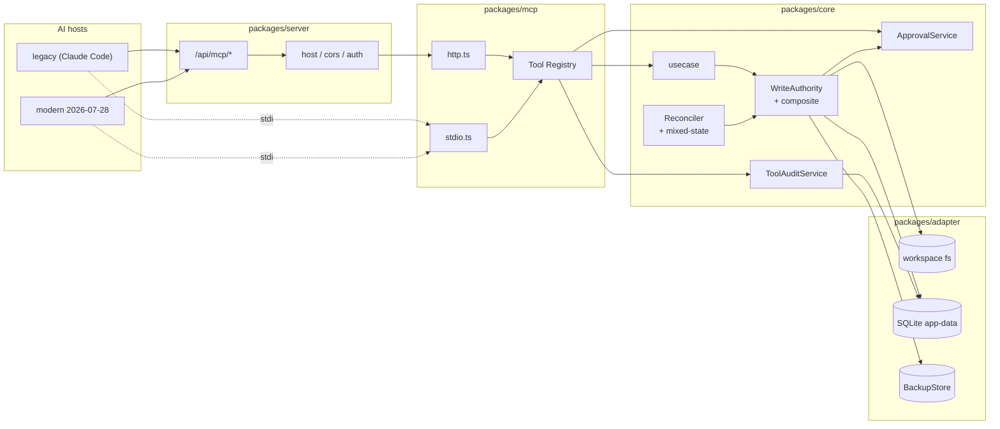
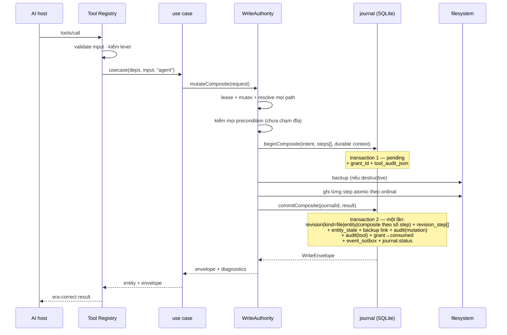
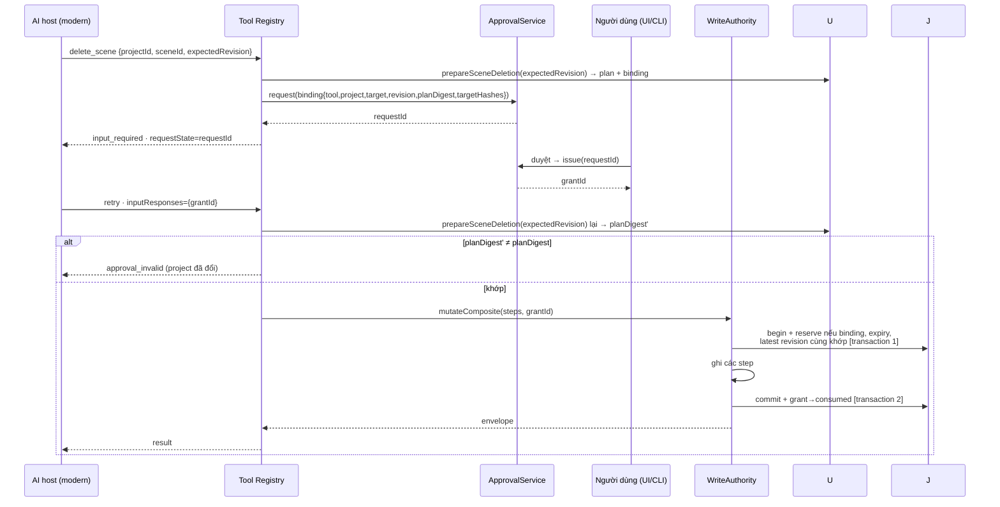
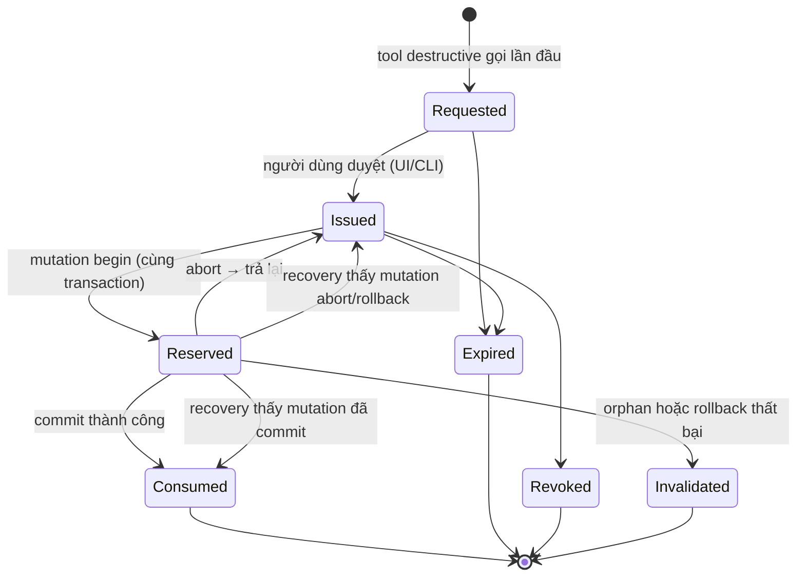
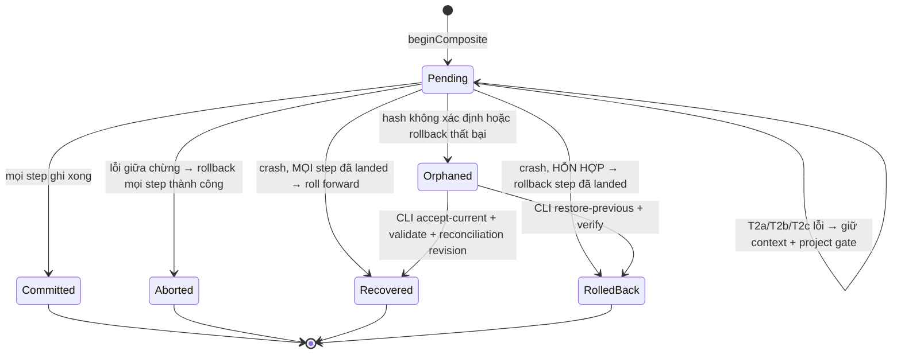
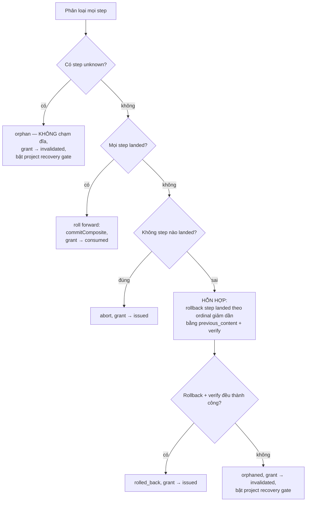
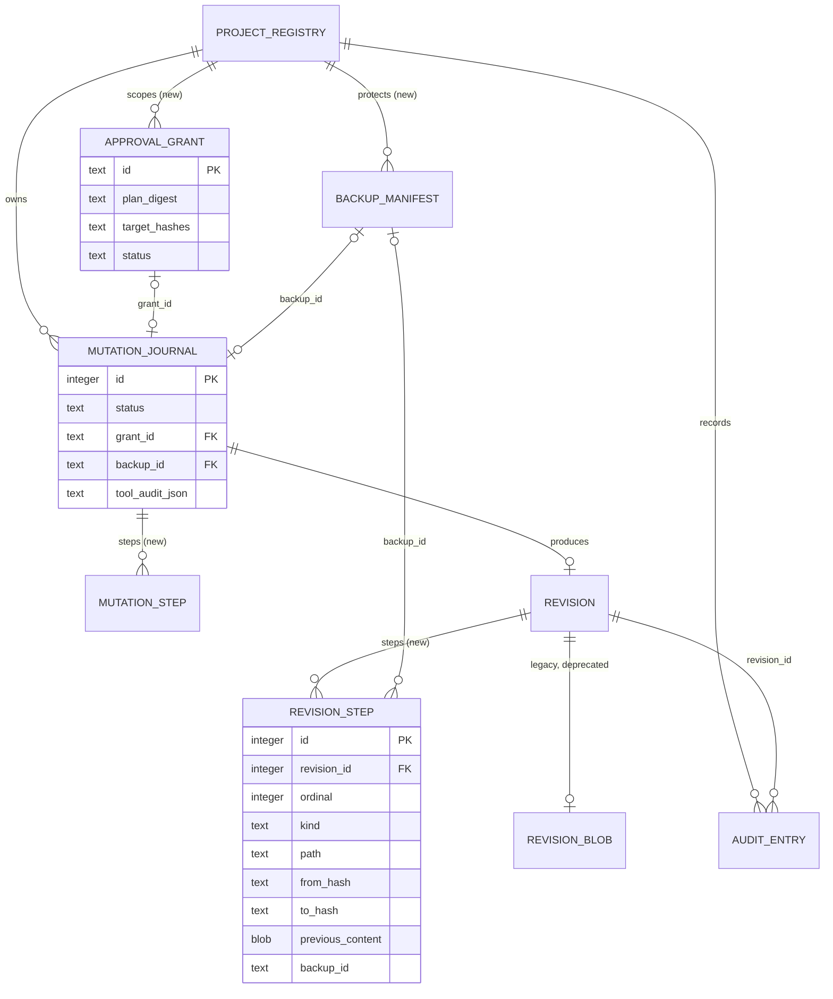
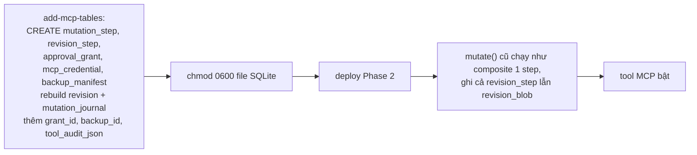

# Spec MCP Server — Detailed Design

> **Reference**: [Detailed Goals](./spec-mcp-server-detailed-goal.md) — Approved, reconfirmed 2026-08-02
> **Next**: [Implementation Checklist](./spec-mcp-server-implementation-checklist.md) — đã soạn, Pending Confirmation
> **Main spec**: [spec-mcp-server-inprocess.md](./spec-mcp-server-inprocess.md)
> **Bản 6, 2026-08-02** — sau audit Implementation Checklist. Bản này đóng đường truyền `PendingToolAudit` từ Registry tới mọi Core write use case, kể cả mutation một-step; đồng thời giữ source compatibility cho caller Phase 1. §16 đối chiếu mọi vòng review.

## 1. Overview

Phase 2 mở đường vào MCP cho Application Core của Phase 1. Ba khối:

1. **Tool Registry protocol-agnostic** — định nghĩa tool một lần, không biết SDK, gọi thẳng use case.
2. **Nâng cấp Core** — đây là phần nặng nhất và rủi ro nhất: `WriteAuthority` học ghi nhiều file trong một revision; mô hình lịch sử revision học biểu diễn composite; recovery học xử lý trạng thái hỗn hợp; `deleteScene`, approval grant, backup store ra đời.
3. **Hai transport vật lý** — `createMcpHandler` (HTTP) và `serveStdio` (stdio) nhận cùng một factory; SDK tự phân loại era.

Bản 1 tuyên bố "không sửa bảng hiện hữu" — **sai**, `revision`/`revision_blob` không biểu diễn được composite. Bản 2 sửa điều đó. Bản 3 sửa recovery/entity/DDD/planner. Bản 4 siết rollback, grant, backup, credential và protocol pin. Bản 5 đóng lỗ durability của recovery. Bản 6 đóng lỗ truyền audit: durable context không có giá trị nếu Registry không thể đưa nó tới `WriteAuthority` trên mọi đường ghi.

**Links to Requirements**: xem ma trận §12.

---

## 2. Design Scope

### In Scope
- `packages/mcp`: Tool Registry, 4 tool đọc, 4 tool ghi, 2 tool destructive, hai entry point transport.
- `packages/core`: composite mutation, recovery hỗn hợp, project recovery gate, `deleteScene`, narration stale, `ApprovalService`, `ToolAuditService`, `BackupStore` port.
- `packages/adapter`: **5** bảng mới, 2 bảng sửa (table-rebuild), backup store, `WorkspacePort.deleteAtomic`, `CompositionModel.sources`.
- `packages/server`: mount MCP qua injection, tách nhánh auth.
- `packages/contracts`: schema tool, hằng số revision, `ErrorCode` bổ sung, `WriteEnvelope`.
- `packages/cli`: mode `mcp`, `approve`, `credential`, `backup restore`, và `recovery inspect|reconcile|resolve`.

### Out of Scope
Tool job, `validate_project`, tasks extension, chạy lại TTS, agent-kit, MCP prompts, background retention scheduler. Backup payload vẫn được prune lúc daemon khởi động để đáp retention hữu hạn của R6b.9. Lý do và điểm đến: [Goals §Phạm vi](./spec-mcp-server-detailed-goal.md).

---

## 3. Research Summary

### Finding 1 — `server@2` phục vụ cả hai era, mặc định đã bật
`createMcpHandler` có `legacy?: 'stateless' | 'reject'` mặc định `'stateless'`; `serveStdio` có `legacy?: 'serve' | 'reject'` mặc định `'serve'`. 4/4 probe pass.
**Source**: [spikes/phase-0 §Q10](../../../../spikes/phase-0/README.md) · **Impact**: DR-1.

### Finding 2 — SDK tự stamp field theo era
Result gửi legacy không có `resultType`/`ttlMs`/`cacheScope`; gửi modern có đủ. **Impact**: R3.3/3.4/R4.3 là điều **test khoá**, không phải code viết.

### Finding 3 — MRTR tương quan qua `requestState`
`RETRY_PARAMS_KEYS = ["inputResponses", "requestState"]`. **Impact**: grant id nhúng vào `requestState`, không dựa request ID. §4.4.

### Finding 4 — `uploadBgm` đã là tiền lệ composite
Nó ghép staged asset + entity mutation vào một journal entry. **Impact**: composite là tổng quát hoá, không phải cơ chế mới. DR-2.

### Finding 5 — Recovery hiện tại là **roll-forward**, không phải rollback
`reconcilePendingMutations` so hash trên đĩa: `= fromHash` → abort; `= toHash` → **`recover()` và commit revision**; khác → orphan ([reconcile-pending-mutations.ts:44](../../../../packages/core/src/usecase/reconcile-pending-mutations.ts#L44)).
**Impact**: Bản 1 mô tả rollback là **sai với hệ thống đang chạy**. Thuật toán composite phải mở rộng đúng semantics này, không thay nó. Xem §5.7 và DR-8.

### Finding 6 — `revision_blob` hiện là write-only
Chỉ có `INSERT` trong `journal.ts`; không có `SELECT` nào trong production code. Bốn test đọc nó. **Impact**: đổi mô hình lịch sử ít rủi ro hơn tưởng. DR-2.

### Finding 7 — hai không gian số revision
`journal.commit()` trả `revision.id` (autoincrement toàn cục) cho file, nhưng `entity_state.revision` (bộ đếm riêng từng entity) cho entity ([journal.ts:212](../../../../packages/adapter/src/db/journal.ts#L212)). **Impact**: composite chạm cả hai không thể trả một con số. Cần `WriteEnvelope`. DR-9.

### Finding 8 — `BridgeCredentialStore` đã tồn tại
File đơn token trong app-data, `open(…, "wx", 0o600)` + `secureCredentialFile` cho ACL Windows ([credential-store.ts:33](../../../../packages/adapter/src/fs/credential-store.ts#L33)). **Impact**: credential AI host tái dùng cơ chế này cho **secret**, SQLite chỉ giữ metadata. DR-10.

---

## 4. Architecture

### 4.1 System Overview
MCP là adapter thứ hai ngang hàng HTTP. Điểm mới ở tầng kiến trúc: `packages/mcp`, năm bảng SQLite mới, hai bảng sửa, và một `BackupStore` trong app-data.

### 4.2 Component Diagram



Ranh giới không hiển nhiên: `server` **không** import `mcp` (structural type qua injection). `WA → GR` chỉ lập `GrantTransition` sau kiểm tra domain sơ bộ; `MutationJournal` mới thực thi CAS và chuyển trạng thái grant **bên trong** transaction của adapter (DR-3).

### 4.3 Data Flow — tool ghi thành công



### 4.4 Data Flow — destructive có approval grant



Grant được **reserve** cùng lúc journal `begin`, và **consume** cùng transaction `commit`. Reserve kiểm binding, expiry và latest project revision ngay trong transaction. Abort sau rollback thành công → release về `issued`. Trạng thái không xác định hoặc rollback thất bại → grant `invalidated`, project bị recovery gate chặn ghi (§5.7).

### 4.5 State — approval grant



### 4.6 State — mutation composite



`rolled_back` là **trạng thái mới** thêm vào `ck_journal_status`. T2 thất bại để journal ở `pending`; `pending` từ request trước và `orphaned` đều kích hoạt recovery gate của project. Daemon vẫn phục vụ project khác nhưng từ chối mọi write trên project bị gate bằng `recovery_required`. `pending` được reconcile bằng một inline attempt, lúc startup hoặc lệnh CLI tường minh; `orphaned` cần người dùng chọn resolution.

### 4.7 Integration Points

| System | Direction | Protocol | Purpose |
|---|---|---|---|
| AI host | in | MCP stdio | đường chính |
| AI host | in | MCP Streamable HTTP | cần bearer credential |
| SQLite app-data | both | Drizzle | journal, revision, audit, grant, credential |
| Workspace fs | both | `WorkspacePort` | composition, asset, narration |
| BackupStore (app-data) | both | `BackupPort` | bản sao trước destructive, và restore |

### 4.8 Technology Stack

| Layer | Technology | Rationale |
|---|---|---|
| MCP runtime | `@modelcontextprotocol/server@2.x` | DR-1 |
| MCP client (test) | `sdk@1.x`, `client@2.x` | devDependency |
| HTTP | Hono | D4 |
| DB | SQLite + Drizzle | nhất quán Phase 1 |

---

## 5. Components and Interfaces

### 5.1 `ToolDefinition`

```ts
export type ToolLevel = "read" | "write" | "job" | "destructive";

export interface ToolDefinition<I, O> {
  name: string;
  title: string;
  level: ToolLevel;
  description: string;
  input: Schema<I>;
  output: Schema<O>;
  /** Hint MCP, không bao giờ được dùng thay authorization/grant ở server. */
  annotations: {
    readOnlyHint: boolean;
    destructiveHint: boolean;
    idempotentHint: boolean;
    openWorldHint: false;
  };
  availableInLegacy: boolean;
  /** Trích project scope sau khi input đã validate; null cho tool không có project. */
  projectIdOf(input: I): ProjectId | null;
  handler(context: ToolContext, input: I): Promise<Result<O, DomainError>>;
}

export interface ToolContext {
  actor: Actor;                 // luôn "agent"
  era: "legacy" | "modern";
  protocolVersion: string;
  grantId: string | null;
  /** Định danh credential khi tới qua HTTP; `null` khi tới qua stdio. Đi thẳng vào audit. */
  credentialId: string | null;
  /** Một lần sinh ở Registry; dùng để quyết định journal nào sở hữu terminal audit. */
  invocationId: string;
  /** Registry chuẩn bị sau validation; write handler bắt buộc truyền nguyên vẹn xuống Core. */
  writeInvocation: WriteInvocation;
  requestInput(request: InputRequest): Promise<never>;
}
```

`credentialId` do transport điền: handler HTTP lấy từ middleware bearer (`mcpBearerAuth` gắn vào request context), entry stdio để `null`. `ToolRegistry.invoke()` sinh `invocationId`, dùng `projectIdOf(validatedInput)` để chuẩn bị `PendingToolAudit`, rồi đặt nó vào `writeInvocation`. Handler không được tự dựng, sửa hoặc redact lại payload này.

### 5.2 `ToolRegistry`

```ts
export class ToolRegistry {
  constructor(deps: {
    audit: ToolAuditService;
    /** Capability hẹp: MCP chỉ được tạo request, không bao giờ được issue/revoke grant. */
    approvals: Pick<ApprovalService, "request">;
  });
  register<I, O>(definition: ToolDefinition<I, O>): void;
  list(era: Era): ToolDescriptor[];      // sort theo tên, lọc availableInLegacy
  invoke(name: string, raw: unknown, context: ToolContext): Promise<ToolInvocation>;
}
```

`invoke()` là chỗ duy nhất bao quanh mọi tool call: validate input → lấy project scope bằng `projectIdOf()` → kiểm level/grant → chuẩn bị `PendingToolAudit` cho write/destructive → chạy handler với `writeInvocation` → quyết định audit success/error. Handler không lặp lại policy audit, nhưng bắt buộc truyền `writeInvocation` nguyên vẹn vào Core use case. Registry chỉ nhận capability `request`; `issue()`/`revoke()` chỉ được inject vào UI/CLI admin path, nên lời hứa "MCP không thể tự phát grant" được giữ bằng type boundary chứ không chỉ bằng convention.

Annotation được dẫn xuất cố định từ level: `read` → read-only/idempotent; `write` → không read-only, không destructive; `destructive` → `destructiveHint=true`, `idempotentHint=false`. Đây chỉ là metadata cho host; Registry vẫn kiểm level và grant độc lập.

### 5.3 Tool đọc

| Tool | Use case | Thay đổi Core |
|---|---|---|
| `list_projects` | `listProjects` | không |
| `get_project_context` | `getStudioSnapshot` | thêm `sources` (§5.5) |
| `list_scenes` | `getStudioSnapshot` | dùng `sources` |
| `read_composition` | `readSourceFile` | không |

### 5.4 Tool ghi và destructive

| Tool | Level | Use case | Precondition |
|---|---|---|---|
| `create_scene` | write | `createScene` viết lại | `expectedContentHash` (entry) |
| `set_scene_timing` | write | `setSceneTiming` | **`expectedContentHash`** (là file mutation, không phải entity) |
| `set_text` | write | `setSceneScript` mở rộng | `expectedContentHash` (file chứa) |
| `save_file` | write | `saveSourceFile` | `expectedContentHash` |
| `delete_scene` | destructive | `deleteScene` mới | `expectedContentHash` các target + grant |
| `delete_file` | destructive | `deleteFile` mới | `expectedContentHash` + grant |

> Sửa từ bản 1: `set_scene_timing` ghi `index.html` nên nó là **file mutation**, precondition là content hash. Bản 1 ghi `expectedRevision` là sai so với [project-writes.ts:116](../../../../packages/core/src/usecase/project-writes.ts#L116).

### 5.5 `CompositionModel.sources` — nền cho `fileHashes`

Bản 1 nói "tính từ nội dung đã parse". `CompositionModel` hiện **không giữ** raw content ([models.ts:47](../../../../packages/core/src/domain/models.ts#L47)), nên đó là lời hứa không có chỗ bám. Mở rộng model:

```ts
export interface CompositionSource {
  path: RelPath;
  contentHash: ContentHash;
  /** Byte size để boundary áp giới hạn mà không đọc lại. */
  byteSize: number;
}

export interface CompositionModel {
  project: ProjectSummaryDto;
  scenes: unknown[];
  rootTrack: unknown | null;
  diagnostics: Diagnostic[];
  /** MỚI: mọi file mà parse đã đọc — entry + mọi sub-composition được tham chiếu. */
  sources: CompositionSource[];
}
```

Adapter `parseProject` đã đọc các file này rồi; nó chỉ cần hash trong lúc đọc. Không thêm lượt I/O. `getStudioSnapshot.fileHashes` dẫn xuất từ `sources`.

### 5.6 `WriteAuthority.mutateComposite()`

```ts
export type CompositeStep =
  | { kind: "write"; path: RelPath; content: string | Uint8Array;
      expectedContentHash: string | null; purpose?: PathPurpose }
  | { kind: "delete"; path: RelPath; expectedContentHash: string }
  | { kind: "entity"; entity: "preview-settings";
      patch: PreviewSettingsPatchDto; expectedRevision: number };

export interface CompositeRequest {
  ref: ProjectRef;
  steps: CompositeStep[];
  /** Payload đã redact do Registry chuẩn bị; null cho internal write không bắt nguồn từ MCP tool. */
  toolAudit: PendingToolAudit | null;
  backup: boolean;                    // bắt buộc true với destructive
  grant?: { id: string; binding: GrantBinding };
}

export interface WriteInvocation {
  /** `null` cho HTTP/UI/CLI/internal write; non-null cho MCP write/destructive. */
  toolAudit: PendingToolAudit | null;
}

mutateComposite(request: CompositeRequest, actor: Actor): Promise<Result<WriteEnvelope, DomainError>>;
/** Optional third argument keeps every existing two-argument caller source-compatible. */
mutate(request: MutationRequest, actor: Actor,
       invocation?: WriteInvocation): Promise<Result<WriteEnvelope, DomainError>>;
```

#### Biểu diễn canonical: mọi mutation là một danh sách step

Review chỉ ra `mutation_step` chỉ có `write|delete` còn entity "nằm ở row cha" — để lại bốn ca không xác định. Sửa: **`mutation_step.kind` gồm cả `'entity'`, và mọi mutation ghi ít nhất một step row.**

| Ca | `mutation_journal.kind` | `path`/`entity` ở row cha | `mutation_step[]` |
|---|---|---|---|
| Một file (đường `mutate()` cũ) | `'file'` | điền như hiện nay | **1** step `kind='write'` |
| Một entity (đường `mutate()` cũ) | `'entity'` | điền như hiện nay | **1** step `kind='entity'` |
| Nhiều file | `'composite'` | `NULL` | N step |
| File + entity | `'composite'` | `NULL` | N step, trong đó đúng một `kind='entity'` |

Bốn câu hỏi của review, trả lời tường minh:

1. **File-only composite**: row cha là **vỏ** — `kind='composite'`, `path`/`entity` = `NULL`. Nó mang `projectId`, `actor`, `status` và durable context `grant_id`/`backup_id`/`tool_audit_json`.
2. **Entity-only**: `mutation_step[]` **không bao giờ rỗng** — nó có đúng một step `kind='entity'`. Recovery phân loại nó như mọi step khác.
3. **File + entity**: entity **có** backing file (`preview-settings.json`, biết qua `entity_state.backing_path`) nên nó phân loại được **bằng hash y hệt file step**. Không có ngoại lệ trong thuật toán recovery.
4. **Duplicate row cha ↔ step đầu**: **có**, và là chủ đích, chỉ ở hai ca một-step. Giá phải trả để `mutate()` giữ nguyên hành vi và bộ test Phase 1 không đổi. Recovery **chỉ đọc `mutation_step`** và bỏ qua cột denormalized của row cha, nên duplicate không sinh ra hai nguồn sự thật cho recovery. Gỡ denormalization ở D8.

#### Giữ nguyên semantics một-step khi commit

Review chỉ ra: nếu `mutate()` chạy qua composite thì commit sẽ tạo `revision.kind='composite'` và đổi `audit.action`, tức **lời hứa giữ nguyên hành vi là sai**. Sửa bằng một quy tắc tường minh ở `commitComposite`:

| Số step | `revision.kind` | `revision.path`/`entity` | `audit_entry.action` (row mutation) |
|---|---|---|---|
| 1, `kind='write'` | `'file'` | điền | `'file.write'` |
| 1, `kind='entity'` | `'entity'` | điền | `'entity.patch'` |
| ≥ 2 | `'composite'` | `NULL`, `content_hash` = manifest hash | `'composite.write'` |

Cả ba ca **đều** ghi `revision_step[]`. Nên history đồng nhất, còn bề mặt của mutation một step giữ nguyên byte-for-byte so với Phase 1.

Trình tự:

1. `lease.assertHeld` → `mutex.run(projectId)` → `journal.assertProjectWritable(projectId)`. Có journal `pending` từ request trước hoặc `orphaned` chưa resolve → `recovery_required`, chưa chạm đĩa. Journal của mutation hiện tại không bị gate vì kiểm tra xảy ra trước T1 và mutex giữ độc quyền cho tới khi lời gọi kết thúc.
2. Resolve **mọi** target, kể cả backing path của entity. Chuẩn hoá thành project-relative path và từ chối `duplicate_mutation_target` nếu hai step trỏ tới cùng backing file.
3. Kiểm **mọi** file/entity precondition. Nếu có grant, kiểm `expectedProjectRevision` với latest revision trong mutex. Một cái lệch → `write_conflict`, chưa chạm đĩa.
4. **Transaction 1**: `beginComposite(intent, steps, context, reserveTransition)` ghi journal + `previous_content` + `grant_id` + `tool_audit_json` đã redact; adapter lấy `transactionNow` ngay lúc bắt đầu T1 rồi reserve grant bằng CAS kiểm đồng thời binding, `expires_at > transactionNow` và latest project revision. `grant_id` được ghi cùng transaction với reserve nên recovery không phải đoán grant theo project.
5. Nếu `backup`: `BackupStore.create(manifest)` cho mọi path bị xoá hoặc ghi đè. `create()` phải ghi vào temp directory, fsync, kiểm lại mọi content hash, rồi rename atomic trước khi trả về. Sau đó `journal.attachBackup(journalId, backupId)` bền vững **trước** step đầu tiên. Backup lỗi → rollback rỗng, abort journal và release grant.
6. Ghi từng step atomic theo `ordinal` tăng dần (`writeAtomic` / `deleteAtomic`).
7. Một **step write/delete** lỗi trước khi all-landed → rollback theo `ordinal` giảm dần bằng `previous_content`, rồi đọc hash xác minh từng target:
   - step có `from_hash = null` được rollback bằng cách xoá target vừa tạo và verify target không còn; step có `from_hash` được khôi phục từ `previous_content` rồi verify đúng hash;
   - mọi target trở về `from_hash` → **Transaction 2a**: `abortComposite` + grant `reserved→issued`;
   - bất kỳ rollback/verify nào lỗi → **Transaction 2c**: `orphanComposite` + grant `reserved→invalidated`; MUST NOT ghi `aborted`/`rolled_back` và project bị recovery gate chặn write.
8. Mọi step all-landed → **Transaction 2b**: `commitComposite` phân nhánh kind theo bảng trên, ghi `revision_step[]` + `entity_state` + audit mutation + audit tool từ durable context + `backup_manifest.revision_id` + grant `reserved→consumed` + `event_outbox` + journal `committed` trong một transaction.
9. Nếu T2a/T2b/T2c lỗi, `WriteAuthority` chạy **đúng một** inline `reconcileJournal(journalId)` bằng cùng hash classifier trước khi trả response; không có retry loop/background scheduler. Reconcile thành công → trả terminal outcome tương ứng. Reconcile vẫn lỗi → journal giữ `pending`, grant/context giữ nguyên, project gate chặn write và tool trả `recovery_required { journalId, phase }`. Riêng **T2b lỗi sau all-landed** MUST NOT rollback filesystem hoặc ghi audit failure best-effort; recovery retry T2b theo semantics Phase 1. Startup và CLI có thể reconcile lại sau khi storage phục hồi.

`mutate()` cũ giữ **source compatibility**: mọi caller hai tham số tiếp tục chạy và mặc định `toolAudit=null`; overload/optional third argument nhận `WriteInvocation` cho đường MCP một-step. Các Core write use case (`saveSourceFile`, `setSceneTiming`, `setSceneScript`, `createScene`, `deleteScene`, `deleteFile`) đều nhận optional trailing `WriteInvocation` và truyền nguyên vẹn tới `mutate()`/`mutateComposite()`. Vì vậy HTTP/UI/CLI hiện tại không phải sửa call site, còn `save_file`/`set_scene_timing` không thể vô tình commit mà thiếu durable tool audit.

### 5.7 Recovery cho trạng thái hỗn hợp

Bản 1 mô tả rollback — **ngược** với hệ thống đang chạy. Bản 2 mở rộng đúng semantics roll-forward hiện có.

Với mỗi journal `pending`, đọc **`mutation_step[]`** (nguồn duy nhất — bỏ qua cột denormalized của row cha) và **phân loại từng step bằng hash trên đĩa**. MUST NOT tin `step.status`: process có thể chết sau `rename` trước khi cập nhật DB.

| `kind` | Quan sát trên đĩa | Phân loại |
|---|---|---|
| `write` | hash `= to_hash` | `landed` |
| `write` | hash `= from_hash` | `not_applied` |
| `write` | file thiếu và `from_hash = null` | `not_applied` |
| `delete` | file thiếu | `landed` |
| `delete` | hash `= from_hash` | `not_applied` |
| **`entity`** | hash của `entity_state.backing_path` `= to_hash` | `landed` |
| **`entity`** | hash của backing path `= from_hash` | `not_applied` |
| bất kỳ | còn lại | `unknown` |

Entity step **không có nhánh riêng** trong thuật toán — nó có backing file nên phân loại y hệt file step. Đây là lý do `mutation_step.kind` phải gồm `'entity'` (§5.6).

Quyết định cho cả mutation:



Chỉ nhánh **hỗn hợp** mới rollback — và chỉ nhánh này mới cần `previous_content`. Mutation một step không bao giờ rơi vào nhánh này, nên hành vi Phase 1 **không đổi**. Không được đánh dấu `rolled_back` trước khi đọc lại hash và chứng minh mọi step đã trở về `from_hash`.

Recovery không được suy grant hoặc audit từ project. Nó đọc `grant_id` và `tool_audit_json` ngay trên journal: all-landed retry đúng T2b và ghi tool audit outcome `ok` với `detail.recovered=true`; none-landed hoặc mixed rollback thành công nạp context/id vào memory, commit abort + release + clear hai context field rồi gọi `recordFailure` best-effort; unknown/rollback failure ghi outcome `error`, orphan journal và invalidate đúng grant trong T2c. T2b/T2c atomically đổi journal sang terminal nên retry không tạo audit trùng.

`orphaned` giữ nghĩa "không tự đoán", nhưng bản 5 thêm hậu quả bắt buộc: project bị chặn write, grant liên quan bị `invalidated`, lỗi trả `recovery_required` kèm `journalId` và lệnh `vidcom recovery inspect <journalId>`. `vidcom recovery resolve <journalId> --restore-previous` dùng `previous_content` và verify; nếu restore hoặc verify lỗi thì gate vẫn giữ. `--accept-current` chỉ được tạo revision reconciliation sau khi trạng thái hiện tại parse được và qua toàn bộ domain validation; nếu không, admin phải sửa tay hoặc dùng `--restore-previous`. Cả hai ghi audit actor `cli-external`; chỉ sau khi resolve commit mới đánh dấu journal terminal. Recovery gate là trạng thái **dẫn xuất** và chỉ biến mất khi project không còn bất kỳ journal `pending`/`orphaned` chưa resolve nào. Không có đường resolve qua MCP trong Phase 2.

CLI không được tự ghi filesystem. Nó gọi Core `resolveOrphanedMutation(journalId, resolution, "cli-external")`; use case này chạy dưới lease + project mutex và chỉ được bypass recovery gate cho **đúng journal đang resolve**. `restore-previous` ghi atomic theo ordinal giảm dần rồi verify toàn bộ `from_hash`; `accept-current` đọc lại mọi target, parse/domain-validate toàn project rồi dựng revision/revision-step reconciliation từ hash thực tế. Transaction kết thúc đặt journal lần lượt thành `rolled_back` hoặc `recovered` và ghi audit; crash/lỗi trước transaction đó để journal ở `orphaned`, nên gate không bị gỡ nhầm. Grant vẫn `invalidated` ở cả hai nhánh và không bao giờ được tái sử dụng.

Read vẫn được phép trong lúc gate để người dùng chẩn đoán, nhưng không được giả vờ project healthy: mọi read result chứa project đều trả `recovery: ProjectRecoveryStatus` với mọi unresolved journal id. CLI `recovery inspect` là bề mặt chi tiết; MCP Phase 2 chỉ quan sát, không resolve.

### 5.8 `ApprovalService`

```ts
export interface GrantBinding {
  tool: string;
  projectId: ProjectId;
  target: string;
  expectedRevision: number;
  /** MỚI: hash của DeletionPlan đã chuẩn hoá — bắt được thay đổi mà revision không đổi. */
  planDigest: string;
  /** MỚI: contentHash kỳ vọng của mọi file bị chạm. */
  targetHashes: Record<RelPath, ContentHash>;
}

/** Chuyển trạng thái grant, mô tả bằng DỮ LIỆU để adapter thực hiện atomically. */
export type GrantTransition =
  | { kind: "reserve"; grantId: string; binding: GrantBinding }
  | { kind: "consume"; grantId: string }
  | { kind: "release"; grantId: string }
  | { kind: "invalidate"; grantId: string; reason: "orphaned" | "rollback_failed" };

export class ApprovalService {
  request(binding: GrantBinding, summary: string): Promise<string>;
  issue(requestId: string, approver: "ui" | "cli"): Promise<Result<string, DomainError>>;
  /** Kiểm sơ bộ để trả lỗi domain tốt; transaction T1 vẫn kiểm lại toàn bộ bằng CAS. */
  planReserve(grantId: string, binding: GrantBinding): Promise<Result<Extract<GrantTransition, { kind: "reserve" }>, DomainError>>;
  revoke(grantId: string): Promise<void>;
}
```

`request()` tạo row `requested` với request TTL ngắn; `issue()` là CAS `requested→issued`, từ chối request đã hết hạn và đặt lại `expires_at = issuedAt + grantTtl`. `planReserve()`/T1 lazy-mark grant hết hạn thành `expired` khi phát hiện. `revoke()` chỉ CAS từ `issued`; nếu revoke đua với reserve thì đúng một CAS thắng. Grant đã `reserved` thuộc mutation đang chạy, không tự hết hạn giữa chừng; crash được recovery quyết định thay vì timeout đoán trạng thái filesystem.

> **Sửa sau review**: bản trước cho `reserve(tx, …)` / `finalize(tx, …)` nhận thẳng đối tượng transaction, và DR-3 nói service "phải chạy trong adapter cùng DB". Đó là **rò adapter vào Core**, vi phạm [steering 03](../../../steering/03-architecture-ddd.md) §2.3 — Core chỉ khai báo port, không biết cơ chế transaction.
>
> Cách đúng: chuyển trạng thái grant là **dữ liệu** đi kèm lời gọi port; adapter thực hiện nó atomically bên trong transaction của chính nó.

```ts
// MutationJournalPort — mở rộng, không có Tx nào lọt vào Core
export interface PendingMutationContext {
  /** JSON-serializable, đã redact; null cho internal write. */
  toolAudit: PendingToolAudit | null;
}

beginComposite(intent: CompositeIntent, steps: StepIntent[],
               context: PendingMutationContext,
               grant?: Extract<GrantTransition, { kind: "reserve" }>): Promise<JournalId>;
/** Đồng thời gắn backupId vào durable tool-audit detail trước step đầu tiên. */
attachBackup(id: JournalId, backupId: string): Promise<void>;
commitComposite(id: JournalId, result: CompositeResult,
                grant?: Extract<GrantTransition, { kind: "consume" }>): Promise<WriteEnvelope>;
abortComposite(id: JournalId, reason: ErrorCode,
               grant?: Extract<GrantTransition, { kind: "release" }>): Promise<void>;
orphanComposite(id: JournalId, reason: ErrorCode,
                grant?: Extract<GrantTransition, { kind: "invalidate" }>): Promise<void>;
```

Adapter `DrizzleMutationJournal` thực hiện transition **trong cùng transaction** với journal. Ngay khi bắt đầu T1, adapter lấy `transactionNow` từ `ClockPort`; nhánh reserve phải kiểm một lần duy nhất: `status='issued'`, toàn bộ binding canonical khớp, `expires_at > transactionNow`, và `COALESCE(MAX(revision.id), 0)` của project bằng `binding.expectedRevision`. `target_hashes` được serialize/so sánh bằng canonical JSON theo thứ tự path đã chuẩn hoá. T1 đồng thời persist `mutation_journal.grant_id`; sai điều kiện nào thì toàn transaction rollback và map thành `approval_expired`, `approval_invalid` hoặc `write_conflict`. Nhờ kiểm lại trong T1, grant không thể hết hạn hoặc project revision đổi trong cửa sổ giữa `planReserve()` và reserve. Core không bao giờ thấy `Tx`.

`planDigest` + `targetHashes` đóng lỗ mà review chỉ ra: sửa file ngoài daemon không làm đổi project revision, nên `expectedRevision` một mình không đủ. Registry tính lại plan trước khi consume và so digest (§4.4).

`issue()` MUST NOT gọi được từ đường MCP — Registry không giữ tham chiếu tới nó.

**Threat boundary**: grant chống destructive call vô tình/replay từ client chỉ có MCP capability. `vidcom approve` là trusted local-admin channel; process đã có quyền shell/filesystem ngang user OS nằm ngoài guarantee này vì nó vốn có thể gọi CLI hoặc sửa workspace trực tiếp. Phase 2 không tuyên bố proof-of-human-presence trước một OS-level adversary; nếu cần mức đó phải dùng UI/OS-mediated confirmation trong spec riêng.

### 5.9a `deleteScene`

```ts
interface DeletionPlan {
  removeMount: { file: RelPath; hostId: string };
  deleteFile: RelPath | null;
  keptFileReason: "shared-src" | "inline" | null;
  rootDuration: number;                 // 0 khi xoá scene cuối — steering 03 đã làm rõ
  narrationFiles: RelPath[];            // JSON + WAV nếu có
  previewSettingsPatch: PreviewSettingsPatchDto | null;
  targetHashes: Record<RelPath, ContentHash>;
  diagnostics: Diagnostic[];
}

/** Mọi thứ planner cần. Thu thập bởi use case, không phải bởi planner. */
export interface DeletionInputs {
  model: CompositionModel;              // scene, mount, sources + hash
  sceneId: string;
  previewSettings: PreviewSettingsDto;
  previewSettingsRevision: number;
  previewSettingsHash: ContentHash;
  /** Sidecar JSON và WAV: có tồn tại không, hash bao nhiêu. */
  narration: { jsonPath: RelPath; jsonHash: ContentHash | null;
               wavPath: RelPath; wavHash: ContentHash | null } | null;
}

/** Thuần, không I/O — 6 edge case test được bằng unit test. */
function planSceneDeletion(inputs: DeletionInputs): Result<DeletionPlan, DomainError>;

/** Chuẩn hoá rồi hash — dùng cho GrantBinding.planDigest. */
function digestPlan(plan: DeletionPlan): string;

/** Use case: thu thập state rồi gọi planner thuần. Đây là thứ Registry gọi. */
export async function prepareSceneDeletion(
  deps: ProjectWriteDependencies & { previewSettings: PreviewSettingsReader },
  input: { projectId: ProjectId; sceneId: string; expectedRevision: number },
): Promise<Result<{ plan: DeletionPlan; binding: GrantBinding }, DomainError>>;
```

> **Sửa sau review**: bản trước khai `planSceneDeletion(model, sceneId)` là thuần nhưng plan cần preview settings, entity revision, hash `preview-settings.json`, narration JSON và WAV — những thứ `CompositionModel.sources` **không** chứa (`sources` chỉ có entry + sub-composition đã parse). Hàm đó không có đủ dữ liệu để tồn tại như đã khai.
>
> Tách hai tầng giải quyết đúng vấn đề: `prepareSceneDeletion` là **use case của Core** làm I/O; `planSceneDeletion` vẫn thuần và vẫn test được 6 edge case bằng unit test. Use case so `input.expectedRevision` với latest project revision trước khi dựng binding; T1 kiểm lại lần cuối trong transaction. **Registry chỉ nhận `plan` + `binding` từ Core, không tự quyết nghiệp vụ** — đúng [steering 03](../../../steering/03-architecture-ddd.md) §2.4.

| Điều kiện | `deleteFile` | `rootDuration` |
|---|---|---|
| Có `src`, không mount nào khác dùng | file đó | max end scene còn lại |
| Có `src`, còn mount khác dùng chung | `null`, `keptFileReason="shared-src"` | như trên |
| Inline (không `src`) | `null`, `keptFileReason="inline"` | như trên |
| Là scene cuối cùng | theo hai dòng đầu | **0** + diagnostic `warning` |

### 5.9b `deleteFile`

`delete_file` cần cùng mô hình prepare→approve→re-plan như `delete_scene`; Registry MUST NOT tự scan reference hoặc tự dựng `GrantBinding`.

```ts
export interface FileDeletionPlan {
  path: RelPath;
  expectedContentHash: ContentHash;
  targetHashes: Record<RelPath, ContentHash>;
  diagnostics: Diagnostic[];
}

export async function prepareFileDeletion(
  deps: ProjectWriteDependencies,
  input: { projectId: ProjectId; path: RelPath; expectedContentHash: ContentHash },
): Promise<Result<{ plan: FileDeletionPlan; binding: GrantBinding }, DomainError>>;

export async function deleteFile(
  deps: ProjectWriteDependencies,
  input: { projectId: ProjectId; plan: FileDeletionPlan; grantId: string },
  actor: Actor,
  invocation?: WriteInvocation,
): Promise<Result<{ deleted: RelPath; envelope: WriteEnvelope; backupId: string }, DomainError>>;
```

`prepareFileDeletion()` resolve allowlist/protected path, đọc hash thật, so `expectedContentHash`, parse project để từ chối mọi `data-composition-src`/media `src` còn tham chiếu, rồi lấy latest `projectRevision`. Binding dùng `tool='delete_file'`, target là canonical relative path, `expectedRevision` vừa đọc, digest canonical của plan và `targetHashes` đúng một file. Khi retry với grant, Core prepare lại từ đầu; thay đổi file hoặc project làm binding lệch và trả `approval_invalid`. `deleteFile()` không nhận raw path để tự re-plan khác với thứ người dùng đã duyệt; nó verify plan/binding qua T1, bật backup và thực hiện đúng một delete step.

### 5.10 Ba khoảng trống port/model mà `deleteScene` cần

| # | Khoảng trống | Sửa |
|---|---|---|
| P1 | `WorkspacePort` không có xoá | Thêm `deleteAtomic(path: ResolvedPath): Promise<void>` và `exists(path)`. Restore dùng `writeAtomic` đã có |
| P2 | `PreviewSettingsPatchDto` chỉ merge, không xoá key | Thêm `scenesRemove?: string[]`; `mergePreviewSettings` xoá các key đó **sau** khi spread. Additive, không phá caller nào |
| P3 | Narration không giữ được "stale" | Xem dưới |

**P3 chi tiết.** Core khai `status: "mock"` cứng ([project-writes.ts:187](../../../../packages/core/src/usecase/project-writes.ts#L187)) còn adapter ghi đè thành `"generated"`/`"mock"` theo sự tồn tại của wav ([parse.ts:119](../../../../packages/adapter/src/hyperframes/parse.ts#L119)). Nên "stale" không có chỗ sống.

Cách sửa: **stale là trục độc lập với status**, không phải một giá trị của status.

```ts
export interface NarrationRecord {
  sceneId: string; text: string; voice: string;
  audioPath: RelPath; command: string;
  revision: number; updatedAt: string;
  /** Dẫn xuất bởi adapter từ sự tồn tại của wav. Giữ nguyên hành vi hiện tại. */
  status: "mock" | "generated";
  /** MỚI, bền vững: thời điểm script đổi mà audio chưa render lại. `null` = không stale. */
  staleSince: string | null;
}
```

`stale = staleSince !== null`. Adapter **MUST NOT** đụng `staleSince` khi đọc — nó chỉ dẫn xuất `status`. `set_text` set `staleSince = now` trong cùng mutation. Phase 3 khi chạy TTS thật sẽ clear về `null`.

**Record cũ không có trường này** → đọc ra `undefined` → chuẩn hoá thành `null` → **không stale**. Đây là lựa chọn có chủ đích: nếu mặc định là stale thì mọi narration `generated` sẵn có sẽ đồng loạt bật cờ ngay sau khi nâng cấp, tạo một biển cảnh báo giả. Không có migration dữ liệu; chuẩn hoá xảy ra lúc đọc.

> Đổi so với bản trước: bản 2 dùng `renderedTextHash`. Nó đúng về lý thuyết nhưng record cũ có `null`, và `null` khi đó vừa nghĩa "chưa render bao giờ" vừa nghĩa "không biết" — buộc phải đoán khi nâng cấp. `staleSince` không có sự mơ hồ đó.

### 5.11 `BackupStore`

Bản 1 chỉ có cột `backup_path`. Đây là port đầy đủ:

```ts
export interface BackupManifestEntry {
  path: RelPath; contentHash: ContentHash; byteSize: number;
}
export interface BackupSource {
  path: RelPath;
  resolved: ResolvedPath;
}
export interface BackupPayload {
  path: RelPath;
  bytes: Uint8Array;
  contentHash: ContentHash;
}
export interface BackupManifest {
  id: string;                    // backupId, ghi vào audit
  projectId: ProjectId;
  revisionId: number | null;     // điền sau commit
  createdAt: string;
  reason: string;                // "tool:delete_scene"
  entries: BackupManifestEntry[];
  manifestHash: string;          // integrity toàn bộ
}

export interface BackupPort {
  /** Atomic: temp + fsync + verify mọi hash + rename; lỗi thì không publish manifest. */
  create(projectId: ProjectId, reason: string, files: BackupSource[]): Promise<BackupManifest>;
  read(id: string): Promise<BackupManifest | null>;
  readPayloads(id: string): Promise<BackupPayload[]>;
  /** Kiểm mọi contentHash trước khi trả về true. */
  verify(id: string): Promise<boolean>;
  list(projectId: ProjectId): Promise<BackupManifest[]>;
  /** Chỉ xoá payload; giữ metadata/FK và đánh dấu payload_pruned_at. */
  prunePayloads(olderThan: Date): Promise<number>;
}

/** Core use case; adapter BackupPort không được gọi ngược WriteAuthority. */
export async function restoreBackup(
  deps: { backups: BackupPort; writes: WriteAuthority },
  input: { projectId: ProjectId; backupId: string },
  actor: "cli-external",
): Promise<Result<WriteEnvelope, DomainError>>;
```

- **Vị trí**: `<app-data>/backups/<projectId>/<backupId>/` — nội dung file + `manifest.json`.
- **Owner cleanup**: `prunePayloads()` chạy lúc daemon khởi động, retention 30 ngày cấu hình được. Metadata manifest được giữ để audit/revision FK không gãy; `payload_pruned_at` cho biết backup đã hết khả năng restore.
- Backup đã publish nhưng process chết trước `attachBackup` là payload chưa được tham chiếu; startup cleanup chỉ được xoá payload/manifest không tham chiếu sau một grace period cấu hình được, không được đoán đó là backup đã commit.
- **Restore** là Core use case: đọc + verify payload qua port, lấy `to_hash` của revision destructive đã liên kết làm precondition cho trạng thái hiện tại (`null` nghĩa target phải đang thiếu), rồi gọi `mutateComposite`. Nếu target đã đổi sau lần xoá thì trả `write_conflict`, không overwrite. Adapter không điều phối Core và không ghi thẳng workspace. Phase 2 chỉ expose CLI nên audit action là `"cli:restore"`; nếu sau này thêm MCP tool thì spec đó mới thêm `"tool:restore_backup"`.
- `commitComposite` gắn `backup_manifest.revision_id` trong T2b. FK từ journal/revision step trỏ tới metadata bền vững; prune không xoá row nên không cần `ON DELETE` phá liên kết.
- **CLI**: `vidcom backup list [projectId]`, `vidcom backup verify <id>`, `vidcom backup restore <id>`.

### 5.12 `ToolAuditService`

```ts
export interface ToolAuditEntry {
  tool: string; level: ToolLevel; projectId: ProjectId | null;
  era: Era; protocolVersion: string;
  outcome: "ok" | "error"; errorCode: ErrorCode | null;
  detail: Record<string, unknown>;    // đã redact
  credentialId: string | null;
}

/** Durable trước filesystem write; outcome/revision được quyết ở T2 hoặc recovery. */
export interface PendingToolAudit {
  schemaVersion: 1;
  invocationId: string;
  tool: string; level: ToolLevel; projectId: ProjectId | null;
  era: Era; protocolVersion: string;
  detail: Record<string, unknown>;    // đã redact trước khi persist
  credentialId: string | null;
  invokedAt: string;
}

export class ToolAuditService {
  /** Tool đọc thành công hoặc lỗi. Best-effort. */
  recordRead(entry: ToolAuditEntry): Promise<void>;
  /** Rejection trước T1 hoặc failure đã rollback+verify; best-effort sau terminal decision. */
  recordFailure(entry: ToolAuditEntry): Promise<void>;
  /** Registry gọi trước T1; payload được journal persist để crash recovery dùng lại. */
  prepareWrite(entry: Omit<ToolAuditEntry, "outcome" | "errorCode"> & {
    invocationId: string; invokedAt: string;
  }): PendingToolAudit;
  /** Sau handler error: true nếu pending/terminal journal của chính invocation đang sở hữu audit. */
  isJournalOwned(invocationId: string): Promise<boolean>;
}
```

Chính sách, đối chiếu R7.4/R7.5:

| Tình huống | Có transaction? | Chính sách | Lý do |
|---|---|---|---|
| Tool ghi bị từ chối trước T1, hoặc rollback đã verify | không còn thay đổi đĩa | **best-effort + escalation**: retry một lần, thất bại thì log `error` + tăng metric | Outcome đã biết là error và project đã được chứng minh không đổi |
| Tool ghi all-landed, T2 thành công | có (2b) | **fail-closed** — audit nằm cùng revision/grant/journal commit | Không bao giờ có committed mutation thiếu audit |
| Tool ghi all-landed, T2 thất bại | durable T1, chưa có T2 | **indeterminate** — giữ pending audit + journal, gate project; recovery retry T2 | Không được ghi error rồi bỏ context vì outcome cuối có thể là roll-forward thành công |
| Tool ghi orphaned | có (2c hoặc recovery) | ghi error audit từ durable context cùng orphan/invalidate; nếu transaction lỗi thì giữ pending + gate | Destructive attempt đã chạm đĩa phải còn truy vết được |
| Tool đọc | không | best-effort + log cảnh báo | như trên |

> Đây là **làm rõ** R7.4, không phải nới. Goals đã đồng bộ thành AC 7.4/7.4b/7.4c: fail-closed áp cho terminal commit; failure đã chứng minh không đổi là best-effort; all-landed/T2-failed là indeterminate và phải giữ durable context.

Với destructive mutation, durable audit detail phải có non-secret `grantId`; `attachBackup()` enrich thêm `backupId` trước step đầu tiên. T2b/T2c/recovery dùng các giá trị này; audit không được chỉ dựa vào FK hoặc đường dẫn payload có thể bị prune.

Registry tạo `invocationId` một lần trước handler. Khi write handler trả lỗi, Registry gọi `isJournalOwned(invocationId)`: `true` → không gọi `recordFailure`, vì T2/recovery sở hữu terminal audit; `false` → `recordFailure` best-effort. Nếu ownership lookup tự lỗi, Registry **không đoán** bằng cách ghi error row có thể sai; nó log `error` + tăng `audit_ownership_unknown`, còn durable recovery vẫn là nguồn quyết định nếu T1 đã tồn tại. T2a (rollback đã verify/none-landed) nạp context vào memory rồi clear `tool_audit_json` **và `grant_id`** cùng abort/release trước khi gọi best-effort, nên ownership chuyển về caller/recovery và grant có thể được dùng lại trong một journal mới. T2b/T2c giữ context hoặc terminal audit đủ để `isJournalOwned` trả true, tránh audit kép.

`PendingToolAudit` phải đi theo một đường duy nhất: `ToolRegistry.invoke()` → `ToolContext.writeInvocation` → Core write use case → `WriteAuthority.mutate()` hoặc `mutateComposite()` → `beginComposite()`. Unit test Registry dùng spy Core handler để chứng minh cùng object/value được chuyển tiếp; integration test `save_file` và `set_scene_timing` chứng minh mutation một-step có tool row cùng `revision_id`. Không chấp nhận giải pháp ghi tool audit sau khi handler trả success vì nó phá fail-closed T2.

### 5.13 Transport và mount

```ts
// packages/mcp/src/http.ts — không import Hono, không import server
export function createMcpHttpHandlers(registry: ToolRegistry, deps: McpDeps): {
  handlers: ReadonlyMap<string, (request: Request) => Promise<Response>>;
  defaultRevision: string;
  close(): Promise<void>;
};
// packages/mcp/src/stdio.ts
export function startMcpStdio(registry: ToolRegistry, deps: McpDeps,
  options: { pinnedRevision?: string }): Promise<{ close(): Promise<void> }>;
```

Factory nhận một allowlist revision; registration của Tool Registry vẫn dùng chung một hàm:

```ts
function createServerFactory(options?: { supportedProtocolVersions?: string[] }): McpServerFactory;
```

`startMcpStdio(..., { pinnedRevision })` gọi `serveStdio()` với factory tạo `McpServer` có `supportedProtocolVersions: [pinnedRevision]`. Không có pin thì bỏ option để SDK tự negotiate. Như vậy `--protocol` không tự parse hay tự implement negotiation; nó thu hẹp allowlist mà chính SDK dùng cho initialize/discover.

`packages/server` nhận structural type, không import `@vidcom/mcp`:

```ts
export interface McpRouteDependencies {
  handlers: ReadonlyMap<string, (request: Request) => Promise<Response>>;
  defaultRevision: string;
}
```

#### Ép đúng revision khi pin (AC 6c.2)

Ba loại handler trong map, xây từ **cùng một factory**:

| Khoá map | Cách xây | Hành vi |
|---|---|---|
| `""` (entry `/api/mcp`) | `createMcpHandler(createServerFactory())` — `legacy` để mặc định `'stateless'` | SDK tự phân loại era |
| revision **modern** (`2026-07-28`) | factory allowlist `[revision]` + `legacy: 'reject'` + tiền kiểm | request thiếu/khác exact revision → `UnsupportedProtocolVersion` |
| revision **legacy** (5 giá trị) | factory allowlist `[revision]` + tiền kiểm | request thiếu revision dùng default `2025-03-26`; revision khác → `UnsupportedProtocolVersion` |

Tiền kiểm dùng export của SDK, không tự viết parser:

```ts
function pinnedHandler(pinned: string, inner: Handler): Handler {
  return async (request) => {
    let body: unknown;
    try {
      body = request.method === "POST" ? await request.clone().json() : undefined;
    } catch {
      // Để SDK sinh đúng parse-error/JSON-RPC id; pin wrapper không thay error ladder.
      return inner(request);
    }
    const outcome = classifyInboundRequest({
      httpMethod: request.method,
      protocolVersionHeader: request.headers.get("MCP-Protocol-Version") ?? undefined,
      mcpMethodHeader: request.headers.get("Mcp-Method") ?? undefined,
      mcpNameHeader: request.headers.get("Mcp-Name") ?? undefined,
      body,
    });
    if (outcome.kind === "reject") return responseFromClassificationRejection(outcome, body);
    const actual = outcome.kind === "modern"
      ? outcome.classification.revision
      : outcome.requestedVersion ?? DEFAULT_NEGOTIATED_PROTOCOL_VERSION;
    if (actual !== pinned) return unsupportedProtocolVersionResponse(pinned, SUPPORTED_REVISIONS);
    return inner(request);
  };
}
```

`classifyInboundRequest` nhận `InboundHttpRequest`, không nhận raw body; revision modern nằm ở `outcome.classification.revision`, còn legacy ở `outcome.requestedVersion`. Pseudocode trên bám đúng type export của SDK 2.0.0. So sánh là **bằng đúng chuỗi revision**, không phải "cùng era" — pin `2025-06-18` mà client nói `2025-11-25` cũng bị từ chối. Đó là điều AC 6c.2 yêu cầu và là lý do endpoint pin có giá trị debug.

`latest` là alias trỏ tới handler của revision mới nhất; nó **không** tiền kiểm bằng chuỗi cố định mà tra `SUPPORTED_REVISIONS` lúc dựng map, nên khi thêm revision mới nó tự đổi — đúng bản chất moving target đã ghi ở AC 6c.4.

### 5.14 Credential cho AI host

Tách **secret** khỏi **metadata**, tái dùng cơ chế đã kiểm chứng:

| Thứ | Ở đâu | Vì sao |
|---|---|---|
| Secret (bản rõ, chỉ hiện một lần lúc phát hành) | không lưu | người dùng tự cất |
| Hash của secret + metadata | bảng `mcp_credential` | so khớp lúc verify |
| File SQLite | `chmod 0600` lúc tạo, dùng `secureCredentialFile` đã có cho Windows ACL | nó chứa audit + journal, đằng nào cũng nên khoá |
| Bridge token (cho `vidcom mcp` nói với daemon) | `BridgeCredentialStore` **đã có** | không phát minh lại |

```ts
export class McpCredentialService {
  issue(label: string): Promise<{ id: string; secret: string }>;
  verify(secret: string): Promise<{ id: string } | null>;
  /** Tạo credential MỚI với rotated_from = old; old → 'rotating' rồi 'revoked' sau overlap. */
  rotate(id: string, overlap: Duration): Promise<{ id: string; secret: string }>;
  revoke(id: string): Promise<void>;
  list(): Promise<CredentialSummary[]>;   // không bao giờ trả secret
}
```

> Sửa từ bản 1: `rotate()` trả **id mới**, khớp với cột `rotated_from`. Bản 1 nói giữ cùng id — mâu thuẫn với schema chính nó đề xuất.

Credential contract bảo mật:

- `issue()`/`rotate()` sinh **32 random bytes** bằng CSPRNG của adapter, encode base64url và thêm prefix `vcmcp_`; secret chỉ trả đúng một lần.
- SQLite lưu `secret_hash = "sha256:<hex>"`. SHA-256 phù hợp ở đây vì input có 256 bit entropy ngẫu nhiên, không phải password do người dùng chọn. `secret_hash` có unique index.
- `verify()` từ chối token sai prefix/độ dài trước khi hash, không log token, và chỉ chấp nhận `active` hoặc `rotating` khi `expires_at > now`. `rotating` đã hết overlap bị từ chối ngay và được lazy-update sang `revoked`; không phụ thuộc background job.
- So sánh digest canonical bằng `timingSafeEqual` khi so trong process; lookup DB theo digest chỉ diễn ra sau khi token đã qua kiểm hình dạng cố định.
- HTTP auth failure luôn trả cùng một thông báo `credential_invalid`, không phân biệt unknown/revoked/expired. Rate metric được đếm nhưng không chứa secret.

Middleware tách nhánh (`hostCheck`, `strictCors` vẫn chạy trước cho cả hai):

```ts
app.use("*", observed("auth", async (c, next) =>
  c.req.path.startsWith("/api/mcp")
    ? mcpBearerAuth(deps.mcpCredentials)(c, next)
    : sessionAuth(deps.sessions)(c, next),
deps.trace));
```

### 5.15 CLI

| Lệnh | Việc |
|---|---|
| `vidcom mcp [--workspace <p>] [--protocol <rev>]` | stdio; `stdout` chỉ protocol message |
| `vidcom approve <requestId>` | phát hành grant headless |
| `vidcom credential issue\|list\|rotate\|revoke` | credential AI host |
| `vidcom backup list [projectId]` / `verify <id>` / `restore <id>` | kiểm tra và restore sau destructive |
| `vidcom recovery inspect <journalId>` | xem step/hash/grant/audit/backup của journal pending hoặc orphaned; read-only |
| `vidcom recovery reconcile <journalId>` | retry deterministic hash reconciliation cho journal pending; không nhận resolution choice |
| `vidcom recovery resolve <journalId> --restore-previous\|--accept-current` | hành động admin tường minh, audit đầy đủ, gỡ project write gate sau verify |

### 5.16 `McpRuntimeConfig`

Mọi thời hạn của Phase 2 nằm trong **một** object, khai ở composition root và truyền bằng DI. MUST NOT đọc env var hay config file mới trong Phase 2, và MUST NOT rải hằng số thời gian trong service.

```ts
export interface McpRuntimeConfig {
  /** `approval_grant` ở trạng thái `requested` sống bao lâu trước khi hết hạn. */
  approvalRequestTtlMs: number;      // 10 phút
  /** Grant đã `issued` sống bao lâu nếu chưa được reserve. */
  approvalGrantTtlMs: number;        // 5 phút
  /** Grant terminal (`consumed`/`expired`/`revoked`) giữ bao lâu trước khi prune. */
  approvalRetentionMs: number;       // 7 ngày
  /** Payload backup giữ bao lâu; manifest metadata giữ vĩnh viễn cho audit. */
  backupPayloadRetentionMs: number;  // 30 ngày
  /** Payload không có manifest phải quá hạn này mới được dọn. */
  backupOrphanGraceMs: number;       // 24 giờ
  /** Cửa sổ chồng lấn mặc định khi xoay vòng credential; CLI override được. */
  credentialRotationOverlapMs: number; // 5 phút
}
```

Test **MUST** dùng `ClockPort` giả cùng config inject, MUST NOT chờ thời gian thật.

> Type này được checklist khoá giá trị trước (Execution Contract → Runtime defaults); mục này đưa nó vào Design để hai tài liệu không lệch.

---

## 6. Data Models

### 6.0 Data Relationship Diagram



### 6.1 Persistence Overview

- **Database**: SQLite app-data + filesystem workspace + `<app-data>/backups`.
- **New tables**: `mutation_step`, `revision_step`, `approval_grant`, `mcp_credential`, `backup_manifest`.
- **Modified tables**: `revision` (thêm `'composite'` vào `ck_revision_kind`), `mutation_journal` (mở rộng kind/status, thêm `grant_id`, `backup_id`, `tool_audit_json`).
  > Sửa từ bản 1, vốn tuyên bố sai là "không sửa bảng nào".
- **Deprecated**: `revision_blob` — hiện write-only trong production ([Finding 6](#finding-6--revision_blob-hiện-là-write-only)). Phase 2 **vẫn ghi** nó cho mutation một step để 4 test hiện có xanh, nhưng lịch sử chuẩn là `revision_step`. Gỡ ở spec sau (D7).
- **Read/write ownership**: `MutationJournal` sở hữu `mutation_step`, `revision_step`, `revision` và durable pending context trên journal; `ApprovalService` sở hữu lifecycle `approval_grant`, còn `MutationJournal` chỉ thực thi `GrantTransition` atomically; `McpCredentialService` sở hữu `mcp_credential`; `BackupStore` sở hữu `backup_manifest`.
- **Transaction boundaries**:
  - T1 `beginComposite`: `mutation_journal` (gồm `grant_id`, `tool_audit_json`) + `mutation_step[]` + `approval_grant → reserved`.
  - T2a `abortComposite`: `journal.status` + clear `tool_audit_json`/`grant_id` + `approval_grant → issued`; sau commit mới `recordFailure` best-effort từ context đã nạp vào memory vì filesystem đã được chứng minh không đổi. Clear link giải phóng unique constraint để grant issued có thể reserve cho journal retry mới.
  - T2b `commitComposite`: `revision` + `revision_step[]` + `revision_blob` (nếu một step) + `entity_state` + `backup_manifest.revision_id` + audit mutation + tool audit nếu có + `approval_grant → consumed` + `event_outbox` + `journal.status`.
  - T2c `orphanComposite`: `journal.status='orphaned'` + tool error audit nếu có + `approval_grant → invalidated`; nếu T2c rollback thì journal vẫn `pending`. Project write gate dẫn xuất từ mọi unresolved `pending`/`orphaned`.
- **Migration**: một migration `add-mcp-tables`: **5** `CREATE TABLE` (`mutation_step`, `revision_step`, `approval_grant`, `mcp_credential`, `backup_manifest`) + **2 table-rebuild**. Rebuild `mutation_journal` vừa mở rộng check constraint vừa thêm cả ba cột context; không chạy các `ADD COLUMN` rời.
- **Backfill — có, nhỏ**: nếu tại thời điểm migration còn `mutation_journal` ở trạng thái unresolved `pending` **hoặc `orphaned`**, migration SHALL sinh **một** `mutation_step` row cho mỗi row như vậy từ các cột denormalized. Không có bước này thì auto-recovery của pending và CLI resolve của orphaned — vốn chỉ đọc `mutation_step` — sẽ thấy danh sách rỗng và phân loại sai. Row terminal khác không cần backfill.
  > Sửa so với bản trước, vốn nói "không backfill".
- **Rollback**: down-migration kiểm trước và **từ chối** nếu có `revision.kind='composite'`, `mutation_journal.kind='composite'`, journal mang status chỉ có ở Phase 2 như `rolled_back`, hoặc còn `pending`/`orphaned` gắn grant/audit/backup context. Thông báo phải nêu số row và đường xử lý thủ công; MUST NOT âm thầm xoá lịch sử. Khi đủ điều kiện, thứ tự là: rebuild `mutation_journal` để bỏ `grant_id`/`backup_id`/`tool_audit_json` và thu hẹp check constraints → rebuild `revision` → rồi mới `DROP TABLE` 5 bảng mới. Không được drop bảng grant/backup khi FK từ journal còn tồn tại.
- **Retention**: grant terminal dọn sau 7 ngày; backup payload 30 ngày. Cả hai cấu hình được; cleanup grant và `prunePayloads()` chạy lúc khởi động, còn metadata backup được giữ. `grant_id` dùng `ON DELETE SET NULL`, nhưng cleanup chỉ được xoá grant terminal và không bao giờ đụng grant của journal unresolved; audit detail giữ non-secret grantId cho lịch sử.

### 6.2 `WriteEnvelope` — ba con số, không một

Từ [Finding 7](#finding-7--hai-không-gian-số-revision): `revision.id` và `entity_state.revision` là hai không gian khác nhau. Mọi tool ghi trả:

```ts
export interface WriteEnvelope {
  /** revision.id — tăng toàn cục theo project. Dùng cho history, audit FK, grant binding. */
  projectRevision: number;
  /** entity_state.revision — chỉ có mặt khi mutation chạm entity. */
  entityRevision: number | null;
  /** contentHash sau ghi, theo từng path đã chạm. Dùng làm precondition lần sau. */
  fileHashes: Record<RelPath, ContentHash>;
  diagnostics: Diagnostic[];
}
```

`GrantBinding.expectedRevision` và `audit_entry.revision_id` **luôn** dùng `projectRevision`. Tool entity (`patch_preview_settings`) nhận `expectedRevision` = `entityRevision`; tool file nhận `expectedContentHash`. Không trộn.

### 6.3 `ProjectRecoveryStatus`

```ts
export interface ProjectRecoveryStatus {
  writeStatus: "ready" | "recovery_required";
  unresolved: Array<{
    journalId: JournalId;
    status: "pending" | "orphaned";
  }>;
}
```

`MutationJournalPort.readProjectRecoveryStatus(projectId)` là nguồn duy nhất cho write gate và read diagnostics. Gate là dẫn xuất (`unresolved.length > 0`), không có boolean riêng để bị lệch. Resolve một journal không mở gate nếu project vẫn còn journal unresolved khác.

### 6.4 Database Tables

#### `mutation_step` — new
Bước file **trong lúc pending**, đủ để rollback và recovery.

| Column | DB Type | Null | Default | Constraints | Notes |
|---|---|---|---|---|---|
| `id` | integer | no | autoincr | PK | |
| `journal_id` | integer | no | — | FK `mutation_journal.id` | |
| `ordinal` | integer | no | — | unique `(journal_id, ordinal)` | thứ tự ghi; rollback đi ngược |
| `kind` | text | no | — | check `('write','delete','entity')` | **`'entity'` có mặt** — mọi mutation là một danh sách step thuần nhất |
| `path` | text | yes | — | | `NULL` khi `kind='entity'`; khi đó đường dẫn lấy từ `entity_state.backing_path` |
| `entity` | text | yes | — | | chỉ khi `kind='entity'` |
| `from_hash` | text | yes | — | | precondition đã kiểm |
| `to_hash` | text | yes | — | | `NULL` khi delete |
| `previous_content` | blob | yes | — | | rollback |
| `previous_byte_size` | integer | no | 0 | check `>= 0` | |
| `status` | text | no | `'pending'` | check `('pending','written','rolled_back')` | **chỉ để debug** — recovery MUST NOT tin nó |

Index `idx_step_journal (journal_id, ordinal)`. Check `ck_step_shape`: `kind='entity'` ⇒ `path IS NULL AND entity IS NOT NULL`; ngược lại `path IS NOT NULL AND entity IS NULL`.

**Mọi** mutation ghi ít nhất một step row, kể cả mutation một file hay một entity. Danh sách này là nguồn duy nhất cho recovery.

#### `revision_step` — new
Bước **sau commit**, phục vụ history / restore / audit. Đây là chỗ lấp blocker #1.

| Column | DB Type | Null | Default | Constraints |
|---|---|---|---|---|
| `id` | integer | no | autoincr | PK |
| `revision_id` | integer | no | — | FK `revision.id` on delete cascade |
| `ordinal` | integer | no | — | unique `(revision_id, ordinal)` |
| `kind` | text | no | — | check `('write','delete','entity')` |
| `path` | text | yes | — | `NULL` khi `kind='entity'` |
| `entity` | text | yes | — | chỉ khi `kind='entity'` |
| `from_hash` | text | yes | — | |
| `to_hash` | text | yes | — | `NULL` khi delete |
| `previous_content` | blob | yes | — | để restore |
| `byte_size` | integer | no | 0 | check `>= 0` |
| `backup_id` | text | yes | — | FK `backup_manifest.id` |

Index `idx_revision_step (revision_id, ordinal)`. Mọi mutation — kể cả một step — ghi `revision_step`, nên history đồng nhất.

#### `revision` — **modified**
`ck_revision_kind` mở rộng thành `('file','entity','composite')`. Với `composite`: `path`/`entity` = `NULL`, `content_hash` = **manifest hash** = hash của danh sách `(ordinal, path, to_hash)` đã chuẩn hoá.

#### `mutation_journal` — **modified**
- `ck_journal_status` thêm `'rolled_back'`.
- `ck_journal_kind` mở rộng thành `('file','entity','composite')`.
- Thêm `grant_id text` (nullable, unique FK `approval_grant.id ON DELETE SET NULL`). T1 ghi nó cùng reserve; recovery chỉ dùng liên kết này để chuyển trạng thái grant. Grant của journal unresolved không thuộc tập retention cleanup.
- Thêm cột `backup_id text` (nullable, FK `backup_manifest.id`).
- Thêm `tool_audit_json text` (nullable, `CHECK (tool_audit_json IS NULL OR json_valid(tool_audit_json))`). Payload là `PendingToolAudit` đã redact và canonical-serialize; `attachBackup` bổ sung `detail.backupId` trước filesystem step đầu tiên.
- Cột `path` / `entity` / `from_hash` / `to_hash` / `previous_content` trên row cha **giữ nguyên** và tiếp tục được điền **chỉ** cho mutation một step, để đường `mutate()` và bộ test Phase 1 không đổi. Với `kind='composite'` chúng là `NULL`. Recovery **không đọc** các cột này. Gỡ denormalization ở D8.

Indexes: unique partial `uq_journal_grant_id (grant_id) WHERE grant_id IS NOT NULL`; `idx_journal_project_unresolved (project_id, status)` phục vụ write gate. `tool_audit_json` không chứa token hoặc raw file content; schema-version của payload nằm trong JSON để migration sau không phải đoán shape.

#### `approval_grant` — new

| Column | DB Type | Null | Constraints |
|---|---|---|---|
| `id` | text | no | PK — vừa là `requestId` vừa là `grantId` |
| `project_id` | text | no | FK |
| `tool` | text | no | |
| `target` | text | no | |
| `expected_revision` | integer | no | = `projectRevision` |
| `plan_digest` | text | no | |
| `target_hashes` | text | no | JSON `Record<RelPath, ContentHash>` |
| `summary` | text | no | hiển thị cho người duyệt |
| `status` | text | no | check `('requested','issued','reserved','consumed','expired','revoked','invalidated')` |
| `approver` | text | yes | check `('ui','cli')` |
| `created_at` / `issued_at` / `reserved_at` / `consumed_at` / `invalidated_at` | text | — | |
| `invalidated_reason` | text | yes | check `('orphaned','rollback_failed')` khi có giá trị |
| `expires_at` | text | no | indexed |

Reserve là CAS có điều kiện đầy đủ: status, canonical binding, expiry và latest project revision đều phải khớp trong T1. Consume/release/invalidate là `UPDATE … WHERE id=? AND status='reserved'` trong T2 tương ứng rồi kiểm số row đổi → chống replay kể cả hai request đồng thời.

#### `mcp_credential` — new

| Column | DB Type | Null | Constraints |
|---|---|---|---|
| `id` | text | no | PK, ghi vào audit |
| `label` | text | no | |
| `secret_hash` | text | no | unique, canonical `sha256:<hex>`; không phải secret |
| `status` | text | no | check `('active','rotating','revoked')` |
| `created_at` | text | no | |
| `rotated_from` | text | yes | FK self — chuỗi xoay vòng |
| `expires_at` | text | yes | đặt khi `rotating` |

Indexes: `idx_credential_status (status)` và unique `uq_credential_secret_hash (secret_hash)`.

#### `backup_manifest` — new

| Column | DB Type | Null | Notes |
|---|---|---|---|
| `id` | text | no | PK, `backupId` |
| `project_id` | text | no | FK |
| `revision_id` | integer | yes | unique FK `revision.id`; điền sau commit destructive |
| `reason` | text | no | `"tool:delete_scene"` |
| `entries` | text | no | JSON `BackupManifestEntry[]` |
| `manifest_hash` | text | no | integrity |
| `created_at` | text | no | indexed cho `prune` |
| `payload_pruned_at` | text | yes | metadata còn, payload đã hết retention |

`revision_step.backup_id` và `mutation_journal.backup_id` trỏ tới metadata manifest được giữ lâu dài. `prunePayloads()` chỉ xoá thư mục payload rồi set `payload_pruned_at`, nên retention không bị FK `RESTRICT` chặn và audit vẫn giải thích được backup nào từng tồn tại.

#### `audit_entry` — existing, không đổi cấu trúc
Dùng thêm: `action = "tool:<tên>"`, điền `protocol_version` từ `ToolContext` (row Phase 1 cũ vẫn `NULL`), `revision_id = projectRevision`.

### 6.5 Migrations



SQLite không `ALTER` được check constraint tại chỗ → dùng pattern table-rebuild của Drizzle (`CREATE new` → `INSERT SELECT` → `DROP old` → `RENAME`) cho `revision` và `mutation_journal`. Migration test phải phủ rebuild này.

Up-migration tạo hai bảng cha `approval_grant` và `backup_manifest` trước khi rebuild `mutation_journal` có FK tới chúng; sau đó mới tạo/hoàn tất các bảng step và index. Down-migration làm ngược thứ tự sau khi đã qua safety checks ở §6.1.

---

## 7. API / Interface Contracts

> **Cách đọc ký hiệu rút gọn.** Các contract dưới đây liệt kê **tên field**, không lặp lại kiểu. Kiểu của shape lồng nhau lấy từ schema đã có trong `packages/contracts/src/dto.ts` — đó là nguồn sự thật, MUST NOT khai lại:
>
> | Field | Schema |
> |---|---|
> | `project` | `ProjectSummarySchema` |
> | `rootTrack` | `RootTrackSchema` |
> | `previewSettings` | `PreviewSettingsSchema` |
> | `diagnostics` | `DiagnosticSchema[]` |
> | `recovery` | `ProjectRecoveryStatus` (§6.3) |
> | `envelope` | `WriteEnvelope` (§6.2) |
> | `fileHashes` | `Record<RelPath, ContentHash>` |
>
> **`scenes` có hai shape, cố ý khác nhau:**
>
> | Nơi dùng | Shape | Vì sao |
> |---|---|---|
> | Studio snapshot HTTP (đã có, Phase 1) | `SceneSchema` đầy đủ — kèm `media`, `script`, `narration`, `elements` | UI cần vẽ storyboard và timeline |
> | **MCP `get_project_context` và `list_scenes`** | **`SceneContextSchema`** — `{ id, src, start, duration, trackIndex, isTransition, elementCount, fileContentHash, narrationStale }` | Agent chỉ cần đủ để gọi tool ghi kế tiếp (R2.3). Đổ nguyên `SceneSchema` vào context của agent là lãng phí token mà không thêm khả năng quyết định nào |
>
> `SceneContextSchema` là schema **mới** khai trong `packages/contracts/src/mcp.ts`. Hai tool MCP dùng **chung** nó; `list_scenes` chỉ là lát cắt hẹp hơn của cùng dữ liệu.
`{}` → `{ projects: Array<{ projectId, slug, title, width, height, duration, projectRevision, recovery: ProjectRecoveryStatus }> }`

### 7.2 `get_project_context` — read
`{ projectId }` → `{ project, scenes: SceneContextSchema[], rootTrack, previewSettings, entityRevision, projectRevision, diagnostics, fileHashes, recovery }`

### 7.3 `list_scenes` — read
`{ projectId }` → `{ scenes: SceneContextSchema[], projectRevision, recovery }`

Cùng `SceneContextSchema` với §7.2 — `list_scenes` là lối vào rẻ khi agent chỉ cần danh sách beat mà không cần preview settings hay diagnostics.

### 7.4 `read_composition` — read
`{ projectId, path }` → `{ path, content, contentHash, recovery: ProjectRecoveryStatus }`
Từ chối: `path_outside_project`, `asset_not_allowed`, `too_large`.

### 7.5 `create_scene` — write
`{ projectId, title, duration?, expectedContentHash }` → `{ scene, project, envelope }`

### 7.6 `set_scene_timing` — write
`{ projectId, sceneId, start?, duration?, trackIndex?, expectedContentHash }` → `{ scene, project, envelope }`

### 7.7 `set_text` — write
`{ projectId, sceneId, file, elementId, text, expectedContentHash }` → `{ scene, project, envelope, narrationStale: true }`

### 7.8 `save_file` — write
`{ projectId, path, content, expectedContentHash }` → `{ file: { path, contentHash }, envelope }`
- **Allowlist**: chỉ loại file text/composition mà `PathPurpose = "write-source"` cho phép.
- **Protected**: `vidcom.json`, `preview-settings.json`, `hyperframes.json` → `asset_not_allowed`. Chúng có đường ghi riêng.
- **Size limit**: `MAX_SOURCE_BYTES` đã có.

### 7.9 `delete_file` — destructive
`{ projectId, path, expectedContentHash, grantId? }` → `{ deleted: path, envelope, backupId }`
- Allowlist và protected như `save_file`.
- **Reference safety**: từ chối `referenced_by_composition` nếu `path` còn được `data-composition-src` hoặc `src` nào trỏ tới. Người dùng phải gỡ tham chiếu trước.

### 7.10 `delete_scene` — destructive
`{ projectId, sceneId, expectedRevision, grantId? }`
- **Thiếu grant, modern**: `resultType: "input_required"`, `requestState = requestId`.
- **Thiếu grant, legacy**: `approval_required` kèm `requestId` + hướng dẫn.
- **Plan đổi giữa chừng**: `approval_invalid`.
- **Thành công**: `{ project, envelope, deletedFile, keptFileReason, backupId }`

### 7.11 HTTP mount

| Path | Việc |
|---|---|
| `POST /api/mcp` | entry chuẩn, SDK phân loại era |
| `POST /api/mcp/:revision` | pin; revision lạ → `UnsupportedProtocolVersion` + danh sách |
| `POST /api/mcp/latest` | alias |
| `GET`/`DELETE /api/mcp*` | `405` |

Auth: bearer (§5.14). Session cookie không được chấp nhận.

---

## 8. Error Handling

### 8.1 Categories

| Category | ErrorCode | MCP surface |
|---|---|---|
| Validation | `schema_invalid`, `duplicate_mutation_target` | `-32602` |
| Auth | `auth_required`, `credential_invalid` | HTTP 401 |
| Precondition | `precondition_required` | `-32602` |
| Conflict | `write_conflict` (+ `current`) | `-32602` |
| Approval | `approval_required`, `approval_expired`, `approval_invalid` | `-32602` + `requestId` |
| Domain | `timing_invalid`, `scene_not_found`, `referenced_by_composition`, `last_scene_protected`* | `-32602` |
| Recovery | `recovery_required` (+ `journalId`, phase, CLI hint) | `-32603` |
| Protocol | — | `-32022` + danh sách |
| Infra | `storage_unavailable`, `workspace_lease_lost`, `backup_failed`, `backup_expired` | `-32603` |

\* `last_scene_protected` **không** dùng — đã chốt cho phép xoá scene cuối. Giữ trong bảng để nêu rõ nó bị loại bỏ có chủ đích.

`ErrorCode` mới: `approval_required`, `approval_expired`, `approval_invalid`, `credential_invalid`, `tool_not_available_in_era`, `referenced_by_composition`, `backup_failed`, `backup_expired`, `duplicate_mutation_target`, `recovery_required`.

### 8.2 Response Strategy
Một hàm map `DomainError → MCP error` trong `packages/mcp`, đối xứng `mapHttpError`. Resource-not-found map theo era (`-32002` legacy / `-32602` modern). `write_conflict` kèm `current: { fileHashes, projectRevision }`. `recovery_required` không được retry mù: nó kèm journal/status/phase; read response vẫn mang `ProjectRecoveryStatus` để host giải thích project đang bị gate.

### 8.3 Logging & Observability
Log ra `stderr` khi stdio. Mỗi tool call một dòng structured đã redact. Metric: tool call theo tên/era/kết quả, độ trễ, grant issued/expired, `write_conflict`, **audit-failure count** (§5.12).

---

## 9. Non-Functional Requirements

**Performance**: tool đọc p95 < 150ms (dùng `memoPerProject`); tool ghi p95 < 400ms gồm fsync; `sources` hash tính trong lượt parse sẵn có, không thêm I/O.

**Security**: bearer 256-bit + canonical SHA-256 tại chỗ nghỉ; **file SQLite `0600`**; grant reserve kiểm atomically status + binding + expiry + latest revision; journal persist exact `grant_id`; binding gồm `planDigest` + `targetHashes`; mọi path qua `resolveInProject`; destructive chỉ bắt đầu sau khi backup được fsync + verify; project có unresolved journal bị chặn write. Approval là MCP guardrail trong threat boundary §5.8, không phải sandbox chống process có quyền OS ngang user.

**Scalability**: một daemon, ghi tuần tự theo project qua mutex đã có.

---

## 10. Design Decisions

### DR-1: Một runtime SDK phục vụ cả hai era
**Decision**: `@modelcontextprotocol/server@2.x` duy nhất; `sdk@1.x` xuống devDependency.
**Rationale**: spike Q10, 4/4 probe pass.
**Implications**: contract test phải khoá hành vi SDK (R9.8).

### DR-2: Lịch sử composite bằng `revision_step`, không phải `revision_blob`
**Context**: `revision` là một file hoặc một entity; `revision_blob` là một previous-content. Không biểu diễn được composite.
**Options**:
1. `mutation_step` giữ `revision_id` sau commit — Pros: một bảng. Cons: `mutation_step` là bảng **pending**, sống chung với dữ liệu lịch sử làm nhoè vòng đời; recovery quét `pending` phải lọc thêm.
2. `revision.kind='composite'` + bảng `revision_step` — Pros: tách rõ pending (mutation_step) và lịch sử (revision_step); restore đọc một chỗ; `revision` cha giữ manifest hash.
3. Nhiều `revision` row cùng `group_id` — Cons: phá ý nghĩa "một revision là một điểm khôi phục".
**Decision**: Option 2.
**Rationale**: `revision_blob` hiện write-only nên đổi mô hình lịch sử rẻ. Tách pending/history đúng với hai vòng đời khác nhau.
**Implications**: Ghi `revision_step` cho **mọi** mutation kể cả một step → history đồng nhất. Vẫn dual-write `revision_blob` để 4 test hiện có xanh; gỡ ở D7.

### DR-3: Grant transition là **dữ liệu** truyền qua port, không phải `Tx`
**Context**: Bản 1 consume grant trước khi gọi use case → crash ở giữa làm mất grant. Bản 2 sửa bằng state `reserved` nhưng cho `ApprovalService` nhận thẳng `Tx` — **rò adapter vào Core**, vi phạm [steering 03](../../../steering/03-architecture-ddd.md) §2.3.
**Options**:
1. Core cầm `Tx` — Cons: Core biết cơ chế transaction của SQLite; không test được bằng port giả; vi phạm boundary.
2. `ApprovalService` chạy trong adapter — Cons: nghiệp vụ (kiểm binding, hạn) rơi xuống adapter.
3. Chuyển trạng thái mô tả bằng **dữ liệu** (`GrantTransition`), truyền kèm lời gọi `MutationJournalPort`; adapter thực hiện atomically.
**Decision**: Option 3.
**Rationale**: giữ atomic mà không cho `Tx` lọt vào Core. `ApprovalService` vẫn ở Core và vẫn giữ nghiệp vụ; port nhận thêm một tham số dữ liệu.
**Implications**: reserve CAS kiểm status + canonical binding + expiry + latest project revision trong T1; consume/release/invalidate chỉ nhận `reserved`. Lệch thì rollback transaction và map lỗi domain. `ApprovalService` test được bằng port giả.

### DR-4: Binding gồm `planDigest` + `targetHashes`
**Context**: `expectedRevision` không bắt được sửa file ngoài daemon (revision không đổi).
**Decision**: bind thêm digest của plan đã chuẩn hoá và content hash của mọi file bị chạm; Registry gọi lại Core `prepareSceneDeletion(expectedRevision)` trước khi reserve.
**Implications**: file đổi giữa lúc duyệt và lúc thực thi → `approval_invalid`, người dùng duyệt lại. Đúng ý.

### DR-5: Recovery mở rộng roll-forward, chỉ rollback khi hỗn hợp
**Context**: hệ thống hiện roll-forward. Goals bản duyệt lại yêu cầu "về trạng thái trước mutation" cho **mọi** ca — mâu thuẫn.
**Options**:
1. Rollback mọi journal chưa commit — Pros: khớp câu chữ Goals cũ. Cons: **đổi hành vi `mutate()` một step**, phá bộ test Phase 1, và hoàn tác một thao tác đã hoàn tất trên đĩa mà người dùng đã yêu cầu.
2. Roll forward khi all-landed, rollback khi hỗn hợp, orphan khi unknown — Pros: giữ nguyên hành vi một-step; bất biến thật sự ("không có nửa vời") vẫn được giữ.
**Decision**: Option 2, và **sửa Goals AC 5b.3–4e** thành invariant "chứng minh nhất quán hoặc quarantine + write gate".
**Rationale**: điều đáng bảo vệ là tính nhất quán, không phải chiều của việc khôi phục. Ở ca all-landed, đĩa đã ở trạng thái người dùng muốn; chỉ thiếu sổ sách.
**Implications**: Goals đã sửa và **được tái xác nhận ngày 2026-08-02**. MUST NOT tin `step.status`. Nhánh hỗn hợp là nhánh duy nhất cần `previous_content`, và mutation một step không bao giờ rơi vào nó. Rollback chỉ được coi là thành công sau verify; failure chuyển orphaned, invalidate grant và bật project recovery gate.

### DR-12: Giữ nguyên semantics một-step khi commit
**Context**: nếu mọi mutation đi qua composite thì `revision.kind` luôn là `'composite'` và `audit.action` đổi — lời hứa "Phase 1 không đổi" sẽ sai.
**Decision**: `commitComposite` phân nhánh theo số step: 1 step → `revision.kind='file'|'entity'` + `audit.action='file.write'|'entity.patch'` như hiện nay; ≥2 → `'composite'` + `'composite.write'`. Cả ba đều ghi `revision_step[]`.
**Rationale**: history đồng nhất mà bề mặt một-step giữ nguyên byte-for-byte.
**Implications**: chấp nhận denormalization trùng lặp giữa row cha và step đầu ở ca một-step; gỡ ở D8.

### DR-13: `prepareSceneDeletion` (I/O) tách khỏi `planSceneDeletion` (thuần)
**Context**: planner cần preview settings, entity revision, hash narration JSON/WAV — `CompositionModel.sources` không chứa.
**Decision**: use case `prepareSceneDeletion` thu thập state rồi gọi planner thuần với `DeletionInputs` đầy đủ. Registry chỉ nhận `plan` + `binding`.
**Rationale**: giữ planner test được bằng unit test; giữ nghiệp vụ trong Core, không rơi lên Registry.

### DR-14: Pin revision dùng đúng classifier và SDK allowlist
**Context**: pseudocode bản 3 truyền raw body vào `classifyInboundRequest` và đọc `outcome.revision`; cả hai đều sai type SDK 2.0.0.
**Decision**: HTTP dựng `InboundHttpRequest` đầy đủ method/header/body, phân nhánh `modern.classification.revision` và `legacy.requestedVersion`; mỗi pinned handler dùng factory allowlist đúng một revision. Stdio `--protocol` cũng dùng factory `supportedProtocolVersions: [pinned]`, không tự implement negotiation.
**Rationale**: exact pin vẫn được kiểm, nhưng validation ladder và negotiation thuộc SDK như steering 13 yêu cầu.

### DR-15: Backup adapter chỉ quản payload; Core điều phối restore
**Context**: `BackupPort.restore(): WriteEnvelope` buộc adapter gọi ngược `WriteAuthority`, vi phạm DDD; xoá manifest sau retention còn bị FK từ journal/revision step chặn.
**Decision**: port chỉ create/read/readPayloads/verify/list/prunePayloads; Core `restoreBackup` dựng composite mutation. Retention xoá payload nhưng giữ manifest metadata và set `payload_pruned_at`.
**Rationale**: giữ dependency direction, giữ audit/history link và vẫn có retention hữu hạn cho dữ liệu restore.

### DR-16: Rollback không được giả định thành công
**Context**: disk-full, permission change hoặc crash thứ hai có thể làm rollback thất bại.
**Decision**: verify mọi `from_hash` sau rollback. Failure hoặc unknown → journal `orphaned`, grant `invalidated`, project write-blocked; chỉ CLI admin có thể resolve.
**Rationale**: không bao giờ công bố `aborted`/`rolled_back` khi filesystem còn nửa vời, và approval đã dùng cho một destructive attempt không được tái phát hành.

### DR-17: Bearer credential là random capability, không phải password
**Decision**: secret 256-bit CSPRNG, prefix cố định, SHA-256 canonical + unique index, fixed-shape validation, timing-safe comparison, rotating hết overlap bị từ chối ngay và lazy-revoke.
**Rationale**: thuật toán và lifecycle kiểm chứng được; không để implementation tự chọn entropy/hash semantics.

### DR-18: Journal persist exact grant và pending tool audit
**Context**: T1 reserve grant và filesystem có thể all-landed trước T2. Nếu journal chỉ giữ project/steps thì recovery không biết grant nào cần consume/release/invalidate và không tái tạo được tool audit gồm era/protocol/credential.
**Decision**: `mutation_journal` thêm unique nullable `grant_id ON DELETE SET NULL` và nullable canonical `tool_audit_json`. Registry chuẩn bị `PendingToolAudit` đã redact; T1 persist cả hai cùng reserve. Destructive audit giữ non-secret grantId; `attachBackup` enrich backupId trước step đầu tiên. T2/recovery là nơi duy nhất quyết outcome/revision của audit. Retention không xoá grant gắn unresolved journal.
**Rationale**: recovery dùng durable identity, không suy theo project hoặc process memory; retry giữ đúng một terminal audit row.

### DR-19: T2 failure sau all-landed là indeterminate, không phải step failure
**Context**: Phase 1 để journal pending khi filesystem write thành công nhưng DB commit lỗi, rồi startup roll forward theo hash. Rollback trong ca này sẽ đổi semantics và có thể hoàn tác một yêu cầu đã hoàn tất trên đĩa.
**Decision**: chỉ step failure trước all-landed mới kích hoạt rollback. T2/T2c/T2a failure giữ journal pending; WriteAuthority thử đúng một inline reconciliation, sau đó startup hoặc CLI có thể retry—không có background loop. Recovery dùng hash + durable context để hoàn tất terminal transaction. Gate dẫn xuất từ mọi `pending`/`orphaned`, và read surface công bố trạng thái đó.
**Rationale**: không mất audit/grant context, không cho write mới chồng lên outcome chưa xác định, và giữ nguyên journal-first roll-forward của Phase 1.

### DR-6: `contracts` tự khai báo revision, test đối chiếu SDK
**Decision**: tự khai báo + assert khớp `SUPPORTED_PROTOCOL_VERSIONS`.

### DR-7: Audit tool là row riêng; fail-closed chỉ ở đường commit
**Decision**: row `action="tool:<tên>"`, `revision_id = projectRevision`. Tool write context được persist từ T1; terminal T2/recovery ghi audit atomically. Chỉ rejection trước T1 hoặc rollback đã verify mới dùng `recordFailure` best-effort; tool đọc dùng `recordRead` fail-open.
**Rationale**: mất audit của một thao tác đã chứng minh **không thay đổi gì** là lỗ hổng quan sát; all-landed/orphaned phải giữ durable context cho tới terminal transaction.

### DR-8: Mount MCP qua injection, structural type
**Decision**: `ServerAppDependencies.mcp?: McpRouteDependencies`; `server` không import `mcp`.

### DR-9: `WriteEnvelope` ba trường thay vì một số revision
**Context**: `revision.id` và `entity_state.revision` là hai không gian số.
**Decision**: trả `projectRevision` + `entityRevision` + `fileHashes`. Grant binding và audit FK luôn dùng `projectRevision`.

### DR-10: Secret credential không vào SQLite
**Decision**: SQLite giữ **hash** + metadata; bridge token tiếp tục dùng `BridgeCredentialStore` (`0600` + Windows ACL). File SQLite cũng `chmod 0600`.
**Rationale**: tái dùng cơ chế đã kiểm chứng; không nhân đôi chỗ giữ bí mật.

### DR-11: Stale narration là trục riêng — dùng `staleSince`, không dùng hash
**Context**: adapter dẫn xuất `status` từ sự tồn tại wav, nên ghi `"stale"` vào `status` sẽ bị ghi đè.
**Options**:
1. `renderedTextHash` — Cons: record cũ có `null`, và `null` vừa nghĩa "chưa render bao giờ" vừa nghĩa "không biết"; nâng cấp buộc phải đoán, và đoán sai một chiều làm mọi narration cũ bật cờ stale.
2. `staleSince: string | null` — `null` = không stale, không mơ hồ; record cũ thiếu trường → chuẩn hoá thành `null` lúc đọc.
**Decision**: Option 2.
**Rationale**: một narration có thể vừa `generated` vừa stale — hai trục độc lập; và mô hình phải trả lời được câu hỏi nâng cấp mà không đoán.
**Implications**: `set_text` set `staleSince = now` trong cùng mutation; Phase 3 clear về `null`. Không có migration dữ liệu.

### DR-20: Registry truyền durable tool-audit context xuống Core bằng `WriteInvocation`
**Context**: Bản 5 nói Registry chuẩn bị `PendingToolAudit` và T1 persist nó, nhưng `ToolContext` không mang payload này; đồng thời `mutate()` một-step cố định `toolAudit=null`. Các tool `save_file` và `set_scene_timing` vì thế không có đường thỏa R7.4 fail-closed.

**Options**:
1. Ghi tool audit sau khi handler thành công — Cons: audit không còn cùng T2 với revision; audit lỗi tạo committed mutation thiếu tool row.
2. Cho từng handler tự dựng audit payload — Cons: lặp policy/redaction/invocation ID và dễ tạo shape khác nhau.
3. Registry chuẩn bị đúng một `PendingToolAudit`, đặt trong SDK-neutral `WriteInvocation`; mọi Core write use case nhận optional trailing context và truyền xuống authority.

**Decision**: Option 3. `ToolDefinition.projectIdOf()` cung cấp project scope sau validation; `ToolContext.writeInvocation` mang payload đã redact. `mutate()` thêm optional third argument nên caller hai tham số Phase 1 vẫn source-compatible.
**Rationale**: giữ một audit policy, tạo durable context trước T1 và không phá HTTP/UI/CLI caller hiện tại.
**Implications**: Registry-to-Core forwarding là contract bắt buộc; `save_file` và `set_scene_timing` phải có integration test chứng minh tool audit cùng revision. Handler không được ghi terminal tool audit trực tiếp.

---

## 11. Testing Strategy

### 11.1 Levels

| Level | Scope |
|---|---|
| Unit | `planSceneDeletion` (6 ca), `digestPlan`, phân loại step/rollback verify, map lỗi theo era, `ToolRegistry.list`, pinned classifier outcome |
| Golden | `tools/list` hai era; hình dạng result modern vs legacy |
| Contract | mọi tool × 2 era × 2 transport, dùng `sdk@1.x` và `client@2.x` làm client thật |
| Integration | composite commit/abort/recovery, grant lifecycle, credential, audit, backup/restore, migration rebuild |
| Smoke | spawn `vidcom mcp`, kiểm `stdout` sạch |

### 11.2 Persistence Verification
- Migration chạy được, rollback được, **table-rebuild** cho `revision` và `mutation_journal` giữ nguyên dữ liệu cũ; thứ tự parent-table/FK đúng ở cả up/down; backfill tạo step cho cả legacy pending và orphaned.
- FK/check/index: unique `(revision_id, ordinal)`, `(journal_id, ordinal)`, partial unique `grant_id`, valid canonical `tool_audit_json`, index unresolved project gate.
- Recovery **ma trận đầy đủ**: mọi-landed → committed; không-landed → aborted; hỗn hợp rollback+verify thành công → rolled_back; unknown hoặc rollback/verify lỗi → orphaned + project write gate + grant invalidated; CLI resolve phủ cả restore-previous, accept-current validation fail/success và crash giữa resolution.
- Inject lỗi riêng cho T2a/T2b/T2c: đúng một inline reconcile; nếu vẫn lỗi thì journal pending và write tiếp theo bị gate; startup/CLI reconcile dùng persisted `grant_id` + `tool_audit_json`, không tạo audit trùng và không chuyển nhầm grant.
- Audit ownership: pre-T1 error → Registry best-effort; T2a clear context → best-effort; pending/T2c → journal-owned; ownership lookup error → metric + không ghi row phỏng đoán; mọi nhánh kiểm đúng `invocationId` và không audit kép.
- Audit forwarding: Registry tạo đúng một `PendingToolAudit`, `projectIdOf()` trả đúng scope, handler truyền nguyên vẹn `WriteInvocation`; `save_file`/`set_scene_timing` one-step commit tool audit trong cùng T2 và cùng `revision_id`.
- Recovery MUST pass khi `step.status` bị cố ý đặt sai — chứng minh nó không được tin.
- Grant: request/issue TTL; reserve→commit→consumed; reserve→abort→issued + clear old journal link rồi reuse được; orphan→invalidated; journal↔grant exact link; replay; expiry đúng tại biên T1; revoke-vs-reserve CAS race; reserved không timeout giữa mutation; latest revision lệch; `planDigest` lệch.
- Backup: `create()` không publish khi fsync/verify lỗi; `restoreBackup()` sinh revision mới và từ chối khi current hash khác `to_hash` của revision destructive; T2b gắn revision id/audit backupId; `prunePayloads()` giữ metadata/FK và làm restore trả `backup_expired`.
- Composite từ chối hai step resolve cùng backing path, kể cả file step đụng backing path của entity step.
- Credential: entropy/prefix/hash format, unique digest, active/rotating/revoked, đúng thời điểm overlap, thông báo auth đồng nhất.
- Pinned HTTP: modern/legacy/reject outcome, revision từ body và header, batch, invalid JSON delegation, exact mismatch trong cùng era. Pinned stdio: factory chỉ công bố/negotiates revision được pin.
- Read trong lúc gate vẫn chạy nhưng luôn công bố recovery metadata; resolve một journal không mở gate nếu còn journal unresolved khác.
- `deleteScene` 6 ca, mỗi ca kiểm đĩa sau thao tác.
- Không mock `node:fs`.

### 11.3 Coverage Goals
Bắt buộc: 6 edge case `deleteScene` · recovery happy/failure/T2-indeterminate/orphan gate · 7 trạng thái grant · 4 chính sách write-audit + read fail-open · negotiation không header → `2025-03-26` · exact pin body/header/stdio · revision lạ → `-32022` · tool ẩn khỏi legacy list · `GET /api/mcp` → 405 · `delete_file` reference safety · protected file.

Không test: hiệu năng dưới tải, nhiều workspace đồng thời, nội bộ SDK ngoài contract.

---

## 12. Traceability Matrix

| Requirement | Design | Test |
|---|---|---|
| R1 Registry | §5.1, §5.2 | unit list; CI check type SDK |
| R2 Tool đọc | §5.3, §5.5, §6.3, §7.1–7.4 | contract; integration `sources` khớp đĩa + recovery metadata |
| R3 Modern | §4.2, DR-1 | golden modern; contract `server/discover` |
| R4 Legacy | §4.2, DR-1 | contract legacy; golden thiếu `resultType` |
| R5 Precondition | §5.4, §6.2, §8 | integration conflict |
| R5b Core composite | §5.6, §5.7, §6.3–6.4, DR-2, DR-5, DR-9, DR-16, DR-19 | integration commit/abort/T2 failure/rollback-failure/orphan gate + recovery CLI |
| R6 Grant | §5.8, §6.4, DR-3, DR-4, DR-16, DR-18 | integration lifecycle + exact journal link + expiry/revoke race + replay + digest |
| R6b `deleteScene` | §5.9a–§5.11, DR-15 | unit 6 ca; integration verified backup/restore/retention |
| R6c Endpoint | §5.13, §7.11, DR-8, DR-14 | contract exact pin body/header/stdio; `GET`→405 |
| R6d Credential | §5.14, §6.4, DR-10, DR-17 | integration issue/rotate/revoke/overlap/hash contract |
| R7 Audit | §5.1–5.2, §5.12, §6.4, DR-7, DR-18–20 | Registry→Core forwarding; integration one-step/composite durable context + terminal recovery audit + best-effort/read policies |
| R8 CLI | §5.15 | smoke stdout/close/workspace resolution |
| R9 Test | §11 | CI gate |

---

## 13. Deferred Design Items

| # | Item | Why | Spec |
|---|---|---|---|
| D1 | Tasks extension | chưa có job để map | Phase 3 |
| D2 | `validate_project` | Core chưa có use case | Phase 3 |
| D3 | Retention job tự động cho audit | không chặn ai | Sau |
| D4 | OpenTelemetry `_meta` | ưu tiên thấp | Sau |
| D5 | Grant duyệt trước hàng loạt | rủi ro an toàn, cần thiết kế riêng | Sau |
| D6 | Xác minh revision Codex (Q12) | không chặn | Khi có binary |
| D7 | Gỡ `revision_blob`, dồn về `revision_step` | cần một migration + sửa 4 test | Spec sau |
| D8 | Gỡ denormalization `path`/`entity`/`from_hash`/`to_hash`/`previous_content` trên `mutation_journal` | giữ để `mutate()` một step và bộ test Phase 1 không đổi (DR-12) | Spec sau, cùng D7 |

---

## 14. Quality Checklist

- [x] Mọi requirement có design element (§12)
- [x] Bảng mới/sửa có cột, index, constraint cụ thể (§6.4)
- [x] Transaction boundary nêu rõ T1/T2a/T2b/T2c (§6.1)
- [x] Migration reversible, nêu rõ table-rebuild của SQLite (§6.5)
- [x] Mọi quyết định vật chất có Decision Record (§10)
- [x] Recovery khớp semantics đang chạy, không mô tả ngược (DR-5)
- [x] Grant atomic với mutation (DR-3)
- [x] Audit phủ cả đường lỗi (DR-7)
- [x] Hai không gian revision được tách (DR-9)
- [x] Port/model gap của `deleteScene` đã có đường sửa (§5.10)
- [x] `save_file` / `delete_file` có contract (§7.8, §7.9)
- [x] Backup có manifest, integrity, restore, cleanup owner (§5.11)
- [x] Credential nhất quán với `BridgeCredentialStore` (DR-10)
- [x] Exact protocol pin bám đúng API/type của SDK 2.0.0 (DR-14)
- [x] Rollback failure không bị công bố nhầm là thành công; orphan chặn write (DR-16)
- [x] Grant reserve kiểm binding + expiry + latest revision atomically (DR-3)
- [x] Backup retention không phá FK; restore do Core điều phối (DR-15)
- [x] Credential có entropy/hash/rotation verification contract (DR-17)
- [x] Journal persist exact grant + pending tool audit cho recovery (DR-18)
- [x] T2 failure không bị xử lý nhầm như step failure; pending cũng kích hoạt gate (DR-19)
- [x] Read surface công bố recovery status; gate chỉ hết khi không còn unresolved journal (§6.3)
- [x] Threat boundary của approval grant được ghi rõ (§5.8)
- [x] Registry có đường truyền `PendingToolAudit` tới cả one-step và composite Core write (DR-20)
- [ ] Q12 (revision Codex) — còn mở, D6

---

## 15. Approval Gate

- **Status**: **Pending Confirmation**
- **Confirmed by**: —
- **Confirmation date**: —
- **Notes**: Bản 5 đã được người dùng duyệt ngày 2026-08-02. Bản 6 cần tái xác nhận vì audit checklist phát hiện và sửa một interface blocker vật chất: đường truyền `PendingToolAudit` Registry → Core (DR-20).
  - Detailed Goals AC 2.11, AC 5b.3–4e và AC 7.4b–4c đã được tái xác nhận cùng ngày.
  - Threat model approval đã được ghi rõ: chống destructive call/replay qua MCP, không tuyên bố sandbox trước process có quyền OS ngang user.
  - Rủi ro lớn nhất là DR-2 + DR-5 + DR-12 + DR-18/19: chúng chạm journal/revision/recovery của Phase 1. Giảm thiểu bằng giữ `mutate()` làm mặt tiền, phân nhánh commit theo số step, durable recovery context, project gate cho mọi unresolved journal và failure-injection tests ở từng transaction.

---

## 16. Đối chiếu blocker của review

### Vòng 1 — 7 blocker, đã xử lý ở bản 2

| # | Blocker | Sửa ở |
|---|---|---|
| 1 | Persistence không biểu diễn được composite revision | DR-2 · `revision_step` · `revision.kind='composite'` + manifest hash |
| 2 | Recovery ngược semantics | DR-5 · §5.7 |
| 3 | `deleteScene` thiếu port/model | §5.10 · DR-11 · root duration chốt ở steering 03 |
| 4 | Grant không atomic, binding yếu | DR-3 · DR-4 |
| 5 | Không có audit cho tool ghi lỗi trước commit | DR-7 · `recordFailure()` |
| 6 | Revision/precondition không nhất quán | DR-9 `WriteEnvelope` |
| 7 | Backup, tool contract, `fileHashes`, credential rotation | §5.11 · §7.8/7.9 · §5.5 · DR-10 |

### Vòng 2 — 4 blocker + 6 gap, xử lý ở bản 3

| # | Vấn đề | Sửa ở |
|---|---|---|
| B1 | Recovery vẫn trái Goals AC 5b.4 | **Sửa Goals** thành invariant nhất quán/quarantine + 4b–4e · DR-5 nêu hai option và lý do chọn · **đã tái xác nhận 2026-08-02** |
| B2 | Pending journal chưa biểu diễn entity step | §5.6 bảng canonical 4 ca · `mutation_step.kind` gồm `'entity'` · `ck_journal_kind` thêm `'composite'` · §5.7 entity phân loại bằng hash backing path |
| B3 | `Tx` rò từ adapter vào Core | DR-3 viết lại · `GrantTransition` là **dữ liệu** · `MutationJournalPort.beginComposite/commitComposite/abortComposite` nhận nó |
| B4 | `planSceneDeletion` thiếu dữ liệu | DR-13 · `DeletionInputs` · use case `prepareSceneDeletion` làm I/O, planner vẫn thuần |
| G1 | Mutation một step đổi semantics | **DR-12** · `commitComposite` phân nhánh theo số step · giữ `file.write`/`entity.patch` |
| G2 | Audit thiếu nguồn `credentialId` | §5.1 `ToolContext.credentialId`, transport điền |
| G3 | Narration migration mơ hồ | DR-11 đổi sang `staleSince` · record cũ → `null` = không stale, không đoán |
| G4 | Chưa mô tả cách ép exact revision | §5.13 ba loại handler + `pinnedHandler()` dùng `classifyInboundRequest` · so bằng chuỗi, không so era |
| G5 | Rollback migration khi đã có row composite | §6.1 down-migration **từ chối** nếu tồn tại row composite, nêu đường xử lý thủ công |
| G6 | Scope ghi 4 bảng, §6.1 liệt kê 5 | §2 sửa thành 5 |

Ngoài ra: §6.1 bổ sung **backfill nhỏ** cho `mutation_journal` unresolved (`pending`/`orphaned`) lúc migration — thiếu bước này thì recovery/CLI resolve mới đọc `mutation_step` sẽ thấy rỗng. Bản trước nói "không backfill" là sai.

### Vòng 3 — review cuối trước checklist, xử lý ở bản 4

| # | Vấn đề | Sửa ở |
|---|---|---|
| F1 | `pinnedHandler` gọi sai signature và đọc sai shape của SDK classifier | §5.13 + DR-14: dựng đủ `InboundHttpRequest`, phân nhánh modern/legacy/reject, factory allowlist cho HTTP và stdio |
| F2 | Grant expiry + expected revision chưa được kiểm atomically | §5.8 + DR-3: reserve CAS binding/expiry/latest revision trong T1; `prepareSceneDeletion` nhận `expectedRevision` |
| F3 | Không có semantics khi rollback thất bại | §5.6/5.7 + DR-16: verify rollback, orphan + invalidated grant + project recovery gate + CLI resolve |
| F4 | Backup port làm adapter điều phối Core; prune bị FK cản | §5.11 + DR-15: Core `restoreBackup`, port chỉ payload, prune giữ metadata, T2b gắn revision id |
| F5 | Credential chưa chốt entropy/hash/overlap | §5.14 + DR-17: 256-bit CSPRNG, canonical SHA-256, unique index, lazy revoke |
| F6 | Registry giữ capability `issue()` dù nói MCP không có nó | §5.2: inject `Pick<ApprovalService, "request">` |
| F7 | Duplicate composite target chưa bị cấm | §5.6: resolve backing path rồi reject `duplicate_mutation_target` |
| F8 | Recovery CLI mâu thuẫn state terminal; AC 5b.3 hứa rollback tuyệt đối | §4.6 + §5.7 + DR-16: orphan có hai transition resolve được kiểm chứng; rollback bất khả thi giữ gate; Goals đã tái xác nhận 2026-08-02 |

Skill `mcp-builder` cũng làm rõ `ToolDefinition.title` + MCP annotations. Annotation chỉ là hint cho host; authorization và destructive grant vẫn do server cưỡng chế.

### Vòng 4 — audit recovery durability, xử lý ở bản 5

| # | Vấn đề | Sửa ở |
|---|---|---|
| R1 | Journal không link đúng grant; recovery phải đoán grant theo project | §5.8 + §6.1/6.4 + DR-18: persist unique `grant_id` trong T1 |
| R2 | Pending tool audit chỉ ở process memory, không thể tái tạo sau crash | §5.6 + §5.12 + §6.4 + DR-18: `PendingToolAudit` đã redact, persist `tool_audit_json`, backup enrich trước step đầu |
| R3 | Step failure và all-landed/T2-failed bị gom chung thành rollback | §5.6 + DR-19: T2 failure giữ pending/context, gate project và recovery roll forward |
| R4 | Gate chỉ nhìn orphaned và read surface che trạng thái recovery | §5.7 + §6.3 + §7.1–7.4: gate mọi unresolved journal, read trả recovery metadata |
| R5 | Goals AC 5b.3 hứa rollback tuyệt đối; audit failure policy giả định đĩa chưa đổi | Detailed Goals AC 5b.3–4e + 7.4b–4c; đã tái xác nhận 2026-08-02 |
| R6 | “Human approval” không nêu giới hạn khi agent có quyền OS | Detailed Goals R6 + §5.8/NFR: định nghĩa MCP threat boundary và trusted local-admin CLI |

### Vòng 5 — audit Implementation Checklist, xử lý ở bản 6

| # | Vấn đề | Sửa ở |
|---|---|---|
| I1 | Registry chuẩn bị `PendingToolAudit` nhưng `ToolContext` không có field để đưa nó tới Core | §5.1–5.2 + DR-20: `projectIdOf`, `invocationId`, `writeInvocation` |
| I2 | `mutate()` một-step cố định `toolAudit=null`, khiến `save_file`/`set_scene_timing` không thể audit fail-closed cùng T2 | §5.6 + DR-20: optional `WriteInvocation`, source-compatible với caller Phase 1; integration test one-step audit |
| I3 | `delete_file` có grant contract nhưng không có Core prepare-plan để dựng binding/reference safety | §5.9b: `prepareFileDeletion` + immutable approved plan; Registry không tự scan hoặc dựng binding |
