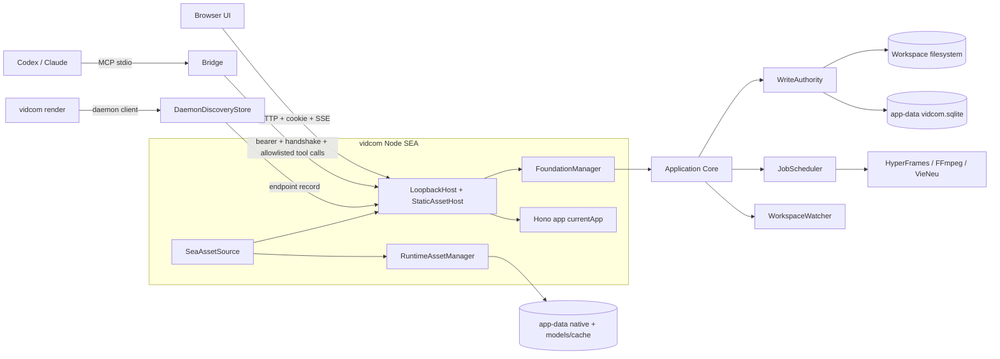
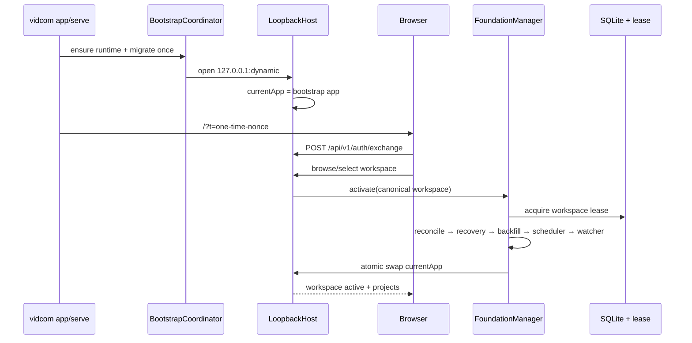
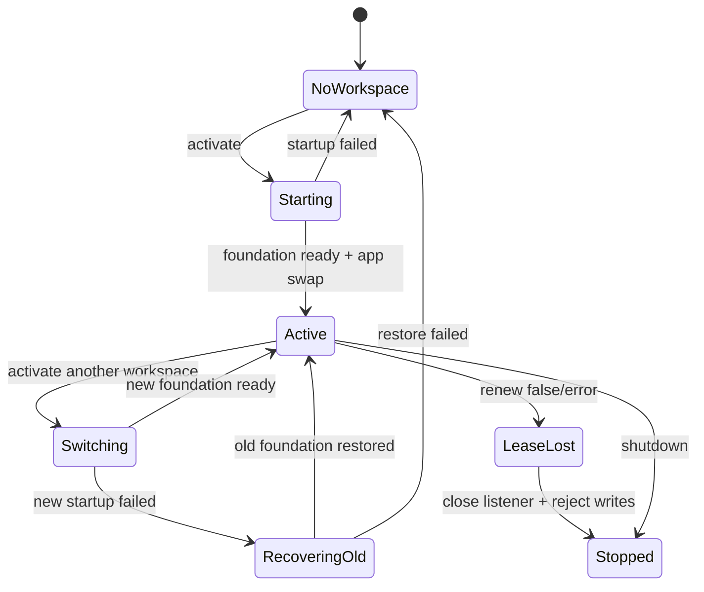
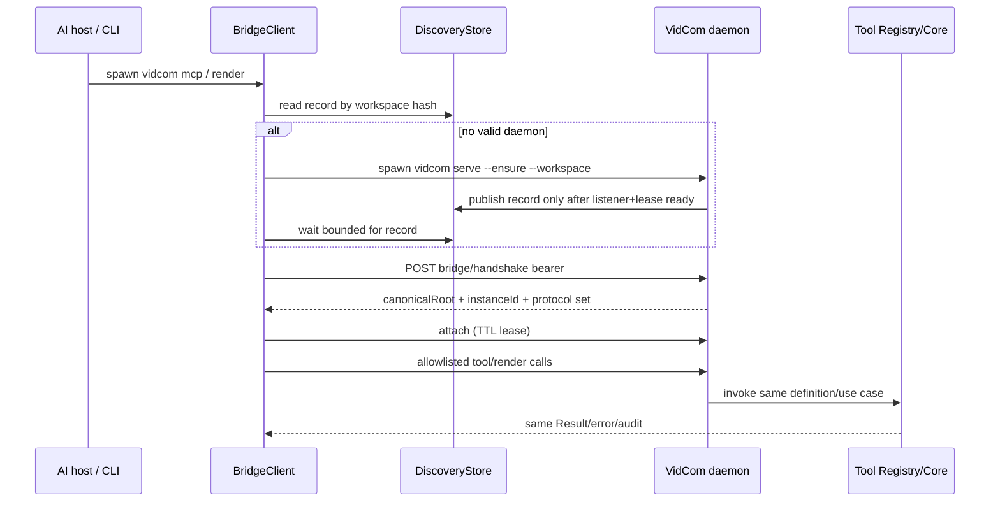
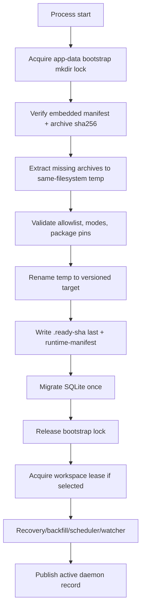
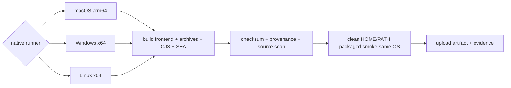
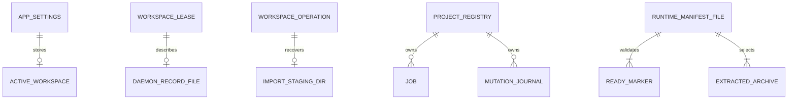
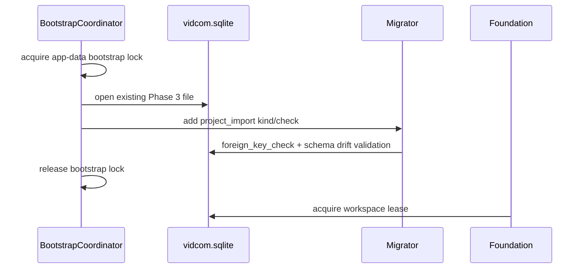

# Spec Packaging & Distribution Runtime — Detailed Design

> **Reference**: [Detailed Goals](./spec-packaging-and-distribution-detailed-goal.md) — **Approved 2026-08-07**
> **Main spec**: [Packaging & Distribution Runtime](./spec-packaging-and-distribution-pending.md)
> **Next**: Implementation Checklist — **chưa được phép tạo**
>
> **Trạng thái**: **Pending Confirmation**. Tài liệu này mở phase Design theo xác nhận của người dùng ngày 2026-08-07. Không có production code trong phase này.

## 1. Overview

Giai đoạn 4 thay host chạy từ checkout bằng một Node SEA native cho từng nền tảng, nhưng giữ nguyên Hono Application Core, WriteAuthority, job scheduler và MCP Tool Registry đã chạy ở Giai đoạn 1–3. Binary nhúng frontend static export và các archive runtime có manifest/checksum; lần chạy đầu giải nén runtime bắt buộc vào app-data dưới một bootstrap lock. Một daemon giữ lease là execution authority duy nhất: UI gọi HTTP, MCP stdio dùng bridge có xác thực, và `vidcom render` là thin client của cùng daemon.

Design chia startup thành hai tầng: **host không-workspace** mở listener/auth/system UI trước, sau đó **FoundationManager** dựng hoặc thay foundation theo workspace mà không đổi port/session. Packaged smoke được build và chạy native trên macOS arm64, Windows x64 và Linux x64; Windows là release gate. Linux chỉ được defer qua một scope change mới và khi đó release MUST hạ tuyên bố hỗ trợ xuống macOS + Windows.

### 1.1 Links to Requirements

| Requirement | Design element |
|---|---|
| R1.1–R1.19 | Sec 4.3, 5.2–5.4, 7.1–7.7 — browser filesystem cô lập, mutable foundation, UI picker/New video |
| R2.1–R2.15 | Sec 4.4, 5.5–5.7, 6.2, 7.8–7.11 — discovery record, bearer handshake, remote Tool Registry, attachment lease |
| R3.1–R3.13 | Sec 5.8–5.9, 7.12–7.14, 8.1 — CLI mode và doctor |
| R4.1–R4.14 | Sec 4.2, 5.10–5.12, 10.4 — CJS SEA, frontend pack, static shell, http-driver |
| R5.1–R5.14 | Sec 4.5, 5.13–5.15, 6.3–6.4, 10.5 — runtime manifest, extraction, bootstrap ordering |
| R6.1–R6.11 | Sec 4.6, 5.16–5.18, 10.6 — HyperFrames shim, compiler env, TTS/Chromium |
| R7.1–R7.12 | Sec 4.7, 5.19, 6.5, 7.15 — import staging + recovery |
| R8.1–R8.8 | Sec 4.8, 9.1, 11.4 — packaged smoke native theo OS |
| R9.1–R9.7 | Sec 5.20, 9.2–9.4, 10.7 — checksum, source scan, provenance, telemetry |

## 2. Design Scope

### 2.1 In Scope

- Một build pipeline native sinh `vidcom`/`vidcom.exe`, SHA256SUMS và provenance manifest cho đúng OS/arch của runner.
- SEA host Hono trên loopback, frontend static export phục vụ từ asset trong binary, không ghi thư mục `out/` cạnh executable.
- Boot không-workspace, picker qua UI, tạo thư mục, activate/switch workspace trên cùng listener/session.
- Nút New video nối vào create-project use case có sẵn với bundled preset, không có capability editing mới.
- Daemon discovery, bearer credential, handshake, MCP stdio bridge, auto-start race và attachment lifecycle.
- CLI `app`, `serve`, `mcp`, `render`, `doctor`, `version` cộng các lệnh quản trị đã có; không có public `worker` mode.
- Archive runtime theo platform, extraction nguyên tử, manifest/checksum, repair qua doctor.
- HyperFrames CLI shim, esbuild native, FFmpeg/FFprobe, frozen CPython + VieNeu, motion library và Chrome cache.
- Import project ngoài workspace bằng staging/copy/rename có recovery.
- Packaged smoke trên macOS arm64, Windows x64, Linux x64 với PATH/HOME cô lập.

### 2.2 Out of Scope

- Matrix 3 OS × 2 kiến trúc, installer `.dmg`/`.msi`, signing certificate/notarization thật — Giai đoạn 6.
- Tauri/native picker, auto-update, telemetry sản phẩm, crash reporting, license/activation.
- Public `vidcom worker`, worker process tách riêng, nhiều workspace active trong cùng daemon.
- CRUD file/folder, asset upload mới, agent generation trong app, PTY/diff preview.
- Air-gapped first-run cho Chromium/weights; chỉ kiểm warm/offline sau khi cache đã có.
- Sửa version skew HyperFrames; giai đoạn này chỉ cảnh báo.

## 3. Research Summary

### 3.1 Node SEA assets và main format

- **Context**: binary phải chạy không có Node/node_modules và chứa frontend/runtime archives.
- **Key insight**: Node SEA cung cấp `node:sea.getAsset/getRawAsset`, nhưng injected `require()` không resolve package filesystem; ứng dụng phải bundle thành một main script. Node 24 cũng yêu cầu blob được tạo bằng cùng Node binary được inject. Cross-platform code cache/snapshot không portable.
- **Sources**: [Node 24 SEA documentation](https://nodejs.org/download/release/v24.18.0/docs/api/single-executable-applications.html), [`spikes/phase-0`](../../../../spikes/phase-0/README.md), [`spikes/phase-4` S1/S2](../../../../spikes/phase-4/README.md).
- **Impact**: DR-1/DR-2; main bundle CJS, `useCodeCache=false`, `useSnapshot=false`, build native trên runner đích, asset lớn lấy qua `getRawAsset`.

### 3.2 Next static export và dynamic project route

- **Context**: project slug chỉ tồn tại sau khi binary đã build.
- **Key insight**: `output: "export"` sinh file tĩnh; dynamic route cần `generateStaticParams`. Spike S2 chứng minh một sentinel `__shell` dùng được nếu host map cả HTML và payload RSC `.txt`, còn client đọc slug thật từ `location`.
- **Sources**: [Next static export](https://nextjs.org/docs/pages/guides/static-exports), [generateStaticParams](https://nextjs.org/docs/app/api-reference/functions/generate-static-params), [`spikes/phase-4/s2-export`](../../../../spikes/phase-4/s2-export).
- **Impact**: DR-3; server shell/client child, frontend pack và resolver route tường minh.

### 3.3 Hono Node listener

- **Context**: host SEA phải phục vụ Hono, SSE/upload và đóng listener sạch.
- **Key insight**: `@hono/node-server` chạy `app.fetch`, trả Node server handle và hỗ trợ graceful close; `serveStatic` mặc định dựa vào cwd nên không phù hợp asset trong SEA.
- **Source**: [Hono Node.js adapter](https://hono.dev/docs/getting-started/nodejs), S2 host spike.
- **Impact**: DR-4; host dispatch `/api/**` vào mutable Hono app, asset khác qua `SeaStaticAssetHost`, không dùng filesystem `serveStatic`.

### 3.4 Runtime/toolchain spike

- **Context**: `process.execPath` trong SEA là VidCom, esbuild có thể treo, TTS không có Python hệ thống.
- **Key insight**: HyperFrames CLI chạy qua `--vidcom-node` shim; in-process bundle PASS nếu đặt `ESBUILD_BINARY_PATH` và `ESBUILD_WORKER_THREADS=0`; frozen CPython + VieNeu đã prune sinh WAV; supervisor kill-tree không phụ thuộc execPath.
- **Source**: [`spikes/phase-4/README.md`](../../../../spikes/phase-4/README.md) S1a/S1b/S3/S4.
- **Impact**: DR-8/DR-9; extracted CLI nhưng Node host là chính SEA, compiler có timeout bắt buộc, Python nằm trong runtime archive.

### 3.5 Platform evidence boundary

- **Context**: Goals target ba OS nhưng spike Phase 4 mới có darwin arm64.
- **Key insight**: CI hiện kiểm source trên ba OS, không kiểm artifact; native archive và runner phải cùng OS/arch. GitHub runner có image theo OS/arch nhưng mỗi artifact vẫn cần job riêng.
- **Sources**: [GitHub runner reference](https://docs.github.com/en/actions/reference/runners/larger-runners), [`.github/workflows/ci.yml`](../../../../.github/workflows/ci.yml), spike Phase 4.
- **Impact**: DR-11; không cross-build artifact release trong Giai đoạn 4, không suy kết quả macOS sang Linux/Windows.

## 4. Architecture

### 4.1 System Overview

Binary có một process host và tối đa một active foundation. Host sở hữu listener, bootstrap nonce/session, static frontend, system routes và `FoundationManager`. Foundation sở hữu workspace-specific SQLite adapters, lease, WriteAuthority, scheduler, watcher và Hono routes. Việc đổi workspace thay foundation object dưới một mutex; listener và session stores không đổi.

MCP stdio bridge không dựng foundation. Nó đọc discovery record + bearer trong app-data, handshake đúng workspace/instance, dựng MCP server từ **cùng ToolDefinition registry** nhưng dùng `RemoteToolInvoker`; daemon mới chạy use case/audit. CLI render dùng cùng `DaemonClient`, enqueue job rồi wait hoặc detach theo contract ở Sec 7.13.

### 4.2 Component Diagram



### 4.3 Boot, select và switch workspace



Switch workspace là state transition có rollback, không phải route mutation:



Luật switch:

1. `FoundationManager` serialize activate/switch bằng một mutex.
2. Validate/canonicalize target trước khi đụng foundation cũ.
3. Nếu có job non-terminal ở workspace cũ, trả `workspace_busy` và không đổi; Giai đoạn 4 không mặc định huỷ job.
4. Đưa host vào `switching`: system/auth routes còn dùng được; project mutation trả `503 workspace_switching`.
5. Stop scheduler/watcher, xoá discovery record cũ, release lease, đóng DB cũ.
6. Dựng foundation mới tới trạng thái ready rồi swap `currentApp` một lần.
7. Nếu bước 6 fail, thử dựng lại workspace cũ. Nếu rollback cũng fail, về `NoWorkspace`; listener/session vẫn sống để UI sửa.
8. Chỉ sau swap thành công mới ghi `active_workspace` và phát `workspace.changed`.

### 4.4 Daemon discovery, bridge và render CLI



Discovery record không chứa secret và không phải authority:

```json
{
  "schemaVersion": 1,
  "workspaceRoot": "/canonical/workspace",
  "workspaceHash": "sha256:...",
  "instanceId": "daemon_...",
  "pid": 1234,
  "host": "127.0.0.1",
  "port": 43127,
  "startedAt": "2026-08-07T00:00:00.000Z"
}
```

- Path: `<app-data>/daemon/<workspaceHash>.json`, atomic rename, `0600`/current-user ACL.
- Clear bearer giữ riêng ở `<app-data>/credentials`; SQLite chỉ giữ hash/lifecycle như hiện tại.
- Record chỉ được publish sau runtime/migration/lease/listener/handshake route ready; xoá trước khi release lease.
- Handshake MUST so canonical root và instance id từ record. PID/port sống không đủ.
- Attachment là lease trong memory của daemon `{attachmentId, kind: bridge|ui|render, expiresAt}`. Client heartbeat; mất heartbeat tự trừ. Đây là refcount daemon-owned, không nằm trong bridge. **Attachment chỉ đo client còn sống**, không đo công việc còn chạy.
- **Work hold tách khỏi attachment.** Daemon giữ thêm một `activeWorkHold` suy **trực tiếp từ job store**: có job non-terminal thuộc workspace này ⇒ hold còn. Nó **không** phải attachment, không cần heartbeat, và không biến mất khi client thoát.
- **Điều kiện auto-shutdown = cả hai đều rỗng**: không còn attachment nào **và** `activeWorkHold` rỗng **và** không có `app`/manual owner **và** đã qua grace period. UI attach luôn thắng auto-shutdown.
  Đây là chỗ bản trước tự mâu thuẫn: `--detach` cho CLI thoát ngay (§7.13), mà attachment lại hết hạn khi mất heartbeat — nên nếu chỉ đếm attachment thì daemon tự tắt **giữa lúc render**. Suy hold từ job store là cách duy nhất đúng mà không bắt một tiến trình đã thoát phải tiếp tục heartbeat.

### 4.5 Runtime extraction và cold-start ordering



**Hai flow startup, không phải một.** R5.13 khoá thứ tự `extract → migrate → lease → listener`; nhưng OQ-10 lại cần listener mở **trước** khi có workspace. Hai thứ đó không mâu thuẫn vì chúng là hai đường khác nhau — và Design phải nói rõ đường nào là đường nào:

| | `vidcom app` / `serve` **chưa có workspace** | `serve --workspace` / daemon auto-start |
|---|---|---|
| Thứ tự | extract → migrate → **listener (bootstrap app)** → *chờ người dùng chọn* → lease → foundation → swap | extract → migrate → **lease** → foundation → listener → publish discovery |
| Listener phục vụ gì trước lease | **chỉ** `/v1/auth/*`, `/v1/system/*`, `/v1/health` | không mở listener trước lease |
| Discovery record | **không publish** khi chưa có foundation | publish **sau** khi lease + handshake route ready |
| Vì sao | không có workspace thì không có lease để lấy; UI cần một cổng để chọn | client (bridge/render) chỉ được thấy daemon khi nó đã là execution authority |

Luật chung cho cả hai: **`extract → migrate` luôn đứng trước mọi thứ khác**, và **discovery record chỉ tồn tại khi daemon đã giữ lease**. Một listener chưa có foundation là hợp lệ cho UI nhưng **MUST NOT** xuất hiện với bridge/render — đó là lý do §7.11 tách `/api/v1/health` khỏi `/api/bridge/v1/ready`.

`BootstrapCoordinator` dùng atomic `mkdir(<app-data>/runtime-bootstrap.lock)` thay vì dựa vào SQLite chưa chắc đã migrate. Owner record chứa pid + process-start fingerprint + timestamp; stale lock chỉ reclaim sau bounded probe. Tất cả extraction và migration của một app-data được serialize. Migration được gọi đúng một lần trong một process boot.

Archive format là deterministic `.tar.gz`; package `tar@7.5.22` đã có trong lockfile được nâng thành dependency trực tiếp của package runtime. Extractor từ chối absolute path, `..`, symlink/hardlink và special file; chỉ regular file/directory trong manifest allowlist. Executable mode được manifest khai báo và áp lại sau extraction; Windows dùng ACL thay POSIX mode.

### 4.6 Render/TTS toolchain từ artifact

```mermaid
flowchart LR
    Job[Render job in daemon] --> Probe[Binary + compiler preflight]
    Probe --> Shim[spawn process.execPath --vidcom-node extracted hyperframes.mjs]
    Shim --> HF[HyperFrames CLI]
    HF --> Chrome[Chrome Headless Shell cache]
    HF --> FF[FFmpeg/FFprobe extracted]
    Job --> InProc[@hyperframes imports bundled in SEA]
    InProc --> Esbuild[ESBUILD_BINARY_PATH + WORKER_THREADS=0]
    TTS[TTS job] --> Py[Frozen CPython + VieNeu worker]
    Py --> Model[HF_HOME model cache]
```

- Hidden `--vidcom-node <script> ...` được dispatch trước public CLI parser, chỉnh `process.argv` rồi dynamic-import **chỉ** script nằm dưới verified `native/hyperframes` root.
- `NodeRenderBinaryProbe` trả command `[process.execPath, "--vidcom-node", cliPath]`, không còn `[process.execPath, cliPath]`.
- Mọi in-process compiler call chạy qua `CompilerGuard` đặt hai env bắt buộc và timeout. `doctor` chạy transform nhỏ qua đúng guard.
- VieNeu command trỏ frozen interpreter tuyệt đối + bundled worker; `HF_HOME` trỏ app-data models; warm offline đặt `HF_HUB_OFFLINE=1`.
- Chrome dùng cache path được quản lý/tường minh, không nhận Chrome hệ thống làm bằng chứng packaged smoke.

### 4.7 Import project

```mermaid
sequenceDiagram
    participant UI
    participant API
    participant Import as ProjectImportService
    participant Journal as workspace_operation
    participant FS as Real filesystem

    UI->>API: source token + target name
    API->>Import: plan/import actor=user
    Import->>FS: canonicalize source/target; reject overlap/symlink/special
    Import->>Journal: begin project_import + staging path
    Import->>FS: copy to temp sibling inside workspace filesystem
    Import->>FS: validate/backfill in staging
    Import->>FS: rename staging → final target (no overwrite)
    Import->>Journal: commit + project/workspace event
    Import-->>API: job terminal {projectId, slug}
```

Contract là **bất đồng bộ**: `POST /api/v1/projects/imports` trả **202 `{jobId}`** ngay (§7.15); `{projectId, slug}` chỉ xuất hiện ở **job result** khi job terminal, UI theo dõi qua job/event như mọi job khác. Sequence ở trên là vòng đời *job*, không phải vòng đời *request*.

Staging là sibling ẩn cùng filesystem (`<workspace>/.<slug>.vidcom-import-<operation>.tmp`) để final rename atomic. Nó có marker operation id; startup recovery hoàn tất hoặc xoá theo `workspace_operation`, không quét/xoá thư mục không có marker. Source chỉ đọc, không follow symlink, không sửa metadata/file gốc.

### 4.8 Build and packaged-smoke flow



Không job nào dùng artifact build từ OS khác. `useCodeCache` và `useSnapshot` tắt. Job smoke khôi phục **download cache** Chrome/HF vào HOME sạch nhưng không mồi runtime extraction/app-data.

### 4.9 Integration Points

| System | Direction | Protocol | Purpose |
|---|---|---|---|
| Browser UI | both | HTTP cookie + SSE | picker, project UI, job/event |
| AI host | in/out | MCP stdio | protocol-facing adapter |
| MCP bridge → daemon | both | loopback HTTP bearer | handshake, attach, allowlisted tool invocation |
| HyperFrames CLI | out | supervised child process | browser ensure, snapshot/render |
| Chrome download origin | out | HyperFrames browser ensure | first-run Chrome cache |
| Hugging Face | out | VieNeu/huggingface_hub | first-run model weights |
| Real filesystem | both | Node fs adapters | workspace, import, app-data runtime |
| GitHub Actions | build/test | native runner jobs | artifact proof per OS |

### 4.10 Technology Stack

| Layer | Technology | Rationale |
|---|---|---|
| Runtime | Node 24.9.0 SEA + postject pinned | Phase 0/4 evidence; same toolchain as existing CI |
| HTTP | Hono + `@hono/node-server` | existing D4 boundary, graceful listener |
| UI build | Next 16 `output: "export"` | retain dev host/build tool; no Next in artifact runtime |
| FE API | `@alvin0/http-driver` fetch/SSE paths | one typed service catalog, runtime base URL, AbortController |
| DB | SQLite + Drizzle schema/migrator | existing app-data authority; no second DB |
| Archive | tar 7.5.22 + gzip | spike-proven, preserves modes, already locked |
| Process | existing NodeProcessSupervisor | measured kill-tree protocol |
| Tests | Vitest + real SQLite/fs + browser + artifact shell | match steering/testing and R8 |

## 5. Components and Interfaces

### 5.1 `BootstrapCoordinator`

- **Purpose**: serialize runtime extraction and migration before any foundation/lease.
- **Interface**:

```ts
interface BootstrapCoordinator {
  prepare(input: {
    appDataRoot: AbsolutePath;
    assetSource: RuntimeAssetSource;
    repair: boolean;
  }): Promise<PreparedRuntime>;
}

interface PreparedRuntime {
  manifest: InstalledRuntimeManifest;
  paths: RuntimePaths;
  database: VidcomDatabase;
  release(): Promise<void>;
}
```

- `prepare()` owns bootstrap lock; callers MUST NOT independently call migration/extraction.
- `repair=false` refuses broken checksum; `doctor --repair` uses `repair=true`.

### 5.2 `FilesystemBrowserService`

- **Purpose**: bounded, authenticated navigation without exposing file contents.
- **Interface**:

```ts
interface FilesystemBrowserService {
  roots(sessionId: string): Promise<BrowseRoot[]>;
  list(input: { sessionId: string; token: string; cursor?: string }): Promise<BrowsePage>;
  createDirectory(input: { sessionId: string; parentToken: string; name: string }): Promise<BrowseEntry>;
  resolveSelection(input: { sessionId: string; token: string }): Promise<AbsolutePath>;
}
```

- `BrowseTokenStore` là in-memory, TTL ngắn, bind session + canonical path + stat identity; response vẫn có display path.
- File operation chạy trong bounded worker (`node:worker_threads`) với concurrency 2. Timeout terminate worker; request không giữ threadpool daemon vô hạn. Packaged smoke kiểm worker trên cả ba OS.
- **Worker MUST được tạo ở dạng eval** — `new Worker(<source>, { eval: true })` — và **MUST NOT** trỏ tới một file path (`new Worker(new URL("./browse-worker.js", import.meta.url))`). Trong SEA không có file thật để worker load; đây đúng là cơ chế đã làm esbuild **treo vĩnh viễn** ở S1b, và chế độ hỏng là **treo im lặng**, không phải lỗi. Dạng thông thường nhất lại là dạng sai, nên đây là ràng buộc chứ không phải gợi ý.
- Đã kiểm trong SEA thật ([S8](../../../../spikes/phase-4/README.md)): worker eval + `readdirSync` qua `postMessage` **OK**, `terminate()` giữa vòng lặp vô hạn **OK**, `Atomics` + `SharedArrayBuffer` **OK**. Test bắt buộc: một test dựng worker **dạng file path** và chứng minh nó fail/timeout có mã, để dạng sai không lặng lẽ quay lại.
- Chỉ trả directory entry; file thường trả tên + `isDir=false`, không stat size/nội dung.

### 5.3 `FoundationManager`

```ts
interface FoundationManager {
  status(): FoundationStatus;
  activate(workspaceRoot: AbsolutePath): Promise<Result<ActiveFoundationInfo, DomainError>>;
  stop(reason: "shutdown" | "lease-lost"): Promise<void>;
  currentApp(): ReturnType<typeof createServerApp>;
}
```

- Giữ host session/nonces bên ngoài foundation.
- Tách `startVidcomFoundation` thành `prepareFoundation` (không listener) và lifecycle handle idempotent `stop()`.
- `WriteAuthority` vẫn kiểm lease trước và sau mutex. Lease loss chuyển manager sang terminal, đóng listener qua host callback.

### 5.4 `LoopbackHost` và mutable request target

```ts
interface LoopbackHost {
  start(fetchTarget: () => (request: Request) => Response | Promise<Response>): Promise<HostHandle>;
}

interface HostHandle {
  host: "127.0.0.1";
  port: number;
  close(): Promise<void>;
}
```

- Node request listener đọc `currentApp` mỗi request; swap là assignment đồng bộ.
- `/api/**` vào current Hono app; path còn lại vào `SeaStaticAssetHost`.
- Bootstrap app đăng ký auth/system/health; active app thêm project/job/event/MCP routes.

### 5.5 `DaemonDiscoveryStore`

```ts
interface DaemonDiscoveryStore {
  read(workspaceRoot: AbsolutePath): Promise<DaemonRecord | null>;
  publish(record: DaemonRecord): Promise<void>;
  remove(workspaceRoot: AbsolutePath, instanceId: string): Promise<void>;
}
```

- Atomic temp+fsync+rename; mode/ACL bảo vệ.
- `remove` compare instanceId để daemon cũ không xoá record daemon mới.

### 5.6 `DaemonClient` và handshake

```ts
interface DaemonClient {
  ensure(input: { workspaceRoot: AbsolutePath; kind: AttachmentKind }): Promise<DaemonSession>;
}

interface DaemonSession {
  instanceId: string;
  attachmentId: string;
  baseUrl: string;
  invokeTool(name: ToolName, input: unknown, context: RemoteInvocationContext): Promise<unknown>;
  enqueueRender(input: EnqueueRenderRequest): Promise<{ jobId: JobId }>;
  getJob(jobId: JobId): Promise<JobDto>;
  cancelJob(jobId: JobId): Promise<void>;
  close(): Promise<void>;
}
```

- HTTP client có deadline cho discovery/handshake/call; không retry mutation mù.
- `ensure` spawn `serve --ensure` khi cần, xử lý race bằng startup lock + final lease/handshake.

### 5.7 Remote MCP Registry

- **Purpose**: giữ tool schema/list/era ở bridge nhưng execution ở daemon.
- `ToolDefinition` tiếp tục là nguồn duy nhất. `createMcpRegistry` nhận `ToolInvoker`; local invoker gọi Core, remote invoker gọi daemon allowlisted endpoint.
- Bridge forward `protocolVersion`, credential/attachment id, request state và actor=`agent`; daemon sở hữu audit.
- MUST NOT có generic `request(method,path,body)` trong bridge.

### 5.8 CLI command dispatcher

- Public union: `app | serve | mcp | render | doctor | version | approve | credential | backup | recovery`.
- Internal flag `--vidcom-node` được xử lý trước parser và không xuất hiện trong help/public type.
- Mọi human output của CLI trừ MCP dùng `stderr`/selected output writer; MCP stdout chỉ JSON-RPC.

### 5.9 Doctor service

```ts
type DoctorStatus = "ok" | "missing" | "broken" | "skipped";
interface DoctorCheck {
  id: string;
  required: boolean;
  run(context: DoctorContext): Promise<DoctorItem>;
  repair?(context: DoctorContext): Promise<DoctorItem>;
}
interface DoctorReport { version: 1; platform: string; items: DoctorItem[]; }
```

**Bảng phân loại — deliverable của R3.12.** Luật phân loại: thứ **ship trong artifact** là *required* (thiếu nghĩa là giải nén hỏng, không phải người dùng chưa tải); thứ **tải ở lần chạy đầu** cũng *required* theo OQ-11 nhưng có `skipped` khi chưa từng chạy render/TTS; thứ thuộc **máy/người dùng** là *optional*.

| id | Kiểm gì | required | Nguồn | `skipped` khi |
|---|---|:--:|---|---|
| `app-data.writable` | app-data tồn tại, mode/ACL đúng | ✅ | artifact | — |
| `db.migration` | schema version, `foreign_key_check` | ✅ | artifact | — |
| `runtime.manifest` | embedded ↔ installed manifest khớp | ✅ | artifact | — |
| `runtime.integrity` | sha256 từng archive đã giải nén | ✅ | artifact | `--deep` off → chỉ marker |
| `runtime.ffmpeg` | FFmpeg + FFprobe chạy được | ✅ | artifact | — |
| `runtime.esbuild-binary` | binary native có mặt, mode đúng | ✅ | artifact | — |
| `compiler.probe` | `transformSync` nhỏ qua `CompilerGuard` trong timeout | ✅ | artifact | — |
| `runtime.hyperframes` | CLI resolve + version | ✅ | artifact | — |
| `runtime.motion` | 5 thư viện + version pin | ✅ | artifact | — |
| `runtime.python` | interpreter đóng băng + stack khớp danh sách pin (§5.13) | ✅ | artifact | — |
| `chrome.cache` | Chrome Headless Shell: đủ / thiếu / tải dở | ✅ | tải lần đầu | chưa từng render |
| `tts.model-cache` | weights VieNeu: đủ / thiếu / tải dở | ✅ | tải lần đầu | chưa từng TTS |
| `workspace.active` | workspace active + ai giữ lease | ✅ | máy | chưa chọn workspace |
| `port.available` | bind được loopback | ✅ | máy | — |
| `settings.file` | `~/.vidcom/setting.json` có/parse được — **không in nội dung** | ⬜ | người dùng | file không tồn tại |
| `tts.elevenlabs` | có API key hay không | ⬜ | người dùng | luôn optional |
| `gpu.cuda` | GPU dùng được cho TTS | ⬜ | máy | không phải Linux/Windows có CUDA |

Exit code theo R3.7: mục **required** không `ok` ⇒ exit ≠ 0; mục **optional** không `ok` MUST NOT làm exit khác 0. `skipped` không tính là fail.

- Registry check deterministic theo thứ tự; `--json` dùng schema contracts.
- Redactor loại token, API key, credential body và build-machine absolute path.
- Repair chỉ extraction/runtime component; không tự sửa settings/project.

### 5.10 `SeaStaticAssetHost`

Build sinh hai SEA assets:

- `frontend-manifest.json`: `{path, offset, length, sha256, mime, cachePolicy}`.
- `frontend.pack`: concatenated raw bytes, không base64.

Runtime dùng `getRawAsset` và immutable `Uint8Array` view; không ghi pack ra đĩa. Resolver normalize URL, reject encoded traversal, map `/projects/<slug>` và các payload con sang `projects/__shell*`, còn lại exact/implicit `.html`. HTML/RSC `no-store`; hashed `/_next/static/**` immutable.

### 5.11 Frontend API driver

- Một service catalog trong `src/lib/api/services.ts`, id dạng `v1.<domain>.<action>`.
- `DriverBuilder.withBaseURL(resolveApiBaseUrl()).withServices(...).withTimeout(...)`.
- Không bật automatic version injection vì service URL đã chứa `api/v1`; tránh `/v1/v1`.
- Browser calls dùng Fetch path với `credentials: "include"`; SSE dùng `execServiceByStream` và abort khi unmount.
- **Base URL là runtime config, không phải build-time env.** `NEXT_PUBLIC_*` bị Next inline lúc build, nên nó vi phạm R4.10 ("**cùng một** bundle chạy được cả hai môi trường, chỉ bằng cấu hình"). Thay bằng: `resolveApiBaseUrl()` đọc một global runtime — `window.__VIDCOM_API_BASE_URL__` do host chèn — và **mặc định `location.origin`** khi global vắng mặt. Artifact không chèn gì ⇒ chạy same-origin; `next dev` chèn origin của daemon ⇒ chạy cross-origin. Một bundle, hai môi trường, không rebuild.
- Artifact test scan cấm chuỗi `localhost:3000` và mọi dev origin trong pack đã build — với runtime config thì không có gì để lọt, và test giữ nguyên là chốt chặn.
- **SSE cũng phải gửi credential.** `execServiceByStream` SHALL nhận cùng request options như đường fetch, gồm `credentials: "include"`, vì cross-origin dev không tự đính cookie. Stream SHALL nhận `AbortSignal` và bị abort khi component dispose — nếu không, mỗi lần đổi workspace/điều hướng để lại một kết nối SSE treo trên daemon.
- Mọi caller kiểm `ResponseFormat.ok`; error mapper chuyển stable `error.code/field/details` vào UI.

### 5.12 Workspace/New video UI

- `WorkspacePickerPage`: roots, breadcrumb, paginated entries, create folder, select, timeout/permission error.
- `NewProjectDialog`: name + bundled preset (`vertical-shorts`, `horizontal-youtube`), submit guard, field error, collision error; success refresh/navigate.
- Không custom dimensions trong dialog; endpoint vẫn giữ contract custom hiện có cho caller khác.
- Đổi subtitle card thành mô tả project trống, không nói agent generation.

### 5.13 Runtime asset source and manifest

```ts
interface RuntimeAssetSource {
  readManifest(): EmbeddedRuntimeManifest;
  readArchive(key: RuntimeArchiveKey): Uint8Array;
}

interface EmbeddedArchive {
  key: string;
  platform: "darwin-arm64" | "win32-x64" | "linux-x64";
  sha256: ContentHash;
  bytes: number;
  target: string;
  entries: Array<{ path: string; sha256: ContentHash; mode: number }>;
}
```

Manifest pin Node, HyperFrames, esbuild, FFmpeg, CPython, VieNeu và motion versions.

**Danh sách Python được pin — deliverable của R5.14.** Đây là tập **đã đo trên bản cài thật**, không phải mô tả cơ chế. Base là `python-build-standalone` CPython `3.12.13+20260805`; cài `vieneu==3.2.4` + `huggingface-hub` kéo về **77 package**, trong đó **21 package bị gỡ** và **56 package được giữ**.

*Gỡ (21)* — một web UI demo cộng phần phụ thuộc của nó, không đường nào của sidecar chạm tới:

```
fastapi gradio gradio_client groovy hf-gradio llvmlite markdown-it-py mdurl numba
pillow pygments python-multipart rich safehttpx scikit-learn semantic-version
shellingham starlette tomlkit typer uvicorn
```

*Giữ (56)* — pin theo version chính xác trong manifest:

```
annotated-doc==0.0.5      annotated-types==0.8.0    anyio==4.14.2          audioread==3.1.0
brotli==1.2.0             certifi==2026.7.22        cffi==2.1.1            charset-normalizer==3.4.9
click==8.4.2              decorator==5.3.1          filelock==3.32.2       flatbuffers==25.12.19
fsspec==2026.7.0          h11==0.16.0               hf-xet==1.6.0          httpcore==1.0.9
httpx==0.28.1             huggingface_hub==1.26.1   idna==3.18             jinja2==3.1.6
joblib==1.5.3             lazy-loader==0.5          librosa==0.11.0        markupsafe==3.0.3
msgpack==1.2.1            narwhals==2.24.0          numpy==2.4.6           onnxruntime==1.28.0
orjson==3.11.9            packaging==26.3           pandas==3.0.5          perth==1.0.0
pip==26.2                 platformdirs==4.11.0      pooch==1.9.0           protobuf==7.35.1
pycparser==3.0            pydantic==2.13.4          pydantic_core==2.46.4  pydub==0.25.1
python-dateutil==2.9.0.post0                        pytz==2026.3.post1     pyyaml==6.0.3
requests==2.34.2          scipy==1.18.0             sea-g2p==0.8.3         six==1.17.0
soundfile==0.14.0         soxr==1.1.0               threadpoolctl==3.6.0   tokenizers==0.23.1
tqdm==4.70.0              typing-inspection==0.4.2  typing_extensions==4.16.0
urllib3==2.7.0            vieneu==3.2.4
```

**Đã kiểm**: gỡ đủ 21 package rồi chạy `worker.py --request` với voice lấy từ catalogue → WAV hợp lệ. Kích thước **492 MB giải nén / 145,9 MB nén**, so với 805 MB / 245 MB khi không prune.

Build SHALL **fail** nếu tập package thực tế lệch khỏi danh sách này — thừa hay thiếu đều fail, vì thừa nghĩa là artifact phình mà không ai để ý và thiếu nghĩa là TTS chết trên máy người dùng. Danh sách + version là **một phần của checksum contract**, không phải tài liệu tham khảo. Đổi danh sách phải kèm số đo mới ở đây.

### 5.14 `RuntimeAssetManager`

- `ensureAll`, `inspect`, `repair`, `pruneOldVersions`.
- Target versioned: `<app-data>/native/<artifact-version>/<archive-key>/...`.
- `.ready-<archive-sha>` viết sau validation; `current.json` atomic trỏ version active.
- Không xoá version cũ khi process khác còn dùng; prune chỉ sau startup thành công và grace period.

### 5.15 Bootstrap lock

- Atomic directory lock ở app-data; owner file không phải authority duy nhất.
- Bounded wait + stale probe `(pid, processStartIdentity)`; không reclaim chỉ vì timestamp.
- Windows không dựa vào unlink file đang mở; rename lock dir sang quarantine rồi xoá sau.

### 5.16 HyperFrames shim and binary probe

- `hyperframesCliPath`, `hyperframesPackagePath`, `motionLibraryRoot`, `nativeDependenciesRoot`, `browserCacheRoot` đều bắt buộc ở artifact composition root; fallback `require.resolve` chỉ còn dev/test.
- Shim validate realpath dưới verified runtime root trước dynamic import.
- Supervisor command array, không shell string; env allowlist không truyền secret không cần thiết.

### 5.17 `CompilerGuard`

```ts
interface CompilerGuard {
  run<T>(operation: () => Promise<T> | T, timeoutMs: number): Promise<Result<T, DomainError>>;
  probe(timeoutMs: number): Promise<Result<{ version: string }, DomainError>>;
}
```

Thiết lập env trước import/compiler initialization; restore env sau operation chỉ trong test process. Production set một lần lúc boot. Timeout trả `compiler_unavailable`, không treo.

### 5.18 Download cache coordinator

- Chrome cache và HF_HOME là download cache, không runtime extraction.
- Có per-component download lock, partial marker và timeout; `doctor` phân biệt missing/partial/broken.
- W-3 giữ debt: lỗi mất mạng thật phải có code và không treo; packaged offline step là gate.

### 5.19 `ProjectImportService`

```ts
interface ProjectImportService {
  plan(input: { source: AbsolutePath; targetName?: string }): Promise<Result<ImportPlan, DomainError>>;
  execute(input: ImportPlan & { actor: Actor }): Promise<Result<{ projectId: ProjectId; slug: string }, DomainError>>;
}
```

- Plan bind source canonical identity + target absence + digest; execute recheck trước copy.
- Copy regular files/directories only, ignore `node_modules/.git/.hyperframes`, reject symlink/special.
- Backfill dùng lại `bootstrapProject`/ProjectLifecycle; không có đường serialize identity thứ hai.

### 5.20 Artifact builder/provenance

- Script build fail nếu lockfile/tool versions khác manifest, archive có entry ngoài allowlist, sourcemap/source rời, secret pattern hoặc build-machine absolute root.
- Output: executable, `SHA256SUMS`, `artifact-manifest.json` gồm commit, dirty=false requirement cho release job, tool versions, archive hashes, platform.
- Giai đoạn 4 macOS ad-hoc sign sau injection; Windows unsigned + checksum; signing thật deferred.
- HyperFrames telemetry được disable trong extracted runtime lần đầu; release notes ghi quyết định.

## 6. Data Models

### 6.0 Relationship Diagram



`DAEMON_RECORD_FILE`, runtime manifest, marker và staging directory là filesystem operational state, không phải bảng SQLite.

### 6.1 Persistence Overview

- **Database**: existing `<app-data>/vidcom.sqlite`; không tạo database mới.
- **New tables**: none.
- **Modified table**: `workspace_operation` mở rộng `kind` thêm `project_import`.
- **Existing read/write**: `app_settings(active_workspace)`, `workspace_lease`, `job`, `project_registry`, audit/event/journal giữ nguyên owner.
- **Filesystem app-data mới**: `daemon/*.json`, `native/**`, runtime manifest/markers, bootstrap lock, cache locks.
- **Workspace tạm thời**: import staging sibling có marker; sau terminal không còn.
- **Transaction boundary**: import operation begin/commit trong SQLite bao quanh filesystem staging/publish theo coordinator recovery pattern; không giả vờ filesystem + SQLite là một ACID transaction.

### 6.2 Daemon record — filesystem

| Field | Type | Required | Rule |
|---|---|---:|---|
| schemaVersion | integer | yes | `1` |
| workspaceRoot | absolute canonical path | yes | match requested root |
| workspaceHash | sha256 | yes | filename and content match |
| instanceId | string | yes | unique per daemon process start |
| pid | positive integer | yes | diagnostic only |
| host | string | yes | exactly `127.0.0.1` |
| port | integer | yes | 1..65535 |
| startedAt | ISO timestamp | yes | diagnostic/stale hint |

Secret/attachment count/lease id MUST NOT nằm trong file.

### 6.3 Runtime manifests — filesystem

- Embedded manifest là build authority; installed manifest là projection của thứ đã verify/extract.
- Marker filename chứa archive digest; marker content chứa target version + verifiedAt, không được dùng thay digest verification khi `doctor --deep`.
- `current.json` chỉ đổi sau toàn bộ required archives ready.

### 6.4 Database Tables

#### `workspace_operation` — modified

- **Purpose**: recovery authority cho mutation workspace-level, nay gồm import.
- **Database**: `vidcom.sqlite`.
- **Owner**: `WorkspaceOperationJournal`/WriteAuthority coordinator.
- **Change**: `kind` check/enum từ `agent_kit_files | project_create | project_rename | project_delete` thành thêm `project_import`.
- **Columns used by import**:

| Column | DB type | Nullable | Rule |
|---|---|---:|---|
| id | INTEGER PK AUTOINCREMENT | no | operation id |
| workspace_root | TEXT | no | canonical target workspace |
| kind | TEXT | no | `project_import` |
| project_id | TEXT | yes | set khi identity đã biết |
| from_path | TEXT | yes | canonical source, audit/recovery only |
| to_path | TEXT | yes | final target |
| staging_path | TEXT | yes | same-filesystem temp with marker |
| status | TEXT | no | pending/committed/aborted/recovered/orphaned |
| actor | TEXT | no | user/agent/cli-external/system |
| action | TEXT | no | stable action name |
| created_at | TEXT | no | ISO time |

- **Indexes**: giữ existing unresolved/status index; no new query pattern requires another index.
- **Concurrency**: workspace lease + target `mkdir/rename` no-overwrite; coordinator recheck.

#### `app_settings` — existing, unchanged

- Key `active_workspace` chỉ ghi sau foundation swap thành công.
- Không dual-write cùng value vào `~/.vidcom/setting.json`.

#### `workspace_lease` — existing, unchanged

- Một row/canonical workspace, TTL/renew như hiện tại.
- Daemon record chỉ được publish khi row thuộc lease id của foundation đó.

#### `job` — existing, unchanged

- Render CLI/bridge enqueue vào cùng bảng; không có queue thứ hai.
- Attachment/refcount MUST NOT ghi vào job.

### 6.5 Migration and Backfill



- **Migration**: forward-only Drizzle migration rebuilding `workspace_operation` if SQLite check constraint requires it; copy all rows, preserve ids/status.
- **Backfill**: none. Existing operation kinds remain byte-identical.
- **Rollback**: roll forward only; previous binary may not understand new kind. Release note marks DB forward compatibility boundary. Backup DB before migration using existing app-data backup policy.
- **Validation**: row count/kind distribution before/after, `foreign_key_check=0`, schema drift test, real Phase 3 fixture DB boot.

## 7. API / Interface Contracts

Tất cả browser endpoint dưới `/api/v1`, session cookie bắt buộc trừ auth exchange/health. Bridge endpoint dưới `/api/bridge/v1`, bearer bắt buộc và không được expose qua browser/MCP tools. Body limit mặc định 1 MiB.

### 7.1 `GET /api/v1/system/filesystem/roots`

- **Purpose**: trả Home/Documents/Desktop hoặc Windows drive roots.
- **Response 200**: `{ roots: BrowseRootDto[] }`, mỗi root có `name`, `displayPath`, `token`, `canWrite`.
- **Security**: no MCP registration; token bind session.

### 7.2 `POST /api/v1/system/filesystem/entries`

- **Why POST**: absolute path/token không nằm trong URL/request log; đây là bounded query, không mutation.
- **Request**: `{ token: string, cursor?: string }`.
- **Response 200**: `{ directory, parentToken, entries, nextCursor, truncated }`.
- **Errors**: `browse_token_invalid`, `path_unreadable`, `path_timeout`, `not_directory`.

### 7.3 `POST /api/v1/system/directories`

- **Request**: `{ parentToken, name }`; name một segment, không slash/dot traversal.
- **Response 201**: created `BrowseEntryDto` + token.
- **Idempotency**: no; existing target returns 409 and never overwrites.

### 7.4 `GET /api/v1/system/workspace`

- **Response**: `{ state: "none"|"starting"|"active"|"switching"|"failed", workspace?: {...}, error?: DomainErrorDto }`.

### 7.5 `PUT /api/v1/workspace/active`

- Giữ path hiện có nhưng request UI mới ưu tiên `{ selectionToken }`; CLI/internal compatibility có `{ path }` và đi qua cùng canonicalizer.
- **Response 200**: workspace overview sau swap.
- **Errors**: 409 `workspace_busy`, 423/409 `workspace_lease_held`, 503 `workspace_start_failed` kèm rollback state.
- **Idempotency**: activate workspace đang active trả current overview, không restart foundation.

### 7.6 `POST /api/v1/projects`

- Contract hiện có giữ nguyên: `{name,presetId,width?,height?,fps?}` → `201 {projectId,slug}`.
- UI R1.19 chỉ gửi bundled preset; không thêm endpoint/backend capability.

### 7.7 Frontend events

- `GET /api/v1/events` giữ SSE contract; http-driver stream phải abort khi component dispose.
- Workspace switch phát `workspace.changed`; client invalidates projects query.

### 7.8 `POST /api/bridge/v1/handshake`

- **Auth**: bearer clear token từ credential file, verify qua hashed credential service.
- **Request**: `{ workspaceRoot, expectedInstanceId, clientKind, clientVersion }`.
- **Response**: `{ workspaceRoot, instanceId, protocolVersions, daemonVersion }`.
- Mismatch trả 409 `daemon_identity_mismatch`; không tiếp tục call.

### 7.9 Attachment endpoints

- `POST /api/bridge/v1/attachments` → `{attachmentId,heartbeatEveryMs,expiresAt}`.
- `PUT /api/bridge/v1/attachments/:id` renew; `DELETE` detach.
- Attachment id random 256-bit, bound credential+instance; stale expires automatically.

### 7.10 `POST /api/bridge/v1/tools/:name`

- `name` validate exact Tool Registry allowlist.
- Request `{input, protocolVersion, requestState?}`; schema validate bằng ToolDefinition.
- Response là stable domain result trước era stamp; remote MCP server stamps theo negotiated era.
- Destructive approval giữ nguyên; actor agent; daemon audit.

### 7.11 Daemon health/readiness

- `/api/v1/health`: process/listener alive, dùng cho browser.
- `/api/bridge/v1/ready`: bearer, trả instance/workspace/lease held; discovery validation dùng endpoint này, không dùng health trần.

### 7.12 `vidcom doctor`

```text
vidcom doctor [--workspace <path>] [--json] [--repair] [--deep]
```

- `--repair` phải tường minh; `--json` stdout chỉ một DoctorReport; human output stderr.
- Exit `0` khi mọi required check ok, `1` khi required missing/broken, `2` cho CLI input/internal report failure.

### 7.13 `vidcom render`

```text
vidcom render <project-id-or-slug> [--workspace <path>] [--preset <id>]
              [--detach] [--json]
```

- **Phân biệt id với slug**: `ProjectId` có dạng `project_<uuid>` (xem `projects/*/vidcom.json`). Giá trị khớp `^project_[0-9a-f-]{36}$` được xử lý là **id**; mọi giá trị khác là **slug** và resolve qua `resolveProjectIdBySlug` ([`project-reads.ts:290`](../../../../packages/core/src/usecase/project-reads.ts#L290)). MUST NOT thử id trước rồi fallback slug — một slug tình cờ trùng dạng id sẽ im lặng trỏ sai project.
- **Workspace khi không truyền `--workspace`**: theo đúng thứ tự của `selectWorkspace` hôm nay — `--workspace` > `VIDCOM_WORKSPACE` > `active_workspace` trong app-data > `cwd` có marker. Khác một chỗ và là chỗ quan trọng: `vidcom render` **MUST NOT** nhận `cwd` không có marker làm workspace (hành vi §1.5d của Goals). Không resolve được ⇒ exit `2` kèm thông điệp nói rõ cách chỉ định, MUST NOT lặng lẽ render vào một thư mục tình cờ.
- **Default**: ensure daemon, enqueue, poll với backoff, chờ terminal; thành công exit 0.
- `--detach`: return/print jobId ngay sau 202, exit 0. CLI **nhả attachment khi thoát** — daemon không tắt giữa render vì `activeWorkHold` suy từ job store giữ nó sống tới khi job terminal (§4.4), không phải vì attachment của một tiến trình đã chết.
- `Ctrl+C` lần đầu gửi cancel cho job do invocation này tạo, chờ bounded termination proof; lần hai thoát 130 và để daemon recovery.
- Exit: `0 succeeded`, `1 failed`, `2 input/connection`, `130 user cancel`. `cancelled` không gộp `failed`.
- JSON output stable `{jobId,status,result?,error?,warnings}`.
- **Idempotency key là bắt buộc ở wire, nên CLI phải chốt cách sinh nó.** `EnqueueRenderRequestSchema.idempotencyKey` là **required** (`z.string().min(1).max(255)`, [`delivery-loop-http.ts:29-33`](../../../../packages/contracts/src/delivery-loop-http.ts#L29)), và `JobStorePort.enqueue` trả `{ conflict: "idempotency_key_reused" }` khi cùng key đến với input khác. Hai lựa chọn cho khác nhau về hành vi người dùng: key **ngẫu nhiên mỗi lần gọi** ⇒ `vidcom render` chạy hai lần sinh **hai job**; key **suy tất định** từ (projectId, preset, bestEffort, revision) ⇒ lần gọi thứ hai **bám vào job đang chạy** thay vì xếp thêm. Design chốt **ngẫu nhiên mỗi invocation**, vì CLI là lệnh người dùng chủ động gọi và "chạy lại nghĩa là render lại" ít bất ngờ hơn; `--detach` in jobId để ai cần bám thì dùng `getJob`. MUST NOT để implementation tự chọn.
- **Ánh xạ cờ sang field đã có**, không sinh contract thứ hai: `--preset <id>` → `renderPresetId`; `bestEffort` giữ default hiện tại của use case và **không** được expose thành cờ ở Giai đoạn 4 (thêm cờ là thêm public contract, ngoài phạm vi R3.3).

### 7.14 `vidcom version`

- Human + `--json`; gồm VidCom version, HyperFrames version, build commit, platform tag, runtime manifest version.

### 7.15 `POST /api/v1/projects/imports`

- **Request**: `{sourceToken,targetName?}`; token từ filesystem browser, không raw path từ UI.
- **Response 202**: `{jobId}` vì import có thể lâu; import dùng existing job infrastructure type `project-import` và application service ở daemon.
- **Idempotency**: khoá ở **application layer**, không dựa vào unique index của DB. Lý do cụ thể: `uniqueIndex("uq_job_idempotency")` scope theo `(project_id, type, idempotency_key)` ([`schema.ts:274`](../../../../packages/adapter/src/db/schema.ts#L274)) và `project_id` **là NULL** cho tới khi import hoàn tất — mà SQLite coi mọi NULL là **khác nhau** trong unique index, nên constraint đó **không** chặn được import trùng.
  Nên `ProjectImportService` SHALL lookup trước khi enqueue theo khoá nghiệp vụ `(workspaceRoot, sourceCanonicalIdentity, targetName)`: nếu đã có job non-terminal khớp thì **trả lại jobId đó** thay vì tạo job mới; nếu có job terminal thành công thì trả 409 `project_import_conflict` vì target đã tồn tại. Lookup chạy dưới workspace lease nên hai request song song không cùng thắng.
- Source outside workspace only; overlap/target exists returns 409/422 trước enqueue.

## 8. Error Handling

### 8.1 Error Categories

| Code/category | Surface | Strategy |
|---|---|---|
| `runtime_manifest_invalid` | boot/doctor | fail before extraction; repair only with embedded verified asset |
| `runtime_extraction_incomplete` | boot/doctor | ignore no-marker target; remove/quarantine temp and retry |
| `bootstrap_lock_timeout` | boot | bounded failure with owner diagnostics, no parallel migration |
| `workspace_busy` | switch | 409, list active job ids/types; do not cancel silently |
| `workspace_lease_lost` | HTTP/MCP | reject write, close listener/daemon; no reacquire in same process by default |
| `daemon_identity_mismatch` | bridge | discard record, bounded rediscovery; never send mutation |
| `daemon_unavailable` | bridge/CLI | one ensure attempt, then stable error; no infinite loop |
| `path_timeout` | picker | terminate browse worker, actionable UI error |
| `compiler_unavailable` | render/doctor | timeout with env/path diagnostics, no hang |
| `download_unavailable` | Chrome/model | fail job with retry hint; warm offline must still pass |
| `project_import_conflict` | import | abort staging/recovery, original untouched |
| `process_termination_unverified` | cancel | failed, not cancelled; preserve proof |

### 8.2 Response Strategy

- Giữ một `{error:{code,message,field?,details?}}` cho HTTP/MCP/CLI JSON.
- Retry chỉ cho discovery read, attachment heartbeat và transient download; mutation/tool call không auto-retry nếu chưa có idempotency key.
- Startup failure trước listener in structured stderr; failure sau listener hiển thị bootstrap UI.
- Workspace switch failure cố rollback old foundation; rollback failure về no-workspace thay vì giữ half-active app.

### 8.3 Logging & Observability

- Structured stderr/app-data log: process instance, workspace hash (không raw path ở info), phase, duration, outcome.
- Audit vẫn chứa actor/protocol/tool; bridge handshake/attach là operational log, không tool audit.
- Redact bearer, nonce, settings content, prompt/file contents.
- Build log ghi archive/version/hash, không ghi secret hay absolute source root vào artifact manifest.

## 9. Non-Functional Requirements

### 9.1 Performance

**Ngưỡng fail startup — deliverable của R4.9.** Đo từ process start tới listener nhận request đầu tiên, **không tính** thời gian tải Chrome/weights (đó là `download_unavailable`, đường khác).

| Runner | Cold (lần chạy đầu, gồm giải nén) | Warm |
|---|---:|---:|
| macOS arm64 | **≤ 120 s** | **≤ 3 s** |
| Linux x64 | **≤ 120 s** | **≤ 3 s** |
| Windows x64 | **≤ 180 s** | **≤ 5 s** |

Windows nới hơn vì antivirus quét file vừa giải nén — 492 MB stack Python là phần lớn thời gian cold. Hai gate độc lập, cả hai đều fail được:

1. **Trần cứng** — vượt bảng trên ⇒ packaged smoke **fail**. Đây là số duy nhất chặn release.
2. **Chặn hồi quy** — mỗi runner ghi baseline ở lần smoke xanh đầu tiên; lần sau vượt **1,5 ×** baseline của chính runner đó ⇒ fail, kể cả khi còn dưới trần.

Trần được đặt từ thứ đã đo: SEA base 116 MB, archive Python 146 MB nén → 492 MB giải nén (§5.13). Nếu lần chạy thật cho thấy trần quá chặt hoặc quá lỏng, **sửa bảng này** kèm số đo — MUST NOT nới ngầm bằng cách bỏ gate.

- Bootstrap warm không extract lại archive; chỉ đọc manifest/marker và bounded integrity checks.
- Static asset host không base64-decode mỗi request; dùng packed raw bytes + immutable hash cache.
- Picker tối đa 500 entries/page, concurrency 2, timeout mặc định 5s; cursor stable trong một session page sequence.
- Bridge handshake/attachment deadline 5s; tool timeout theo tool/job contract.
- Smoke jobs tách khỏi static checks; cache ~1.7 GB theo version để không download mỗi run.

### 9.2 Security

- Listener bind literal `127.0.0.1`; giữ Host/origin/session middleware.
- Bridge bearer file/app-data directory có 0600/0700 hoặc current-user ACL. Threat model không hứa chặn process cùng user.
- Picker tokens bind session, canonical path và TTL; path revalidate mỗi operation; worker trả metadata tối thiểu.
- Archive extraction reject traversal/link/special file dù archive build nội bộ.
- Shim chỉ import path dưới verified runtime root; child process dùng args array.
- Không secret/sourcemap/source rời trong bundle; frontend không chứa dev origin.

### 9.3 Availability and Recovery

- Runtime extraction/migration idempotent qua lock+marker+manifest.
- Foundation stop, listener close, watcher/scheduler stop đều idempotent.
- Discovery record stale không authority; handshake là gate cuối.
- Import và runtime temp có marker/recovery; không xoá directory lạ.
- Lease loss là terminal process state để tránh hai daemon sống.

### 9.4 Observability / Release Evidence

- SLI: cold/warm startup duration, extraction bytes, handshake latency, render job terminal result, leaked process proof, cache hit/miss.
- Mỗi packaged-smoke job upload DoctorReport, artifact manifest, SHA256SUMS, ffprobe result và platform metadata.
- Không dashboard/telemetry ngoài máy trong Giai đoạn 4.

## 10. Design Decisions

### DR-1: Node SEA native build per target runner

**Context**: native addons/runtime assets và code cache không portable.

**Options**: cross-build từ macOS; Bun compiled; native Node SEA.

**Decision**: native Node SEA trên runner cùng OS/arch, CJS bundle, code cache/snapshot off.

**Rationale**: Phase 0/4 evidence và R8.5.

**Implications**: ba build jobs; no claim cho artifact chưa smoke.

### DR-2: Runtime archives in SEA, extracted to app-data

**Options**: ship directory cạnh executable; load native direct from SEA; embedded tar archives.

**Decision**: verified tar.gz archives + manifest, atomic extraction to versioned app-data.

**Rationale**: one-file UX, native files cần real path, spike cold/warm PASS.

**Implications**: bootstrap lock, marker, doctor repair, archive security tests.

### DR-3: Static sentinel shell for runtime slugs

**Options**: query-only route; enumerate projects at build; sentinel shell.

**Decision**: `__shell` server page + client child + host mapping HTML/RSC; slug from location.

**Rationale**: project runtime-created, S2 PASS.

**Implications**: golden mapping tests; RSC export format pinned to Next version.

### DR-4: Listener outside workspace foundation

**Options**: restart listener per workspace; mutate Hono routes; mutable current app target.

**Decision**: stable Node listener reads mutable Hono app reference; foundation swap under mutex.

**Rationale**: preserves session/port and S6 evidence.

**Implications**: explicit switching/no-workspace states and rollback.

### DR-5: Loopback HTTP bridge with file discovery and identity handshake

**Options**: raw port record; Unix socket/named pipe; loopback bearer+handshake.

**Decision**: loopback HTTP, non-secret discovery file, bearer file, canonical workspace+instance handshake.

**Rationale**: reuse tested MCP credential/perimeter; S7 proves raw port unsafe; Windows socket unverified.

**Implications**: socket remains fallback only after Windows spike.

### DR-6: Remote ToolInvoker, not arbitrary HTTP proxy

**Options**: raw MCP byte proxy; duplicate tool definitions; same definitions + remote invoker.

**Decision**: ToolDefinition registry reused in bridge, handlers invoke allowlisted daemon tool endpoint.

**Rationale**: preserves dual-era SDK behavior and one contract source without exposing arbitrary HTTP.

**Implications**: daemon remains audit/execution authority; contract parity tests mandatory.

### DR-7: Daemon-owned attachment leases

**Options**: bridge-owned refcount file; persistent DB count; daemon in-memory TTL attachments.

**Decision**: daemon owns in-memory attachment leases + heartbeat; auto-start owner policy.

**Rationale**: abrupt bridge death cannot permanently leak count; count is ephemeral, not business data.

**Implications**: short expiry/grace; UI/manual owner prevents shutdown.

### DR-8: `vidcom render` waits by default, supports detach

**Options**: always return jobId; execute locally; daemon enqueue + wait/detach.

**Decision**: thin daemon client; default wait, `--detach` explicit.

**Rationale**: CI/batch expects terminal exit code; daemon must remain sole authority.

**Implications**: Ctrl+C cancellation and distinct exit codes are public contract.

### DR-9: SEA Node-host shim for HyperFrames CLI

**Options**: naive `[execPath,cli]`; ship Node sidecar; `--vidcom-node` shim.

**Decision**: shim with verified extracted CLI path.

**Rationale**: S1a/S4 PASS, 0 MB extra, supervisor remains valid.

**Implications**: hidden dispatch before parser; packaged cancel-tree test.

### DR-10: No new daemon/refcount SQLite table

**Options**: `daemon_instance` table; app_settings JSON; atomic operational files + memory.

**Decision**: discovery/runtime state in protected app-data files; attachment refcount in daemon memory. SQLite only changes import operation kind.

**Rationale**: bridge must discover before DB migration/write authority, state is ephemeral/rebuildable.

**Implications**: strict file schema/ACL/stale cleanup; DB remains business/authority store.

### DR-11: Three baseline platforms; Linux defer is a new scope decision

**Decision**: design and checklist baseline include macOS arm64, Windows x64, Linux x64. Windows cannot be cut. Linux defer is not an implementation shortcut; it reopens Goals/release claim.

**Rationale**: OQ-7 approved wording.

**Implications**: traceability/test matrix includes all three until explicit scope change.

### DR-12: UI API through one http-driver catalog

**Options**: retain raw relative fetch; wrapper per component; one service catalog.

**Decision**: one fetch-based driver with runtime base URL and SSE support.

**Rationale**: static artifact/dev cross-origin, R4.10, avoids duplicate error/credential logic.

**Implications**: no automatic version injection; all callers check `ResponseFormat.ok`; W-1 browser harness.

### DR-13: Import is async project-import job with same-filesystem staging

**Options**: synchronous request copy; app-data staging; workspace sibling staging job.

**Decision**: job + workspace sibling temp + workspace_operation recovery.

**Rationale**: import duration unbounded; rename atomic only same filesystem; original untouched.

**Implications**: schema enum migration and cleanup/recovery tests.

## 11. Testing Strategy

### 11.1 Testing Levels

| Level | Scope | Tools |
|---|---|---|
| Unit | manifest, resolver, tokens, handshake compare, doctor aggregate, CLI parse/exit, import plan | Vitest |
| Contract | every new HTTP/bridge DTO, remote/local Tool Registry parity, doctor JSON | Hono request + schema/golden |
| Integration | real SQLite + temp fs: bootstrap lock, extraction, migration, discovery ACL, switch rollback, import recovery | Vitest/Node real adapters |
| Browser | nonce/session, dev cross-origin W-1, picker/New video, dynamic studio shell | real browser harness |
| Process | auto-start race, lease loss close, attachment expiry, shim, cancel tree | child_process + existing supervisor proof |
| Packaged | binary cold/warm full loop on each native runner | workflow shell/PowerShell + ffprobe |

### 11.2 Persistence Verification

- Migrate a copied Phase 3 SQLite fixture; compare row counts/kinds, FK check and schema drift.
- Two processes cold-start same app-data: exactly one extraction/migration critical section; both reach correct daemon/bridge outcome.
- Runtime marker written last; kill at each extraction phase, next boot repairs without trusting partial target.
- Switch workspace proves old lease released, new lease held, `active_workspace` written only after swap; failure rolls back.
- Import kill after begin/copy/validate/rename; recovery reaches committed project or clean abort, original unchanged.
- No mocks of `node:fs`; symlink/EXDEV/Windows locks tested where OS supports.

### 11.3 Must-cover Scenarios

- Archive traversal/link/special-file rejection and executable mode/ACL.
- Discovery port hijack/instance mismatch; stale record; daemon lost after handshake.
- Two bridges auto-start simultaneously; loser connects winner; last bridge detach stops only auto daemon.
- Lease loss rejects write and closes listener; no second daemon remains reachable.
- Picker 200k-entry pagination, permission, timeout, token/session mismatch, TOCTOU symlink change.
- New video success, invalid name, duplicate slug, double submit; no backend capability added.
- Static host exact/implicit/sentinel/RSC mapping, MIME/cache/404/traversal.
- `--vidcom-node` rejects script outside runtime root.
- Missing either esbuild env causes bounded error in test harness, never hang.
- Browse worker dạng **file path** fail có mã trong SEA harness (dạng eval là dạng duy nhất được phép — §5.2).
- `vidcom render` gọi hai lần sinh **hai job** phân biệt; `--detach` + `getJob` bám đúng job đã in.
- `--detach` rồi CLI thoát: daemon **không** tắt giữa render (work hold suy từ job store), và tắt sau grace period khi job terminal.
- Import gọi hai lần cùng `(workspaceRoot, source, targetName)` trả **cùng jobId**, không tạo job thứ hai — chứng minh app-level lookup, vì unique index không chặn được khi `project_id` NULL.
- Cùng một frontend bundle chạy same-origin (artifact) và cross-origin (dev) chỉ bằng runtime config; SSE giữ cookie và abort khi dispose.
- `vidcom render` với `cwd` không có marker và không có `--workspace` ⇒ exit 2, không render nhầm thư mục.
- Chrome/model cold download then warm offline; W-3 real no-network error.
- Source/sourcemap/dev-origin/secret/build-root scan.

### 11.4 Packaged Smoke Matrix

Mỗi native runner thực hiện cùng script logic với OS-specific shell wrapper:

1. Build artifact và checksum.
2. Tạo clean HOME/app-data/workspace; PATH chỉ chứa OS essentials, không Node/Python.
3. Restore Chrome/HF download caches vào vị trí tường minh; app-data/runtime vẫn rỗng.
4. `version`, cold `doctor --repair`, warm `doctor --deep`.
5. Start app/serve, exchange nonce/session, picker activate workspace, create project từ preset.
6. Import fixture ngoài workspace.
7. MCP bridge trong lúc UI daemon sống: read/write, restart, state giữ nguyên, stale handshake reject.
8. TTS WAV, snapshot, render MP4; ffprobe codec/duration/audio.
9. `vidcom render` wait, detach, cancel-mid-render; termination proof no hidden survivor.
10. Stop network/download path và chạy warm render/TTS offline.
11. Lease loss injection: write fail, listener closes.
12. Scan artifact vicinity/app-data boundary; verify checksum/provenance.

Không step bắt buộc nào được skip. Linux job vắng mặt nghĩa là scope/release claim phải được duyệt lại, không phải CI xanh.

## 12. Traceability Matrix

| Goal | Design | Tests |
|---|---|---|
| R1.1–R1.10 | 5.2, 7.1–7.5, 9.2 | picker contract/integration/browser |
| R1.11–R1.18 | 4.3, 5.3–5.4 | no-workspace/switch/job-busy/rollback/lease tests |
| R1.19 | 5.11–5.12, 7.6 | New video UI success/failure/double-submit |
| R2.1–R2.3 | 4.4, 5.6–5.7 | local/remote registry parity + single writer |
| R2.4–R2.10 | 5.5–5.7, 7.8–7.10 | auto-start/race/auth/audit/events/multi-bridge |
| R2.11–R2.15 | 4.4, 5.7, 7.10 | allowlist, TTL/takeover, handshake hijack, lease loss, attachment refcount |
| R3.1–R3.4 | 5.8, 7.13–7.14 | CLI parse/help/render/version golden |
| R3.5–R3.13 | 5.9, 7.12, 8.1 | doctor registry/json/redaction/repair/concurrency |
| R4.1–R4.4 | 4.1–4.2, 5.10 | SEA boot/static host/no Node/node_modules |
| R4.5–R4.9 | 5.10, DR-3 | sentinel HTML/RSC/static export asset tests |
| R4.10–R4.14 | 5.11, DR-1/DR-12 | http-driver base/SSE/dev-origin/CJS bundle tests |
| R5.1–R5.6 | 4.5, 5.13–5.15 | manifest/extract/marker/lock/cold-warm |
| R5.7–R5.14 | 5.13–5.18, 6.3 | path wiring/versions/ACL/migration order/Python pins |
| R6.1–R6.4 | 4.6, 5.16 | artifact render/shim/wrong-shape failure |
| R6.5–R6.9 | 5.18, 11.4 | TTS/Chrome cache/offline/cancel/version drift |
| R6.10–R6.11 | 5.17 | bundled imports/compiler env/timeout doctor probe |
| R7.1–R7.12 | 4.7, 5.19, 6.4–6.5, 7.15 | import plan/copy/recovery/overlap/symlink/Windows rename |
| R8.1–R8.8 | 4.8, 11.4 | three native packaged-smoke jobs |
| R9.1–R9.7 | 5.20, 9.2–9.4 | checksum/source scan/provenance/telemetry test |

## 13. Deferred Design Items

| # | Item | Why deferred | Target |
|---|---|---|---|
| D1 | x64 macOS, arm64 Linux/Windows matrix | PK-9 full matrix | Giai đoạn 6 |
| D2 | Real signing/notarization/installers | credentials/release infra | Giai đoạn 6 |
| D3 | Unix socket/named pipe default | Windows named pipe W-2 chưa verify; HTTP path đủ correctness | nếu HTTP discovery đau hoặc Giai đoạn 6 |
| D4 | Air-gapped Chrome/model seed | product/distribution scope mới | future offline spec |
| D5 | Public worker mode | chưa có measured isolation need | future operations spec |
| D6 | Tauri/native picker | browser picker đạt D3 | UX phase |
| D7 | HyperFrames multi-version runtime | R6 chỉ warning | Giai đoạn 6 |

## 14. Quality Checklist

### Completeness

- [x] R1–R9 đều có component, contract và test mapping.
- [x] Persistence location/ownership/transaction/recovery được chỉ rõ.
- [x] Bảng modified `workspace_operation` có concrete columns/change/migration.
- [x] API browser, bridge, CLI và job import được khóa.
- [x] Error, security, performance, observability và packaged matrix có target.

### Clarity

- [x] Listener, foundation, daemon, bridge và runtime asset có owner riêng.
- [x] Mermaid phủ component, boot/switch, bridge, extraction, import, build.
- [x] W-1/W-2/W-3 vẫn là verification debt, không được ghi thành PASS.

### Decision Discipline

- [x] 13 quyết định vật chất có Context/Options/Decision/Rationale/Implications.
- [x] OQ-4/OQ-7/OQ-8 đã phản ánh wording được duyệt.

### Feasibility

- [x] SEA/HyperFrames/TTS/static shell dùng kết quả spike đã PASS.
- [x] Phần chưa chứng minh được bắt bằng packaged smoke trên OS đích.
- [x] Không thêm capability ngoài Goals.

### Traceability

- [x] Mọi requirement map sang design/test ở Sec 12.
- [x] Không có design component mồ côi ngoài runtime cần để đạt R1–R9.
- [x] Implementation Checklist vẫn chưa tạo.

## 15. Approval Gate

> Do not create the implementation checklist or write production code until this section is explicitly confirmed.

- **Status**: **Pending Confirmation**
- **Confirmed by**: —
- **Confirmation date**: —
- **Notes / required revisions before implementation planning**:
  - Cần duyệt các public contract đáng chú ý: `render` wait-by-default + `--detach`, Ctrl+C cancel, exit codes, và **cách sinh idempotency key** (chốt: ngẫu nhiên mỗi invocation ⇒ chạy lại là render lại, không bám job cũ — §7.13).
  - Cần duyệt `workspace_operation.kind = project_import` và import chạy dưới job 202.
  - Cần duyệt browser path token + POST query để tránh absolute path trong URL logs.
  - Cần duyệt **ngưỡng startup** ở §9.1 (trần cứng + chặn hồi quy 1,5 × baseline) — đây là số duy nhất làm packaged smoke fail vì hiệu năng.
  - Cần duyệt **danh sách 56 package Python** ở §5.13 là checksum contract, và build fail khi lệch.
  - W-1/W-2/W-3 là verification tasks bắt buộc trong checklist nhưng không chặn phê duyệt Design.
