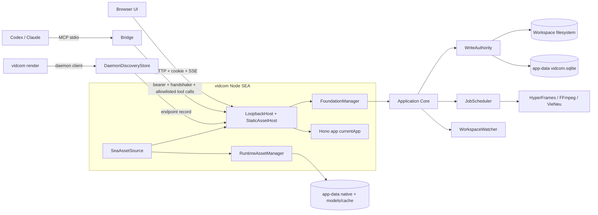
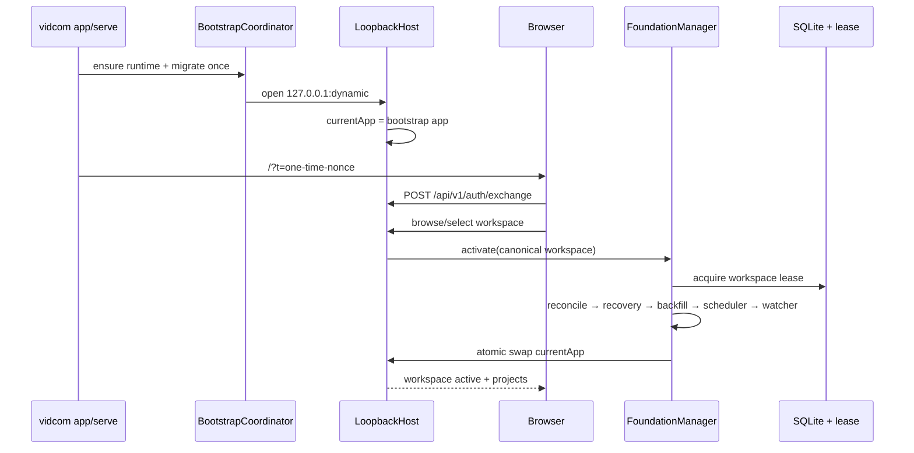
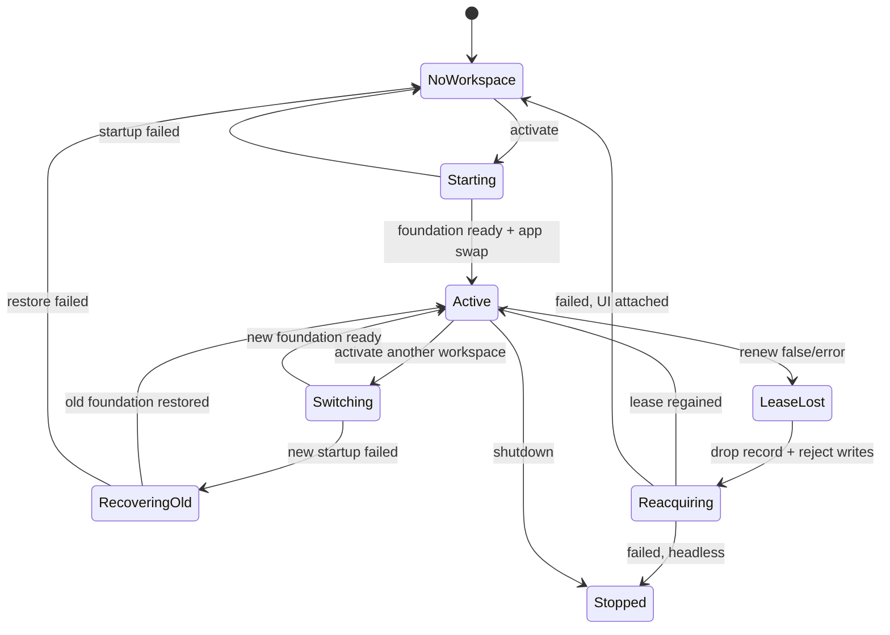
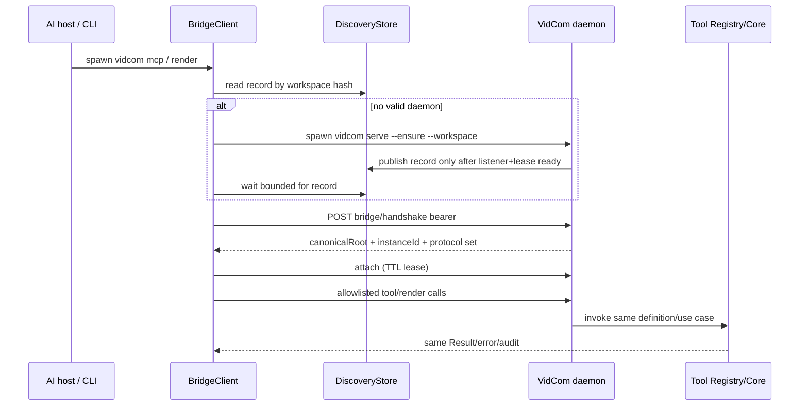
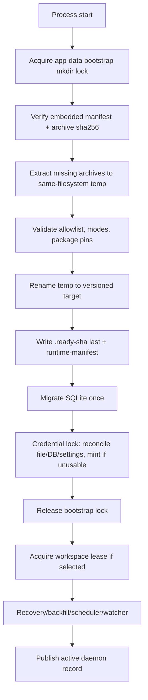
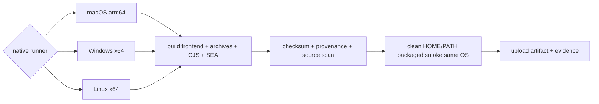
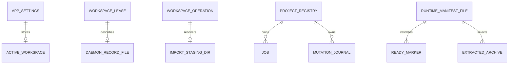
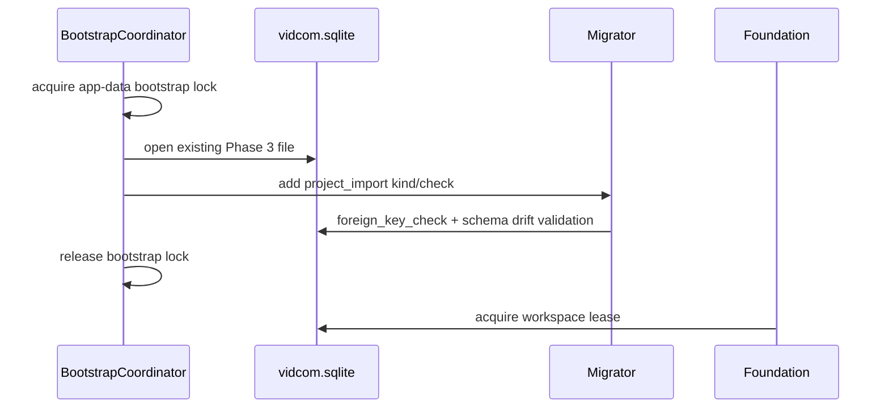

# Spec Packaging & Distribution Runtime — Detailed Design

> **Reference**: [Detailed Goals](./spec-packaging-and-distribution-detailed-goal.md) — **Approved 2026-08-07**
> **Main spec**: [Packaging & Distribution Runtime](./spec-packaging-and-distribution-pending.md)
> **Next**: Implementation Checklist — **được phép tạo** (gate §15 đã mở)
>
> **Trạng thái**: **APPROVED** ngày 2026-08-07 bởi alvin0 — xem [§15 Approval Gate](#15-approval-gate). Phase tiếp theo là Implementation Checklist; **production code vẫn bị chặn** cho tới khi checklist đó được duyệt riêng.

## 1. Overview

Giai đoạn 4 thay host chạy từ checkout bằng một Node SEA native cho từng nền tảng, nhưng giữ nguyên Hono Application Core, WriteAuthority, job scheduler và MCP Tool Registry đã chạy ở Giai đoạn 1–3. Binary nhúng frontend static export và các archive runtime có manifest/checksum; lần chạy đầu giải nén runtime bắt buộc vào app-data dưới một bootstrap lock. Một daemon giữ lease là execution authority duy nhất: UI gọi HTTP, MCP stdio dùng bridge có xác thực, và `vidcom render` là thin client của cùng daemon.

Design chia startup thành hai tầng: **host không-workspace** mở listener/auth/system UI trước, sau đó **FoundationManager** dựng hoặc thay foundation theo workspace mà không đổi port/session. Packaged smoke được build và chạy native trên macOS arm64, Windows x64 và Linux x64; Windows là release gate. Linux chỉ được defer qua một scope change mới và khi đó release MUST hạ tuyên bố hỗ trợ xuống macOS + Windows.

### 1.1 Links to Requirements

| Requirement | Design element |
|---|---|
| R1.1–R1.19 | Sec 4.3, 5.2–5.4, 7.1–7.7 — browser filesystem cô lập, mutable foundation, UI picker/New video |
| R2.1–R2.15 | Sec 4.4, 5.5–5.7, 6.2, 7.8–7.11 — discovery record, bearer handshake, remote Tool Registry, attachment lease |
| R3.1–R3.13 | Sec 5.8–5.9, 7.12–7.14, 8.1 — CLI mode và doctor |
| R4.1–R4.14 | Sec 4.2, 5.10–5.12, 10.4 — CJS SEA, frontend pack, static shell, http-driver |
| R5.1–R5.14 | Sec 4.5, 5.13–5.15, 6.3–6.4, 10.5 — runtime manifest, extraction, bootstrap ordering |
| R6.1–R6.11 | Sec 4.6, 5.16–5.18, 10.6 — HyperFrames shim, compiler env, TTS/Chromium |
| R7.1–R7.12 | Sec 4.7, 5.19, 6.5, 7.15 — import staging + recovery |
| R8.1–R8.8 | Sec 4.8, 9.1, 11.4 — packaged smoke native theo OS |
| R9.1–R9.7 | Sec 5.20, 9.2–9.4, 10.7 — checksum, source scan, provenance, telemetry |

## 2. Design Scope

### 2.1 In Scope

- Một build pipeline native sinh `vidcom`/`vidcom.exe`, SHA256SUMS và provenance manifest cho đúng OS/arch của runner.
- SEA host Hono trên loopback, frontend static export phục vụ từ asset trong binary, không ghi thư mục `out/` cạnh executable.
- Boot không-workspace, picker qua UI, tạo thư mục, activate/switch workspace trên cùng listener/session.
- Nút New video nối vào create-project use case có sẵn với bundled preset, không có capability editing mới.
- Daemon discovery, bearer credential, handshake, MCP stdio bridge, auto-start race và attachment lifecycle.
- CLI `app`, `serve`, `mcp`, `render`, `doctor`, `version` cộng các lệnh quản trị đã có; không có public `worker` mode.
- Archive runtime theo platform, extraction nguyên tử, manifest/checksum, repair qua doctor.
- HyperFrames CLI shim, esbuild native, FFmpeg/FFprobe, frozen CPython + VieNeu, motion library và Chrome cache.
- Import project ngoài workspace bằng staging/copy/rename có recovery.
- Packaged smoke trên macOS arm64, Windows x64, Linux x64 với PATH/HOME cô lập.

### 2.2 Out of Scope

- Matrix 3 OS × 2 kiến trúc, installer `.dmg`/`.msi`, signing certificate/notarization thật — Giai đoạn 6.
- Tauri/native picker, auto-update, telemetry sản phẩm, crash reporting, license/activation.
- Public `vidcom worker`, worker process tách riêng, nhiều workspace active trong cùng daemon.
- CRUD file/folder, asset upload mới, agent generation trong app, PTY/diff preview.
- Air-gapped first-run cho Chromium/weights; chỉ kiểm warm/offline sau khi cache đã có.
- Sửa version skew HyperFrames; giai đoạn này chỉ cảnh báo.

## 3. Research Summary

### 3.1 Node SEA assets và main format

- **Context**: binary phải chạy không có Node/node_modules và chứa frontend/runtime archives.
- **Key insight**: Node SEA cung cấp `node:sea.getAsset/getRawAsset`, nhưng injected `require()` không resolve package filesystem; ứng dụng phải bundle thành một main script. Node 24 cũng yêu cầu blob được tạo bằng cùng Node binary được inject. Cross-platform code cache/snapshot không portable.
- **Sources**: [Node 24 SEA documentation](https://nodejs.org/download/release/v24.18.0/docs/api/single-executable-applications.html), [`spikes/phase-0`](../../../../spikes/phase-0/README.md), [`spikes/phase-4` S1/S2](../../../../spikes/phase-4/README.md).
- **Impact**: DR-1/DR-2; main bundle CJS, `useCodeCache=false`, `useSnapshot=false`, build native trên runner đích, asset lớn lấy qua `getRawAsset`.

### 3.2 Next static export và dynamic project route

- **Context**: project slug chỉ tồn tại sau khi binary đã build.
- **Key insight**: `output: "export"` sinh file tĩnh; dynamic route cần `generateStaticParams`. Spike S2 chứng minh một sentinel `__shell` dùng được nếu host map cả HTML và payload RSC `.txt`, còn client đọc slug thật từ `location`.
- **Sources**: [Next static export](https://nextjs.org/docs/pages/guides/static-exports), [generateStaticParams](https://nextjs.org/docs/app/api-reference/functions/generate-static-params), [`spikes/phase-4/s2-export`](../../../../spikes/phase-4/s2-export).
- **Impact**: DR-3; server shell/client child, frontend pack và resolver route tường minh.

### 3.3 Hono Node listener

- **Context**: host SEA phải phục vụ Hono, SSE/upload và đóng listener sạch.
- **Key insight**: `@hono/node-server` chạy `app.fetch`, trả Node server handle và hỗ trợ graceful close; `serveStatic` mặc định dựa vào cwd nên không phù hợp asset trong SEA.
- **Source**: [Hono Node.js adapter](https://hono.dev/docs/getting-started/nodejs), S2 host spike.
- **Impact**: DR-4; host dispatch `/api/**` vào mutable Hono app, asset khác qua `SeaStaticAssetHost`, không dùng filesystem `serveStatic`.

### 3.4 Runtime/toolchain spike

- **Context**: `process.execPath` trong SEA là VidCom, esbuild có thể treo, TTS không có Python hệ thống.
- **Key insight**: HyperFrames CLI chạy qua `--vidcom-node` shim; in-process bundle PASS nếu đặt `ESBUILD_BINARY_PATH` và `ESBUILD_WORKER_THREADS=0`; frozen CPython + VieNeu đã prune sinh WAV; supervisor kill-tree không phụ thuộc execPath.
- **Source**: [`spikes/phase-4/README.md`](../../../../spikes/phase-4/README.md) S1a/S1b/S3/S4.
- **Impact**: DR-8/DR-9; extracted CLI nhưng Node host là chính SEA, compiler có timeout bắt buộc, Python nằm trong runtime archive.

### 3.5 Platform evidence boundary

- **Context**: Goals target ba OS nhưng spike Phase 4 mới có darwin arm64.
- **Key insight**: CI hiện kiểm source trên ba OS, không kiểm artifact; native archive và runner phải cùng OS/arch. GitHub runner có image theo OS/arch nhưng mỗi artifact vẫn cần job riêng.
- **Sources**: [GitHub runner reference](https://docs.github.com/en/actions/reference/runners/larger-runners), [`.github/workflows/ci.yml`](../../../../.github/workflows/ci.yml), spike Phase 4.
- **Impact**: DR-11; không cross-build artifact release trong Giai đoạn 4, không suy kết quả macOS sang Linux/Windows.

## 4. Architecture

### 4.1 System Overview

Binary có một process host và tối đa một active foundation. Host sở hữu listener, bootstrap nonce/session, static frontend, system routes và `FoundationManager`. Foundation sở hữu workspace-specific SQLite adapters, lease, WriteAuthority, scheduler, watcher và Hono routes. Việc đổi workspace thay foundation object dưới một mutex; listener và session stores không đổi.

MCP stdio bridge không dựng foundation. Nó đọc discovery record + bearer trong app-data, handshake đúng workspace/instance, dựng MCP server từ **cùng ToolDefinition registry** nhưng dùng `RemoteToolInvoker`; daemon mới chạy use case/audit. CLI render dùng cùng `DaemonClient`, enqueue job rồi wait hoặc detach theo contract ở Sec 7.13.

### 4.2 Component Diagram



### 4.3 Boot, select và switch workspace



Switch workspace là state transition có rollback, không phải route mutation:



Luật switch:

1. `FoundationManager` serialize activate/switch bằng một mutex.
2. Validate/canonicalize target trước khi đụng foundation cũ.
3. Nếu có job non-terminal ở workspace cũ, trả `workspace_busy` và không đổi; Giai đoạn 4 không mặc định huỷ job.
4. Đưa host vào `switching`: system/auth routes còn dùng được; project mutation trả `503 workspace_switching`.
5. Stop scheduler/watcher, xoá discovery record cũ, release lease, đóng DB cũ.
6. Dựng foundation mới tới trạng thái ready rồi swap `currentApp` một lần.
7. Nếu bước 6 fail, thử dựng lại workspace cũ. Nếu rollback cũng fail, về `NoWorkspace`; listener/session vẫn sống để UI sửa.
8. Chỉ sau swap thành công mới ghi `active_workspace` và phát `workspace.changed`.

**Mất lease — ba lối, và lối nào áp cho ai.** R2.14 được **sửa ngày 2026-08-07** (người dùng duyệt) để có lối thứ ba; Design dùng cả ba:

1. `renew` fail ⇒ vào `Reacquiring`, **không** đóng gì ngay. Mọi đường ghi trả `workspace_lease_lost` từ giây đầu (WriteAuthority đã kiểm lease hai đầu mutex — §5.3), scheduler/watcher dừng, discovery record bị xoá **ngay** để không client mới nào nối vào.
2. Thử lấy lại lease **tối đa 2 lần trong một cửa sổ bằng TTL của lease (30 s)**. Nguyên nhân thường gặp nhất là máy vừa ngủ dậy hoặc SQLite bận nhất thời, và trong hai trường hợp đó lease chưa bị ai cướp.
3. Lấy lại được ⇒ về `Active`, publish lại discovery record với **`instanceId` cũ** (vẫn là tiến trình đó), phát `workspace.reattached`.
4. Không lấy lại được thì **rẽ theo việc có UI hay không**:
   - **Có UI attach** (`vidcom app`, hoặc bất kỳ daemon nào từng nhận attachment `kind: "ui"` — cùng cờ với luật `autoStarted` ở §4.4) ⇒ `NoWorkspace`. Foundation bị `stop()` hẳn, `currentApp` quay lại **bootstrap app**, listener và session sống tiếp. UI nhận `workspace.lease_lost` rồi vào màn chọn workspace với lý do hiển thị được.
   - **Headless** (`serve`, `serve --ensure`, không có UI attachment) ⇒ `Stopped`: đóng listener, thoát khác 0. Không có ai đọc màn hình, và một listener không workspace chỉ là xác chết cho bridge/render vấp phải.
5. Ở cả hai nhánh, host SHALL phát `workspace.lease_lost` **trước** khi đổi trạng thái, để UI đang mở không thấy kết nối chết không lý do.

**Vì sao `NoWorkspace` không tái sinh đúng cái bug R2.14 sinh ra để giết.** Bug đó là *listener mở* **và** *foundation còn sống* **và** *bridge vẫn ghi được* ([`next-host.ts:117`](../../../../packages/cli/src/next-host.ts#L117)). Lối `NoWorkspace` gỡ hai vế sau, bằng ba cơ chế đã có sẵn trong Design chứ không phải cơ chế mới:

| Vế của bug | Vì sao không còn |
|---|---|
| Foundation còn sống | `FoundationManager.stop()` chạy hẳn: không WriteAuthority, không scheduler, không watcher, không handle DB của workspace đó |
| Bridge tìm thấy daemon | Discovery record đã bị xoá **từ bước 1**, trước cả khi re-acquire bắt đầu |
| Bridge gọi được tool | Bootstrap app **không đăng ký** `/api/bridge/**`; nó chỉ có `/v1/auth/*`, `/v1/system/*`, `/v1/health` (§4.5). Route không tồn tại, không phải route trả lỗi |

Đây là **nghĩa vụ chứng minh bằng test**, không phải bằng lập luận — xem §11.3.

### 4.4 Daemon discovery, bridge và render CLI



Discovery record không chứa secret và không phải authority:

```json
{
  "schemaVersion": 1,
  "workspaceRoot": "/canonical/workspace",
  "workspaceHash": "sha256:...",
  "instanceId": "daemon_...",
  "pid": 1234,
  "host": "127.0.0.1",
  "port": 43127,
  "startedAt": "2026-08-07T00:00:00.000Z"
}
```

- Path: `<app-data>/daemon/<workspaceHash>.json`, atomic rename, `0600`/current-user ACL.
- Clear bearer giữ riêng ở `<app-data>/credentials`; SQLite chỉ giữ hash/lifecycle như hiện tại.
- Record chỉ được publish sau runtime/migration/lease/listener/handshake route ready; xoá trước khi release lease.
- Handshake MUST so canonical root và instance id từ record. PID/port sống không đủ.
- Attachment là lease trong memory của daemon `{attachmentId, kind: bridge|ui|render, expiresAt}`. Client heartbeat; mất heartbeat tự trừ. Đây là refcount daemon-owned, không nằm trong bridge. **Attachment chỉ đo client còn sống**, không đo công việc còn chạy.
- **Work hold tách khỏi attachment.** Daemon giữ thêm một `activeWorkHold` suy **trực tiếp từ job store**: có job non-terminal thuộc workspace này ⇒ hold còn. Nó **không** phải attachment, không cần heartbeat, và không biến mất khi client thoát.
  Đây là chỗ bản trước tự mâu thuẫn: `--detach` cho CLI thoát ngay (§7.13), mà attachment lại hết hạn khi mất heartbeat — nên nếu chỉ đếm attachment thì daemon tự tắt **giữa lúc render**. Suy hold từ job store là cách duy nhất đúng mà không bắt một tiến trình đã thoát phải tiếp tục heartbeat.
- **Điều kiện auto-shutdown = cả hai đều rỗng**: không còn attachment nào **và** `activeWorkHold` rỗng **và** daemon thuộc loại auto-start **và** đã qua grace period. UI attach luôn thắng auto-shutdown.

**Vòng đời bearer — ai mint, lúc nào, hỏng thì sao.** Kịch bản của R2.4 là máy sạch, daemon chưa từng chạy, AI host spawn `vidcom mcp` **trước tiên** — nên "bearer nằm ở app-data" chưa đủ để implement:

1. **Mint trong `BootstrapCoordinator.prepare()`**, sau migration và **trước** khi lấy lease. Nó dùng đúng credential service đang có (SQLite giữ hash + lifecycle), thêm một credential `kind: "bridge"` do hệ thống phát hành.
   **Chỗ ghi đã tồn tại — MUST dùng lại, MUST NOT tạo đường mới.** [`BridgeCredentialStore`](../../../../packages/adapter/src/fs/credential-store.ts#L86) của Phase 3 ghi clear token vào **`<app-data>/credentials`** (một *file*, không phải thư mục), bằng temp + `secureCredentialFile` + `writeFile` + `fsync` + `rename` — tức là ACL được siết **trước** khi có byte credential nào quan sát được, và trên Windows nó dùng `icacls /inheritance:r /grant:r <SID>:(R,W)` với SID của chính user ([`credential-store.ts:21-45`](../../../../packages/adapter/src/fs/credential-store.ts#L21)). Doc comment của class ghi thẳng "Stores the **future** MCP bridge credential" — nó được viết sẵn cho đúng giai đoạn này.
   Đường dẫn đó cũng là thứ [steering 09 §2](../../../steering/09-security.md) khoá: *"Token IPC cho MCP bridge lưu tại `<app-data>/credentials`, quyền `0600`"*. Một bản nháp trước của mục này viết `<app-data>/credentials/bridge.json`; nó vừa nghịch steering vừa nghịch code — `credentials` không thể vừa là file vừa là thư mục. Việc thật của Giai đoạn 4 ở đây là **nối dây và định nghĩa vòng đời**, không phải viết store mới.
2. **Bearer thuộc về app-data, không thuộc về process.** Đã có credential `bridge` hợp lệ thì boot sau dùng lại; daemon restart **không** làm bridge đang chạy mất quyền.
3. **Thứ tự bắt buộc**: mint/load bearer → lease → listener → **publish discovery record**. Record chỉ xuất hiện khi bearer đã sẵn sàng, nên client thấy record là chắc chắn đọc được credential — không có cửa sổ đọc hụt.
4. **Client đọc theo thứ tự ngược lại**: record trước, credential sau. Thiếu credential ⇒ `bridge_credential_unavailable` kèm hướng dẫn chạy `vidcom doctor --repair`; MUST NOT tự mint (bridge không phải authority, và mint từ hai phía sinh hai token).
5. **Handshake trả 401**: client đọc lại credential file **đúng một lần** (bắt trường hợp vừa xoay giữa chừng) rồi thử lại; vẫn 401 ⇒ `bridge_credential_invalid`, dừng. MUST NOT retry vòng lặp — 401 lặp lại nghĩa là app-data đã lệch, không phải nghẽn tạm thời.

**Xoay bearer — bốn thứ phải chốt, vì cơ chế đang có không tự trả lời được.** `McpCredentialService.rotate(id, overlapMs)` nhận **id** ([`mcp-credential-service.ts:78`](../../../../packages/core/src/service/mcp-credential-service.ts#L78)), trong khi `BridgeCredentialStore` chỉ lưu **token trần** — không id — và cột `label` **không unique**. Nên "xoay credential của bridge" hôm nay không có cách nào chỉ ra *xoay cái nào*. Bốn quyết định:

| # | Câu hỏi | Chốt |
|---|---|---|
| 1 | Nhận diện credential hệ thống bằng gì | **`app_settings.bridge_credential_id`** — bảng đã có, không thêm bảng (DR-10), không cần unique index trên `label`. Label `system:bridge` chỉ để `credential list` đọc được, **không** phải danh tính |
| 2 | Overlap có bằng 0 không | **Không — 60 s** |
| 3 | Thứ tự cập nhật | DB rotate → **ghi file atomic** → cập nhật `app_settings` → revoke attachment |
| 4 | Revoke attachment lúc nào | Bước cuối, **và** attach/renew kiểm `credentialId === app_settings.bridge_credential_id` |

**Vì sao overlap không bằng 0.** Với overlap 0, transaction rotate làm token cũ hết hiệu lực **ngay khi commit**, nhưng file vẫn đang giữ token cũ cho tới khi `rename` xong. Trong cửa sổ đó mọi bridge nhận 401, dùng hết **một lần đọc lại** được phép của luật 5, đọc trúng token cũ, rồi chết bằng `bridge_credential_invalid`. Cửa sổ tính bằng mili-giây nhưng hậu quả là hỏng thật. 60 s đủ để nuốt trọn bước ghi file và một nhịp heartbeat, đủ ngắn để một token nghi lộ không sống lâu. Overlap mặc định 5 phút của `DEFAULT_MCP_RUNTIME_CONFIG` giữ nguyên cho credential do người dùng phát hành; chỉ credential bridge dùng 60 s.

**Răng của "xoay thì attachment chết" nằm ở bước 4, không nằm ở overlap.** Trong 60 s đó token cũ vẫn **xác thực** được — đó là chủ đích, để lời gọi đang bay không đứt. Nhưng attach/renew SHALL so credential id vừa verify với `app_settings.bridge_credential_id`; lệch ⇒ `bridge_credential_invalid`. Nên token cũ **không giữ được và không tạo được** attachment, buộc client đọc lại file. Hai mục tiêu — không làm đứt việc đang chạy, và xoay là mất quyền — đạt cùng lúc mà không cần overlap 0.

**Hai đường cụt phải chặn tường minh:**

- **`vidcom credential revoke <id-của-bridge>` SHALL bị từ chối**, kèm hướng dẫn dùng `rotate --bridge`. Lý do: clear token **chỉ tồn tại trong file** (DB giữ hash), nên revoke để lại một hệ thống không có credential bridge nào hợp lệ **và không có lệnh nào mint lại** — MCP chết mà không có đường về.
- **`doctor --repair` khi file mất SHALL *xoay*, không phải "khôi phục".** Cũng vì DB chỉ có hash: token cũ không dựng lại được từ đâu cả. Repair mint credential mới, ghi file, cập nhật `app_settings`, và báo rõ là bearer đã đổi để người dùng biết các bridge đang chạy phải nối lại.

**CLI**: thêm `vidcom credential rotate --bridge` như đường tắt — nó tra id từ `app_settings` rồi gọi đúng `rotate(id, 60_000)`. Không thêm hình dạng lệnh mới ngoài cờ đó; parser hôm nay vốn đã từ chối `--overlap-ms <= 0` ([`credential.ts:48`](../../../../packages/cli/src/commands/credential.ts#L48)), nhất quán với quyết định 2. Nếu `app_settings.bridge_credential_id` trống (app-data mới), bootstrap `issue("system:bridge")` rồi ghi id — đó là đường mint lần đầu ở luật 1.

#### Xoay bearer phải crash-safe — bốn bước, ba nguồn, và một bất biến

Ba bước ghi (DB → file → `app_settings`) chạm **ba nguồn không nằm trong cùng một transaction**. Chết giữa chừng thì ba nguồn trỏ ba trạng thái khác nhau, và một trong số đó **làm hỏng MCP vĩnh viễn**: nếu chết sau khi DB commit mà chưa ghi file, clear token của credential thay thế chỉ tồn tại trong bộ nhớ tiến trình vừa chết — DB chỉ giữ hash — nên nó **không bao giờ dùng được**, còn token cũ hết hạn sau 60 s. Không có bước đọc lại thì app-data đó chết hẳn đường bridge.

**Bất biến làm gốc cho mọi recovery**: *token trong file là **secret duy nhất tồn tại**; DB và `app_settings` là **projection** phải được hoà lại theo nó.* Từ đó ra một luật một chiều, dễ phát biểu và dễ test: **file thắng khi token của nó còn dùng được; không dùng được thì mint mới.** MUST NOT có đường hoà ngược lại — DB không thể dựng lại một secret nó chưa từng giữ.

**Khoá.** Mọi đường chạm credential bridge — reconciliation lúc bootstrap, `rotate --bridge`, nhánh credential của `doctor --repair`, và mint lần đầu — SHALL chạy dưới **một khoá duy nhất `<app-data>/credential.lock`**, dùng đúng cơ chế atomic-mkdir + stale probe của §5.15. Không dùng chung `runtime-bootstrap.lock`: giữ khoá bootstrap suốt một lần xoay sẽ chặn cold start của một tiến trình không liên quan. **Thứ tự lấy khoá luôn là `bootstrap → credential`, không bao giờ ngược lại** — bootstrap giữ khoá của nó rồi mới lấy khoá credential, còn `rotate` chỉ lấy khoá credential, nên không có chu trình. Chờ có giới hạn; hết hạn ⇒ `bridge_rotation_in_progress`.

Khoá này là thứ chặn hai `rotate --bridge` song song. Nếu chỉ dựa vào DB thì kẻ thua đã bị `UPDATE … WHERE status = 'active'` loại ([`mcp-credential.ts:75-79`](../../../../packages/adapter/src/db/mcp-credential.ts#L75)) — nhưng nó **không** chặn được reconciliation lúc bootstrap chạy đè lên một lần xoay đang dở, và đó mới là race nguy hiểm.

**Reconciliation lúc bootstrap** — chạy sau migration, trước khi lấy lease, dưới khoá credential. Gọi `F` = token trong file, `S` = `app_settings.bridge_credential_id`:

| Trạng thái đọc được | Nghĩa là | Xử lý |
|---|---|---|
| `hash(F)` khớp một row **`active`** có `id == S` | nhất quán | không làm gì |
| `hash(F)` khớp một row **`active`** có `id != S` | chết **sau khi ghi file, trước khi cập nhật settings** | **roll forward**: đặt `S` = id đó |
| `hash(F)` khớp một row **`rotating` còn hạn**, và có row `active` với `rotated_from` = id đó | chết **sau DB commit, trước khi ghi file** — replacement mồ côi, secret đã mất | revoke replacement mồ côi, rồi **xoay lại** từ credential trong file theo đúng bốn bước |
| `hash(F)` khớp một row `rotating` **đã hết hạn**, hoặc không khớp row nào, hoặc **file không tồn tại** | quá 60 s mới khởi động lại, hoặc file bị xoá | **mint mới** (`issue("system:bridge")`), ghi file, đặt `S`; ghi log và `doctor` báo bearer đã đổi |

`rotated_from` là thứ nhận diện replacement mồ côi — nó đã có sẵn trong schema và được `rotate` ghi ([`mcp-credential-service.ts:99`](../../../../packages/core/src/service/mcp-credential-service.ts#L99)), nên không cần cột mới. Sau khi hoà xong, mọi row `active` mang label `system:bridge` mà **không** phải `S` SHALL bị revoke — nếu không, mỗi lần crash để lại một credential `active` vĩnh viễn không ai dùng được, và `credential list` dần thành rác.

**Chết sau bước 3 (cập nhật settings), trước bước 4 (revoke attachment)** không cần recovery: attachment cũ sẽ trượt ở lần `renew` kế tiếp vì luật so `credentialId` với `S`. Nó tự lành.

**Bốn con số và một luật sở hữu — không để implementation tự chọn.** Bản trước viện dẫn "grace period" và "manual owner" ba lần mà không định nghĩa cái nào, nên §11.3 có test cho một thuộc tính chưa tồn tại:

| Tham số | Giá trị | Vì sao |
|---|---:|---|
| Heartbeat của client | **5 s** | đủ thưa để không ồn, đủ dày để 20 s TTL cho 4 nhịp lỡ |
| Attachment TTL | **20 s** | mất 4 nhịp mới coi là chết; ngắn hơn thì mạng chậm làm rụng attachment sống |
| Deadline discovery/handshake/attach | **5 s** | giữ nguyên §9.1 |
| Grace period trước auto-shutdown | **60 s** | AI host đóng rồi mở lại phiên mới trong vài giây là chuyện thường; tắt ngay là bắt trả giá cold start vô ích |

**Luật sở hữu (`autoStarted`)** — daemon tự quyết, không đọc từ file nào:

- Daemon khởi động bằng `serve --ensure` (đường của `DaemonClient.ensure`) có `autoStarted = true`. Chỉ loại này mới đủ điều kiện auto-shutdown.
- `vidcom app` và `vidcom serve` chạy tay có `autoStarted = false` **vĩnh viễn** — người dùng bật thì người dùng tắt.
- Daemon `autoStarted = true` mà **từng** nhận một attachment `kind: "ui"` thì chuyển sang `false` và không quay lại. Đây là cách "UI attach luôn thắng auto-shutdown" được cưỡng chế: nếu chỉ kiểm attachment tại thời điểm hết grace, một lần refresh trang cũng đủ giết daemon giữa hai attachment.
- Thuộc tính này là state trong memory của daemon và **MUST NOT** vào discovery record — record không phải authority (§6.2), và client không cần biết.

### 4.5 Runtime extraction và cold-start ordering



**Hai flow startup, không phải một.** R5.13 khoá thứ tự `extract → migrate → lease → listener`; nhưng OQ-10 lại cần listener mở **trước** khi có workspace. Hai thứ đó không mâu thuẫn vì chúng là hai đường khác nhau — và Design phải nói rõ đường nào là đường nào:

| | `vidcom app` / `serve` **chưa có workspace** | `serve --workspace` / daemon auto-start |
|---|---|---|
| Thứ tự | extract → migrate → **listener (bootstrap app)** → *chờ người dùng chọn* → lease → foundation → swap | extract → migrate → **lease** → foundation → listener → publish discovery |
| Listener phục vụ gì trước lease | **chỉ** `/v1/auth/*`, `/v1/system/*`, `/v1/health` | không mở listener trước lease |
| Discovery record | **không publish** khi chưa có foundation | publish **sau** khi lease + handshake route ready |
| Vì sao | không có workspace thì không có lease để lấy; UI cần một cổng để chọn | client (bridge/render) chỉ được thấy daemon khi nó đã là execution authority |

Luật chung cho cả hai: **`extract → migrate` luôn đứng trước mọi thứ khác**, và **discovery record chỉ tồn tại khi daemon đã giữ lease**. Một listener chưa có foundation là hợp lệ cho UI nhưng **MUST NOT** xuất hiện với bridge/render — đó là lý do §7.11 tách `/api/v1/health` khỏi `/api/bridge/v1/ready`.

`BootstrapCoordinator` dùng atomic `mkdir(<app-data>/runtime-bootstrap.lock)` thay vì dựa vào SQLite chưa chắc đã migrate. Owner record chứa pid + process-start fingerprint + timestamp; stale lock chỉ reclaim sau bounded probe. Tất cả extraction và migration của một app-data được serialize. Migration được gọi đúng một lần trong một process boot.

Archive format là deterministic `.tar.gz`; package `tar@7.5.22` đã có trong lockfile được nâng thành dependency trực tiếp của package runtime. Extractor từ chối absolute path, `..`, symlink/hardlink và special file; chỉ regular file/directory trong manifest allowlist. Executable mode được manifest khai báo và áp lại sau extraction; Windows dùng ACL thay POSIX mode.

### 4.6 Render/TTS toolchain từ artifact

```mermaid
flowchart LR
    Job[Render job in daemon] --> Probe[Binary + compiler preflight]
    Probe --> Shim[spawn process.execPath --vidcom-node extracted hyperframes.mjs]
    Shim --> HF[HyperFrames CLI]
    HF --> Chrome[Chrome Headless Shell cache]
    HF --> FF[FFmpeg/FFprobe extracted]
    Job --> InProc[@hyperframes imports bundled in SEA]
    InProc --> Esbuild[ESBUILD_BINARY_PATH + WORKER_THREADS=0]
    TTS[TTS job] --> Py[Frozen CPython + VieNeu worker]
    Py --> Model[HF_HOME model cache]
```

- Hidden `--vidcom-node <script> ...` được dispatch trước public CLI parser, chỉnh `process.argv` rồi dynamic-import **chỉ** script nằm dưới verified `native/hyperframes` root.
- `NodeRenderBinaryProbe` trả command `[process.execPath, "--vidcom-node", cliPath]`, không còn `[process.execPath, cliPath]`.
- Mọi in-process compiler call chạy qua `CompilerGuard` đặt hai env bắt buộc và timeout. `doctor` chạy transform nhỏ qua đúng guard.
- VieNeu command trỏ frozen interpreter tuyệt đối + bundled worker; `HF_HOME` trỏ app-data models; warm offline đặt `HF_HUB_OFFLINE=1`.
- **`PYTHONUTF8=1` và `PYTHONIOENCODING=utf-8` là bắt buộc và phải được *ép*, không phải *mặc định*.** Đo trên Windows ([S9/N-2](../../../../spikes/phase-4/s9-windows-runtime/README.md)): interpreter đóng băng lấy encoding của `stdout` từ **codepage ANSI của hệ thống** — trên máy đo là `cp932` — nên `print()` một ký tự tiếng Việt raise `UnicodeEncodeError` ngay. `locale.getpreferredencoding()` cũng là `cp932`, nghĩa là mọi `open()` không khai `encoding` đọc sai. Với một sản phẩm mà nội dung chính là **tiếng Việt**, đây là hỏng ở đường chính, không phải trường hợp biên; và nó nổ trên mọi máy Windows có locale không UTF-8, không riêng CJK.
  Phase 3 đã chống đúng chỗ — `allowlistedEnvironment` ([`process-environment.ts:19-20`](../../../../packages/adapter/src/runtime/process-environment.ts#L19)) đặt cả hai biến, và `worker.py` khai `encoding="utf-8"` tường minh khi đọc/ghi file. Rủi ro của Giai đoạn 4 là **làm rơi nó trong lúc nối dây lại**: lệnh sidecar đổi từ `python3 worker.py` sang `<frozen>/python.exe worker.py` và đồng thời phải thêm `HF_HOME`, `HF_HUB_OFFLINE`, `SSL_CERT_FILE`… nên rất dễ tự dựng env mới thay vì đi qua helper. Vì vậy: **mọi** child process của Giai đoạn 4 — sidecar VieNeu, shim `--vidcom-node`, FFmpeg, Chromium — SHALL đi qua `allowlistedEnvironment`, và hai biến trên SHALL được **ghi đè vô điều kiện** thay vì `??=`, để một `PYTHONIOENCODING` lạ thừa kế từ shell cha không phá được narration.
- Chrome dùng cache path được quản lý/tường minh, không nhận Chrome hệ thống làm bằng chứng packaged smoke.
- **Shim chèn thêm một tầng tiến trình, nên hai luật của [steering 08 §6.1](../../../steering/08-jobs-and-queue.md) càng phải giữ nguyên**: survivor MUST NOT được suy từ quan hệ cha-con (con bị reparent khi cha chết) và MUST NOT được suy từ thành viên process group (`chrome-headless-shell` **đo được** là tự tách sang group riêng). Cơ chế hiện có ghi group + PID rồi verify nên nó không gãy vì thêm tầng — nhưng **containment vẫn là tầng phòng thủ bắt buộc thứ hai**, không phải dư thừa: mọi job spawn process con chạy trong workdir do hệ thống sở hữu, có marker, để recovery thu hồi thứ lọt qua lỗ đã biết của proof.

### 4.7 Import project

```mermaid
sequenceDiagram
    participant UI
    participant API
    participant Import as ProjectImportService
    participant Journal as workspace_operation
    participant FS as Real filesystem

    UI->>API: source token + target name
    API->>Import: plan/import actor=user
    Import->>FS: canonicalize source/target; reject overlap/symlink/special
    Import->>Journal: begin project_import + staging path
    Import->>FS: copy to temp sibling inside workspace filesystem
    Import->>FS: validate/backfill in staging
    Import->>FS: rename staging → final target (no overwrite)
    Import->>Journal: commit + project/workspace event
    Import-->>API: job terminal {projectId, slug}
```

Contract là **bất đồng bộ**: `POST /api/v1/projects/imports` trả **202 `{jobId}`** ngay (§7.15); `{projectId, slug}` chỉ xuất hiện ở **job result** khi job terminal, UI theo dõi qua job/event như mọi job khác. Sequence ở trên là vòng đời *job*, không phải vòng đời *request*.

Staging là sibling ẩn cùng filesystem (`<workspace>/.<slug>.vidcom-import-<operation>.tmp`) để final rename atomic. Nó có marker operation id; startup recovery hoàn tất hoặc xoá theo `workspace_operation`, không quét/xoá thư mục không có marker. Source chỉ đọc, không follow symlink, không sửa metadata/file gốc.

### 4.8 Build and packaged-smoke flow



Không job nào dùng artifact build từ OS khác. `useCodeCache` và `useSnapshot` tắt. Job smoke khôi phục **download cache** Chrome/HF vào HOME sạch nhưng không mồi runtime extraction/app-data.

### 4.9 Integration Points

| System | Direction | Protocol | Purpose |
|---|---|---|---|
| Browser UI | both | HTTP cookie + SSE | picker, project UI, job/event |
| AI host | in/out | MCP stdio | protocol-facing adapter |
| MCP bridge → daemon | both | loopback HTTP bearer | handshake, attach, allowlisted tool invocation |
| HyperFrames CLI | out | supervised child process | browser ensure, snapshot/render |
| Chrome download origin | out | HyperFrames browser ensure | first-run Chrome cache |
| Hugging Face | out | VieNeu/huggingface_hub | first-run model weights |
| Real filesystem | both | Node fs adapters | workspace, import, app-data runtime |
| GitHub Actions | build/test | native runner jobs | artifact proof per OS |

### 4.10 Technology Stack

| Layer | Technology | Rationale |
|---|---|---|
| Runtime | Node 24.9.0 SEA + postject pinned | Phase 0/4 evidence; same toolchain as existing CI |
| HTTP | Hono + `@hono/node-server` | existing D4 boundary, graceful listener |
| UI build | Next 16 `output: "export"` | retain dev host/build tool; no Next in artifact runtime |
| FE API | `@alvin0/http-driver` fetch/SSE paths | one typed service catalog, runtime base URL, AbortController |
| DB | SQLite + Drizzle schema/migrator | existing app-data authority; no second DB |
| Archive | tar 7.5.22 + gzip | spike-proven, preserves modes, already locked |
| Process | existing NodeProcessSupervisor | measured kill-tree protocol |
| Tests | Vitest + real SQLite/fs + browser + artifact shell | match steering/testing and R8 |

## 5. Components and Interfaces

### 5.0 Component nằm ở package nào — và vì sao

[steering 02 §2](../../../steering/02-project-layout.md) **enforce import boundary bằng lint**, nên "component này thuộc package nào" không phải chi tiết triển khai: chọn sai thì build đỏ, và cách sửa sai lầm nhất là nới lint. Bảng này là một phần của Design.

| Component | Package | Vì sao ở đó |
|---|---|---|
| `BootstrapCoordinator`, `FoundationManager`, `LoopbackHost`, `SeaStaticAssetHost` | `cli` | Composition root. Chúng dựng infrastructure + application và sở hữu lock/listener cấp tiến trình — đúng việc của entrypoint, và `server` chỉ được export một Hono app |
| `SeaAssetSource`, `RuntimeAssetManager`, `CompilerGuard`, `BrowseTokenStore` | `adapter/runtime` (`CompilerGuard` → `adapter/hyperframes`) | Hiện thực port; chạm filesystem, process, env |
| `DaemonDiscoveryStore` | `adapter/fs` | File atomic + ACL, cùng họ với `credential-store.ts` |
| `DaemonClient` / `BridgeClient` | **`adapter/daemon`** (mới) | Client IPC dùng chung bởi **cả** `mcp` (bridge) và `cli` (`render`). Cả hai đều được phép import `adapter`; đặt ở đây là cách duy nhất tránh `mcp` phải nhìn thấy `server` |
| Route `/api/bridge/v1/*` | `server/routes` | Chúng là route Hono phía daemon |
| Remote `ToolInvoker` | `mcp` | Registry ở lại `mcp`; invoker gọi `adapter/daemon` |
| `FilesystemBrowserService` (chính sách), `ProjectImportService`, `DoctorService` (tổng hợp + phân loại + exit code) | `core` (`usecase`/`service`) + port | Đây là **quyết định nghiệp vụ**: luật token, giới hạn phân trang, canonicalize, phân loại bắt buộc/tuỳ chọn. Adapter dịch, không quyết ([steering 03 §2.4](../../../steering/03-architecture-ddd.md)) |
| Truy cập `node:fs` cho browse/import/doctor | `adapter/fs` | `core` **bị cấm** import `node:fs` trực tiếp |
| Mọi DTO/schema mới | `contracts` | Một shape một nguồn; HTTP và bridge cùng dùng |

**Ba hệ quả bắt buộc, không phải khuyến nghị:**

1. **`server` MUST NOT import `packages/mcp`.** §5.7 nói endpoint `/api/bridge/v1/tools/:name` validate bằng `ToolDefinition` — nhưng registry nằm ở `packages/mcp`, mà lint cấm `server` import `mcp`. Giải: **schema của tool nằm ở `contracts`** (đúng vai trò steering 02 §1 giao cho package đó: *"HTTP DTO, **MCP tool schema**, error code"*); route bên `server` validate bằng schema từ `contracts` và **thực thi qua một invoker do composition root inject**. Không có bước này, lần implement đầu tiên sẽ đâm lint và cách "sửa" tự nhiên nhất là nới boundary.
2. **`core` trả `Result<T, DomainError>`, không throw** ([steering 03 §2.2](../../../steering/03-architecture-ddd.md)). Chữ ký ở §5.2 và §5.9 viết tắt cho dễ đọc; phần nằm trong `core` SHALL trả `Result`. `ProjectImportService` (§5.19) đã đúng dạng; `FilesystemBrowserService` và `DoctorCheck` SHALL theo cùng dạng.
3. **`packages/worker` giữ nguyên, không đụng.** Nó tồn tại trong repo và steering 02 §1 còn liệt `worker` trong danh sách entrypoint của `cli`. Giai đoạn 4 **không** expose mode `worker` (OQ-9) nhưng cũng **không** xoá package — không tạo orphan, không sửa steering vì một thứ chỉ bị hoãn.

**Bốn câu hỏi dependency của [steering 01 §3](../../../steering/01-backend-stack.md)** phải trả lời được trước khi thêm bất kỳ dependency nào. Giai đoạn 4 thêm hai:

| | `tar@7.5.22` (nâng thành direct dependency) | `@hono/node-server` |
|---|---|---|
| Chạy trong binary đã compile? | **Có** — và đây là rủi ro D2 phải kiểm: pure JS, không native addon, không đọc `__dirname`. Packaged smoke là chỗ chứng minh | Có; pure JS, đã dùng trong spike S2/S7 |
| Kéo theo bản thứ hai của thứ đã có? | Không — đã nằm trong lockfile, chỉ nâng lên direct | Không; nó là Node adapter **của chính Hono**, không phải HTTP framework thứ hai (steering 01 §1 cấm cái sau) |
| Viết được bằng ~30 dòng? | Không — extraction an toàn (traversal, symlink, mode) là chỗ dễ sai kín | Không — graceful close + streaming request/response |
| Cần network lúc runtime? | Không | Không |

### 5.1 `BootstrapCoordinator`

- **Purpose**: serialize runtime extraction and migration before any foundation/lease.
- **Interface**:

```ts
interface BootstrapCoordinator {
  prepare(input: {
    appDataRoot: AbsolutePath;
    assetSource: RuntimeAssetSource;
    repair: boolean;
  }): Promise<PreparedRuntime>;
}

interface PreparedRuntime {
  manifest: InstalledRuntimeManifest;
  paths: RuntimePaths;
  database: VidcomDatabase;
  release(): Promise<void>;
}
```

- `prepare()` owns bootstrap lock; callers MUST NOT independently call migration/extraction.
- `repair=false` refuses broken checksum; `doctor --repair` uses `repair=true`.
- `prepare()` cũng chạy **bridge credential reconciliation** (§4.4) sau migration và trước khi trả về, dưới `<app-data>/credential.lock`. Đây là nơi duy nhất một lần xoay chết giữa chừng được phát hiện và hoà lại, nên nó MUST chạy ở **mọi** boot, không chỉ boot đầu — một app-data đi qua crash rồi khởi động lại bằng đường `serve --ensure` cũng phải được chữa.

### 5.2 `FilesystemBrowserService`

- **Purpose**: bounded, authenticated navigation without exposing file contents.
- **Interface**:

```ts
interface FilesystemBrowserService {
  roots(sessionId: string): Promise<BrowseRoot[]>;
  list(input: { sessionId: string; token: string; cursor?: string }): Promise<BrowsePage>;
  createDirectory(input: { sessionId: string; parentToken: string; name: string }): Promise<BrowseEntry>;
  resolveSelection(input: { sessionId: string; token: string }): Promise<AbsolutePath>;
}
```

- `BrowseTokenStore` là in-memory, TTL ngắn, bind session + canonical path + stat identity; response vẫn có display path.
- File operation chạy trong bounded worker (`node:worker_threads`) với concurrency 2. Timeout terminate worker; request không giữ threadpool daemon vô hạn. Packaged smoke kiểm worker trên cả ba OS.
- **Worker MUST được tạo ở dạng eval** — `new Worker(<source>, { eval: true })` — và **MUST NOT** trỏ tới một file path (`new Worker(new URL("./browse-worker.js", import.meta.url))`). Trong SEA không có file thật để worker load; đây đúng là cơ chế đã làm esbuild **treo vĩnh viễn** ở S1b, và chế độ hỏng là **treo im lặng**, không phải lỗi. Dạng thông thường nhất lại là dạng sai, nên đây là ràng buộc chứ không phải gợi ý.
- Đã kiểm trong SEA thật ([S8](../../../../spikes/phase-4/README.md)): worker eval + `readdirSync` qua `postMessage` **OK**, `terminate()` giữa vòng lặp vô hạn **OK**, `Atomics` + `SharedArrayBuffer` **OK**. Test bắt buộc: một test dựng worker **dạng file path** và chứng minh nó fail/timeout có mã, để dạng sai không lặng lẽ quay lại.
- Chỉ trả directory entry; file thường trả tên + `isDir=false`, không stat size/nội dung.

### 5.3 `FoundationManager`

```ts
interface FoundationManager {
  status(): FoundationStatus;
  activate(workspaceRoot: AbsolutePath): Promise<Result<ActiveFoundationInfo, DomainError>>;
  stop(reason: "shutdown" | "lease-lost"): Promise<void>;
  currentApp(): ReturnType<typeof createServerApp>;
}
```

- Giữ host session/nonces bên ngoài foundation.
- Tách `startVidcomFoundation` thành `prepareFoundation` (không listener) và lifecycle handle idempotent `stop()`.
- `WriteAuthority` vẫn kiểm lease trước và sau mutex.
- **Mất lease không gọi `stop()` ngay.** Manager vào `Reacquiring`: từ chối ghi, dừng scheduler/watcher, xoá discovery record — nhưng giữ foundation object để lấy lại lease được mà không dựng lại từ đầu (§4.3). Chỉ khi re-acquire thất bại mới `stop("lease-lost")`.
- **Sau `stop("lease-lost")` thì host quyết, không phải manager.** Manager luôn về `NoWorkspace` và trả `currentApp` = bootstrap app; **host** mới là chỗ biết có UI attach hay không và do đó có đóng listener hay không (§4.3 bước 4). Tách như vậy để `FoundationManager` không phải biết gì về attachment, và để cùng một đường mã phục vụ cả `app` lẫn `serve`.

### 5.4 `LoopbackHost` và mutable request target

```ts
interface LoopbackHost {
  start(fetchTarget: () => (request: Request) => Response | Promise<Response>): Promise<HostHandle>;
}

interface HostHandle {
  host: "127.0.0.1";
  port: number;
  close(): Promise<void>;
}
```

- Node request listener đọc `currentApp` mỗi request; swap là assignment đồng bộ.
- `/api/**` vào current Hono app; path còn lại vào `SeaStaticAssetHost`.
- Bootstrap app đăng ký auth/system/health; active app thêm project/job/event/MCP routes.

### 5.5 `DaemonDiscoveryStore`

```ts
interface DaemonDiscoveryStore {
  read(workspaceRoot: AbsolutePath): Promise<DaemonRecord | null>;
  publish(record: DaemonRecord): Promise<void>;
  remove(workspaceRoot: AbsolutePath, instanceId: string): Promise<void>;
}
```

- Atomic temp+fsync+rename; mode/ACL bảo vệ.
- `remove` compare instanceId để daemon cũ không xoá record daemon mới.

### 5.6 `DaemonClient` và handshake

```ts
interface DaemonClient {
  ensure(input: { workspaceRoot: AbsolutePath; kind: AttachmentKind }): Promise<DaemonSession>;
}

interface DaemonSession {
  instanceId: string;
  attachmentId: string;
  baseUrl: string;
  invokeTool(name: ToolName, input: unknown, context: RemoteInvocationContext): Promise<unknown>;
  enqueueRender(input: EnqueueRenderRequest): Promise<{ jobId: JobId }>;
  getJob(jobId: JobId): Promise<JobDto>;
  cancelJob(jobId: JobId): Promise<void>;
  close(): Promise<void>;
}
```

- HTTP client có deadline cho discovery/handshake/call; không retry mutation mù.
- `ensure` spawn `serve --ensure` khi cần, xử lý race bằng startup lock + final lease/handshake.

### 5.7 Remote MCP Registry

- **Purpose**: giữ tool schema/list/era ở bridge nhưng execution ở daemon.
- `ToolDefinition` tiếp tục là nguồn duy nhất. `createMcpRegistry` nhận `ToolInvoker`; local invoker gọi Core, remote invoker gọi daemon allowlisted endpoint.
- Bridge forward `protocolVersion`, credential/attachment id, request state và actor=`agent`; daemon sở hữu audit.
- MUST NOT có generic `request(method,path,body)` trong bridge.

### 5.8 CLI command dispatcher

- Public union: `app | serve | mcp | render | doctor | version | approve | credential | backup | recovery`.
- Internal flag `--vidcom-node` được xử lý trước parser và không xuất hiện trong help/public type.
- Mọi human output của CLI trừ MCP dùng `stderr`/selected output writer; MCP stdout chỉ JSON-RPC.

### 5.9 Doctor service

```ts
type DoctorStatus = "ok" | "missing" | "broken" | "skipped";
interface DoctorCheck {
  id: string;
  required: boolean;
  run(context: DoctorContext): Promise<DoctorItem>;
  repair?(context: DoctorContext): Promise<DoctorItem>;
}
interface DoctorReport { version: 1; platform: string; items: DoctorItem[]; }
```

**Bảng phân loại — deliverable của R3.12.** Luật phân loại: thứ **ship trong artifact** là *required* (thiếu nghĩa là giải nén hỏng, không phải người dùng chưa tải); thứ **tải ở lần chạy đầu** cũng *required* theo OQ-11 nhưng có `skipped` khi chưa từng chạy render/TTS; thứ thuộc **máy/người dùng** là *optional*.

| id | Kiểm gì | required | Nguồn | `skipped` khi |
|---|---|:--:|---|---|
| `app-data.writable` | app-data tồn tại, mode/ACL đúng | ✅ | artifact | — |
| `db.migration` | schema version, `foreign_key_check` | ✅ | artifact | — |
| `runtime.manifest` | embedded ↔ installed manifest khớp | ✅ | artifact | — |
| `runtime.integrity` | sha256 từng archive đã giải nén | ✅ | artifact | `--deep` off → chỉ marker |
| `runtime.ffmpeg` | FFmpeg + FFprobe chạy được | ✅ | artifact | — |
| `runtime.esbuild-binary` | binary native có mặt, mode đúng | ✅ | artifact | — |
| `compiler.probe` | `transformSync` nhỏ qua `CompilerGuard` trong timeout | ✅ | artifact | — |
| `runtime.hyperframes` | CLI resolve + version | ✅ | artifact | — |
| `runtime.motion` | 5 thư viện + version pin | ✅ | artifact | — |
| `runtime.python` | interpreter đóng băng + stack khớp *core + phần phụ platform* (§5.13), liệt kê bằng `importlib.metadata` **không cần pip** | ✅ | artifact | — |
| `runtime.python-utf8` | `PYTHONUTF8`/`PYTHONIOENCODING` tới được sidecar: in một chuỗi tiếng Việt qua interpreter đã ship và đọc lại đúng | ✅ | artifact | — |
| `chrome.cache` | Chrome Headless Shell **chạy được** (`--version` có timeout), không chỉ tồn tại | ✅ | tải lần đầu | chưa từng render |
| `tts.model-cache` | weights VieNeu: đủ / thiếu / tải dở / **CA không tin được** | ✅ | tải lần đầu | chưa từng TTS |
| `workspace.active` | workspace active + ai giữ lease | ✅ | máy | chưa chọn workspace |
| `port.available` | bind được loopback | ✅ | máy | — |
| `settings.file` | `~/.vidcom/setting.json` có/parse được, và nếu khai `runtime.caBundlePath` thì file đó tồn tại/đọc được — **không in nội dung** | ⬜ | người dùng | file không tồn tại |
| `tts.elevenlabs` | có API key hay không | ⬜ | người dùng | luôn optional |

Exit code theo R3.7: mục **required** không `ok` ⇒ exit ≠ 0; mục **optional** không `ok` MUST NOT làm exit khác 0. `skipped` không tính là fail.

**`skipped` phải có nguồn sự thật, không phải suy đoán.** Ba mục dùng `skipped` và cả ba lấy từ dữ liệu đã có, **không thêm bảng nào**:

| Mục | `skipped` khi và chỉ khi |
|---|---|
| `chrome.cache` | bảng `job` chưa từng có job `render`/`snapshot` nào đạt trạng thái terminal trong app-data này |
| `tts.model-cache` | bảng `job` chưa từng có job TTS nào đạt terminal |
| `workspace.active` | `app_settings.active_workspace` chưa được ghi (tức chưa ai chọn workspace lần nào) |

**Trong job packaged smoke, `skipped` ở một mục required là FAIL.** R8.4 nói thành phần bắt buộc vắng mặt thì job SHALL fail chứ không skip, còn luật exit code ở trên lại nói `skipped` không tính fail — hai câu này đá nhau đúng ở chỗ smoke. Giải: `doctor` nhận `VIDCOM_DOCTOR_STRICT=1` (job smoke luôn đặt), và ở chế độ đó `skipped` trên mục required được tính như `missing`. Ngoài smoke, `skipped` giữ nguyên nghĩa "chưa tới lượt kiểm".

**`chrome.cache` MUST thực thi binary.** Đo được ở [S9/W-3](../../../../spikes/phase-4/s9-windows-runtime/README.md): cắt Chrome còn 1 MB rồi hỏi `hyperframes browser path` thì nó vẫn **trả đúng đường dẫn và exit 0**, không tải lại — CLI chỉ kiểm file tồn tại. Một cache tải dở đi lọt qua đó y như cache tốt, rồi job render chết bằng một lỗi không liên quan. Nên check này chạy `chrome-headless-shell --version` với timeout và so version với manifest; hỏi CLI lấy đường dẫn MUST NOT được coi là bằng chứng. Cùng tinh thần R6.11 đã áp cho compiler.

**`gpu.cuda` bị bỏ khỏi bảng.** Nó tồn tại ở bản trước như một mục optional, nhưng stack đã pin chỉ có `onnxruntime` bản CPU (§5.13) — không có `onnxruntime-gpu`, không có CUDA runtime trong archive — nên check đó **không bao giờ có thể trả `ok`**. Một mục vĩnh viễn không `ok` dạy người dùng bỏ qua output của `doctor`, và đó là thứ đắt hơn cái nó báo. TTS chạy CPU là quyết định của Giai đoạn 4; khi nào ship stack GPU thì mục này quay lại cùng với nó.

- Registry check deterministic theo thứ tự; `--json` dùng schema contracts.
- Redactor loại token, API key, credential body và build-machine absolute path.
- Repair chỉ extraction/runtime component; không tự sửa settings/project.

### 5.10 `SeaStaticAssetHost`

Build sinh hai SEA assets:

- `frontend-manifest.json`: `{path, offset, length, sha256, mime, cachePolicy}`.
- `frontend.pack`: concatenated raw bytes, không base64.

Runtime dùng `getRawAsset` và immutable `Uint8Array` view; không ghi pack ra đĩa. Resolver normalize URL, reject encoded traversal, map `/projects/<slug>` và các payload con sang `projects/__shell*`, còn lại exact/implicit `.html`. HTML/RSC `no-store`; hashed `/_next/static/**` immutable.

**`trailingSlash: false` — chốt tường minh, vì nó quyết định luật serve.** R4.5 đòi giá trị này được nói ra chứ không để mặc định ngầm. Export sinh `<tên>.html` chứ không phải `<tên>/index.html`, nên resolver map `/settings` → `settings.html` và `/projects/<slug>` → `projects/__shell.html`. Đổi giá trị này đổi luôn toàn bộ bảng map, nên nó là một phần của contract, không phải một tuỳ chọn build.

### 5.11 Frontend API driver

- Một service catalog trong `src/lib/api/services.ts`, id dạng `v1.<domain>.<action>`.
- `DriverBuilder.withBaseURL(resolveApiBaseUrl()).withServices(...).withTimeout(...)`.
- Không bật automatic version injection vì service URL đã chứa `api/v1`; tránh `/v1/v1`.
- Browser calls dùng Fetch path với `credentials: "include"`; SSE dùng `execServiceByStream` và abort khi unmount.
- **Base URL là runtime config, không phải build-time env.** `NEXT_PUBLIC_*` bị Next inline lúc build, nên nó vi phạm R4.10 ("**cùng một** bundle chạy được cả hai môi trường, chỉ bằng cấu hình"). Thay bằng: `resolveApiBaseUrl()` đọc một global runtime — `window.__VIDCOM_API_BASE_URL__` do host chèn — và **mặc định `location.origin`** khi global vắng mặt. Artifact không chèn gì ⇒ chạy same-origin; `next dev` chèn origin của daemon ⇒ chạy cross-origin. Một bundle, hai môi trường, không rebuild.
- **Ai chèn global đó ở dev**: `src/app/layout.tsx` render một `<script>` **chỉ khi** `process.env.NODE_ENV !== "production"`, nội dung lấy từ `process.env.VIDCOM_DEV_API_ORIGIN` mà `next dev` đọc lúc chạy. Production build loại nhánh đó bằng dead-code elimination nên **không chuỗi dev origin nào vào được pack** — đó là lý do "một bundle, hai môi trường" không mâu thuẫn với luật scan ngay dưới. MUST NOT dùng `NEXT_PUBLIC_*` cho giá trị này: Next inline nó lúc build và bundle hết chạy được ở môi trường kia.
- Artifact test scan cấm chuỗi `localhost:3000` và mọi dev origin trong pack đã build — với runtime config thì không có gì để lọt, và test giữ nguyên là chốt chặn.
- **Luật hostname không phải khuyến nghị — đã đo trên Chrome thật** ([S9/W-1](../../../../spikes/phase-4/s9-windows-runtime/README.md)):

  | daemon | cookie | quay lại | SSE |
  |---|---|:--:|:--:|
  | `127.0.0.1:<port>` | `SameSite=Strict` / `Lax` | ❌ | ❌ |
  | `localhost:<port>` | `SameSite=Strict` | ✅ | ✅ |

  `localhost:3000` → `localhost:<port>` giữ được `Strict` **qua port khác nhau**, nên không phải hạ cookie xuống `Lax`/`None` để dev chạy. Nhưng trỏ sai hostname thì `exchange` vẫn trả **200** và cookie **không bao giờ quay lại** — hỏng im lặng, không lỗi, không cảnh báo. Vì vậy `VIDCOM_DEV_API_ORIGIN` có hostname khác hostname của FE ⇒ dev host SHALL **fail lúc boot** (R4.12), MUST NOT để người phát triển tự đoán. `SameSite=None; Secure` chạy được trên `http://` loopback và là lối thoát cuối; artifact same-origin không cần, nên MUST NOT dùng.
- **SSE cũng phải gửi credential.** `execServiceByStream` SHALL nhận cùng request options như đường fetch, gồm `credentials: "include"`, vì cross-origin dev không tự đính cookie. Stream SHALL nhận `AbortSignal` và bị abort khi component dispose — nếu không, mỗi lần đổi workspace/điều hướng để lại một kết nối SSE treo trên daemon.
- Mọi caller kiểm `ResponseFormat.ok`; error mapper chuyển stable `error.code/field/details` vào UI.

### 5.12 Workspace/New video UI

- `WorkspacePickerPage`: roots, breadcrumb, paginated entries, create folder, select, timeout/permission error.
- `NewProjectDialog`: name + bundled preset (`vertical-shorts`, `horizontal-youtube`), submit guard, field error, collision error; success refresh/navigate.
- Không custom dimensions trong dialog; endpoint vẫn giữ contract custom hiện có cho caller khác.
- Đổi subtitle card thành mô tả project trống, không nói agent generation.

### 5.13 Runtime asset source and manifest

```ts
interface RuntimeAssetSource {
  readManifest(): EmbeddedRuntimeManifest;
  readArchive(key: RuntimeArchiveKey): Uint8Array;
}

interface EmbeddedArchive {
  key: string;
  platform: "darwin-arm64" | "win32-x64" | "linux-x64";
  sha256: ContentHash;
  bytes: number;
  target: string;
  entries: Array<{ path: string; sha256: ContentHash; mode: number }>;
}
```

Manifest pin Node, HyperFrames, esbuild, FFmpeg, CPython, VieNeu và motion versions.

**Danh sách Python được pin — deliverable của R5.14.** Đây là tập **đã đo trên bản cài thật ở hai nền tảng**, không phải mô tả cơ chế. Base là `python-build-standalone` CPython `3.12.13+20260805`; cài `vieneu==3.2.4` + `huggingface-hub` kéo về **77 package trên darwin arm64** và **79 trên win32 x64**, trong đó **21 package bị gỡ** ở cả hai.

**Danh sách là một core dùng chung cộng một phần phụ theo platform — không phải một danh sách duy nhất.** Bản trước viết một danh sách 56 dòng và một luật "lệch là fail"; [S9](../../../../spikes/phase-4/s9-windows-runtime/README.md) cho thấy luật đó tự làm fail build Windows ngày đầu tiên:

| Platform | Package sau prune | Phần phụ so với core |
|---|---:|---|
| `darwin-arm64` | 55 | — |
| `win32-x64` | **57** | `colorama` (`click`/`tqdm` khai `platform_system == "Windows"`), `tzdata` (`pandas` không có tz database của OS) |
| `linux-x64` | **55** | **không có** — đo thật trong container `linux/amd64`, tập trùng khít core, không thừa không thiếu |

**Cả ba nền tảng đã đo, Windows là ngoại lệ duy nhất.** Linux resolve ra đúng 77 package như darwin và prune xuống đúng 55 package của core — nên "phần phụ theo platform" thực tế chỉ tồn tại ở Windows. Luật *core + phần phụ* vẫn giữ nguyên: nó mô tả **cơ chế**, và cơ chế đó đã chứng minh là cần thiết ở một trong ba nền tảng.

Cả hai phần phụ đều là dependency bắt buộc của package **đã nằm trong core**, nên chúng thuộc tập *giữ*, không phải tập *gỡ*. **Version của toàn bộ package core khớp tuyệt đối giữa darwin và Windows** — không dòng nào lệch — nên core dưới đây là core thật, không phải giao của hai tập rời rạc.

**`pip` bị gỡ khỏi stack ship đi.** Bản trước giữ `pip==26.2` trong tập core mà không nói vì sao. Lý do duy nhất nó có mặt là build dùng `pip install`/`pip uninstall` để dựng stack — đó là **công cụ build**, không phải thứ runtime cần. Đo trên Windows: gỡ pip còn **499 MB** (từ 511), toàn bộ chuỗi import của sidecar vẫn chạy, và `importlib.metadata.distributions()` — **thư viện chuẩn, không cần pip** — vẫn liệt kê đủ 57 package, nên check `runtime.python` của §5.9 không mất khả năng xác minh. Ship một trình cài package bên trong artifact vừa tốn 12 MB vừa mở một bề mặt không ai cần.

> Số darwin `492 MB / 145,9 MB` được đo **khi còn pip**; áp cùng luật thì nó giảm chừng 12 MB. Con số đó MUST được đo lại trên runner darwin, MUST NOT suy từ Windows — đúng luật mà chính mục này vừa đặt ra.

*Gỡ (21)* — một web UI demo cộng phần phụ thuộc của nó, không đường nào của sidecar chạm tới:

```
fastapi gradio gradio_client groovy hf-gradio llvmlite markdown-it-py mdurl numba
pillow pygments python-multipart rich safehttpx scikit-learn semantic-version
shellingham starlette tomlkit typer uvicorn
```

*Core giữ (55)* — pin theo version chính xác trong manifest, giống nhau ở mọi platform. `pip==26.2` xuất hiện lúc build rồi bị gỡ, nên nó **không** nằm trong danh sách này:

```
annotated-doc==0.0.5      annotated-types==0.8.0    anyio==4.14.2          audioread==3.1.0
brotli==1.2.0             certifi==2026.7.22        cffi==2.1.1            charset-normalizer==3.4.9
click==8.4.2              decorator==5.3.1          filelock==3.32.2       flatbuffers==25.12.19
fsspec==2026.7.0          h11==0.16.0               hf-xet==1.6.0          httpcore==1.0.9
httpx==0.28.1             huggingface_hub==1.26.1   idna==3.18             jinja2==3.1.6
joblib==1.5.3             lazy-loader==0.5          librosa==0.11.0        markupsafe==3.0.3
msgpack==1.2.1            narwhals==2.24.0          numpy==2.4.6           onnxruntime==1.28.0
orjson==3.11.9            packaging==26.3           pandas==3.0.5          perth==1.0.0
platformdirs==4.11.0      pooch==1.9.0              protobuf==7.35.1
pycparser==3.0            pydantic==2.13.4          pydantic_core==2.46.4  pydub==0.25.1
python-dateutil==2.9.0.post0                        pytz==2026.3.post1     pyyaml==6.0.3
requests==2.34.2          scipy==1.18.0             sea-g2p==0.8.3         six==1.17.0
soundfile==0.14.0         soxr==1.1.0               threadpoolctl==3.6.0   tokenizers==0.23.1
tqdm==4.70.0              typing-inspection==0.4.2  typing_extensions==4.16.0
urllib3==2.7.0            vieneu==3.2.4
```

*Phần phụ `win32-x64` (2)*:

```
colorama==0.4.6           tzdata==2026.3
```

**Đã kiểm** — ba cột, và **cột nào cũng đo trên nền tảng của chính nó**. Không còn ô ước lượng nào:

| | darwin arm64 | win32 x64 | linux x64 |
|---|---|---|---|
| Gỡ đủ 21 package, WAV vẫn ra | ✅ `worker.py --request`, voice từ catalogue | ⚠️ **chưa chứng minh** — xem N-1 dưới | ⚠️ chưa chạy TTS; chuỗi import PASS |
| Interpreter trần | 66 MB | 68 MB | **104 MB** |
| Không prune | 806 MB / 77 pkg | 815 MB / 79 pkg | **980 MB / 77 pkg** |
| **Sau prune, không `pip`** | **481 MB / 145 MB** | **499 MB / 152 MB** | **595 MB / 179 MB** |
| Package sau prune | **55** | 57 | **55** |

Cột darwin đo trên runner `macos-latest` (arm64) của GitHub qua [`phase4-python-stack.yml`](../../../../.github/workflows/phase4-python-stack.yml) — job tự fail nếu runner không phải arm64, nếu `pip` sống sót qua prune, hoặc nếu chuỗi import gãy, nên xanh nghĩa là số dùng được.

**Tập package của darwin trùng khít Linux và trùng khít core 55 trong tài liệu này** — kiểm bằng `diff`, kết quả rỗng. Ba nền tảng, một core, và Windows là ngoại lệ duy nhất với đúng hai package.

**Linux nặng hơn đáng kể, và đó là một hệ quả thiết kế chứ không phải một con số.** Interpreter Linux lớn hơn darwin **58 %** và stack sau prune lớn hơn ~24 % (595 so với 481 MB). Nghĩa là artifact Linux tải về nặng hơn ~36 MB và **giải nén nhiều hơn ~115 MB** so với darwin — trong khi §9.1 đang cho hai nền tảng **cùng** trần cold 120 s. Trần Linux vì vậy là **tạm**, và lần smoke Linux đầu tiên là chỗ xác nhận hoặc nới nó kèm số đo.

Build SHALL **fail** nếu tập package thực tế lệch khỏi *(core + phần phụ của platform đang build)* — thừa hay thiếu đều fail, vì thừa nghĩa là artifact phình mà không ai để ý và thiếu nghĩa là TTS chết trên máy người dùng. Danh sách + version là **một phần của checksum contract**, không phải tài liệu tham khảo. Đổi danh sách phải kèm số đo mới ở đây, **và số đo phải đến từ platform tương ứng** — suy từ platform khác là đúng cái sai mà bản trước mắc phải.

**Thêm một platform ⇒ thêm một hàng đo được, không phải một dòng suy diễn.** Trước khi bật packaged smoke cho `linux-x64`, phần phụ của nó MUST được đo và ghi vào bảng trên. Bảng thiếu một hàng thì build job của platform đó MUST fail, MUST NOT rơi về core.

**N-1 — TLS inspection làm hỏng đường tải weights, và nó không phải offline.** Đo trên máy Windows thật ([S9](../../../../spikes/phase-4/s9-windows-runtime/README.md)): mạng có firewall giải mã TLS **chỉ với `huggingface.co`** (`pypi.org`/`github.com`/`storage.googleapis.com` sạch), và CA của firewall không nằm trong trust store của Windows. CPython đóng băng dùng bundle `certifi` của chính nó chứ không dùng trust store của OS, nên:

- `pip`, browser, PowerShell vẫn chạy bình thường — **chỉ sidecar TTS chết**, với `CERTIFICATE_VERIFY_FAILED`.
- Đây là chế độ hỏng **thứ ba**: mạng thông (nên không phải `download_unavailable` theo nghĩa offline), nhưng tải không được.
- Môi trường doanh nghiệp là môi trường chính của một tool local-first, nên đây không phải trường hợp biên.

Design chốt ba thứ cho nó:

1. Mã lỗi riêng **`download_tls_untrusted`** (§8.1), tách khỏi `download_unavailable`. Adapter nhận diện qua `CERTIFICATE_VERIFY_FAILED` / `unable to get local issuer certificate` của sidecar và qua `UNABLE_TO_VERIFY_LEAF_SIGNATURE` / `SELF_SIGNED_CERT_IN_CHAIN` của Node.
2. `doctor` check `tts.model-cache` và `chrome.cache` SHALL phân biệt lỗi này với "mất mạng", và thông điệp sửa lỗi SHALL nói thẳng: mạng của bạn có TLS inspection, trỏ CA của tổ chức vào cấu hình dưới đây.
3. Lối thoát cấu hình: `~/.vidcom/setting.json` nhận `runtime.caBundlePath`; hệ thống truyền nó xuống sidecar bằng `SSL_CERT_FILE` + `REQUESTS_CA_BUNDLE` và xuống mọi child Node bằng `NODE_EXTRA_CA_CERTS`. Hệ thống MUST NOT tự tắt xác minh chứng chỉ, và MUST NOT tự nhặt CA từ trust store của OS — tin một MITM là quyết định của người dùng, phải tường minh.
   **Key mới ⇒ phải vào schema.** [steering 07 §0](../../../steering/07-data-and-storage.md) quy định `setting.json` là **schema strict**: key lạ là **lỗi khởi động**, không phải bị bỏ qua. Nên `runtime.caBundlePath` SHALL được thêm vào schema của `ResolvedVidcomSettings` cùng lúc, nếu không người dùng viết nó vào sẽ làm app không khởi động được — đúng cái bẫy "misconfiguration khó tìm nhất" mà steering mô tả, chỉ theo chiều ngược lại. Env override đi cùng: `VIDCOM_CA_BUNDLE`, theo luật "env thắng file".

> Hệ quả cho R5.14: bằng chứng "WAV ra trên Windows" vẫn **chưa có**, vì máy đo nằm sau chính firewall này. Nó là bước bắt buộc của packaged smoke Windows (§11.4 bước 8), không được suy từ kết quả darwin.

### 5.14 `RuntimeAssetManager`

- `ensureAll`, `inspect`, `repair`, `pruneOldVersions`.
- **Quan sát được ở đâu — R5.11 có hai nửa và chỉ một nửa có UI.** Giải nén lần chạy đầu diễn ra **trước khi listener mở** ở cả hai flow (§4.5), nên nó **không thể** hiện trong UI: kênh duy nhất là `stderr` + log store, và Design tuyên bố thẳng như vậy thay vì để lại một câu SHALL không thực hiện được. Nửa còn lại thì có UI: re-extract do `doctor --repair` hoặc R3.13 kích hoạt **trong khi daemon đang sống** SHALL phát `runtime.preparing` / `runtime.ready` qua SSE đang có, và `GET /api/v1/system/runtime` trả trạng thái hiện tại cho client vừa mở.
- Target versioned: `<app-data>/native/<artifact-version>/<archive-key>/...`.
- `.ready-<archive-sha>` viết sau validation; `current.json` atomic trỏ version active.
- Không xoá version cũ khi process khác còn dùng; prune chỉ sau startup thành công và grace period.

### 5.15 Bootstrap lock — và khoá credential dùng chung cơ chế

- Atomic directory lock ở app-data; owner file không phải authority duy nhất.
- Bounded wait + stale probe `(pid, processStartIdentity)`; không reclaim chỉ vì timestamp.
- Windows không dựa vào unlink file đang mở; rename lock dir sang quarantine rồi xoá sau.
- **Hai khoá, cùng một cơ chế, thứ tự cố định.** `runtime-bootstrap.lock` bảo vệ extraction + migration; `credential.lock` bảo vệ vòng đời bearer bridge (§4.4). Chúng tách nhau vì một lần `rotate --bridge` MUST NOT chặn cold start của tiến trình khác. Thứ tự lấy khoá **luôn là `bootstrap → credential`**: `BootstrapCoordinator` giữ khoá bootstrap rồi mới lấy khoá credential cho bước reconciliation, còn `rotate`/`doctor --repair` chỉ lấy khoá credential. Không đường nào lấy ngược, nên không có chu trình — ràng buộc này là **luật**, không phải hệ quả tình cờ của thứ tự code hôm nay.

### 5.16 HyperFrames shim and binary probe

- `hyperframesCliPath`, `hyperframesPackagePath`, `motionLibraryRoot`, `nativeDependenciesRoot`, `browserCacheRoot` đều bắt buộc ở artifact composition root; fallback `require.resolve` chỉ còn dev/test.
- Shim validate realpath dưới verified runtime root trước dynamic import.
- Supervisor command array, không shell string; env đi qua `allowlistedEnvironment` — không truyền secret không cần thiết, **và ép `PYTHONUTF8`/`PYTHONIOENCODING` cùng `runtime.caBundlePath` như §4.6 quy định**. Tự dựng env cho child là đường làm mất cả hai bảo vệ đó cùng lúc.

### 5.17 `CompilerGuard`

```ts
interface CompilerGuard {
  run<T>(operation: () => Promise<T> | T, timeoutMs: number): Promise<Result<T, DomainError>>;
  probe(timeoutMs: number): Promise<Result<{ version: string }, DomainError>>;
}
```

Thiết lập env trước import/compiler initialization; restore env sau operation chỉ trong test process. Production set một lần lúc boot. Timeout trả `compiler_unavailable`, không treo.

### 5.18 Download cache coordinator

- Chrome cache và HF_HOME là download cache, không runtime extraction.
- Có per-component download lock, partial marker và timeout; `doctor` phân biệt missing/partial/broken/`download_tls_untrusted`.
- **Ba thứ đã đo, không còn là giả định** ([S9/W-3](../../../../spikes/phase-4/s9-windows-runtime/README.md)):
  1. `HTTPS_PROXY`/`HTTP_PROXY` **bị downloader lờ hoàn toàn** — nó vẫn tải 202 MB qua một proxy chết. Nên coordinator MUST NOT dựa vào biến proxy để điều khiển hay chặn download, và bước offline của CI phải chặn ở tầng mạng (§11.4 bước 11).
  2. Cache **tải dở** không tự phát hiện được bằng cách hỏi CLI: `hyperframes browser path` trả đường dẫn + exit 0 cho một binary 1 MB. Partial marker của coordinator là **nguồn sự thật duy nhất**, và `doctor` xác minh bằng cách chạy binary (§5.9).
  3. `HF_HUB_OFFLINE=1` với cache rỗng hỏng **đúng cách**: ~1 s, có thông điệp, không treo. Adapter ánh xạ thông điệp văn xuôi đó sang `download_unavailable`, và phân biệt với `download_tls_untrusted` theo §5.13.
- Debt còn lại: chế độ hỏng khi **thật sự mất mạng** lúc tải Chromium vẫn chưa đo được (proxy env không chặn được, chặn tầng mạng cần quyền admin). Packaged offline step là gate duy nhất.

### 5.19 `ProjectImportService`

```ts
interface ProjectImportService {
  plan(input: { source: AbsolutePath; targetName?: string }): Promise<Result<ImportPlan, DomainError>>;
  execute(input: ImportPlan & { actor: Actor }): Promise<Result<{ projectId: ProjectId; slug: string }, DomainError>>;
}
```

- Plan bind source canonical identity + target absence + digest; execute recheck trước copy.
- Copy regular files/directories only, ignore `node_modules/.git/.hyperframes`, reject symlink/special.
- Backfill dùng lại `bootstrapProject`/ProjectLifecycle; không có đường serialize identity thứ hai.

### 5.20 Artifact builder/provenance

- Script build fail nếu lockfile/tool versions khác manifest, archive có entry ngoài allowlist, sourcemap/source rời, secret pattern hoặc build-machine absolute root.
- Output: executable, `SHA256SUMS`, `artifact-manifest.json` gồm commit, dirty=false requirement cho release job, tool versions, archive hashes, platform.
- Giai đoạn 4 macOS ad-hoc sign sau injection; Windows unsigned + checksum; signing thật deferred.
- HyperFrames telemetry được disable trong extracted runtime lần đầu; release notes ghi quyết định.

## 6. Data Models

### 6.0 Relationship Diagram



`DAEMON_RECORD_FILE`, runtime manifest, marker và staging directory là filesystem operational state, không phải bảng SQLite.

### 6.1 Persistence Overview

- **Database**: existing `<app-data>/vidcom.sqlite`; không tạo database mới.
- **New tables**: none.
- **Modified table**: `workspace_operation` mở rộng `kind` thêm `project_import`.
- **Existing read/write**: `app_settings(active_workspace)`, `workspace_lease`, `job`, `project_registry`, audit/event/journal giữ nguyên owner.
- **Filesystem app-data mới**: `daemon/*.json`, `native/**`, runtime manifest/markers, bootstrap lock, cache locks.
- **Workspace tạm thời**: import staging sibling có marker; sau terminal không còn.
- **Transaction boundary**: import operation begin/commit trong SQLite bao quanh filesystem staging/publish theo coordinator recovery pattern; không giả vờ filesystem + SQLite là một ACID transaction.

### 6.2 Daemon record — filesystem

| Field | Type | Required | Rule |
|---|---|---:|---|
| schemaVersion | integer | yes | `1` |
| workspaceRoot | absolute canonical path | yes | match requested root |
| workspaceHash | sha256 | yes | filename and content match |
| instanceId | string | yes | unique per daemon process start |
| pid | positive integer | yes | diagnostic only |
| host | string | yes | exactly `127.0.0.1` |
| port | integer | yes | 1..65535 |
| startedAt | ISO timestamp | yes | diagnostic/stale hint |

Secret/attachment count/lease id MUST NOT nằm trong file.

### 6.3 Runtime manifests — filesystem

- Embedded manifest là build authority; installed manifest là projection của thứ đã verify/extract.
- Marker filename chứa archive digest; marker content chứa target version + verifiedAt, không được dùng thay digest verification khi `doctor --deep`.
- `current.json` chỉ đổi sau toàn bộ required archives ready.

### 6.4 Database Tables

#### `workspace_operation` — modified

- **Purpose**: recovery authority cho mutation workspace-level, nay gồm import.
- **Database**: `vidcom.sqlite`.
- **Owner**: `WorkspaceOperationJournal`/WriteAuthority coordinator.
- **Change**: `kind` check/enum từ `agent_kit_files | project_create | project_rename | project_delete` thành thêm `project_import`.
- **Columns used by import**:

| Column | DB type | Nullable | Rule |
|---|---|---:|---|
| id | INTEGER PK AUTOINCREMENT | no | operation id |
| workspace_root | TEXT | no | canonical target workspace |
| kind | TEXT | no | `project_import` |
| project_id | TEXT | yes | set khi identity đã biết |
| from_path | TEXT | yes | canonical source, audit/recovery only |
| to_path | TEXT | yes | final target |
| staging_path | TEXT | yes | same-filesystem temp with marker |
| status | TEXT | no | pending/committed/aborted/recovered/orphaned |
| actor | TEXT | no | user/agent/cli-external/system |
| action | TEXT | no | stable action name |
| created_at | TEXT | no | ISO time |

- **Indexes**: giữ existing unresolved/status index; no new query pattern requires another index.
- **Concurrency**: workspace lease + target `mkdir/rename` no-overwrite; coordinator recheck.

#### `app_settings` — existing table, one new key

- Key `active_workspace` chỉ ghi sau foundation swap thành công. Việc `selectWorkspace` hôm nay ghi nó như tác dụng phụ của resolve được tách ra (§7.13).
- **Key mới `bridge_credential_id`** — id của credential bridge đang hiệu lực (§4.4). Đây là *state vận hành*, đúng ranh giới [steering 07 §0](../../../steering/07-data-and-storage.md) vạch giữa `app_settings` và `setting.json`, nên nó **MUST NOT** xuất hiện ở file cấu hình người dùng. Không thêm bảng, không cần unique index trên `mcp_credential.label`.
- Không dual-write cùng value vào `~/.vidcom/setting.json`.

#### `workspace_lease` — existing, unchanged

- Một row/canonical workspace, TTL/renew như hiện tại.
- Daemon record chỉ được publish khi row thuộc lease id của foundation đó.

#### `job` — existing, unchanged

- Render CLI/bridge enqueue vào cùng bảng; không có queue thứ hai.
- Attachment/refcount MUST NOT ghi vào job.

### 6.5 Migration and Backfill



- **Migration**: forward-only Drizzle migration rebuilding `workspace_operation` if SQLite check constraint requires it; copy all rows, preserve ids/status.
- **Backfill**: none. Existing operation kinds remain byte-identical.
- **Rollback**: roll forward only; previous binary may not understand new kind. Release note marks DB forward compatibility boundary. Backup DB before migration using existing app-data backup policy.
- **Validation**: row count/kind distribution before/after, `foreign_key_check=0`, schema drift test, real Phase 3 fixture DB boot.

## 7. API / Interface Contracts

### 7.0 Hai chỗ Design đi khác steering — nêu ra, không đi vòng

[steering 00 §"Khi steering mâu thuẫn với yêu cầu"](../../../steering/00-index.md) bắt phải nêu mâu thuẫn thay vì im lặng làm khác. Có đúng hai chỗ:

1. **D1 "MCP là interface hạng nhất" vs R1.4.** [steering 04 §1](../../../steering/04-api-design.md) viết: *"Nếu một thao tác chỉ làm được qua HTTP mà không qua MCP, thiết kế sai."* Nhưng R1.4 (Goals đã duyệt) **cấm** expose API duyệt hệ thống file qua MCP dưới mọi hình thức, và bắt phải có test chứng minh Registry không chứa nó. `GET /api/v1/system/runtime` (§7.7b) theo cùng luật đó.
   Đây là ngoại lệ **có chủ ý và đã được duyệt**, không phải sơ suất: nhóm `/v1/system/*` không phải thao tác nghiệp vụ trên project — nó là bề mặt cấu hình của chính host, và cho agent quyền duyệt ổ đĩa là mở đúng thứ perimeter loopback đang đóng. Ranh giới: **chỉ** `/v1/system/*` được miễn D1; mọi use case chạm project vẫn phải gọi được qua MCP.
2. **`resource` số nhiều.** steering 04 §2 đòi danh từ số nhiều; `system/workspace`, `system/runtime` là số ít. Chúng là **singleton state của host**, không phải collection, và `system/workspace` đã tồn tại từ trước theo đúng dạng này. Giữ nhất quán với cái đã có thay vì sinh ra `systems/` vô nghĩa.
3. **"`mcp` không gọi `server`" — bridge không vi phạm, nhưng phải nói rõ vì sao.** [steering 02 §2](../../../steering/02-project-layout.md) cấm: *"MCP gọi HTTP nghĩa là nghiệp vụ đã rò lên tầng HTTP."* Bridge của R2 **gọi HTTP thật**. Khác biệt nằm ở chỗ luật đó nói về **phân tầng trong một tiến trình**: nghiệp vụ không được đi vòng qua HTTP để tới Core. Ở đây có **hai tiến trình**, và tiến trình bridge *không thể* gọi Core — nó không giữ lease, đó là toàn bộ lý do R2 tồn tại. HTTP ở đây là **IPC**, còn phía daemon route gọi thẳng Core.
   Ràng buộc rút ra, và nó là MUST: `packages/mcp` **MUST NOT import `packages/server`** — nó gọi qua `adapter/daemon` (§5.0); và DR-6 vẫn cấm `request(method, path, body)` tuỳ ý, nên bề mặt IPC đúng bằng tool allowlist chứ không phải một proxy HTTP.

**Luật validation áp cho mọi DTO mới của giai đoạn này** ([steering 06](../../../steering/06-validation.md)): schema đặt ở `contracts`, **`strict`** — field lạ bị **từ chối**, không bỏ qua âm thầm; validate cả body, query, path param lẫn header có nghĩa; và ở MCP validate **cả output**, vì trả sai shape là breaking change im lặng với AI host. Ba tầng validation không được trộn: schema ở boundary, invariant ở domain, còn "workspace này có đang bị tiến trình khác giữ lease không" là **nghiệp vụ**, thuộc Core.

Ngoài ba chỗ trên, Design theo steering: hình dạng lỗi `{error:{code,message,field?,details?}}` (04 §3.2), bảng map `ErrorCode → status` nằm một chỗ ở middleware (04 §3.3), thứ tự middleware cố định `requestId → logger → hostCheck → cors → auth → bodyLimit → validate → route → errorMapper` (04 §10), SSE một endpoint dùng chung có `id` + heartbeat (04 §7), và tác vụ dài trả `202 {jobId}` (04 §6).

Tất cả browser endpoint dưới `/api/v1`, session cookie bắt buộc trừ auth exchange/health. Bridge endpoint dưới `/api/bridge/v1`, bearer bắt buộc và không được expose qua browser/MCP tools.

**Body limit là 1 MiB cho mọi route trừ route upload asset, ở đó là 20 MiB.** Giới hạn được áp ở đúng mắt xích `bodyLimit` của chuỗi middleware cố định (steering 04 §10), nhận giới hạn theo route thay vì một hằng số toàn cục — MUST NOT thêm một `if` kiểm kích thước bên trong handler, vì như thế bytes đã vào tới route rồi. R4.6 hứa upload BGM tới 20 MB đi qua được host SEA, nên một giới hạn 1 MiB áp toàn cục sẽ giết đúng lời hứa đó. Giới hạn upload là một hằng số tường minh (`UPLOAD_BODY_LIMIT_BYTES = 20 * 1024 * 1024`) gắn vào đúng các route upload, không phải một `if` rải rác. Vượt giới hạn trả `413` với `error.code = "payload_too_large"` kèm giới hạn thật trong `details`, MUST NOT ngắt kết nối trần.

### 7.1 `GET /api/v1/system/filesystem/roots`

- **Purpose**: trả Home/Documents/Desktop hoặc Windows drive roots.
- **Response 200**: `{ roots: BrowseRootDto[] }`, mỗi root có `name`, `displayPath`, `token`, `canWrite`.
- **Security**: no MCP registration; token bind session.

### 7.2 `POST /api/v1/system/filesystem/entries`

- **Why POST**: absolute path/token không nằm trong URL/request log; đây là bounded query, không mutation.
- **Request**: `{ token: string, cursor?: string }`.
- **Response 200**: `{ directory, parentToken, entries, nextCursor, truncated }`.
- **Errors**: `browse_token_invalid`, `path_unreadable`, `path_timeout`, `not_directory`.

### 7.3 `POST /api/v1/system/directories`

- **Request**: `{ parentToken, name }`; name một segment, không slash/dot traversal.
- **Response 201**: created `BrowseEntryDto` + token.
- **Idempotency**: no; existing target returns 409 and never overwrites.

### 7.4 `GET /api/v1/system/workspace`

- **Response**: `{ state: "none"|"starting"|"active"|"switching"|"reacquiring"|"failed", workspace?: {...}, error?: DomainErrorDto }`.
- `reacquiring` phản ánh state machine §4.3: ghi đang bị từ chối nhưng tiến trình chưa chết. Thiếu nó thì UI không có cách nào hiển thị giai đoạn đó và sẽ hiện `active` sai trong lúc mọi mutation fail.
- Sau khi re-acquire thất bại ở nhánh có UI, state về `none` nhưng `error` SHALL giữ `workspace_lease_lost` — nếu không, màn chọn workspace hiện ra **không lý do** và người dùng tưởng app tự reset.

### 7.5 `PUT /api/v1/workspace/active`

- **Request chỉ nhận `{ selectionToken }`.** [steering 06 §5](../../../steering/06-validation.md) viết thẳng: *"MUST NOT có đường ghi nào nhận absolute path từ client hoặc AI"* — mà activate workspace là đường ghi (lấy lease, ghi `active_workspace`). Bản trước còn giữ `{ path }` "cho CLI/internal compatibility"; nhưng CLI **không đi qua endpoint này**: `vidcom render`/`serve --ensure` truyền workspace bằng **tham số tiến trình** rồi daemon tự activate nội bộ, nên nhánh `{ path }` trên HTTP không có người dùng thật và chỉ để lại một đường nhận absolute path từ browser session. Bỏ hẳn.
- Token và mọi đường dẫn của R1 SHALL đi qua **đúng một hàm canonicalize** đã có (steering 06 §5), MUST NOT dựng hàm resolve thứ hai cho picker.
- **Response 200**: workspace overview sau swap.
- **Errors**: 409 `workspace_busy`, 423/409 `workspace_lease_held`, 503 `workspace_start_failed` kèm rollback state.
- **Idempotency**: activate workspace đang active trả current overview, không restart foundation.

### 7.6 `POST /api/v1/projects`

- Contract hiện có giữ nguyên: `{name,presetId,width?,height?,fps?}` → `201 {projectId,slug}`.
- UI R1.19 chỉ gửi bundled preset; không thêm endpoint/backend capability.

### 7.7 Frontend events

- `GET /api/v1/events` giữ SSE contract; http-driver stream phải abort khi component dispose.
- **Sự kiện mới của giai đoạn này** — chúng được viện dẫn ở §4.3 và §5.14, nên phải nằm trong contract chứ không phải chỉ trong văn xuôi:

  | Event | Khi nào | UI làm gì |
  |---|---|---|
  | `workspace.changed` | swap foundation thành công | invalidate projects query |
  | `workspace.lease_lost` | renew fail, **trước** khi listener đóng | hiện lý do; đây là thông điệp cuối trước khi kết nối chết |
  | `workspace.reattached` | re-acquire lease thành công (§4.3) | gỡ banner, refresh state |
  | `runtime.preparing` / `runtime.ready` | re-extract lúc daemon đang sống (§5.14) | hiện tiến trình chuẩn bị runtime |

### 7.7b `GET /api/v1/system/runtime`

- **Purpose**: trạng thái runtime cho client vừa mở, khi nó bỏ lỡ `runtime.preparing` phát trước đó.
- **Response 200**: `{ state: "ready"|"preparing"|"broken", archives: [{key, status, version}], startedAt? }`.
- Cùng luật session như `/api/v1/system/*`; MUST NOT expose qua MCP (R1.4).

### 7.8 `POST /api/bridge/v1/handshake`

- **Auth**: bearer clear token từ credential file, verify qua hashed credential service.
- **Request**: `{ workspaceRoot, expectedInstanceId, clientKind, clientVersion }`.
- **Response**: `{ workspaceRoot, instanceId, protocolVersions, daemonVersion }`.
- Mismatch trả 409 `daemon_identity_mismatch`; không tiếp tục call.

### 7.9 Attachment endpoints

- `POST /api/bridge/v1/attachments` → `{attachmentId,heartbeatEveryMs,expiresAt}`.
- `PUT /api/bridge/v1/attachments/:id` renew; `DELETE` detach.
- Attachment id random 256-bit, bound credential+instance; stale expires automatically.

### 7.10 `POST /api/bridge/v1/tools/:name`

- `name` validate exact Tool Registry allowlist.
- Request `{input, protocolVersion, requestState?}`; schema validate bằng ToolDefinition.
- Response là stable domain result trước era stamp; remote MCP server stamps theo negotiated era.
- Destructive approval giữ nguyên; actor agent; daemon audit.

### 7.11 Daemon health/readiness

- `/api/v1/health`: process/listener alive, dùng cho browser.
- `/api/bridge/v1/ready`: bearer, trả instance/workspace/lease held; discovery validation dùng endpoint này, không dùng health trần.

### 7.12 `vidcom doctor`

```text
vidcom doctor [--workspace <path>] [--json] [--repair] [--deep]
```

- `--repair` phải tường minh; `--json` stdout chỉ một DoctorReport; human output stderr.
- Exit `0` khi mọi required check ok, `1` khi required missing/broken, `2` cho CLI input/internal report failure.

### 7.13 `vidcom render`

```text
vidcom render <project-id-or-slug> [--workspace <path>] [--preset <id>]
              [--detach] [--json]
```

- **Phân biệt id với slug**: `ProjectId` có dạng `project_<uuid>` (xem `projects/*/vidcom.json`). Giá trị khớp `^project_[0-9a-f-]{36}$` được xử lý là **id**; mọi giá trị khác là **slug** và resolve qua `resolveProjectIdBySlug` ([`project-reads.ts:290`](../../../../packages/core/src/usecase/project-reads.ts#L290)). MUST NOT thử id trước rồi fallback slug — một slug tình cờ trùng dạng id sẽ im lặng trỏ sai project.
- **Workspace khi không truyền `--workspace`** — thứ tự thật của code hôm nay, **không** phải thứ tự bản nháp trước ghi:

  | # | Nguồn | Ghi chú |
  |---|---|---|
  | 1 | `--workspace`, hoặc `VIDCOM_WORKSPACE` (env thắng file — [steering 07 §0](../../../steering/07-data-and-storage.md)) | cả hai vào cùng nhánh `explicit` |
  | 2 | **`cwd` có `vidcom.json`** | `cwd-project` → lấy thư mục **cha**; `cwd-solo` nếu cha không đọc được |
  | 3 | `active_workspace` trong app-data | |
  | 4 | `cwd` đọc được, không marker | ← nhánh `vidcom render` **MUST NOT** dùng |

  Bản nháp trước viết `active_workspace` **trước** `cwd` có marker. Đọc [`workspace-resolver.ts:45-54`](../../../../packages/core/src/domain/workspace-resolver.ts#L45) thì ngược lại: `cwd` có marker thắng `active`. Sai chiều này không vô hại — người dùng đứng trong thư mục project A, có `active_workspace` trỏ B đã lưu từ trước, gõ `vidcom render`: theo code thì render A, theo bản nháp thì render B. Đó đúng là kiểu "render nhầm chỗ" mà mục này sinh ra để chặn.
  > Doc comment của [`selectWorkspace`](../../../../packages/cli/src/workspace-selection.ts#L33) cũng ghi *"explicit -> saved active -> marker-backed cwd"*, tức **nó mô tả sai chính hàm nó đứng trên** — nhiều khả năng là nguồn của nhầm lẫn này. Sửa comment đó là việc một dòng, nằm ngoài phạm vi spec nhưng nên làm cùng lúc.

  Khác một chỗ so với hành vi hôm nay và là chỗ quan trọng: `vidcom render` **MUST NOT** nhận hàng 4 (`cwd` không marker) làm workspace (hành vi §1.5d của Goals). Không resolve được ⇒ exit `2` kèm thông điệp nói rõ cách chỉ định, MUST NOT lặng lẽ render vào một thư mục tình cờ.
- **`selectWorkspace` hôm nay ghi `active_workspace` như tác dụng phụ** ([`workspace-selection.ts:55-61`](../../../../packages/cli/src/workspace-selection.ts#L55)) — mọi lần resolve đều `set("active_workspace", …)`. Điều đó nghịch §6.4 ("chỉ ghi sau foundation swap thành công") và cho ra một hành vi bất ngờ: chạy `vidcom render --workspace X` một lần là **đổi workspace mặc định của UI** sang X. Giai đoạn 4 SHALL tách phần ghi đó ra khỏi resolve: chỉ `FoundationManager.activate` thành công mới ghi. Đây là **thay đổi hành vi có chủ ý**, không phải bất biến được giữ nguyên, nên nó phải nằm trong checklist chứ không phải được phát hiện lúc code.
- **Default**: ensure daemon, enqueue, poll với backoff, chờ terminal; thành công exit 0.
- `--detach`: return/print jobId ngay sau 202, exit 0. CLI **nhả attachment khi thoát** — daemon không tắt giữa render vì `activeWorkHold` suy từ job store giữ nó sống tới khi job terminal (§4.4), không phải vì attachment của một tiến trình đã chết.
- `Ctrl+C` lần đầu gửi cancel cho job do invocation này tạo, chờ bounded termination proof; lần hai thoát 130 và để daemon recovery.
- Exit: `0 succeeded`, `1 failed`, `2 input/connection`, `130 user cancel`. `cancelled` không gộp `failed`.
- JSON output stable `{jobId,status,result?,error?,warnings}`.
- **Idempotency key là bắt buộc ở wire, nên CLI phải chốt cách sinh nó.** `EnqueueRenderRequestSchema.idempotencyKey` là **required** (`z.string().min(1).max(255)`, [`delivery-loop-http.ts:29-33`](../../../../packages/contracts/src/delivery-loop-http.ts#L29)), và `JobStorePort.enqueue` trả `{ conflict: "idempotency_key_reused" }` khi cùng key đến với input khác. Hai lựa chọn cho khác nhau về hành vi người dùng: key **ngẫu nhiên mỗi lần gọi** ⇒ `vidcom render` chạy hai lần sinh **hai job**; key **suy tất định** từ (projectId, preset, bestEffort, revision) ⇒ lần gọi thứ hai **bám vào job đang chạy** thay vì xếp thêm. Design chốt **ngẫu nhiên mỗi invocation**, vì CLI là lệnh người dùng chủ động gọi và "chạy lại nghĩa là render lại" ít bất ngờ hơn; `--detach` in jobId để ai cần bám thì dùng `getJob`. MUST NOT để implementation tự chọn.
  Không nghịch [steering 08 §4](../../../steering/08-jobs-and-queue.md): luật ở đó ràng buộc **server** — *cùng key + cùng input ⇒ trả lại job cũ* — chứ không quy định client sinh key thế nào. Key ngẫu nhiên là key **khác**, nên hai job là hành vi đúng của cùng luật đó, không phải ngoại lệ.
- **Ánh xạ cờ sang field đã có**, không sinh contract thứ hai: `--preset <id>` → `renderPresetId`; `bestEffort` giữ default hiện tại của use case và **không** được expose thành cờ ở Giai đoạn 4 (thêm cờ là thêm public contract, ngoài phạm vi R3.3).
- **Khi UI đang mở nhưng chưa chọn workspace.** Một daemon ở trạng thái `NoWorkspace` **không publish discovery record** (§4.5), nên `vidcom render --workspace X` không thấy nó và sẽ tự spawn một daemon thứ hai giữ lease X — đúng luật, nhưng người dùng sau đó chọn X trong UI sẽ nhận `workspace_lease_held` từ `PUT /workspace/active` (§7.5). Đây là hành vi được chấp nhận của Giai đoạn 4, không phải bug; điều bắt buộc là **thông điệp phải nói được sự thật**: lỗi đó SHALL kèm `details.holder = {pid, startedAt}` đọc từ `workspace_lease`, và màn picker SHALL hiển thị nó dạng "workspace này đang được một tiến trình VidCom khác giữ" kèm hướng dẫn, MUST NOT hiện lỗi chung chung. Bàn giao lease giữa hai tiến trình là Giai đoạn 6 (D8).

### 7.14 `vidcom version`

- Human + `--json`; gồm VidCom version, HyperFrames version, build commit, platform tag, runtime manifest version.

### 7.15 `POST /api/v1/projects/imports`

- **Request**: `{sourceToken,targetName?}`; token từ filesystem browser, không raw path từ UI.
- **Response 202**: `{jobId}` vì import có thể lâu; import dùng existing job infrastructure type `project-import` và application service ở daemon.
- **Idempotency**: khoá ở **application layer**, không dựa vào unique index của DB. Lý do cụ thể: `uniqueIndex("uq_job_idempotency")` scope theo `(project_id, type, idempotency_key)` ([`schema.ts:274`](../../../../packages/adapter/src/db/schema.ts#L274)) và `project_id` **là NULL** cho tới khi import hoàn tất — mà SQLite coi mọi NULL là **khác nhau** trong unique index, nên constraint đó **không** chặn được import trùng.
  Nên `ProjectImportService` SHALL lookup trước khi enqueue theo khoá nghiệp vụ `(workspaceRoot, sourceCanonicalIdentity, targetName)`: nếu đã có job non-terminal khớp thì **trả lại jobId đó** thay vì tạo job mới; nếu có job terminal thành công thì trả 409 `project_import_conflict` vì target đã tồn tại. Lookup chạy dưới workspace lease nên hai request song song không cùng thắng.
- Source outside workspace only; overlap/target exists returns 409/422 trước enqueue.

## 8. Error Handling

### 8.1 Error Categories

| Code/category | Surface | Strategy |
|---|---|---|
| `runtime_manifest_invalid` | boot/doctor | fail before extraction; repair only with embedded verified asset |
| `runtime_extraction_incomplete` | boot/doctor | ignore no-marker target; remove/quarantine temp and retry |
| `bootstrap_lock_timeout` | boot | bounded failure with owner diagnostics, no parallel migration |
| `workspace_busy` | switch | 409, list active job ids/types; do not cancel silently |
| `workspace_lease_lost` | HTTP/MCP | reject writes immediately and drop the discovery record; bounded re-acquire (DR-14); on failure degrade to no-workspace when a UI is attached, close the listener when headless |
| `daemon_identity_mismatch` | bridge | discard record, bounded rediscovery; never send mutation |
| `daemon_unavailable` | bridge/CLI | one ensure attempt, then stable error; no infinite loop |
| `bridge_credential_unavailable` | bridge/CLI | credential file missing/unreadable; point at `doctor --repair`; never mint client-side |
| `bridge_credential_invalid` | bridge/CLI | 401 after exactly one credential re-read; stop, do not loop |
| `bridge_rotation_in_progress` | credential CLI/doctor | credential lock held past the bounded wait; report the owner, never rotate without the lock |
| `download_tls_untrusted` | Chrome/model/doctor | TLS interception, not offline; name it and point at `runtime.caBundlePath` |
| `payload_too_large` | upload | 413 with the real limit in `details`; never bare disconnect |
| `path_timeout` | picker | terminate browse worker, actionable UI error |
| `compiler_unavailable` | render/doctor | timeout with env/path diagnostics, no hang |
| `download_unavailable` | Chrome/model | fail job with retry hint; warm offline must still pass |
| `project_import_conflict` | import | abort staging/recovery, original untouched |
| `process_termination_unverified` | cancel | failed, not cancelled; preserve proof |

### 8.2 Response Strategy

- Giữ một `{error:{code,message,field?,details?}}` cho HTTP/MCP/CLI JSON.
- Retry chỉ cho discovery read, attachment heartbeat và transient download; mutation/tool call không auto-retry nếu chưa có idempotency key.
- Startup failure trước listener in structured stderr; failure sau listener hiển thị bootstrap UI.
- Workspace switch failure cố rollback old foundation; rollback failure về no-workspace thay vì giữ half-active app.

### 8.3 Logging & Observability

- Structured stderr/app-data log: process instance, workspace hash (không raw path ở info), phase, duration, outcome.
- Audit vẫn chứa actor/protocol/tool; bridge handshake/attach là operational log, không tool audit.
- Redact bearer, nonce, settings content, prompt/file contents.
- Build log ghi archive/version/hash, không ghi secret hay absolute source root vào artifact manifest.

## 9. Non-Functional Requirements

### 9.1 Performance

**Ngưỡng fail startup — deliverable của R4.9.** Đo từ process start tới listener nhận request đầu tiên, **không tính** thời gian tải Chrome/weights (đó là `download_unavailable`, đường khác).

**Đo trên flow nào**: §4.5 có hai flow và chúng làm hai khối lượng công việc khác nhau, nên một con số không nói được gì nếu không nói flow. Trần dưới đây áp cho **`serve --workspace`** — đường dài nhất (extract → migrate → lease → foundation → listener) và là đường mà bridge/render phụ thuộc. Flow `app` chưa-có-workspace được đo **riêng**, tới lúc listener phục vụ được `/v1/system/*`, và dùng **cùng trần cold** (nó chạy cùng phần extract/migrate) nhưng warm ceiling riêng vì không dựng foundation.

| Runner | Cold `serve --workspace` | Warm `serve --workspace` | Warm `app` (tới `/v1/system/*`) |
|---|---:|---:|---:|
| macOS arm64 | **≤ 120 s** | **≤ 3 s** | **≤ 2 s** |
| Linux x64 | **≤ 120 s** | **≤ 3 s** | **≤ 2 s** |
| Windows x64 | **≤ 180 s** | **≤ 5 s** | **≤ 3 s** |

Cột thứ ba là flow chưa-có-workspace: nó dừng ở listener nên không gánh lease + foundation, vì vậy trần warm chặt hơn. Cold thì hai flow dùng chung cột đầu vì cùng chạy `extract → migrate`.

Windows nới hơn vì antivirus quét file vừa giải nén — stack Python (**481 MB darwin / 499 MB Windows / 595 MB Linux** sau khi gỡ `pip`) là phần lớn thời gian cold. **Trần Linux 120 s là tạm**: nó đang bằng darwin trong khi Linux phải giải nén nhiều hơn ~24 % (§5.13), nên lần smoke Linux đầu tiên SHALL xác nhận hoặc nới nó **kèm số đo**, MUST NOT giữ nguyên chỉ vì bảng đã viết sẵn. Hai gate độc lập, cả hai đều fail được:

1. **Trần cứng** — vượt bảng trên ⇒ packaged smoke **fail**. Đây là số duy nhất chặn release.
2. **Chặn hồi quy** — mỗi runner ghi baseline ở lần smoke xanh đầu tiên; lần sau vượt **1,5 ×** baseline của chính runner đó ⇒ fail, kể cả khi còn dưới trần.
   **Baseline lưu ở `.github/perf-baseline/<runner-label>.json`, commit vào repo.** Không dùng CI cache: cache hết hạn thì gate im lặng biến mất, mà một gate tự tắt thì tệ hơn không có gate. Đổi baseline chỉ qua PR tường minh — nó là thay đổi ngưỡng, phải có người duyệt.

**Số đã đo trên Windows thật** ([S9](../../../../spikes/phase-4/s9-windows-runtime/README.md)): giải nén archive Python `155,2 MB nén → 510 MB` mất **26,9 s**, **đã bao gồm quét on-access** — máy đo chạy **Sophos Intercept X** với real-time protection bật (Defender tắt là vì Sophos sở hữu vai trò đó, không phải vì máy không có AV). Thứ con số này chưa đại diện là **phần cứng runner**: 18 core + NVMe so với 2–4 core của hosted runner. Trần 180 s giữ nguyên; **lần smoke Windows đầu tiên là chỗ chốt lại con số này**, và lý do chờ là hạng phần cứng chứ không phải thiếu antivirus.

Trần darwin đặt từ thứ đã đo: SEA base 116 MB, archive Python 146 MB nén → 492 MB giải nén (§5.13). Nếu lần chạy thật cho thấy trần quá chặt hoặc quá lỏng, **sửa bảng này** kèm số đo — MUST NOT nới ngầm bằng cách bỏ gate.

> Cả hai con số kích thước ở trên đo **khi stack còn `pip`**. §5.13 đã gỡ nó (−12 MB đo trên Windows), nên lần smoke đầu tiên của mỗi runner MUST ghi lại con số sau khi gỡ và cập nhật mục này.

- Bootstrap warm không extract lại archive; chỉ đọc manifest/marker và bounded integrity checks.
- Static asset host không base64-decode mỗi request; dùng packed raw bytes + immutable hash cache.
- Picker tối đa 500 entries/page, concurrency 2, timeout mặc định 5s; cursor stable trong một session page sequence.
- Bridge handshake/attachment deadline 5s; tool timeout theo tool/job contract.
- Smoke jobs tách khỏi static checks; cache ~1.7 GB theo version để không download mỗi run.

### 9.2 Security

- Listener bind literal `127.0.0.1`; giữ Host/origin/session middleware.
- Bridge bearer file/app-data directory có 0600/0700 hoặc current-user ACL. Threat model không hứa chặn process cùng user.
- Picker tokens bind session, canonical path và TTL; path revalidate mỗi operation; worker trả metadata tối thiểu.
- Archive extraction reject traversal/link/special file dù archive build nội bộ.
- Shim chỉ import path dưới verified runtime root; child process dùng args array.
- Không secret/sourcemap/source rời trong bundle; frontend không chứa dev origin.
- **Xác minh TLS không bao giờ bị tắt.** `runtime.caBundlePath` chỉ **thêm** một CA do người dùng chỉ định (§5.13); hệ thống MUST NOT đặt `NODE_TLS_REJECT_UNAUTHORIZED=0`, MUST NOT dùng `verify=False` ở sidecar, và MUST NOT tự nhặt CA từ trust store của OS. Một MITM chỉ được tin khi người dùng viết đường dẫn ra, và `doctor` phải nói được là đường dẫn đó đang có hiệu lực.

### 9.3 Availability and Recovery

- Runtime extraction/migration idempotent qua lock+marker+manifest.
- Foundation stop, listener close, watcher/scheduler stop đều idempotent.
- Discovery record stale không authority; handshake là gate cuối.
- Import và runtime temp có marker/recovery; không xoá directory lạ.
- Mất lease **không** để lại một writer thứ hai, dù tiến trình còn sống: từ giây đầu, ghi đã bị từ chối và discovery record đã biến mất, nên cả cửa sổ re-acquire lẫn trạng thái `NoWorkspace` sau đó đều không phục vụ được đường ghi nào (DR-14). Daemon headless vẫn dừng hẳn vì không có UI nào cần giữ listener cho.

### 9.4 Observability / Release Evidence

- SLI: cold/warm startup duration, extraction bytes, handshake latency, render job terminal result, leaked process proof, cache hit/miss.
- Mỗi packaged-smoke job upload DoctorReport, artifact manifest, SHA256SUMS, ffprobe result và platform metadata.
- Không dashboard/telemetry ngoài máy trong Giai đoạn 4.

## 10. Design Decisions

### DR-1: Node SEA native build per target runner

**Context**: native addons/runtime assets và code cache không portable.

**Options**: cross-build từ macOS; Bun compiled; native Node SEA.

**Decision**: native Node SEA trên runner cùng OS/arch, CJS bundle, code cache/snapshot off.

**Rationale**: Phase 0/4 evidence và R8.5.

**Implications**: ba build jobs; no claim cho artifact chưa smoke.

### DR-2: Runtime archives in SEA, extracted to app-data

**Options**: ship directory cạnh executable; load native direct from SEA; embedded tar archives.

**Decision**: verified tar.gz archives + manifest, atomic extraction to versioned app-data.

**Rationale**: one-file UX, native files cần real path, spike cold/warm PASS.

**Implications**: bootstrap lock, marker, doctor repair, archive security tests.

### DR-3: Static sentinel shell for runtime slugs

**Options**: query-only route; enumerate projects at build; sentinel shell.

**Decision**: `__shell` server page + client child + host mapping HTML/RSC; slug from location.

**Rationale**: project runtime-created, S2 PASS.

**Implications**: golden mapping tests; RSC export format pinned to Next version.

### DR-4: Listener outside workspace foundation

**Options**: restart listener per workspace; mutate Hono routes; mutable current app target.

**Decision**: stable Node listener reads mutable Hono app reference; foundation swap under mutex.

**Rationale**: preserves session/port and S6 evidence.

**Implications**: explicit switching/no-workspace states and rollback.

### DR-5: Loopback HTTP bridge with file discovery and identity handshake

**Options**: raw port record; Unix socket/named pipe; loopback bearer+handshake.

**Decision**: loopback HTTP, non-secret discovery file, bearer file, canonical workspace+instance handshake.

**Rationale**: reuse tested MCP credential/perimeter; S7 proves raw port unsafe; Windows socket unverified.

**Implications**: socket remains fallback only after Windows spike.

### DR-6: Remote ToolInvoker, not arbitrary HTTP proxy

**Options**: raw MCP byte proxy; duplicate tool definitions; same definitions + remote invoker.

**Decision**: ToolDefinition registry reused in bridge, handlers invoke allowlisted daemon tool endpoint.

**Rationale**: preserves dual-era SDK behavior and one contract source without exposing arbitrary HTTP.

**Implications**: daemon remains audit/execution authority; contract parity tests mandatory.

### DR-7: Daemon-owned attachment leases

**Options**: bridge-owned refcount file; persistent DB count; daemon in-memory TTL attachments.

**Decision**: daemon owns in-memory attachment leases + heartbeat; auto-start owner policy.

**Rationale**: abrupt bridge death cannot permanently leak count; count is ephemeral, not business data.

**Implications**: short expiry/grace; UI/manual owner prevents shutdown.

### DR-8: `vidcom render` waits by default, supports detach

**Options**: always return jobId; execute locally; daemon enqueue + wait/detach.

**Decision**: thin daemon client; default wait, `--detach` explicit.

**Rationale**: CI/batch expects terminal exit code; daemon must remain sole authority.

**Implications**: Ctrl+C cancellation and distinct exit codes are public contract.

### DR-9: SEA Node-host shim for HyperFrames CLI

**Options**: naive `[execPath,cli]`; ship Node sidecar; `--vidcom-node` shim.

**Decision**: shim with verified extracted CLI path.

**Rationale**: S1a/S4 PASS, 0 MB extra, supervisor remains valid.

**Implications**: hidden dispatch before parser; packaged cancel-tree test.

### DR-10: No new daemon/refcount SQLite table

**Options**: `daemon_instance` table; app_settings JSON; atomic operational files + memory.

**Decision**: discovery/runtime state in protected app-data files; attachment refcount in daemon memory. SQLite only changes import operation kind.

**Rationale**: bridge must discover before DB migration/write authority, state is ephemeral/rebuildable.

**Implications**: strict file schema/ACL/stale cleanup; DB remains business/authority store.

### DR-11: Three baseline platforms; Linux defer is a new scope decision

**Decision**: design and checklist baseline include macOS arm64, Windows x64, Linux x64. Windows cannot be cut. Linux defer is not an implementation shortcut; it reopens Goals/release claim.

**Rationale**: OQ-7 approved wording.

**Implications**: traceability/test matrix includes all three until explicit scope change.

### DR-12: UI API through one http-driver catalog

**Options**: retain raw relative fetch; wrapper per component; one service catalog.

**Decision**: one fetch-based driver with runtime base URL and SSE support.

**Rationale**: static artifact/dev cross-origin, R4.10, avoids duplicate error/credential logic.

**Implications**: no automatic version injection; all callers check `ResponseFormat.ok`; W-1 browser harness.

### DR-13: Import is async project-import job with same-filesystem staging

**Options**: synchronous request copy; app-data staging; workspace sibling staging job.

**Decision**: job + workspace sibling temp + workspace_operation recovery.

**Rationale**: import duration unbounded; rename atomic only same filesystem; original untouched.

**Implications**: schema enum migration and cleanup/recovery tests.

### DR-14: Bounded re-acquire, then degrade to no-workspace when a UI is watching

**Context**: the original R2.14 allowed only *re-acquire* or *stop including closing the listener*, so losing a workspace lease killed a UI that has nothing to do with that workspace — even though DR-4 deliberately put the listener and session outside the foundation.

**Options**: (a) terminal stop as originally written; (b) bounded re-acquire, then terminal stop; (c) bounded re-acquire, then drop to `NoWorkspace` with the listener alive.

**Decision**: (c), with a headless carve-out — no UI attachment means (b). This required amending R2.14 in the approved Goals; the amendment was approved 2026-08-07 rather than taken unilaterally.

**Rationale**: the common causes (machine resumed from sleep, momentary SQLite contention) are recoverable inside the lease TTL and nobody has stolen the lease yet, so re-acquire absorbs them. The residual case — another VidCom process genuinely took over — is rare and destroys no data, because writes were already refused; killing the whole process there buys nothing a bootstrap screen does not. A headless daemon has no screen to show, so degrading it would leave a zombie listener for bridge/render to trip over.

**Implications**: the discovery record is removed on the *first* renew failure, not after the retries, so no client attaches to a daemon that may be about to die. `currentApp` reverts to the bootstrap app, which does not register `/api/bridge/**` at all — the single-writer guarantee rests on route absence plus a stopped foundation, and §11.3 must prove both rather than assert them.

### DR-15: Per-platform Python pin lists, measured not derived

**Context**: §5.13 pinned one 56-package list measured on darwin arm64 and made drift a build failure, while DR-11 requires Windows and Linux builds.

**Options**: one cross-platform list with an escape hatch; loosen the drift rule to a warning; core list plus a measured per-platform supplement.

**Decision**: core plus measured supplement. Core is **55** after `pip` is dropped; Windows is `core + colorama + tzdata` = **57**.

**Rationale**: measured on a real Windows install ([S9](../../../../spikes/phase-4/s9-windows-runtime/README.md)) — both extras are required dependencies of packages already in the core (`click`/`tqdm` marker, `pandas` timezone data), and all **55 retained core packages** matched darwin version-for-version. Loosening the rule to a warning would discard the reason the rule exists.

**Implications**: a platform with no measured row fails its own build job rather than falling back to the core list; Linux must be measured before its release gate turns on.

## 11. Testing Strategy

### 11.1 Testing Levels

| Level | Scope | Tools |
|---|---|---|
| Unit | manifest, resolver, tokens, handshake compare, doctor aggregate, CLI parse/exit, import plan | Vitest |
| Contract | every new HTTP/bridge DTO, remote/local Tool Registry parity, doctor JSON | Hono request + schema/golden |
| Integration | real SQLite + temp fs: bootstrap lock, extraction, migration, discovery ACL, switch rollback, import recovery | Vitest/Node real adapters |
| Browser | nonce/session, dev cross-origin W-1, picker/New video, dynamic studio shell | real browser harness |
| Process | auto-start race, lease loss **hai nhánh** (UI → `NoWorkspace` giữ listener; headless → đóng listener, exit ≠ 0), attachment expiry, shim, cancel tree | child_process + existing supervisor proof |
| Packaged | binary cold/warm full loop on each native runner | workflow shell/PowerShell + ffprobe |

### 11.2 Persistence Verification

- Migrate a copied Phase 3 SQLite fixture; compare row counts/kinds, FK check and schema drift.
- Two processes cold-start same app-data: exactly one extraction/migration critical section; both reach correct daemon/bridge outcome.
- Runtime marker written last; kill at each extraction phase, next boot repairs without trusting partial target.
- Switch workspace proves old lease released, new lease held, `active_workspace` written only after swap; failure rolls back.
- Import kill after begin/copy/validate/rename; recovery reaches committed project or clean abort, original unchanged.
- No mocks of `node:fs`; symlink/EXDEV/Windows locks tested where OS supports.

### 11.3 Must-cover Scenarios

- Archive traversal/link/special-file rejection and executable mode/ACL.
- Discovery port hijack/instance mismatch; stale record; daemon lost after handshake.
- Two bridges auto-start simultaneously; loser connects winner; last bridge detach stops only auto daemon.
- Lease loss rejects writes and drops the discovery record immediately; then **UI branch** degrades to `NoWorkspace` with the listener alive and `/api/bridge/**` absent, **headless branch** closes the listener and exits non-zero. In both branches no second writer remains reachable (DR-14).
- Picker 200k-entry pagination, permission, timeout, token/session mismatch, TOCTOU symlink change.
- New video success, invalid name, duplicate slug, double submit; no backend capability added.
- Static host exact/implicit/sentinel/RSC mapping, MIME/cache/404/traversal.
- `--vidcom-node` rejects script outside runtime root.
- Missing either esbuild env causes bounded error in test harness, never hang.
- Browse worker dạng **file path** fail có mã trong SEA harness (dạng eval là dạng duy nhất được phép — §5.2).
- `vidcom render` gọi hai lần sinh **hai job** phân biệt; `--detach` + `getJob` bám đúng job đã in.
- `--detach` rồi CLI thoát: daemon **không** tắt giữa render (work hold suy từ job store), và tắt sau grace period khi job terminal.
- Import gọi hai lần cùng `(workspaceRoot, source, targetName)` trả **cùng jobId**, không tạo job thứ hai — chứng minh app-level lookup, vì unique index không chặn được khi `project_id` NULL.
- Cùng một frontend bundle chạy same-origin (artifact) và cross-origin (dev) chỉ bằng runtime config; SSE giữ cookie và abort khi dispose.
- `vidcom render` với `cwd` không có marker và không có `--workspace` ⇒ exit 2, không render nhầm thư mục.
- Chrome/model cold download then warm offline; W-3 real no-network error.
- **Chrome cache bị cắt cụt (partial) SHALL bị `doctor` bắt** — dựng lại đúng phép đo S9: truncate binary rồi chứng minh check fail, vì `hyperframes browser path` vẫn trả exit 0 cho nó.
- **Cookie cross-origin dev**: cùng hostname hai đầu ⇒ `Strict` sống qua fetch **và** SSE; khác hostname ⇒ dev host **fail lúc boot**, MUST NOT chạy tiếp rồi mất session im lặng.
- **Bearer bootstrap**: `vidcom mcp` trên app-data hoàn toàn trống tự khởi động daemon, daemon mint credential trước khi publish record, ghi `app_settings.bridge_credential_id`, bridge handshake thành công; xoá credential file ⇒ `bridge_credential_unavailable`.
- **Xoay bearer — đường vui**: `rotate --bridge` trong lúc một bridge đang chạy: lời gọi **đang bay** bằng token cũ vẫn qua trong cửa sổ 60 s, nhưng `attach`/`renew` bằng token cũ trả `bridge_credential_invalid` **ngay**, và client đọc lại file một lần rồi nối lại thành công.
- **Xoay bearer — kill ở từng ranh giới.** Mỗi hàng là một test riêng; không hàng nào suy được từ hàng khác, và mỗi hàng SHALL kết thúc bằng một bridge **nối lại được**:

  | Kill sau bước | Khởi động lại lúc | Reconciliation phải làm gì | Khẳng định |
  |---|---|---|---|
  | 1 — DB rotate | **trong** 60 s | revoke replacement mồ côi (tìm qua `rotated_from`), xoay lại từ token trong file | bridge cầm token cũ vẫn chạy rồi nhận token mới; đúng **một** row `active` mang label `system:bridge` |
  | 1 — DB rotate | **sau** 60 s | không còn credential dùng được ⇒ **mint mới** | file + `S` cùng trỏ credential mới; `doctor` báo bearer đã đổi; không row `active` mồ côi nào sót |
  | 2 — ghi file | bất kỳ | **roll forward**: đặt `S` = id của credential khớp hash trong file | **không** mint; id trong `S` đúng bằng id của token trong file |
  | 3 — cập nhật settings | bất kỳ | không làm gì | attachment cũ trượt ở `renew` kế tiếp, tự lành |

  Cộng một test cho trường hợp **file bị xoá** ở mọi thời điểm ⇒ mint mới, và một test khẳng định `hash(F)` khớp row `revoked` cũng đi nhánh mint chứ không nhánh roll-forward.
- **Hai `rotate --bridge` song song** ⇒ khoá `<app-data>/credential.lock` serialize chúng: đúng một lần ghi file tại một thời điểm, kết thúc file và `S` nhất quán; kẻ chờ quá hạn nhận `bridge_rotation_in_progress`. Và một test cho race thật sự nguy hiểm: **bootstrap reconciliation chạy đè lên một `rotate` đang dở** phải bị khoá chặn, không được "chữa" một trạng thái đang được cố ý thay đổi.
- **`credential revoke <id-của-bridge>`** ⇒ **bị từ chối** kèm hướng dẫn, và `app_settings.bridge_credential_id` không đổi.
- **`doctor --repair` khi file mất** ⇒ **mint mới** (không phải khôi phục), file + `app_settings` cùng trỏ credential mới, và báo rõ bearer đã đổi.
- **Auto-shutdown**: daemon `--ensure` không attachment + không job ⇒ tắt sau grace 60 s; cùng daemon đó sau khi có một attachment `kind: "ui"` ⇒ **không bao giờ** tự tắt; daemon do `app`/`serve` chạy tay ⇒ không bao giờ tự tắt.
- **Mất lease** — đây là nghĩa vụ chứng minh của DR-14, không phải một test lệ:
  - renew fail ⇒ discovery record biến mất **ngay**, ghi bị từ chối **ngay**, `workspace.lease_lost` phát ra **trước** khi đổi trạng thái;
  - re-acquire thành công ⇒ về `Active` với **cùng `instanceId`**, record được publish lại;
  - re-acquire fail **có UI attach** ⇒ về `NoWorkspace` mà listener/session vẫn sống; và **ba vế của bug cũ phải cùng lúc sai**: `POST /api/bridge/v1/tools/*` trả **404 vì route không tồn tại** (không phải 403/503 từ một route còn đăng ký), foundation đã stop (scheduler/watcher/DB handle đều đóng), discovery record vắng mặt;
  - re-acquire fail **headless** ⇒ listener đóng, exit ≠ 0;
  - và ở cả hai nhánh: tiến trình **đã cướp được lease** là writer duy nhất — một tool ghi qua nó thành công trong khi tiến trình cũ từ chối.
- **Upload 20 MB BGM đi qua host SEA** và SSE progress của job dài không bị buffer (R4.6); 21 MB trả `413 payload_too_large` kèm giới hạn thật.
- **Tập package Python đúng bằng core + phần phụ của platform đang build**; thừa hay thiếu một package đều làm build fail. `pip` **có mặt là fail** — nó là công cụ build, không được ship.
- **Sidecar in và đọc lại đúng tiếng Việt** trên máy có codepage ANSI không phải UTF-8 (đặt `PYTHONUTF8=""` để mô phỏng bị mất biến ⇒ test SHALL fail có mã, không được ra chuỗi hỏng). Đây là chế độ hỏng đo được ở S9/N-2.
- **Mọi child process đi qua `allowlistedEnvironment`**: một test liệt kê các điểm spawn và chứng minh không điểm nào tự dựng env — nếu không, hai bảo vệ UTF-8 và caBundlePath biến mất mà không ai thấy.
- `download_tls_untrusted` phân biệt được với `download_unavailable`, và `runtime.caBundlePath` đi tới cả sidecar Python lẫn child Node.
- Source/sourcemap/dev-origin/secret/build-root scan.

### 11.4 Packaged Smoke Matrix

Mỗi native runner thực hiện cùng script logic với OS-specific shell wrapper:

1. Build artifact và checksum.
2. Tạo clean HOME/app-data/workspace; PATH chỉ chứa OS essentials, không Node/Python.
3. Restore Chrome/HF download caches vào vị trí tường minh; app-data/runtime vẫn rỗng.
4. `version`, cold `doctor --repair`, warm `doctor --deep`.
5. Start app/serve, exchange nonce/session, picker activate workspace, create project từ preset.
6. Import fixture ngoài workspace.
7. MCP bridge trong lúc UI daemon sống: read/write, restart, state giữ nguyên, stale handshake reject.
8. TTS WAV, snapshot, render MP4; ffprobe codec/duration/audio. **Trên Windows đây là bằng chứng đầu tiên cho TTS** — S9 không tạo được vì mạng đo có TLS inspection (§5.13 N-1), nên bước này MUST NOT được suy từ kết quả darwin.
9. Upload BGM 20 MB và đọc SSE progress của một job dài qua host SEA (R4.6).
10. `vidcom render` wait, detach, cancel-mid-render. Bằng chứng huỷ SHALL là **termination proof có cờ `exhaustive`** đúng luật [steering 08 §6.1](../../../steering/08-jobs-and-queue.md), MUST NOT phát biểu thành "không còn process con nào sống sót": steering đã **rút lại** bảo đảm đó vì không nền tảng nào cung cấp được nó bằng Node thuần. Còn survivor sau khi cạn lượt verify ⇒ `process_termination_unverified`, MUST NOT ghi `cancelled`. Bước này SHALL kiểm thêm **tầng chứa thứ hai**: workdir có marker của job vẫn thu hồi được thứ lọt qua, kể cả khi shim của §4.6 chèn thêm một tầng tiến trình.
11. Cắt mạng **ở tầng mạng của runner** rồi chạy warm render/TTS offline. Đặt `HTTPS_PROXY`/`HTTP_PROXY` MUST NOT được coi là cắt mạng: S9 đo được downloader **lờ hẳn** hai biến đó và vẫn tải 202 MB, nên một bước offline viết bằng env sẽ xanh vì lý do sai.
12. Lease loss injection: write bị từ chối ngay, discovery record biến mất ngay, re-acquire có giới hạn; rồi **hạ về `NoWorkspace` với UI còn sống** (nhánh `app`) và **đóng listener + exit ≠ 0** (nhánh `serve` headless) — §4.3.
13. Scan artifact vicinity/app-data boundary; verify checksum/provenance.

Không step bắt buộc nào được skip. Linux job vắng mặt nghĩa là scope/release claim phải được duyệt lại, không phải CI xanh.

## 12. Traceability Matrix

| Goal | Design | Tests |
|---|---|---|
| R1.1–R1.10 | 5.2, 7.1–7.5, 9.2 | picker contract/integration/browser |
| R1.11–R1.18 | 4.3, 5.3–5.4 | no-workspace/switch/job-busy/rollback/lease tests |
| R1.19 | 5.11–5.12, 7.6 | New video UI success/failure/double-submit |
| R2.1–R2.3 | 4.4, 5.6–5.7 | local/remote registry parity + single writer |
| R2.4–R2.10 | 5.5–5.7, 7.8–7.10 | auto-start/race/auth/audit/events/multi-bridge |
| R2.11–R2.15 | 4.4, 5.7, 7.10 | allowlist, TTL/takeover, handshake hijack, lease loss, attachment refcount |
| R3.1–R3.4 | 5.8, 7.13–7.14 | CLI parse/help/render/version golden |
| R3.5–R3.13 | 5.9, 7.12, 8.1 | doctor registry/json/redaction/repair/concurrency |
| R4.1–R4.4 | 4.1–4.2, 5.10 | SEA boot/static host/no Node/node_modules |
| R4.5, R4.7–R4.9 | 5.10, DR-3, 9.1 | sentinel HTML/RSC/static export asset tests; cold/warm ceiling + regression baseline |
| R4.6 | Sec 7 (body limit), 11.4 bước 9 | SSE không buffer + upload 20 MB qua host SEA + 413 quá giới hạn |
| R4.10–R4.14 | 5.11, DR-1/DR-12 | http-driver base/SSE/dev-origin/CJS bundle tests |
| R5.1–R5.6 | 4.5, 5.13–5.15 | manifest/extract/marker/lock/cold-warm |
| R5.7–R5.14 | 5.13–5.18, 6.3 | path wiring/versions/ACL/migration order/Python pins |
| R6.1–R6.4 | 4.6, 5.16 | artifact render/shim/wrong-shape failure |
| R6.5–R6.9 | 4.6, 5.9, 5.18, 11.4 | TTS/Chrome cache/offline/cancel/version drift; UTF-8 env; TLS untrusted; partial-cache detection |
| R6.10–R6.11 | 5.17 | bundled imports/compiler env/timeout doctor probe |
| R7.1–R7.12 | 4.7, 5.19, 6.4–6.5, 7.15 | import plan/copy/recovery/overlap/symlink/Windows rename |
| R8.1–R8.8 | 4.8, 11.4 | three native packaged-smoke jobs |
| R9.1–R9.7 | 5.20, 9.2–9.4 | checksum/source scan/provenance/telemetry test |

## 13. Deferred Design Items

| # | Item | Why deferred | Target |
|---|---|---|---|
| D1 | x64 macOS, arm64 Linux/Windows matrix | PK-9 full matrix | Giai đoạn 6 |
| D2 | Real signing/notarization/installers | credentials/release infra | Giai đoạn 6 |
| D3 | Unix socket/named pipe default | Windows named pipe W-2 chưa verify; HTTP path đủ correctness | nếu HTTP discovery đau hoặc Giai đoạn 6 |
| D4 | Air-gapped Chrome/model seed | product/distribution scope mới | future offline spec |
| D5 | Public worker mode | chưa có measured isolation need | future operations spec |
| D6 | Tauri/native picker | browser picker đạt D3 | UX phase |
| D7 | HyperFrames multi-version runtime | R6 chỉ warning | Giai đoạn 6 |
| D8 | Bàn giao lease giữa hai tiến trình VidCom | §7.13 chỉ cần thông điệp nói đúng ai đang giữ | Giai đoạn 6 |

## 14. Quality Checklist

### Completeness

- [x] R1–R9 đều có component, contract và test mapping.
- [x] Persistence location/ownership/transaction/recovery được chỉ rõ.
- [x] Bảng modified `workspace_operation` có concrete columns/change/migration.
- [x] API browser, bridge, CLI và job import được khóa.
- [x] Error, security, performance, observability và packaged matrix có target.

### Clarity

- [x] Listener, foundation, daemon, bridge và runtime asset có owner riêng.
- [x] Mermaid phủ component, boot/switch, bridge, extraction, import, build.
- [x] W-1/W-2 đã đo trên Windows (S9); W-3 đóng một nửa, phần mất-mạng-thật vẫn là debt và **không** được ghi thành PASS.

### Decision Discipline

- [x] **15** quyết định vật chất có Context/Options/Decision/Rationale/Implications (DR-1…DR-15).
- [x] OQ-4/OQ-7/OQ-8 đã phản ánh wording được duyệt.
- [x] 18 quyết định nhỏ hơn được liệt kê ở §15 thay vì để ngỏ cho implementation.

### Consistency với code và steering

- [x] Mọi trích dẫn `file:line` được xác minh lại bằng codegraph, không lấy từ trí nhớ.
- [x] Bearer dùng lại `BridgeCredentialStore` + `<app-data>/credentials` đang có, không tạo đường dẫn mới (steering 09 §2).
- [x] Thứ tự resolve workspace ở §7.13 khớp `resolveWorkspace` thật, không khớp doc comment sai của `selectWorkspace`.
- [x] Hai chỗ đi khác steering được nêu tường minh ở §7.0, không đi vòng im lặng.
- [x] Key mới của `setting.json` được ghi là phải vào schema strict.
- [x] Đã quét **toàn bộ 14 file steering**, không còn file nào chưa đối chiếu.
- [x] Mỗi component mới có package đích và lý do (§5.0); import boundary do lint cưỡng chế được thoả — gồm chỗ `server` **không** được import `mcp`.
- [x] Bốn câu hỏi dependency của steering 01 §3 được trả lời cho cả hai dependency mới.
- [x] Không đường ghi nào nhận absolute path từ client (§7.5 chuyển sang token-only).

### Feasibility

- [x] SEA/HyperFrames/TTS/static shell dùng kết quả spike đã PASS.
- [x] Phần chưa chứng minh được bắt bằng packaged smoke trên OS đích.
- [x] Không thêm capability nghiệp vụ ngoài Goals. Ba bề mặt mới — `GET /v1/system/runtime`, bốn event, `runtime.caBundlePath` — đều là **diagnostics/cấu hình của host**, sinh ra để thoả một requirement đã có (R5.11, R2.14, R6.5), không mở thao tác mới trên project.

### Traceability

- [x] Mọi requirement map sang design/test ở Sec 12.
- [x] Không có design component mồ côi ngoài runtime cần để đạt R1–R9.
- [x] Implementation Checklist vẫn chưa tạo.

## 15. Approval Gate

> Do not create the implementation checklist or write production code until this section is explicitly confirmed.

- **Status**: **APPROVED** — bản 2 (2026-08-07), sau vòng review Design, vòng đo Windows/Linux [S9](../../../../spikes/phase-4/s9-windows-runtime/README.md) và số đo darwin trên CI
- **Confirmed by**: alvin0
- **Confirmation date**: 2026-08-07
- **Phạm vi được duyệt**: 27 quyết định ở bảng dưới, hai quyết định phạm vi (R2.14 nới, N-1 trong phạm vi), và ước lượng **~177 SP**. Implementation Checklist **được phép tạo**; production code vẫn bị chặn cho tới khi chính checklist đó được duyệt.

**Đã chốt trong bản này** — không còn chờ quyết định, mọi thứ dưới đây đã có câu trả lời trong tài liệu:

| # | Món | Chốt ở đâu |
|---|---|---|
| 1 | `render` wait-by-default, `--detach`, Ctrl+C cancel, exit `0/1/2/130`, idempotency key **ngẫu nhiên mỗi invocation** | §7.13 |
| 2 | `workspace_operation.kind = project_import`, import chạy dưới job 202, idempotency khoá ở application layer | §6.4, §7.15 |
| 3 | Browser path token + POST query thay vì absolute path trong URL | §7.1–§7.3 |
| 4 | Ngưỡng startup: trần cứng theo OS + chặn hồi quy 1,5 ×, baseline commit vào `.github/perf-baseline/` | §9.1 |
| 5 | Danh sách Python là **core 55 + phần phụ theo platform** (Windows **57** = 55 + `colorama` + `tzdata`), build fail khi lệch | §5.13, DR-15 |
| 6 | Vòng đời bearer của bridge: daemon mint trong bootstrap, bền theo app-data, đọc lại đúng một lần khi 401 | §4.4 |
| 6b | Xoay bearer: danh tính qua `app_settings.bridge_credential_id`, overlap **60 s** (không phải 0), thứ tự DB → file → settings → revoke attachment, và attach so credential id nên token cũ không giữ được attachment. `revoke` id bridge bị từ chối; `doctor --repair` **mint mới** chứ không khôi phục | §4.4, §6.4 |
| 6c | Xoay bearer crash-safe: bất biến **file là secret duy nhất, DB/settings là projection**; reconciliation chạy **mọi boot** dưới `<app-data>/credential.lock`; replacement mồ côi nhận diện qua `rotated_from`; thứ tự khoá `bootstrap → credential` là luật | §4.4, §5.1, §5.15 |
| 7 | Attachment: heartbeat 5 s, TTL 20 s, grace 60 s; chỉ daemon `--ensure` được auto-shutdown và một lần có UI attach là mất quyền đó vĩnh viễn | §4.4 |
| 8 | Mất lease: re-acquire có giới hạn; thất bại thì **hạ về `NoWorkspace`** khi có UI, đóng listener khi headless. Record bị xoá ngay từ lần renew fail đầu | §4.3, DR-14 |
| 9 | Body limit 1 MiB, riêng upload 20 MiB; `413 payload_too_large` | §7 |
| 10 | `skipped` của doctor lấy từ bảng `job`/`app_settings`; trong smoke thì `skipped` trên mục required = fail | §5.9 |
| 11 | `chrome.cache` phải **chạy** binary, không tin đường dẫn do CLI trả về | §5.9 |
| 12 | Giải nén lần đầu chỉ có stderr/log; UI chỉ áp cho re-extract lúc daemon sống | §5.14 |
| 13 | Base URL dev chèn bằng script dev-only trong `layout.tsx`, không dùng `NEXT_PUBLIC_*` | §5.11 |
| 14 | `pip` bị gỡ khỏi stack ship đi (−12 MB đo được); `runtime.python` xác minh bằng `importlib.metadata` | §5.13 |
| 15 | `PYTHONUTF8`/`PYTHONIOENCODING` bị **ép** cho mọi child; không có nó thì tiếng Việt crash trên Windows locale không UTF-8 | §4.6, §5.16 |
| 16 | `gpu.cuda` bị bỏ khỏi bảng doctor — stack chỉ có `onnxruntime` CPU nên nó không bao giờ `ok` được | §5.9 |
| 17 | `trailingSlash: false` chốt tường minh vì nó quyết định toàn bộ bảng map của static host | §5.10 |
| 18 | Bốn event mới + `GET /api/v1/system/runtime` + state `reacquiring` vào contract, không để nằm trong văn xuôi | §7.4, §7.7, §7.7b |
| 19 | Bearer dùng lại `BridgeCredentialStore`/`<app-data>/credentials` đang có — không tạo `bridge.json` | §4.4 |
| 20 | Thứ tự resolve workspace sửa theo code thật (`cwd` có marker **thắng** `active_workspace`) | §7.13 |
| 21 | Tách việc ghi `active_workspace` ra khỏi `selectWorkspace` — đây là thay đổi hành vi có chủ ý | §7.13, §6.4 |
| 22 | Hai chỗ Design đi khác steering được nêu tường minh thay vì đi vòng | §7.0 |
| 23 | `runtime.caBundlePath` + `VIDCOM_CA_BUNDLE` phải vào schema strict của `setting.json` | §5.13 |
| 24 | Bảng **component → package** cho mọi component mới; `adapter/daemon` là package mới để `mcp` không phải nhìn thấy `server` | §5.0 |
| 25 | **Schema tool chuyển sang `contracts`** để route bridge bên `server` validate được mà không import `mcp` (lint cấm) | §5.0 |
| 26 | `PUT /workspace/active` **chỉ nhận `selectionToken`** — bỏ nhánh `{path}`, vì không đường ghi nào được nhận absolute path từ client | §7.5 |
| 27 | Bốn câu hỏi dependency (steering 01 §3) trả lời cho `tar@7.5.22` và `@hono/node-server`; `packages/worker` giữ nguyên, không expose | §5.0 |

**Hai quyết định phạm vi — đã được người dùng chốt ngày 2026-08-07:**

1. **R2.14 được nới.** Thêm lối thứ ba: mất lease mà re-acquire thất bại thì **hạ về `NoWorkspace`, giữ listener/session** khi có UI attach; headless vẫn đóng listener và thoát khác 0. Goals R2.14 đã sửa và ghi lý do; DR-14 viết lại; §4.3 có bảng chứng minh ba vế của bug cũ đều sai, và §11.3 biến nó thành nghĩa vụ test. **SP: R2 34→37.**
2. **N-1 nằm trong phạm vi Giai đoạn 4.** Mã lỗi `download_tls_untrusted`, doctor phân biệt được với mất mạng, `runtime.caBundlePath` + `VIDCOM_CA_BUNDLE` vào schema strict và đẩy xuống sidecar lẫn child Node. Không tự tắt xác minh chứng chỉ, không tự nhặt CA từ trust store OS. **SP: R6 21→25.**

Tổng ước lượng: **~170 → ~177 SP**.

**Trạng thái ba món nợ kiểm chứng** (cũ: W-1/W-2/W-3 chờ máy Windows):

- **W-1 — ĐÓNG** bằng harness Chrome thật. Kết quả vào §5.11.
- **W-2 — ĐÓNG một nửa**: transport PASS, nhưng Node không đặt được ACL cho named pipe ⇒ D3 giữ deferred với giá đã biết (cần native code), không còn là ẩn số.
- **W-3 — ĐÓNG một nửa**: bắt được hai chế độ hỏng im lặng (cache tải dở báo ok; `HTTPS_PROXY` bị lờ nên bước offline phải chặn ở tầng mạng). Chế độ mất mạng thật vẫn chờ runner CI.
- **Mới**: TTS ra WAV **trên Windows** chưa chứng minh được (N-1) — nó là bước bắt buộc của packaged smoke Windows.
- **Mới (N-2)**: encoding của interpreter đóng băng — đã đo, đã có luật ở §4.6, không còn là ẩn số.
- **Đã đo bổ sung (cùng ngày)**: `linux-x64` chạy trong container `linux/amd64` thật — **77 package, trùng khít darwin, prune còn đúng core 55**, nên phần phụ theo platform chỉ tồn tại ở Windows. Kích thước sau prune **595 MB / 179 MB**, nặng hơn darwin ~24 %, nên **trần cold 120 s của Linux ở §9.1 là tạm**.
- **Đính chính**: phép đo giải nén 26,9 s **đã có AV quét on-access** (Sophos Intercept X real-time); Defender tắt vì Sophos giữ vai trò đó, không phải vì máy không có AV. Thứ còn thiếu là **hạng phần cứng runner**, không phải antivirus.
- **darwin đã đo xong trên CI** (`macos-latest`, arm64): **481 MB / 145 MB** sau prune và gỡ `pip`, 55 package **trùng khít** Linux và trùng khít core trong §5.13 (`diff` rỗng). Cả ba nền tảng giờ đều là số đo thật, không còn ô suy diễn nào.
- **Số đo còn thiếu duy nhất là thứ chỉ packaged smoke mới sinh ra được**: cold start thật trên phần cứng runner, và TTS ra WAV trên Windows (bị N-1 chặn ở máy phát triển). Cả hai đều nằm trong R8, không chặn phê duyệt Design.
