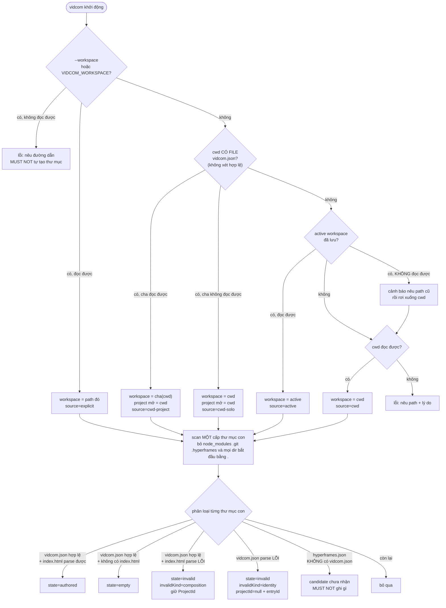
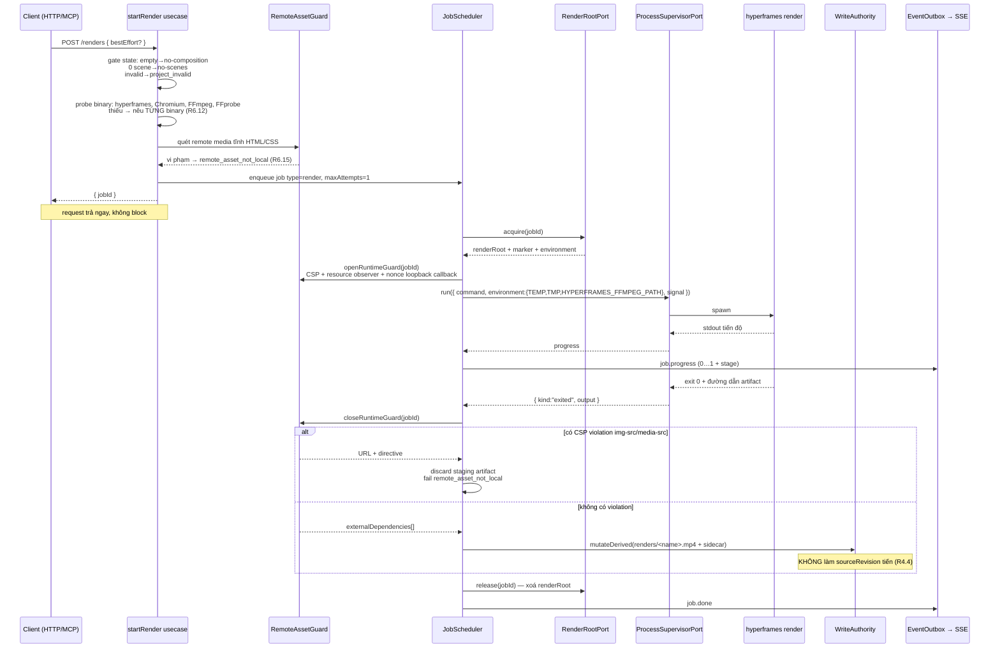
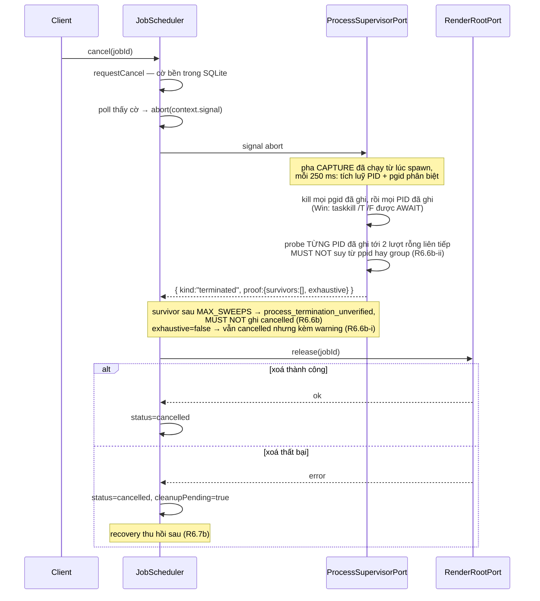
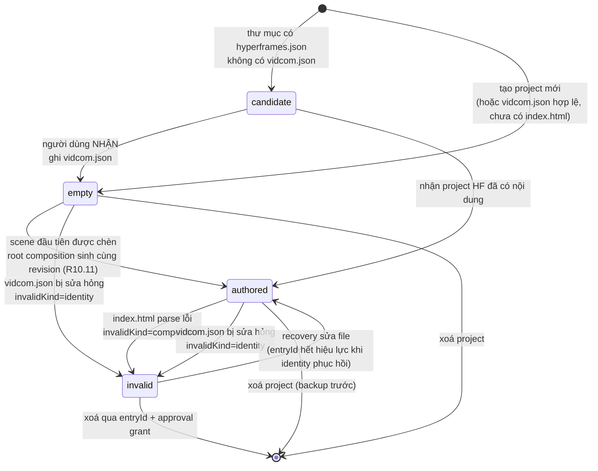
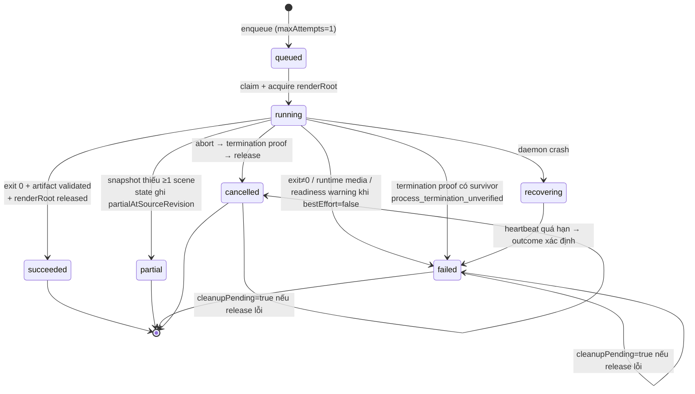
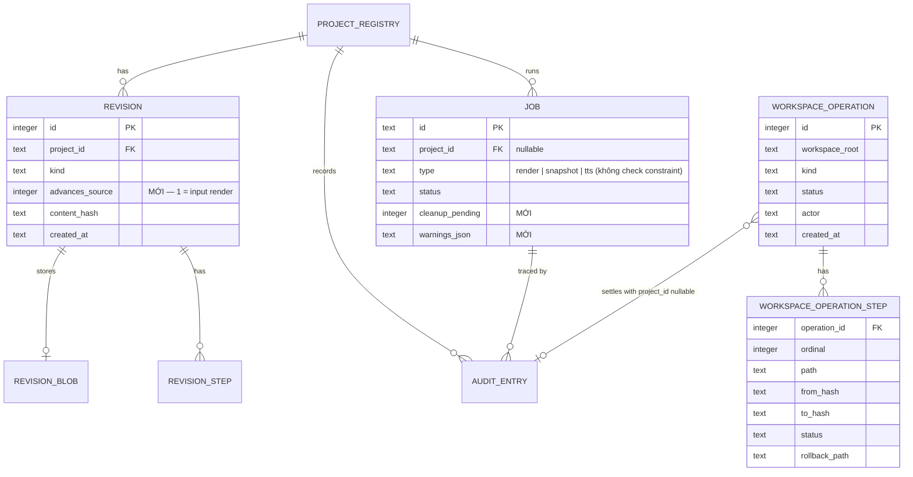

# Spec Project Delivery Loop — Detail Design

> **Reference**: [Detailed Goals](./spec-project-delivery-loop-detailed-goal.md) — **Approved 2026-08-04**
> **Next**: `spec-project-delivery-loop-implementation-checklist.md` — chưa tạo, bị Phase Gate `Design → Implement` chặn
> **Bản 44 — 2026-08-04.** Vá no-change audit và schema tool Phase P trước code. `install_agent_kit` gọi lại sau khi đã pristine vẫn là một invocation MCP `write` phải có audit bền, nhưng không có file để mutation journal sở hữu. `AgentKitInstaller` vì vậy chỉ với MCP pending audit sẽ gọi `WriteAuthority.mutateWorkspace` bằng batch rỗng; coordinator cho phép batch rỗng **chỉ khi có `toolAudit`**, journal một `agent_kit_files` operation không step rồi commit audit-only. HTTP/CLI no-change (`toolAudit=null`) không tạo operation. Input tool được khóa: `validate_project` là strict `{projectId}`; `start_snapshot` là strict `{projectId,idempotencyKey?}`; `start_render` là strict `{projectId,bestEffort?,renderPresetId?,idempotencyKey?}`; hai start tool trả strict `{jobId}` và chuyển nguyên input sang enqueue usecase chung.
> **Bản 43 — 2026-08-04.** Vá executability Phase P trước code. `install_agent_kit` là tool level `write`, nên workspace-operation journal phải sở hữu pending MCP audit giống project composite journal; nếu không Registry sẽ thấy caller-owned sau khi file đã commit và trả `committed_response_error`, còn audit workspace hiện ghi `protocol_version=NULL`, trái P.5. Thêm nullable `tool_audit_json` có JSON CHECK vào `workspace_operation`; `WorkspaceOperationJournalPort.isJournalOwned(invocationId)` kiểm pending payload, settle success/failure materialize đúng một audit row từ payload (gồm `protocol_version`, credential, revision null), và composition root inject một ownership facade kiểm cả project journal lẫn workspace journal vào `ToolAuditService`. HTTP truyền null; MCP truyền `context.writeInvocation.toolAudit`, actor agent. `get_job_status` output mở rộng `JobSchema` bằng `outcome: succeeded|partial|failed|cancelled|null` và `pollAfterMs: 250|1000|null`: queued trả 250 ms, running trả 1000 ms, terminal trả null; đây là backoff hint ổn định, không ngủ trong handler. `start_render`/`start_snapshot` trả strict `{jobId}` theo bảng §5.16. Bốn tool mới đều degrade được ở hai era; luật ẩn legacy vẫn do `availableInLegacy` + Registry filter thực thi và có contract test bằng một descriptor không-degrade, không tạo nhánh transport thứ hai.
> **Bản 42 — 2026-08-04.** Vá executability Phase O trước code. Route `GET /jobs/:jobId/termination-proof` không thể dựng lại proof từ `warnings`/`cleanupPending`, vì hàng `cancelled` không có `result`; do đó `job` thêm nullable `termination_proof_json`, `JobOutcome`/`JobCancelledError`/`JobFailureError` mang proof từ `ProcessSupervisorPort`, scheduler persist proof trong cùng terminal CAS, và `JobStorePort.readTerminationProof` là read seam duy nhất của HTTP. Recovery `PUT identity` dùng `EntryRegistry` resolve location, validate identity mới rồi gọi chính bootstrap/adopt authority với hash cũ làm precondition; `ProjectRef` lúc này mang ID đã validate và sẽ được persist, không phải ID giả. Thành công register + revision/audit cùng transaction rồi revoke `entryId`. `PUT /workspace/active` không chỉ clear token trên runtime cũ: host callback phải resolve/lease/khởi tạo composition root mới, swap runtime cho request kế tiếp, clear registry cũ, phát `workspace.changed`, rồi dispose runtime cũ sau response; response báo `reauthRequired:true` vì session là in-memory per runtime. HTTP route nhận đúng các application service instance đã đưa vào MCP Registry; render/snapshot enqueue dùng chung `enqueueRenderJob`/`enqueueSnapshotJob`, chỉ mở rộng hai input usecase bằng `idempotencyKey` để adapter HTTP không tự gọi `JobStorePort.enqueue`. Startup identity-backfill chỉ gọi bootstrap cho candidate **đã có** `vidcom.json` (legacy marker); folder có HyperFrames nhưng thiếu identity phải giữ state `candidate` cho tới `POST /projects/:slug/adopt`, nếu không route adopt không bao giờ executable.
> **Bản 41 — 2026-08-04.** Làm rõ dependency closure Q.12 mà checklist đặt trước P: bundle Q bắt buộc tham chiếu bốn tool final (`validate_project`, `start_snapshot`, `start_render`, `install_agent_kit`), nhưng Registry chỉ được đăng ký chúng ở Phase P. Vì vậy Q dựng và test nội dung/router/final tool catalog, còn assertion hai chiều **actual Registry ↔ AGENTS.md** được chuẩn bị ở Q và chỉ được tick terminal trong P sau khi bốn descriptor thật đã register; không tạo stub tool và không đăng ký P sớm để làm xanh Q giả. Các task Q.1–Q.11/Q.13 vẫn hoàn tất trước O đúng dependency; Q.12 là integration closure của P, tương tự F.13 từng chờ definition snapshot thật ở J.
> **Bản 40 — 2026-08-04.** Vá executability Phase Q trước code. `packages/agent-kit/scripts/build.mjs` đọc source Markdown, sinh `CLAUDE.md` byte-for-byte từ `AGENTS.md`, rồi sinh `src/generated-bundle.ts` chứa literal content + SHA-256 per-file; runtime chỉ import literal này, tuyệt đối không đọc asset cạnh executable. Composition root inject bundle vào `AgentKitInstaller`, nên Core không phụ thuộc package asset hay `node:fs`. Mọi file có marker integer `x-vidcom-agent-kit`; classifier dùng marker trước rồi hash bundled: vắng marker=`foreign`, version bằng binary + hash bằng manifest=`current_pristine`, version bằng + hash khác=`current_modified`, thấp hơn=`outdated`, cao hơn=`newer`. Installer nhận `WorkspacePort`, `WriteAuthority`, `hashContent`; resolve/read chỉ qua workspace capability và ghi một batch duy nhất qua `mutateWorkspace`. `install` chỉ ghi missing; nếu file chỉ dẫn chính foreign thì tạo file phụ VidCom khi phụ missing. `replace` chỉ nhận path thuộc manifest host, marker-owned và không newer/foreign. `link` chỉ append đúng một dòng vào `CLAUDE.md`, coi instruction có hiệu lực khi dòng exact tồn tại và file phụ pristine. Router native được discover chỉ khi đúng path host, marker parse được và nội dung router có frontmatter name `vidcom`; trạng thái file chỉ dẫn không được dùng để quyết định `blocked`.
> **Bản 39 — 2026-08-04.** Vá executability Phase N trước code. `ProjectWriteDependencies` nhận `ProjectIdentityService`; root source generator được trích dùng chung với lifecycle để `createScene` xử lý project `empty` mà không parse file vắng. Input create là `{index?,trackIndex?,expectedContentHash:ContentHash|null}`: index mặc định append trong track, track mặc định track của scene tại index tham chiếu nếu có, nếu không là 0. `setSceneTiming` nhận `ripple?:boolean` và `extendRoot?:boolean`; hard guard 3600 kiểm trước, root overflow trả discriminator khi chưa cho extend, và mọi SDK op + root update commit một composite revision. Sidecar narration v2 là `{schemaVersion:2,sceneId,cues,revision,updatedAt}`; mỗi cue giữ `status`, `audioPath`, `offsetSeconds`, duration/timing metadata. Legacy record được chiếu in-memory thành một cue, không tự ghi. `regenerateNarration` nhận optional `cueId/offsetSeconds/voice`, cập nhật đúng cue rồi ghi v2; sửa script chỉ stale cue có `cueId===elementId`, với legacy/sidecar đúng một cue thì fallback cue duy nhất. Audio path mặc định deterministic `narration/<sceneId>/<cueId>.wav`; adapter dùng `readCues` + file tồn tại, rồi `buildNarrationClips` lấy `scene.start + cue.offsetSeconds`.
> **Bản 38 — 2026-08-04.** Sửa xung đột executability M.1 với steering import boundary: `src/**` bị cấm import Core, nên hai helper số học thuần, không I/O (`countStrandedTweens`, `measureElementWindow`) nằm ở shared-kernel `packages/contracts/src/timeline-diagnostics.ts`; Core diagnostics và JSX cùng import đúng helper này. Business policy tạo `Diagnostic` vẫn ở Core. Đây giữ một nguồn sự thật mà không mở ngoại lệ ESLint hay làm UI gọi nghiệp vụ Core.
> **Bản 37 — 2026-08-04.** Vá executability Phase M trước code. `DiagnosticsService.forProject/forEntry` trả `Result<DiagnosticsReport,DomainError>`; service nhận một callback scan workspace, `CompositionPort`, `ProjectIdentityService`, journal source-revision, `WriteAuthority` và `DiagnosticsLintPort`. Port lint trả `{available, diagnostics}`; adapter chạy `[node, hyperframes-cli, "check", "--json", projectRoot]` qua process port có timeout, parse cả năm nhóm finding dù exit code khác 0 vì finding chính là nguyên nhân exit, và coi missing/timeout/JSON lỗi là unavailable. `forProject` là nhánh duy nhất parse composition và publish `.vidcom/context/diagnostics.json` bằng `mutateDerived`; `forEntry` tìm đúng entry trong scan, chỉ chiếu `invalidReason`, không parse/không ghi. Hai luật số học `countStrandedTweens` và `measureElementWindow` là hàm Core thuần và JSX bắt buộc gọi lại. Parser đưa `frameRate` vào `CompositionModel` từ `data-fps`, mặc định engine 30 khi attribute vắng, để `platform-mismatch` không đoán fps. `SnapshotState` được hoàn tất đúng shape J (`sceneIds`, `snapshotPaths`, `contactSheet`); `ThumbnailResolver` nhận `WorkspacePort`, current source revision và đọc hash của contact sheet/frame được chọn để tạo ETag thật — signature thuần cũ không thể đồng thời sinh content hash mà không có byte/hash input. Ưu tiên contact sheet rồi frame của scene đầu; file biến mất thì fallback placeholder. Chỉ identity-invalid seed bằng slug; mọi entry có ProjectId seed bằng ProjectId.
> **Bản 37 — 2026-08-04.** Vá executability Phase M: khóa các seam diagnostics lint/projection, nguồn platform đã parse, mapping JSON của `hyperframes check`, và đường recovery `entryId` chỉ đọc identity; bốn luật timeline dùng chung helper Core. Chi tiết tại §5.13.
> **Bản 36 — 2026-08-04.** Làm rõ lookup recovery đã nêu ở bản 32: `ProjectLifecycle` được inject read-only `Pick<MutationJournalPort,"findProjectRegistrationAt">` để áp running-job precondition nếu location từng được đăng ký và truyền stable ID đó xuống coordinator; đây không phải write bypass. Nếu lookup null, facade recovery giữ `project_id = NULL`. `EntryRegistry` vẫn là nguồn duy nhất resolve `entryId` thành root/slug và token bị revoke sau rename/delete thành công.
> **Bản 35 — 2026-08-04.** Khóa capability backup cho recovery identity trước code. `entryId` chỉ resolve ra direct-child root đã containment-check và không được bịa `ProjectRef`, nên `WorkspacePort.listBackupSourcesAt(root)` là primitive read-only cho đúng root capability đó; `listBackupSources(ref)` chỉ delegate về primitive này cho project hợp lệ. `BackupManifest` mang ownership union đóng: `{projectId, workspaceRoot:null, slug:null}` hoặc `{projectId:null, workspaceRoot, slug}`; restore revision chỉ nhận nhánh project, còn recovery delete dùng `createForLocation({workspaceRoot,slug}, ...)`. Thư mục payload location dùng digest của `workspaceRoot + NUL + slug`, không dùng/persist `entryId`. Rename/delete recovery gọi facade riêng với `projectId:null`; journal commit không cập nhật registry, ghi audit nullable và `workspace.changed` nullable-project event. Hai facade này cùng diagnostics và replace-identity là toàn bộ tập bốn operation nhận `entryId`; API nghiệp vụ vẫn chỉ nhận `ProjectId`.
> **Bản 34 — 2026-08-04.** Vá backup delete trước code. `WorkspacePort.readTree` chỉ trả relative nodes, còn resolve purpose cố ý không cho đọc mọi file người dùng (`package.json`, marker, file lạ), nên usecase không thể tạo backup toàn project an toàn. Thêm read-only capability đóng `listProjectBackupSources(ref)`: adapter walk regular files dưới đúng project root, bỏ symlink và operational `.vidcom`, trả `{path,resolved}` containment-checked cho `BackupPort.create`; không expose arbitrary read/write path.
> **Bản 33 — 2026-08-04.** Vá dependency `ProjectLifecycle.create/adopt` trước code: tạo stable `ProjectId`, timestamps và byte identity schema v1 không thể làm chỉ với danh sách dependency cũ. Usecase nhận `IdPort`, `ClockPort`, `ProjectIdentityService` (serialize duy nhất) và `CompositionPort` (validate staged root source trước publish); không tự nhân đôi schema/HTML validator.
> **Bản 32 — 2026-08-04.** Vá path boundary lifecycle trước code: Core có slug nhưng không được import `node:path`, còn rename/delete cần absolute direct-child capability kể cả target chưa tồn tại. `ProjectDirectoryPort.projectRoot(workspaceRoot, slug)` validate slug + injected root rồi trả absolute child path không tạo I/O target; coordinator dùng nó cho journal/recovery và vẫn là nơi duy nhất gọi rename/quarantine.
> **Bản 31 — 2026-08-04.** Vá recovery lifecycle trước code. Delete phải giữ `verifiedBackupId` qua crash để audit/settle, nên `workspace_operation` thêm nullable `backup_id` (FK không bắt buộc vì operation phải sống qua retention); `setDirectoryPaths` ghi staging/quarantine và backup sau khi ID cấp. `ProjectDirectoryPort.inspect(target)` trả `absent | directory | invalid` cho đúng direct-child target, không expose fs tổng quát. Recovery create/rename/delete quyết định từ old/new/staging/quarantine: final/new/quarantine hiện hữu một phía thì settle/recover; staging-only bị remove-owned rồi abort; old-only abort; trạng thái hai phía/không chứng minh được thì orphan. Coordinator nhận `ClockPort` để tạo registration timestamps deterministic khi normal/recovery commit.
> **Bản 30 — 2026-08-04.** Sửa mâu thuẫn Phase L trước code và mở lại delta Gate B. R5.9 bắt giữ audit + backup sau delete, nhưng `revision.project_id`, `backup_manifest.project_id`, `job.project_id` đang FK tới `project_registry`; physical DELETE registration sẽ vi phạm FK. Chốt logical unregister bằng cột additive nullable `project_registry.deleted_at`: mọi lookup/list active thêm `deleted_at IS NULL`; delete set timestamp và giữ row làm identity tombstone cho history/backup. Rename/create chỉ thao tác active row; ID đã tombstone không được mint lại. Đây là additive migration L, phải chạy lại migration/rollback/FK/integrity gate B trước khi tiếp tục. `WorkspaceOperationJournalPort.commitProjectLifecycle` terminal hóa operation cùng transaction với create registration + đúng một composite revision + entity seed, rename location, hoặc delete tombstone; không dùng generic `commit` cho lifecycle. `setDirectoryPaths` ghi staging/quarantine path sau khi operation ID cấp được.
> **Bản 35 — 2026-08-04.** Vá approval cho entry-only recovery: `GrantBinding.projectId` và `approval_grant.project_id` nullable chỉ khi target bắt đầu `location:`; CHECK bắt buộc project target có ID và location target không có ID. Như backup, grant không persist `entryId`, chỉ bind workspace-scoped slug + toàn bộ file hash. Tool business vẫn không nhận nullable ProjectId.
> **Bản 34 — 2026-08-04.** Khóa approval cho delete từ MCP trước code. `ProjectRemovalAuthority` là union đóng: local user cần `confirmed:true`; `agent|cli-external` cần thêm `grantId`. Lifecycle tự dựng canonical `GrantBinding` từ owner, latest revision và ordered source hashes, gọi `ApprovalService.planReserve`; coordinator đưa `grantId` vào intent. `workspace_operation.grant_id` unique FK; transaction `begin` reserve issued grant, lifecycle commit consume, abort/rollback release về issued nếu còn hạn, orphan invalidate. Không có khoảng thời gian filesystem đã bị quarantine nhưng grant chưa reserve.
> **Bản 33 — 2026-08-04.** Khóa session identity khi rename recovery: `EntryRegistry.relocate(entryId,nextSlug,nextRoot)` cập nhật map location in-memory nhưng giữ nguyên opaque ID; remove thành công thì `revoke`. Recovery startup không thể khôi phục entryId qua restart và cũng không được thử — scanner phiên mới mint token phiên mới, đúng R1.2c-iii.
> **Bản 32 — 2026-08-04.** Vá nhánh recovery `entryId` trước code. Identity-invalid có thể chưa từng có registration, nên không được bịa/persist `ProjectId` chỉ để thỏa FK backup. `MutationJournalPort.findProjectRegistrationAt(workspaceRoot,slug)` dùng real ID nếu location đã đăng ký; nếu không, rename/delete lifecycle giữ `project_id = NULL`. `backup_manifest.project_id` nullable và thêm `workspace_root` + `slug`, với CHECK đúng một ownership shape; `BackupPort.createForLocation` publish backup verify theo location và tuyệt đối không nhận/persist `entryId`. Audit lifecycle entry-only có `project_id = NULL`; outbox dùng event mới `workspace.changed` với `projectId = null` để list refresh. `DomainEvent` trở thành union: project events bắt buộc `ProjectId`, riêng workspace event bắt buộc null. Không tạo durable identity thứ hai.
> **Bản 31 — 2026-08-04.** Khóa capability path còn thiếu trước code L: Core không được tự `join(workspaceRoot,nextSlug)`, nên `ProjectDirectoryPort.projectRoot(workspaceRoot,slug)` trả direct-child `AbsolutePath` sau validate slug/containment, kể cả target chưa tồn tại. `WorkspaceOperationJournalPort.commitProjectLifecycle` là một primitive union duy nhất (create/rename/delete), không ba method trùng transaction; create lấy ordered file hashes từ operation steps để tạo revision steps. `completeBootstrapIdentity` nhận actor từ intent (default system cho caller cũ) để adopt có audit actor đúng mà không mở write bypass.
> **Bản 30 — 2026-08-04.** Vá executability Phase L trước code. Ba facade lifecycle đã được nêu nhưng chưa có request/settlement shape, nên khóa chúng tại boundary `WriteAuthority`/`WorkspaceMutationCoordinator`: create nhận bộ file staged + registration, manifest hash và preview seed; rename nhận `ProjectRef` + slug/root mới; delete nhận `ProjectRef` + `backupId`. `WorkspaceOperationJournalPort` thêm đúng ba transaction settle lifecycle để atomically cập nhật soft registration, một revision create, audit và `project.changed` event sau directory rename; không expose database cho usecase. `JobStorePort.hasRunningProjectJob(projectId)` khóa precondition rename/delete. `WorkspacePort.listBackupSources(ref)` trả capability regular-file đã containment để backup toàn tree mà Core không import `node:fs`; `.vidcom`, `renders`, `snapshots` vẫn được backup vì delete phải restore nguyên project. Recovery lifecycle phân nhánh bằng kind + old/new/staging/quarantine existence; không chạy đường file-agent-kit. Adoption dùng facade riêng `adoptProjectIdentity` để registration + strict identity write vẫn là một journaled source revision và chỉ chạm `vidcom.json`. `ProjectDeleteAuthorization = { actor: "user"; confirmed: true } | { actor: "agent" | "cli-external"; grantId: string }`; tên cũ `MutationAuthority` vẫn chỉ là lease capability và không được dùng nhầm làm approval payload.
> **Bản 29 — 2026-08-04.** Khóa nghĩa `ProjectStateStore.ensure` trước khi đóng K. Ghi `.gitignore` không tự tạo các directory rỗng `context/jobs/revisions/logs/cache`, nên thêm capability đóng `WorkspacePort.ensureProjectStateDirectories(ref)`; adapter chỉ mkdir đúng năm nhánh cố định dưới `.vidcom` sau containment direct project root và fsync. Directory không phải dữ liệu, không tạo revision; mọi file state/context vẫn qua `mutateDerived`, JSONL vẫn append atomic.
> **Bản 28 — 2026-08-04.** Sửa dependency scanner trước code: phân loại `authored`/`invalid(composition)` và `sceneCount` bắt buộc gọi parser, nên `scanWorkspace` nhận thêm `CompositionPort`; không chui qua private dependency của identity service và không parse HTML trong Core.
> **Bản 27 — 2026-08-04.** Sửa một lỗ capability còn lại trước implementation K. `resolve(ref,path,"read-source")` cố ý chặn protected `vidcom.json`/`hyperframes.json`, nên scanner không thể dùng resolve hiện hữu như bản 25 mô tả. `WorkspacePort` thêm đúng hai read-only primitive `statWorkspaceFile(projectRoot,path)` và `readWorkspaceFile(projectRoot,path)`; adapter chỉ chấp nhận direct-child root vừa nằm trong workspace đã inject và path literal thuộc `{vidcom.json,hyperframes.json,index.html}`. Không mở một bypass path-policy tổng quát. Identity service và scanner dùng hai primitive này; mọi ghi vẫn bắt buộc qua authority.
> **Bản 26 — 2026-08-04.** Đóng phần còn thiếu của vá K trước code. Scanner/identity dùng một `ProjectRef` tạm chỉ như filesystem capability cho direct-child root đã do `listWorkspaceDirectories` cấp; ID tạm không được persist hay trả ra ngoài. `WorkspacePort` bổ sung `listProjectFiles(ref,directory,"state-write")` để prune log có containment/allowlist, bên cạnh `appendAtomic(resolved,line)`. Reconcile muốn rebuild `jobs/index.jsonl` và `revisions/index.jsonl` đầy đủ nên `JobStorePort.listProjectJobs(projectId)` và `MutationJournalPort.listProjectRevisions(projectId)` là hai read API ordered từ SQLite; không suy lịch sử từ file projection. Reconcile publish `state.json` + hai index bằng một `mutateDerived`, sau đó các append mới tiếp tục qua append/fync. §6.3 khóa shape năm payload còn nợ và `ReconcileReport`; không payload nào có field `stale`.
> **Bản 25 — 2026-08-04.** Vá executability Phase K trước code. `WorkspaceScanner` cần quét cả folder trống/candidate/identity lỗi nhưng `WorkspacePort.listProjectCandidates()` hiện chỉ trả folder có đủ `hyperframes.json` + `index.html`; thêm `listWorkspaceDirectories(root)` one-level và giữ filter/phân loại/cache ở Core. Append JSONL không được tạo revision nên thêm `WorkspacePort.appendAtomic(path, line)`; adapter sở hữu mkdir/open-append/fsync đa nền tảng, Core vẫn không import `node:fs`. Allowlist `state-write` thêm đúng literal `.vidcom/.gitignore`, phù hợp R4.1b nhưng không mở dotfile khác. `ProjectIdentityService` nhận `CompositionPort` để infer preset từ model khi lazy-backfill; riêng `backfillPlatform` chấp nhận identity legacy `{id}` rồi nâng deterministic sang schema v1 với default render/narration và clock cho created/updated, còn `read()` vẫn strict và không ghi đè input lỗi. `ProjectStateStore` nhận thêm `JobStorePort`; `reconcile` dựng state/job/revision projection chỉ từ SQLite/job rows, tuyệt đối không parse projection để ghi ngược. Năm payload nội bộ được khóa shape tại §6.3; context nằm ở `.vidcom/context/project-context.md` đúng R4.3b.
> **Bản 24 — 2026-08-04.** Vá executability/gate-order Phase J trước code. Worker/Core không được đọc native output directory hay import image library, nên `RenderProjectPort.stage` trả thêm `snapshotOutputRoot`; port thêm `readSnapshotArtifacts` (chỉ regular PNG, ordered) và `composeContactSheet` (Sharp adapter, layout deterministic). Retry partial phải chạy trước `ProjectStateStore` Phase K: `JobStorePort.latestTerminal(projectId,"snapshot")` đọc job result SQLite authoritative; nếu partial cùng source revision chỉ gửi scene thiếu, khác revision gửi lại toàn bộ. K về sau projection kết quả job vào `.vidcom/state.json`, không tạo nguồn sự thật thứ hai. Snapshot result mang đủ `complete`, hai revision field, scene/missing list, paths và contact sheet để projection không phải suy từ filesystem.
> **Bản 23 — 2026-08-04.** Vá stale cleanup F.12 sau khi job render thật tồn tại: scheduler không sở hữu `RenderRootPort` và MUST NOT đoán resource theo chuỗi `type`. Thêm `JobTypeDefinition.cleanupPendingOnStale?: boolean`; render/snapshot set `true`. Khi recovery terminal hóa row `running` của definition này (cancelled hoặc one-shot failed), outcome mang `cleanupPending:true`; startup reclaim độc lập của G sau đó inspect/reclaim root và clear cờ. Job type khác giữ false mặc định.
> **Bản 22 — 2026-08-04.** Vá gate-order I.3 trước Phase K: `WorkspaceFs.readProjectRef` hiện đòi cả `hyperframes.json` + `index.html`, trái R1.2 vốn định nghĩa identity hợp lệ là đủ để project tồn tại và làm `empty` bị làm phẳng thành `project_not_found`. Sửa semantics read-by-ID/list identity-backed: chỉ `vidcom.json` hợp lệ là điều kiện tạo `ProjectRef`; `prepareRender` tự phân biệt entry vắng → `no_composition`, entry không đọc/parse được → `project_invalid` + reason `composition_parse_error`, model không scene → `no_scenes`. Identity-invalid vẫn không có `ProjectId` và do Phase K cấp `entryId`, nên render API không nhận nhánh đó. Không thêm state store hay scanner sớm.
> **Bản 21 — 2026-08-04.** Vá error propagation tại publication barrier I.5/I.9: lỗi `guard.close` vẫn map `storage_unavailable`; nhưng lỗi từ callback `publish` (đặc biệt `JobCancelledError`, domain error từ `mutateDerived`) phải `discard` rồi rethrow nguyên loại để scheduler giữ đúng terminal/code. Nếu helper đổi mọi lỗi publish thành storage thì cancel thắng ở barrier bị ghi `failed`, trái race contract §11.
> **Bản 20 — 2026-08-04.** Vá testability I.1/I.7 mà không mock filesystem: `NodeRenderBinaryProbe` nhận optional explicit `hyperframesCliPath`, `hyperframesPackagePath`, `browserPath` bên cạnh hai sidecar path. Khi field explicit có mặt, adapter kiểm tra đúng path đó trên filesystem thật và không fallback; khi vắng, production giữ `require.resolve` + `hyperframes browser path`. Nhờ vậy integration test tạo executable fixture thật có thể chứng minh từng phần tử `details.missing` và version drift một cách deterministic, đa nền tảng.
> **Bản 19 — 2026-08-04.** Vá publication barrier I/H trước code: `finalizeGuardedArtifact` bản đầu đóng guard rồi mới gọi `artifact.publish()`, nhưng callback không nhận kết quả đã đánh giá nên sidecar không thể chứa `externalDependencies` runtime mà không đóng/đánh giá guard lần hai hoặc publish thiếu dữ liệu. `GuardedArtifactPublication.publish(guardResult)` nay nhận `{ externalDependencies }`; helper vẫn sở hữu đúng một lần `close → evaluate → publish|discard`, và runner dựng MP4/sidecar trong callback sau barrier.
> **Bản 18 — 2026-08-04.** Vá terminal metadata I/F.12 trước code: release render root có thể lỗi cả khi job thất bại, nhưng `JobFailureError`/scheduler cũ chỉ persist code+message nên không có đường set `cleanupPending`/warnings cho terminal `failed`, trái §4.4.2. Mở rộng `JobFailureError` bằng optional ordered warnings + cleanupPending (giữ tương thích constructor hiện hữu); scheduler forward hai field vào `finish`. `JobCancelledError` và success/partial envelope giữ nguyên.
> **Bản 17 — 2026-08-04.** Vá executability I.4 trước code: Decision 8 đòi `bestEffort:false` fail bằng mã ổn định nhưng danh sách `ErrorCode` không có mã readiness, trong khi `sub_timeline_readiness_timeout` chỉ tồn tại ở `WarningCode`. Thêm cùng wire value vào `ErrorCode` (enum type riêng, không đổi payload string). Runner chỉ nhận token code allowlist từ stderr HyperFrames pinned, không phân loại bằng câu message; best-effort đưa warning vào result + job metadata, strict nonzero có token này trả đúng domain error, nonzero khác là `internal` với message đã redacted.
> **Bản 16 — 2026-08-04.** Vá executability Phase I trước code. HyperFrames CLI chỉ nhận project directory, nhưng bản cũ đòi render document đã build/inject guard mà không có boundary stage document; đồng thời `createRenderJobHandler` phụ thuộc `ProjectStateStore` dù Phase K đứng sau I. Thêm `RenderProjectPort.stage(ref,renderRoot,document,runtimeSource)` ở Adapter: copy file/directory thường của project vào `<renderRoot>/project`, bỏ symlink và ba derived/operational root `.vidcom|renders|snapshots`, thay entry bằng document đã build với runtime/file base tương đối, trả absolute `projectRoot` + `outputPath`; `readArtifact` đọc bytes sau CLI validate. Runner publish MP4 + sidecar trực tiếp qua `mutateDerived`; Phase K sau đó projection state/log từ SQLite, không bị gọi sớm. Port cũng là nơi nối path đa nền tảng, Core/Worker không import `node:path`/`node:fs`.
> **Bản 15 — 2026-08-04.** Sửa race do chính bản 13 tạo: crash giữa remove root và clear `cleanupPending` không thể retry chỉ từ `reclaimedJobIds`, vì root đã mất nên scan sau không còn ID. `JobStorePort.listCleanupPendingIds()` và `RenderRootPort.inspect(jobId)` (`absent|owned|unowned`) đóng cửa sổ này: sau reclaim, startup clear ID vừa xóa và mọi cleanup-pending root xác nhận `absent`; `owned` còn trẻ/đang chạy giữ cờ, `unowned` giữ cờ + warning, tuyệt đối không xóa. Hai recovery vẫn chạy độc lập theo control flow: reclaim luôn được thử cả khi `recoverStale` lỗi; nếu một hoặc cả hai lỗi startup trả lỗi tương ứng sau khi cả hai đã settle.
> **Bản 14 — 2026-08-04.** Vá executability Phase G trước khi wire composition root: singleton `FsRenderRootAdapter` dùng staging cố định `<appDataRoot>/render-roots`; đường binary theo thứ tự `CompositionRootConfig.renderBinaryPaths` → biến môi trường HyperFrames tương ứng → `<nativeDependenciesRoot>/bin/ffmpeg[.exe]` và `ffprobe[.exe]`. Hậu tố `.exe` chỉ do adapter composition chọn theo `process.platform`; Phase I.1 vẫn phải probe bốn binary và fail trước spawn, nên quy ước này không biến đường đoán thành bằng chứng binary tồn tại. Startup reclaim chỉ dùng staging/marker và chạy được độc lập với probe hoặc `recoverStale`.
> **Bản 13 — 2026-08-04.** Vá executability Phase G trước code: `reclaimOrphans` chỉ trả count thì startup không biết job nào để clear `cleanupPending`. Contract nay trả thêm ordered `reclaimedJobIds`; `JobStorePort` thêm `listRunningIds()` và CAS `clearCleanupPending(id)`. Nhờ đó G.3 lấy đúng live-set, G.4 thu hồi root xong mới clear cờ; không đổi schema.
> **Bản 12 — 2026-08-04.** Vá executability Gate E trước code: protocol create phải theo đúng boundary E.9 `stage/write/validate → atomic rename → DB settle`; bản cũ vừa đặt DB commit trước rename vừa mô tả recovery sau rename nên tự mâu thuẫn. `ProjectDirectoryPort.stageCreate` trả cả capability staging và final root, đồng thời thêm `writeStagedFiles`; nếu không Core buộc phải import `node:path`/`node:fs` hoặc tự nối path không đa nền tảng để dựng project, trái boundary của chính §5.7.
> **Bản 12 — 2026-08-04.** Vá executability Phase E trước code: `WorkspacePort.resolve(ref, …)` cố ý chặn purpose workspace còn `ProjectDirectoryPort` chỉ có directory primitive, nên thêm capability `resolveWorkspace(workspaceRoot,path,"workspace-agent-kit")` trên port hiện hữu; chỉ `WorkspaceMutationCoordinator` được gọi và adapter xác minh root đúng root đã inject. E.9 khóa crash protocol adapter+journal; L.6 lặp lại end-to-end qua `ProjectLifecycle`, không viết Phase L sớm.
> **Bản 11 — 2026-08-04.** Sửa mô tả query plan theo schema đã duyệt: `revision.path` là `NULL` cho composite nhiều file, nên `idx_revision_derived_path` chỉ tăng tốc derived revision một file. Prune composite vẫn xếp generation theo `revision_step.path` rồi join revision derived; không thêm index hay đổi cấu trúc bốn bảng journal/revision-step ngoài migration đã chốt.
> **Bản 10 — 2026-08-04.** Vá gate-order D.7: Phase D kiểm invariant bằng một batch “render completion” thật qua `mutateDerived` trên SQLite + filesystem và chứng minh source revision/snapshot freshness không đổi; Phase I kiểm lại end-to-end qua `RenderJobRunner` thật. Không được dựng stub production runner ở D khi runner chỉ thuộc I.
> **Bản 9 — 2026-08-04.** Vá executability Phase D trước khi code: source asset authored (`assets/**`, `preview-assets/**`, audio dưới `narration/**`) cần một dòng purpose riêng nhưng `snapshots/**`/`renders/**` vẫn bị chặn khỏi `mutateSource`; derived composite giữ payload ở `revision_step` chứ không chỉ `revision_blob`; SQLite chỉ detach payload refs trong transaction commit, còn object content-addressed được GC sau commit khi không còn reference vì filesystem không thể tham gia transaction SQLite. Thêm contract lookup payload để đường rollback trả `rollback_payload_pruned` thay vì đoán từ bytes rỗng.
> **Bản 8 — 2026-08-04.** Bản 7 vá bề mặt repo; bản 8 vá đường terminal của process proof được phát hiện khi thực thi F.15/F.16. `ProcessSupervisorPort` có warning/error nhưng `JobTypeDefinition.run(): Promise<unknown>` cũ không có đường mang warning tới `job.warnings`, và một nhánh catch chỉ nhìn `abortReason="cancel"` có thể ghi sai `cancelled` khi proof vẫn còn survivor. §5.20 nay quy định `JobCancelledError` mang ordered warnings + `cleanupPending`; `process_termination_unverified` phải thắng nhánh cancel và terminal hóa `failed`. Kết quả `partial`/metadata thành công dùng envelope có brand do Core tạo; return `unknown` cũ vẫn tương thích và được hiểu là `succeeded` không warning. Các vá executability bản 7 vẫn giữ nguyên.
> **Bản 6 — 2026-08-04.** Kiểm dữ kiện nền tảng và **thu hẹp một lệnh cấm của chính bản 5**. `wmic` đã bị gỡ khỏi Windows Server 2025 / Windows 11 24H2 và khỏi ảnh `windows-latest` từ 9/2025; `tasklist` không có `ppid`. Nên lệnh cấm PowerShell tuyệt đối làm pha capture **chết** trên Windows hiện đại — hỏng bằng thiết kế, không phải bằng thiếu số liệu. Sửa: cấm ở **hot path**, cho phép **một lần ở đường cancel**. Kèm luật cho trạng thái thoái hoá (**trung thực** thay vì zero survivor: proof MUST NOT báo sạch khi process còn sống) và ba tầng gate CI, trong đó một tầng **ép** chạy nhánh thoái hoá và một tầng chạy **render thật trên Windows** để đóng khoảng trống fixture tổng hợp không thấy.
> **Bản 5 — 2026-08-04.** Đóng đường đa nền tảng của §5.9 thành **hợp đồng chạy được**, không phải mô tả. Khác biệt OS gói vào đúng ba primitive (`enumerate`/`kill`/`isAlive`), thuật toán ba pha phía trên không rẽ nhánh theo OS; contract test dùng fixture tổng hợp bốn process — một cái tự tách group đúng như Chromium — nên chạy được ở mọi OS không cần Chromium hay mạng, và [`process-supervision.yml`](../../../../.github/workflows/process-supervision.yml) chạy nó trên Linux + macOS + Windows. Kèm hai bẫy primitive đã bịt: `isAlive` trên Windows phải so theo **cột** PID của `tasklist` (cột `Session#` khớp nhầm), `isAlive` trên POSIX phải coi `EPERM` là **còn sống**. Rủi ro Windows chưa đóng được nêu tường minh: `wmic` đã bị gỡ, PowerShell bị cấm ở runtime, `tasklist` không có `ppid`.
> **Bản 4 — 2026-08-04.** Đóng ba số chưa đo bằng [spike checklist-gate](../../../../spikes/phase-3-checklist-gate/README.md). Scan và `--at` PASS. Số thứ ba **bác bỏ giả định POSIX của bản 3**: `chrome-headless-shell` tự tách process group nên `kill(-pgid)` để sót 5 process, và sweep theo quan hệ cha-con báo *sạch* trong đúng lúc leak (con bị reparent sang `pid 1`). §5.9 viết lại thành thuật toán ba pha capture→kill→probe-theo-PID, đo PASS 3/3, p95 = 2 sweep; Goals bản 12 thêm R6.6b-ii. Kèm ba sửa §5.11 do spike `--at`: map theo timestamp không theo ordinal, validate range, dedupe. Còn mở đúng một việc: nửa Windows (W1/W2, cần Windows CI).
> **Bản 3 — 2026-08-04.** Đóng review bản 2 bằng ba quyết định người dùng và tám sửa do design tự mâu thuẫn với code hiện tại. **DG-1 đã đóng**: không duyệt native sidecar — Windows dùng awaited `taskkill /T /F` + verify sweep, guarantee hạ theo R6.6b/R6.6b-i bản 11 của Goals, zero-survivor chuyển Giai đoạn 4 (Decision 12, D7). **B3 đã đóng**: scan chấp nhận parse `index.html`, §9.1 đổi target. **M1 đã đóng**: derived blob giữ capture + prune K generation (Decision 14). Sửa thêm: exception dotfile tường minh cho hai purpose mới (§5.19) · signature `mutateSource`/`mutateDerived` và bỏ `purpose` do caller truyền (§5.18) · `JobScheduler` có mục riêng (§5.20) · resolve binary `hyperframes` (§4.6) · khai lỗ `blob:`/`connect-src` của CSP guard (§5.10, Decision 11) · snapshot dùng một invocation nhiều `--at` (Decision 13).
> **Bản 2 — 2026-08-04.** Deep review trên code thật + 8 spike contract: sửa cancel từ `ProcessTreeInspector` không khả thi sang `ProcessSupervisorPort` với Windows Job Object sidecar đã chạy thật; thêm runtime media guard CSP + loopback report + external-dependency observer; đổi migration `job` sang table-rebuild để có terminal `partial`; đổi journal workspace từ per-file sang operation + step; cô lập snapshot theo scene; bổ sung directory lifecycle và API recovery còn thiếu. Evidence: [spike Detailed Design](../../../../spikes/phase-3-detailed-design/README.md).
> **Bản 1 — 2026-08-04.** Viết sau khi Goals được duyệt và **cả hai spike gate PASS**: [render](../../../../spikes/phase-3-render/README.md), [ma trận host](../../../../spikes/phase-3-agent-kit-host/README.md).

---

## 1. Overview

Spec này bổ sung **năm năng lực mới** vào backend đã có (Phase 1 nền móng, Phase 2 MCP) và **đổi một luật nền**:

1. **Đổi định nghĩa "project tồn tại"** — `vidcom.json` thành marker, workspace mở được ở folder trống, project hợp lệ khi chưa có nội dung (R1, R3, R5).
2. **Hai job type mới đi qua process con** — `render` và `snapshot`, cả hai gọi `hyperframes` CLI qua `ProcessSupervisorPort`, cả hai chạy trong render root do VidCom sở hữu (R6, R7).
3. **Tách `sourceRevision` khỏi output** — một cột boolean trên `revision` quyết định revision nào là *input render*, và mọi dữ liệu dẫn xuất so với nó thay vì mang cờ stale (R4, R7, R9).
4. **Một scope ghi thứ hai sau cùng facade** — `WriteAuthority.mutateWorkspace()` cho agent-kit ở gốc workspace: atomic composite + precondition + audit + crash recovery, **không** revision, **không** backup; coordinator/journal nội bộ tách khỏi project (R13).
5. **Surface năm MCP tool (bốn mới + mở rộng một tool có sẵn) + agent-kit hai manifest** — mapping do evidence, không do quy ước (R12, R13).

Cách tiếp cận xuyên suốt: giữ nguyên journal project của Phase 2, nhưng **không ép expand-only khi AC đòi đổi invariant đang bị CHECK khoá**. `mutation_journal`, `revision_step`, `mutation_step` không đổi cấu trúc; `job` được table-rebuild có kiểm soát để thêm terminal `partial`, còn scope workspace dùng journal operation/step riêng. Lý do trong Decision 3 và Decision 4.

**Links to Requirements**

| Goal | Design element |
|---|---|
| R1 workspace & marker | §5.1 `WorkspaceResolver` · §5.2 `WorkspaceScanner` · §5.3 `EntryRegistry` · §4.3.1 flow |
| R2 preset platform | §5.4 `PlatformPresetCatalog` · §6.2 `PlatformConfig` |
| R3 `vidcom.json` | §5.5 `ProjectIdentityService` · §6.2 · §6.4 (không có bảng — file) |
| R4 `.vidcom/` | §5.6 `ProjectStateStore` · §5.18 `mutateDerived` · §6.3 · Decision 5, 14 |
| R5 project CRUD | §5.7 `ProjectLifecycle` + `ProjectDirectoryPort` · §4.4.1 state diagram |
| R6 render MP4 | §5.8 `RenderJobRunner` · §5.9 `RenderRootPort`/`ProcessSupervisorPort` · §5.10 `RemoteAssetGuard` · §5.20 `JobScheduler` · §4.3.2 · §4.6 · Decision 6, 7, 8, 12 |
| R7 snapshot | §5.11 `SnapshotJobRunner` · §6.3.2 `SnapshotState` · Decision 13 |
| R8 thumbnail | §5.12 `ThumbnailResolver` |
| R9 diagnostics | §5.13 `DiagnosticsService` |
| R10 scene insert/ripple | §5.14 `SceneTimingService` · Decision 9 |
| R11 narration nhiều cue | §5.15 `NarrationCueService` · §6.2.4 |
| R12 năm MCP tool | §5.16 registry additions · §7.2 |
| R13 agent-kit | §5.17 `AgentKitInstaller` · §5.18 `WriteAuthority.mutateWorkspace` · Decision 4 |

---

## 2. Design Scope

### In Scope

- Đổi luật marker và workspace resolution, kèm `entryId` cho project không đọc được identity.
- Schema `vidcom.json` v1 + catalog preset + backfill cho project cũ.
- `.vidcom/` per-project: `state.json`, `context/`, ba loại `.jsonl` append-only, `cache/`.
- Tách `sourceRevision` khỏi ghi dẫn xuất (một cột + một index + một port method).
- `render` và `snapshot` job: enqueue, progress, cancel, recovery, render root sở hữu, orphan reclaim.
- Quét remote media tĩnh trước enqueue **và** chặn/report media động bằng CSP trong chính lượt render.
- Diagnostics service: port 4 lint hiện có sang Core + 4 diagnostic mới + tích hợp `hyperframes check`.
- Scene insert tại vị trí + ripple **theo track** + timing invariant.
- Narration nhiều cue mỗi scene, đọc ngược được sidecar một-cue.
- Bốn MCP tool mới + mở rộng `get_job_status` hiện có; không register trùng tên.
- Agent-kit: nội dung, build, hai manifest theo host, ba operation `install`/`link`/`replace`, scope ghi workspace.
- Bốn deliverable sửa steering: 07 §2/§6 · 07 §3 · 14 §8 · **08 §2/§3/§6 (mới, bản 6)** — xem §2.1.

### 2.1 Xung đột với `steering/08` — phát hiện bản 6, cần sửa steering

[AGENTS.md](../../../../AGENTS.md) đòi surface xung đột với steering thay vì lặng lẽ lệch. Bản 2–5 liệt ba deliverable steering và **bỏ sót `08-jobs-and-queue.md`**, trong khi spec này lệch khỏi nó ở ba chỗ, một chỗ là luật tuyệt đối:

| # | [steering/08](../../../steering/08-jobs-and-queue.md) nói | Spec này làm | Nguồn hợp lệ hoá |
|---|---|---|---|
| 1 | §2: "Chỉ **ba** trạng thái cuối là terminal. Không có state nào khác"; `Job.status` union không có `partial` | thêm terminal thứ tư `partial` | R7.9b — **Goals đã duyệt** (bản 10) |
| 2 | §3: bản ghi `Job` không có `cleanupPending`, không có `warnings` | thêm cả hai, và **trả tới client** chứ không chỉ log | R6.6b, R6.14 — Goals đã duyệt |
| 3 | §6: "**MUST NOT** để process con sống sót. Kill cả cây process" — luật tuyệt đối | proof là bounded best-effort; `exhaustive: false` được phép, nền tảng thoái hoá có thể còn sót và dựa vào containment R6.7b | R6.6b/R6.6b-i/R6.6b-ii — **Goals bản 11–12**, theo quyết định người dùng ở DG-1 |

Cả ba lệch đều đã được duyệt ở tầng Goals, nên đây **không** phải xin phép lệch — mà là **steering chưa được cập nhật theo**. Rủi ro nếu bỏ qua là loại đắt nhất: steering là source of truth cho mọi task sau, nên một luật tuyệt đối đã hết hiệu lực nằm lại đó sẽ được một task tương lai đọc là còn hiệu lực. Xung đột #3 nguy hiểm nhất vì nó đọc như một bảo đảm mà hệ thống không còn cung cấp.

### Out of Scope

| Không thiết kế | Vì sao |
|---|---|
| Node SEA, nhúng frontend, bỏ Next | PK-6/PK-7 — Giai đoạn 4. Design này giả định entrypoint `vidcom` là CLI/executable, không giả định nó đã là một file |
| Vendor GSAP/font, chặn network toàn phần | R6.15b thu hẹp có chủ đích; đóng lỗ thuộc Giai đoạn 4 |
| Fingerprint per-scene cho snapshot | R7.9c chốt dùng `sourceRevision` toàn project; tối ưu thuộc Giai đoạn 5 |
| Undo/redo cấp composition, kéo-thả timeline | CE-8, SC-6/7 — Giai đoạn 5 |
| Agent chạy trong app (PTY, streaming) | AI-1..14 — Giai đoạn 6 |
| Sửa `mutation_journal` / `revision_step` / composite recovery project của Phase 2 | Decision 3 và 4 — journal workspace là cặp bảng riêng |
| Workspace lock/lease qua IPC, single-writer daemon | PK-4 — Giai đoạn 4; lease per-workspace của Phase 1 dùng nguyên trạng |

---

## 3. Research Summary

> Chỉ ghi phát hiện **thật sự đổi thiết kế**. Mười hai finding dưới đây đến từ code hiện tại hoặc bằng chứng chạy thật, không từ suy đoán. Finding 11 và 12 đến sau và **bác bỏ giả định của chính tài liệu này** — giữ nguyên thứ tự để đọc được vết sửa.

### Finding 1: Contract tree-kill đã có, nhưng implementation không cung cấp bằng chứng hoàn tất

- **Context**: R6.6b đòi kill cả cây tường minh. Câu hỏi là cần port mới hay không.
- **Key insight**: Hợp đồng [`process-port.ts:31-41`](../../../../packages/core/src/port/process-port.ts#L31-L41) nói abort kill cả cây, nhưng Windows implementation [`node-process-runner.ts:87-99`](../../../../packages/adapter/src/runtime/node-process-runner.ts#L87-L99) gọi `taskkill` bằng `spawn(...).unref()` rồi chỉ đợi direct child `close`. `ProcessRunOutput` không có PID/termination report; caller không thể thực hiện sequence của Design v1.
- **Remediation verified**: [`job-object-contract.ps1`](../../../../spikes/phase-3-detailed-design/job-object-contract.ps1) dùng Win32 `CreateProcess(CREATE_SUSPENDED)` → assign Job Object có `KILL_ON_JOB_CLOSE` → resume. Đóng handle giết đủ root/child/grandchild, survivors `[]`; việc assign xảy ra trước byte code của root nên không có race spawn-con trước-assign.
- **Stack gate đã đóng (DG-1, quyết định người dùng 2026-08-04)**: **không** duyệt native sidecar. Job Object đòi Win32 API mà Node không expose, nên cơ chế đã PASS ở trên **không** vào Phase 3. Goals bản 11 hạ R6.6b và thêm R6.6b-i để ghi lại giới hạn.
- **Impact on design**: Không thêm inspector chỉ đọc ở Core, cũng không thêm sidecar. `ProcessSupervisorPort` giữ nguyên vai trò *sở hữu cả kill lẫn verify*, và cơ chế là **ba pha capture → kill → probe**, giống nhau trên mọi nền tảng (§5.9). Cụ thể hoá theo nền tảng chỉ nằm ở ba primitive. Proof là *bounded best-effort*, không phải zero-survivor: sweep cạn mà còn survivor → `process_termination_unverified`, MUST NOT ghi `cancelled`. Process sinh sau lượt capture cuối là lỗ đã biết, được containment R6.7b gánh. → §5.9, Decision 12, D7.
- **Sửa bản 4**: mô tả ban đầu ở đây là "awaited `taskkill` + verify sweep", tức chỉ hai pha và chỉ cho Windows. Spike bác bỏ cả hai giới hạn đó — pha **capture** là bắt buộc, và POSIX cần nó y như Windows. Xem Finding 11.

### Finding 2: `job.type` không có check, nhưng `job.status` và `revision.kind` đều có check

- **Context**: Goals ghi "kiểm check constraint có phải table-rebuild như Phase 2 đã gặp".
- **Key insight**: [`schema.ts:236`](../../../../packages/adapter/src/db/schema.ts#L236) — `type: text().notNull()` **không** có `check()`. Thêm `render`/`snapshot` là **không migration**. Ngược lại `revision.kind` **có** `ck_revision_kind` ([`schema.ts:113`](../../../../packages/adapter/src/db/schema.ts#L113)) nên thêm giá trị vào `kind` **sẽ** cần table-rebuild.
- **Impact on design**: (a) Hai job type mới miễn phí về schema. (b) Tách source/derived dùng cột `advances_source` với CHECK `IN (0,1)`. (c) R7.9b bắt terminal `partial`, nên `job` **phải table-rebuild** để mở `ck_job_status`; ba `ADD COLUMN` của v1 không đủ. → §6.4–6.5.

### Finding 3: HyperFrames không expose workdir, nhưng nhận `TEMP`/`TMP`

- **Context**: R6.7b cần marker sở hữu ở render root.
- **Key insight**: Spike Node 24 ([render README §Kiểm lại](../../../../spikes/phase-3-render/README.md)) — HyperFrames 0.7.86 tự `mkdtemp(<os.tmpdir()>/hf-render-)` và không trả đường dẫn đó ra. Nhưng đặt `TEMP`/`TMP` vào một root do VidCom tạo thì orphan `hf-render-*` **nằm trong** root đó.
- **Impact on design**: Marker nằm ở **render root theo job do VidCom tạo**, không phải bên trong workdir của HyperFrames. Bốn điều kiện của R6.7b áp lên root của VidCom. → §5.9.

### Finding 4: Hai host đọc hai thư mục khác nhau, và chỉ một host theo dòng import

- **Context**: OQ-6 — một thư mục chung hay hai.
- **Key insight**: [Ma trận host](../../../../spikes/phase-3-agent-kit-host/README.md) — Codex chỉ nạp `.agents/skills`, Claude Code chỉ nạp `.claude/skills`; và Codex **không** theo dòng `Read and follow ./AGENTS.vidcom.md.` (`LINK_NOT_FOLLOWED`) còn Claude Code **theo** `@CLAUDE.vidcom.md`. Cả hai parse được frontmatter lạ `x-vidcom-agent-kit`.
- **Impact on design**: Hai manifest riêng theo host, không phải một. `link` là operation **chỉ của Claude Code**; recovery của Codex là `manual_merge`. `usableBy` phải suy từ **router native được discover**, không từ file chỉ dẫn chính — vì cả hai host gọi được probe từ skill dù file chỉ dẫn vắng mặt. → §5.17, Decision 10.

### Finding 5: `audit_entry.project_id` và `job.project_id` đã nullable

- **Context**: Ghi ở scope workspace không có `projectId`.
- **Key insight**: [`schema.ts:267`](../../../../packages/adapter/src/db/schema.ts#L267) và [`schema.ts:235`](../../../../packages/adapter/src/db/schema.ts#L235) đều `references()` **không** `notNull()`. Nhưng `mutation_journal.project_id` ([`schema.ts:41`](../../../../packages/adapter/src/db/schema.ts#L41)) và `revision.project_id` ([`schema.ts:101`](../../../../packages/adapter/src/db/schema.ts#L101)) **đều** `notNull()`.
- **Impact on design**: Audit của agent-kit install dùng lại `audit_entry` nguyên trạng. Journal project không dùng lại được — và không nên nới, vì nó đòi `projectId`. Scope workspace dùng cặp `workspace_operation` + `workspace_operation_step`, giữ operation identity và rollback payload cho cả batch. → Decision 4.

### Finding 6: Cancel request bền chưa abort signal của process đang chạy

- **Evidence**: [`job-cancellation-contract.ts`](../../../../spikes/phase-3-detailed-design/job-cancellation-contract.ts) chạy `JobScheduler` + `NodeProcessRunner` thật. Sau request cancel 500 ms job vẫn `running`; nó chỉ thành `cancelled` sau **3102 ms**, khi child tự exit. `JobScheduler` hiện chỉ kiểm cờ trước/sau `definition.run()`; `AbortController` chỉ dùng timeout.
- **Impact on design**: Scheduler có `CANCELLATION_POLL_MS` có tên, poll cờ bền trong lúc handler chạy và abort `context.signal`. `cancelled` chỉ được persist sau khi handler/`ProcessSupervisorPort` trả proof tree đã dừng và cleanup đã được thử. Không để từng handler tự phát minh vòng poll.

### Finding 7: DDL v1 không thực hiện được terminal snapshot `partial`

- **Evidence**: [`migration-contract.ts`](../../../../spikes/phase-3-detailed-design/migration-contract.ts) áp đúng ba `ADD COLUMN` của v1 trên SQLite thật. Default revision cũ đúng bằng `1`, nhưng `UPDATE job SET status='partial'` fail vì `ck_job_status`; đồng thời `advances_source=7` và JSON lỗi đều được nhận vì DDL không mang CHECK đã hứa.
- **Remediation verified**: [`migration-remediation.ts`](../../../../spikes/phase-3-detailed-design/migration-remediation.ts) table-rebuild `job` trong transaction, giữ hàng cũ, nhận `partial`, và từ chối boolean/JSON lỗi. `revision` vẫn expand-only bằng `ADD COLUMN ... CHECK`.
- **Impact on design**: Một table-rebuild có migration/rollback riêng; không còn tuyên bố toàn bộ migration expand-only.

### Finding 8: Static scanner bỏ lọt media chỉ xuất hiện lúc browser runtime

- **Evidence**: [`runtime-remote-media.mjs`](../../../../spikes/phase-3-detailed-design/runtime-remote-media.mjs) tạo `Image()` bằng JS sau khi document chạy. HTML/CSS scanner thấy 0 URL, server localhost nhận request, HyperFrames exit 0 và stdout/stderr không nêu URL.
- **Remediation verified**: [`runtime-media-csp-guard.mjs`](../../../../spikes/phase-3-detailed-design/runtime-media-csp-guard.mjs) inject CSP `img-src`/`media-src` chỉ local + listener `securitypolicyviolation` gửi về loopback channel nonce-bound của VidCom. Trong **chính lượt render**, asset server nhận 0 byte request, report mang đúng URL/directive, HyperFrames vẫn exit 0 để VidCom có thể discard staging artifact và trả `remote_asset_not_local`.
- **External dependency observation verified**: [`runtime-external-observer.mjs`](../../../../spikes/phase-3-detailed-design/runtime-external-observer.mjs) bắt đúng script external tạo bằng DOM ở runtime qua `PerformanceObserver`. Probe đầu tiên tự quan sát request callback và tạo vòng lặp; bản đúng phải loại callback URL, lọc initiator type, dedupe và cap report.
- **Impact on design**: `RemoteAssetScanner` đổi thành `RemoteAssetGuard`: static preflight + runtime CSP/report + resource observer. Callback chỉ bind loopback, dùng token theo job, dedupe/cap và đóng trước khi công bố artifact; token **không** được one-shot vì một render có thể có nhiều report.

### Finding 9: `hyperframes snapshot` luôn sinh contact sheet cho mỗi invocation

- **Evidence**: [`snapshot-cli-contract.mjs`](../../../../spikes/phase-3-detailed-design/snapshot-cli-contract.mjs) capture đúng midpoint `1.5s`, exit 0, nhưng output gồm cả `frame-00-at-1.5s.png` **và** `contact-sheet.jpg`.
- **Impact on design**: Chỉ lấy PNG, bỏ contact sheet do CLI sinh; VidCom tự ghép sheet sau khi mọi scene của generation hiện tại đủ. Như vậy một scene fail không thể công bố sheet thiếu.
- **Sửa bản 3**: bản 2 suy từ finding này ra "một invocation cho mỗi scene", nhưng finding chỉ nói về contact sheet, không nói gì về số lần gọi. `hyperframes snapshot --help` (0.7.86) cho thấy `--at` nhận **comma-separated timestamps**, nên cả tập scene chạy được trong một invocation. → Decision 13, §5.11.

### Finding 10: Journal per-file không đủ thông tin để rollback một operation nhiều file

- **Context**: `install` có thể ghi manifest + router + sáu skill trong một request; R12.10b bắt mutation fail → composite rollback.
- **Key insight**: Bảng v1 có một row/path, không có operation id, ordinal, rollback path hay previous payload. Cùng một tập row không phân biệt được “hai operation độc lập” với “một batch hai file”, nên recovery không thể biết phải rollback cùng nhau.
- **Impact on design**: `workspace_operation` là header batch; `workspace_operation_step` giữ ordinal, from/to hash, rollback path/captured hash và trạng thái. Authority dùng cùng protocol capture → publish → settle như composite project, nhưng không tạo revision/backup.

### Finding 11: Process group không phải bao đóng, và hai cách đo phổ biến đều báo sạch trong lúc đang rò

- **Context**: Bản 3 giả định vấn đề tree-kill chỉ nằm ở Windows, còn POSIX đã sạch nhờ process group.
- **Evidence**: [spike checklist-gate](../../../../spikes/phase-3-checklist-gate/README.md) trên darwin, render thật. `chrome-headless-shell` **tự đặt mình vào process group riêng** (`pgid` = chính `pid` của nó), nên `kill(-rootPid)` — đúng thứ [`node-process-runner.ts:137`](../../../../packages/adapter/src/runtime/node-process-runner.ts#L137) làm hôm nay — để lại **5 process Chromium còn sống**.
- **Bẫy đo lường, nguy hiểm hơn chính cái leak**: sau khi cha chết, con được reparent sang `pid 1`, nên duyệt theo quan hệ cha-con từ `rootPid` trả về **rỗng** đúng lúc leak xảy ra (`ppidWalkAfterKillCount: 0` trong khi 5 process còn sống). Và sweep theo *thành viên process group* cũng không bao giờ thấy leak, vì leak theo định nghĩa đã rời group. Spike đầu tiên vì thế báo `PASS` mà sai.
- **Remediation verified**: ba pha capture → kill → probe-theo-PID, 3/3 lần cancel cho survivors `[]`, p95 = 2 sweep, ~170 ms. Fixture tổng hợp tái hiện đúng cả leak lẫn bẫy đo, nên contract test chạy được mọi nền tảng mà không cần Chromium.
- **Impact on design**: §5.9 viết lại thành ba pha cho **mọi** nền tảng; Goals bản 12 thêm R6.6b-ii ghi hai điều cấm (MUST NOT suy survivor từ quan hệ cha-con, MUST NOT suy từ thành viên group). Đây cũng là **bug thật đang nằm trong repo**, không chỉ chuyện tài liệu — comment ở `killProcessTree` nói về sidecar VieNeu/Python, đúng cho ca đó, hỏng cho render.

### Finding 12: `wmic` đã biến mất khỏi Windows hiện đại, và điều đó phủ quyết một lệnh cấm của Design

- **Context**: Bản 4 cấm PowerShell làm dependency runtime, giả định vẫn còn nguồn khác cho quan hệ cha-con trên Windows.
- **Key insight**: `wmic` đã bị gỡ khỏi Windows Server 2025 và Windows 11 24H2, và khỏi ảnh `windows-latest` của GitHub từ 9/2025 ([runner-images #11228](https://github.com/actions/runner-images/issues/11228)); lỗi này đã đập vào thư viện process-tree của Node ngoài đời thật ([ps-tree #69](https://github.com/indexzero/ps-tree/issues/69)). `tasklist` **không** có `ppid`. Nên trên Windows hiện đại, PowerShell CIM là **nguồn duy nhất còn lại**.
- **Impact on design**: Cấm tuyệt đối = pha capture chết trên Windows, tức §5.9 không thực hiện được. Thu hẹp thành **cấm ở hot path, cho phép một lần ở đường cancel** (§5.9), cộng luật cho trạng thái thoái hoá: **trung thực thay vì zero survivor**. Đây là ca mà một ràng buộc tự đặt ra lại phủ quyết chính thiết kế của mình, và nó chỉ lộ ra khi đi kiểm dữ kiện nền tảng thay vì tin trí nhớ.
- **Hệ quả thứ hai — bỏ hẳn `wmic`** (D10): giữ nó làm fast path nghĩa là giữ một nhánh **không nền tảng CI nào còn chạy**, phục vụ Windows cũ, và tin là đúng mà không có bằng chứng. Finding 11 và 12 đều là đúng loại lỗi đó, nên lần này chọn một đường duy nhất được test mọi lần.

---

## 4. Architecture

### 4.1 System Overview

Không có tầng mới. Mọi năng lực mới rơi vào đúng bốn chỗ đã có của [steering/03](../../../steering/03-architecture-ddd.md): **domain** (invariant thuần), **usecase** (một thao tác người dùng/AI), **port** (seam ra ngoài), **adapter** (hiện thực). Hai đường vào — HTTP (Hono) và MCP (Tool Registry) — gọi **cùng** usecase; đây là luật MP-2 của Phase 2 và spec này không mở ngoại lệ.

Ba đường mới đáng gọi tên:

- **Job có process con.** `render` và `snapshot` là hai job type đầu tiên spawn Chromium/FFmpeg. `JobScheduler` nối cancel bền vào `AbortSignal`; `ProcessSupervisorPort` chỉ kết thúc abort sau khi cây process đã được kill và verify. `RenderRootPort` cấp thư mục marker và recovery thu hồi nó.
- **Ghi dẫn xuất.** `.vidcom/state.json`, `context/**`, `snapshots/**`, `renders/**` đi qua `WriteAuthority` để có atomic + audit, nhưng **không** làm `sourceRevision` tiến.
- **Scope workspace.** Agent-kit ghi ngoài mọi project, qua `mutateWorkspace`, có composite rollback + hash precondition + audit và **không** có revision/backup.

### 4.2 Component Diagram

```mermaid
flowchart TB
    subgraph entry["Đường vào — cùng usecase, không có đường thứ hai"]
        HTTP["Hono routes<br/>packages/server"]
        MCP["Tool Registry<br/>packages/mcp"]
        CLI["vidcom CLI<br/>packages/cli"]
    end

    subgraph uc["Usecase — packages/core/src/usecase"]
        WSU["resolveWorkspace<br/>scanWorkspace"]
        PLC["ProjectLifecycle<br/>create · adopt · rename · delete"]
        RJ["render / snapshot<br/>job handlers"]
        DIA["DiagnosticsService"]
        SCN["SceneTimingService<br/>insert · ripple"]
        NAR["NarrationCueService"]
        AKI["AgentKitInstaller"]
    end

    subgraph dom["Domain — thuần, không I/O"]
        PRE["PlatformPresetCatalog"]
        INV["timing invariants<br/>per-track ripple"]
        PP["pathPolicy<br/>+2 purpose mới"]
        PCTX["project-context<br/>renderer"]
    end

    subgraph svc["Service — packages/core/src/service"]
        WA["WriteAuthority facade<br/>source · derived · workspace"]
        WWA["WorkspaceMutationCoordinator<br/>internal workspace journal"]
        JS["JobScheduler<br/>đã có"]
        ER["EntryRegistry<br/>in-memory, theo phiên"]
        RRG["RemoteAssetGuard<br/>static + runtime CSP"]
    end

    subgraph port["Port"]
        WSP["WorkspacePort"]
        PROC["ProcessSupervisorPort<br/>kill + verify proof"]
        RRP["RenderRootPort"]
        PDP["ProjectDirectoryPort"]
        JSP["JobStorePort"]
        MJP["MutationJournalPort"]
        WMP["WorkspaceOperationJournalPort<br/>MỚI"]
        CMP["CompositionPort"]
    end

    subgraph adp["Adapter"]
        FS["WorkspaceFs"]
        HF["hyperframes CLI<br/>render · snapshot · check"]
        RRF["FsRenderRootAdapter"]
        PDF["FsProjectDirectoryAdapter"]
        SQL[("SQLite<br/>vidcom.sqlite")]
        AKB["agent-kit bundle<br/>+ manifest hash")]
    end

    HTTP --> uc
    MCP --> uc
    CLI --> uc
    uc --> dom
    uc --> svc
    svc --> port
    RJ --> RRG
    RJ --> RRP
    RJ --> PROC
    PROC --> HF
    WA --> MJP
    WWA --> WMP
    WWA --> PDP
    MJP --> SQL
    WMP --> SQL
    JSP --> SQL
    WSP --> FS
    RRP --> RRF
    PDP --> PDF
    PLC --> WA
    AKI --> AKB
    AKI --> WA
    WA --> WWA
```

Ranh giới **không** hiển nhiên, nên nói rõ:

- `WriteAuthority` là **facade ghi duy nhất** mà usecase được inject. `mutateWorkspace()` delegate vào `WorkspaceMutationCoordinator` nội bộ với journal operation/step riêng: vẫn composite + recoverable, nhưng không revision/backup và không bịa `projectId`. Coordinator MUST NOT được inject thẳng vào installer/route/MCP.
- `EntryRegistry` sống **trong bộ nhớ daemon**, không có bảng. R1.2c-iii yêu cầu `entryId` chỉ sống trong phiên; persist nó là tạo một định danh thứ hai bền song song với `ProjectId`.
- Kill và verify **không tách thành hai port**: nếu caller chỉ nhận `rootPid` sau spawn hoặc query sau khi parent chết, nó không còn snapshot đáng tin của cây. `ProcessSupervisorPort` sở hữu cả hai và chỉ trả terminal proof khi các PID đã capture đều không còn sống. Proof này **bounded best-effort trên Windows** (R6.6b-i) — nó không nói "không còn descendant nào", nó nói "mọi PID đã quan sát đều đã chết và hai lượt sweep liên tiếp không thấy thêm".
- `RenderRootPort` và `ProjectDirectoryPort` là port Core; mkdir/rename/remove/marker nằm ở adapter. Core MUST NOT import `node:fs` chỉ vì class có chữ “Manager”.

### 4.3 Data Flow

#### 4.3.1 Workspace resolution + scan (R1)



Dòng `cwd-project`/`cwd-solo` nằm **trên** `active` là chỗ lệch steering/07 §3 đã duyệt (OQ-9). Và chúng xét **sự có mặt** của file, không xét tính hợp lệ — nếu xét hợp lệ thì một dấu phẩy sai trong `vidcom.json` sẽ làm app âm thầm mở workspace khác (R1.2e).

#### 4.3.2 Render job — happy path và cancel (R6)





### 4.4 State / Lifecycle Flow

#### 4.4.1 Project state (R1 §4.4)



`authored` **không** đồng nghĩa "có scene": `authored` + 0 scene là trạng thái hợp lệ (root duration 0, [steering/03 §2.1](../../../steering/03-architecture-ddd.md)) và ba đường xử lý nó khác nhau có chủ đích — render từ chối, snapshot thành công rỗng, diagnostics trả `no-scenes` (R6.2b, R7.2b, R9.8b).

#### 4.4.2 Job lifecycle với cleanup (R6.6b, R6.7b)



Recovery lúc khởi động chạy **hai** việc độc lập: requeue/finalize job treo (đã có từ Phase 1, `recoverStale`), và **thu hồi render root mồ côi** theo bốn điều kiện R6.7b (mới). Cái thứ hai không phụ thuộc cái thứ nhất — một root có thể mồ côi trong khi job của nó đã kết thúc sạch, nếu `release` từng thất bại.

### 4.5 Integration Points

| System | Direction | Protocol | Purpose |
|---|---|---|---|
| `hyperframes render` | out | child process, argv | Render MP4 (R6) |
| `hyperframes snapshot` | out | child process, argv | Snapshot theo scene + contact sheet (R7) |
| `hyperframes check` | out | child process, argv | Nguồn lint thứ hai của diagnostics (R9.3) |
| FFmpeg / FFprobe | out | gián tiếp qua hyperframes, resolve bằng `HYPERFRAMES_FFMPEG_PATH` | Encode + probe (Finding: PK-7 có đường vào sẵn) |
| Chromium (`chrome-headless-shell`) | out | gián tiếp qua hyperframes | Capture frame |
| Codex CLI / Claude Code | in | đọc file ở gốc workspace + MCP stdio/HTTP | Harness học việc + gọi tool (R12, R13) |
| SQLite `vidcom.sqlite` | both | Drizzle | Job, revision, audit, event, registry, workspace mutation |
| Filesystem workspace | both | `WorkspacePort` | Project, `.vidcom/`, agent-kit |

### 4.6 Technology Stack

| Layer | Technology | Rationale |
|---|---|---|
| Render / snapshot engine | `hyperframes` CLI 0.7.86 qua `ProcessSupervisorPort` | Spike PASS đầu-cuối; `artifact validated` đã có. Decision 6 |
| Job queue | `JobScheduler` + `JobStorePort` đã có | Thêm hai type là **không migration** (Finding 2) |
| Persistence vận hành | SQLite + Drizzle, một file `vidcom.sqlite` | [steering/07 §9](../../../steering/07-data-and-storage.md); authority theo OQ-1 |
| Ghi workspace | `WorkspaceOperationJournalPort` + header/step tables | Decision 4 — batch recoverable, không nới journal project |
| Validation biên | zod strict trong `packages/contracts` | SE-4 đã có; preset và `vidcom.json` dùng cùng khuôn |
| Agent-kit bundle | asset nhúng lúc build + manifest hash trong binary | §4.6 Goals Luật 2 — không lock file trong workspace |

**Resolve binary `hyperframes` — bản 2 không nói, và nó là điều kiện của Decision 6.** Hôm nay `hyperframes` nằm ở **`devDependencies`** của [`package.json`](../../../../package.json); render là tính năng runtime nên nó **phải chuyển sang `dependencies`**. Cách resolve, theo thứ tự và không có bước nào là "tìm trong PATH":

1. `require.resolve("hyperframes/package.json")` → đọc `bin` → đường dẫn tuyệt đối tới `bin/hyperframes.mjs` (hôm nay: `node_modules/.bin/hyperframes` symlink tới file đó).
2. Spawn `[process.execPath, <đường dẫn .mjs>, "render" | "snapshot" | "check", …]` — chạy bằng đúng Node đang chạy daemon, không phụ thuộc shebang, không phụ thuộc PATH, không phụ thuộc shell.
3. So `version` đọc từ `package.json` với hằng số `HYPERFRAMES_EXPECTED_VERSION` được pin lúc build. Lệch minor+ → warning `engine_version_drift`; resolve thất bại → `render_binary_missing` với `details.missing` chứa `"hyperframes"`.

Hệ quả: `BinaryProbe` của §5.8 probe **bốn** thứ chứ không phải ba — `hyperframes`, Chromium, FFmpeg, FFprobe. R6.12 đòi nêu **từng** binary thiếu, và binary hay thiếu nhất chính là cái bản 2 quên liệt. Giai đoạn 4 (SEA/đóng gói) phải giữ được bước 1–2 hoặc thay bằng đường resolve tương đương đã khai; đây là ràng buộc mà PK-6/PK-7 thừa kế từ Design này.

---

## 5. Components and Interfaces

> Signature ở đây cố ý **đủ cụ thể để checklist map 1:1 sang file**. Path là vị trí dự kiến trong repo hiện tại.

### 5.1 `WorkspaceResolver` — `packages/core/src/domain/workspace-resolver.ts` (sửa)

- **Purpose**: Thực hiện đúng bảng quyết định 8 dòng của R1, thay logic 3 nhánh hiện tại.
- **Responsibilities**: xếp hạng candidate; phân biệt `cwd-project`/`cwd-solo`; phát cảnh báo khi active không đọc được; trả `source`.
- **Public interface**:
  ```ts
  export type WorkspaceSource = "explicit" | "cwd-project" | "cwd-solo" | "active" | "cwd";

  export interface WorkspaceCandidate {
    root: AbsolutePath;
    readable: boolean;              // thay `valid` — R1.10(a): đọc được là đủ
    hasIdentityFile: boolean;       // R1.2e: sự có mặt, KHÔNG xét hợp lệ
    parentReadable: boolean;
  }

  export interface WorkspaceResolutionInput {
    explicit?: WorkspaceCandidate | null;
    cwd?: WorkspaceCandidate | null;
    active?: WorkspaceCandidate | null;
  }

  export type WorkspaceResolution =
    | { status: "resolved"; root: AbsolutePath; source: WorkspaceSource;
        openProject: AbsolutePath | null; warnings: WorkspaceWarning[] }
    | { status: "error"; code: ErrorCode; path: string; reason: string };

  export function resolveWorkspace(input: WorkspaceResolutionInput): WorkspaceResolution;
  ```
- **Dependencies**: không — hàm thuần, không I/O. Composition root nạp candidate.
- **Lifecycle**: stateless.

### 5.2 `WorkspaceScanner` — `packages/core/src/usecase/scan-workspace.ts` (mới)

- **Purpose**: Quét **một cấp** và phân loại từng thư mục con thành project / candidate / bỏ qua.
- **Public interface**:
  ```ts
  export type ProjectState = "empty" | "authored" | "invalid";
  export type InvalidKind = "identity" | "composition";

  export interface InvalidReason {
    code: "identity_parse_error" | "composition_parse_error";
    field?: string;                 // unknown/missing field name, never its value
    line?: number;
    column?: number;                // MUST NOT chứa stack trace (R1.2c)
  }

  export type WorkspaceEntry =
    | { kind: "project"; projectId: ProjectId; slug: string; state: "empty" | "authored";
        platform: PlatformConfig | null; sceneCount: number }
    | { kind: "project"; projectId: ProjectId; slug: string; state: "invalid";
        invalidKind: "composition"; invalidReason: InvalidReason }
    | { kind: "project"; projectId: null; entryId: EntryId; slug: string; state: "invalid";
        invalidKind: "identity"; invalidReason: InvalidReason }
    | { kind: "candidate"; slug: string };

  export function scanWorkspace(
    deps: { workspace: WorkspacePort; identity: ProjectIdentityService; entries: EntryRegistry; composition: CompositionPort },
    root: AbsolutePath,
  ): Promise<WorkspaceEntry[]>;
  ```
- **Configuration**: bỏ qua `node_modules`, `.git`, `.hyperframes`, mọi dir bắt đầu bằng `.` (R1.9).
- **Filesystem capability (bản 25)**: `WorkspacePort.listWorkspaceDirectories(root)` chỉ trả `{slug, root}` của directory con trực tiếp; không lọc marker và không đi sâu. Scanner giữ toàn bộ ignore/classification policy, rồi resolve/stat/read ba file `vidcom.json`, `hyperframes.json`, `index.html` qua capability hiện hữu. Metadata cache và parse cache là hai map riêng theo `(absolute path, modifiedAt, size)`.
- **Chi phí**: phân loại `authored` vs `invalid(composition)` và `sceneCount` **đòi parse `index.html`** — đây là chủ đích, không phải sơ suất, vì thiếu nó thì card project và `no-scenes` không quyết được lúc scan. Cache hai tầng theo `(path, mtime, size)`; target tách làm hai ở §9.1.
- **Lifecycle**: per-request; kết quả cache theo file watcher event; quét đúng **một cấp**, MUST NOT đi xuống cây con (R1.12).

### 5.3 `EntryRegistry` — `packages/core/src/service/entry-registry.ts` (mới)

- **Purpose**: Cấp và resolve `entryId` cho project không đọc được identity (R1.2c-iii).
- **Responsibilities**: mint opaque token; map token → đường dẫn đã containment-check; **thu hồi** token khi identity phục hồi.
- **Public interface**:
  ```ts
  export type EntryId = Brand<string, "EntryId">;

  export class EntryRegistry {
    constructor(private ids: IdPort);
    /** Idempotent theo (workspaceRoot, slug) trong một phiên. */
    mint(workspaceRoot: AbsolutePath, slug: string, root: AbsolutePath): EntryId;
    /** `null` khi token không thuộc phiên này hoặc đã bị thu hồi. */
    resolve(id: EntryId): { workspaceRoot: AbsolutePath; slug: string; root: AbsolutePath } | null;
    /** Gọi sau khi recovery ghi được `vidcom.json` hợp lệ. */
    revoke(id: EntryId): void;
    /** Xoá toàn bộ khi đổi workspace (R1.13). */
    clear(): void;
  }
  ```
- **Lifecycle**: singleton theo phiên daemon. **Không có bảng** — persist nó là tạo định danh bền thứ hai song song `ProjectId`.

### 5.4 `PlatformPresetCatalog` — `packages/core/src/domain/platform-preset.ts` (mới)

- **Public interface**:
  ```ts
  export type PresetId = "vertical-shorts" | "horizontal-youtube" | "custom";
  export type Orientation = "vertical" | "horizontal";

  export interface PlatformConfig {
    presetId: PresetId;
    orientation: Orientation;
    aspectRatio: string;
    width: number; height: number; fps: number;
    targets: string[];
    recommendedMaxDurationSeconds: number | null;
  }

  export const PLATFORM_PRESETS: readonly PlatformConfig[];
  /** Từ chối lúc khởi động nếu bất kỳ preset có kích thước lẻ (R2.7). */
  export function assertCatalogEncodable(): void;
  /** Suy preset từ data-width/height khi backfill; không khớp → custom (R3.4). */
  export function inferPreset(width: number, height: number, fps: number): PlatformConfig;
  /** Bounds của custom: chẵn, 128…7680, fps 1…120 (R2.4b–4d). */
  export function validateCustom(input: { width: number; height: number; fps: number }):
    Result<PlatformConfig, DomainError>;
  ```

### 5.5 `ProjectIdentityService` — `packages/core/src/usecase/project-identity.ts` (mới, thay phần của `bootstrap-project.ts`)

- **Purpose**: Đọc/ghi/backfill `vidcom.json` với schema v1.
- **Public interface**:
  ```ts
  export interface ProjectIdentity {
    schemaVersion: 1;
    id: ProjectId;
    platform: PlatformConfig | null;
    render: { defaultPresetId: string; outputDirectory: string };
    narration: { defaultProviderId: string | null; defaultVoiceId: string | null };
    createdAt: string; updatedAt: string;
  }

  export type IdentityReadResult =
    | { ok: true; identity: ProjectIdentity }
    | { ok: false; reason: InvalidReason };          // parse lỗi → KHÔNG ghi đè (R3.3)

  export class ProjectIdentityService {
    read(root: AbsolutePath): Promise<IdentityReadResult>;
    /** Backfill `platform` từ data-*; đi qua WriteAuthority có journal (R3.4). */
    backfillPlatform(ref: ProjectRef): Promise<Result<ProjectIdentity, DomainError>>;
    /** Byte deterministic: key ổn định, indent 2, newline cuối (R3.7). */
    serialize(identity: ProjectIdentity): string;
  }
  ```
- **Configuration**: `schemaVersion` cao hơn binary → từ chối mở, MUST NOT đọc theo schema cũ (R3.9).
- **Dependencies**: `WorkspacePort`, `WriteAuthority`, `ClockPort`, `CompositionPort`. Class Core không import `node:fs`; mọi root/path được resolve thành capability qua port. `read()` luôn strict. Riêng `backfillPlatform()` nhận legacy `{id}` như input migration, parse composition qua port để infer preset, rồi ghi schema v1 đầy đủ với render/narration defaults; parse lỗi không ghi byte nào.

### 5.6 `ProjectStateStore` — `packages/core/src/service/project-state-store.ts` (mới)

- **Purpose**: Sở hữu toàn bộ `.vidcom/` (R4).
- **Responsibilities**: tạo cấu trúc + `.gitignore`; ghi `state.json` và `context/**` qua `WriteAuthority.mutateDerived`; append `.jsonl` atomic; rotate log; rebuild projection từ SQLite.
- **Public interface**:
  ```ts
  export class ProjectStateStore {
    ensure(ref: ProjectRef): Promise<void>;                       // R4.1, R4.1b
    readState(ref: ProjectRef): Promise<ProjectStateFile | null>;
    /** Qua WriteAuthority; MUST NOT làm sourceRevision tiến (R4.4). */
    writeState(ref: ProjectRef, next: ProjectStateFile): Promise<Result<void, DomainError>>;
    /** Deterministic, không absolute path / timestamp / jobId / secret (R4.3b). */
    writeContext(ref: ProjectRef, ctx: ProjectContext): Promise<Result<void, DomainError>>;
    appendJobEvent(ref: ProjectRef, line: JobLogLine): Promise<void>;      // R4.5
    appendRevision(ref: ProjectRef, line: RevisionLogLine): Promise<void>;
    log(ref: ProjectRef, line: StructuredLogLine): Promise<void>;          // MUST NOT có secret (R4.7)
    pruneLogs(ref: ProjectRef, retentionDays: number): Promise<{ deleted: number }>;
    /** So projection với SQLite; rebuild một chiều SQLite → .vidcom (R4.8b). */
    reconcile(ref: ProjectRef): Promise<ReconcileReport>;
  }
  ```
- **Lifecycle**: singleton; nhận `WriteAuthority`, `MutationJournalPort` và `JobStorePort` (chỉ đọc, để rebuild). Append JSONL dùng `WorkspacePort.appendAtomic`: adapter tạo parent thuộc allowlist, append một dòng + newline và fsync; không tạo revision. `reconcile` chỉ lấy SQLite/job rows làm input và không có API nhận projection để ghi DB.
- **Phân loại source/derived nằm trong authority, không ở caller**: `WriteAuthority` expose hai method khác tên `mutateSource(...)` và `mutateDerived(...)`; caller **không** được truyền boolean `advancesSource`. Method đầu luôn persist `advances_source=1`, method sau luôn persist `0`. Allowlist compile-time + test integration khóa `state.json`, `context/**`, `snapshots/**`, `renders/**` vào đường derived; như vậy một caller mới không thể vô tình tự chọn sai cờ.

### 5.7 `ProjectLifecycle` — `packages/core/src/usecase/project-lifecycle.ts` (mới)

- **Public interface**:
  ```ts
  export class ProjectLifecycle {
    /** Một composite mutation: vidcom.json + hyperframes.json + preview-settings.json + root composition (R5.1). */
    create(input: { workspaceRoot: AbsolutePath; name: string; preset: PlatformConfig }):
      Promise<Result<{ projectId: ProjectId; slug: string }, DomainError>>;
    /** Chỉ ghi vidcom.json; MUST NOT sửa file nội dung của người dùng (R5.6). */
    adopt(input: { workspaceRoot: AbsolutePath; slug: string }):
      Promise<Result<{ projectId: ProjectId }, DomainError>>;
    /** Giữ nguyên ProjectId (R5.10). */
    rename(target: ProjectLocator, nextName: string): Promise<Result<{ slug: string }, DomainError>>;
    /** Backup verify được TRƯỚC khi chạm đĩa; grant nếu từ MCP (R5.7, R5.8). */
    remove(target: ProjectLocator, auth: MutationAuthority): Promise<Result<{ backupId: string }, DomainError>>;
  }

  /** Recovery nhận entryId; nghiệp vụ chỉ nhận ProjectId (R1.2c-iv). */
  export type ProjectLocator =
    | { kind: "project"; projectId: ProjectId }
    | { kind: "entry"; entryId: EntryId };
  ```
- **Dependencies**: chỉ nhận facade `WriteAuthority` cho mọi ghi, cùng `WorkspacePort`, `BackupPort`, `ApprovalService`, `EntryRegistry`, `JobStorePort`, `IdPort`, `ClockPort`, `ProjectIdentityService`, `CompositionPort`. `ProjectDirectoryPort` và `WorkspaceOperationJournalPort` là dependency nội bộ của coordinator sau facade, MUST NOT inject thẳng vào usecase.
- **Lifecycle capability shapes (bản 30)**:
  - `WriteAuthority.createProjectRoot({ workspaceRoot, projectId, slug, files, registration, previewSeed, actor })`; coordinator hash/validate toàn bộ file trước begin, stage/publish qua `ProjectDirectoryPort`, rồi gọi `journal.commitProjectCreate(...)`. Commit tạo registration active, preview entity seed, **đúng một** composite source revision với ordered steps, audit và `project.changed` trong một SQLite transaction.
  - `WriteAuthority.adoptProjectIdentity({ ref, registration, identityContent, expectedContentHash, previewSeed, actor })`; facade dùng bootstrap journal hiện có, nên registration và source revision không thể tách, và chỉ target `vidcom.json`.
  - `WriteAuthority.renameProjectRoot({ ref, nextSlug, nextRoot, actor })`; begin trước I/O, rename directory, rồi `journal.commitProjectRename(id,nextSlug)` cập nhật registration/audit/event atomically. `projectId` không đổi.
  - `WriteAuthority.deleteProjectRoot({ ref, backupId, actor })`; begin sau khi backup đã verify, quarantine directory, rồi `journal.commitProjectDelete(id,backupId)` soft-delete registration/audit/event atomically; chỉ sau settle mới dọn quarantine.
  - `WorkspacePort.listBackupSources(ref)` trả regular-file capabilities theo path tương đối, không follow symlink. `JobStorePort.hasRunningProjectJob(projectId)` là read-only precondition bắt buộc trước rename/delete.
  - `ProjectDeleteAuthorization` tách confirmation local khỏi approval MCP; không tái sử dụng `MutationAuthority` vì type đó là lease proof nội bộ.
- **Protocol create**: `WriteAuthority.createProjectRoot(...)` begin operation bền → dựng toàn bộ project trong sibling staging dot-dir → validate hash/schema → atomic rename staging thành slug → commit registration + đúng một revision + audit/event + settle. `vidcom.json` chỉ xuất hiện trong final root cùng toàn bộ file còn lại. Crash trước rename để lại staging bị scanner bỏ qua; crash sau rename có đủ file và recovery settle DB.
- **Protocol rename**: `WriteAuthority.renameProjectRoot(...)` journal `{fromSlug,toSlug,projectId}` trước I/O → atomic directory rename → transaction cập nhật registration + audit/event + settle. Recovery nhìn old/new root, không mint ID mới.
- **Protocol delete**: verify backup trước → `WriteAuthority.deleteProjectRoot(...)` journal → atomic rename root sang quarantine dot-dir sở hữu → transaction gỡ registration + audit/event + settle → dọn quarantine. Recovery restore hoặc hoàn tất; không recursive-delete live root trực tiếp.

  ```ts
  export interface ProjectDirectoryPort {
    projectRoot(workspaceRoot: AbsolutePath, slug: string): Promise<AbsolutePath>;
    projectRoot(workspaceRoot: AbsolutePath, slug: string): Promise<AbsolutePath>;
    stageCreate(workspaceRoot: AbsolutePath, slug: string, operationId: WorkspaceOperationId):
      Promise<{ stagingRoot: AbsolutePath; finalRoot: AbsolutePath }>;
    /** Ghi trọn bộ file vào capability staging do adapter vừa cấp; Core không tự nối path. */
    writeStagedFiles(stagingRoot: AbsolutePath, files: { path: RelPath; content: string | Uint8Array }[]): Promise<void>;
    publishCreate(stagingRoot: AbsolutePath, finalRoot: AbsolutePath): Promise<void>;
    rename(from: AbsolutePath, to: AbsolutePath): Promise<void>;
    quarantine(root: AbsolutePath, operationId: WorkspaceOperationId): Promise<AbsolutePath>;
    restoreQuarantine(quarantine: AbsolutePath, root: AbsolutePath): Promise<void>;
    removeOwned(path: AbsolutePath): Promise<void>;
    inspect(path: AbsolutePath): Promise<"absent" | "directory" | "invalid">;
  }
  ```

### 5.8 `RenderJobRunner` — `packages/worker/src/render-job.ts` (mới)

- **Purpose**: Handler của job type `render`.
- **Public interface**:
  ```ts
  export interface RenderJobInput {
    projectId: ProjectId;
    bestEffort: boolean;                 // mặc định true (R6.14)
    renderPresetId?: string;
  }

  export interface RenderJobResult {
    artifactPath: RelPath;
    computedAtSourceRevision: number;
    durationSeconds: number; width: number; height: number; fps: number;
    reproducible: boolean;               // false khi có external dependency (R6.15b)
    externalDependencies: string[];
    warnings: RenderWarning[];           // vào job metadata VÀ tới client (R6.14)
    runtimeMs: number;
  }

  export interface RenderProjectPort {
    stage(ref: ProjectRef, renderRoot: AbsolutePath, document: string, runtimeSource: string): Promise<{
      projectRoot: AbsolutePath;
      outputPath: AbsolutePath;
    }>;
    readArtifact(outputPath: AbsolutePath): Promise<Uint8Array>;
  }

  export function createRenderJobHandler(deps: {
    process: ProcessSupervisorPort; roots: RenderRootPort;
    authority: WriteAuthority; composition: CompositionPort; assets: RemoteAssetGuard;
    binaries: BinaryProbe; renderProjects: RenderProjectPort; runtimeSource(): string;
  }): JobHandler<RenderJobInput, RenderJobResult>;
  ```
- **Staging project**: adapter copy chỉ file/directory thường, không theo symlink và bỏ `.vidcom/`, `renders/`, `snapshots/`; sau đó thay entry bằng document duy nhất từ `CompositionPort.buildDocument` với `runtimeUrl:"./.vidcom-runtime.js"` và `fileBaseUrl:"./"`, rồi ghi runtime pinned vào clone. Mọi path join nằm ở Adapter. CLI output luôn là `outputPath` dưới render root; chỉ sau exit 0 + ffprobe + callback close/evaluate mới đọc bytes và gọi `mutateDerived` cho MP4 + sidecar. Release render root nằm trong `finally` sau publish/abort.
- **Phase order**: I không phụ thuộc `ProjectStateStore` của K. Sidecar là derived artifact và được commit cùng MP4 bằng `mutateDerived`; K chỉ bổ sung projection `.vidcom/**` từ authority/SQLite về sau.
- **Configuration**: `maxAttempts: 1` (R6.8) · `concurrency` theo type, và **không** hai render cùng project song song (R6.11) — dùng `nextQueued(types, excluded)` đã có của `JobStorePort`.

### 5.9 `RenderRootPort` + `ProcessSupervisorPort` (mới)

- **Purpose**: R6.7b — render root sở hữu theo job, và xác minh descendant trước khi báo `cancelled`.
- **Public interface**:
  ```ts
  export const RENDER_OWNER_MARKER = ".vidcom-render-owner";
  export const RENDER_WORKDIR_ORPHAN_GRACE_SECONDS = 3600;

  export interface RenderRootPort {
    /** mkdir <stagingRoot>/<jobId>/ + ghi marker { jobId, createdAt }. */
    acquire(jobId: JobId): Promise<{ root: AbsolutePath; environment: Record<string, string> }>;
    /** Xoá root; `ok:false` → caller set cleanupPending (R6.6b). */
    release(jobId: JobId): Promise<{ ok: boolean; error?: string }>;
    /** Bốn điều kiện đồng thời; MUST NOT quét TEMP chung (R6.7b). */
    inspect(jobId: JobId): Promise<"absent" | "owned" | "unowned">;
    reclaimOrphans(now: Date, runningJobIds: ReadonlySet<JobId>):
      Promise<{ deleted: number; reclaimedJobIds: JobId[]; errors: { root: string; reason: string }[] }>;
  }

  export const PROCESS_CAPTURE_INTERVAL_MS = 250;
  export const PROCESS_VERIFY_SWEEP_INTERVAL_MS = 100;
  export const PROCESS_VERIFY_MAX_SWEEPS = 20;          // trần 2 s; đo được p95 = 2 sweep

  export interface ProcessTerminationProof {
    reason: "abort" | "timeout";
    rootPid: number;
    /** PID cụ thể tích luỹ trong lúc chạy + PID xuất hiện muộn trong sweep. */
    capturedPids: number[];
    /** Process group phân biệt đã quan sát — Chromium tự tách nhóm (R6.6b-ii). */
    capturedGroups: number[];
    survivors: number[];
    sweeps: number;
    /** `false` khi sweep cạn — proof bounded, không phải zero-survivor (R6.6b-i). */
    exhaustive: boolean;
  }
  export type SupervisedProcessResult =
    | { kind: "exited"; output: ProcessRunOutput }
    | { kind: "terminated"; proof: ProcessTerminationProof };
  export interface ProcessSupervisorPort {
    /** Abort chỉ settle sau kill + verify; survivor → ProcessTerminationUnverifiedError. */
    run(input: ProcessRunInput): Promise<SupervisedProcessResult>;
  }
  ```
- `JobStorePort.listRunningIds()` cấp live-set chính xác cho orphan reclaim; `listCleanupPendingIds()` cấp tập obligation cần reconcile; `clearCleanupPending(jobId)` chỉ đổi `1→0` sau khi root của đúng job đã được reclaim/release thành công **hoặc** `inspect(jobId)` xác nhận root exact đã `absent`. `unowned` (directory tồn tại nhưng marker thiếu/hỏng/sai ID) không bị xóa và không được clear; startup ghi warning. Nhờ lượt đối chiếu `absent`, crash giữa remove và clear được retry idempotent ở lần startup kế tiếp.
- **Adapters**: `FsRenderRootAdapter` sở hữu mkdir/marker/remove; `NodeProcessSupervisor` thay `NodeProcessRunner` ở composition root và **giữ nguyên** `NodeProcessRunner` cho TTS (`ProcessPort` cũ không đổi).
- **Composition root**: singleton dùng `<appDataRoot>/render-roots`, không quét `TEMP` chung. Binary path resolve theo thứ tự explicit config → `HYPERFRAMES_FFMPEG_PATH`/`HYPERFRAMES_FFPROBE_PATH` → `<nativeDependenciesRoot>/bin/<name>` với `.exe` trên Windows. Đây chỉ là input cho adapter; `BinaryProbe` Phase I mới là authority xác nhận đủ bốn binary trước enqueue/spawn.

**Thuật toán ba pha — chung cho mọi nền tảng, đã đo (R6.6b/R6.6b-ii).** Bản 3 viết "POSIX dùng process group là bao đóng thật nên hội tụ ngay". Spike bác bỏ: `chrome-headless-shell` **tự đặt mình vào process group riêng**, `kill(-pgid)` để sót 5 process Chromium còn sống ([S1c](../../../../spikes/phase-3-checklist-gate/README.md)). Process group không phải bao đóng ở đâu cả.

1. **Capture — trong lúc process chạy**, mỗi `PROCESS_CAPTURE_INTERVAL_MS = 250`: duyệt bao đóng descendant, tích luỹ **PID cụ thể** vào `capturedPids` và **tập pgid phân biệt** vào `capturedGroups`. Đây là pha hôm nay hoàn toàn không tồn tại; thiếu nó thì sau khi cha chết không còn cách nào tìm lại đám con.
2. **Kill** — kill **mọi pgid đã ghi**, rồi **mọi PID đã ghi**, rồi `rootPid`. Windows: `taskkill /pid <root> /t /f` **được await tới khi thoát** — sửa trực tiếp [`node-process-runner.ts:119-140`](../../../../packages/adapter/src/runtime/node-process-runner.ts#L119-L140) vốn `spawn(...).unref()` rồi bỏ đi — cộng probe/kill theo PID đã ghi cho phần Chromium tách group.
3. **Verify** — mỗi `PROCESS_VERIFY_SWEEP_INTERVAL_MS`, probe **từng PID đã ghi trực tiếp** (`process.kill(pid, 0)`; Windows dùng `tasklist /fi "PID eq …"`). Nạp PID mới xuất hiện vào tập. Dừng khi **hai lượt liên tiếp** cho tập survivor rỗng → `exhaustive: true`. Cạn `PROCESS_VERIFY_MAX_SWEEPS` mà còn survivor → `ProcessTerminationUnverifiedError`, `exhaustive: false`.

- **Hai điều cấm, mỗi cái ứng một cách đo đã báo PASS giả** (R6.6b-ii):
  - **MUST NOT** suy survivor từ **quan hệ cha-con**. Con được reparent sang `pid 1` khi cha chết, nên duyệt theo ppid trả rỗng **đúng lúc** đang leak — spike đo `ppidWalkAfterKillCount: 0` trong khi 5 process còn sống.
  - **MUST NOT** suy survivor từ **thành viên process group**. Leak theo định nghĩa nằm ngoài group, nên sweep theo group không bao giờ thấy nó. Đây là lý do S1 báo `PASS_POSIX` mà sai.
- **Lỗ còn lại, không được coi là đã đóng** (R6.6b-i, **mọi nền tảng** chứ không chỉ Windows): process sinh **giữa lượt capture cuối và lúc kill** nằm ngoài `capturedPids`. Vì vậy render root sở hữu của R6.7b là **tầng phòng thủ thứ hai bắt buộc** — orphan lọt sweep vẫn nằm trong root và bị `reclaimOrphans` thu hồi. Zero-survivor bằng Job Object là D7/Giai đoạn 4.
- **Evidence đã đo** ([spike checklist-gate](../../../../spikes/phase-3-checklist-gate/README.md), darwin/Node 24.9.0/hyperframes 0.7.86):

  | Đo | Số |
  |---|---|
  | `kill(-pgid)` đơn thuần | **leak 5 × `chrome-headless-shell`** |
  | Thuật toán ba pha, 3/3 lần cancel | survivors `[]`, `exhaustive: true` |
  | PID capture trung bình / process group phân biệt | 11.3 / 4 |
  | Sweep tới hội tụ (p95 và max) | **2** |
  | Tổng kill + verify | ~170 ms |

  [`job-object-contract.ps1`](../../../../spikes/phase-3-detailed-design/job-object-contract.ps1) giữ nguyên giá trị nhưng là **bằng chứng cho Giai đoạn 4** (D7), không cho Phase 3.
- **Khác biệt nền tảng gói vào đúng ba primitive; thuật toán phía trên không rẽ nhánh theo OS.** Đây là điều kiện để "đa nền tảng" là một hợp đồng chứ không phải ba code path song song mà chỉ một cái được test:

  | Primitive | POSIX (darwin, linux) | Windows |
  |---|---|---|
  | `enumerate()` | `ps -Ao pid=,ppid=,pgid=` | **PowerShell CIM** → `tasklist` (thoái hoá); chỉ cái đầu cho `ppid` |
  | `killGroup(id)` | `process.kill(-pgid, SIGKILL)` | `taskkill /pid <id> /t /f`, **awaited** |
  | `killPid(pid)` | `process.kill(pid, SIGKILL)` | `taskkill /pid <pid> /f` |
  | `isAlive(pid)` | `process.kill(pid, 0)`; `EPERM` = **còn sống** | `tasklist /fi "PID eq <pid>"`, so **theo cột PID** |

  Hai cái bẫy trong chính primitive, đã bịt trong spike và phải giữ khi port sang adapter: `isAlive` trên Windows MUST NOT tìm `"<pid>"` trong cả dòng CSV — CSV là `"image","PID","Session","Session#","Mem"` nên cột `Session#` khớp nhầm, làm pid nhỏ đọc ra "còn sống" vĩnh viễn; `isAlive` trên POSIX MUST coi `EPERM` là còn sống, không phải là lỗi.

- **Lệnh cấm PowerShell được thu hẹp, không bỏ** (sửa bản 5, quyết định người dùng). Bản 4 cấm PowerShell làm dependency runtime. Dữ kiện đã đổi: `wmic` **đã bị gỡ** khỏi Windows Server 2025 và Windows 11 24H2 — và khỏi ảnh `windows-latest` của GitHub từ 9/2025 — còn `tasklist` không có `ppid`. Cấm tuyệt đối nghĩa là Windows hiện đại **không còn nguồn nào** cho quan hệ cha-con, tức pha capture chết. Luật mới:

  | Đường | PowerShell | Vì sao |
  |---|---|---|
  | Hot path — mỗi lần spawn, mỗi tick tiến độ | **MUST NOT** | đây mới là chỗ lệnh cấm nhắm tới; chi phí nhân theo tần suất |
  | Cancel/timeout — một lần cho mỗi lượt kết thúc bất thường | **được phép** | cancel là vài lần/ngày; trả ~vài trăm ms một lần là chấp nhận được |

  `Get-CimInstance Win32_Process` chạy `-NoProfile -NonInteractive`, có timeout riêng, và **vắng mặt không phải lỗi** — nó rơi xuống `tasklist` thoái hoá.
- **`wmic` bị bỏ hẳn, không giữ làm fast path** (D10, quyết định người dùng). Nó nhanh hơn ở nơi còn tồn tại, nhưng **không nền tảng CI nào còn chạy nó** — Server 2025 đã gỡ — nên giữ lại là giữ một nhánh không ai chạy, phục vụ Windows cũ, và tin là đúng. Đó đúng là hình dạng lỗi spec này đã bị cắn hai lần (Finding 11 process group, Finding 12 `wmic`). Đổi lại: một đường duy nhất, được CI chạy mọi lần, giá là vài trăm ms mỗi lần cancel trên máy cũ — cancel là vài lần/ngày nên gần như không cảm nhận được.
- **Thoái hoá khi không có enumerator cho `ppid`**: capture chỉ còn root group, proof mang `exhaustive: false` và warning `termination_proof_not_exhaustive`. Luật ở trạng thái này là **trung thực, không phải zero survivor**: proof MUST NOT báo sạch trong lúc process còn sống. Leak mà khai báo thì containment R6.7b thu hồi được; leak mà giấu thì không tầng nào đỡ. Đây là điều kiện gate của CI, không phải lời khuyên.
- **Gate tự chạy, ba tầng** ([`process-supervision.yml`](../../../../.github/workflows/process-supervision.yml)), mỗi tầng đóng một khoảng trống mà tầng trước không thấy:

  | Tầng | Chạy ở đâu | Đóng cái gì |
  |---|---|---|
  | `s1e` fixture tổng hợp | Linux + macOS + Windows, hai lượt | thuật toán ba pha trên bốn process Node, một cái tự tách group; không cần Chromium/mạng |
  | `s1e` **ép thoái hoá** (`VIDCOM_DISABLE_ENUMERATORS`) | Windows | nhánh mà Windows khoá chặt sẽ đi thật; gate là **trung thực**, không phải zero survivor |
  | `s1f` render thật | Windows, ngoài pull request | `chrome-headless-shell` **thật** trên Windows có tách group không — thứ duy nhất fixture tổng hợp không trả lời được |

  Tầng ép-thoái-hoá tồn tại vì một máy còn `wmic` sẽ **không bao giờ** chạy nhánh thoái hoá một cách tự nhiên, mà đó đúng là nhánh proof dễ nói dối nhất. Tầng `s1f` tồn tại vì trên macOS hình dạng leak đã được xác nhận bằng render thật (S1c), Windows thì chưa — và một thói quen riêng của Chromium ở đó (Job Object riêng, cờ breakaway) sẽ không lộ ra từ fixture Node.
- **Còn mở**: số Linux/Windows về theo lần chạy CI đầu tiên. Design không chờ chúng vì cách sửa không phụ thuộc kết quả; cái CI trả về là con số, cộng một tín hiệu đỏ thường trực nếu nền tảng nào phá contract.
- **Scheduler**: `CANCELLATION_POLL_MS = 250` có tên, poll cờ bền và abort `context.signal`; timer clear trong `finally`. Chỉ proof có `survivors=[]` mới đi vào `cancelled` — `exhaustive: false` **không** chặn `cancelled` nếu survivors rỗng, nhưng phải vào `warnings` của job để người dùng thấy proof là bounded. Chi tiết sửa scheduler ở §5.20.
- **Race cancel/complete**: `requestCancel` trên `queued` terminal hoá ngay thành `cancelled`; trên `running` chỉ set cờ. Handler kiểm signal/cờ lần cuối **trước publish derived composite**. Terminal settle là compare-and-swap từ `running`: nếu cancel đã được quan sát trước publish thì cancel thắng và staging bị bỏ; nếu `succeeded`/`partial` đã settle thì cancel sau đó là `no_change`. Không có trạng thái “artifact đã publish nhưng job cancelled”.
- **Lifecycle**: singleton adapter. `environment` gồm `TEMP`/`TMP`, `HYPERFRAMES_FFMPEG_PATH` và `HYPERFRAMES_FFPROBE_PATH`.

### 5.10 `RemoteAssetGuard` — scanner thuần + runtime port (mới)

- **Purpose**: R6.15 — chặn remote **media** trước khi enqueue.
- **Public interface**:
  ```ts
  export interface RemoteAssetViolation {
    url: string;
    source: "element-attribute" | "css-url" | "observed-request";
    reference: string;                   // selector hoặc file:line
  }
  export function scanRemoteMedia(documents: { path: RelPath; html: string }[],
                                 stylesheets: { path: RelPath; css: string }[]):
    RemoteAssetViolation[];
  /** Script/stylesheet/font: KHÔNG chặn, chỉ warning + reproducible:false (R6.15b). */
  export function scanExternalDependencies(
    documents: { path: RelPath; html: string }[],
    stylesheets?: { path: RelPath; css: string }[],
  ): string[];
  export interface RuntimeAssetGuardPort {
    open(jobId: JobId): Promise<{ csp: string; bootstrapScript: string; token: string }>;
    close(jobId: JobId, token: string): Promise<{
      mediaViolations: RemoteAssetViolation[];
      externalDependencies: string[];
    }>;
  }
  ```
- **Static**: quét CSS `url(...)`, local stylesheet và element attribute trước enqueue. `@font-face url(...)` đi vào `externalDependencies` qua tham số `stylesheets` tùy chọn, **không** đi vào media violation; nếu không nhận stylesheet thì signature cũ không thể thực thi luật “font chỉ warning” của R6.15b.
- **Runtime media**: document builder đặt CSP `img-src 'self' data: blob:` + `media-src 'self' data: blob:` làm phần tử đầu tiên của `<head>`, trước mọi node tác giả có thể chạy, rồi inject listener `securitypolicyviolation`. Listener POST URL/directive tới callback loopback. Guard đóng **trước publish**; violation làm bỏ staged artifact và fail `remote_asset_not_local`.
- **Runtime script/style/font**: cùng bootstrap cài `PerformanceObserver({type:"resource", buffered:true})`, chỉ nhận initiator `script | link | css | font`, loại chính callback URL, dedupe theo `(initiatorType,url)` và cap 100 entry/job. Những URL này không bị chặn ở Phase 3; chúng hợp với static list để set `reproducible:false` + warning.
- **Security**: callback chỉ bind loopback, body/entry count giới hạn, token ngẫu nhiên theo job không log, payload phải khớp job đang chạy, server đóng trong `finally`. Token không one-shot: dùng một token cho nhiều report hợp lệ trong cùng job, chống replay bằng lifecycle ngắn + dedupe. Đây là enforcement trong chính lượt render, không phải preflight hai lượt có TOCTOU.
- **Lỗ đã biết — `blob:` + `connect-src` không giới hạn.** R6.15b **cho phép** script ngoài ở Phase 3. Một script như vậy `fetch()` được media remote rồi `URL.createObjectURL(blob)`; media vào qua `blob:` đã nằm trong allowlist, `securitypolicyviolation` không bắn, và Resource Timing chỉ thấy một `fetch` chứ không thấy một ``. Nghĩa là guard chặn được **remote media do document khai**, không chặn được **remote media do script ngoài kéo về**. Đóng lỗ đòi siết `connect-src` hoặc bỏ `blob:`, mà cả hai đều phá scaffold HyperFrames hiện tại — thuộc D1/Giai đoạn 4 cùng với vendor GSAP.
  Ba hệ quả bắt buộc ở Phase 3: (a) §5.10 và Decision 11 MUST NOT phát biểu "mọi remote media bị chặn"; câu đúng là "mọi remote media **do document khai** bị chặn trước byte đầu tiên"; (b) project có external script **luôn** `reproducible: false`, và đây là lý do thứ hai của cờ đó, không chỉ là chuyện pin version; (c) `externalDependencies` phải tới client kể cả khi render thành công, vì nó là thứ duy nhất người dùng có để tự đánh giá lỗ này.

### 5.11 `SnapshotJobRunner` — `packages/worker/src/snapshot-job.ts` (mới)

- **Public interface**:
  ```ts
  export interface SnapshotJobResult {
    outcome: "succeeded" | "partial";
    complete: boolean;
    sceneCount: number;
    sceneIds: string[];
    missingSceneIds: string[];
    snapshotPaths: Record<string, RelPath>;
    contactSheet: RelPath | null;        // chỉ khi complete (R7.4)
    computedAtSourceRevision: number | null;  // null khi partial (R7.9b)
    partialAtSourceRevision: number | null;   // chỉ khi partial (R7.9b/c)
  }
  ```
- **Responsibilities**: phạm vi sinh lại theo bảng R7.9c (đọc `JobStorePort.latestTerminal(projectId,"snapshot")`, so `sourceRevision` với `partialAtSourceRevision`, tính lại danh sách scene trước); một scene lỗi không làm mất cả bộ; `authored`+0 scene → thành công rỗng. Result SQLite là authority trong J; K chỉ projection result này vào `.vidcom/state.json`.
- **Adapter boundary**: `RenderProjectPort.stage` trả thêm `snapshotOutputRoot`; `readSnapshotArtifacts` chỉ trả regular PNG ordered, còn `composeContactSheet` dùng Sharp sau port với tile 320×180, tối đa 4 cột và PNG output deterministic. Worker không import `node:fs`, `node:path` hay Sharp.
- **Invocation** (sửa bản 3 — xem Decision 13): **một** invocation cho cả tập scene cần sinh, dùng `--at` dạng comma-separated:
  ```
  hyperframes snapshot --at <m1>,<m2>,…,<mN> --no-end --describe false --output <staging>
  ```
  `--at` nhận danh sách timestamp (`hyperframes snapshot --help`, 0.7.86), nên 50 scene = **một** lần khởi động Chromium, không phải 50. Chạy qua cùng `ProcessSupervisorPort`, dưới staging con riêng trong render root của job. Chỉ nhận PNG; bỏ `contact-sheet.jpg` CLI tự sinh.
- **Mapping output → scene: theo TIMESTAMP, không theo ordinal.** Bản 3 viết map theo ordinal; spike bác bỏ ([S3b](../../../../spikes/phase-3-checklist-gate/README.md)). Một timestamp không parse được bị CLI **bỏ im lặng**: `--at 1.0,abc,3.0` ra đúng hai file `frame-00-at-1s.png` + `frame-01-at-3s.png`, exit 0, không dòng lỗi nào. Ordinal `01` giờ trỏ vào midpoint **thứ ba** — map theo ordinal sẽ gán ảnh của scene 3 cho scene 2, im lặng và sai.
  Luật đúng: parse token `-at-<t>s` trong tên file, so **theo số** với mảng midpoint đã gửi (`1.0` ra `1s`, `1.5` ra `1.5s`, `-5.0` ra `at--5s`). Midpoint không có file khớp ⇒ vào `missingSceneIds`. Đây là contract ngầm cần golden test và phải chạy lại khi bump HyperFrames — cùng loại rủi ro với format stdout ở Decision 6.
- **Hai tiền điều kiện VidCom phải tự làm — CLI không làm hộ**:
  - **Validate range**: `--at 999` (quá duration) và `--at -5` đều **ra frame**, exit 0. Midpoint tính sai quay về dưới dạng một tấm ảnh chứ không phải lỗi, nên generation sẽ được đánh dấu hoàn tất với frame sai. Mọi midpoint MUST được kiểm `0 <= t <= rootDuration` trước khi spawn.
  - **Dedupe**: hai scene cùng midpoint ra hai file cùng timestamp khác ordinal, làm mapping theo timestamp nhập nhằng. Dedupe mảng midpoint trước khi gửi, rồi fan-out kết quả cho mọi scene chia sẻ midpoint đó.
- **Retry của scene thiếu**: một invocation thứ hai với đúng tập midpoint còn thiếu. Không có đường per-scene riêng — cùng một code path, khác tập `--at`.
- VidCom chỉ ghép một contact sheet deterministic sau khi mọi scene của generation hiện tại đủ, rồi publish ảnh + sheet + state như một derived composite qua `mutateDerived`. Cancel/crash vì vậy dùng cùng containment/recovery với render, không có đường spawn Chromium thứ hai thiếu supervision.

### 5.12 `ThumbnailResolver` — `packages/core/src/usecase/thumbnail.ts` (mới)

```ts
export type Thumbnail =
  | { kind: "image"; path: RelPath; stale: boolean; etag: ContentHash }
  | { kind: "placeholder"; seed: string; seedKind: "projectId" | "slug"; invalid: boolean };
export function resolveThumbnail(entry: WorkspaceEntry, snapshots: SnapshotState | null): Thumbnail;
```
`seedKind: "slug"` chỉ dùng cho `invalidKind: "identity"` — `entryId` đổi mỗi phiên nên dùng nó làm seed sẽ đổi màu card mỗi lần khởi động (R8.2b).

### 5.13 `DiagnosticsService` — `packages/core/src/usecase/diagnostics.ts` (mới)

> **Sửa bản 37 — vá executability Phase M:** `DiagnosticsService` nhận bốn seam rõ ràng: `WorkspacePort` để resolve/kiểm tra asset, `CompositionPort` để parse đúng một nguồn sự thật, `MutationJournalPort` để đọc `sourceRevision`, và `DiagnosticsProjectionPort` để ghi dẫn xuất qua `WriteAuthority.mutateDerived`. `DiagnosticsLintPort.check(ref)` là adapter-owned capability chạy argv (không shell) `hyperframes check --json <root>` qua `ProcessPort`; nó trả `{ available, diagnostics }`, coi spawn lỗi/timeout/JSON không đọc được là `available:false`, và map mọi finding trong `lint/runtime/layout/motion/contrast` thành `lint:<code>`. Core không parse stdout riêng và không import process/fs. `CompositionModel.compositionPlatform` mang `{ width, height, fps }` đã parse từ root `data-*` (fps mặc định 30 khi thiếu), để Core so với identity platform mà không parse HTML lần hai. `ProjectIdentityService.read(root)` là nguồn platform/invalid reason; `EntryRegistry.resolve(entryId)` chỉ cấp location cho recovery. `forProject` luôn persist canonical `DiagnosticsReport` vào `.vidcom/context/diagnostics.json` bằng derived write, nên không tiến `sourceRevision`; `forEntry` chỉ gọi identity read, không gọi composition/lint/projection. Bốn luật VD-3 dùng helper thuần export từ file này và JSX timeline phải gọi lại chính helper đó. `missing-asset` duyệt `CompositionModel.references` qua `WorkspacePort.resolve(..., "read-source")` + `exists`; narration overflow dùng `scene.narration.durationSeconds`; empty scene là `elements.length===0 && unresolvedEffects===0`.

```ts
export interface DiagnosticsReport {
  diagnostics: Diagnostic[];
  computedAtSourceRevision: number | null;   // null cho đường entryId (R9.1)
  lintSourceAvailable: boolean;              // false → nêu rõ, KHÔNG trả rỗng (R9.4)
}
export class DiagnosticsService {
  forProject(projectId: ProjectId): Promise<DiagnosticsReport>;
  /** Đường recovery: KHÔNG gọi parser composition, KHÔNG ghi .vidcom (R9.8d, R9.8e). */
  forEntry(entryId: EntryId): Promise<DiagnosticsReport>;
}
```
Nguồn diagnostic: 4 cảnh báo VD-3 đưa vào Core (**sửa bản 7**: chúng **không** ở `src/lib` — *stranded tween* và *element overrun* chỉ tồn tại dưới dạng số học trong [`timeline-elements.tsx`](../../../../src/components/studio/timeline-elements.tsx), còn *unresolved selector* và *empty scene* đã có nguồn ở parser [`hyperframes/parse.ts`](../../../../packages/adapter/src/hyperframes/parse.ts). Nên đây là **trích luật khỏi JSX**, không phải di chuyển module) + `platform-mismatch` + `narration-overflow` + `missing-asset` + `no-composition`/`no-scenes` + `lint:<rule>` từ `hyperframes check`.

### 5.14 Timing invariants — **mở rộng** `packages/core/src/domain/invariants.ts` + `usecase/project-writes.ts` (sửa)

> **Sửa bản 7**: bản trước ghi "`domain/scene-timing.ts` (mới)" và một usecase mới. Cả hai **đã tồn tại**: `validateSceneTiming` ở [`invariants.ts`](../../../../packages/core/src/domain/invariants.ts) với `SceneTimingInput` **đã mang `trackIndex` + `rootDuration`**, còn `createScene`/`setSceneTiming` ở [`project-writes.ts`](../../../../packages/core/src/usecase/project-writes.ts). Tạo file song song sẽ sinh đường ghi thứ hai cho cùng một thao tác.

```ts
export interface TrackRipplePlan {
  trackIndex: number;
  moved: { sceneId: string; fromStart: number; toStart: number }[];
  rootDuration: number;                      // max trên MỌI track (R10.2b)
}
/** Thuần, không I/O. Chỉ dịch scene TRONG một track (R10.1–3). */
export function planRipple(scenes: SceneClip[], change: TimingChange): Result<TrackRipplePlan, DomainError>;
/** Hở/chồng chỉ tính trong cùng track; chồng giữa track là hợp lệ (R10.3, R10.7). */
export function detectTrackGapsAndOverlaps(scenes: SceneClip[]): Diagnostic[];
```

### 5.15 `NarrationCueService` — `packages/core/src/usecase/narration-cues.ts` (mới)

```ts
export interface NarrationCue {
  cueId: string; text: string; voice: string;
  offsetSeconds: number; durationSeconds: number | null;
  staleSince: string | null;
  words?: WordTiming[]; wordTimingSource?: "engine" | "estimated";
}
/** Sidecar một-cue cũ đọc thành đúng một cue; MUST NOT ghi đè (R11.2). */
export function readCues(sidecar: unknown): NarrationCue[];
/** Một <audio class="clip hf-narration"> cho mỗi cue, data-start từ document (R11.3). */
export function buildNarrationClips(scene: SceneClip, cues: NarrationCue[]): NarrationClip[];
```

### 5.16 Tool Registry changes — `packages/mcp/src/registry/` (sửa + mới)

Surface gồm năm tool, mỗi tool định nghĩa **một lần**, gọi đúng usecase mà HTTP gọi (R12.1–2). `get_job_status` đã tồn tại ở `registry/job-tools.ts`; spec **mở rộng schema/description/mapper** của nó, MUST NOT register tool thứ hai cùng tên:

| Tool | Usecase | Trả về |
|---|---|---|
| `validate_project` | `DiagnosticsService.forProject` | `DiagnosticsReport` |
| `start_snapshot` | enqueue snapshot | `{ jobId }` |
| `start_render` | enqueue render | `{ jobId }` |
| `get_job_status` *(sửa)* | `JobStorePort.get` | status gồm `partial`, warnings, cleanupPending + outcome; poll có backoff |
| `install_agent_kit` | `AgentKitInstaller` | `{ operationResult, installationState }` |

### 5.17 `AgentKitInstaller` — `packages/core/src/usecase/agent-kit-install.ts` (mới)

- **Public interface**:
  ```ts
  export type Host = "codex" | "claude-code";
  export type FileState = "missing" | "current_pristine" | "current_modified" | "outdated" | "newer" | "foreign";
  export type NextAction = "none" | "install" | "replace" | "link" | "manual_merge";

  export interface AgentKitFileState {
    host: Host; relativePath: string; state: FileState;
    contentHash: ContentHash | null; nextAction: NextAction;
  }

  export type InstallAgentKitInput =
    | { operation?: "install"; hosts: [Host, ...Host[]] }
    | { operation: "link"; host: "claude-code"; expectedContentHash: ContentHash }
    | { operation: "replace"; host: Host; relativePath: string; expectedContentHash: ContentHash };

  export interface InstallAgentKitOutput {
    operationResult: { status: "applied" | "no_change";
                       changedFiles: { relativePath: string; contentHash: ContentHash }[] };
    installationState: {
      outcome: "installed" | "already_installed" | "partial" | "blocked";
      files: AgentKitFileState[];
      /** Key set MUST equal selected hosts; unselected hosts are absent (R12.9-iii). */
      usableBy: Partial<Record<Host, "ready" | "degraded" | "blocked">>;
      recovery: { host: Host; action: NextAction; detail: string }[];
    };
  }

  export class AgentKitInstaller {
    apply(workspaceRoot: AbsolutePath, input: InstallAgentKitInput):
      Promise<Result<InstallAgentKitOutput, DomainError>>;
  }
  ```
- **Boundary schema**: Zod union là `.strict()` và nhánh install dùng array `.min(1)` + unique host; tuple domain phía trên chỉ biểu diễn trạng thái đã validate. `installationState.files`, `usableBy` và `recovery` có key/row **đúng bằng** selected-host set, không trả placeholder cho host không chọn.
- **Manifest theo host** (Finding 4, R13.7-i):

  | Host | File chỉ dẫn | Thư mục skill | `link` |
  |---|---|---|---|
  | `codex` | `AGENTS.md` | `.agents/skills/**` | **không expose** — recovery là `manual_merge` |
  | `claude-code` | `CLAUDE.md` | `.claude/skills/**` | append `@CLAUDE.vidcom.md` + `expectedContentHash` |

- **Suy `usableBy`** (R13.9b–9b-i): từ **router native được discover**, không từ file chỉ dẫn chính. Cả hai host gọi được probe từ `vidcom/SKILL.md` dù file chỉ dẫn vắng mặt, nên `AGENTS.md` `foreign` **không** làm host `blocked` khi router còn nguyên.
- **Bundle/runtime seam (bản 40)**: source Markdown ở `packages/agent-kit/` được build script biến thành `src/generated-bundle.ts`; module sinh ra chứa content literal và SHA-256 của từng source file, gồm `CLAUDE.md` sinh từ `AGENTS.md`. Adapter/composition root import bundle và inject vào Core; `AgentKitInstaller` không đọc package filesystem lúc runtime. Marker integer trong từng file cùng manifest hash phân loại sáu state theo bảng ở Bản 40.
- **Effective-chain seam (bản 40)**: router được xem là discoverable chỉ khi file `vidcom/SKILL.md` ở đúng dot-directory host đọc được, marker parse được và frontmatter có `name: vidcom`. Instruction chung có hiệu lực khi file chính pristine, hoặc riêng Claude khi `CLAUDE.md` chứa dòng exact `@CLAUDE.vidcom.md` và file phụ pristine. Vì vậy router còn nguyên + main foreign vẫn `degraded`; router hỏng luôn `blocked`; `link` có thể nâng Claude lên `ready` mà không đổi ownership của main file.

### 5.18 `WriteAuthority` — `mutateSource` / `mutateDerived` / `mutateWorkspace` + `WorkspaceMutationCoordinator` — `packages/core/src/service/` (sửa + mới)

- **Purpose**: R4.4c — tách input render khỏi ghi dẫn xuất bằng **method**, không bằng cờ do caller truyền; và R13.11 — đường ghi duy nhất vào gốc workspace.
- **Public interface**:
  ```ts
  export interface WorkspaceWriteRequest {
    workspaceRoot: AbsolutePath;
    writes: { path: RelPath; content: string; fromHash: ContentHash | null }[];
    actor: Actor;
    action: string;                     // vào audit_entry.action
  }
  export interface WorkspaceProjectCreateRequest {
    workspaceRoot: AbsolutePath; slug: string; projectId: ProjectId;
    files: { path: RelPath; content: string }[]; actor: Actor;
  }
  export interface WorkspaceProjectRenameRequest {
    workspaceRoot: AbsolutePath; projectId: ProjectId;
    fromSlug: string; toSlug: string; actor: Actor;
  }
  export interface WorkspaceProjectDeleteRequest {
    workspaceRoot: AbsolutePath; projectId: ProjectId;
    slug: string; verifiedBackupId: string; actor: Actor;
  }
  /** Ghi nội dung người dùng — LUÔN persist advances_source=1. */
  export type SourceMutationRequest = {
    kind: "file"; ref: ProjectRef; path: RelPath;
    content: string | Uint8Array; expectedContentHash: string | null;
  } | {
    kind: "entity"; ref: ProjectRef; entity: "preview-settings";
    patch: PreviewSettingsPatchDto; expectedRevision: number;
  } | {
    kind: "composite"; ref: ProjectRef; steps: CompositeStep[];
  };

  /** Ghi dẫn xuất — LUÔN persist advances_source=0. Không có nhánh entity. */
  export interface DerivedMutationRequest {
    ref: ProjectRef;
    /** Một hoặc nhiều file, publish như MỘT composite (snapshot: N ảnh + sheet + state.json). */
    writes: { path: RelPath; content: string | Uint8Array }[];
    producedByJobId: JobId | null;
    /** Ghi vào summary revision; KHÔNG phải cột — so sánh vẫn qua latestSourceRevision. */
    computedAtSourceRevision: number;
  }

  export class WriteAuthority {
    /** advances_source=1. Purpose suy từ path, caller KHÔNG truyền. */
    mutateSource(req: SourceMutationRequest, actor: Actor): Promise<Result<WriteResult, DomainError>>;
    /** advances_source=0. Allowlist path đóng: .vidcom/**, snapshots/**, renders/**. */
    mutateDerived(req: DerivedMutationRequest, actor: Actor): Promise<Result<WriteResult, DomainError>>;
    /** Facade public: composite capture/publish/rollback · precondition hash · audit. KHÔNG revision/backup. */
    mutateWorkspace(req: WorkspaceWriteRequest): Promise<Result<WorkspaceWriteEnvelope, DomainError>>;
    /** Ba method này dùng cùng operation journal/coordinator, nhưng giữ revision/audit của lifecycle. */
    createProjectRoot(req: WorkspaceProjectCreateRequest): Promise<Result<ProjectRef, DomainError>>;
    renameProjectRoot(req: WorkspaceProjectRenameRequest): Promise<Result<ProjectRef, DomainError>>;
    deleteProjectRoot(req: WorkspaceProjectDeleteRequest): Promise<Result<{ backupId: string }, DomainError>>;
  }
  ```
- **Coordinator nội bộ chọn guarantee theo method facade**: `mutateWorkspace` (agent-kit) không revision/backup nhưng vẫn composite recovery; ba method lifecycle dùng `projectId`, registration/revision/audit và backup đã verify theo R5. Journal operation/step chung biểu diễn đúng file batch lẫn directory staging/quarantine mà không nới journal Phase 2. Caller không truyền enum scope hay cờ revision.
- `WorkspaceWriteRequest` chỉ là interface nội bộ. HTTP/MCP schema **không** nhận `workspaceRoot`; composition root inject root đã resolve. Caller không thể chọn path tuyệt đối. `writes[].content` là `string | Uint8Array` để khớp `MutationRequest` hiện có — agent-kit hôm nay toàn text, nhưng thu hẹp về `string` sẽ khoá cứng giả định đó vào contract.
- **Breaking change bắt buộc trên `MutationRequest`** (bản 2 bỏ sót): [`write-authority.ts:34-49`](../../../../packages/core/src/service/write-authority.ts#L34-L49) hiện cho caller truyền `purpose?: "write-source" | "system-write"`. Luật "caller không tự chọn cờ" của §5.6 **mâu thuẫn trực tiếp** với field đó — thêm `state-write` vào union này sẽ mở đúng cái lỗ Decision 3 đang bịt. Sửa: **bỏ `purpose` khỏi request public**, authority suy purpose từ `(method, path)`:

  | Method | Path | Purpose suy ra | `advances_source` |
  |---|---|---|---|
  | `mutateSource` | `vidcom.json`, `preview-settings.json`, `narration/*.json` | `system-write` | `1` |
  | `mutateSource` | `assets/**`, `preview-assets/**`, audio dưới `narration/**` | `write-asset` | `1` |
  | `mutateSource` | còn lại, nhưng loại tường minh `.vidcom/**`, `snapshots/**`, `renders/**` | `write-source` | `1` |
  | `mutateDerived` | `.vidcom/**` | `state-write` | `0` |
  | `mutateDerived` | `snapshots/**`, `renders/**` | `write-asset` | `0` |
  | `mutateWorkspace` | tập literal §5.19 | `workspace-agent-kit` | *không có revision* |

  Path không khớp dòng nào của method đang gọi → `not_allowed_for_purpose`, **không** fallback sang method khác. Đặc biệt `mutateSource("snapshots/x.json")` vẫn bị từ chối dù đuôi `.json` tự nó hợp lệ với `write-source`; phân loại method chạy trước path policy. Bảng này là allowlist compile-time (union literal của path prefix) cộng một test integration khoá cả sáu dòng; đây chính là cơ chế mà §5.6 gọi là "caller mới không thể vô tình tự chọn sai cờ".
- **`mutateDerived` dùng lại `StagedAssetPort` đã có** ([`write-authority.ts:74`](../../../../packages/core/src/service/write-authority.ts#L74)) cho artifact nhị phân, thay vì phát minh đường staging thứ hai. Render root của §5.9 là nơi HyperFrames ghi ra; `StagedAssetPort` là nơi VidCom giữ artifact giữa lúc verify và lúc publish. Hai thứ khác nhau, đừng gộp.

### 5.19 `pathPolicy` — hai purpose mới (sửa)

```ts
export type PathPurpose =
  | "read-source" | "write-source" | "read-asset" | "write-asset" | "system-write"
  | "state-write"          // MỚI: chỉ .vidcom/** trong project (R4.10)
  | "workspace-agent-kit"; // MỚI: chỉ tập file agent-kit ở gốc workspace (R13.12)
```

**Exception phải tường minh — bản 2 viết sai chỗ này.** [`path-policy.ts:47-53`](../../../../packages/core/src/domain/path-policy.ts#L47-L53) chặn **mọi** segment `startsWith(".")`, nên `.vidcom/state.json`, `.agents/skills/**`, `.claude/skills/**` đều bị reject **trước** khi tới `switch(purpose)`. Câu "giữ nguyên luật chặn dotfile chung" là không thực hiện được. Đúng phải là: mở đúng một cửa hẹp cho mỗi purpose mới, theo cùng pattern exception `system-write` đang có ở [`path-policy.ts:78-80`](../../../../packages/core/src/domain/path-policy.ts#L78-L80).

| Purpose | Prefix cho phép (allowlist đóng) | Ngoài prefix |
|---|---|---|
| `state-write` | `.vidcom/` — đúng literal `.gitignore` và các nhánh do §5.6 sở hữu: `state.json`, `context/`, `logs/`, `jobs/`, `revisions/`, `cache/` | `not_allowed_for_purpose` |
| `workspace-agent-kit` | đúng tập literal: `AGENTS.md`, `CLAUDE.md`, `AGENTS.vidcom.md`, `CLAUDE.vidcom.md`, `.agents/skills/`, `.claude/skills/` | `not_allowed_for_purpose` |

Luật giữ nguyên ngoài cửa hẹp đó: `.env*` chặn ở **mọi** purpose kể cả hai purpose mới; `node_modules`/`.git`/`.hyperframes` chặn nguyên; `agents.md`/`claude.md` vẫn ở `PROTECTED_FILES` cho mọi purpose khác. `checkPathSyntax` không đổi — vẫn cấm `..`, absolute, `\`, NUL. Containment (canonicalize + resolve symlink) áp nguyên (R4.11, R13.13).

**Base root khác nhau, phải nói rõ**: `state-write` là path tương đối **project root**; `workspace-agent-kit` là path tương đối **workspace root** — cao hơn một cấp so với mọi purpose đang có. `checkPathPurpose` thuần cú pháp nên không tự biết điều này; base root do adapter truyền và **`WorkspaceMutationCoordinator` là chỗ duy nhất được phép truyền workspace root** (§5.18). Test phải chứng minh một path `workspace-agent-kit` không resolve được vào trong một project, và ngược lại.

`WorkspacePort` vì vậy có thêm đúng một capability workspace-scoped, không tạo port filesystem thứ ba và không dựng pseudo-project:

```ts
resolveWorkspace(
  workspaceRoot: AbsolutePath,
  path: RelPath,
  purpose: "workspace-agent-kit",
): Promise<Result<ResolvedPath, PathRejection>>;
```

Adapter MUST so `workspaceRoot` với root canonical đã inject trước khi resolve; lệch root → `outside_project`. Mọi usecase ngoài coordinator chỉ thấy facade `WriteAuthority`, không nhận capability này.

### 5.20 `JobScheduler` — `packages/core/src/service/job-scheduler.ts` (sửa)

Bản 2 rải thay đổi scheduler qua §5.9, §6.4 và §4.3.2 mà không có mục riêng, nên file bị sửa nhiều nhất lại là file duy nhất checklist không map được. Bốn thay đổi, tất cả trên `execute()` và `recoverStale()`:

- **Cancel poll trong lúc handler chạy.** Hôm nay `execute()` chỉ gọi `throwIfCancelled()` trước và sau `definition.run()` ([`job-scheduler.ts:207-219`](../../../../packages/core/src/service/job-scheduler.ts#L207-L219)) — đúng Finding 6. Thêm interval `CANCELLATION_POLL_MS = 250` gọi `store.isCancellationRequested`, và khi thấy cờ thì `controller.abort()`. Clear trong `finally` cùng chỗ với `heartbeat`.
- **Phân biệt abort-do-cancel với abort-do-timeout.** `execute()` hiện dùng **một** `AbortController` cho timeout, và nhánh timeout reject bằng `JobRetryableError`. Nếu cancel dùng chung controller đó mà không đánh dấu, cancel sẽ đi vào đường retry. Sửa: một field `abortReason: "cancel" | "timeout" | null` set **trước** `controller.abort()`; nhánh catch đọc field, không đoán từ loại error. `Promise.race` giữ nguyên hình dạng.
- **Terminal settle là compare-and-swap.** `store.finish` hôm nay ghi đè vô điều kiện. Thêm `expectedStatus` để settle chỉ thành công khi hàng còn `running`; thua CAS trả `no_change`. Đây là thứ làm cho luật "không có artifact published + status cancelled" ở §5.9 đúng được, không phải chỉ là ý định.
- **Biết `partial`.** `JobOutcome` có nhánh `{status:"partial"; result}` và `finish(id, outcome)` persist `status='partial'`, `progress=1`, `result` trong cùng update terminal. `listStale()` chỉ đọc `running`, nên `partial` là terminal và không bao giờ bị requeue/finalize lại. Sau Phase G, recovery kiểm tra render root của hàng `running` treo; release chưa chứng minh được thì outcome recovery mang `cleanupPending:true`.
- **Vá executability bản 8/18 — metadata terminal phải có đường đi thật.** `JobTypeDefinition.run()` vẫn nhận return `unknown` để không phá TTS/noop hiện hữu; Core thêm một envelope có brand và factory (`jobExecutionOutcome`) cho hai outcome có result: `succeeded | partial`, kèm ordered `warnings` và `cleanupPending`. Scheduler unwrap envelope rồi gọi đúng `finish(id, outcome)`; object nghiệp vụ tình cờ có field `status` không bị hiểu nhầm. Với cancel, `JobCancelledError` mang `warnings`/`cleanupPending` từ proof/release; với failure, `JobFailureError` cũng mang optional ordered warnings + cleanupPending để release lỗi không biến mất. Nếu handler chuyển `ProcessTerminationUnverifiedError` thành `JobFailureError` mã `process_termination_unverified`, lỗi này **MUST thắng** `abortReason="cancel"`: persist `failed`, tuyệt đối không `cancelled`. F.15/F.16 phải assert hàng SQLite sau scheduler, không chỉ assert adapter helper.

`maxAttempts: 1` cho render đi cùng `idempotent: false`, nên nhánh retry hiện có tự nhiên không chạm tới — không cần sửa logic retry.

---

## 6. Data Models

### 6.0 Data Relationship Diagram



### 6.1 Persistence Overview

- **Database / datastore**: SQLite `<app-data>/vidcom.sqlite` (vận hành) + filesystem workspace (artifact và chỉ dẫn).
- **Existing schema area**: [`packages/adapter/src/db/schema.ts`](../../../../packages/adapter/src/db/schema.ts).
- **New tables**: `workspace_operation`, `workspace_operation_step`.
- **Modified tables**: `revision` (+1 cột expand-only), `job` (table-rebuild: status `partial` + 2 cột). **Không** sửa `mutation_journal`, `mutation_step`, `revision_step`, `revision_blob`, `entity_state`, `approval_grant`, `backup_manifest`.
- **Read/write ownership**: facade `WriteAuthority` là dependency ghi duy nhất của usecase; phần project sở hữu `revision`/journal Phase 2, `WorkspaceMutationCoordinator` nội bộ + `WorkspaceOperationJournalPort` sở hữu journal workspace; `JobStorePort` sở hữu `job`.
- **Transaction boundaries**: (a) composite project commit revision + step + audit + event trong một transaction; (b) workspace operation begin/step state và terminal audit settle trong transaction DB, filesystem nằm giữa theo journal protocol; (c) derived write tạo revision `advances_source=0`, audit/event cùng transaction — source query chỉ chọn `=1`.
- **Migration strategy**: một `ALTER TABLE revision ADD COLUMN ... CHECK`; một table-rebuild `job`; hai `CREATE TABLE`; index/constraint dựng lại tường minh. Chi tiết §6.5.
- **Retention / deletion**: workspace operation terminal cũ hơn 30 ngày được prune **chỉ sau** khi không còn rollback slot. Xoá project giữ audit + backup (R5.9). `.vidcom/logs/` theo `projectLogRetentionDays`.
- **Retention của derived rollback payload — bản 9 làm rõ storage thật** (Decision 14). Mỗi `mutateDerived` capture artifact **cũ** làm rollback payload; quá ngưỡng thì spill sang `PreviousContentStore` ([`journal.ts:157-165`](../../../../packages/adapter/src/db/journal.ts#L157-L165)). Với MP4 thì mỗi lần re-render để lại một bản cũ, không có gì dọn — bản 2 không nói gì về chuyện này. Chốt: **giữ capture, thêm prune K generation**.
  - `DERIVED_ROLLBACK_GENERATIONS = 3` — hằng số có tên, có test khoá giá trị.
  - Composite nhiều file lưu payload chuẩn ở `revision_step`; `revision_blob` chỉ là bản tương thích của revision một step. Prune giữ **K payload gần nhất cho từng `(project_id, path)`** với `advances_source = 0`: transaction commit đặt `revision_step.previous_content`/`previous_object_hash` về `NULL`, `byte_size=0`, đồng thời xoá `revision_blob` tương ứng; **revision row và revision_step metadata ở lại nguyên** để `computedAtSourceRevision`, audit và path history không thủng.
  - Việc **detach reference** chạy trong chính transaction commit derived revision, nên không có job nền nào quyết định retention. Object content-addressed trên filesystem không thể commit atomically cùng SQLite: sau commit, journal gọi GC chỉ xoá hash không còn được tham chiếu bởi bất kỳ journal/revision/operation row nào. Crash trước GC chỉ để lại object vô chủ an toàn và startup GC retry; tuyệt đối không xoá object trước khi transaction detach thành công.
  - `MutationJournalPort.readRevisionRollbackPayload(revisionId, path)` phân biệt ba trạng thái: payload hiện hữu → trả bytes; revision/path không tồn tại → `not_found`; metadata còn nhưng refs đã detach → `rollback_payload_pruned`. Đường rollback dùng contract này, MUST NOT diễn giải `previous_content = NULL` thành “file trước đó không tồn tại”. Artifact dẫn xuất tái tạo được từ `sourceRevision`, nên mất payload là mất tiện nghi, không mất dữ liệu — nhưng người gọi phải biết.
- **Filesystem, không phải bảng**: `vidcom.json`, `.vidcom/**`, `snapshots/**`, `renders/**` + sidecar, `narration/*.json`, agent-kit. `entryId` **chỉ trong bộ nhớ**.

### 6.2 Entity: `ProjectIdentity` (file `vidcom.json`)

- **Properties**:
  | Field | Type | Required | Notes |
  |---|---|---|---|
  | `schemaVersion` | `1` | yes | cao hơn binary → từ chối mở (R3.9) |
  | `id` | `ProjectId` | yes | ổn định khi di chuyển folder |
  | `platform` | `PlatformConfig \| null` | yes | `null` chỉ hợp lệ khi state `empty` |
  | `render.defaultPresetId` | string | yes | — |
  | `render.outputDirectory` | string | yes | mặc định `renders` |
  | `narration.defaultProviderId` | string \| null | yes | không ghi đè provider khả dụng của máy |
  | `createdAt` / `updatedAt` | ISO string | yes | — |
- **Validation**: zod strict — key lạ → lỗi nêu **tên field**, không nêu giá trị (R3.1). Không có chỗ cho secret (R3.8).
- **Storage**: file trong project, serialize deterministic (R3.7), golden file khoá byte.

### 6.3 Entity: `ProjectStateFile` (file `.vidcom/state.json`)

```ts
interface ProjectStateFile {
  schemaVersion: 1;
  projectId: ProjectId;
  state: ProjectState;
  sceneCount: number;
  lastOpenedAt: string;
  sourceRevision: number;
  snapshots: SnapshotState;
  lastRender: RenderState | null;
  diagnostics: { computedAtSourceRevision: number; errorCount: number; warningCount: number } | null;
  pendingRecovery: string[];
}
interface SnapshotState {
  complete: boolean;
  computedAtSourceRevision: number | null;   // chỉ khi complete (R7.9b)
  partialAtSourceRevision: number | null;
  missingSceneIds: string[];
  sceneCount: number;
}

interface RenderState {
  jobId: string;
  status: "succeeded" | "partial" | "failed" | "cancelled";
  artifact: RelPath | null;
  computedAtSourceRevision: number | null;
}
interface ProjectContext {
  slug: string;
  state: ProjectState;
  platform: PlatformConfig | null;
  sceneCount: number;
  durationSeconds: number;
  scenes: Array<{ id: string; start: number; duration: number; trackIndex: number }>;
  narration: { cueCount: number; staleSceneIds: string[] };
  openIssues: string[];
}
interface JobLogLine {
  at: string;
  jobId: string;
  type: string;
  status: JobStatus;
  result: unknown | null;
  errorCode: ErrorCode | null;
}
interface RevisionLogLine {
  at: string;
  revision: number;
  sourceRevision: number;
  actor: Actor;
  paths: RelPath[];
  summary: string;
}
interface StructuredLogLine {
  at: string;
  level: "debug" | "info" | "warn" | "error";
  message: string;
  code?: string;
  detail?: Record<string, unknown>;
}
interface ReconcileReport {
  rebuilt: boolean;
  stateChanged: boolean;
  jobsChanged: boolean;
  revisionsChanged: boolean;
}
```
`stale` **không** được lưu — nó là phép so `computedAtSourceRevision < sourceRevision` (R4.4b). Cờ phải được ai đó cập nhật; phép so thì không thể lệch.

`ProjectContext` là input semantic cho serializer Markdown deterministic và vì thế không có absolute path, timestamp hoặc job ID. Ba log-line type là projection vận hành nên được phép mang `at`/`jobId`, nhưng serializer phải redact secret trước append. SQLite read models tương ứng là ordered: jobs theo `(created_at,id)`, revisions theo `id`; rebuild không đọc `.vidcom` để điền khoảng trống.

Năm payload nội bộ còn thiếu shape (bản 25):

```ts
interface RenderState {
  status: "succeeded" | "failed" | "cancelled";
  artifact: RelPath | null;
  computedAtSourceRevision: number | null;
  warnings: JobWarningDto[];
}
interface ProjectContext {
  platform: PlatformConfig | null;
  durationSeconds: number;
  scenes: Array<{ id: string; start: number; duration: number; narration: "missing" | "ready" | "stale" }>;
  diagnostics: Array<{ code: string; severity: "error" | "warning" | "info"; message: string }>;
}
interface JobLogLine { at: string; jobId: JobId; type: string; status: JobStatus; result: unknown | null }
interface RevisionLogLine { at: string; revision: number; actor: Actor; summary: string; paths: RelPath[] }
interface StructuredLogLine { at: string; level: "debug" | "info" | "warn" | "error"; message: string; fields?: Record<string, string | number | boolean | null> }
```

Các shape này không đi qua HTTP/MCP và không ràng buộc schema DB. Serializer `context/project-context.md` cố ý bỏ `at`, job ID và absolute path. JSONL serializer redact các key nhạy cảm (`apiKey`, `authorization`, `token`, `secret`, `password`, `cookie`) trước append.

### 6.4 Database Tables

#### `project_registry` — modified by lifecycle executability fix

`deleted_at TEXT NULL` biểu diễn logical unregister. Mọi active lookup/list/uniqueness phải thêm `deleted_at IS NULL`; lifecycle delete set timestamp thay vì physical DELETE để giữ FK anchor cho revision, backup, job và audit theo R5.9. Tombstone không được trả lại như project đang hoạt động và ProjectId đã tombstone không được mint lại. Migration additive này phải chạy lại Gate B (`foreign_key_check`, `integrity_check`, upgrade/rollback compatibility) trước khi Phase L được đóng.

#### `revision` — **modified**

- **Purpose**: thêm khả năng phân biệt revision **input render** khỏi revision dẫn xuất (R4.4c).
- **Owner component**: `WriteAuthority`.
- **Columns thêm**:
  | Column | DB Type | Nullable | Default | Constraints | Notes |
  |---|---|---|---|---|---|
  | `advances_source` | `integer` | no | `1` | `CHECK IN (0,1)` | `1` = input render; `0` = output/dẫn xuất |
- **Vì sao là cột mới, không phải giá trị `kind` mới**: `ck_revision_kind` là check constraint, và SQLite **không** `ALTER` được check tại chỗ → phải table-rebuild. Cột mới thì `ALTER TABLE ADD COLUMN` là đủ. Default `1` giữ đúng nghĩa cho mọi hàng đã có (chúng đều là ghi nội dung).
- **Indexes**: `idx_revision_source (project_id, advances_source, id DESC)` — phục vụ đúng một truy vấn nóng: `sourceRevision(projectId)` = `id` lớn nhất với `advances_source = 1`. Cộng `idx_revision_derived_path (project_id, path, id DESC)` `WHERE advances_source = 0` — tăng tốc revision derived **một file**; partial index không phình theo revision source. Với composite nhiều file, `revision.path = NULL`, nên prune đúng nghĩa phải xếp theo `revision_step.path` rồi join `revision`; migration đã duyệt không thêm index vào `revision_step`.
- **Expected query patterns**: `latestSourceRevision(projectId)`; liệt kê revision theo project + thời gian (đã có `idx_revision_project_created`); liệt kê derived single-file theo `(project_id, path)` giảm dần; prune composite xếp generation trên step path trong phạm vi một project.
- **Concurrency**: single writer (Hono daemon), không đổi.

#### `job` — **modified**

- **Purpose**: thêm terminal `partial` (R7.9b), `cleanupPending` (R6.6b) và `warnings` (R6.14).
- **Status constraint**: `ck_job_status` đổi thành `queued | running | succeeded | partial | failed | cancelled`. `partial` là terminal, `progress=1`, giữ `result` có `missingSceneIds`; MUST NOT giả thành `succeeded`.
- **Columns thêm**:
  | Column | DB Type | Nullable | Default | Constraints | Notes |
  |---|---|---|---|---|---|
  | `cleanup_pending` | `integer` | no | `0` | `CHECK IN (0,1)` | `1` khi `release` render root thất bại |
  | `warnings_json` | `text` | yes | `NULL` | `json_valid` khi không NULL | readiness warning tới client, không chỉ stdout |
- **`type` không đổi**: `text().notNull()` **không** có check constraint (Finding 2) → `render` và `snapshot` là **không migration**.
- **Indexes thêm**: `idx_job_cleanup (cleanup_pending)` `WHERE cleanup_pending = 1` — recovery chỉ quét hàng cần thu hồi, không full scan.
- **Write patterns**: `render`/`snapshot` mỗi project vài lần/ngày; progress update theo tick (đã có `updateProgress`).
- **Idempotency**: `uq_job_idempotency(project_id, type, idempotency_key)` đã có, dùng nguyên trạng. `maxAttempts: 1` cho `render` (R6.8).
- **Contract propagation bắt buộc**: `JobStatus`, `JobDto`, Zod response, SSE event mapper, HTTP mapper và MCP `get_job_status` cùng thêm `partial`; `TERMINAL_JOB_STATUSES` gồm `succeeded | partial | failed | cancelled`. **Sửa bản 7 — bề mặt thật khác mô tả cũ**: `JobStorePort` **không có** `complete()`; nó có `finish(id, outcome: JobOutcome)` với union `succeeded | failed | cancelled`. Việc đúng là **thêm nhánh `{status:"partial"; result}` vào `JobOutcome`**, không thêm method. Kèm hai lỗi câm phải sửa trong adapter [`job-store.ts:150-163`](../../../../packages/adapter/src/db/job-store.ts#L150-L163): `result` chỉ được serialize khi `succeeded` (nên `partial` sẽ ghi `NULL` và mất `missingSceneIds`), và `progress` chỉ set `1` khi `succeeded` (nên `partial` giữ progress cũ). Cả hai không throw. `cleanupPending` cập nhật được cho mọi terminal status, còn `warnings` round-trip nguyên thứ tự qua DB → HTTP/MCP.

#### `workspace_operation` + `workspace_operation_step` — **new**

- **Purpose**: journal theo **operation**, dùng cho agent-kit multi-file và directory lifecycle ở gốc workspace; không có `projectId` bắt buộc.
- **Header `workspace_operation`**: `id` PK; `workspace_root`; `kind` CHECK `agent_kit_files | project_create | project_rename | project_delete`; `project_id` nullable; `from_path`/`to_path`/`staging_path` nullable; `status` CHECK `pending | committed | aborted | recovered | orphaned`; `actor`; `action`; `created_at`; `settled_at`.
- **Step `workspace_operation_step`**: PK `(operation_id, ordinal)` + UNIQUE `(operation_id, path)`; `path`; `from_hash`; `to_hash`; `previous_content`/`previous_object_hash` + byte size theo cùng spill policy Phase 2; `rollback_path`; `captured_hash`; `capture_state`; `status` CHECK `pending | written | rolled_back`.
- **Foreign keys**: step → operation cascade. `project_id` trên header không FK bắt buộc vì delete phải giữ journal sau khi registration bị gỡ; integrity được audit + payload operation kiểm.
- **Indexes/concurrency**: `idx_workspace_operation_pending(status, created_at)`; `idx_workspace_operation_step_path(path, operation_id)`; `idx_workspace_operation_project(project_id, status)` cho CRUD recovery. SQLite không thể tạo partial index dựa trên status của bảng header, nên Design **không** giả một cross-table unique index. `WorkspaceMutationCoordinator` serialize operation bằng mutex dưới lease single-writer đã có và, trong transaction begin, query join pending/orphaned step theo target path; trùng target → `write_conflict`. Test concurrent `Promise.all` khóa contract này.
- **Recovery**: một operation terminal hoá cả batch. Nếu step bất kỳ publish fail, restore theo ordinal giảm dần; rollback fail → `orphaned`, chặn mutation trùng target và đòi recovery. Không settle từng file thành các operation độc lập.

### 6.5 Migrations and Backfill

```mermaid
sequenceDiagram
    participant M as migrate.ts
    participant DB as vidcom.sqlite
    participant App as daemon khởi động
    M->>DB: ALTER revision ADD advances_source DEFAULT 1 CHECK IN (0,1)
    M->>DB: BEGIN; create __new_job với status partial + cột/check mới
    M->>DB: INSERT SELECT hàng cũ; drop/rename; rebuild toàn bộ index/FK
    M->>DB: CREATE workspace_operation + workspace_operation_step
    M->>DB: CREATE idx_revision_source / idx_revision_derived_path<br/>/ idx_job_cleanup / workspace indexes
    M->>DB: COMMIT; foreign_key_check + integrity_check
    App->>DB: listPending() — journal project + workspace operation
    App->>App: reclaimOrphans() render root theo 4 điều kiện
    App->>App: backfill vidcom.json.platform khi mở từng project (lazy, có journal)
```

- **Migration files expected**: một migration mới + cập nhật rollback helper cho `job` table-rebuild. Dùng cùng protocol rename-table đã có ở `mcp-migration-rollback.ts`; không tắt foreign keys ngoài transaction mà không check lại.
- **DDL changes**: 1 × `ADD COLUMN`; 1 × `job` table-rebuild; 2 × `CREATE TABLE`; 3 × `CREATE INDEX` mới (`idx_revision_source`, `idx_revision_derived_path`, `idx_job_cleanup`) + index của hai bảng workspace; rebuild tất cả index/constraint của `job`.
- **Backfill plan**:
  - `revision.advances_source` — **không backfill**: `DEFAULT 1` đúng nghĩa cho mọi hàng lịch sử.
  - `vidcom.json.platform` — **lazy khi mở project**, không phải batch migration. Ba project prototype (`kinetic-type`, `swiss-grid`, `warm-grain`) hiện chỉ có `{ id }` và là test case thật. Idempotent: đọc lại thấy có `platform` thì bỏ qua.
  - `narration/*.json` một-cue → nhiều-cue: **không migration**, reader coi sidecar cũ là một cue (R11.2).
- **Rollback plan**: reverse table-rebuild `job` chỉ được phép khi không có hàng `status='partial'`; nếu có thì preflight rollback từ chối và nêu count, MUST NOT map im lặng sang `succeeded`. Hai bảng workspace chỉ drop sau khi không còn pending/orphaned. `revision.advances_source` không drop tại chỗ; old binary bỏ qua cột lạ.
- **Deployment order**: migration chạy tự động lúc khởi động, idempotent ([steering/07 §9](../../../steering/07-data-and-storage.md)).
- **Data validation sau migration**: test khẳng định (a) hàng revision cũ =1 và 7 bị CHECK chặn; (b) derived revision =0 không làm latest source tiến; (c) hàng job cũ giữ nguyên, `partial` insert được, JSON/boolean lỗi bị chặn; (d) workspace batch hai step giữ cùng operation id và rollback cả batch; (e) `foreign_key_check` rỗng; (f) `job.type='render'` insert không cần enum DDL. Spike remediation đã PASS.

---

## 7. API / Interface Contracts

### 7.1 HTTP (Hono, `packages/server/src/routes/`)

Các path trong bảng là path **sau** `new Hono().basePath("/api")`; URL ngoài tiến trình là `/api/v1/...`, khớp steering/04 và app hiện tại.

| Method + path | Purpose | Auth | Idempotency |
|---|---|---|---|
| `GET /v1/workspace` | workspace + `source` + entry; project entry kèm `Thumbnail`/URL | session | — |
| `POST /v1/projects` | tạo project — `{ name, presetId, width?, height?, fps? }` | session | không |
| `POST /v1/projects/:slug/adopt` | nhận candidate | session | idempotent theo slug |
| `PATCH /v1/projects/:id` | đổi tên | session | không |
| `DELETE /v1/projects/:id` | xoá — cần xác nhận tường minh | session | không |
| `POST /v1/projects/:id/renders` | `{ bestEffort? }` → `{ jobId }` | session | `idempotencyKey` |
| `GET /v1/renders/:jobId/download` | serve MP4, Range + ETag | session | — |
| `POST /v1/projects/:id/snapshots` | → `{ jobId }` | session | `idempotencyKey` |
| `GET /v1/jobs/:jobId` | status gồm terminal `partial`, warnings, cleanupPending | session | — |
| `POST /v1/jobs/:jobId/cancel` | request cancel bền; 202, poll tới terminal | session | idempotent |
| `GET /v1/projects/:id/diagnostics` | `DiagnosticsReport` | session | — |
| `POST /v1/projects/:id/scenes` | chèn tại vị trí `{ index, trackIndex? }` | session | không |
| `PATCH /v1/projects/:id/scenes/:sceneId/timing` | `{ duration, ripple }` | session | không |
| `GET /v1/projects/:id/scenes/:sceneId/narration-cues` | đọc nhiều cue, sidecar cũ normalize thành một cue | session | — |
| `PUT /v1/projects/:id/scenes/:sceneId/narration-cues` | replace cue list + `expectedContentHash` trong một revision | session | hash precondition |
| `PATCH /v1/projects/:id/scenes/:sceneId/narration-cues/:cueId` | sửa đúng một cue; cue khác không stale | session | hash precondition |
| `POST /v1/agent-kit/install` | `InstallAgentKitInput` | session | `install` idempotent |
| `GET /v1/recovery/entries/:entryId/diagnostics` | đường recovery identity | session | — |
| `PUT /v1/recovery/entries/:entryId/identity` | thay `vidcom.json` + `expectedContentHash` | session | hash precondition |
| `PATCH /v1/recovery/entries/:entryId` | đổi tên invalid identity entry | session | không |
| `DELETE /v1/recovery/entries/:entryId` | xoá invalid identity entry, backup + confirmation/grant | session | không |

Mã mới cần thêm vào `ErrorCode`: `project_invalid`, `identity_parse_error`, `composition_parse_error`, `no_composition`, `no_scenes`, `remote_asset_not_local`, `render_binary_missing`, `process_termination_unverified`, `confirmation_required`, `rollback_payload_pruned` (Decision 14), và `sub_timeline_readiness_timeout` cho strict render (Decision 8, bản 17). Warning ổn định: `external_dependency_unpinned`, `sub_timeline_readiness_timeout`, `termination_proof_not_exhaustive` (R6.6b-i), `engine_version_drift` (§4.6); cùng wire string readiness xuất hiện ở hai enum type riêng vì best-effort là warning còn strict là error.

**Hai route bản 2 thiếu**: `EntryRegistry.clear()` và R1.13 treo vào sự kiện đổi workspace, nhưng không có endpoint nào phát ra sự kiện đó.

| Method + path | Purpose | Auth | Idempotency |
|---|---|---|---|
| `PUT /v1/workspace/active` | đổi workspace đang mở — resolve + scan + `EntryRegistry.clear()` (R1.13) | session | idempotent theo path |
| `GET /v1/jobs/:jobId/termination-proof` | proof đầy đủ cho job đã `cancelled`/`failed`, gồm `exhaustive` và `survivors` | session | — |

`POST /v1/projects/:slug/adopt` dùng **slug** trong khi các route project khác dùng `:id`, vì candidate chưa có `ProjectId` — đây là chủ đích, không phải lệch quy ước.

### 7.2 MCP tools (`packages/mcp`)

Năm-tool surface ở §5.16. `tools/list` **thứ tự deterministic** và golden file **cả hai era** phải cập nhật (R12.6). Tool nào không degrade được sang legacy thì **ẩn** khỏi `tools/list` legacy (R12.7), không lỗi lúc gọi.

`install_agent_kit` input là **discriminated union strict** (R12.9) — field của nhánh khác bị từ chối bởi schema, không phải bởi code.

---

## 8. Error Handling

### 8.1 Error Categories

| Category | Examples | Surface | User-visible? |
|---|---|---|---|
| Validation | `schema_invalid` (preset bounds, `hosts` rỗng, `vidcom.json` key lạ) | 400 | có — nêu `field` |
| Precondition | `write_conflict` (hash lệch), `precondition_required` | 409 | có — kèm hash hiện tại |
| Domain state | `project_invalid`, `no_composition`, `no_scenes`, `duration_overflow`, `timing_invalid` | 409/422 | có — actionable |
| Policy | `remote_asset_not_local`, `asset_not_allowed`, `path_outside_project` | 422/403 | có — nêu URL/path |
| Environment | `render_binary_missing`, `process_termination_unverified` | 503/500 | có — nêu từng binary thiếu; termination fail MUST NOT giả `cancelled` |
| Approval | `approval_required`, `confirmation_required` | 403 | có — nêu hành động cần |
| Infra | `storage_unavailable`, `internal` | 500 | có — retry hint |

### 8.2 Response Strategy

- Shape giữ nguyên `ErrorDetail { code, message, field?, details? }` đã có — **không** thêm shape thứ hai.
- `duration_overflow` mang discriminator `details.limitKind` (`runtime` \| `root`) + `actualSeconds` + `maxSeconds` + `extendRootAllowed`. Client quyết định hiện nút gì bằng field, **không** parse message (R10.5c).
- `render_binary_missing` mang `details.missing: string[]` — nêu từng binary, MUST NOT gộp thành "render failed" (R6.12).
- **Không retry tự động** cho `render`: `maxAttempts: 1`. Output không byte-deterministic nên retry sinh artifact thứ hai cho một yêu cầu.
- **Degraded mode**: `hyperframes check` vắng mặt → diagnostics trả diagnostic nội bộ + `lintSourceAvailable: false`, MUST NOT trả rỗng (R9.4). Gốc workspace read-only → agent-kit lỗi nhưng app vẫn chạy (R13.14).

### 8.3 Logging & Observability

- Log có cấu trúc vào `.vidcom/logs/<YYYY-MM-DD>.jsonl` per-project + `LogPort` cho log daemon.
- **MUST NOT** log: API key, bearer credential, nội dung `~/.vidcom/setting.json`, body request chứa chúng (R4.7).
- Audit: mọi mutation ghi `audit_entry` với `actor`; MCP tool ghi thêm `protocol_version` (R12.5). Agent-kit install ghi `audit_entry` với `project_id = NULL` (Finding 5).
- Metric qua `MetricPort` đã có: `render.duration_ms`, `render.cancelled`, `render_root.orphans_reclaimed`, `agent_kit.outcome`.

---

## 9. Non-Functional Requirements

### 9.1 Performance

- **Scan target — sửa bản 3.** Bản 2 viết "< 500 ms / 100 dir, **chỉ stat**", nhưng §4.3.2 phân biệt `authored` với `invalid(composition)` bằng **parse `index.html`**, và `WorkspaceEntry` mang `sceneCount` — cũng phải parse. Stat không cho hai thứ đó, nên hai câu không thể cùng đúng. Quyết định người dùng: **giữ phân loại đầy đủ, sửa target**.

  | Bước | Chi phí | Target |
  |---|---|---|
  | readdir một cấp + stat `vidcom.json`/`hyperframes.json`/`index.html` | I/O metadata | **< 500 ms / 100 dir** — giữ nguyên |
  | parse `vidcom.json` (nhỏ, JSON) | CPU | gộp vào dòng trên |
  | parse `index.html` để lấy state + `sceneCount` | CPU, theo kích thước composition | **< 2 s / 100 dir** trên project mẫu, **cache theo `(path, mtime, size)`** |

  Hai target đo riêng, không gộp thành một số. Lần scan thứ hai không parse lại project nào chưa đổi `mtime`/`size`, nên chi phí 2 s chỉ trả ở lần mở workspace nguội. R1.12 giữ nguyên nghĩa: **không** stat/đọc toàn cây — vẫn đúng một cấp thư mục con, vẫn không đi vào `node_modules`/`assets`/`snapshots`.
- **Số phải đo, không phải khai.** Con số 2 s là giả thiết dựa trên ba project mẫu; Checklist phải có task đo trên 100 project sinh tổng hợp trước khi khoá nó thành target. Nếu vượt, đường lùi đã biết là "parse N project gần nhất, phần dư `state: unknown` + parse nền" — nhưng đó là đổi contract `WorkspaceEntry`, nên phải quay lại Design chứ không tự làm trong implementation.
- **Đo được từ spike**: 90 frame / 1 worker ≈ 54 s; 420 frame / 2 worker ≈ 73 s. `--workers` scale thật, nên concurrency theo type là đòn điều tiết đúng. Render là job phút-cấp; không có target latency, có target **không block request** (R6.1).
- **Snapshot**: một invocation cho cả tập scene (Decision 13), nên chi phí ≈ một lần khởi động Chromium + N lần seek, không phải N lần khởi động.
- **Strategies**: cache scan hai tầng (metadata + parse) invalidate theo file-watcher event; `sourceRevision` một truy vấn có index; append `.jsonl` không qua transaction.

### 9.2 Security

- **Auth**: session cookie loopback đã có (SE-1), không đổi.
- **Input validation**: zod strict ở biên HTTP và MCP; preset bounds validate ở **biên nhận**, không ở biên dùng (R2.4b–4d).
- **Path**: hai purpose mới **giữ** luật chặn dotfile chung và **giữ** `PROTECTED_FILES`; containment canonicalize + resolve symlink áp nguyên (R4.11, R13.13).
- **`entryId`**: opaque, không decode được thành path bởi client, không nhận ở chỗ đòi `ProjectId` (R1.2c-iii).
- **Ghi vào folder người dùng**: chỉ khi gọi tường minh; `cwd-solo` đòi xác nhận **trước khi ghi byte đầu tiên** (R1.5c).
- **Secrets**: `vidcom.json` schema strict không có chỗ cho secret; log redact.

### 9.3 Scalability & Availability

- Một người dùng, một máy. 10–100 project/workspace, 5–50 scene/project, 1–20 MP4/project.
- Render/snapshot giới hạn concurrency theo type; **không** hai render cùng project song song (R6.11).
- Daemon crash: recovery đưa job về trạng thái xác định + thu hồi render root mồ côi. Không có yêu cầu HA.

### 9.4 Observability

- **Metrics**: job theo type/outcome, thời gian render, số orphan thu hồi, outcome agent-kit theo host.
- **Tracing**: giữ nguyên phạm vi Phase 2 (không mở OpenTelemetry — MP-13 vẫn ngoài phạm vi).
- **Alerts**: không có (local-first, không có ops).

---

## 10. Design Decisions

### Decision 1: `vidcom.json` là marker, không phải `hyperframes.json` + `index.html`

**Context**: Code hiện tại coi project là thư mục có **cả ba**: `hyperframes.json`, `vidcom.json` parse được và có `id` không rỗng, **và** `index.html` ([`workspace-fs.ts:39-58`](../../../../packages/adapter/src/fs/workspace-fs.ts#L39-L58)) — *sửa bản 7: mô tả cũ bỏ sót điều kiện `vidcom.json`, nên thay đổi thật là **bỏ** hai điều kiện kia chứ không phải thêm marker mới*. Mô hình sản phẩm M1/M3 đòi `vidcom.json` là marker và project tồn tại trước khi có nội dung.

**Options Considered**:
1. **Giữ marker cũ, thêm `vidcom.json` là bắt buộc thứ ba** — Pros: ít đổi đường đọc. Cons: không có project `empty`, nên "tạo project rồi nhờ AI dựng" không thực hiện được — đúng mốc của giai đoạn.
2. **`vidcom.json` là marker duy nhất** — Pros: khớp M1/M3; project `empty` hợp lệ; candidate là khái niệm rõ. Cons: đổi định nghĩa "project tồn tại", mọi fixture test Phase 1/2 đi qua giả định cũ.
3. **Hai marker song song, ưu tiên `vidcom.json`** — Pros: tương thích ngược. Cons: hai định nghĩa cùng tồn tại là đúng thứ spec này đang cố loại bỏ.

**Decision**: Option 2.
**Rationale**: M3 (project tồn tại trước nội dung) là điều kiện của mốc giai đoạn. Option 1 loại bỏ nó; Option 3 tạo hai nguồn sự thật.
**Implications**: Fixture test phải được rà — rủi ro chính **không** phải viết code mới mà là **fixture cũ vẫn xanh trong khi hành vi đã khác**. Checklist phải có một task riêng cho việc rà fixture, không gộp vào task đổi scanner.

### Decision 2: `entryId` trong bộ nhớ, không có bảng

**Context**: Project có `vidcom.json` parse lỗi không đọc được `id`, nhưng R1.2d yêu cầu vẫn liệt kê, vẫn diagnostics, vẫn xoá/đổi tên được.

**Options Considered**:
1. **Cấp `ProjectId` thật và ghi vào file đang lỗi** — Pros: mọi API hiện tại dùng được. Cons: ghi đè dữ liệu người dùng đúng lúc họ cần nó nhất để sửa. Bị R1.2d cấm tường minh.
2. **`entryId` bền trong một bảng** — Pros: sống qua restart. Cons: hai định danh bền song song cho cùng một thứ; phải đồng bộ và thu hồi; định danh thứ hai sẽ bị dùng ở chỗ không nên.
3. **`entryId` opaque, chỉ trong phiên daemon** — Pros: không có định danh bền thứ hai; hết hiệu lực tự nhiên. Cons: client phải re-scan sau restart.

**Decision**: Option 3.
**Rationale**: Recovery là trạng thái tạm; định danh của nó cũng nên tạm. Cons duy nhất (re-scan) là thứ client đã làm lúc mở workspace.
**Implications**: Tập operation nhận `entryId` phải **đóng ở đúng bốn** (R1.2c-iv) và test phải chứng minh một tool nghiệp vụ **từ chối** `entryId` — tập đóng trên giấy không đủ.

### Decision 3: Cột `advances_source` thay vì giá trị `kind` mới

**Context**: Cần phân biệt revision **input render** khỏi revision dẫn xuất (R4.4c).

**Options Considered**:
1. **Thêm `kind = 'derived'`** — Pros: một chiều dữ liệu duy nhất. Cons: `ck_revision_kind` là check constraint và SQLite không `ALTER` được nó tại chỗ → **table-rebuild** trên bảng có FK từ `revision_step`, `revision_blob`, `backup_manifest`. Đúng loại migration Phase 2 đã trả giá.
2. **Cột boolean `advances_source`** — Pros: `ADD COLUMN` là đủ, default `1` đúng nghĩa cho hàng lịch sử, không rebuild, không chạm FK. Cons: hai chiều thông tin trên cùng bảng.
3. **Bảng `derived_write` riêng** — Pros: không chạm `revision`. Cons: ghi dẫn xuất vẫn cần revision id để so `computedAtSourceRevision`; hai bảng phải join cho một truy vấn nóng.

**Decision**: Option 2.
**Rationale**: Rẻ nhất về migration và **an toàn nhất** với phần Phase 2 đã ổn định. `kind` trả lời *"ghi cái gì"*, `advances_source` trả lời *"có phải input render"* — hai câu hỏi khác nhau nên hai cột là mô hình đúng, không phải thoả hiệp.
**Implications**: `MutationJournalPort` nhận `latestSourceRevision(projectId)`. Authority expose `mutateSource`/`mutateDerived` riêng; caller không truyền boolean. Phân loại file → method phải được **khoá bằng test** (R4.4c), vì đây đúng là chỗ bản 4 của Goals xếp sai `snapshots/`/`renders/`.

### Decision 4: Coordinator/journal workspace riêng sau facade `WriteAuthority`

**Context**: Agent-kit ghi ở gốc workspace, không thuộc project nào. `mutation_journal.project_id` và `revision.project_id` đều `NOT NULL` (Finding 5).

**Options Considered**:
1. **Nới `project_id` thành nullable + thêm `scope`** — Pros: một code path. Cons: SQLite không drop `NOT NULL` tại chỗ → rebuild bảng có ~180 test bám vào; và mọi truy vấn hiện tại giả định `project_id` có mặt.
2. **Pseudo-project cho workspace** (row `project_registry` với slug sentinel) — Pros: zero migration, mọi thứ hiện tại chạy nguyên. Cons: một hàng nói dối trong data model; phải filter khỏi `listProjects()` ở mọi chỗ, và quên một chỗ là workspace hiện ra như một project.
3. **Journal/coordinator workspace theo operation + step, sau facade authority chung** — Pros: usecase vẫn chỉ có một đường ghi; không chạm bảng Phase 2; biểu diễn đúng batch multi-file và directory lifecycle; có rollback/crash recovery mà không bịa project. Cons: một facade điều phối hai coordinator/schema.

**Decision**: Option 3.
**Rationale**: R13.11 không đòi revision/backup, nhưng R12.10b **có đòi composite rollback**. Design v1 đọc thiếu nửa sau và tạo row per-file không có batch identity; Finding 10 chứng minh recovery không thể suy lại operation. Option 3 giữ đúng cả hai luật.
**Implications**: `WorkspaceMutationCoordinator` không được inject ra ngoài facade. Agent-kit mutation không tạo revision nhưng fail phải rollback mọi step; project lifecycle qua cùng facade vẫn giữ revision/backup. Hai bảng mới là giá bắt buộc của operation/ordinal/rollback payload; một bảng per-file không phải tối giản mà là thiếu dữ liệu.

### Decision 5: `.vidcom/` là projection một chiều từ SQLite

**Context**: OQ-1 chốt SQLite là authority, `.vidcom/revisions|jobs` là projection.

**Options Considered**:
1. **`.vidcom/` là authority** — Pros: đọc được offline hoàn toàn. Cons: viết lại `WriteAuthority` để commit revision + audit + event không qua một transaction SQLite. Vượt xa phạm vi và phá nền Phase 2.
2. **Dual-write có reconcile hai chiều** — Pros: chịu được mất một bên. Cons: dual-authority — không có "nguồn nào đúng", chỉ có hai nguồn cùng tự tin.
3. **Projection một chiều, rebuild được** — Pros: giữ nguyên nền; lệch thì phát hiện và rebuild. Cons: `.vidcom/` mất thì mất nhật ký người-đọc-được (không mất dữ liệu).

**Decision**: Option 3.
**Rationale**: Mục tiêu người dùng là *"harness đọc được project đang ở đâu"* — projection thoả đủ. Authority là câu hỏi khác và câu trả lời của nó không nên bị đổi bởi một yêu cầu về khả năng đọc.
**Implications**: Cần **một test cụ thể** chứng minh không có đường ghi ngược. Rủi ro là **xói mòn**: một tính năng "SQLite thiếu thì đọc lại từ `.vidcom/`" nghe rất hợp lý và biến projection thành authority thứ hai.

### Decision 6: Dùng `hyperframes` CLI qua `ProcessSupervisorPort`, không nhúng thư viện render

**Context**: R6 cần render MP4. `hyperframes` có cả CLI và package `@hyperframes/core`.

**Options Considered**:
1. **Gọi CLI qua supervised child process** — Pros: spike PASS đầu-cuối; giữ checkpoint `artifact validated`; ranh giới process cô lập crash; adapter có thể kill/verify và inject runtime guard. Cons: parse stdout; phải nâng contract cancellation hiện có.
2. **Import thư viện render vào daemon** — Pros: không parse stdout, tiến độ qua callback. Cons: Chromium + FFmpeg crash **trong** daemon; và `hyperframes` không expose API render như public contract.
3. **Docker (`--docker` của hyperframes)** — Pros: deterministic. Cons: đòi Docker trên máy người dùng; spike thấy Docker có nhưng **không chạy**.

**Decision**: Option 1.
**Rationale**: Cô lập crash là giá trị lớn nhất — render là đường nặng nhất và nó **phải không** kéo daemon xuống theo. Spike đã chứng minh cả đường happy path và đường crash.
**Implications**: Tiến độ đến từ stdout nên format stdout là contract ngầm có golden — cùng loại rủi ro với mapping tên file snapshot (§5.11). Bump `hyperframes` phải chạy lại render/cancel/runtime-media/snapshot spike. `ProcessPort` cũ vẫn dùng được cho TTS nhẹ; render/snapshot dùng contract supervised mạnh hơn. `hyperframes` phải chuyển từ `devDependencies` sang `dependencies` và resolve qua `require.resolve` + `process.execPath`, không qua PATH (§4.6).

### Decision 7: Render root do VidCom sở hữu, marker ở root theo job

**Context**: R6.7b cần bốn điều kiện để thu hồi orphan an toàn. HyperFrames tự `mkdtemp` và không expose workdir (Finding 3).

**Options Considered**:
1. **Nhận diện orphan theo tên `hf-render-*` trong `TEMP`** — Pros: không cần làm gì. Cons: quét `TEMP` chung và xoá theo pattern tên — có thể xoá workdir của một process khác, kể cả một `hyperframes` do người dùng tự chạy.
2. **VidCom tạo root theo job + ghi marker + trỏ `TEMP`/`TMP` vào đó** — Pros: containment + ownership + `jobId` đều kiểm được; spike Node 24 đã xác minh orphan nằm trong root. Cons: cần một staging root do VidCom khai.
3. **Xin HyperFrames expose workdir** — Pros: chính xác nhất. Cons: phụ thuộc upstream, không phải thứ Phase 3 kiểm soát.

**Decision**: Option 2.
**Rationale**: Đây là cách duy nhất thoả cả bốn điều kiện R6.7b mà không quét `TEMP` chung. Bốn điều kiện là bốn tầng bảo vệ khác nhau — bỏ tầng ownership là mở đường xoá đồ của người khác.
**Implications**: `RENDER_WORKDIR_ORPHAN_GRACE_SECONDS = 3600` là hằng số có tên, có test khoá giá trị. Và cleanup phải ghi **số đã xoá + lỗi** — thất bại im lặng ở đường dọn rác là cách leak quay lại mà không ai biết.

### Decision 8: `bestEffort` mặc định `true`

**Context**: Cả ba project mẫu cảnh báo `sub_timeline_readiness_timeout` ở mọi lần render đã đo, mà output vẫn đúng 420 frame và audio đúng vị trí.

**Options Considered**:
1. **Strict mặc định** — Pros: không bao giờ công bố artifact có cảnh báo. Cons: ship một sản phẩm **không render nổi chính project mẫu đã dùng làm gate**.
2. **Best-effort mặc định, warning chỉ trong log** — Pros: render chạy. Cons: cảnh báo không ai đọc; biến "chấp nhận rủi ro có thông báo" thành "bỏ qua rủi ro im lặng".
3. **Best-effort mặc định + warning vào job metadata và tới client** — Pros: render chạy và người dùng thấy. Cons: cần cột `warnings_json` và một đường đi tới client.

**Decision**: Option 3.
**Rationale**: Option 1 loại bỏ chính use case đã được kiểm chứng. Option 2 giữ hình thức mà mất tác dụng của cảnh báo.
**Implications**: `job.warnings_json` + trả về trong `get_job_status` và HTTP job payload. `bestEffort: false` fail bằng **mã ổn định**, không phải message.

### Decision 9: Ripple theo từng track

**Context**: Domain có `trackIndex`; chồng thời gian giữa hai track là hợp lệ và thường là chủ đích (overlay, lower-third, transition).

**Options Considered**:
1. **Ripple toàn composition** — Pros: một luật đơn giản. Cons: đẩy scene không liên quan và sinh danh sách diagnostic giả trên project multi-track.
2. **Ripple theo track của scene bị đổi** — Pros: đúng ngữ nghĩa domain; root duration vẫn là `max` trên mọi track. Cons: response phải nêu track nào bị ảnh hưởng.
3. **Chỉ hỗ trợ project một track** — Pros: đơn giản nhất. Cons: `warm-grain` đã có scene ở track 1, 2, 3, 50, 100, 101 — tức project mẫu không được hỗ trợ.

**Decision**: Option 2.
**Rationale**: Option 3 loại chính project mẫu. Option 1 sai ngữ nghĩa và **sai im lặng** trên project một track — trường hợp phổ biến nhất — nên nó là loại lỗi đắt nhất để phát hiện.
**Implications**: Test **phải** có project nhiều track, nếu không luật per-track chỉ tồn tại trong tài liệu. Diagnostic hở/chồng phải nêu `trackIndex`.

### Decision 10: Hai manifest agent-kit theo host, `link` chỉ cho Claude Code

**Context**: [Spike ma trận host](../../../../spikes/phase-3-agent-kit-host/README.md) — Codex chỉ nạp `.agents/skills`, Claude Code chỉ nạp `.claude/skills`; Codex không theo dòng import tương đương.

**Options Considered**:
1. **Một thư mục chung** — Pros: một bản, không đồng bộ. Cons: spike chứng minh **không host nào** đọc được thư mục của host kia. Một thư mục chung nghĩa là một host luôn `blocked`.
2. **Ghi cả hai thư mục luôn** — Pros: host nào cũng chạy. Cons: cài rác cho host người dùng không dùng, và hai bản copy phải đồng bộ.
3. **Manifest theo host, `hosts` bắt buộc** — Pros: chỉ ghi cái người dùng cần; mapping có bằng chứng. Cons: `hosts` không có mặc định nên mọi caller phải chọn.

**Decision**: Option 3, và `link` **chỉ** expose cho `claude-code`.
**Rationale**: Mapping do bằng chứng chạy thật quyết định, không do quy ước. Và ship `link` cho Codex là ship một operation **không có hiệu lực** — spike đo được `LINK_NOT_FOLLOWED`.
**Implications**: `usableBy` suy từ **router native được discover**, không từ file chỉ dẫn chính — vì cả hai host gọi được probe từ skill dù file chỉ dẫn vắng mặt. Recovery của Codex là `manual_merge` với đường dẫn tuyệt đối, MUST NOT là một dòng `Read and follow ...` mà spike đã chứng minh host không theo.

### Decision 11: Static preflight + runtime channel trong chính render

**Context**: R6.15 đòi chặn cả request media quan sát lúc runtime, nhưng CLI không expose CDP/request callback. Static scan đơn độc đã fail spike Finding 8.

**Options Considered**:
1. **Chỉ scan HTML/CSS** — ít code, nhưng dynamic `new Image()` lọt và render thành công; vi phạm AC đã đo được.
2. **Chạy browser preflight rồi render lần hai** — lấy được request, nhưng có TOCTOU; external script được phép ở Phase 3 có thể sinh URL khác ở lượt hai.
3. **Inject CSP + violation callback + Resource Timing observer vào chính document render** — CSP chặn media trước download; callback loopback trả URL/directive và script/style/font quan sát được trước publish; giữ CLI isolation. Cons: cần callback lifecycle/token, filter chống tự-quan-sát và golden document injection.
4. **Import engine/CDP nội bộ** — quan sát trực tiếp, nhưng phụ thuộc API không public và kéo crash boundary vào daemon/wrapper riêng.

**Decision**: Option 3, kèm static preflight để lỗi tĩnh được trả trước enqueue.
**Rationale**: Đây là phương án duy nhất đã chạy thật vừa không tải media, vừa quan sát đúng lượt render, vừa không bỏ CLI isolation. Spike guard nhận đúng URL và asset server nhận 0 request; spike observer nhận đúng script tạo động.
**Implications**: Artifact của HyperFrames luôn là staging cho tới khi callback đóng và report media rỗng. CSP/report injection là contract cần test khi bump HyperFrames; callback token là secret ngắn hạn và MUST NOT vào log. Observer phải loại callback URL, lọc type, dedupe và cap; probe ngây thơ đã tự tạo vòng feedback nên các điều kiện này là safety contract, không phải tối ưu. **Phạm vi phát biểu bị giới hạn** (bản 3): guard chặn remote media *do document khai*; script ngoài được phép vẫn `fetch` + `blob:` vòng qua được (§5.10). Không tài liệu nào của spec này được nói "chặn mọi remote media" ở Phase 3.

### Decision 12: Termination proof là bounded best-effort trên mọi nền tảng, không phải zero-survivor

**Context**: DG-1. R6.6b bản 10 đòi verify không còn descendant. Cơ chế duy nhất cho guarantee đó là Win32 Job Object, mà Node không expose.

**Options Considered**:
1. **Native sidecar C/Win32** — Pros: giữ nguyên guarantee; spike [`job-object-contract.ps1`](../../../../spikes/phase-3-detailed-design/job-object-contract.ps1) PASS zero-survivor. Cons: thêm toolchain MSVC vào CI, thêm artifact phải hash/package theo OS.
   *(Sửa bản 6 — lý do bác bỏ ban đầu ghi thêm "ngoại lệ steering/01 về stack", và điều đó **không đúng**: [steering/01 §TTS](../../../steering/01-backend-stack.md) đã có tiền lệ sidecar không phải npm nằm ở `packages/adapter/sidecars/vieneu/`, và steering/01 vốn đã đòi build artifact riêng theo OS × kiến trúc cho Node SEA. Luật "TypeScript, không JavaScript thuần" nói về source trong `packages/`, không cấm sidecar bundled. Giá thật của Option 1 là **chuỗi build MSVC**, không phải một ngoại lệ steering. Quyết định không đổi — xem hậu kiểm bên dưới — nhưng lý do phải đúng.)*
2. **Awaited kill + verify sweep, thuần Node** — Pros: không ngoại lệ stack, không toolchain mới. Cons: proof yếu hơn — process sinh sau lượt capture cuối không bị bắt; phải sửa Goals. *(Hình dạng cuối cùng là **ba pha**, xem hậu kiểm bên dưới; lúc quyết định nó mới chỉ là hai pha.)*
3. **Ship POSIX trước, gate Windows sang Giai đoạn 4** — Pros: guarantee sạch ở nơi có process group. Cons: mất cross-platform vốn đã là mốc của repo.

**Decision**: Option 2 — **quyết định người dùng 2026-08-04**. Goals bản 11 sửa R6.6b và thêm R6.6b-i.
**Rationale**: Giá của Option 1 không nằm ở code sidecar mà ở chuỗi build/hash/CI cho một OS, đúng lúc phạm vi Phase 3 đã căng. Option 3 đổi một lỗ kỹ thuật lấy một lỗ sản phẩm lớn hơn.
**Implications**: Guarantee phải được **hạ trong Goals trước**, không phải nới ngầm trong Design — đã làm. Containment R6.7b thăng hạng từ "bảo hiểm" lên **tầng phòng thủ thứ hai bắt buộc**: nó là thứ duy nhất bắt được orphan lọt sweep. `ProcessTerminationProof` mang `exhaustive` để chỗ nào cần biết proof mạnh hay yếu thì đọc được bằng field, không phải đoán. Spike Job Object không vứt đi — nó là bằng chứng sẵn cho D7.

**Hậu kiểm bằng spike đã đổi phạm vi của chính Decision này.** Bản 3 tin rằng vấn đề chỉ ở Windows và POSIX đã sạch nhờ process group. Đo thật cho thấy `kill(-pgid)` **leak 5 process Chromium trên macOS**, và cách đo cũ báo PASS trong lúc đang leak (chi tiết ở §5.9 và [spike](../../../../spikes/phase-3-checklist-gate/README.md)). Nên đây không còn là "Windows yếu hơn POSIX" mà là "**mọi nền tảng** cần capture PID + probe trực tiếp". Điều đó làm Option 1 (Job Object) **kém hấp dẫn hơn** so với lúc quyết định, không phải hơn: nó chỉ đóng được nửa Windows, trong khi phần capture/probe vẫn phải viết cho POSIX. Quyết định Option 2 đứng vững sau khi biết thêm.

### Decision 13: Một invocation snapshot cho cả tập scene

**Context**: Bản 2 chạy một `hyperframes snapshot` cho mỗi scene, suy từ Finding 9. 50 scene = 50 lần khởi động Chromium.

**Options Considered**:
1. **Một invocation mỗi scene** — Pros: một scene fail không ảnh hưởng scene khác; staging tách sẵn. Cons: chi phí khởi động Chromium nhân N, và Finding 9 **không** chứng minh điều này cần thiết — nó chỉ nói contact sheet luôn được sinh.
2. **Một invocation, `--at` comma-separated** — Pros: `hyperframes snapshot --help` (0.7.86) cho thấy `--at` nhận danh sách; một lần khởi động cho cả tập. Cons: mapping output→scene theo ordinal tên file, là contract ngầm; chưa biết một scene lỗi có làm hỏng cả invocation không.
3. **Batch cho lần đầu, per-scene cho retry** — Pros: nhanh ở đường chính, cô lập ở đường sửa. Cons: hai code path cho một việc, và đường ít chạy hơn là đường ít được test hơn.

**Decision**: Option 2, retry là một invocation thứ hai với tập `--at` còn thiếu.
**Rationale**: Cô lập mà Option 1 mua được đã có sẵn ở tầng khác — VidCom chỉ publish sau khi đủ scene, nên scene thiếu là `missingSceneIds` chứ không phải sheet thủng. Trả N lần khởi động Chromium cho một tính chất đã được bảo đảm ở chỗ khác là trả hai lần.
**Implications**: Task đo đã chạy ([S3b](../../../../spikes/phase-3-checklist-gate/README.md)) — **không** input nào trong 5 ca làm abort cả invocation, nên Option 3 không quay lại bàn và Decision này đứng. Nhưng cùng phép đo lộ ba thứ đổi §5.11: mapping phải theo **timestamp** chứ không theo ordinal (timestamp rác bị bỏ im lặng, làm dịch ordinal); midpoint phải được **validate range** vì `999` và `-5` đều ra frame chứ không ra lỗi; midpoint phải được **dedupe** trước khi gửi. Mapping vẫn cần golden test khi bump HyperFrames.

### Decision 14: Derived rollback payload giữ K generation

**Context**: `mutateDerived` capture artifact cũ làm rollback payload, spill sang object store khi lớn. Một project re-render 20 lần để lại 20 bản MP4 cũ. Bản 2 không có retention nào cho việc này.

**Options Considered**:
1. **Không capture previous cho derived nhị phân** — Pros: đĩa phẳng; artifact tái tạo được từ `sourceRevision` nên payload gần như vô dụng. Cons: mất rollback ngay cả cho lần gần nhất; một publish hỏng không quay lui được về bản vừa chạy được.
2. **Capture + prune giữ K bản gần nhất theo `(project_id, path)`** — Pros: rollback thật cho vài lần gần nhất — đúng khoảng thời gian người dùng còn quan tâm; đĩa bị chặn trên. Cons: thêm prune logic + một partial index.
3. **Capture + prune theo tuổi** — Pros: đơn giản nhất, dùng chung lịch với prune workspace operation. Cons: đỉnh đĩa không chặn được — render dồn trong một ngày vẫn phình.

**Decision**: Option 2, `DERIVED_ROLLBACK_GENERATIONS = 3`.
**Rationale**: Chặn trên theo **số bản**, không theo thời gian, là thứ duy nhất chặn được đỉnh; và K nhỏ đủ để giá đĩa dự đoán được (`K × kích thước MP4 × số path`). Option 1 rẻ hơn nhưng bỏ mất chính lần rollback hay cần nhất.
**Rationale phụ**: detach rollback reference chạy **trong transaction commit derived revision**, không phải job nền — đường quyết định retention chạy riêng là đường quên chạy. Xoá object vật lý là GC hậu-commit idempotent vì SQLite và filesystem không có distributed transaction; GC chỉ được xoá hash đã chứng minh không còn reference và startup retry object vô chủ.
**Implications**: Composite prune payload ở `revision_step` và dọn `revision_blob` tương ứng nhưng MUST NOT xoá revision/step metadata; `computedAtSourceRevision` và audit phải sống lâu hơn payload. `readRevisionRollbackPayload(revisionId, path)` trả `rollback_payload_pruned` khi metadata còn mà payload đã detach, không im lặng thành công. Cần `idx_revision_derived_path` partial index (§6.4).

---

## 11. Testing Strategy

### 11.1 Testing Levels

| Level | Scope | Tools | Owner |
|---|---|---|---|
| Unit | `resolveWorkspace` 8 dòng bảng · `planRipple` per-track · `validateCustom` bounds · `inferPreset` · `scanRemoteMedia` · suy `usableBy` · thuật toán outcome agent-kit | vitest | Dev |
| Integration | **SQLite thật trong app-data + filesystem thật trong temp** cho mọi đường ghi | vitest + `openVidcomDatabase` | Dev |
| Contract | MCP 5 tool × 2 era; golden `tools/list` | harness Phase 2 | Dev |
| Golden | `vidcom.json` serialize · `project-context.md` · payload diagnostics | vitest snapshot | Dev |
| Sync (AK-8) | tool trong `AGENTS.md` ↔ Registry · tool skill tham chiếu tồn tại · router `/vidcom-*` có `SKILL.md` | vitest | Dev |
| Process | cancel flag→signal, capture→kill→probe, crash, orphan reclaim; đo số sweep tới hội tụ trên Node 24.9.0 và 26.5.0 | vitest + `ProcessSupervisorPort` adapter thật | Dev |
| Cross-platform | thuật toán ba pha trên fixture tự tách group; ba primitive mỗi nền tảng; naive-leak ghi nhận là thuộc tính nền tảng | `spike:process-supervision` trên Linux + macOS + Windows | CI |

> Datastore thật là **SQLite trong app-data + filesystem trong temp directory**, đúng runtime production. MUST NOT mock `node:fs`, MUST NOT dùng in-memory stand-in.
> Test cần Chromium/FFmpeg phải **skip có thông báo** khi binary vắng mặt, MUST NOT pass im lặng.

### 11.2 Persistence Verification

- **Migration**: revision cũ =1; invalid boolean/JSON bị chặn; job cũ giữ byte/nghĩa; `partial` terminal insert/read qua DTO được; `foreign_key_check` rỗng; reverse rollback từ chối khi còn partial.
- **Transaction & rollback**: create fail/crash ở từng boundary staging→rename→DB settle không để final folder nửa vời; agent-kit fail ở step N restore N−1 step và terminal hoá **một** workspace operation.
- **Workspace target serialization**: hai operation đồng thời đụng cùng path → đúng một operation bắt đầu, operation kia `write_conflict`; không dựa vào cross-table index không tồn tại.
- **Ràng buộc `sourceRevision`** (đây là test quan trọng nhất của Decision 3): ghi `state.json` · `context/**` · `snapshots/**` · `renders/**` — **cả bốn** MUST NOT làm `latestSourceRevision` tiến; và một job render chạy xong MUST NOT làm snapshot bị nhãn stale.
- **Không ghi ngược** (Decision 5): không có đường nào từ `.vidcom/` ghi vào SQLite; `reconcile()` chỉ rebuild một chiều.
- **Không revision từ workspace scope** (Decision 4): `mutateWorkspace` MUST NOT insert `revision`.
- **Workspace isolation**: `entryId` từ workspace A MUST NOT resolve sau khi đổi sang workspace B; project của workspace khác không hiện trong scan.
- **Query pattern §6.4**: `latestSourceRevision` dùng `idx_revision_source`; recovery quét `cleanup_pending = 1` không full scan.

### 11.3 Test Coverage Goals

**Phải phủ** — mỗi dòng là một ca mà một bản trước của Goals đã sai:

| Ca | Vì sao |
|---|---|
| Folder trống mở được | Chặn đứng hiện tại |
| cwd có `vidcom.json` **lỗi** → mở đúng project đó ở `invalid`, **không** rơi xuống active | R1.2e |
| active workspace bị xoá → **cảnh báo** rồi fallback | R1.10c |
| `authored` + 0 scene: render từ chối · snapshot thành công rỗng · diagnostics `no-scenes` | Ba đường khác nhau có chủ đích |
| `invalid`: diagnostics **vẫn chạy**, render/mutation từ chối `project_invalid` | Bảng R1.2d, từng dòng một test |
| Ripple trên project **nhiều track**: track khác **không** dịch; chồng giữa track **không** là lỗi | Decision 9 — project một track không phát hiện được sai này |
| Snapshot `partial` → retry cùng revision (chỉ scene thiếu) **và** khác revision (toàn bộ) | R7.9c — đường (b) sai im lặng |
| Agent-kit: 6 state per-file; `current_pristine`+`missing` → `installed`; mọi `current_pristine` → `already_installed`; hai host `degraded` → **`partial`** không phải `blocked`; `AGENTS.md` rỗng-có-marker nhưng router native còn → **`degraded`**, router không parse/discover → `blocked`; `newer` không bị hạ cấp | R13.9a–9b-ii |
| `link` đổi Claude `usableBy` từ `degraded` → `ready` khi router/skills pristine; `host: "codex"` bị `schema_invalid` | R13.9e, Decision 10 |
| `hosts` rỗng → `schema_invalid`; chọn một host → file host kia **không** vào `expectedFiles` | R12.9-i, 9-iii |
| `entryId`: liệt kê/diagnostics/thay identity/rename/delete được; một tool nghiệp vụ **từ chối** nó | R1.2c-iv — tập đóng phải đóng thật |
| Cancel render: `taskkill` được **await**, sweep hội tụ, survivors = 0 **trước khi** status thành `cancelled`; `release` lỗi → `cleanupPending: true` | R6.6b |
| Sweep cạn còn survivor → `process_termination_unverified`, **không** `cancelled`; sweep rỗng nhưng `exhaustive:false` → `cancelled` **kèm** warning `termination_proof_not_exhaustive` | R6.6b-i — hai đường này dễ bị gộp thành một |
| Abort do cancel **không** đi vào nhánh retry của timeout (`abortReason` phân biệt được) | §5.20 — một controller dùng chung là bẫy sẵn có |
| Path: `.vidcom/state.json` qua `state-write` **được**, qua `write-source` **bị chặn**; `.env` bị chặn ở **cả hai** purpose mới; `workspace-agent-kit` không resolve được vào trong một project | §5.19 — exception hẹp phải hẹp thật |
| `mutateDerived` với path `index.html` → `not_allowed_for_purpose`, **không** fallback sang `mutateSource` | §5.18 bảng suy purpose |
| Prune K generation: publish lần K+1 xoá payload cũ nhất nhưng **giữ** revision row; rollback vượt K trả `rollback_payload_pruned` | Decision 14 |
| Snapshot một invocation nhiều `--at`: map theo **timestamp**; một midpoint bị CLI bỏ **không** làm scene sau bị gán nhầm ảnh; retry chỉ gửi midpoint còn thiếu | Decision 13 — spike đo được ordinal dịch khi có timestamp bị bỏ |
| Midpoint quá `rootDuration` hoặc âm bị **VidCom** từ chối trước khi spawn; midpoint trùng bị dedupe rồi fan-out | S3b — CLI trả frame chứ không trả lỗi cho cả hai ca |
| `kill(-pgid)` đơn thuần **không** đủ: test phải khẳng định Chromium chết bằng probe PID trực tiếp, và một sweep theo quan hệ cha-con phải bị chứng minh là báo sai | R6.6b-ii — đây là ca mà hai cách đo cũ đều báo PASS giả |
| `hyperframes` không resolve được → `render_binary_missing` có `"hyperframes"` trong `details.missing` | §4.6 — binary hay thiếu nhất |
| Race cancel/complete ở barrier trước publish: cancel thắng → không artifact; terminal đã settle → cancel `no_change` | Không được có artifact published + status cancelled |
| Crash render: artifact không công bố **và** render root nhận diện được là orphan theo 4 điều kiện | R6.7b |
| `remote_asset_not_local` bắt được asset trong **CSS `url(...)`**, không chỉ attribute | R6.15 — asset đã phát hiện ở spike nằm trong CSS |
| Script external tạo động được observer ghi đúng một lần; callback URL không tự xuất hiện; >100 entry bị cap | R6.15b — feedback loop đã xảy ra ở probe đầu |
| `.vidcom/.gitignore`: `git status` sạch sau khi mở project + chạy job; chỉ `project-context.md` được track | R4.1b |
| `project-context.md` deterministic; không absolute path / timestamp / jobId | R4.3b |

**Không test ở spec này** — và vì sao: render trên nhiều OS (Giai đoạn 4 build matrix) · vendor GSAP (R6.15b, Giai đoạn 4) · fingerprint per-scene (Giai đoạn 5) · agent thật chạy end-to-end (spike đã phủ; regression dùng probe giả lập).

---

## 12. Traceability Matrix

| Requirement | Design Element(s) | Test(s) |
|---|---|---|
| R1 workspace & marker | §5.1 `WorkspaceResolver` · §5.2 `WorkspaceScanner` · §5.3 `EntryRegistry` · §4.3.1 · Decision 1, 2 | unit: bảng 8 dòng · integration: folder trống, marker lỗi, active bị xoá, `entryId` cross-workspace |
| R2 preset | §5.4 `PlatformPresetCatalog` · §6.2 | unit: `validateCustom` bounds, `inferPreset`, `assertCatalogEncodable` |
| R3 `vidcom.json` | §5.5 `ProjectIdentityService` · §6.2 | golden: serialize · integration: backfill 3 project prototype, `schemaVersion` cao hơn |
| R4 `.vidcom/` | §5.6 `ProjectStateStore` · §6.3 · §6.4 `revision.advances_source` · Decision 3, 5 | integration: 4 loại ghi không làm `sourceRevision` tiến · `.gitignore` · determinism context · không ghi ngược |
| R5 project CRUD | §5.7 `ProjectLifecycle` · §4.4.1 | integration: create atomic, adopt không sửa file người dùng, rename giữ `ProjectId`, delete có backup, job chạy chặn |
| R6 render | §5.8 `RenderJobRunner` · §5.9 supervised process/render root ports · §5.10 `RemoteAssetGuard` · §5.20 `JobScheduler` · §4.6 resolve binary · §6.4 `job` · Decision 6, 7, 8, 11, 12 | process: cancel flag→abort→proof + crash · integration: static CSS và dynamic runtime media guard, binary thiếu, bestEffort |
| R6.6b-i proof bounded | §5.9 `ProcessTerminationProof.exhaustive` · Decision 12 · D7 | process: sweep cạn → `process_termination_unverified` · sweep rỗng + `exhaustive:false` → `cancelled` kèm warning |
| R7 snapshot | §5.11 `SnapshotJobRunner` · §6.3 `SnapshotState` · Decision 13 | integration: partial → hai đường retry, một invocation nhiều `--at`, map ordinal→scene, contact sheet chỉ khi complete, 0 scene thành công rỗng |
| R8 thumbnail | §5.12 `ThumbnailResolver` | unit: seed theo `ProjectId` vs slug · integration: ETag |
| R9 diagnostics | §5.13 `DiagnosticsService` | integration: 4 lint port giữ đủ, `check` vắng → cờ, `invalid` vẫn chạy, `entryId` không ghi `.vidcom` |
| R10 scene/ripple | §5.14 `SceneTimingService` · Decision 9 | unit: `planRipple` per-track, `detectTrackGapsAndOverlaps` · integration: multi-track, một revision |
| R11 narration cue | §5.15 `NarrationCueService` · §6.2 | unit: đọc sidecar cũ thành một cue · integration: nhiều `<audio>` đúng `data-start` |
| R12 MCP tool | §5.16 · §7.2 | contract: 5 tool × 2 era · golden `tools/list` · union strict |
| R13 agent-kit | §5.17 `AgentKitInstaller` · §5.18 `WriteAuthority.mutateWorkspace` · §5.19 pathPolicy · §6.4 workspace operation/step · Decision 4, 10 | integration: 6 state, 4 outcome, link per-host, batch rollback, không revision · sync AK-8 |

Không có design element nào không map về một goal. Không có goal nào thiếu design element và thiếu test.

---

## 13. Deferred Design Items

| # | Item | Why deferred | Proposed spec |
|---|---|---|---|
| D1 | Vendor GSAP/font, chặn network toàn phần lúc render | R6.15b thu hẹp có chủ đích; đóng lỗ đòi đổi giả định scaffold HyperFrames | Giai đoạn 4 (đóng gói) |
| D2 | Fingerprint per-scene cho snapshot | `sourceRevision` toàn project thô hơn nhưng không sai theo hướng nguy hiểm | Giai đoạn 5 |
| D3 | Expose workdir từ HyperFrames upstream | Decision 7 Option 3 — không thuộc kiểm soát Phase 3 | upstream issue |
| D4 | Parse tiến độ render qua kênh có contract thay vì stdout | Decision 6 — stdout là contract ngầm; đổi cần upstream | Giai đoạn 4 |
| D5 | `entryId` bền qua restart | Decision 2 — chưa có nhu cầu; re-scan là thứ client đã làm | khi có nhu cầu thật |
| D6 | Undo một lượt agent trên nhiều revision | CE-8 ngoài phạm vi; `advances_source` đã đủ để phân biệt cái gì nên undo | Giai đoạn 5 |
| D7 | **Zero-survivor termination trên Windows bằng Job Object** | DG-1 — người dùng không duyệt ngoại lệ native cho Phase 3. Cơ chế **đã PASS** ở [`job-object-contract.ps1`](../../../../spikes/phase-3-detailed-design/job-object-contract.ps1), nên đây là việc đóng gói chứ không phải việc nghiên cứu | Giai đoạn 4 (đóng gói) — đi cùng SEA vì cả hai đều là bài toán artifact theo OS |
| D8 | Siết `connect-src` / bỏ `blob:` để đóng đường script ngoài kéo media remote | §5.10 — phá scaffold HyperFrames hiện tại; cùng gốc với D1 | Giai đoạn 4, chung task với D1 |
| D9 | Scan hai pha (`state: unknown` + parse nền) nếu target 2 s không đạt trên 100 project | §9.1 — **đã đo PASS** (488 ms / 2000 ms, biên 4×), nên deferred với lý do mạnh hơn trước: chưa cần, không phải chưa biết | khi workspace thật bác target |

---

## 14. Quality Checklist

**Completeness**
- [x] Mọi detailed goal R1–R13 được address (§12 traceability)
- [x] Component/port chính được định nghĩa (§5; bổ sung directory, supervised process và runtime guard)
- [x] Data model phủ mọi entity **có schema quyết định hành vi** (§6.2, §6.3) và nói rõ cái gì là file, cái gì là bảng, cái gì chỉ trong bộ nhớ
- [ ] **Còn năm type chỉ có tên, chưa có shape**: `RenderState`, `ProjectContext`, `JobLogLine`, `RevisionLogLine`, `StructuredLogLine`. Cả năm là payload nội bộ của `.vidcom/` projection, không có ràng buộc DB và không qua biên HTTP/MCP, nên Checklist định nghĩa được lúc implement — nhưng bản 2 tick `[x]` cho dòng trên là **sai**, và ghi nhận ở đây để không lặp lại
- [x] Persistence Overview hoàn thành (§6.1)
- [x] Mọi bảng mới/sửa có cột, DB type, constraint, index, owner, query pattern, write pattern (§6.4)
- [x] Migration/backfill/rollback định nghĩa cho từng thay đổi schema (§6.5)
- [x] API/interface contract được nêu (§7.1 HTTP, §7.2 MCP)
- [x] Error handling phủ failure mode mong đợi (§8), gồm cả degraded mode
- [x] NFR được address (§9)
- [x] Testing strategy phủ mọi tầng (§11.1)
- [x] Persistence verification phủ migration, constraint, transaction, query pattern, workspace isolation (§11.2)

**Clarity**
- [x] Trách nhiệm component không mơ hồ; ba ranh giới dễ hiểu sai được nêu tường minh (§4.2)
- [x] Interface có signature cụ thể đủ để checklist map 1:1 sang file
- [x] Mermaid có cho component, data flow (2), state/lifecycle (2), ER, migration
- [x] Text chỉ dùng cho chi tiết cần chính xác (contract, cột, decision)

**Decision Discipline**
- [x] 14 Decision Record cho mọi lựa chọn material
- [x] Mỗi record có Context / Options / Decision / Rationale / Implications

**Feasibility**
- [x] **DG-1 đã đóng** — người dùng chọn đường thuần Node; hình dạng cuối là **ba pha capture → kill → probe**, chung cho mọi nền tảng. Goals bản 11 hạ R6.6b, bản 12 thêm R6.6b-i/R6.6b-ii; zero-survivor bằng Job Object chuyển sang D7/Giai đoạn 4. Không còn ngoại lệ stack nào cần duyệt.
- [x] **Ba số đã đo** — [spike checklist-gate](../../../../spikes/phase-3-checklist-gate/README.md), 2026-08-04, darwin/Node 24.9.0/hyperframes 0.7.86:
  - (b) **scan 100 project**: stat 1.5 ms / 500 ms · parse cold 488 ms / 2000 ms · warm 1.9 ms / 100 ms → **PASS**, D9 vẫn deferred
  - (c) **`--at` fail**: không ca nào abort cả invocation → Decision 13 **đứng**; nhưng lộ ba sửa cho §5.11 (map theo timestamp, validate range, dedupe)
  - (a) **kill + sweep**: giả định POSIX **bị bác bỏ** — `kill(-pgid)` leak 5 process Chromium; thuật toán ba pha đã đo PASS 3/3, p95 = 2 sweep, ~170 ms. §5.9 và R6.6b viết lại theo số này.
- [x] **Đa nền tảng có gate tự chạy, không còn là lời hứa**: thuật toán ba pha được đóng gói sau đúng ba primitive, và [`s1e`](../../../../spikes/phase-3-checklist-gate/README.md) chạy nó trên fixture tổng hợp không cần Chromium/mạng. [`process-supervision.yml`](../../../../.github/workflows/process-supervision.yml) chạy `ubuntu-latest` + `macos-latest` + `windows-latest`, hai lượt mỗi OS, và đỏ nếu nền tảng nào phá contract. PASS trên darwin.
- [x] **Tổ hợp nguy hiểm nhất đã được xử lý trước, không chờ CI phát hiện**: trên Windows hiện đại `wmic` đã bị gỡ và `tasklist` không có `ppid`, nên lệnh cấm PowerShell tuyệt đối của bản 4 sẽ làm pha capture chết. Đã thu hẹp thành "cấm ở hot path, cho phép ở đường cancel", và trạng thái thoái hoá có luật riêng (trung thực thay vì zero survivor) cùng một step CI ép chạy đúng nhánh đó.
- [ ] **Số Linux/Windows về theo lần chạy CI đầu**: naive có leak trên nền tảng đó không · PowerShell CIM tốn bao nhiêu ms · số sweep tới hội tụ · `chrome-headless-shell` trên Windows có tách group không (`s1f`). Không cái nào chặn Design.
- [x] Performance target thực tế, tách làm hai tầng đo riêng, và nói rõ số nào từ spike số nào là giả thiết (§9.1)
- [x] Security được address (§9.2), gồm hai purpose mới có exception **hẹp và tường minh** thay vì câu "giữ nguyên luật chung" vốn không thực hiện được (§5.19), và lỗ `blob:` được khai thay vì bỏ qua (§5.10)
- [ ] **Độ phức tạp so với capacity là rủi ro đã biết**: estimate Goals ~190 SP không còn là trần sau table-rebuild, root-operation journal, CSP callback và prune K generation. Bản 3 **giảm** ba khoản (bỏ native sidecar và toolchain MSVC; snapshot còn một invocation; không thêm bảng mới) và **tăng** hai (`mutateSource`/`mutateDerived` tách đôi cộng bảng suy purpose; prune + partial index). Checklist phải re-estimate theo dependency; Design không tự khai con số cũ vẫn đúng.

**Traceability**
- [x] Matrix §12 đầy đủ — mọi goal map tới ≥1 design element và ≥1 test
- [x] Mọi design element map về một goal (không orphan)
- [x] Approval Gate có mặt và đang `Pending Confirmation`

---

## 15. Approval Gate

> Do not create the implementation checklist or write code until this section is explicitly confirmed.

- **Status**: **✅ APPROVED 2026-08-04** (bản 6) — Implementation Checklist đã được tạo: [spec-project-delivery-loop-implementation-checklist.md](./spec-project-delivery-loop-implementation-checklist.md)
- **Confirmed by**: Người dùng — duyệt tường minh để chuyển sang phase Implementation Checklist, sau khi DG-1/B3/M1/D10 đã chốt và ba số gate đã đo.
- **Confirmation date**: 2026-08-04
- **Phạm vi phê duyệt**: Design bản 6 + Goals bản 12 + `steering/08` đã đồng bộ. Code Execution **chưa** được duyệt — nó cần Approval Gate riêng trong chính Checklist.
- **Notes / required revisions before implementation**:
  - **DG-1 đã đóng 2026-08-04 bằng quyết định người dùng**: không duyệt native sidecar. Windows dùng awaited `taskkill /T /F` + verify sweep (`PROCESS_VERIFY_MAX_SWEEPS`), proof mang `exhaustive` để bounded-hay-không đọc được bằng field. **Goals bản 11 đã sửa R6.6b và thêm R6.6b-i trước khi Design đổi theo** — thứ tự này quan trọng: Design không được hạ guarantee của Goals, và nó đã không làm thế.
  - **Ba quyết định người dùng khác đã vào văn bản**: scan chấp nhận parse với target hai tầng (§9.1, đường lùi D9); derived rollback payload giữ `DERIVED_ROLLBACK_GENERATIONS = 3` prune trong cùng transaction publish (Decision 14).
  - **Tám sửa do design tự mâu thuẫn với code hiện tại** — mỗi cái đều verify lại trên repo: exception dotfile phải tường minh vì `isGloballyBlocked` chặn trước `switch` (§5.19) · `mutateSource`/`mutateDerived` có signature và `MutationRequest.purpose` do caller truyền bị bỏ (§5.18) · `JobScheduler` có mục riêng với bốn thay đổi trên `execute`/`recoverStale` (§5.20) · `hyperframes` chuyển từ `devDependencies` sang `dependencies` và resolve qua `require.resolve` (§4.6) · `BinaryProbe` probe bốn binary không phải ba · lỗ `blob:`/`connect-src` được khai (§5.10, D8) · snapshot một invocation nhiều `--at` (Decision 13) · hai route thiếu và năm type chưa có shape được ghi nhận thay vì tick bừa (§7.1, §14).
  - **Schema đã chốt bằng spike**: `revision` thêm 1 cột có CHECK + 2 index (một partial cho prune); `job` table-rebuild để mở status `partial` và thêm 2 cột có CHECK; workspace thêm đúng 2 bảng operation/step. Không còn tuyên bố sai “tất cả expand-only”.
  - **Windows process containment**: cơ chế đã chốt, guarantee đã hạ tường minh. Checklist phải có contract test trên Node 24.9.0 + 26.5.0 và đo số sweep tới hội tụ; runtime MUST NOT dùng PowerShell/`Add-Type`/`wmic`. Containment R6.7b là tầng phòng thủ thứ hai **bắt buộc**, không được cắt như tối ưu.
  - **Runtime asset guard đã chốt bằng hai remediation spike**: CSP chặn media trước byte tải; Resource Timing bắt external script tạo động. Callback phải loại chính nó, dedupe và cap 100 — probe đầu đã chứng minh thiếu filter tạo feedback loop.
  - **Ba deliverable hậu-Goals đã đồng bộ**: steering/07 phân biệt SQLite authority với `.vidcom/` projection và dùng `explicit > cwd-marker > active > cwd`; steering/14 cài agent-kit tường minh ở gốc workspace theo host; build-order kéo AK-1..6/8 lên Giai đoạn 3.
  - **Decision 4 là chỗ tốn code nhất**: authority workspace dùng operation + step để rollback batch, không dùng pseudo-project và không nới journal Phase 2. Target collision được serialize bằng mutex + pending query dưới lease single-writer; không giả cross-table unique index trong SQLite.
  - **Hai việc của bản 6 đã đóng, không còn treo**: (1) `steering/08` đã được sửa theo ba xung đột ở §2.1 — `partial` là terminal thứ tư, `Job` có `warnings`/`cleanupPending`, và §6 "MUST NOT để process con sống sót" viết lại thành §6.1 bounded best-effort ba pha kèm hai điều cấm đo lường. (2) D10 chốt **bỏ** nhánh `wmic`; Windows chỉ còn PowerShell CIM → `tasklist` thoái hoá, tức một đường được CI chạy mọi lần.
  - **Bug thật đã tìm thấy trong repo, không chỉ trong tài liệu**: [`node-process-runner.ts:137`](../../../../packages/adapter/src/runtime/node-process-runner.ts#L137) `kill(-pid)` để sót Chromium (Finding 11). Comment tại chỗ nói về sidecar VieNeu/Python — đúng cho ca đó, hỏng cho render. Checklist cần task riêng, và task đó phải sửa cả `ProcessPort` cũ hay chỉ supervisor mới là câu hỏi phải trả lời ở đó.
  - **Rủi ro triển khai lớn nhất**: fixture Phase 1/2 vẫn xanh trong khi marker semantics đã đổi. Checklist phải có task riêng cho việc rà fixture, không gộp vào task đổi scanner (Decision 1). Rủi ro packaging sidecar đã **biến mất** cùng DG-1; thay vào đó là rủi ro mới nhỏ hơn: `hyperframes` còn nằm ở `devDependencies` lúc ship.
  - **Ba số đã đo xong** ([spike checklist-gate](../../../../spikes/phase-3-checklist-gate/README.md)). Hai cái PASS thẳng (scan, `--at`). Cái thứ ba **bác bỏ một giả định của bản 3**: `kill(-pgid)` để sót 5 process Chromium trên macOS vì Chromium tự tách process group, và cách đo cũ báo sạch trong lúc đang leak. §5.9 viết lại thành thuật toán ba pha capture→kill→probe; Goals bản 12 thêm R6.6b-ii ghi hai điều cấm. Remediation đo PASS 3/3. **Còn lại đúng một số**: nửa Windows (W1/W2), cần Windows CI.
  - **Ba sửa §5.11 do spike `--at`**: map output theo **timestamp** không theo ordinal (timestamp rác bị bỏ im lặng làm dịch ordinal) · validate midpoint theo root duration (`999` và `-5` đều ra frame chứ không ra lỗi) · dedupe midpoint trước khi gửi.
  - Estimate Goals ~190 SP cần re-estimate khi lập Checklist. Bản 3 bỏ toolchain MSVC và packaging sidecar, gộp N invocation snapshot thành 1, nhưng thêm bảng suy purpose + prune K generation. Con số cũ không còn dùng lại được theo hướng nào.
