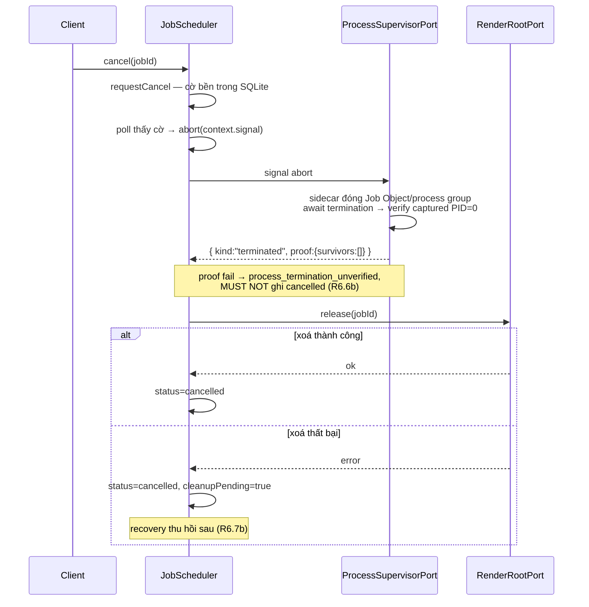
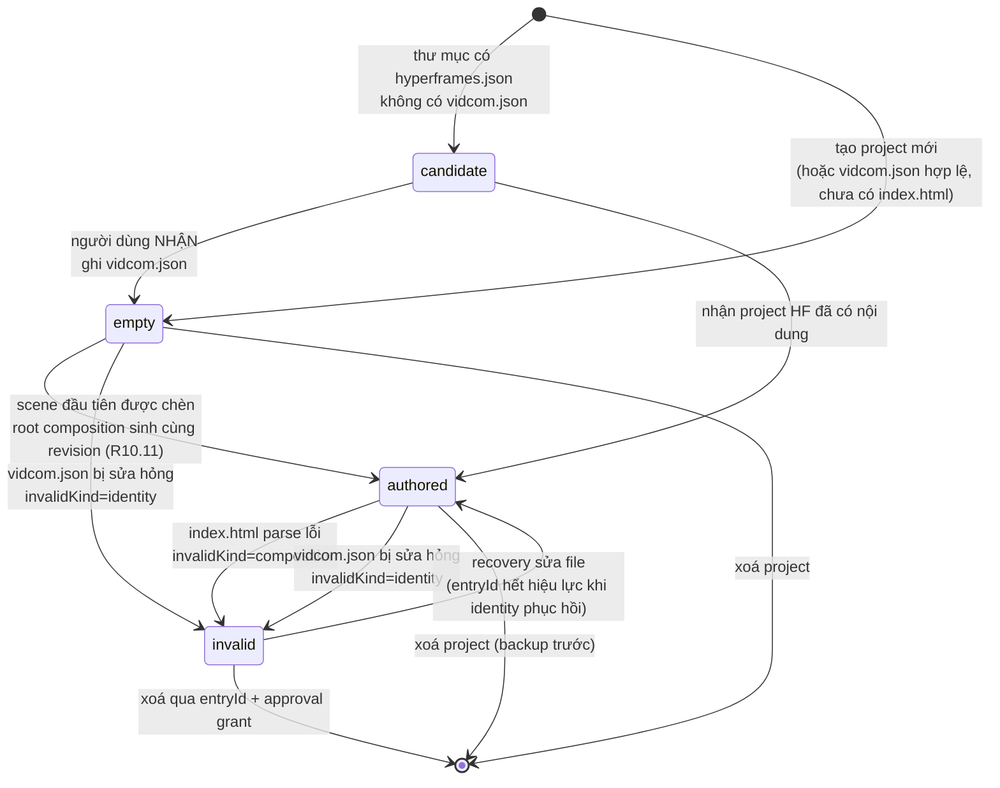
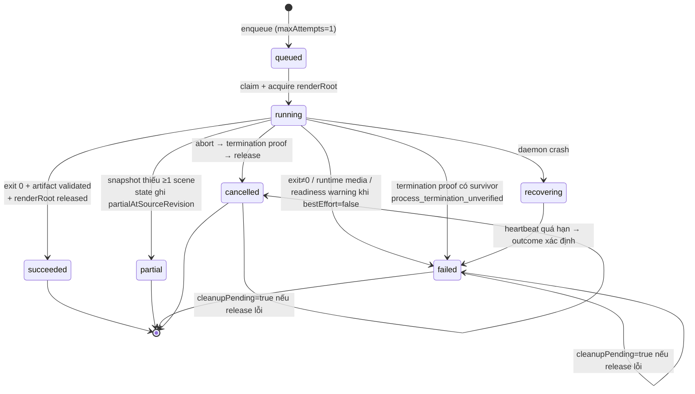
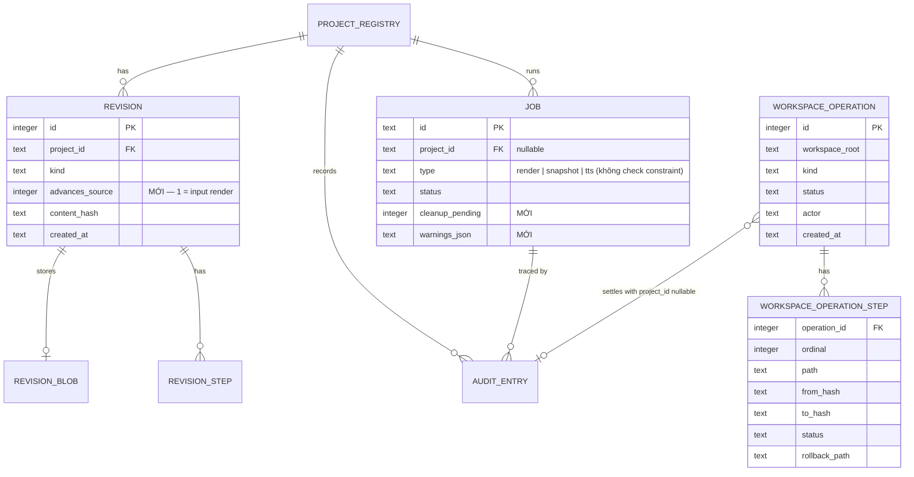

# Spec Project Delivery Loop — Detail Design

> **Reference**: [Detailed Goals](./spec-project-delivery-loop-detailed-goal.md) — **Approved 2026-08-04**
> **Next**: `spec-project-delivery-loop-implementation-checklist.md` — chưa tạo, bị Phase Gate `Design → Implement` chặn
> **Bản 2 — 2026-08-04.** Deep review trên code thật + 8 spike contract: sửa cancel từ `ProcessTreeInspector` không khả thi sang `ProcessSupervisorPort` với Windows Job Object sidecar đã chạy thật; thêm runtime media guard CSP + loopback report + external-dependency observer; đổi migration `job` sang table-rebuild để có terminal `partial`; đổi journal workspace từ per-file sang operation + step; cô lập snapshot theo scene; bổ sung directory lifecycle và API recovery còn thiếu. Evidence: [spike Detailed Design](../../../../spikes/phase-3-detailed-design/README.md).
> **Bản 1 — 2026-08-04.** Viết sau khi Goals được duyệt và **cả hai spike gate PASS**: [render](../../../../spikes/phase-3-render/README.md), [ma trận host](../../../../spikes/phase-3-agent-kit-host/README.md).

---

## 1. Overview

Spec này bổ sung **năm năng lực mới** vào backend đã có (Phase 1 nền móng, Phase 2 MCP) và **đổi một luật nền**:

1. **Đổi định nghĩa "project tồn tại"** — `vidcom.json` thành marker, workspace mở được ở folder trống, project hợp lệ khi chưa có nội dung (R1, R3, R5).
2. **Hai job type mới đi qua process con** — `render` và `snapshot`, cả hai gọi `hyperframes` CLI qua `ProcessSupervisorPort`, cả hai chạy trong render root do VidCom sở hữu (R6, R7).
3. **Tách `sourceRevision` khỏi output** — một cột boolean trên `revision` quyết định revision nào là *input render*, và mọi dữ liệu dẫn xuất so với nó thay vì mang cờ stale (R4, R7, R9).
4. **Một scope ghi thứ hai sau cùng facade** — `WriteAuthority.mutateWorkspace()` cho agent-kit ở gốc workspace: atomic composite + precondition + audit + crash recovery, **không** revision, **không** backup; coordinator/journal nội bộ tách khỏi project (R13).
5. **Surface năm MCP tool (bốn mới + mở rộng một tool có sẵn) + agent-kit hai manifest** — mapping do evidence, không do quy ước (R12, R13).

Cách tiếp cận xuyên suốt: giữ nguyên journal project của Phase 2, nhưng **không ép expand-only khi AC đòi đổi invariant đang bị CHECK khoá**. `mutation_journal`, `revision_step`, `mutation_step` không đổi cấu trúc; `job` được table-rebuild có kiểm soát để thêm terminal `partial`, còn scope workspace dùng journal operation/step riêng. Lý do trong Decision 3 và Decision 4.

**Links to Requirements**

| Goal | Design element |
|---|---|
| R1 workspace & marker | §5.1 `WorkspaceResolver` · §5.2 `WorkspaceScanner` · §5.3 `EntryRegistry` · §4.3.1 flow |
| R2 preset platform | §5.4 `PlatformPresetCatalog` · §6.2 `PlatformConfig` |
| R3 `vidcom.json` | §5.5 `ProjectIdentityService` · §6.2 · §6.4 (không có bảng — file) |
| R4 `.vidcom/` | §5.6 `ProjectStateStore` · §6.3 · Decision 5 |
| R5 project CRUD | §5.7 `ProjectLifecycle` + `ProjectDirectoryPort` · §4.4.1 state diagram |
| R6 render MP4 | §5.8 `RenderJobRunner` · §5.9 `RenderRootPort`/`ProcessSupervisorPort` · §5.10 `RemoteAssetGuard` · §4.3.2 · Decision 6, 7, 8 |
| R7 snapshot | §5.11 `SnapshotJobRunner` · §6.3.2 `SnapshotState` |
| R8 thumbnail | §5.12 `ThumbnailResolver` |
| R9 diagnostics | §5.13 `DiagnosticsService` |
| R10 scene insert/ripple | §5.14 `SceneTimingService` · Decision 9 |
| R11 narration nhiều cue | §5.15 `NarrationCueService` · §6.2.4 |
| R12 năm MCP tool | §5.16 registry additions · §7.2 |
| R13 agent-kit | §5.17 `AgentKitInstaller` · §5.18 `WriteAuthority.mutateWorkspace` · Decision 4 |

---

## 2. Design Scope

### In Scope

- Đổi luật marker và workspace resolution, kèm `entryId` cho project không đọc được identity.
- Schema `vidcom.json` v1 + catalog preset + backfill cho project cũ.
- `.vidcom/` per-project: `state.json`, `context/`, ba loại `.jsonl` append-only, `cache/`.
- Tách `sourceRevision` khỏi ghi dẫn xuất (một cột + một index + một port method).
- `render` và `snapshot` job: enqueue, progress, cancel, recovery, render root sở hữu, orphan reclaim.
- Quét remote media tĩnh trước enqueue **và** chặn/report media động bằng CSP trong chính lượt render.
- Diagnostics service: port 4 lint hiện có sang Core + 4 diagnostic mới + tích hợp `hyperframes check`.
- Scene insert tại vị trí + ripple **theo track** + timing invariant.
- Narration nhiều cue mỗi scene, đọc ngược được sidecar một-cue.
- Bốn MCP tool mới + mở rộng `get_job_status` hiện có; không register trùng tên.
- Agent-kit: nội dung, build, hai manifest theo host, ba operation `install`/`link`/`replace`, scope ghi workspace.
- Ba deliverable sửa steering (07 §2/§6, 07 §3, 14 §8).

### Out of Scope

| Không thiết kế | Vì sao |
|---|---|
| Node SEA, nhúng frontend, bỏ Next | PK-6/PK-7 — Giai đoạn 4. Design này giả định entrypoint `vidcom` là CLI/executable, không giả định nó đã là một file |
| Vendor GSAP/font, chặn network toàn phần | R6.15b thu hẹp có chủ đích; đóng lỗ thuộc Giai đoạn 4 |
| Fingerprint per-scene cho snapshot | R7.9c chốt dùng `sourceRevision` toàn project; tối ưu thuộc Giai đoạn 5 |
| Undo/redo cấp composition, kéo-thả timeline | CE-8, SC-6/7 — Giai đoạn 5 |
| Agent chạy trong app (PTY, streaming) | AI-1..14 — Giai đoạn 6 |
| Sửa `mutation_journal` / `revision_step` / composite recovery project của Phase 2 | Decision 3 và 4 — journal workspace là cặp bảng riêng |
| Workspace lock/lease qua IPC, single-writer daemon | PK-4 — Giai đoạn 4; lease per-workspace của Phase 1 dùng nguyên trạng |

---

## 3. Research Summary

> Chỉ ghi phát hiện **thật sự đổi thiết kế**. Mười finding dưới đây đến từ code hiện tại hoặc bằng chứng chạy thật, không từ suy đoán.

### Finding 1: Contract tree-kill đã có, nhưng implementation không cung cấp bằng chứng hoàn tất

- **Context**: R6.6b đòi kill cả cây tường minh. Câu hỏi là cần port mới hay không.
- **Key insight**: Hợp đồng [`process-port.ts:31-41`](../../../../packages/core/src/port/process-port.ts#L31-L41) nói abort kill cả cây, nhưng Windows implementation [`node-process-runner.ts:87-99`](../../../../packages/adapter/src/runtime/node-process-runner.ts#L87-L99) gọi `taskkill` bằng `spawn(...).unref()` rồi chỉ đợi direct child `close`. `ProcessRunOutput` không có PID/termination report; caller không thể thực hiện sequence của Design v1.
- **Remediation verified**: [`job-object-contract.ps1`](../../../../spikes/phase-3-detailed-design/job-object-contract.ps1) dùng Win32 `CreateProcess(CREATE_SUSPENDED)` → assign Job Object có `KILL_ON_JOB_CLOSE` → resume. Đóng handle giết đủ root/child/grandchild, survivors `[]`; việc assign xảy ra trước byte code của root nên không có race spawn-con trước-assign.
- **Impact on design**: Không thêm inspector chỉ đọc ở Core. Thay bằng `ProcessSupervisorPort`: Windows adapter gọi sidecar supervisor bundled theo từng process run; sidecar sở hữu trọn lifecycle create-suspended → assign → resume → terminate/verify. Proof fail là `process_termination_unverified`, không phải `cancelled`. → §5.9.

### Finding 2: `job.type` không có check, nhưng `job.status` và `revision.kind` đều có check

- **Context**: Goals ghi "kiểm check constraint có phải table-rebuild như Phase 2 đã gặp".
- **Key insight**: [`schema.ts:236`](../../../../packages/adapter/src/db/schema.ts#L236) — `type: text().notNull()` **không** có `check()`. Thêm `render`/`snapshot` là **không migration**. Ngược lại `revision.kind` **có** `ck_revision_kind` ([`schema.ts:113`](../../../../packages/adapter/src/db/schema.ts#L113)) nên thêm giá trị vào `kind` **sẽ** cần table-rebuild.
- **Impact on design**: (a) Hai job type mới miễn phí về schema. (b) Tách source/derived dùng cột `advances_source` với CHECK `IN (0,1)`. (c) R7.9b bắt terminal `partial`, nên `job` **phải table-rebuild** để mở `ck_job_status`; ba `ADD COLUMN` của v1 không đủ. → §6.4–6.5.

### Finding 3: HyperFrames không expose workdir, nhưng nhận `TEMP`/`TMP`

- **Context**: R6.7b cần marker sở hữu ở render root.
- **Key insight**: Spike Node 24 ([render README §Kiểm lại](../../../../spikes/phase-3-render/README.md)) — HyperFrames 0.7.86 tự `mkdtemp(<os.tmpdir()>/hf-render-)` và không trả đường dẫn đó ra. Nhưng đặt `TEMP`/`TMP` vào một root do VidCom tạo thì orphan `hf-render-*` **nằm trong** root đó.
- **Impact on design**: Marker nằm ở **render root theo job do VidCom tạo**, không phải bên trong workdir của HyperFrames. Bốn điều kiện của R6.7b áp lên root của VidCom. → §5.9.

### Finding 4: Hai host đọc hai thư mục khác nhau, và chỉ một host theo dòng import

- **Context**: OQ-6 — một thư mục chung hay hai.
- **Key insight**: [Ma trận host](../../../../spikes/phase-3-agent-kit-host/README.md) — Codex chỉ nạp `.agents/skills`, Claude Code chỉ nạp `.claude/skills`; và Codex **không** theo dòng `Read and follow ./AGENTS.vidcom.md.` (`LINK_NOT_FOLLOWED`) còn Claude Code **theo** `@CLAUDE.vidcom.md`. Cả hai parse được frontmatter lạ `x-vidcom-agent-kit`.
- **Impact on design**: Hai manifest riêng theo host, không phải một. `link` là operation **chỉ của Claude Code**; recovery của Codex là `manual_merge`. `usableBy` phải suy từ **router native được discover**, không từ file chỉ dẫn chính — vì cả hai host gọi được probe từ skill dù file chỉ dẫn vắng mặt. → §5.17, Decision 10.

### Finding 5: `audit_entry.project_id` và `job.project_id` đã nullable

- **Context**: Ghi ở scope workspace không có `projectId`.
- **Key insight**: [`schema.ts:267`](../../../../packages/adapter/src/db/schema.ts#L267) và [`schema.ts:235`](../../../../packages/adapter/src/db/schema.ts#L235) đều `references()` **không** `notNull()`. Nhưng `mutation_journal.project_id` ([`schema.ts:41`](../../../../packages/adapter/src/db/schema.ts#L41)) và `revision.project_id` ([`schema.ts:101`](../../../../packages/adapter/src/db/schema.ts#L101)) **đều** `notNull()`.
- **Impact on design**: Audit của agent-kit install dùng lại `audit_entry` nguyên trạng. Journal project không dùng lại được — và không nên nới, vì nó đòi `projectId`. Scope workspace dùng cặp `workspace_operation` + `workspace_operation_step`, giữ operation identity và rollback payload cho cả batch. → Decision 4.

### Finding 6: Cancel request bền chưa abort signal của process đang chạy

- **Evidence**: [`job-cancellation-contract.ts`](../../../../spikes/phase-3-detailed-design/job-cancellation-contract.ts) chạy `JobScheduler` + `NodeProcessRunner` thật. Sau request cancel 500 ms job vẫn `running`; nó chỉ thành `cancelled` sau **3102 ms**, khi child tự exit. `JobScheduler` hiện chỉ kiểm cờ trước/sau `definition.run()`; `AbortController` chỉ dùng timeout.
- **Impact on design**: Scheduler có `CANCELLATION_POLL_MS` có tên, poll cờ bền trong lúc handler chạy và abort `context.signal`. `cancelled` chỉ được persist sau khi handler/`ProcessSupervisorPort` trả proof tree đã dừng và cleanup đã được thử. Không để từng handler tự phát minh vòng poll.

### Finding 7: DDL v1 không thực hiện được terminal snapshot `partial`

- **Evidence**: [`migration-contract.ts`](../../../../spikes/phase-3-detailed-design/migration-contract.ts) áp đúng ba `ADD COLUMN` của v1 trên SQLite thật. Default revision cũ đúng bằng `1`, nhưng `UPDATE job SET status='partial'` fail vì `ck_job_status`; đồng thời `advances_source=7` và JSON lỗi đều được nhận vì DDL không mang CHECK đã hứa.
- **Remediation verified**: [`migration-remediation.ts`](../../../../spikes/phase-3-detailed-design/migration-remediation.ts) table-rebuild `job` trong transaction, giữ hàng cũ, nhận `partial`, và từ chối boolean/JSON lỗi. `revision` vẫn expand-only bằng `ADD COLUMN ... CHECK`.
- **Impact on design**: Một table-rebuild có migration/rollback riêng; không còn tuyên bố toàn bộ migration expand-only.

### Finding 8: Static scanner bỏ lọt media chỉ xuất hiện lúc browser runtime

- **Evidence**: [`runtime-remote-media.mjs`](../../../../spikes/phase-3-detailed-design/runtime-remote-media.mjs) tạo `Image()` bằng JS sau khi document chạy. HTML/CSS scanner thấy 0 URL, server localhost nhận request, HyperFrames exit 0 và stdout/stderr không nêu URL.
- **Remediation verified**: [`runtime-media-csp-guard.mjs`](../../../../spikes/phase-3-detailed-design/runtime-media-csp-guard.mjs) inject CSP `img-src`/`media-src` chỉ local + listener `securitypolicyviolation` gửi về loopback channel nonce-bound của VidCom. Trong **chính lượt render**, asset server nhận 0 byte request, report mang đúng URL/directive, HyperFrames vẫn exit 0 để VidCom có thể discard staging artifact và trả `remote_asset_not_local`.
- **External dependency observation verified**: [`runtime-external-observer.mjs`](../../../../spikes/phase-3-detailed-design/runtime-external-observer.mjs) bắt đúng script external tạo bằng DOM ở runtime qua `PerformanceObserver`. Probe đầu tiên tự quan sát request callback và tạo vòng lặp; bản đúng phải loại callback URL, lọc initiator type, dedupe và cap report.
- **Impact on design**: `RemoteAssetScanner` đổi thành `RemoteAssetGuard`: static preflight + runtime CSP/report + resource observer. Callback chỉ bind loopback, dùng token theo job, dedupe/cap và đóng trước khi công bố artifact; token **không** được one-shot vì một render có thể có nhiều report.

### Finding 9: `hyperframes snapshot` luôn sinh contact sheet cho mỗi invocation

- **Evidence**: [`snapshot-cli-contract.mjs`](../../../../spikes/phase-3-detailed-design/snapshot-cli-contract.mjs) capture đúng midpoint `1.5s`, exit 0, nhưng output gồm cả `frame-00-at-1.5s.png` **và** `contact-sheet.jpg`.
- **Impact on design**: Chạy một invocation/output staging riêng cho từng scene cần retry; chỉ lấy PNG, bỏ contact sheet do CLI sinh. VidCom chỉ ghép contact sheet cuối sau khi mọi scene của generation hiện tại đủ. Như vậy một scene fail không thể công bố sheet thiếu.

### Finding 10: Journal per-file không đủ thông tin để rollback một operation nhiều file

- **Context**: `install` có thể ghi manifest + router + sáu skill trong một request; R12.10b bắt mutation fail → composite rollback.
- **Key insight**: Bảng v1 có một row/path, không có operation id, ordinal, rollback path hay previous payload. Cùng một tập row không phân biệt được “hai operation độc lập” với “một batch hai file”, nên recovery không thể biết phải rollback cùng nhau.
- **Impact on design**: `workspace_operation` là header batch; `workspace_operation_step` giữ ordinal, from/to hash, rollback path/captured hash và trạng thái. Authority dùng cùng protocol capture → publish → settle như composite project, nhưng không tạo revision/backup.

---

## 4. Architecture

### 4.1 System Overview

Không có tầng mới. Mọi năng lực mới rơi vào đúng bốn chỗ đã có của [steering/03](../../../steering/03-architecture-ddd.md): **domain** (invariant thuần), **usecase** (một thao tác người dùng/AI), **port** (seam ra ngoài), **adapter** (hiện thực). Hai đường vào — HTTP (Hono) và MCP (Tool Registry) — gọi **cùng** usecase; đây là luật MP-2 của Phase 2 và spec này không mở ngoại lệ.

Ba đường mới đáng gọi tên:

- **Job có process con.** `render` và `snapshot` là hai job type đầu tiên spawn Chromium/FFmpeg. `JobScheduler` nối cancel bền vào `AbortSignal`; `ProcessSupervisorPort` chỉ kết thúc abort sau khi cây process đã được kill và verify. `RenderRootPort` cấp thư mục marker và recovery thu hồi nó.
- **Ghi dẫn xuất.** `.vidcom/state.json`, `context/**`, `snapshots/**`, `renders/**` đi qua `WriteAuthority` để có atomic + audit, nhưng **không** làm `sourceRevision` tiến.
- **Scope workspace.** Agent-kit ghi ngoài mọi project, qua `mutateWorkspace`, có composite rollback + hash precondition + audit và **không** có revision/backup.

### 4.2 Component Diagram

```mermaid
flowchart TB
    subgraph entry["Đường vào — cùng usecase, không có đường thứ hai"]
        HTTP["Hono routes<br/>packages/server"]
        MCP["Tool Registry<br/>packages/mcp"]
        CLI["vidcom CLI<br/>packages/cli"]
    end

    subgraph uc["Usecase — packages/core/src/usecase"]
        WSU["resolveWorkspace<br/>scanWorkspace"]
        PLC["ProjectLifecycle<br/>create · adopt · rename · delete"]
        RJ["render / snapshot<br/>job handlers"]
        DIA["DiagnosticsService"]
        SCN["SceneTimingService<br/>insert · ripple"]
        NAR["NarrationCueService"]
        AKI["AgentKitInstaller"]
    end

    subgraph dom["Domain — thuần, không I/O"]
        PRE["PlatformPresetCatalog"]
        INV["timing invariants<br/>per-track ripple"]
        PP["pathPolicy<br/>+2 purpose mới"]
        PCTX["project-context<br/>renderer"]
    end

    subgraph svc["Service — packages/core/src/service"]
        WA["WriteAuthority facade<br/>source · derived · workspace"]
        WWA["WorkspaceMutationCoordinator<br/>internal workspace journal"]
        JS["JobScheduler<br/>đã có"]
        ER["EntryRegistry<br/>in-memory, theo phiên"]
        RRG["RemoteAssetGuard<br/>static + runtime CSP"]
    end

    subgraph port["Port"]
        WSP["WorkspacePort"]
        PROC["ProcessSupervisorPort<br/>kill + verify proof"]
        RRP["RenderRootPort"]
        PDP["ProjectDirectoryPort"]
        JSP["JobStorePort"]
        MJP["MutationJournalPort"]
        WMP["WorkspaceOperationJournalPort<br/>MỚI"]
        CMP["CompositionPort"]
    end

    subgraph adp["Adapter"]
        FS["WorkspaceFs"]
        HF["hyperframes CLI<br/>render · snapshot · check"]
        RRF["FsRenderRootAdapter"]
        PDF["FsProjectDirectoryAdapter"]
        SQL[("SQLite<br/>vidcom.sqlite")]
        AKB["agent-kit bundle<br/>+ manifest hash")]
    end

    HTTP --> uc
    MCP --> uc
    CLI --> uc
    uc --> dom
    uc --> svc
    svc --> port
    RJ --> RRG
    RJ --> RRP
    RJ --> PROC
    PROC --> HF
    WA --> MJP
    WWA --> WMP
    WWA --> PDP
    MJP --> SQL
    WMP --> SQL
    JSP --> SQL
    WSP --> FS
    RRP --> RRF
    PDP --> PDF
    PLC --> WA
    AKI --> AKB
    AKI --> WA
    WA --> WWA
```

Ranh giới **không** hiển nhiên, nên nói rõ:

- `WriteAuthority` là **facade ghi duy nhất** mà usecase được inject. `mutateWorkspace()` delegate vào `WorkspaceMutationCoordinator` nội bộ với journal operation/step riêng: vẫn composite + recoverable, nhưng không revision/backup và không bịa `projectId`. Coordinator MUST NOT được inject thẳng vào installer/route/MCP.
- `EntryRegistry` sống **trong bộ nhớ daemon**, không có bảng. R1.2c-iii yêu cầu `entryId` chỉ sống trong phiên; persist nó là tạo một định danh thứ hai bền song song với `ProjectId`.
- Kill và verify **không tách thành hai port**: nếu caller chỉ nhận `rootPid` sau spawn hoặc query sau khi parent chết, nó không còn snapshot đáng tin của cây. `ProcessSupervisorPort` sở hữu cả hai và chỉ trả terminal proof khi các PID đã capture đều không còn sống.
- `RenderRootPort` và `ProjectDirectoryPort` là port Core; mkdir/rename/remove/marker nằm ở adapter. Core MUST NOT import `node:fs` chỉ vì class có chữ “Manager”.

### 4.3 Data Flow

#### 4.3.1 Workspace resolution + scan (R1)


Dòng `cwd-project`/`cwd-solo` nằm **trên** `active` là chỗ lệch steering/07 §3 đã duyệt (OQ-9). Và chúng xét **sự có mặt** của file, không xét tính hợp lệ — nếu xét hợp lệ thì một dấu phẩy sai trong `vidcom.json` sẽ làm app âm thầm mở workspace khác (R1.2e).

#### 4.3.2 Render job — happy path và cancel (R6)




### 4.4 State / Lifecycle Flow

#### 4.4.1 Project state (R1 §4.4)



`authored` **không** đồng nghĩa "có scene": `authored` + 0 scene là trạng thái hợp lệ (root duration 0, [steering/03 §2.1](../../../steering/03-architecture-ddd.md)) và ba đường xử lý nó khác nhau có chủ đích — render từ chối, snapshot thành công rỗng, diagnostics trả `no-scenes` (R6.2b, R7.2b, R9.8b).

#### 4.4.2 Job lifecycle với cleanup (R6.6b, R6.7b)



Recovery lúc khởi động chạy **hai** việc độc lập: requeue/finalize job treo (đã có từ Phase 1, `recoverStale`), và **thu hồi render root mồ côi** theo bốn điều kiện R6.7b (mới). Cái thứ hai không phụ thuộc cái thứ nhất — một root có thể mồ côi trong khi job của nó đã kết thúc sạch, nếu `release` từng thất bại.

### 4.5 Integration Points

| System | Direction | Protocol | Purpose |
|---|---|---|---|
| `hyperframes render` | out | child process, argv | Render MP4 (R6) |
| `hyperframes snapshot` | out | child process, argv | Snapshot theo scene + contact sheet (R7) |
| `hyperframes check` | out | child process, argv | Nguồn lint thứ hai của diagnostics (R9.3) |
| FFmpeg / FFprobe | out | gián tiếp qua hyperframes, resolve bằng `HYPERFRAMES_FFMPEG_PATH` | Encode + probe (Finding: PK-7 có đường vào sẵn) |
| Chromium (`chrome-headless-shell`) | out | gián tiếp qua hyperframes | Capture frame |
| Codex CLI / Claude Code | in | đọc file ở gốc workspace + MCP stdio/HTTP | Harness học việc + gọi tool (R12, R13) |
| SQLite `vidcom.sqlite` | both | Drizzle | Job, revision, audit, event, registry, workspace mutation |
| Filesystem workspace | both | `WorkspacePort` | Project, `.vidcom/`, agent-kit |

### 4.6 Technology Stack

| Layer | Technology | Rationale |
|---|---|---|
| Render / snapshot engine | `hyperframes` CLI 0.7.86 qua `ProcessPort` | Spike PASS đầu-cuối; tree-kill và `artifact validated` đã có. Decision 6 |
| Job queue | `JobScheduler` + `JobStorePort` đã có | Thêm hai type là **không migration** (Finding 2) |
| Persistence vận hành | SQLite + Drizzle, một file `vidcom.sqlite` | [steering/07 §9](../../../steering/07-data-and-storage.md); authority theo OQ-1 |
| Ghi workspace | `WorkspaceOperationJournalPort` + header/step tables | Decision 4 — batch recoverable, không nới journal project |
| Validation biên | zod strict trong `packages/contracts` | SE-4 đã có; preset và `vidcom.json` dùng cùng khuôn |
| Agent-kit bundle | asset nhúng lúc build + manifest hash trong binary | §4.6 Goals Luật 2 — không lock file trong workspace |

---

## 5. Components and Interfaces

> Signature ở đây cố ý **đủ cụ thể để checklist map 1:1 sang file**. Path là vị trí dự kiến trong repo hiện tại.

### 5.1 `WorkspaceResolver` — `packages/core/src/domain/workspace-resolver.ts` (sửa)

- **Purpose**: Thực hiện đúng bảng quyết định 8 dòng của R1, thay logic 3 nhánh hiện tại.
- **Responsibilities**: xếp hạng candidate; phân biệt `cwd-project`/`cwd-solo`; phát cảnh báo khi active không đọc được; trả `source`.
- **Public interface**:
  ```ts
  export type WorkspaceSource = "explicit" | "cwd-project" | "cwd-solo" | "active" | "cwd";

  export interface WorkspaceCandidate {
    root: AbsolutePath;
    readable: boolean;              // thay `valid` — R1.10(a): đọc được là đủ
    hasIdentityFile: boolean;       // R1.2e: sự có mặt, KHÔNG xét hợp lệ
    parentReadable: boolean;
  }

  export interface WorkspaceResolutionInput {
    explicit?: WorkspaceCandidate | null;
    cwd?: WorkspaceCandidate | null;
    active?: WorkspaceCandidate | null;
  }

  export type WorkspaceResolution =
    | { status: "resolved"; root: AbsolutePath; source: WorkspaceSource;
        openProject: AbsolutePath | null; warnings: WorkspaceWarning[] }
    | { status: "error"; code: ErrorCode; path: string; reason: string };

  export function resolveWorkspace(input: WorkspaceResolutionInput): WorkspaceResolution;
  ```
- **Dependencies**: không — hàm thuần, không I/O. Composition root nạp candidate.
- **Lifecycle**: stateless.

### 5.2 `WorkspaceScanner` — `packages/core/src/usecase/scan-workspace.ts` (mới)

- **Purpose**: Quét **một cấp** và phân loại từng thư mục con thành project / candidate / bỏ qua.
- **Public interface**:
  ```ts
  export type ProjectState = "empty" | "authored" | "invalid";
  export type InvalidKind = "identity" | "composition";

  export interface InvalidReason {
    code: "identity_parse_error" | "composition_parse_error";
    line?: number;
    column?: number;                // MUST NOT chứa stack trace (R1.2c)
  }

  export type WorkspaceEntry =
    | { kind: "project"; projectId: ProjectId; slug: string; state: "empty" | "authored";
        platform: PlatformConfig | null; sceneCount: number }
    | { kind: "project"; projectId: ProjectId; slug: string; state: "invalid";
        invalidKind: "composition"; invalidReason: InvalidReason }
    | { kind: "project"; projectId: null; entryId: EntryId; slug: string; state: "invalid";
        invalidKind: "identity"; invalidReason: InvalidReason }
    | { kind: "candidate"; slug: string };

  export function scanWorkspace(
    deps: { workspace: WorkspacePort; identity: ProjectIdentityService; entries: EntryRegistry },
    root: AbsolutePath,
  ): Promise<WorkspaceEntry[]>;
  ```
- **Configuration**: bỏ qua `node_modules`, `.git`, `.hyperframes`, mọi dir bắt đầu bằng `.` (R1.9).
- **Lifecycle**: per-request; kết quả cache theo file watcher event, **không** stat toàn cây (R1.12).

### 5.3 `EntryRegistry` — `packages/core/src/service/entry-registry.ts` (mới)

- **Purpose**: Cấp và resolve `entryId` cho project không đọc được identity (R1.2c-iii).
- **Responsibilities**: mint opaque token; map token → đường dẫn đã containment-check; **thu hồi** token khi identity phục hồi.
- **Public interface**:
  ```ts
  export type EntryId = Brand<string, "EntryId">;

  export class EntryRegistry {
    constructor(private ids: IdPort);
    /** Idempotent theo (workspaceRoot, slug) trong một phiên. */
    mint(workspaceRoot: AbsolutePath, slug: string, root: AbsolutePath): EntryId;
    /** `null` khi token không thuộc phiên này hoặc đã bị thu hồi. */
    resolve(id: EntryId): { workspaceRoot: AbsolutePath; slug: string; root: AbsolutePath } | null;
    /** Gọi sau khi recovery ghi được `vidcom.json` hợp lệ. */
    revoke(id: EntryId): void;
    /** Xoá toàn bộ khi đổi workspace (R1.13). */
    clear(): void;
  }
  ```
- **Lifecycle**: singleton theo phiên daemon. **Không có bảng** — persist nó là tạo định danh bền thứ hai song song `ProjectId`.

### 5.4 `PlatformPresetCatalog` — `packages/core/src/domain/platform-preset.ts` (mới)

- **Public interface**:
  ```ts
  export type PresetId = "vertical-shorts" | "horizontal-youtube" | "custom";
  export type Orientation = "vertical" | "horizontal";

  export interface PlatformConfig {
    presetId: PresetId;
    orientation: Orientation;
    aspectRatio: string;
    width: number; height: number; fps: number;
    targets: string[];
    recommendedMaxDurationSeconds: number | null;
  }

  export const PLATFORM_PRESETS: readonly PlatformConfig[];
  /** Từ chối lúc khởi động nếu bất kỳ preset có kích thước lẻ (R2.7). */
  export function assertCatalogEncodable(): void;
  /** Suy preset từ data-width/height khi backfill; không khớp → custom (R3.4). */
  export function inferPreset(width: number, height: number, fps: number): PlatformConfig;
  /** Bounds của custom: chẵn, 128…7680, fps 1…120 (R2.4b–4d). */
  export function validateCustom(input: { width: number; height: number; fps: number }):
    Result<PlatformConfig, DomainError>;
  ```

### 5.5 `ProjectIdentityService` — `packages/core/src/usecase/project-identity.ts` (mới, thay phần của `bootstrap-project.ts`)

- **Purpose**: Đọc/ghi/backfill `vidcom.json` với schema v1.
- **Public interface**:
  ```ts
  export interface ProjectIdentity {
    schemaVersion: 1;
    id: ProjectId;
    platform: PlatformConfig | null;
    render: { defaultPresetId: string; outputDirectory: string };
    narration: { defaultProviderId: string | null; defaultVoiceId: string | null };
    createdAt: string; updatedAt: string;
  }

  export type IdentityReadResult =
    | { ok: true; identity: ProjectIdentity }
    | { ok: false; reason: InvalidReason };          // parse lỗi → KHÔNG ghi đè (R3.3)

  export class ProjectIdentityService {
    read(root: AbsolutePath): Promise<IdentityReadResult>;
    /** Backfill `platform` từ data-*; đi qua WriteAuthority có journal (R3.4). */
    backfillPlatform(ref: ProjectRef): Promise<Result<ProjectIdentity, DomainError>>;
    /** Byte deterministic: key ổn định, indent 2, newline cuối (R3.7). */
    serialize(identity: ProjectIdentity): string;
  }
  ```
- **Configuration**: `schemaVersion` cao hơn binary → từ chối mở, MUST NOT đọc theo schema cũ (R3.9).
- **Dependencies**: `WorkspacePort`, `WriteAuthority`, `ClockPort`. Class Core không import `node:fs`; mọi root/path được resolve thành capability qua port.

### 5.6 `ProjectStateStore` — `packages/core/src/service/project-state-store.ts` (mới)

- **Purpose**: Sở hữu toàn bộ `.vidcom/` (R4).
- **Responsibilities**: tạo cấu trúc + `.gitignore`; ghi `state.json` và `context/**` qua `WriteAuthority.mutateDerived`; append `.jsonl` atomic; rotate log; rebuild projection từ SQLite.
- **Public interface**:
  ```ts
  export class ProjectStateStore {
    ensure(ref: ProjectRef): Promise<void>;                       // R4.1, R4.1b
    readState(ref: ProjectRef): Promise<ProjectStateFile | null>;
    /** Qua WriteAuthority; MUST NOT làm sourceRevision tiến (R4.4). */
    writeState(ref: ProjectRef, next: ProjectStateFile): Promise<Result<void, DomainError>>;
    /** Deterministic, không absolute path / timestamp / jobId / secret (R4.3b). */
    writeContext(ref: ProjectRef, ctx: ProjectContext): Promise<Result<void, DomainError>>;
    appendJobEvent(ref: ProjectRef, line: JobLogLine): Promise<void>;      // R4.5
    appendRevision(ref: ProjectRef, line: RevisionLogLine): Promise<void>;
    log(ref: ProjectRef, line: StructuredLogLine): Promise<void>;          // MUST NOT có secret (R4.7)
    pruneLogs(ref: ProjectRef, retentionDays: number): Promise<{ deleted: number }>;
    /** So projection với SQLite; rebuild một chiều SQLite → .vidcom (R4.8b). */
    reconcile(ref: ProjectRef): Promise<ReconcileReport>;
  }
  ```
- **Lifecycle**: singleton; nhận `WriteAuthority` và `MutationJournalPort` (chỉ đọc, để rebuild).
- **Phân loại source/derived nằm trong authority, không ở caller**: `WriteAuthority` expose hai method khác tên `mutateSource(...)` và `mutateDerived(...)`; caller **không** được truyền boolean `advancesSource`. Method đầu luôn persist `advances_source=1`, method sau luôn persist `0`. Allowlist compile-time + test integration khóa `state.json`, `context/**`, `snapshots/**`, `renders/**` vào đường derived; như vậy một caller mới không thể vô tình tự chọn sai cờ.

### 5.7 `ProjectLifecycle` — `packages/core/src/usecase/project-lifecycle.ts` (mới)

- **Public interface**:
  ```ts
  export class ProjectLifecycle {
    /** Một composite mutation: vidcom.json + hyperframes.json + preview-settings.json + root composition (R5.1). */
    create(input: { workspaceRoot: AbsolutePath; name: string; preset: PlatformConfig }):
      Promise<Result<{ projectId: ProjectId; slug: string }, DomainError>>;
    /** Chỉ ghi vidcom.json; MUST NOT sửa file nội dung của người dùng (R5.6). */
    adopt(input: { workspaceRoot: AbsolutePath; slug: string }):
      Promise<Result<{ projectId: ProjectId }, DomainError>>;
    /** Giữ nguyên ProjectId (R5.10). */
    rename(target: ProjectLocator, nextName: string): Promise<Result<{ slug: string }, DomainError>>;
    /** Backup verify được TRƯỚC khi chạm đĩa; grant nếu từ MCP (R5.7, R5.8). */
    remove(target: ProjectLocator, auth: MutationAuthority): Promise<Result<{ backupId: string }, DomainError>>;
  }

  /** Recovery nhận entryId; nghiệp vụ chỉ nhận ProjectId (R1.2c-iv). */
  export type ProjectLocator =
    | { kind: "project"; projectId: ProjectId }
    | { kind: "entry"; entryId: EntryId };
  ```
- **Dependencies**: chỉ nhận facade `WriteAuthority` cho mọi ghi, cùng `WorkspacePort`, `BackupPort`, `ApprovalService`, `EntryRegistry`, `JobStorePort`. `ProjectDirectoryPort` và `WorkspaceOperationJournalPort` là dependency nội bộ của coordinator sau facade, MUST NOT inject thẳng vào usecase.
- **Protocol create**: `WriteAuthority.createProjectRoot(...)` begin operation bền → dựng toàn bộ project trong sibling staging dot-dir → validate hash/schema → commit registration + đúng một revision + audit/event → atomic rename staging thành slug. `vidcom.json` chỉ xuất hiện trong final root cùng toàn bộ file còn lại. Crash trước rename để lại staging bị scanner bỏ qua; crash sau rename có đủ file và recovery settle DB.
- **Protocol rename**: `WriteAuthority.renameProjectRoot(...)` journal `{fromSlug,toSlug,projectId}` trước I/O → atomic directory rename → transaction cập nhật registration + audit/event + settle. Recovery nhìn old/new root, không mint ID mới.
- **Protocol delete**: verify backup trước → `WriteAuthority.deleteProjectRoot(...)` journal → atomic rename root sang quarantine dot-dir sở hữu → transaction gỡ registration + audit/event + settle → dọn quarantine. Recovery restore hoặc hoàn tất; không recursive-delete live root trực tiếp.

  ```ts
  export interface ProjectDirectoryPort {
    stageCreate(workspaceRoot: AbsolutePath, slug: string, operationId: WorkspaceOperationId): Promise<AbsolutePath>;
    publishCreate(stagingRoot: AbsolutePath, finalRoot: AbsolutePath): Promise<void>;
    rename(from: AbsolutePath, to: AbsolutePath): Promise<void>;
    quarantine(root: AbsolutePath, operationId: WorkspaceOperationId): Promise<AbsolutePath>;
    restoreQuarantine(quarantine: AbsolutePath, root: AbsolutePath): Promise<void>;
    removeOwned(path: AbsolutePath): Promise<void>;
  }
  ```

### 5.8 `RenderJobRunner` — `packages/worker/src/render-job.ts` (mới)

- **Purpose**: Handler của job type `render`.
- **Public interface**:
  ```ts
  export interface RenderJobInput {
    projectId: ProjectId;
    bestEffort: boolean;                 // mặc định true (R6.14)
    renderPresetId?: string;
  }

  export interface RenderJobResult {
    artifactPath: RelPath;
    computedAtSourceRevision: number;
    durationSeconds: number; width: number; height: number; fps: number;
    reproducible: boolean;               // false khi có external dependency (R6.15b)
    externalDependencies: string[];
    warnings: RenderWarning[];           // vào job metadata VÀ tới client (R6.14)
    runtimeMs: number;
  }

  export function createRenderJobHandler(deps: {
    process: ProcessSupervisorPort; roots: RenderRootPort;
    authority: WriteAuthority; composition: CompositionPort; assets: RemoteAssetGuard;
    binaries: BinaryProbe; state: ProjectStateStore;
  }): JobHandler<RenderJobInput, RenderJobResult>;
  ```
- **Configuration**: `maxAttempts: 1` (R6.8) · `concurrency` theo type, và **không** hai render cùng project song song (R6.11) — dùng `nextQueued(types, excluded)` đã có của `JobStorePort`.

### 5.9 `RenderRootPort` + `ProcessSupervisorPort` (mới)

- **Purpose**: R6.7b — render root sở hữu theo job, và xác minh descendant trước khi báo `cancelled`.
- **Public interface**:
  ```ts
  export const RENDER_OWNER_MARKER = ".vidcom-render-owner";
  export const RENDER_WORKDIR_ORPHAN_GRACE_SECONDS = 3600;

  export interface RenderRootPort {
    /** mkdir <stagingRoot>/<jobId>/ + ghi marker { jobId, createdAt }. */
    acquire(jobId: JobId): Promise<{ root: AbsolutePath; environment: Record<string, string> }>;
    /** Xoá root; `ok:false` → caller set cleanupPending (R6.6b). */
    release(jobId: JobId): Promise<{ ok: boolean; error?: string }>;
    /** Bốn điều kiện đồng thời; MUST NOT quét TEMP chung (R6.7b). */
    reclaimOrphans(now: Date, runningJobIds: ReadonlySet<JobId>):
      Promise<{ deleted: number; errors: { root: string; reason: string }[] }>;
  }

  export interface ProcessTerminationProof {
    reason: "abort" | "timeout";
    rootPid: number;
    capturedPids: number[];
    survivors: number[];
  }
  export type SupervisedProcessResult =
    | { kind: "exited"; output: ProcessRunOutput }
    | { kind: "terminated"; proof: ProcessTerminationProof };
  export interface ProcessSupervisorPort {
    /** Abort chỉ settle sau kill + verify; survivor → ProcessTerminationUnverifiedError. */
    run(input: ProcessRunInput): Promise<SupervisedProcessResult>;
  }
  ```
- **Adapters**: `FsRenderRootAdapter` sở hữu mkdir/marker/remove; `NodeProcessSupervisor` thay `NodeProcessRunner` ở composition root. Trên Windows, adapter spawn **một sidecar bundled theo mỗi run** (`vidcom-process-supervisor.exe`): sidecar tạo target bằng `CREATE_SUSPENDED`, assign vào Job Object `KILL_ON_JOB_CLOSE`, rồi mới resume. Abort/timeout gửi lệnh qua pipe; EOF hoặc sidecar crash cũng đóng Job Object. Sidecar trả captured PID + survivors bằng JSON framed; adapter validate schema và chỉ trả `kind:"terminated"` khi survivors rỗng. `taskkill /T /F` chỉ là emergency cleanup sau lỗi sidecar, MUST NOT tạo proof thành công. POSIX dùng process group rồi verify.
- **DG-1 — stack gate còn mở**: cơ chế Win32 đã PASS, nhưng repo hiện khóa production code ở TypeScript/Node SEA và Node không expose Job Object. Đề xuất nhỏ nhất là sidecar **C/Win32 không dependency**, source dưới `packages/adapter/sidecars/process-supervisor/windows/`, build bằng MSVC trên Windows CI và package/hash như native dependency. Phương án này cần người dùng duyệt ngoại lệ trong steering/01 trước Checklist. Nếu không duyệt native sidecar thì phải quay lại Goals và đổi R6.6b sang awaited `taskkill /T /F` + verify; Design MUST NOT tự hạ guarantee.
- **Evidence**: [`job-object-contract.ps1`](../../../../spikes/phase-3-detailed-design/job-object-contract.ps1) PASS root + child + grandchild, survivors `[]`. Implementation vẫn phải chạy adapter contract trên Node 24.9.0 và 26.5.0; không dùng `Add-Type`/PowerShell ở runtime — spike chỉ chứng minh Win32 protocol của sidecar.
- **Scheduler**: `CANCELLATION_POLL_MS = 250` có tên, poll cờ bền và abort `context.signal`; timer clear trong `finally`. Chỉ `ProcessTerminationProof.survivors=[]` mới đi vào `cancelled`.
- **Race cancel/complete**: `requestCancel` trên `queued` terminal hoá ngay thành `cancelled`; trên `running` chỉ set cờ. Handler kiểm signal/cờ lần cuối **trước publish derived composite**. Terminal settle là compare-and-swap từ `running`: nếu cancel đã được quan sát trước publish thì cancel thắng và staging bị bỏ; nếu `succeeded`/`partial` đã settle thì cancel sau đó là `no_change`. Không có trạng thái “artifact đã publish nhưng job cancelled”.
- **Lifecycle**: singleton adapter. `environment` gồm `TEMP`/`TMP`, `HYPERFRAMES_FFMPEG_PATH` và `HYPERFRAMES_FFPROBE_PATH`.

### 5.10 `RemoteAssetGuard` — scanner thuần + runtime port (mới)

- **Purpose**: R6.15 — chặn remote **media** trước khi enqueue.
- **Public interface**:
  ```ts
  export interface RemoteAssetViolation {
    url: string;
    source: "element-attribute" | "css-url" | "observed-request";
    reference: string;                   // selector hoặc file:line
  }
  export function scanRemoteMedia(documents: { path: RelPath; html: string }[],
                                 stylesheets: { path: RelPath; css: string }[]):
    RemoteAssetViolation[];
  /** Script/stylesheet/font: KHÔNG chặn, chỉ warning + reproducible:false (R6.15b). */
  export function scanExternalDependencies(documents: { path: RelPath; html: string }[]): string[];
  export interface RuntimeAssetGuardPort {
    open(jobId: JobId): Promise<{ csp: string; bootstrapScript: string; token: string }>;
    close(jobId: JobId, token: string): Promise<{
      mediaViolations: RemoteAssetViolation[];
      externalDependencies: string[];
    }>;
  }
  ```
- **Static**: quét CSS `url(...)`, local stylesheet và element attribute trước enqueue.
- **Runtime media**: document builder đặt CSP `img-src 'self' data: blob:` + `media-src 'self' data: blob:` làm phần tử đầu tiên của `<head>`, trước mọi node tác giả có thể chạy, rồi inject listener `securitypolicyviolation`. Listener POST URL/directive tới callback loopback. Guard đóng **trước publish**; violation làm bỏ staged artifact và fail `remote_asset_not_local`.
- **Runtime script/style/font**: cùng bootstrap cài `PerformanceObserver({type:"resource", buffered:true})`, chỉ nhận initiator `script | link | css | font`, loại chính callback URL, dedupe theo `(initiatorType,url)` và cap 100 entry/job. Những URL này không bị chặn ở Phase 3; chúng hợp với static list để set `reproducible:false` + warning.
- **Security**: callback chỉ bind loopback, body/entry count giới hạn, token ngẫu nhiên theo job không log, payload phải khớp job đang chạy, server đóng trong `finally`. Token không one-shot: dùng một token cho nhiều report hợp lệ trong cùng job, chống replay bằng lifecycle ngắn + dedupe. Đây là enforcement trong chính lượt render, không phải preflight hai lượt có TOCTOU.

### 5.11 `SnapshotJobRunner` — `packages/worker/src/snapshot-job.ts` (mới)

- **Public interface**:
  ```ts
  export interface SnapshotJobResult {
    outcome: "succeeded" | "partial";
    sceneCount: number;
    missingSceneIds: string[];
    contactSheet: RelPath | null;        // chỉ khi complete (R7.4)
    computedAtSourceRevision: number | null;  // null khi partial (R7.9b)
  }
  ```
- **Responsibilities**: phạm vi sinh lại theo bảng R7.9c (so `sourceRevision` với `partialAtSourceRevision`, tính lại danh sách scene trước); một scene lỗi không làm mất cả bộ; `authored`+0 scene → thành công rỗng.
- **Invocation**: mỗi scene cần sinh/retry chạy `hyperframes snapshot --at <global-midpoint> --no-end --describe false` qua cùng `ProcessSupervisorPort`, dưới staging con riêng trong render root của job. Chỉ nhận PNG; bỏ `contact-sheet.jpg` CLI tự sinh. VidCom chỉ ghép một contact sheet deterministic sau khi mọi scene của generation hiện tại đủ, rồi publish ảnh + sheet + state như một derived composite. Cancel/crash vì vậy dùng cùng containment/recovery với render, không có đường spawn Chromium thứ hai thiếu supervision.

### 5.12 `ThumbnailResolver` — `packages/core/src/usecase/thumbnail.ts` (mới)

```ts
export type Thumbnail =
  | { kind: "image"; path: RelPath; stale: boolean; etag: ContentHash }
  | { kind: "placeholder"; seed: string; seedKind: "projectId" | "slug"; invalid: boolean };
export function resolveThumbnail(entry: WorkspaceEntry, snapshots: SnapshotState | null): Thumbnail;
```
`seedKind: "slug"` chỉ dùng cho `invalidKind: "identity"` — `entryId` đổi mỗi phiên nên dùng nó làm seed sẽ đổi màu card mỗi lần khởi động (R8.2b).

### 5.13 `DiagnosticsService` — `packages/core/src/usecase/diagnostics.ts` (mới)

```ts
export interface DiagnosticsReport {
  diagnostics: Diagnostic[];
  computedAtSourceRevision: number | null;   // null cho đường entryId (R9.1)
  lintSourceAvailable: boolean;              // false → nêu rõ, KHÔNG trả rỗng (R9.4)
}
export class DiagnosticsService {
  forProject(projectId: ProjectId): Promise<DiagnosticsReport>;
  /** Đường recovery: KHÔNG gọi parser composition, KHÔNG ghi .vidcom (R9.8d, R9.8e). */
  forEntry(entryId: EntryId): Promise<DiagnosticsReport>;
}
```
Nguồn diagnostic: 4 lint port từ `src/lib` sang Core (VD-3) + `platform-mismatch` + `narration-overflow` + `missing-asset` + `no-composition`/`no-scenes` + `lint:<rule>` từ `hyperframes check`.

### 5.14 `SceneTimingService` — `packages/core/src/domain/scene-timing.ts` + usecase (mới)

```ts
export interface TrackRipplePlan {
  trackIndex: number;
  moved: { sceneId: string; fromStart: number; toStart: number }[];
  rootDuration: number;                      // max trên MỌI track (R10.2b)
}
/** Thuần, không I/O. Chỉ dịch scene TRONG một track (R10.1–3). */
export function planRipple(scenes: SceneClip[], change: TimingChange): Result<TrackRipplePlan, DomainError>;
/** Hở/chồng chỉ tính trong cùng track; chồng giữa track là hợp lệ (R10.3, R10.7). */
export function detectTrackGapsAndOverlaps(scenes: SceneClip[]): Diagnostic[];
```

### 5.15 `NarrationCueService` — `packages/core/src/usecase/narration-cues.ts` (mới)

```ts
export interface NarrationCue {
  cueId: string; text: string; voice: string;
  offsetSeconds: number; durationSeconds: number | null;
  staleSince: string | null;
  words?: WordTiming[]; wordTimingSource?: "engine" | "estimated";
}
/** Sidecar một-cue cũ đọc thành đúng một cue; MUST NOT ghi đè (R11.2). */
export function readCues(sidecar: unknown): NarrationCue[];
/** Một <audio class="clip hf-narration"> cho mỗi cue, data-start từ document (R11.3). */
export function buildNarrationClips(scene: SceneClip, cues: NarrationCue[]): NarrationClip[];
```

### 5.16 Tool Registry changes — `packages/mcp/src/registry/` (sửa + mới)

Surface gồm năm tool, mỗi tool định nghĩa **một lần**, gọi đúng usecase mà HTTP gọi (R12.1–2). `get_job_status` đã tồn tại ở `registry/job-tools.ts`; spec **mở rộng schema/description/mapper** của nó, MUST NOT register tool thứ hai cùng tên:

| Tool | Usecase | Trả về |
|---|---|---|
| `validate_project` | `DiagnosticsService.forProject` | `DiagnosticsReport` |
| `start_snapshot` | enqueue snapshot | `{ jobId }` |
| `start_render` | enqueue render | `{ jobId }` |
| `get_job_status` *(sửa)* | `JobStorePort.get` | status gồm `partial`, warnings, cleanupPending + outcome; poll có backoff |
| `install_agent_kit` | `AgentKitInstaller` | `{ operationResult, installationState }` |

### 5.17 `AgentKitInstaller` — `packages/core/src/usecase/agent-kit-install.ts` (mới)

- **Public interface**:
  ```ts
  export type Host = "codex" | "claude-code";
  export type FileState = "missing" | "current_pristine" | "current_modified" | "outdated" | "newer" | "foreign";
  export type NextAction = "none" | "install" | "replace" | "link" | "manual_merge";

  export interface AgentKitFileState {
    host: Host; relativePath: string; state: FileState;
    contentHash: ContentHash | null; nextAction: NextAction;
  }

  export type InstallAgentKitInput =
    | { operation?: "install"; hosts: [Host, ...Host[]] }
    | { operation: "link"; host: "claude-code"; expectedContentHash: ContentHash }
    | { operation: "replace"; host: Host; relativePath: string; expectedContentHash: ContentHash };

  export interface InstallAgentKitOutput {
    operationResult: { status: "applied" | "no_change";
                       changedFiles: { relativePath: string; contentHash: ContentHash }[] };
    installationState: {
      outcome: "installed" | "already_installed" | "partial" | "blocked";
      files: AgentKitFileState[];
      /** Key set MUST equal selected hosts; unselected hosts are absent (R12.9-iii). */
      usableBy: Partial<Record<Host, "ready" | "degraded" | "blocked">>;
      recovery: { host: Host; action: NextAction; detail: string }[];
    };
  }

  export class AgentKitInstaller {
    apply(workspaceRoot: AbsolutePath, input: InstallAgentKitInput):
      Promise<Result<InstallAgentKitOutput, DomainError>>;
  }
  ```
- **Boundary schema**: Zod union là `.strict()` và nhánh install dùng array `.min(1)` + unique host; tuple domain phía trên chỉ biểu diễn trạng thái đã validate. `installationState.files`, `usableBy` và `recovery` có key/row **đúng bằng** selected-host set, không trả placeholder cho host không chọn.
- **Manifest theo host** (Finding 4, R13.7-i):

  | Host | File chỉ dẫn | Thư mục skill | `link` |
  |---|---|---|---|
  | `codex` | `AGENTS.md` | `.agents/skills/**` | **không expose** — recovery là `manual_merge` |
  | `claude-code` | `CLAUDE.md` | `.claude/skills/**` | append `@CLAUDE.vidcom.md` + `expectedContentHash` |

- **Suy `usableBy`** (R13.9b–9b-i): từ **router native được discover**, không từ file chỉ dẫn chính. Cả hai host gọi được probe từ `vidcom/SKILL.md` dù file chỉ dẫn vắng mặt, nên `AGENTS.md` `foreign` **không** làm host `blocked` khi router còn nguyên.

### 5.18 `WriteAuthority.mutateWorkspace` + `WorkspaceMutationCoordinator` — `packages/core/src/service/` (sửa + mới)

- **Purpose**: R13.11 — đường ghi duy nhất vào gốc workspace.
- **Public interface**:
  ```ts
  export interface WorkspaceWriteRequest {
    workspaceRoot: AbsolutePath;
    writes: { path: RelPath; content: string; fromHash: ContentHash | null }[];
    actor: Actor;
    action: string;                     // vào audit_entry.action
  }
  export interface WorkspaceProjectCreateRequest {
    workspaceRoot: AbsolutePath; slug: string; projectId: ProjectId;
    files: { path: RelPath; content: string }[]; actor: Actor;
  }
  export interface WorkspaceProjectRenameRequest {
    workspaceRoot: AbsolutePath; projectId: ProjectId;
    fromSlug: string; toSlug: string; actor: Actor;
  }
  export interface WorkspaceProjectDeleteRequest {
    workspaceRoot: AbsolutePath; projectId: ProjectId;
    slug: string; verifiedBackupId: string; actor: Actor;
  }
  export class WriteAuthority {
    /** Facade public: composite capture/publish/rollback · precondition hash · audit. KHÔNG revision/backup. */
    mutateWorkspace(req: WorkspaceWriteRequest): Promise<Result<WorkspaceWriteEnvelope, DomainError>>;
    /** Ba method này dùng cùng operation journal/coordinator, nhưng giữ revision/audit của lifecycle. */
    createProjectRoot(req: WorkspaceProjectCreateRequest): Promise<Result<ProjectRef, DomainError>>;
    renameProjectRoot(req: WorkspaceProjectRenameRequest): Promise<Result<ProjectRef, DomainError>>;
    deleteProjectRoot(req: WorkspaceProjectDeleteRequest): Promise<Result<{ backupId: string }, DomainError>>;
  }
  ```
- **Coordinator nội bộ chọn guarantee theo method facade**: `mutateWorkspace` (agent-kit) không revision/backup nhưng vẫn composite recovery; ba method lifecycle dùng `projectId`, registration/revision/audit và backup đã verify theo R5. Journal operation/step chung biểu diễn đúng file batch lẫn directory staging/quarantine mà không nới journal Phase 2. Caller không truyền enum scope hay cờ revision.
- `WorkspaceWriteRequest` chỉ là interface nội bộ. HTTP/MCP schema **không** nhận `workspaceRoot`; composition root inject root đã resolve. Caller không thể chọn path tuyệt đối.

### 5.19 `pathPolicy` — hai purpose mới (sửa)

```ts
export type PathPurpose =
  | "read-source" | "write-source" | "read-asset" | "write-asset" | "system-write"
  | "state-write"          // MỚI: chỉ .vidcom/** trong project (R4.10)
  | "workspace-agent-kit"; // MỚI: chỉ tập file agent-kit ở gốc workspace (R13.12)
```
Cả hai **giữ** luật chặn dotfile chung và **giữ** `agents.md`/`claude.md` trong `PROTECTED_FILES` cho mọi purpose khác. Containment (canonicalize + resolve symlink) áp nguyên cho cả hai (R4.11, R13.13).

---

## 6. Data Models

### 6.0 Data Relationship Diagram



### 6.1 Persistence Overview

- **Database / datastore**: SQLite `<app-data>/vidcom.sqlite` (vận hành) + filesystem workspace (artifact và chỉ dẫn).
- **Existing schema area**: [`packages/adapter/src/db/schema.ts`](../../../../packages/adapter/src/db/schema.ts).
- **New tables**: `workspace_operation`, `workspace_operation_step`.
- **Modified tables**: `revision` (+1 cột expand-only), `job` (table-rebuild: status `partial` + 2 cột). **Không** sửa `mutation_journal`, `mutation_step`, `revision_step`, `revision_blob`, `entity_state`, `approval_grant`, `backup_manifest`.
- **Read/write ownership**: facade `WriteAuthority` là dependency ghi duy nhất của usecase; phần project sở hữu `revision`/journal Phase 2, `WorkspaceMutationCoordinator` nội bộ + `WorkspaceOperationJournalPort` sở hữu journal workspace; `JobStorePort` sở hữu `job`.
- **Transaction boundaries**: (a) composite project commit revision + step + audit + event trong một transaction; (b) workspace operation begin/step state và terminal audit settle trong transaction DB, filesystem nằm giữa theo journal protocol; (c) derived write tạo revision `advances_source=0`, audit/event cùng transaction — source query chỉ chọn `=1`.
- **Migration strategy**: một `ALTER TABLE revision ADD COLUMN ... CHECK`; một table-rebuild `job`; hai `CREATE TABLE`; index/constraint dựng lại tường minh. Chi tiết §6.5.
- **Retention / deletion**: workspace operation terminal cũ hơn 30 ngày được prune **chỉ sau** khi không còn rollback slot. Xoá project giữ audit + backup (R5.9). `.vidcom/logs/` theo `projectLogRetentionDays`.
- **Filesystem, không phải bảng**: `vidcom.json`, `.vidcom/**`, `snapshots/**`, `renders/**` + sidecar, `narration/*.json`, agent-kit. `entryId` **chỉ trong bộ nhớ**.

### 6.2 Entity: `ProjectIdentity` (file `vidcom.json`)

- **Properties**:
  | Field | Type | Required | Notes |
  |---|---|---|---|
  | `schemaVersion` | `1` | yes | cao hơn binary → từ chối mở (R3.9) |
  | `id` | `ProjectId` | yes | ổn định khi di chuyển folder |
  | `platform` | `PlatformConfig \| null` | yes | `null` chỉ hợp lệ khi state `empty` |
  | `render.defaultPresetId` | string | yes | — |
  | `render.outputDirectory` | string | yes | mặc định `renders` |
  | `narration.defaultProviderId` | string \| null | yes | không ghi đè provider khả dụng của máy |
  | `createdAt` / `updatedAt` | ISO string | yes | — |
- **Validation**: zod strict — key lạ → lỗi nêu **tên field**, không nêu giá trị (R3.1). Không có chỗ cho secret (R3.8).
- **Storage**: file trong project, serialize deterministic (R3.7), golden file khoá byte.

### 6.3 Entity: `ProjectStateFile` (file `.vidcom/state.json`)

```ts
interface ProjectStateFile {
  schemaVersion: 1;
  projectId: ProjectId;
  state: ProjectState;
  sceneCount: number;
  lastOpenedAt: string;
  sourceRevision: number;
  snapshots: SnapshotState;
  lastRender: RenderState | null;
  diagnostics: { computedAtSourceRevision: number; errorCount: number; warningCount: number } | null;
  pendingRecovery: string[];
}
interface SnapshotState {
  complete: boolean;
  computedAtSourceRevision: number | null;   // chỉ khi complete (R7.9b)
  partialAtSourceRevision: number | null;
  missingSceneIds: string[];
  sceneCount: number;
}
```
`stale` **không** được lưu — nó là phép so `computedAtSourceRevision < sourceRevision` (R4.4b). Cờ phải được ai đó cập nhật; phép so thì không thể lệch.

### 6.4 Database Tables

#### `revision` — **modified**

- **Purpose**: thêm khả năng phân biệt revision **input render** khỏi revision dẫn xuất (R4.4c).
- **Owner component**: `WriteAuthority`.
- **Columns thêm**:
  | Column | DB Type | Nullable | Default | Constraints | Notes |
  |---|---|---|---|---|---|
  | `advances_source` | `integer` | no | `1` | `CHECK IN (0,1)` | `1` = input render; `0` = output/dẫn xuất |
- **Vì sao là cột mới, không phải giá trị `kind` mới**: `ck_revision_kind` là check constraint, và SQLite **không** `ALTER` được check tại chỗ → phải table-rebuild. Cột mới thì `ALTER TABLE ADD COLUMN` là đủ. Default `1` giữ đúng nghĩa cho mọi hàng đã có (chúng đều là ghi nội dung).
- **Indexes**: `idx_revision_source (project_id, advances_source, id DESC)` — phục vụ đúng một truy vấn nóng: `sourceRevision(projectId)` = `id` lớn nhất với `advances_source = 1`.
- **Expected query patterns**: `latestSourceRevision(projectId)`; liệt kê revision theo project + thời gian (đã có `idx_revision_project_created`).
- **Concurrency**: single writer (Hono daemon), không đổi.

#### `job` — **modified**

- **Purpose**: thêm terminal `partial` (R7.9b), `cleanupPending` (R6.6b) và `warnings` (R6.14).
- **Status constraint**: `ck_job_status` đổi thành `queued | running | succeeded | partial | failed | cancelled`. `partial` là terminal, `progress=1`, giữ `result` có `missingSceneIds`; MUST NOT giả thành `succeeded`.
- **Columns thêm**:
  | Column | DB Type | Nullable | Default | Constraints | Notes |
  |---|---|---|---|---|---|
  | `cleanup_pending` | `integer` | no | `0` | `CHECK IN (0,1)` | `1` khi `release` render root thất bại |
  | `warnings_json` | `text` | yes | `NULL` | `json_valid` khi không NULL | readiness warning tới client, không chỉ stdout |
- **`type` không đổi**: `text().notNull()` **không** có check constraint (Finding 2) → `render` và `snapshot` là **không migration**.
- **Indexes thêm**: `idx_job_cleanup (cleanup_pending)` `WHERE cleanup_pending = 1` — recovery chỉ quét hàng cần thu hồi, không full scan.
- **Write patterns**: `render`/`snapshot` mỗi project vài lần/ngày; progress update theo tick (đã có `updateProgress`).
- **Idempotency**: `uq_job_idempotency(project_id, type, idempotency_key)` đã có, dùng nguyên trạng. `maxAttempts: 1` cho `render` (R6.8).
- **Contract propagation bắt buộc**: `JobStatus`, `JobDto`, Zod response, SSE event mapper, HTTP mapper và MCP `get_job_status` cùng thêm `partial`; `TERMINAL_JOB_STATUSES` gồm `succeeded | partial | failed | cancelled`. `JobStorePort.finishPartial(jobId, result)` persist status/result/progress=1 trong một transaction; MUST NOT đi qua nhánh `complete()` vốn ép `succeeded`. `cleanupPending` cập nhật được cho mọi terminal status, còn `warnings` round-trip nguyên thứ tự qua DB → HTTP/MCP.

#### `workspace_operation` + `workspace_operation_step` — **new**

- **Purpose**: journal theo **operation**, dùng cho agent-kit multi-file và directory lifecycle ở gốc workspace; không có `projectId` bắt buộc.
- **Header `workspace_operation`**: `id` PK; `workspace_root`; `kind` CHECK `agent_kit_files | project_create | project_rename | project_delete`; `project_id` nullable; `from_path`/`to_path`/`staging_path` nullable; `status` CHECK `pending | committed | aborted | recovered | orphaned`; `actor`; `action`; `created_at`; `settled_at`.
- **Step `workspace_operation_step`**: PK `(operation_id, ordinal)` + UNIQUE `(operation_id, path)`; `path`; `from_hash`; `to_hash`; `previous_content`/`previous_object_hash` + byte size theo cùng spill policy Phase 2; `rollback_path`; `captured_hash`; `capture_state`; `status` CHECK `pending | written | rolled_back`.
- **Foreign keys**: step → operation cascade. `project_id` trên header không FK bắt buộc vì delete phải giữ journal sau khi registration bị gỡ; integrity được audit + payload operation kiểm.
- **Indexes/concurrency**: `idx_workspace_operation_pending(status, created_at)`; `idx_workspace_operation_step_path(path, operation_id)`; `idx_workspace_operation_project(project_id, status)` cho CRUD recovery. SQLite không thể tạo partial index dựa trên status của bảng header, nên Design **không** giả một cross-table unique index. `WorkspaceMutationCoordinator` serialize operation bằng mutex dưới lease single-writer đã có và, trong transaction begin, query join pending/orphaned step theo target path; trùng target → `write_conflict`. Test concurrent `Promise.all` khóa contract này.
- **Recovery**: một operation terminal hoá cả batch. Nếu step bất kỳ publish fail, restore theo ordinal giảm dần; rollback fail → `orphaned`, chặn mutation trùng target và đòi recovery. Không settle từng file thành các operation độc lập.

### 6.5 Migrations and Backfill

```mermaid
sequenceDiagram
    participant M as migrate.ts
    participant DB as vidcom.sqlite
    participant App as daemon khởi động
    M->>DB: ALTER revision ADD advances_source DEFAULT 1 CHECK IN (0,1)
    M->>DB: BEGIN; create __new_job với status partial + cột/check mới
    M->>DB: INSERT SELECT hàng cũ; drop/rename; rebuild toàn bộ index/FK
    M->>DB: CREATE workspace_operation + workspace_operation_step
    M->>DB: CREATE idx_revision_source / idx_job_cleanup / workspace indexes
    M->>DB: COMMIT; foreign_key_check + integrity_check
    App->>DB: listPending() — journal project + workspace operation
    App->>App: reclaimOrphans() render root theo 4 điều kiện
    App->>App: backfill vidcom.json.platform khi mở từng project (lazy, có journal)
```

- **Migration files expected**: một migration mới + cập nhật rollback helper cho `job` table-rebuild. Dùng cùng protocol rename-table đã có ở `mcp-migration-rollback.ts`; không tắt foreign keys ngoài transaction mà không check lại.
- **DDL changes**: 1 × `ADD COLUMN`; 1 × `job` table-rebuild; 2 × `CREATE TABLE`; rebuild tất cả index/constraint của `job` cộng index mới.
- **Backfill plan**:
  - `revision.advances_source` — **không backfill**: `DEFAULT 1` đúng nghĩa cho mọi hàng lịch sử.
  - `vidcom.json.platform` — **lazy khi mở project**, không phải batch migration. Ba project prototype (`kinetic-type`, `swiss-grid`, `warm-grain`) hiện chỉ có `{ id }` và là test case thật. Idempotent: đọc lại thấy có `platform` thì bỏ qua.
  - `narration/*.json` một-cue → nhiều-cue: **không migration**, reader coi sidecar cũ là một cue (R11.2).
- **Rollback plan**: reverse table-rebuild `job` chỉ được phép khi không có hàng `status='partial'`; nếu có thì preflight rollback từ chối và nêu count, MUST NOT map im lặng sang `succeeded`. Hai bảng workspace chỉ drop sau khi không còn pending/orphaned. `revision.advances_source` không drop tại chỗ; old binary bỏ qua cột lạ.
- **Deployment order**: migration chạy tự động lúc khởi động, idempotent ([steering/07 §9](../../../steering/07-data-and-storage.md)).
- **Data validation sau migration**: test khẳng định (a) hàng revision cũ =1 và 7 bị CHECK chặn; (b) derived revision =0 không làm latest source tiến; (c) hàng job cũ giữ nguyên, `partial` insert được, JSON/boolean lỗi bị chặn; (d) workspace batch hai step giữ cùng operation id và rollback cả batch; (e) `foreign_key_check` rỗng; (f) `job.type='render'` insert không cần enum DDL. Spike remediation đã PASS.

---

## 7. API / Interface Contracts

### 7.1 HTTP (Hono, `packages/server/src/routes/`)

Các path trong bảng là path **sau** `new Hono().basePath("/api")`; URL ngoài tiến trình là `/api/v1/...`, khớp steering/04 và app hiện tại.

| Method + path | Purpose | Auth | Idempotency |
|---|---|---|---|
| `GET /v1/workspace` | workspace + `source` + entry; project entry kèm `Thumbnail`/URL | session | — |
| `POST /v1/projects` | tạo project — `{ name, presetId, width?, height?, fps? }` | session | không |
| `POST /v1/projects/:slug/adopt` | nhận candidate | session | idempotent theo slug |
| `PATCH /v1/projects/:id` | đổi tên | session | không |
| `DELETE /v1/projects/:id` | xoá — cần xác nhận tường minh | session | không |
| `POST /v1/projects/:id/renders` | `{ bestEffort? }` → `{ jobId }` | session | `idempotencyKey` |
| `GET /v1/renders/:jobId/download` | serve MP4, Range + ETag | session | — |
| `POST /v1/projects/:id/snapshots` | → `{ jobId }` | session | `idempotencyKey` |
| `GET /v1/jobs/:jobId` | status gồm terminal `partial`, warnings, cleanupPending | session | — |
| `POST /v1/jobs/:jobId/cancel` | request cancel bền; 202, poll tới terminal | session | idempotent |
| `GET /v1/projects/:id/diagnostics` | `DiagnosticsReport` | session | — |
| `POST /v1/projects/:id/scenes` | chèn tại vị trí `{ index, trackIndex? }` | session | không |
| `PATCH /v1/projects/:id/scenes/:sceneId/timing` | `{ duration, ripple }` | session | không |
| `GET /v1/projects/:id/scenes/:sceneId/narration-cues` | đọc nhiều cue, sidecar cũ normalize thành một cue | session | — |
| `PUT /v1/projects/:id/scenes/:sceneId/narration-cues` | replace cue list + `expectedContentHash` trong một revision | session | hash precondition |
| `PATCH /v1/projects/:id/scenes/:sceneId/narration-cues/:cueId` | sửa đúng một cue; cue khác không stale | session | hash precondition |
| `POST /v1/agent-kit/install` | `InstallAgentKitInput` | session | `install` idempotent |
| `GET /v1/recovery/entries/:entryId/diagnostics` | đường recovery identity | session | — |
| `PUT /v1/recovery/entries/:entryId/identity` | thay `vidcom.json` + `expectedContentHash` | session | hash precondition |
| `PATCH /v1/recovery/entries/:entryId` | đổi tên invalid identity entry | session | không |
| `DELETE /v1/recovery/entries/:entryId` | xoá invalid identity entry, backup + confirmation/grant | session | không |

Mã mới cần thêm vào `ErrorCode`: `project_invalid`, `identity_parse_error`, `composition_parse_error`, `no_composition`, `no_scenes`, `remote_asset_not_local`, `render_binary_missing`, `process_termination_unverified`, `confirmation_required`. Warning ổn định nhưng không phải error: `external_dependency_unpinned`, `sub_timeline_readiness_timeout`.

### 7.2 MCP tools (`packages/mcp`)

Năm-tool surface ở §5.16. `tools/list` **thứ tự deterministic** và golden file **cả hai era** phải cập nhật (R12.6). Tool nào không degrade được sang legacy thì **ẩn** khỏi `tools/list` legacy (R12.7), không lỗi lúc gọi.

`install_agent_kit` input là **discriminated union strict** (R12.9) — field của nhánh khác bị từ chối bởi schema, không phải bởi code.

---

## 8. Error Handling

### 8.1 Error Categories

| Category | Examples | Surface | User-visible? |
|---|---|---|---|
| Validation | `schema_invalid` (preset bounds, `hosts` rỗng, `vidcom.json` key lạ) | 400 | có — nêu `field` |
| Precondition | `write_conflict` (hash lệch), `precondition_required` | 409 | có — kèm hash hiện tại |
| Domain state | `project_invalid`, `no_composition`, `no_scenes`, `duration_overflow`, `timing_invalid` | 409/422 | có — actionable |
| Policy | `remote_asset_not_local`, `asset_not_allowed`, `path_outside_project` | 422/403 | có — nêu URL/path |
| Environment | `render_binary_missing`, `process_termination_unverified` | 503/500 | có — nêu từng binary thiếu; termination fail MUST NOT giả `cancelled` |
| Approval | `approval_required`, `confirmation_required` | 403 | có — nêu hành động cần |
| Infra | `storage_unavailable`, `internal` | 500 | có — retry hint |

### 8.2 Response Strategy

- Shape giữ nguyên `ErrorDetail { code, message, field?, details? }` đã có — **không** thêm shape thứ hai.
- `duration_overflow` mang discriminator `details.limitKind` (`runtime` \| `root`) + `actualSeconds` + `maxSeconds` + `extendRootAllowed`. Client quyết định hiện nút gì bằng field, **không** parse message (R10.5c).
- `render_binary_missing` mang `details.missing: string[]` — nêu từng binary, MUST NOT gộp thành "render failed" (R6.12).
- **Không retry tự động** cho `render`: `maxAttempts: 1`. Output không byte-deterministic nên retry sinh artifact thứ hai cho một yêu cầu.
- **Degraded mode**: `hyperframes check` vắng mặt → diagnostics trả diagnostic nội bộ + `lintSourceAvailable: false`, MUST NOT trả rỗng (R9.4). Gốc workspace read-only → agent-kit lỗi nhưng app vẫn chạy (R13.14).

### 8.3 Logging & Observability

- Log có cấu trúc vào `.vidcom/logs/<YYYY-MM-DD>.jsonl` per-project + `LogPort` cho log daemon.
- **MUST NOT** log: API key, bearer credential, nội dung `~/.vidcom/setting.json`, body request chứa chúng (R4.7).
- Audit: mọi mutation ghi `audit_entry` với `actor`; MCP tool ghi thêm `protocol_version` (R12.5). Agent-kit install ghi `audit_entry` với `project_id = NULL` (Finding 5).
- Metric qua `MetricPort` đã có: `render.duration_ms`, `render.cancelled`, `render_root.orphans_reclaimed`, `agent_kit.outcome`.

---

## 9. Non-Functional Requirements

### 9.1 Performance

- **Targets**: scan workspace 100 thư mục con **< 500 ms** và **không** đọc toàn cây (R1.12) — chỉ stat `vidcom.json`, `hyperframes.json`, `index.html`. Render là job phút-cấp; không có target latency, có target **không block request** (R6.1).
- **Đo được từ spike**: 90 frame / 1 worker ≈ 54 s; 420 frame / 2 worker ≈ 73 s. `--workers` scale thật, nên concurrency theo type là đòn điều tiết đúng.
- **Strategies**: cache scan invalidate theo file-watcher event (không stat toàn cây); `sourceRevision` một truy vấn có index; append `.jsonl` không qua transaction.

### 9.2 Security

- **Auth**: session cookie loopback đã có (SE-1), không đổi.
- **Input validation**: zod strict ở biên HTTP và MCP; preset bounds validate ở **biên nhận**, không ở biên dùng (R2.4b–4d).
- **Path**: hai purpose mới **giữ** luật chặn dotfile chung và **giữ** `PROTECTED_FILES`; containment canonicalize + resolve symlink áp nguyên (R4.11, R13.13).
- **`entryId`**: opaque, không decode được thành path bởi client, không nhận ở chỗ đòi `ProjectId` (R1.2c-iii).
- **Ghi vào folder người dùng**: chỉ khi gọi tường minh; `cwd-solo` đòi xác nhận **trước khi ghi byte đầu tiên** (R1.5c).
- **Secrets**: `vidcom.json` schema strict không có chỗ cho secret; log redact.

### 9.3 Scalability & Availability

- Một người dùng, một máy. 10–100 project/workspace, 5–50 scene/project, 1–20 MP4/project.
- Render/snapshot giới hạn concurrency theo type; **không** hai render cùng project song song (R6.11).
- Daemon crash: recovery đưa job về trạng thái xác định + thu hồi render root mồ côi. Không có yêu cầu HA.

### 9.4 Observability

- **Metrics**: job theo type/outcome, thời gian render, số orphan thu hồi, outcome agent-kit theo host.
- **Tracing**: giữ nguyên phạm vi Phase 2 (không mở OpenTelemetry — MP-13 vẫn ngoài phạm vi).
- **Alerts**: không có (local-first, không có ops).

---

## 10. Design Decisions

### Decision 1: `vidcom.json` là marker, không phải `hyperframes.json` + `index.html`

**Context**: Code hiện tại coi project là thư mục có `hyperframes.json` **và** `index.html` ([`workspace-fs.ts:39-58`](../../../../packages/adapter/src/fs/workspace-fs.ts#L39-L58)). Mô hình sản phẩm M1/M3 đòi `vidcom.json` là marker và project tồn tại trước khi có nội dung.

**Options Considered**:
1. **Giữ marker cũ, thêm `vidcom.json` là bắt buộc thứ ba** — Pros: ít đổi đường đọc. Cons: không có project `empty`, nên "tạo project rồi nhờ AI dựng" không thực hiện được — đúng mốc của giai đoạn.
2. **`vidcom.json` là marker duy nhất** — Pros: khớp M1/M3; project `empty` hợp lệ; candidate là khái niệm rõ. Cons: đổi định nghĩa "project tồn tại", mọi fixture test Phase 1/2 đi qua giả định cũ.
3. **Hai marker song song, ưu tiên `vidcom.json`** — Pros: tương thích ngược. Cons: hai định nghĩa cùng tồn tại là đúng thứ spec này đang cố loại bỏ.

**Decision**: Option 2.
**Rationale**: M3 (project tồn tại trước nội dung) là điều kiện của mốc giai đoạn. Option 1 loại bỏ nó; Option 3 tạo hai nguồn sự thật.
**Implications**: Fixture test phải được rà — rủi ro chính **không** phải viết code mới mà là **fixture cũ vẫn xanh trong khi hành vi đã khác**. Checklist phải có một task riêng cho việc rà fixture, không gộp vào task đổi scanner.

### Decision 2: `entryId` trong bộ nhớ, không có bảng

**Context**: Project có `vidcom.json` parse lỗi không đọc được `id`, nhưng R1.2d yêu cầu vẫn liệt kê, vẫn diagnostics, vẫn xoá/đổi tên được.

**Options Considered**:
1. **Cấp `ProjectId` thật và ghi vào file đang lỗi** — Pros: mọi API hiện tại dùng được. Cons: ghi đè dữ liệu người dùng đúng lúc họ cần nó nhất để sửa. Bị R1.2d cấm tường minh.
2. **`entryId` bền trong một bảng** — Pros: sống qua restart. Cons: hai định danh bền song song cho cùng một thứ; phải đồng bộ và thu hồi; định danh thứ hai sẽ bị dùng ở chỗ không nên.
3. **`entryId` opaque, chỉ trong phiên daemon** — Pros: không có định danh bền thứ hai; hết hiệu lực tự nhiên. Cons: client phải re-scan sau restart.

**Decision**: Option 3.
**Rationale**: Recovery là trạng thái tạm; định danh của nó cũng nên tạm. Cons duy nhất (re-scan) là thứ client đã làm lúc mở workspace.
**Implications**: Tập operation nhận `entryId` phải **đóng ở đúng bốn** (R1.2c-iv) và test phải chứng minh một tool nghiệp vụ **từ chối** `entryId` — tập đóng trên giấy không đủ.

### Decision 3: Cột `advances_source` thay vì giá trị `kind` mới

**Context**: Cần phân biệt revision **input render** khỏi revision dẫn xuất (R4.4c).

**Options Considered**:
1. **Thêm `kind = 'derived'`** — Pros: một chiều dữ liệu duy nhất. Cons: `ck_revision_kind` là check constraint và SQLite không `ALTER` được nó tại chỗ → **table-rebuild** trên bảng có FK từ `revision_step`, `revision_blob`, `backup_manifest`. Đúng loại migration Phase 2 đã trả giá.
2. **Cột boolean `advances_source`** — Pros: `ADD COLUMN` là đủ, default `1` đúng nghĩa cho hàng lịch sử, không rebuild, không chạm FK. Cons: hai chiều thông tin trên cùng bảng.
3. **Bảng `derived_write` riêng** — Pros: không chạm `revision`. Cons: ghi dẫn xuất vẫn cần revision id để so `computedAtSourceRevision`; hai bảng phải join cho một truy vấn nóng.

**Decision**: Option 2.
**Rationale**: Rẻ nhất về migration và **an toàn nhất** với phần Phase 2 đã ổn định. `kind` trả lời *"ghi cái gì"*, `advances_source` trả lời *"có phải input render"* — hai câu hỏi khác nhau nên hai cột là mô hình đúng, không phải thoả hiệp.
**Implications**: `MutationJournalPort` nhận `latestSourceRevision(projectId)`. Authority expose `mutateSource`/`mutateDerived` riêng; caller không truyền boolean. Phân loại file → method phải được **khoá bằng test** (R4.4c), vì đây đúng là chỗ bản 4 của Goals xếp sai `snapshots/`/`renders/`.

### Decision 4: Coordinator/journal workspace riêng sau facade `WriteAuthority`

**Context**: Agent-kit ghi ở gốc workspace, không thuộc project nào. `mutation_journal.project_id` và `revision.project_id` đều `NOT NULL` (Finding 5).

**Options Considered**:
1. **Nới `project_id` thành nullable + thêm `scope`** — Pros: một code path. Cons: SQLite không drop `NOT NULL` tại chỗ → rebuild bảng có ~180 test bám vào; và mọi truy vấn hiện tại giả định `project_id` có mặt.
2. **Pseudo-project cho workspace** (row `project_registry` với slug sentinel) — Pros: zero migration, mọi thứ hiện tại chạy nguyên. Cons: một hàng nói dối trong data model; phải filter khỏi `listProjects()` ở mọi chỗ, và quên một chỗ là workspace hiện ra như một project.
3. **Journal/coordinator workspace theo operation + step, sau facade authority chung** — Pros: usecase vẫn chỉ có một đường ghi; không chạm bảng Phase 2; biểu diễn đúng batch multi-file và directory lifecycle; có rollback/crash recovery mà không bịa project. Cons: một facade điều phối hai coordinator/schema.

**Decision**: Option 3.
**Rationale**: R13.11 không đòi revision/backup, nhưng R12.10b **có đòi composite rollback**. Design v1 đọc thiếu nửa sau và tạo row per-file không có batch identity; Finding 10 chứng minh recovery không thể suy lại operation. Option 3 giữ đúng cả hai luật.
**Implications**: `WorkspaceMutationCoordinator` không được inject ra ngoài facade. Agent-kit mutation không tạo revision nhưng fail phải rollback mọi step; project lifecycle qua cùng facade vẫn giữ revision/backup. Hai bảng mới là giá bắt buộc của operation/ordinal/rollback payload; một bảng per-file không phải tối giản mà là thiếu dữ liệu.

### Decision 5: `.vidcom/` là projection một chiều từ SQLite

**Context**: OQ-1 chốt SQLite là authority, `.vidcom/revisions|jobs` là projection.

**Options Considered**:
1. **`.vidcom/` là authority** — Pros: đọc được offline hoàn toàn. Cons: viết lại `WriteAuthority` để commit revision + audit + event không qua một transaction SQLite. Vượt xa phạm vi và phá nền Phase 2.
2. **Dual-write có reconcile hai chiều** — Pros: chịu được mất một bên. Cons: dual-authority — không có "nguồn nào đúng", chỉ có hai nguồn cùng tự tin.
3. **Projection một chiều, rebuild được** — Pros: giữ nguyên nền; lệch thì phát hiện và rebuild. Cons: `.vidcom/` mất thì mất nhật ký người-đọc-được (không mất dữ liệu).

**Decision**: Option 3.
**Rationale**: Mục tiêu người dùng là *"harness đọc được project đang ở đâu"* — projection thoả đủ. Authority là câu hỏi khác và câu trả lời của nó không nên bị đổi bởi một yêu cầu về khả năng đọc.
**Implications**: Cần **một test cụ thể** chứng minh không có đường ghi ngược. Rủi ro là **xói mòn**: một tính năng "SQLite thiếu thì đọc lại từ `.vidcom/`" nghe rất hợp lý và biến projection thành authority thứ hai.

### Decision 6: Dùng `hyperframes` CLI qua `ProcessSupervisorPort`, không nhúng thư viện render

**Context**: R6 cần render MP4. `hyperframes` có cả CLI và package `@hyperframes/core`.

**Options Considered**:
1. **Gọi CLI qua supervised child process** — Pros: spike PASS đầu-cuối; giữ checkpoint `artifact validated`; ranh giới process cô lập crash; adapter có thể kill/verify và inject runtime guard. Cons: parse stdout; phải nâng contract cancellation hiện có.
2. **Import thư viện render vào daemon** — Pros: không parse stdout, tiến độ qua callback. Cons: Chromium + FFmpeg crash **trong** daemon; và `hyperframes` không expose API render như public contract.
3. **Docker (`--docker` của hyperframes)** — Pros: deterministic. Cons: đòi Docker trên máy người dùng; spike thấy Docker có nhưng **không chạy**.

**Decision**: Option 1.
**Rationale**: Cô lập crash là giá trị lớn nhất — render là đường nặng nhất và nó **phải không** kéo daemon xuống theo. Spike đã chứng minh cả đường happy path và đường crash.
**Implications**: Tiến độ đến từ stdout nên format stdout là contract ngầm có golden. Bump `hyperframes` phải chạy lại render/cancel/runtime-media/snapshot spike. `ProcessPort` cũ vẫn dùng được cho TTS nhẹ; render/snapshot dùng contract supervised mạnh hơn. Windows package phải bundle sidecar supervisor, kiểm hash trước launch, và có test Node 24/26; PowerShell `Add-Type` chỉ là spike, không là dependency runtime.

### Decision 7: Render root do VidCom sở hữu, marker ở root theo job

**Context**: R6.7b cần bốn điều kiện để thu hồi orphan an toàn. HyperFrames tự `mkdtemp` và không expose workdir (Finding 3).

**Options Considered**:
1. **Nhận diện orphan theo tên `hf-render-*` trong `TEMP`** — Pros: không cần làm gì. Cons: quét `TEMP` chung và xoá theo pattern tên — có thể xoá workdir của một process khác, kể cả một `hyperframes` do người dùng tự chạy.
2. **VidCom tạo root theo job + ghi marker + trỏ `TEMP`/`TMP` vào đó** — Pros: containment + ownership + `jobId` đều kiểm được; spike Node 24 đã xác minh orphan nằm trong root. Cons: cần một staging root do VidCom khai.
3. **Xin HyperFrames expose workdir** — Pros: chính xác nhất. Cons: phụ thuộc upstream, không phải thứ Phase 3 kiểm soát.

**Decision**: Option 2.
**Rationale**: Đây là cách duy nhất thoả cả bốn điều kiện R6.7b mà không quét `TEMP` chung. Bốn điều kiện là bốn tầng bảo vệ khác nhau — bỏ tầng ownership là mở đường xoá đồ của người khác.
**Implications**: `RENDER_WORKDIR_ORPHAN_GRACE_SECONDS = 3600` là hằng số có tên, có test khoá giá trị. Và cleanup phải ghi **số đã xoá + lỗi** — thất bại im lặng ở đường dọn rác là cách leak quay lại mà không ai biết.

### Decision 8: `bestEffort` mặc định `true`

**Context**: Cả ba project mẫu cảnh báo `sub_timeline_readiness_timeout` ở mọi lần render đã đo, mà output vẫn đúng 420 frame và audio đúng vị trí.

**Options Considered**:
1. **Strict mặc định** — Pros: không bao giờ công bố artifact có cảnh báo. Cons: ship một sản phẩm **không render nổi chính project mẫu đã dùng làm gate**.
2. **Best-effort mặc định, warning chỉ trong log** — Pros: render chạy. Cons: cảnh báo không ai đọc; biến "chấp nhận rủi ro có thông báo" thành "bỏ qua rủi ro im lặng".
3. **Best-effort mặc định + warning vào job metadata và tới client** — Pros: render chạy và người dùng thấy. Cons: cần cột `warnings_json` và một đường đi tới client.

**Decision**: Option 3.
**Rationale**: Option 1 loại bỏ chính use case đã được kiểm chứng. Option 2 giữ hình thức mà mất tác dụng của cảnh báo.
**Implications**: `job.warnings_json` + trả về trong `get_job_status` và HTTP job payload. `bestEffort: false` fail bằng **mã ổn định**, không phải message.

### Decision 9: Ripple theo từng track

**Context**: Domain có `trackIndex`; chồng thời gian giữa hai track là hợp lệ và thường là chủ đích (overlay, lower-third, transition).

**Options Considered**:
1. **Ripple toàn composition** — Pros: một luật đơn giản. Cons: đẩy scene không liên quan và sinh danh sách diagnostic giả trên project multi-track.
2. **Ripple theo track của scene bị đổi** — Pros: đúng ngữ nghĩa domain; root duration vẫn là `max` trên mọi track. Cons: response phải nêu track nào bị ảnh hưởng.
3. **Chỉ hỗ trợ project một track** — Pros: đơn giản nhất. Cons: `warm-grain` đã có scene ở track 1, 2, 3, 50, 100, 101 — tức project mẫu không được hỗ trợ.

**Decision**: Option 2.
**Rationale**: Option 3 loại chính project mẫu. Option 1 sai ngữ nghĩa và **sai im lặng** trên project một track — trường hợp phổ biến nhất — nên nó là loại lỗi đắt nhất để phát hiện.
**Implications**: Test **phải** có project nhiều track, nếu không luật per-track chỉ tồn tại trong tài liệu. Diagnostic hở/chồng phải nêu `trackIndex`.

### Decision 10: Hai manifest agent-kit theo host, `link` chỉ cho Claude Code

**Context**: [Spike ma trận host](../../../../spikes/phase-3-agent-kit-host/README.md) — Codex chỉ nạp `.agents/skills`, Claude Code chỉ nạp `.claude/skills`; Codex không theo dòng import tương đương.

**Options Considered**:
1. **Một thư mục chung** — Pros: một bản, không đồng bộ. Cons: spike chứng minh **không host nào** đọc được thư mục của host kia. Một thư mục chung nghĩa là một host luôn `blocked`.
2. **Ghi cả hai thư mục luôn** — Pros: host nào cũng chạy. Cons: cài rác cho host người dùng không dùng, và hai bản copy phải đồng bộ.
3. **Manifest theo host, `hosts` bắt buộc** — Pros: chỉ ghi cái người dùng cần; mapping có bằng chứng. Cons: `hosts` không có mặc định nên mọi caller phải chọn.

**Decision**: Option 3, và `link` **chỉ** expose cho `claude-code`.
**Rationale**: Mapping do bằng chứng chạy thật quyết định, không do quy ước. Và ship `link` cho Codex là ship một operation **không có hiệu lực** — spike đo được `LINK_NOT_FOLLOWED`.
**Implications**: `usableBy` suy từ **router native được discover**, không từ file chỉ dẫn chính — vì cả hai host gọi được probe từ skill dù file chỉ dẫn vắng mặt. Recovery của Codex là `manual_merge` với đường dẫn tuyệt đối, MUST NOT là một dòng `Read and follow ...` mà spike đã chứng minh host không theo.

### Decision 11: Static preflight + runtime channel trong chính render

**Context**: R6.15 đòi chặn cả request media quan sát lúc runtime, nhưng CLI không expose CDP/request callback. Static scan đơn độc đã fail spike Finding 8.

**Options Considered**:
1. **Chỉ scan HTML/CSS** — ít code, nhưng dynamic `new Image()` lọt và render thành công; vi phạm AC đã đo được.
2. **Chạy browser preflight rồi render lần hai** — lấy được request, nhưng có TOCTOU; external script được phép ở Phase 3 có thể sinh URL khác ở lượt hai.
3. **Inject CSP + violation callback + Resource Timing observer vào chính document render** — CSP chặn media trước download; callback loopback trả URL/directive và script/style/font quan sát được trước publish; giữ CLI isolation. Cons: cần callback lifecycle/token, filter chống tự-quan-sát và golden document injection.
4. **Import engine/CDP nội bộ** — quan sát trực tiếp, nhưng phụ thuộc API không public và kéo crash boundary vào daemon/wrapper riêng.

**Decision**: Option 3, kèm static preflight để lỗi tĩnh được trả trước enqueue.
**Rationale**: Đây là phương án duy nhất đã chạy thật vừa không tải media, vừa quan sát đúng lượt render, vừa không bỏ CLI isolation. Spike guard nhận đúng URL và asset server nhận 0 request; spike observer nhận đúng script tạo động.
**Implications**: Artifact của HyperFrames luôn là staging cho tới khi callback đóng và report media rỗng. CSP/report injection là contract cần test khi bump HyperFrames; callback token là secret ngắn hạn và MUST NOT vào log/sidecar. Observer phải loại callback URL, lọc type, dedupe và cap; probe ngây thơ đã tự tạo vòng feedback nên các điều kiện này là safety contract, không phải tối ưu.

---

## 11. Testing Strategy

### 11.1 Testing Levels

| Level | Scope | Tools | Owner |
|---|---|---|---|
| Unit | `resolveWorkspace` 8 dòng bảng · `planRipple` per-track · `validateCustom` bounds · `inferPreset` · `scanRemoteMedia` · suy `usableBy` · thuật toán outcome agent-kit | vitest | Dev |
| Integration | **SQLite thật trong app-data + filesystem thật trong temp** cho mọi đường ghi | vitest + `openVidcomDatabase` | Dev |
| Contract | MCP 5 tool × 2 era; golden `tools/list` | harness Phase 2 | Dev |
| Golden | `vidcom.json` serialize · `project-context.md` · payload diagnostics | vitest snapshot | Dev |
| Sync (AK-8) | tool trong `AGENTS.md` ↔ Registry · tool skill tham chiếu tồn tại · router `/vidcom-*` có `SKILL.md` | vitest | Dev |
| Process | cancel flag→signal, kill/verify tree, crash, orphan reclaim; Windows sidecar create-suspended→assign→resume | vitest + `ProcessSupervisorPort` adapter thật | Dev |

> Datastore thật là **SQLite trong app-data + filesystem trong temp directory**, đúng runtime production. MUST NOT mock `node:fs`, MUST NOT dùng in-memory stand-in.
> Test cần Chromium/FFmpeg phải **skip có thông báo** khi binary vắng mặt, MUST NOT pass im lặng.

### 11.2 Persistence Verification

- **Migration**: revision cũ =1; invalid boolean/JSON bị chặn; job cũ giữ byte/nghĩa; `partial` terminal insert/read qua DTO được; `foreign_key_check` rỗng; reverse rollback từ chối khi còn partial.
- **Transaction & rollback**: create fail/crash ở từng boundary staging→rename→DB settle không để final folder nửa vời; agent-kit fail ở step N restore N−1 step và terminal hoá **một** workspace operation.
- **Workspace target serialization**: hai operation đồng thời đụng cùng path → đúng một operation bắt đầu, operation kia `write_conflict`; không dựa vào cross-table index không tồn tại.
- **Ràng buộc `sourceRevision`** (đây là test quan trọng nhất của Decision 3): ghi `state.json` · `context/**` · `snapshots/**` · `renders/**` — **cả bốn** MUST NOT làm `latestSourceRevision` tiến; và một job render chạy xong MUST NOT làm snapshot bị nhãn stale.
- **Không ghi ngược** (Decision 5): không có đường nào từ `.vidcom/` ghi vào SQLite; `reconcile()` chỉ rebuild một chiều.
- **Không revision từ workspace scope** (Decision 4): `mutateWorkspace` MUST NOT insert `revision`.
- **Workspace isolation**: `entryId` từ workspace A MUST NOT resolve sau khi đổi sang workspace B; project của workspace khác không hiện trong scan.
- **Query pattern §6.4**: `latestSourceRevision` dùng `idx_revision_source`; recovery quét `cleanup_pending = 1` không full scan.

### 11.3 Test Coverage Goals

**Phải phủ** — mỗi dòng là một ca mà một bản trước của Goals đã sai:

| Ca | Vì sao |
|---|---|
| Folder trống mở được | Chặn đứng hiện tại |
| cwd có `vidcom.json` **lỗi** → mở đúng project đó ở `invalid`, **không** rơi xuống active | R1.2e |
| active workspace bị xoá → **cảnh báo** rồi fallback | R1.10c |
| `authored` + 0 scene: render từ chối · snapshot thành công rỗng · diagnostics `no-scenes` | Ba đường khác nhau có chủ đích |
| `invalid`: diagnostics **vẫn chạy**, render/mutation từ chối `project_invalid` | Bảng R1.2d, từng dòng một test |
| Ripple trên project **nhiều track**: track khác **không** dịch; chồng giữa track **không** là lỗi | Decision 9 — project một track không phát hiện được sai này |
| Snapshot `partial` → retry cùng revision (chỉ scene thiếu) **và** khác revision (toàn bộ) | R7.9c — đường (b) sai im lặng |
| Agent-kit: 6 state per-file; `current_pristine`+`missing` → `installed`; mọi `current_pristine` → `already_installed`; hai host `degraded` → **`partial`** không phải `blocked`; `AGENTS.md` rỗng-có-marker nhưng router native còn → **`degraded`**, router không parse/discover → `blocked`; `newer` không bị hạ cấp | R13.9a–9b-ii |
| `link` đổi Claude `usableBy` từ `degraded` → `ready` khi router/skills pristine; `host: "codex"` bị `schema_invalid` | R13.9e, Decision 10 |
| `hosts` rỗng → `schema_invalid`; chọn một host → file host kia **không** vào `expectedFiles` | R12.9-i, 9-iii |
| `entryId`: liệt kê/diagnostics/thay identity/rename/delete được; một tool nghiệp vụ **từ chối** nó | R1.2c-iv — tập đóng phải đóng thật |
| Cancel render: descendant = 0 **trước khi** status thành `cancelled`; `release` lỗi → `cleanupPending: true` | R6.6b |
| Race cancel/complete ở barrier trước publish: cancel thắng → không artifact; terminal đã settle → cancel `no_change` | Không được có artifact published + status cancelled |
| Crash render: artifact không công bố **và** render root nhận diện được là orphan theo 4 điều kiện | R6.7b |
| `remote_asset_not_local` bắt được asset trong **CSS `url(...)`**, không chỉ attribute | R6.15 — asset đã phát hiện ở spike nằm trong CSS |
| Script external tạo động được observer ghi đúng một lần; callback URL không tự xuất hiện; >100 entry bị cap | R6.15b — feedback loop đã xảy ra ở probe đầu |
| `.vidcom/.gitignore`: `git status` sạch sau khi mở project + chạy job; chỉ `project-context.md` được track | R4.1b |
| `project-context.md` deterministic; không absolute path / timestamp / jobId | R4.3b |

**Không test ở spec này** — và vì sao: render trên nhiều OS (Giai đoạn 4 build matrix) · vendor GSAP (R6.15b, Giai đoạn 4) · fingerprint per-scene (Giai đoạn 5) · agent thật chạy end-to-end (spike đã phủ; regression dùng probe giả lập).

---

## 12. Traceability Matrix

| Requirement | Design Element(s) | Test(s) |
|---|---|---|
| R1 workspace & marker | §5.1 `WorkspaceResolver` · §5.2 `WorkspaceScanner` · §5.3 `EntryRegistry` · §4.3.1 · Decision 1, 2 | unit: bảng 8 dòng · integration: folder trống, marker lỗi, active bị xoá, `entryId` cross-workspace |
| R2 preset | §5.4 `PlatformPresetCatalog` · §6.2 | unit: `validateCustom` bounds, `inferPreset`, `assertCatalogEncodable` |
| R3 `vidcom.json` | §5.5 `ProjectIdentityService` · §6.2 | golden: serialize · integration: backfill 3 project prototype, `schemaVersion` cao hơn |
| R4 `.vidcom/` | §5.6 `ProjectStateStore` · §6.3 · §6.4 `revision.advances_source` · Decision 3, 5 | integration: 4 loại ghi không làm `sourceRevision` tiến · `.gitignore` · determinism context · không ghi ngược |
| R5 project CRUD | §5.7 `ProjectLifecycle` · §4.4.1 | integration: create atomic, adopt không sửa file người dùng, rename giữ `ProjectId`, delete có backup, job chạy chặn |
| R6 render | §5.8 `RenderJobRunner` · §5.9 supervised process/render root ports · §5.10 `RemoteAssetGuard` · §6.4 `job` · Decision 6, 7, 8, 11 | process: cancel flag→abort→proof + crash · integration: static CSS và dynamic runtime media guard, binary, bestEffort |
| R7 snapshot | §5.11 `SnapshotJobRunner` · §6.3 `SnapshotState` | integration: partial → hai đường retry, contact sheet chỉ khi complete, 0 scene thành công rỗng |
| R8 thumbnail | §5.12 `ThumbnailResolver` | unit: seed theo `ProjectId` vs slug · integration: ETag |
| R9 diagnostics | §5.13 `DiagnosticsService` | integration: 4 lint port giữ đủ, `check` vắng → cờ, `invalid` vẫn chạy, `entryId` không ghi `.vidcom` |
| R10 scene/ripple | §5.14 `SceneTimingService` · Decision 9 | unit: `planRipple` per-track, `detectTrackGapsAndOverlaps` · integration: multi-track, một revision |
| R11 narration cue | §5.15 `NarrationCueService` · §6.2 | unit: đọc sidecar cũ thành một cue · integration: nhiều `<audio>` đúng `data-start` |
| R12 MCP tool | §5.16 · §7.2 | contract: 5 tool × 2 era · golden `tools/list` · union strict |
| R13 agent-kit | §5.17 `AgentKitInstaller` · §5.18 `WriteAuthority.mutateWorkspace` · §5.19 pathPolicy · §6.4 workspace operation/step · Decision 4, 10 | integration: 6 state, 4 outcome, link per-host, batch rollback, không revision · sync AK-8 |

Không có design element nào không map về một goal. Không có goal nào thiếu design element và thiếu test.

---

## 13. Deferred Design Items

| # | Item | Why deferred | Proposed spec |
|---|---|---|---|
| D1 | Vendor GSAP/font, chặn network toàn phần lúc render | R6.15b thu hẹp có chủ đích; đóng lỗ đòi đổi giả định scaffold HyperFrames | Giai đoạn 4 (đóng gói) |
| D2 | Fingerprint per-scene cho snapshot | `sourceRevision` toàn project thô hơn nhưng không sai theo hướng nguy hiểm | Giai đoạn 5 |
| D3 | Expose workdir từ HyperFrames upstream | Decision 7 Option 3 — không thuộc kiểm soát Phase 3 | upstream issue |
| D4 | Parse tiến độ render qua kênh có contract thay vì stdout | Decision 6 — stdout là contract ngầm; đổi cần upstream | Giai đoạn 4 |
| D5 | `entryId` bền qua restart | Decision 2 — chưa có nhu cầu; re-scan là thứ client đã làm | khi có nhu cầu thật |
| D6 | Undo một lượt agent trên nhiều revision | CE-8 ngoài phạm vi; `advances_source` đã đủ để phân biệt cái gì nên undo | Giai đoạn 5 |

---

## 14. Quality Checklist

**Completeness**
- [x] Mọi detailed goal R1–R13 được address (§12 traceability)
- [x] Component/port chính được định nghĩa (§5; bổ sung directory, supervised process và runtime guard)
- [x] Data model phủ mọi entity (§6.2, §6.3) và nói rõ cái gì là file, cái gì là bảng, cái gì chỉ trong bộ nhớ
- [x] Persistence Overview hoàn thành (§6.1)
- [x] Mọi bảng mới/sửa có cột, DB type, constraint, index, owner, query pattern, write pattern (§6.4)
- [x] Migration/backfill/rollback định nghĩa cho từng thay đổi schema (§6.5)
- [x] API/interface contract được nêu (§7.1 HTTP, §7.2 MCP)
- [x] Error handling phủ failure mode mong đợi (§8), gồm cả degraded mode
- [x] NFR được address (§9)
- [x] Testing strategy phủ mọi tầng (§11.1)
- [x] Persistence verification phủ migration, constraint, transaction, query pattern, workspace isolation (§11.2)

**Clarity**
- [x] Trách nhiệm component không mơ hồ; ba ranh giới dễ hiểu sai được nêu tường minh (§4.2)
- [x] Interface có signature cụ thể đủ để checklist map 1:1 sang file
- [x] Mermaid có cho component, data flow (2), state/lifecycle (2), ER, migration
- [x] Text chỉ dùng cho chi tiết cần chính xác (contract, cột, decision)

**Decision Discipline**
- [x] 11 Decision Record cho mọi lựa chọn material
- [x] Mỗi record có Context / Options / Decision / Rationale / Implications

**Feasibility**
- [ ] **DG-1 cần duyệt stack** — tám spike Design chứng minh cơ chế, gồm Job Object zero-survivor, nhưng implementation Windows cần ngoại lệ native C sidecar hoặc phải sửa guarantee R6.6b; TypeScript/Node thuần không expose API này
- [x] Performance target thực tế và có số đo từ spike (§9.1)
- [x] Security được address (§9.2), gồm hai purpose mới không nới containment
- [ ] **Độ phức tạp so với capacity là rủi ro đã biết**: estimate Goals ~190 SP không còn là trần sau table-rebuild, root-operation journal và CSP callback. Checklist phải re-estimate theo dependency; Design không tự khai con số cũ vẫn đúng.

**Traceability**
- [x] Matrix §12 đầy đủ — mọi goal map tới ≥1 design element và ≥1 test
- [x] Mọi design element map về một goal (không orphan)
- [x] Approval Gate có mặt và đang `Pending Confirmation`

---

## 15. Approval Gate

> Do not create the implementation checklist or write code until this section is explicitly confirmed.

- **Status**: **Pending Confirmation**
- **Confirmed by**: —
- **Confirmation date**: —
- **Notes / required revisions before implementation**:
  - **BLOCKER DG-1 — cần quyết định người dùng**: duyệt sidecar C/Win32 không dependency, build MSVC trong Windows CI và bundle/hash theo artifact OS; hoặc quay lại Goals sửa R6.6b sang awaited `taskkill /T /F` + verify. Không có phương án TypeScript/Node thuần đáp ứng Job Object hiện tại.
  - **Schema đã chốt bằng spike**: `revision` thêm 1 cột có CHECK; `job` table-rebuild để mở status `partial` và thêm 2 cột có CHECK; workspace thêm đúng 2 bảng operation/step. Không còn tuyên bố sai “tất cả expand-only”.
  - **Windows process containment đã chốt về cơ chế, chưa chốt ngoại lệ stack**: sidecar theo run dùng create-suspended → assign Job Object → resume; spike root/child/grandchild có zero survivor. Nếu DG-1 duyệt sidecar, Checklist phải có task build/package/hash và contract test trên Node 24.9.0 + 26.5.0; runtime MUST NOT dùng PowerShell.
  - **Runtime asset guard đã chốt bằng hai remediation spike**: CSP chặn media trước byte tải; Resource Timing bắt external script tạo động. Callback phải loại chính nó, dedupe và cap 100 — probe đầu đã chứng minh thiếu filter tạo feedback loop.
  - **Ba deliverable hậu-Goals đã đồng bộ**: steering/07 phân biệt SQLite authority với `.vidcom/` projection và dùng `explicit > cwd-marker > active > cwd`; steering/14 cài agent-kit tường minh ở gốc workspace theo host; build-order kéo AK-1..6/8 lên Giai đoạn 3.
  - **Decision 4 là chỗ tốn code nhất**: authority workspace dùng operation + step để rollback batch, không dùng pseudo-project và không nới journal Phase 2. Target collision được serialize bằng mutex + pending query dưới lease single-writer; không giả cross-table unique index trong SQLite.
  - **Rủi ro triển khai lớn nhất**: fixture Phase 1/2 vẫn xanh trong khi marker semantics đã đổi, và packaging sidecar bị bỏ quên. Checklist phải có task riêng cho cả hai, không gộp vào implementation chức năng.
  - Estimate Goals ~190 SP cần re-estimate khi lập Checklist vì table-rebuild, journal batch, runtime callback và native sidecar đã cụ thể hơn sau Design.
